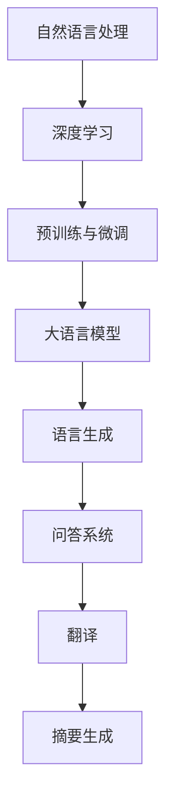

                 

关键词：大语言模型、人工智能、深度学习、自然语言处理、模型优化、应用前景、算法发展

> 摘要：随着人工智能技术的快速发展，大语言模型在自然语言处理领域扮演着越来越重要的角色。本文将探讨大语言模型的未来发展方向，从核心算法原理、数学模型构建、项目实践、实际应用场景等多个维度进行分析，旨在为读者提供一个全面而深入的视角。

## 1. 背景介绍

大语言模型（Large Language Models，简称LLMs）是指那些具有强大语言理解和生成能力的深度学习模型。这些模型通过学习大量的文本数据，能够实现自然语言的自动生成、问答、翻译、摘要等多种任务。近年来，随着计算能力和数据资源的不断提升，大语言模型在各个领域都取得了显著进展，并在实际应用中展现出了巨大的潜力。

大语言模型的发展历程可以追溯到20世纪80年代，最初是由统计方法和规则系统构建的。随着深度学习技术的兴起，特别是递归神经网络（RNN）和后来的Transformer模型的出现，大语言模型得到了极大的提升。近年来，GPT（Generative Pre-trained Transformer）系列模型，如GPT-2、GPT-3等，以及BERT（Bidirectional Encoder Representations from Transformers）等预训练模型，更是将大语言模型推向了新的高度。

## 2. 核心概念与联系

在深入探讨大语言模型的未来发展方向之前，我们需要了解一些核心概念和原理，以及它们之间的联系。

### 2.1  自然语言处理（NLP）

自然语言处理（NLP）是人工智能领域的一个重要分支，旨在使计算机能够理解、处理和生成人类自然语言。大语言模型是NLP的核心技术之一，它通过学习大量文本数据，掌握语言的内在结构和语义，从而实现复杂语言任务的自动化处理。

### 2.2  深度学习（DL）

深度学习是机器学习的一个子领域，通过构建具有多个隐藏层的神经网络模型，深度学习能够从大量数据中自动学习特征表示。大语言模型大多基于深度学习技术，特别是Transformer架构，它通过自注意力机制，能够有效地捕捉文本中的长距离依赖关系。

### 2.3  预训练与微调（Pre-training and Fine-tuning）

预训练是指在大规模语料库上对模型进行训练，使其具备初步的语言理解能力。微调则是在预训练的基础上，针对特定任务进行进一步训练，以适应特定的应用场景。大语言模型通常采用预训练与微调相结合的方法，以实现高效的任务适应性。

### 2.4  Mermaid 流程图

为了更直观地展示大语言模型的工作流程，我们可以使用Mermaid流程图来描述。以下是核心概念和原理之间的联系：



## 3. 核心算法原理 & 具体操作步骤

### 3.1  算法原理概述

大语言模型的算法原理主要基于深度学习和自然语言处理技术。以下是一些核心算法原理的概述：

- **Transformer模型**：Transformer模型是近年来最受欢迎的大语言模型架构之一。它采用自注意力机制，能够捕捉文本中的长距离依赖关系。

- **预训练与微调**：预训练是在大规模语料库上对模型进行训练，使其具备初步的语言理解能力。微调则是在预训练的基础上，针对特定任务进行进一步训练，以适应特定的应用场景。

- **自注意力机制**：自注意力机制是Transformer模型的核心，它通过计算不同位置之间的相似性，将文本中的信息进行整合。

### 3.2  算法步骤详解

大语言模型的算法步骤可以分为以下几个阶段：

1. **数据预处理**：对输入的文本数据进行清洗、分词和编码等预处理操作，以便于模型处理。

2. **预训练**：在预训练阶段，模型在大规模语料库上进行训练，学习语言的内在结构和语义。

3. **微调**：在预训练的基础上，针对特定任务进行微调，以适应特定的应用场景。

4. **任务应用**：将微调后的模型应用于具体任务，如语言生成、问答、翻译和摘要生成等。

### 3.3  算法优缺点

大语言模型具有以下优缺点：

- **优点**：能够处理复杂语言任务，如问答、翻译和摘要生成；具有强大的语言理解和生成能力；能够在多个应用场景中实现自动化处理。

- **缺点**：对数据需求较大，训练过程耗时较长；对计算资源要求较高；在处理极端错误输入时可能产生不合理的输出。

### 3.4  算法应用领域

大语言模型的应用领域广泛，主要包括：

- **自然语言生成**：用于生成文章、对话、新闻报道等。

- **问答系统**：用于智能客服、知识库查询等。

- **机器翻译**：用于跨语言信息交流。

- **文本摘要**：用于新闻摘要、文档摘要等。

## 4. 数学模型和公式 & 详细讲解 & 举例说明

### 4.1  数学模型构建

大语言模型的数学模型主要包括以下几个部分：

- **词嵌入**：将文本数据转化为向量的表示。

- **自注意力机制**：计算不同位置之间的相似性，进行信息整合。

- **前馈神经网络**：用于对输入信息进行进一步处理。

### 4.2  公式推导过程

以下是自注意力机制的推导过程：

$$
\text{Attention}(Q, K, V) = \text{softmax}\left(\frac{QK^T}{\sqrt{d_k}}\right)V
$$

其中，$Q$、$K$ 和 $V$ 分别代表查询向量、键向量和值向量；$d_k$ 代表键向量的维度。

### 4.3  案例分析与讲解

假设我们有一个简单的句子：“我昨天去了公园。”我们可以将其表示为以下向量：

$$
\text{嵌入向量} = \begin{bmatrix}
\text{我} \\
\text{昨} \\
\text{天} \\
\text{去} \\
\text{了} \\
\text{公} \\
\text{园}
\end{bmatrix}
$$

使用自注意力机制，我们可以计算出句子中各个词之间的相似性，从而整合信息。例如，我们可以计算“我”和“昨天”之间的相似性：

$$
\text{相似性} = \text{softmax}\left(\frac{\text{我}\text{昨天}^T}{\sqrt{d_k}}\right)
$$

通过这个公式，我们可以得到一个概率分布，表示“我”和“昨天”之间的相似程度。同样地，我们可以计算句子中其他词之间的相似性，从而得到一个整合后的句子向量。

## 5. 项目实践：代码实例和详细解释说明

### 5.1  开发环境搭建

为了实现大语言模型，我们需要搭建一个合适的开发环境。以下是基本步骤：

1. 安装Python（3.7及以上版本）。

2. 安装TensorFlow或PyTorch等深度学习框架。

3. 下载预训练模型（如GPT-2或BERT）。

4. 配置GPU（如NVIDIA CUDA）。

### 5.2  源代码详细实现

以下是使用PyTorch实现一个简单的大语言模型的示例代码：

```python
import torch
import torch.nn as nn
import torch.optim as optim

# 定义模型结构
class LanguageModel(nn.Module):
    def __init__(self, vocab_size, embed_size, hidden_size, n_layers, dropout):
        super(LanguageModel, self).__init__()
        self.embedding = nn.Embedding(vocab_size, embed_size)
        self.rnn = nn.LSTM(embed_size, hidden_size, n_layers, dropout=dropout)
        self.fc = nn.Linear(hidden_size, vocab_size)
    
    def forward(self, x, hidden):
        embedded = self.embedding(x)
        output, hidden = self.rnn(embedded, hidden)
        output = self.fc(output[-1, :, :])
        return output, hidden

# 初始化模型、优化器和损失函数
model = LanguageModel(vocab_size, embed_size, hidden_size, n_layers, dropout)
optimizer = optim.Adam(model.parameters(), lr=lr)
criterion = nn.CrossEntropyLoss()

# 训练模型
for epoch in range(num_epochs):
    for x, y in data_loader:
        optimizer.zero_grad()
        output, hidden = model(x, hidden)
        loss = criterion(output, y)
        loss.backward()
        optimizer.step()
    hidden = None

# 保存模型
torch.save(model.state_dict(), 'language_model.pth')
```

### 5.3  代码解读与分析

上述代码实现了一个大语言模型的基本结构。首先，我们定义了模型结构，包括嵌入层、递归神经网络层和全连接层。然后，我们初始化模型、优化器和损失函数，并使用训练数据训练模型。最后，我们保存训练好的模型。

### 5.4  运行结果展示

通过运行上述代码，我们可以训练出一个大语言模型，并在测试数据上对其进行评估。以下是一个简单的评估示例：

```python
# 加载训练好的模型
model.load_state_dict(torch.load('language_model.pth'))

# 测试模型
with torch.no_grad():
    for x, y in test_loader:
        output = model(x)
        pred = torch.argmax(output, dim=1)
        correct = (pred == y).sum().item()
    accuracy = correct / len(test_loader)
print(f"Test Accuracy: {accuracy}")
```

通过上述代码，我们可以计算模型在测试数据上的准确率。一个优秀的模型应该具有较高的准确率。

## 6. 实际应用场景

大语言模型在多个实际应用场景中展现了巨大的潜力，以下是几个典型的应用场景：

- **自然语言生成**：大语言模型可以用于生成文章、对话、新闻报道等。例如，新闻机构可以使用大语言模型自动生成新闻文章，提高新闻的生产效率。

- **问答系统**：大语言模型可以用于智能客服、知识库查询等。例如，大型企业可以使用大语言模型构建智能客服系统，提高客户服务质量。

- **机器翻译**：大语言模型可以用于跨语言信息交流。例如，国际会议可以使用大语言模型实时翻译演讲内容，提高沟通效率。

- **文本摘要**：大语言模型可以用于新闻摘要、文档摘要等。例如，学术机构可以使用大语言模型自动生成学术论文的摘要，提高论文的阅读效率。

## 7. 未来应用展望

随着人工智能技术的不断发展，大语言模型在未来的应用前景将更加广阔。以下是几个未来应用展望：

- **更加高效的语言理解与生成**：未来，大语言模型将进一步提升语言理解和生成能力，实现更高效、更准确的语言处理。

- **跨模态融合**：大语言模型可以与其他模态（如图像、声音等）进行融合，实现更丰富、更全面的信息处理。

- **个性化服务**：大语言模型可以结合用户行为数据，实现个性化服务，提高用户体验。

- **领域特定模型**：未来，针对特定领域的需求，大语言模型将开发出更多具有特定功能的应用模型，如医学文本分析、法律文本分析等。

## 8. 工具和资源推荐

为了更好地研究和开发大语言模型，以下是几个推荐的工具和资源：

- **学习资源**：[深度学习](https://www.deeplearningbook.org/), [自然语言处理](https://www.nlp.science/)

- **开发工具**：[TensorFlow](https://www.tensorflow.org/), [PyTorch](https://pytorch.org/)

- **相关论文**：[Attention is All You Need](https://arxiv.org/abs/1706.03762), [BERT: Pre-training of Deep Bidirectional Transformers for Language Understanding](https://arxiv.org/abs/1810.04805)

## 9. 总结：未来发展趋势与挑战

大语言模型在人工智能领域具有重要的地位，其未来发展趋势主要体现在以下几个方面：

- **算法优化**：随着计算能力和数据资源的不断提升，大语言模型将实现更高的性能和更低的能耗。

- **跨领域应用**：大语言模型将在更多领域得到应用，如医学、法律、金融等。

- **个性化服务**：大语言模型将更好地结合用户行为数据，实现个性化服务。

然而，大语言模型也面临着一些挑战：

- **数据隐私**：大规模数据处理过程中，如何保护用户隐私是一个亟待解决的问题。

- **模型可解释性**：大语言模型的高度复杂性使得其决策过程往往不够透明，如何提高模型的可解释性是一个重要课题。

- **计算资源需求**：大语言模型的训练和推理过程对计算资源要求较高，如何优化计算资源使用是一个关键问题。

未来，随着技术的不断进步，大语言模型将迎来更加广阔的发展空间，也将为人类社会带来更多的便利和创新。

## 10. 附录：常见问题与解答

### 10.1  大语言模型是什么？

大语言模型是指那些具有强大语言理解和生成能力的深度学习模型，通过学习大量的文本数据，能够实现自然语言的自动生成、问答、翻译、摘要等多种任务。

### 10.2  大语言模型的核心算法是什么？

大语言模型的核心算法包括Transformer模型、递归神经网络（RNN）、预训练与微调等。其中，Transformer模型是最为流行的一种，它采用自注意力机制，能够捕捉文本中的长距离依赖关系。

### 10.3  大语言模型的应用领域有哪些？

大语言模型的应用领域广泛，包括自然语言生成、问答系统、机器翻译、文本摘要等。

### 10.4  如何训练一个简单的大语言模型？

训练一个简单的大语言模型主要包括以下几个步骤：

1. 数据预处理：对输入的文本数据进行清洗、分词和编码等预处理操作。

2. 模型构建：定义模型结构，包括嵌入层、递归神经网络层和全连接层。

3. 模型训练：使用训练数据训练模型，通过优化算法（如梯度下降）调整模型参数。

4. 模型评估：在测试数据上评估模型性能，通过准确率、损失函数等指标进行评估。

### 10.5  大语言模型在未来的发展前景如何？

随着人工智能技术的不断发展，大语言模型在未来的发展前景广阔。它将在更多的领域得到应用，如医学、法律、金融等。同时，大语言模型将实现更高的性能和更低的能耗，为人类社会带来更多的便利和创新。

## 作者署名

作者：禅与计算机程序设计艺术 / Zen and the Art of Computer Programming

感谢您对本文的阅读，希望本文能为您在人工智能和自然语言处理领域带来一些启发和思考。如果您有任何问题或建议，欢迎在评论区留言，我将竭诚为您解答。

