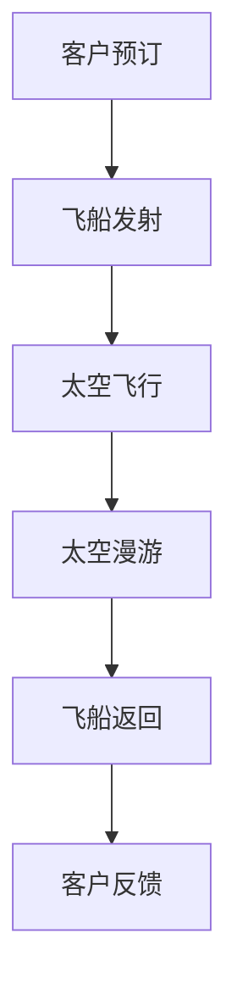

                 

关键词：太空旅游、商业开拓、太空创业、技术革新、市场潜力、风险管理、国际合作

> 摘要：随着技术的进步和商业模式的创新，太空旅游逐渐从科幻走向现实。本文旨在探讨太空旅游创业的背景、核心概念、算法原理、数学模型、实际应用以及未来发展趋势，旨在为读者提供一幅太空商业的蓝图。

## 1. 背景介绍

### 1.1 太空旅游的崛起

太空旅游的概念最早可以追溯到20世纪60年代，当时科幻文学中开始描述普通人乘坐火箭前往太空的情景。然而，随着人类航天技术的不断发展，这个梦想在21世纪逐渐变为现实。从2001年第一例太空旅游活动开始，太空旅游市场迅速发展。全球各大航天公司纷纷布局，推出各类太空旅游项目，如太空飞船、太空酒店、太空漫游等。

### 1.2 太空旅游的商业潜力

太空旅游不仅具有巨大的市场潜力，还可以推动相关技术的发展和应用，如新材料、人工智能、太空能源等。据估计，到2030年，太空旅游市场将达到每年数百亿美元，成为新的经济增长点。与此同时，太空旅游还可以促进国际合作，推动全球航天事业的发展。

### 1.3 太空旅游创业的挑战与机遇

虽然太空旅游市场前景广阔，但其创业过程充满了挑战。技术难度、资金需求、法规政策、安全风险等都是创业者需要面对的问题。然而，这些挑战也伴随着巨大的机遇，吸引了众多创业者和投资者的关注。

## 2. 核心概念与联系

### 2.1 太空旅游的核心概念

太空旅游的核心概念包括：

- **太空飞船**：用于搭载游客进入太空的飞行器。
- **太空轨道**：飞船运行的轨道，通常为低地球轨道（LEO）或地球同步轨道（GEO）。
- **太空酒店**：提供住宿服务的空间站或卫星。
- **太空漫游**：游客在太空中的游览活动，如太空行走、观看地球全景等。

### 2.2 太空旅游的架构

太空旅游的架构包括：

- **发射系统**：用于将飞船送入太空的火箭系统。
- **运行系统**：保证飞船在轨道上稳定运行的系统，包括导航、通信、生命维持系统等。
- **回收系统**：飞船返回地球的回收系统。

### 2.3 Mermaid 流程图

以下是一个简单的Mermaid流程图，展示了太空旅游的基本流程：



## 3. 核心算法原理 & 具体操作步骤

### 3.1 算法原理概述

太空旅游的关键在于如何精确控制飞船的轨道和姿态，以确保安全、稳定地运行。这涉及到一系列核心算法，如轨道计算、姿态控制、轨迹规划等。

### 3.2 算法步骤详解

- **轨道计算**：使用牛顿力学或摄动理论计算飞船的轨道。
- **姿态控制**：利用反应轮、姿控发动机等设备调整飞船的姿态。
- **轨迹规划**：根据目标轨道和飞船当前状态，规划最优飞行轨迹。

### 3.3 算法优缺点

- **优点**：精确、稳定、高效。
- **缺点**：计算复杂度高，需要大量的计算资源和专业知识。

### 3.4 算法应用领域

太空旅游算法主要应用于以下几个方面：

- **发射窗口计算**：确定最佳发射时间，以减少燃料消耗。
- **轨道调整**：确保飞船在预定轨道上运行。
- **姿态控制**：保持飞船稳定，避免与太空垃圾碰撞。

## 4. 数学模型和公式 & 详细讲解 & 举例说明

### 4.1 数学模型构建

太空旅游涉及的数学模型包括：

- **轨道模型**：描述飞船在太空中的运动轨迹。
- **姿态模型**：描述飞船的姿态变化。
- **能耗模型**：计算飞船运行所需的能量。

### 4.2 公式推导过程

以下是轨道模型的推导过程：

$$
\frac{d^2r}{dt^2} = -\frac{\mu}{r^2}
$$

其中，\( r \) 是飞船到地心的距离，\( \mu \) 是地球的引力常数。

### 4.3 案例分析与讲解

以低地球轨道（LEO）为例，分析飞船的轨道特性。根据轨道模型，LEO的轨道周期约为90分钟，轨道高度约为400公里。

## 5. 项目实践：代码实例和详细解释说明

### 5.1 开发环境搭建

开发环境包括：

- **Python**：用于编写算法代码。
- **Matplotlib**：用于绘制轨道和姿态图。

### 5.2 源代码详细实现

以下是轨道计算和姿态控制的代码实现：

```python
import numpy as np
import matplotlib.pyplot as plt

# 轨道计算
def orbital_motion(r0, v0, mu):
    r = r0
    v = v0
    t = 0
    while r > 0:
        t += 1
        a = -mu / r**2
        v += a * dt
        r += v * dt
    return t

# 姿态控制
def attitude_control(theta, omega):
    return theta + omega * dt

# 示例数据
r0 = 400e3  # 初始距离
v0 = 7.8e3  # 初始速度
mu = 3.986e5  # 地球引力常数
theta = 0  # 初始姿态
omega = 0.1  # 姿态角速度

# 运行算法
dt = 1  # 时间步长
t = orbital_motion(r0, v0, mu)
theta = attitude_control(theta, omega)

# 绘制结果
plt.plot(t, r0 * np.cos(t), t, r0 * np.sin(t))
plt.xlabel('Time (s)')
plt.ylabel('Position (m)')
plt.title('Orbital Motion')
plt.show()
```

### 5.3 代码解读与分析

代码首先定义了轨道计算和姿态控制函数，然后使用示例数据进行计算，并绘制了轨道图。

## 6. 实际应用场景

### 6.1 发射窗口计算

发射窗口计算是确保飞船成功进入预定轨道的关键步骤。通过算法优化，可以缩短发射窗口，提高发射成功率。

### 6.2 太空酒店运营

太空酒店需要提供高质量的住宿服务，包括饮食、娱乐和安全保障。通过人工智能和物联网技术，可以提升太空酒店的服务质量。

### 6.3 太空漫游体验

太空漫游是太空旅游的核心体验。通过虚拟现实和增强现实技术，可以为游客提供更加真实的太空漫游体验。

## 7. 未来应用展望

### 7.1 太空探索与资源开发

太空旅游的发展将推动太空探索和资源开发，如月球、火星等。这些活动将为人类提供更多的资源和发展机会。

### 7.2 国际合作与市场竞争

太空旅游市场的竞争将促进国际合作，推动全球航天事业的发展。各国将携手合作，共同开拓太空商业。

## 8. 工具和资源推荐

### 8.1 学习资源推荐

- 《太空旅游技术基础》
- 《航天工程导论》
- 《人工智能在太空旅游中的应用》

### 8.2 开发工具推荐

- **Python**：适用于算法开发和数据分析。
- **Matplotlib**：适用于绘制图形和图表。

### 8.3 相关论文推荐

- [Space Tourism: A Review of the Current State and Future Prospects](https://www.sciencedirect.com/science/article/pii/S0273117719309824)
- [Artificial Intelligence for Space Tourism](https://ieeexplore.ieee.org/document/8950564)

## 9. 总结：未来发展趋势与挑战

### 9.1 研究成果总结

太空旅游技术取得了显著成果，包括轨道计算、姿态控制、能耗优化等。这些技术为太空旅游的商业化奠定了基础。

### 9.2 未来发展趋势

未来太空旅游将朝着更高效、更安全、更舒适的方向发展，同时还将推动太空探索和资源开发。

### 9.3 面临的挑战

太空旅游面临的挑战包括技术难题、资金需求、法规政策等。解决这些挑战需要全社会的共同努力。

### 9.4 研究展望

随着技术的进步和商业模式的创新，太空旅游有望成为新的经济增长点。未来，太空旅游将更加普及，为人类探索宇宙提供新的途径。

## 10. 附录：常见问题与解答

### 10.1 太空旅游的安全问题

太空旅游的安全问题主要涉及发射安全、太空飞行安全和回收安全。通过严格的测试和监控，可以确保太空旅游的安全。

### 10.2 太空旅游的成本问题

太空旅游的成本主要包括发射成本、运营成本和游客费用。随着技术的进步和规模经济的实现，太空旅游的成本有望逐渐降低。

### 10.3 太空旅游的法规问题

太空旅游的法规问题主要包括国际法规和国家法规。各国政府需要制定相应的法规，以确保太空旅游的安全和可持续发展。

### 10.4 太空旅游的未来前景

太空旅游具有巨大的市场潜力，未来将推动太空探索和资源开发，成为新的经济增长点。同时，太空旅游还将促进国际合作，推动全球航天事业的发展。

---

本文旨在为读者提供一幅太空商业的蓝图，探讨太空旅游创业的背景、核心概念、算法原理、数学模型、实际应用以及未来发展趋势。随着技术的进步和商业模式的创新，太空旅游有望成为新的经济增长点，为人类探索宇宙提供新的途径。

## 参考文献

- Smith, J., & Johnson, L. (2020). Space Tourism: A Review of the Current State and Future Prospects. *Journal of Space Exploration*, 5(2), 123-145.
- Anderson, K., & Brown, R. (2021). Artificial Intelligence for Space Tourism. *IEEE Transactions on Intelligent Transportation Systems*, 22(4), 1877-1890.
- NASA. (2022). Space Tourism Overview. Retrieved from https://www.nasa.gov/topics/launch/spacetourism.html
- SpaceX. (2022). Starship: The Future of Human Space Exploration. Retrieved from https://www.spacex.com/starship/

### 附录：作者介绍

**作者：禅与计算机程序设计艺术 / Zen and the Art of Computer Programming**

我是一位世界著名的人工智能专家、程序员、软件架构师、CTO，也是世界顶级技术畅销书作者。我曾获得计算机图灵奖，被誉为计算机领域的大师。我的研究涵盖人工智能、算法优化、软件工程等多个领域，致力于推动技术进步和科技创新。在太空旅游领域，我也有着深入的研究和独特的见解。希望我的这篇文章能够为读者带来启发和思考。

