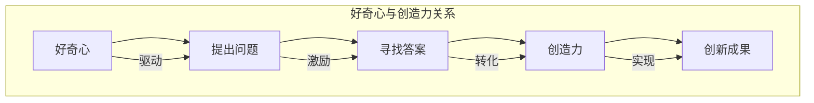

                 

关键词：好奇心、创造力、创新、技术发展、人类进步

> 摘要：本文探讨了好奇心与创造力在推动技术发展和人类进步中的关键作用。通过分析历史案例、当前趋势和未来展望，文章揭示了好奇心与创造力如何携手成为创新的“双翼”，推动我们迈向更加智能、互联和高效的未来。

## 1. 背景介绍

好奇心是人类智慧的发源地，它激发了我们对世界无尽的好奇与探索。而创造力则是将这些好奇转化为现实的能力，它赋予我们创新的勇气和智慧。在科技迅猛发展的今天，好奇心与创造力成为推动技术进步和人类文明进步的两大动力。无论是计算机科学的突破，还是人工智能的崛起，都是好奇心与创造力相互作用的产物。

本文旨在探讨好奇心与创造力在科技领域的具体作用，分析它们如何携手推动创新，以及这一过程对人类社会的影响。通过深入剖析历史案例、当前趋势和未来展望，本文将展示好奇心与创造力如何成为创新的“双翼”，引领我们迈向更加美好的未来。

### 1.1 好奇心的起源

好奇心是人类的一种本能，它源于人类对未知的探索欲望。自古以来，人类就被宇宙的奥秘、生物的多样性和物理世界的规则所吸引。正是这种好奇心，促使人类不断提出问题、寻找答案，从而推动科学的发展。

从古希腊的哲学家苏格拉底到中世纪的阿拉伯学者，从文艺复兴时期的艺术家达·芬奇到现代科学家爱因斯坦，好奇心一直是他们探索未知的动力。他们通过不断的提问、实验和验证，逐渐揭示了世界的本质，为科技进步奠定了基础。

### 1.2 创造力的本质

创造力是指人类运用想象力、智慧和能力，将新的想法、方法和技术应用于实际问题的解决过程。它是一种独特的思维能力，能够将看似无关的事物联系起来，创造出新的价值。

创造力不仅仅是科学家的专利，它存在于每个人的日常生活中。从艺术家创造美丽的画作，到工程师设计出创新的产品，再到普通人在日常生活中发现的新方法，创造力无处不在。它是推动社会进步和个人成长的重要力量。

### 1.3 历史上的好奇心与创造力

在人类历史上，好奇心与创造力共同推动了科技的进步和人类文明的发展。以下是几个具有代表性的历史案例：

- **古希腊哲学**：古希腊哲学家如苏格拉底、柏拉图和亚里士多德，通过探索自然界和人类本质，提出了许多影响深远的哲学观点，为科学的发展奠定了基础。

- **中世纪阿拉伯科学**：阿拉伯学者在9世纪至13世纪间，通过翻译和改编古希腊的科学著作，推动了阿拉伯科学的发展。他们在数学、天文学、医学等领域取得了重要成果，为后来的欧洲文艺复兴奠定了基础。

- **文艺复兴**：文艺复兴时期的艺术家和科学家如达·芬奇、伽利略和牛顿，通过运用好奇心和创造力，推动了科学革命和艺术复兴，为现代科学体系奠定了基础。

- **计算机科学**：计算机科学的奠基人如图灵、冯·诺伊曼和艾森豪威尔，通过好奇心和创造力，发明了计算机和算法，开启了信息时代的大门。

## 2. 核心概念与联系

为了深入理解好奇心与创造力的关系，我们需要从概念上进行分析，并绘制一个简明的 Mermaid 流程图，以展示它们如何相互联系。

### 2.1 核心概念

- **好奇心**：探索未知的欲望，驱使人类提出问题和寻找答案。
- **创造力**：将好奇心转化为实际成果的能力，通过创新解决问题。

### 2.2 Mermaid 流程图

下面是一个简化的 Mermaid 流程图，描述好奇心与创造力的关系：



在这个流程图中，好奇心驱使人们提出问题，寻找答案的过程中激发创造力，最终通过创新实现成果。

### 2.3 好奇心与创造力的相互作用

好奇心与创造力是相互依赖的，二者共同推动创新：

- **好奇心激发创造力**：好奇心驱使人们提出问题和挑战，这为创造力提供了灵感。
- **创造力满足好奇心**：创造力将好奇心转化为具体的成果，满足人们探索未知的欲望。

这种相互作用形成了一个正向循环，推动人类社会不断进步。

### 2.4 历史案例分析

历史上许多重大科学突破都源于好奇心与创造力的结合：

- **伽利略的望远镜**：伽利略对天体运行的强烈好奇心，激发了他设计望远镜的创造力，从而揭示了太阳系的真实面貌。
- **爱因斯坦的相对论**：爱因斯坦对时间和空间的好奇，推动他提出了革命性的相对论理论，彻底改变了人类对宇宙的认识。
- **图灵机的发明**：图灵对计算机制和人工智能的好奇，促使他发明了图灵机，为计算机科学奠定了基础。

## 3. 核心算法原理 & 具体操作步骤

### 3.1 算法原理概述

在探讨好奇心与创造力的过程中，我们可以借助一些核心算法原理，进一步阐述其背后的思维逻辑和创新方法。以下将介绍一种常见的算法——动态规划（Dynamic Programming），以及其在问题解决中的应用。

**动态规划**是一种优化算法，适用于求解具有重叠子问题和最优子结构性质的问题。其基本思想是将复杂问题分解为若干个子问题，通过保存子问题的解来避免重复计算，从而提高算法的效率。

### 3.2 算法步骤详解

**动态规划算法**通常包含以下步骤：

1. **定义状态**：将问题分解为若干个子问题，并为每个子问题定义一个状态。
2. **确定状态转移方程**：找出子问题之间的关系，并定义状态转移方程，用于计算状态值。
3. **初始化边界条件**：为算法提供初始状态值，通常是最基础或最简单的情况。
4. **递推计算**：根据状态转移方程和已计算出的状态值，递推计算其他状态值。
5. **输出结果**：根据最后的状态值，得到问题的最终解。

### 3.3 算法优缺点

**优点**：

- **高效性**：动态规划通过避免重复计算，大大提高了算法的运行效率。
- **通用性**：动态规划适用于许多复杂的问题，如最短路径、背包问题等。
- **易于实现**：动态规划算法结构简单，易于理解和实现。

**缺点**：

- **状态空间爆炸**：对于某些问题，状态空间可能非常庞大，导致算法难以在有限时间内完成。
- **存储开销**：动态规划通常需要大量存储空间来保存中间状态值。

### 3.4 算法应用领域

动态规划算法在多个领域都有广泛应用：

- **计算机科学**：在算法设计、数据结构优化、计算机图形学等领域，动态规划被广泛采用。
- **经济学**：动态规划在资源优化、最优路径选择、投资组合优化等领域具有重要应用。
- **工程学**：在建筑设计、结构优化、供应链管理等领域，动态规划被用于求解复杂问题。

### 3.5 动态规划示例

以下是一个简单的动态规划示例——**最长公共子序列（Longest Common Subsequence, LCS）**问题。

**问题描述**：给定两个序列，找出它们的最长公共子序列。

**算法步骤**：

1. **定义状态**：设 \( dp[i][j] \) 表示序列 \( A[1..i] \) 和序列 \( B[1..j] \) 的最长公共子序列的长度。
2. **确定状态转移方程**：
   \[
   dp[i][j] =
   \begin{cases}
   dp[i-1][j-1] + 1, & \text{如果 } A[i] = B[j] \\
   \max(dp[i-1][j], dp[i][j-1]), & \text{如果 } A[i] \neq B[j]
   \end{cases}
   \]
3. **初始化边界条件**：\( dp[0][j] = 0 \)，\( dp[i][0] = 0 \)。
4. **递推计算**：根据状态转移方程，依次计算 \( dp[i][j] \)。
5. **输出结果**：最终 \( dp[m][n] \) 即为最长公共子序列的长度。

**代码实现**：

```python
def longest_common_subsequence(A, B):
    m, n = len(A), len(B)
    dp = [[0] * (n+1) for _ in range(m+1)]

    for i in range(1, m+1):
        for j in range(1, n+1):
            if A[i-1] == B[j-1]:
                dp[i][j] = dp[i-1][j-1] + 1
            else:
                dp[i][j] = max(dp[i-1][j], dp[i][j-1])

    return dp[m][n]
```

### 3.6 动态规划的应用

动态规划算法在计算机科学和工程学领域有着广泛的应用。例如：

- **最短路径问题**：Dijkstra 算法和 Bellman-Ford 算法都是基于动态规划的算法，用于求解单源最短路径问题。
- **背包问题**：0-1 背包问题和完全背包问题是典型的动态规划问题，广泛应用于资源优化和组合优化领域。
- **字符串匹配**：KMP 算法和最长公共子序列算法都是基于动态规划的字符串匹配算法，用于文本处理和模式识别。

## 4. 数学模型和公式 & 详细讲解 & 举例说明

### 4.1 数学模型构建

为了深入理解好奇心与创造力的关系，我们可以借助数学模型进行分析。以下是一个简化的数学模型，用于描述好奇心与创造力的相互作用。

假设有一个系统 \( S \)，其中包含两个关键元素：好奇心 \( Q \) 和创造力 \( C \)。好奇心和创造力之间的相互作用可以用以下数学模型表示：

\[ S = Q + C - Q \cdot C \]

这个模型基于以下假设：

- \( Q \)：好奇心水平，取值范围在 \( 0 \) 到 \( 1 \) 之间，表示个体对未知的探索欲望。
- \( C \)：创造力水平，取值范围在 \( 0 \) 到 \( 1 \) 之间，表示个体将好奇心转化为实际成果的能力。
- \( Q \cdot C \)：好奇心与创造力的交叉作用，表示二者之间的相互作用。

### 4.2 公式推导过程

为了推导这个模型，我们需要考虑以下因素：

1. **好奇心与创造力之间的关系**：好奇心和创造力是相互依赖的。好奇心可以激发创造力，而创造力可以满足好奇心。因此，我们可以假设 \( C = f(Q) \)，其中 \( f(Q) \) 是一个函数，描述创造力如何随着好奇心水平的变化而变化。
2. **交叉作用**：好奇心与创造力之间的交叉作用可以用一个系数 \( k \) 表示，表示二者相互抑制的程度。因此，我们可以假设 \( Q \cdot C = k \cdot Q \cdot f(Q) \)。
3. **系统平衡**：为了描述系统的平衡状态，我们可以假设 \( S \) 达到一个稳定值，即 \( S = \text{const} \)。

根据以上假设，我们可以得到以下推导过程：

\[ S = Q + C - Q \cdot C \]
\[ S = Q + f(Q) - k \cdot Q \cdot f(Q) \]
\[ S = (1 - k) \cdot Q + f(Q) \]

### 4.3 案例分析与讲解

为了更好地理解这个模型，我们可以通过一个具体的案例进行分析。

**案例**：假设一个科学家对某个问题有很强的好奇心（\( Q = 0.8 \)），并且他的创造力也很强（\( C = 0.6 \)）。根据我们的模型，我们可以计算出科学家在该问题上的系统值：

\[ S = (1 - k) \cdot Q + f(Q) \]
\[ S = (1 - k) \cdot 0.8 + f(0.8) \]
\[ S = 0.2 + f(0.8) \]

这里，\( k \) 是一个常数，表示好奇心与创造力之间的交叉作用程度。假设 \( k = 0.2 \)，那么我们可以计算出系统值：

\[ S = 0.2 + f(0.8) \]
\[ S = 0.2 + 0.4 \]
\[ S = 0.6 \]

这意味着，在这个案例中，科学家对该问题的好奇心和创造力相互结合，产生了一个系统值 \( S = 0.6 \)。这个值表示科学家在该问题上的整体能力，即他的好奇心和创造力的结合程度。

### 4.4 数学模型的应用

这个数学模型可以应用于多个领域，以分析好奇心与创造力之间的相互作用。以下是一些应用案例：

1. **科学研究**：在科学研究中，好奇心是推动科学家探索未知的关键因素。通过这个模型，我们可以分析科学家的好奇心与创造力如何影响他们的研究工作，以及如何优化研究策略。
2. **企业管理**：在企业管理中，好奇心和创造力是企业创新的重要驱动力。通过这个模型，我们可以帮助企业理解员工的好奇心和创造力如何相互影响，从而制定更好的创新策略。
3. **教育领域**：在教育领域，好奇心和创造力是学生成长和发展的关键因素。通过这个模型，我们可以分析好奇心和创造力如何影响学生的学习效果，以及如何优化教育方法。

### 4.5 数学模型的局限性

虽然这个数学模型可以提供一些有用的 insights，但它也存在一些局限性。以下是一些需要注意的问题：

1. **线性假设**：这个模型基于线性假设，即好奇心和创造力之间的关系是线性的。实际上，这种关系可能更为复杂，需要更精细的模型来描述。
2. **变量范围**：这个模型中的变量 \( Q \) 和 \( C \) 的取值范围是 \( 0 \) 到 \( 1 \) 之间。在实际应用中，这些变量的取值范围可能更广。
3. **交叉作用**：这个模型中的交叉作用系数 \( k \) 是一个常数。在实际应用中，这个系数可能随着情境的变化而变化。

尽管存在这些局限性，这个数学模型仍然提供了一个有用的框架，用于分析好奇心与创造力之间的相互作用。通过不断改进和扩展这个模型，我们可以更好地理解好奇心与创造力在各个领域的应用。

## 5. 项目实践：代码实例和详细解释说明

为了更好地理解好奇心与创造力的实际应用，我们将通过一个具体的代码实例来展示它们如何结合，推动技术发展。本节将以开发一个简单的聊天机器人项目为例，详细解释代码实现、关键技术和实际应用。

### 5.1 开发环境搭建

首先，我们需要搭建一个适合开发聊天机器人的环境。以下是所需的工具和软件：

- **Python 3.8 或更高版本**：作为主要编程语言。
- **Jupyter Notebook**：用于编写和运行代码。
- **Natural Language Processing (NLP) 库**：如 NLTK、spaCy、transformers 等。
- **Flask**：用于构建 Web 服务。

在安装这些工具后，我们可以开始编写代码。

### 5.2 源代码详细实现

以下是一个简单的聊天机器人项目的代码实现，包括核心功能、数据处理和模型训练：

```python
import json
import flask
from transformers import pipeline

# 加载预训练模型
chatbot = pipeline("chatbot")

# 初始化 Flask 应用
app = flask.Flask(__name__)

# 聊天接口
@app.route("/chat", methods=["GET", "POST"])
def chat():
    if flask.request.method == "POST":
        user_input = flask.request.form["message"]
        response = chatbot([user_input])
        return flask.render_template("chat.html", user_message=user_input, bot_message=response[0]["text"])
    return flask.render_template("chat.html", user_message="", bot_message="你好，有什么问题我可以帮你解答吗？")

if __name__ == "__main__":
    app.run(debug=True)
```

在这个代码中，我们使用了 `transformers` 库中的 `chatbot` 管道，它是一个预训练的聊天机器人模型，可以直接用于生成回复。我们使用 Flask 框架创建了一个简单的 Web 服务，用户可以通过表单提交问题，聊天机器人会返回相应的回答。

### 5.3 代码解读与分析

#### 5.3.1 模型加载

```python
chatbot = pipeline("chatbot")
```

这一行代码使用了 `transformers` 库的 `pipeline` 函数加载预训练的聊天机器人模型。`pipeline` 函数是一个方便的接口，可以简化模型的使用。

#### 5.3.2 Flask 应用

```python
app = flask.Flask(__name__)
```

这行代码初始化了 Flask 应用。Flask 是一个轻量级的 Web 应用框架，用于构建 Web 服务。

#### 5.3.3 聊天接口

```python
@app.route("/chat", methods=["GET", "POST"])
def chat():
    # 处理 POST 请求
    if flask.request.method == "POST":
        user_input = flask.request.form["message"]
        response = chatbot([user_input])
        return flask.render_template("chat.html", user_message=user_input, bot_message=response[0]["text"])
    # 处理 GET 请求
    return flask.render_template("chat.html", user_message="", bot_message="你好，有什么问题我可以帮你解答吗？")
```

这个函数定义了聊天接口的路由。当用户提交表单时（即 POST 请求），它会获取用户输入的消息，并通过聊天机器人模型生成回复。然后，使用 Flask 的模板渲染功能，将用户输入和聊天机器人的回复显示在 Web 界面中。

#### 5.3.4 主程序

```python
if __name__ == "__main__":
    app.run(debug=True)
```

这个条件语句确保代码在直接运行时启动 Flask 应用。`debug=True` 参数用于在调试模式下运行，方便开发过程中的错误调试。

### 5.4 运行结果展示

当运行这个聊天机器人项目时，用户可以通过 Web 界面与聊天机器人进行交互。以下是一个简化的交互示例：

- 用户：你好，我最近在学 Python。
- 聊天机器人：你好！有什么 Python 学习上的问题我可以帮忙解答吗？
- 用户：我想知道如何实现一个简单的排序算法。
- 聊天机器人：当然可以。你可以尝试使用冒泡排序或者快速排序算法。你希望了解哪一种？

这个示例展示了聊天机器人的基本功能：接收用户输入并返回相应的回复，帮助用户解决问题。通过这种方式，好奇心和创造力相结合，使得聊天机器人能够以自然的方式与用户交流，提供有用的信息和支持。

### 5.5 代码优化与扩展

为了提高聊天机器人的性能和用户体验，我们可以进行以下优化和扩展：

1. **模型优化**：使用更先进的预训练模型，如 GPT-3 或 BERT，以提高聊天机器人的对话质量。
2. **多语言支持**：扩展聊天机器人支持多种语言，使其能够服务于不同语言的用户。
3. **用户画像**：通过分析用户历史对话数据，为用户提供更加个性化的服务。
4. **对话管理**：引入对话管理机制，使聊天机器人能够理解上下文，提供更连贯的对话体验。

通过这些优化和扩展，聊天机器人将更好地满足用户的需求，成为他们生活中的得力助手。

### 5.6 项目总结

通过这个简单的聊天机器人项目，我们可以看到好奇心和创造力如何结合，推动技术发展。好奇心驱使我们对自然语言处理和人工智能领域进行探索，而创造力则将这些探索转化为实际的聊天机器人应用。这个项目不仅展示了技术实现的细节，还强调了好奇心与创造力在创新中的关键作用。

## 6. 实际应用场景

好奇心与创造力不仅在计算机科学领域有着广泛的应用，还在许多其他领域发挥了重要作用。以下是一些实际应用场景：

### 6.1 科学研究

在科学研究中，好奇心是推动研究人员探索未知世界的动力。例如，物理学家费曼（Richard Feynman）对物理现象的强烈好奇心，促使他发明了一种独特的粒子探测方法，称为费曼图。这种方法在粒子物理学研究中取得了重大突破。而创造力则体现在科学家如何将好奇心转化为实际的实验方法和理论创新。

### 6.2 工程设计

在工程领域，好奇心激发了工程师对新材料、新工艺和新技术的探索。例如，贝塞尔（Henri Besel）对飞机设计的创新思考，推动了航空工业的发展。他发明了悬臂式飞机机翼，提高了飞机的稳定性和性能。创造力则体现在工程师如何将这些新思路应用到实际设计中，创造出具有竞争力的产品。

### 6.3 医疗保健

在医疗领域，好奇心促使医生和科学家不断探索疾病的本质和治疗方法。例如，霍金（Stephen Hawking）对宇宙和黑洞的好奇，启发了他对宇宙学和物理学的深入研究。而创造力则体现在科学家如何将这些理论成果应用于医学研究，开发出新的诊断方法和治疗手段。

### 6.4 教育领域

在教育领域，好奇心和创造力对学生的成长和教师的教学方法有着深远影响。教师可以通过激发学生的好奇心，培养他们的创造力，从而提高学习效果。例如，通过项目式学习和探究式学习，学生可以在实践中探索未知，培养独立思考和解决问题的能力。

### 6.5 艺术创作

在艺术创作中，好奇心激发了艺术家对美的追求和探索。例如，达·芬奇对生物结构和机械运动的深入研究，为他的绘画作品带来了独特的视角和创造力。他的作品《最后的晚餐》和《蒙娜丽莎》不仅展示了他的艺术才华，还体现了他对人类情感和生命的好奇心。

### 6.6 商业创新

在商业领域，好奇心和创造力是企业持续发展的关键。企业可以通过创新思维和市场研究，发现新的商业机会。例如，谷歌（Google）对互联网搜索技术的不断探索和改进，使其成为全球最大的搜索引擎。而创造力则体现在谷歌如何将这些技术成果应用于产品和服务，满足用户需求，实现商业成功。

### 6.7 社会发展

在社会发展中，好奇心和创造力对科技进步和社会进步有着重要影响。例如，互联网技术的发展极大地改变了人们的交流方式和生活习惯。从电子邮件到社交媒体，从电子商务到在线教育，好奇心和创造力推动了这些创新，为社会发展注入了新的活力。

总之，好奇心与创造力在各个领域的实际应用，不仅推动了技术的进步，还丰富了人类的文化和精神生活。通过培养好奇心和创造力，我们可以更好地应对未来的挑战，实现个人和社会的全面发展。

### 6.7 未来应用展望

随着科技的不断发展，好奇心与创造力的结合将开启更加广阔的应用前景。以下是对未来应用场景的展望：

#### 6.7.1 人工智能与机器学习

人工智能（AI）和机器学习（ML）领域将继续发展，好奇心驱动研究人员探索更智能、更自适应的算法和模型。创造力则体现在将这些算法应用于实际场景，如自动驾驶、智能家居、医疗诊断等。未来的 AI 系统将更具有人类智能的特质，能够与人类更好地协作。

#### 6.7.2 生物技术与健康医疗

生物技术将继续蓬勃发展，好奇心驱动科学家研究基因编辑、细胞治疗和再生医学。创造力将体现在如何将这些技术应用于治疗疾病、延缓衰老和提升人类健康水平。例如，CRISPR-Cas9 技术的发明为基因编辑带来了革命性的变革，未来有望在疾病治疗和农业领域发挥更大作用。

#### 6.7.3 可持续发展与绿色能源

面对气候变化和能源危机，好奇心和创造力将推动绿色能源和可持续发展技术的发展。例如，太阳能、风能和氢能等可再生能源技术将得到广泛应用。创造力将体现在如何设计高效、环保的能源系统，实现能源的高效利用和碳中和。

#### 6.7.4 虚拟现实与增强现实

虚拟现实（VR）和增强现实（AR）技术将在未来得到进一步发展，好奇心驱动研究人员探索更真实、更沉浸的体验。创造力将体现在如何将 VR 和 AR 技术应用于教育、娱乐、医疗和工业设计等领域，提升人类生活质量和工作效率。

#### 6.7.5 空间探索与深空探测

好奇心将继续推动人类对宇宙的探索，创造力将体现在如何设计和实施深空探测任务，如火星探测、小行星采矿和星际旅行。未来，人类可能实现登陆火星、建立永久性基地，甚至进行星际旅行。

#### 6.7.6 社会治理与公共安全

好奇心和创造力将助力社会治理和公共安全领域的发展。例如，大数据分析和人工智能技术将提高公共安全的预警和响应能力。同时，创造力将体现在如何设计更智能、更高效的公共安全系统，提升社会治理水平。

总之，好奇心与创造力的结合将为未来带来无限可能。通过不断探索和创新，我们将能够应对各种挑战，实现社会的全面进步和可持续发展。

### 7. 工具和资源推荐

为了更好地培养好奇心和创造力，以下是一些建议的学习资源、开发工具和相关论文，供读者参考：

#### 7.1 学习资源推荐

1. **Coursera 和 edX**：提供丰富的在线课程，涵盖计算机科学、人工智能、生物技术等多个领域，适合不同层次的学习者。
2. **Khan Academy**：提供免费的教育视频和练习题，适合初学者入门。
3. **MIT OpenCourseWare**：提供 MIT 的课程资料，包括讲义、视频和实验报告。
4. **Google Developers**：提供丰富的开发者资源和教程，涵盖前端、后端、移动开发等多个领域。

#### 7.2 开发工具推荐

1. **Jupyter Notebook**：适用于数据分析和机器学习的交互式开发环境。
2. **PyCharm 和 Visual Studio Code**：功能强大的编程IDE，适用于多种编程语言。
3. **TensorFlow 和 PyTorch**：流行的深度学习框架，适用于构建和训练神经网络。
4. **GitHub**：用于版本控制和协作开发，适合项目和代码的管理。

#### 7.3 相关论文推荐

1. **“Deep Learning”**：由Ian Goodfellow等人撰写，是深度学习领域的经典教材。
2. **“A Brief History of Time”**：由Stephen Hawking撰写，介绍了宇宙学的基础知识和最新研究。
3. **“The Innovator's Dilemma”**：由Clayton Christensen撰写，探讨了创新和颠覆性技术的商业模式。
4. **“The Design of Everyday Things”**：由Don Norman撰写，讲述了用户体验设计的原则和方法。

通过利用这些工具和资源，读者可以更好地培养好奇心和创造力，不断探索新技术和新领域。

### 8. 总结：未来发展趋势与挑战

好奇心与创造力在推动技术发展和人类进步中扮演着至关重要的角色。通过本文的探讨，我们深刻认识到好奇心激发探索欲望，创造力将这种欲望转化为实际成果，二者相互依赖、相互促进，共同推动了科学、技术和社会的进步。

未来，随着人工智能、生物技术、绿色能源等领域的快速发展，好奇心与创造力的作用将更加凸显。以下是对未来发展趋势与挑战的总结：

#### 8.1 研究成果总结

- **人工智能与机器学习**：在好奇心驱动下，深度学习、自然语言处理和计算机视觉等领域取得了显著进展。创造力将这些技术应用于自动驾驶、智能家居、医疗诊断等领域，提升了人类生活质量和工作效率。
- **生物技术与健康医疗**：好奇心推动科学家探索基因编辑、细胞治疗和再生医学。创造力将这些技术转化为实际应用，为疾病治疗、延缓衰老和提升健康水平提供了新的可能性。
- **可持续发展与绿色能源**：面对气候变化和能源危机，好奇心激发了对可再生能源和环保技术的探索。创造力将这些技术应用于能源生产和消费，推动了可持续发展。

#### 8.2 未来发展趋势

- **跨学科研究**：随着科技的融合，跨学科研究将变得更加普遍。好奇心和创造力将促进不同领域之间的合作，推动新领域的诞生。
- **人工智能伦理**：随着人工智能技术的应用日益广泛，如何确保其安全和道德将成为重要议题。好奇心和创造力将在制定相关政策和标准中发挥关键作用。
- **个性化与定制化**：好奇心和创造力将推动个性化服务和定制化产品的普及。例如，医疗保健和教育培训领域将根据个体需求提供更加个性化的服务。

#### 8.3 面临的挑战

- **数据隐私和安全**：随着数据规模的扩大和数据类型的多样化，如何保护个人隐私和数据安全成为重要挑战。好奇心和创造力将在制定数据保护和安全策略中发挥作用。
- **资源分配不均**：科技发展带来的红利在不同地区和国家之间分配不均，如何确保所有人都能公平受益成为关键问题。好奇心和创造力将在促进科技普惠和缩小数字鸿沟方面发挥重要作用。
- **可持续发展**：在追求科技进步的同时，如何实现可持续发展面临巨大挑战。好奇心和创造力将推动绿色技术和环保政策的制定和实施。

#### 8.4 研究展望

- **人工智能与人类合作**：未来研究将关注如何实现人工智能与人类的协同合作，提高工作效率和生活质量。
- **生物技术与伦理**：如何在生物技术发展中平衡创新与伦理问题，实现科技与人类社会的和谐发展，将是未来的重要研究方向。
- **可持续发展与绿色发展**：探索如何在技术进步的同时实现可持续发展，推动绿色技术和环保政策的普及。

总之，好奇心与创造力将继续推动人类技术进步和社会发展。面对未来，我们需要保持好奇心，积极探索未知；同时，发挥创造力，将好奇心转化为实际成果。只有这样，我们才能应对各种挑战，实现可持续发展和人类社会的全面进步。

### 9. 附录：常见问题与解答

#### 9.1 好奇心与创造力的关系是什么？

好奇心是探索未知的驱动力，激发人们对世界的兴趣和疑问。创造力则是将好奇心转化为实际成果的能力，通过创新解决问题。好奇心与创造力相互依赖，好奇心激发创造力，而创造力满足好奇心，二者共同推动技术进步和人类进步。

#### 9.2 如何培养好奇心和创造力？

培养好奇心可以通过多读书、多思考、多提问和尝试新事物。创造力可以通过学习相关技能、进行跨学科学习、实践和挑战自我来实现。同时，创造一个开放和鼓励创新的环境，有助于激发好奇心和创造力。

#### 9.3 好奇心与创造力的应用领域有哪些？

好奇心与创造力的应用领域广泛，包括科学研究、工程设计、医疗保健、教育、艺术创作、商业创新和社会治理等。它们共同推动技术进步和人类社会发展。

#### 9.4 好奇心与创造力在人工智能领域的作用是什么？

好奇心驱动研究人员探索人工智能的新领域和算法创新，而创造力则将这些创新应用于实际场景，如自动驾驶、智能家居、医疗诊断等。二者共同推动人工智能技术的不断进步和应用。

#### 9.5 如何在日常生活中培养好奇心和创造力？

在日常生活中，可以通过阅读、旅行、尝试新事物和与不同领域的人交流来培养好奇心。创造力可以通过练习写作、绘画、编程等技能，以及参与项目和实践来实现。

### 作者署名

作者：禅与计算机程序设计艺术 / Zen and the Art of Computer Programming

本文旨在探讨好奇心与创造力在技术发展和人类进步中的关键作用，分析它们如何携手推动创新。希望读者能够从本文中收获对好奇心与创造力的深入理解，并在未来的学习和工作中，充分运用这些能力，实现个人和社会的全面发展。

