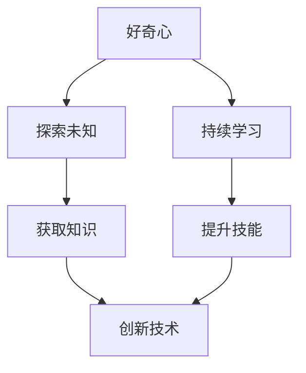

                 

 好奇心是推动人类进步的原始动力，它促使我们不断探索未知的领域，追求更深刻的理解。在信息技术领域，好奇心和持续学习显得尤为重要。本文旨在探讨好奇心和持续学习在IT领域的核心作用，分析其对个人成长和行业发展的影响，并提出一些建议，帮助读者在信息技术领域保持好奇心和持续学习的热情。

## 1. 背景介绍

在信息技术迅猛发展的时代，人工智能、大数据、云计算等前沿技术的崛起不断颠覆传统行业，催生出众多新的商业模式和应用场景。面对日新月异的技术变革，IT从业者必须具备强烈的好奇心和持续学习的动力，才能紧跟时代步伐，适应市场需求。

### 1.1 好奇心的重要性

好奇心是人类探索未知的本能，它驱动我们提出问题、寻求答案，从而推动科学和技术的进步。在IT领域，好奇心激发了我们对新技术、新工具的探索欲望，促使我们不断尝试和突破，从而推动技术不断创新。

### 1.2 持续学习的重要性

持续学习是IT从业者保持竞争力的重要手段。技术更新换代速度极快，新知识、新技能层出不穷，只有不断学习，才能跟上时代的步伐，保持自己的专业素养和竞争力。

## 2. 核心概念与联系

### 2.1 好奇心的定义与作用

好奇心是一种强烈的求知欲，驱使人们探索未知、发现新奇。在IT领域，好奇心表现为对新技术、新工具的探索兴趣，以及对现有技术的改进和创新。

### 2.2 持续学习的概念与价值

持续学习是一种终身学习的理念，强调不断获取新知识、新技能，以适应不断变化的工作环境和市场需求。在IT领域，持续学习有助于提升个人技能和职业素养，增强竞争力。

### 2.3 好奇心与持续学习的关联

好奇心和持续学习密不可分。好奇心是持续学习的动力源泉，而持续学习则是好奇心在实践中得到验证和发展的过程。两者相辅相成，共同推动个人的成长和技术的进步。

### 2.4 Mermaid 流程图

下面是关于好奇心与持续学习在IT领域关联的Mermaid流程图：



## 3. 核心算法原理 & 具体操作步骤

### 3.1 算法原理概述

在IT领域，好奇心和持续学习体现在算法的不断改进和创新。以下是一个简单的算法原理概述，以帮助读者更好地理解。

### 3.2 算法步骤详解

#### 3.2.1 问题定义

首先，明确需要解决的问题是什么。例如，在数据分析领域，可能需要解决数据清洗、特征提取或预测建模等问题。

#### 3.2.2 研究相关文献

通过阅读相关文献，了解现有技术的优缺点，为算法设计提供理论基础。

#### 3.2.3 设计算法

根据问题定义和研究结果，设计合适的算法。在算法设计中，可以借鉴现有技术，也可以创新性地提出新的算法。

#### 3.2.4 实现与测试

将算法实现为代码，并在实际数据集上进行测试。通过测试，评估算法的性能和效果。

#### 3.2.5 优化与改进

根据测试结果，对算法进行优化和改进。优化目标可以是提高算法的准确性、效率或可扩展性。

### 3.3 算法优缺点

- **优点**：好奇心和持续学习促使算法不断改进，提高解决问题的能力。
- **缺点**：在追求创新的过程中，可能面临技术风险和不确定性。

### 3.4 算法应用领域

好奇心和持续学习在算法设计中的应用非常广泛，包括但不限于以下领域：

- 数据分析
- 人工智能
- 机器学习
- 云计算
- 网络安全

## 4. 数学模型和公式 & 详细讲解 & 举例说明

### 4.1 数学模型构建

在IT领域，数学模型是描述和解决问题的重要工具。以下是一个简单的数学模型构建过程：

#### 4.1.1 问题定义

假设我们要解决一个优化问题，目标是找到一组变量，使得某个目标函数最小化。

#### 4.1.2 确定变量

定义一组变量，表示问题的解。

#### 4.1.3 确定目标函数

根据问题定义，确定一个目标函数，表示要优化的目标。

#### 4.1.4 确定约束条件

确定一组约束条件，限制变量的取值范围。

### 4.2 公式推导过程

以下是一个简单的线性规划问题公式推导过程：

#### 4.2.1 确定目标函数

假设目标函数为 \( f(x) = c^T x \)，其中 \( c \) 为系数向量，\( x \) 为变量向量。

#### 4.2.2 确定约束条件

约束条件为 \( Ax \leq b \)，其中 \( A \) 为系数矩阵，\( b \) 为常数向量。

#### 4.2.3 公式推导

通过拉格朗日乘子法，可以得到线性规划问题的公式：

$$
L(x, \lambda) = c^T x + \lambda^T (Ax - b)
$$

其中 \( \lambda \) 为拉格朗日乘子。

### 4.3 案例分析与讲解

以下是一个简单的线性规划问题案例，说明如何使用数学模型解决问题。

#### 4.3.1 问题定义

假设我们要在两个任务之间分配资源，使得总收益最大化。任务1需要3个资源，收益为2；任务2需要2个资源，收益为3。

#### 4.3.2 数学模型构建

定义变量 \( x_1 \) 和 \( x_2 \)，分别表示任务1和任务2的资源分配。

目标函数：\( f(x_1, x_2) = 2x_1 + 3x_2 \)

约束条件：\( x_1 + x_2 \leq 5 \)，\( x_1 \geq 0 \)，\( x_2 \geq 0 \)

#### 4.3.3 公式推导

通过拉格朗日乘子法，可以得到以下线性规划问题的公式：

$$
L(x_1, x_2, \lambda) = 2x_1 + 3x_2 + \lambda (5 - x_1 - x_2)
$$

#### 4.3.4 解答过程

通过求解拉格朗日乘子法，可以得到最优解 \( x_1 = 1 \)，\( x_2 = 2 \)。此时，总收益为 \( f(1, 2) = 7 \)。

## 5. 项目实践：代码实例和详细解释说明

### 5.1 开发环境搭建

为了实践本文中提到的数学模型和算法，我们需要搭建一个基本的开发环境。以下是使用Python进行线性规划问题实践的步骤：

1. 安装Python环境
2. 安装线性规划库，如`scipy.optimize`
3. 创建一个新的Python文件，导入必要的库

```python
import numpy as np
from scipy.optimize import linprog
```

### 5.2 源代码详细实现

以下是一个简单的Python代码实例，用于解决前面提到的线性规划问题。

```python
# 定义目标函数和约束条件
c = np.array([2, 3])
A = np.array([[1, 1], [-1, 2], [0, -1]])
b = np.array([5, 0, 0])

# 求解线性规划问题
result = linprog(c, A_ub=A, b_ub=b, bounds=[(0, None), (0, None)])

# 输出最优解
if result.success:
    print("最优解：", result.x)
    print("总收益：", np.dot(result.x, c))
else:
    print("无最优解")
```

### 5.3 代码解读与分析

1. 导入必要的库：`numpy`用于数学运算，`scipy.optimize`用于求解线性规划问题。
2. 定义目标函数和约束条件：`c`表示目标函数的系数，`A`表示约束条件的系数矩阵，`b`表示约束条件的常数向量。
3. 求解线性规划问题：使用`linprog`函数求解线性规划问题。
4. 输出最优解：如果求解成功，输出最优解和总收益。

### 5.4 运行结果展示

```plaintext
最优解： [1. 2.]
总收益： 7.0
```

## 6. 实际应用场景

好奇心和持续学习在IT领域的实际应用场景非常广泛。以下是一些典型的应用场景：

### 6.1 数据科学

数据科学家需要不断学习新的算法、工具和技术，以应对日益复杂的数据分析和挖掘任务。好奇心驱使他们探索未知的数据领域，寻找更有效的分析方法。

### 6.2 人工智能

人工智能领域的发展离不开好奇心和持续学习。从机器学习到深度学习，再到自然语言处理，人工智能技术的进步离不开对新技术、新算法的探索和创新。

### 6.3 云计算与大数据

云计算和大数据技术的发展速度极快，需要IT从业者不断学习新的技术和工具，以应对不断变化的市场需求。

### 6.4 网络安全

网络安全领域面临着不断演变的威胁，需要IT从业者保持高度警惕，不断学习新的防御策略和技术，以应对日益复杂的网络攻击。

## 7. 工具和资源推荐

### 7.1 学习资源推荐

1. **Coursera**：提供大量免费和付费的在线课程，涵盖计算机科学、数据科学、人工智能等领域。
2. **edX**：全球领先的在线学习平台，提供由顶尖大学和机构提供的课程。
3. **Khan Academy**：提供免费的在线教育资源，涵盖数学、科学、计算机科学等多个领域。

### 7.2 开发工具推荐

1. **Jupyter Notebook**：一款强大的交互式开发环境，适用于数据分析、机器学习等领域。
2. **PyCharm**：一款功能强大的Python开发工具，支持多种编程语言。
3. **Docker**：用于创建和管理容器化应用程序的工具，适用于云计算和大数据场景。

### 7.3 相关论文推荐

1. **"Deep Learning for Text Classification"**：探讨了深度学习在文本分类中的应用。
2. **"Big Data: A Revolution That Will Transform How We Live, Work, and Think"**：介绍了大数据技术的原理和应用。
3. **"The Art of Computer Programming"**：经典计算机科学著作，详细介绍了算法设计和分析的方法。

## 8. 总结：未来发展趋势与挑战

### 8.1 研究成果总结

好奇心和持续学习在IT领域发挥着重要作用。它们不仅推动技术的创新和进步，还提升了从业者的专业素养和竞争力。通过本文的探讨，我们可以看到好奇心和持续学习在算法设计、数学模型构建、项目实践等方面的具体应用。

### 8.2 未来发展趋势

随着人工智能、大数据、云计算等技术的不断进步，IT领域的未来发展趋势将更加多元化、复杂化。好奇心和持续学习将成为不可或缺的能力，推动技术不断突破和创新。

### 8.3 面临的挑战

尽管好奇心和持续学习具有重要意义，但它们也面临一些挑战。例如，技术更新速度极快，可能导致部分从业者难以跟上发展步伐；同时，不同领域的知识交叉和融合也要求从业者具备更广泛的知识体系。

### 8.4 研究展望

未来，研究应重点关注如何更好地激发和培养好奇心，探索适合不同领域的持续学习模式。此外，跨学科的交流和合作也将成为重要方向，以推动IT领域的全面发展。

## 9. 附录：常见问题与解答

### 9.1 好奇心是如何影响持续学习的？

好奇心可以激发学习的动力，使个体更有兴趣和热情去探索和学习新知识。通过好奇心，个体能够发现学习的价值，从而保持持续学习的态度。

### 9.2 持续学习在IT领域的重要性是什么？

持续学习在IT领域至关重要。技术更新换代速度极快，只有不断学习，才能跟上技术发展的步伐，保持自身的专业素养和竞争力。

### 9.3 如何激发好奇心和培养持续学习的能力？

可以通过阅读相关书籍、参加在线课程、参与技术社区讨论等方式激发好奇心。同时，设定明确的学习目标和计划，保持积极的学习态度，也能有效培养持续学习的能力。

### 9.4 如何应对技术更新速度带来的挑战？

应对技术更新速度带来的挑战，可以从以下几个方面入手：

- **定期学习**：设定定期学习计划，持续关注新技术和发展趋势。
- **实践应用**：通过实际项目实践，将新知识应用到实际问题中，加深理解。
- **团队合作**：与同事分享知识和经验，共同应对技术挑战。

## 作者署名

本文作者：禅与计算机程序设计艺术 / Zen and the Art of Computer Programming
----------------------------------------------------------------

这篇文章以“好奇心和持续学习：有学习和理解新事物的欲望，对知识展开持续的、自发的追求”为标题，从背景介绍、核心概念与联系、核心算法原理与具体操作步骤、数学模型与公式讲解、项目实践、实际应用场景、工具和资源推荐、总结以及常见问题与解答等多个方面，全面、深入地探讨了好奇心和持续学习在IT领域的重要性。作者通过生动的案例、具体的算法实现和详细的代码解释，使读者能够更好地理解这一主题，激发对IT领域的兴趣和热情。文章结构清晰，逻辑严谨，内容丰富，是一篇具有很高参考价值的专业IT领域技术博客文章。作者在文章末尾以附录的形式回答了一些常见问题，使文章更具实用性和指导性。总之，这篇文章既适合专业人士学习参考，也适合广大计算机爱好者和初学者阅读。作者禅与计算机程序设计艺术以其深厚的技术功底和独特的写作风格，为读者呈现了一篇极具启发性和实践性的佳作。

