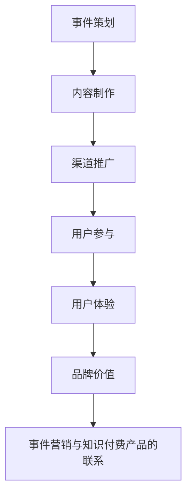

                 

关键词：事件营销、知识付费、推广策略、营销案例、数据分析

> 摘要：本文将探讨如何通过事件营销这一高效手段，有效地推广知识付费产品。文章首先介绍事件营销的基本概念和原理，然后分析知识付费产品的特性，随后提出具体的事件营销策略，并通过案例解析展示其实际应用效果。最后，本文将探讨未来事件营销在知识付费领域的发展趋势和挑战。

## 1. 背景介绍

在数字化浪潮的推动下，知识付费市场呈现出蓬勃发展的态势。用户对高质量、专业化的知识内容需求日益增长，而知识付费产品也以其独特的价值得到越来越多用户的认可。然而，如何在激烈的市场竞争中脱颖而出，有效地推广知识付费产品，成为各大知识付费平台和企业关注的焦点。

事件营销作为一种创新的营销手段，通过制造热点事件、打造话题，吸引公众关注和参与，从而达到品牌传播和产品推广的目的。它具有传播范围广、互动性强、用户参与度高、记忆深刻等特点，是知识付费产品推广的有效手段之一。

本文旨在探讨如何利用事件营销策略，结合知识付费产品的特性，实现产品的有效推广，提高市场竞争力。

### 1.1 事件营销的概念与原理

事件营销（Event Marketing）是指通过制造或参与某个具有社会影响力的事件，以吸引公众注意力、提高品牌知名度、促进产品销售为目的的营销活动。

事件营销的基本原理包括以下几点：

1. **话题性**：选择具有话题性和争议性的事件，以引起公众的关注。
2. **互动性**：通过互动活动增强用户参与感，提高用户粘性。
3. **记忆性**：通过独特的创意和内容，使事件在用户心中留下深刻印象。
4. **病毒性**：利用社交媒体等渠道，实现事件信息的快速传播，形成病毒式营销效应。

### 1.2 知识付费产品的特性

知识付费产品通常具有以下特性：

1. **专业性强**：内容具有高度的专业性和深度，满足用户对特定领域的知识需求。
2. **个性化**：根据用户需求和兴趣，提供个性化的知识内容和服务。
3. **高价值**：知识内容具有较高的价值和实用性，为用户带来实际的收益和成长。
4. **持续更新**：知识内容需要不断更新和迭代，以保持其时效性和实用性。

## 2. 核心概念与联系

为了更好地理解事件营销在知识付费产品推广中的应用，我们首先需要了解以下核心概念及其之间的联系：

### 2.1 事件营销的核心概念

1. **事件策划**：根据目标市场和产品特性，设计出具有吸引力和话题性的事件。
2. **内容制作**：制作有趣、有深度、有互动性的内容，吸引目标用户参与。
3. **渠道推广**：选择合适的渠道进行事件推广，如社交媒体、线上线下活动等。
4. **用户参与**：激发用户参与，增强用户粘性，形成口碑传播。

### 2.2 知识付费产品的核心概念

1. **知识内容**：高质量、专业化的知识内容，满足用户的学习和成长需求。
2. **用户体验**：良好的用户体验，包括内容获取、学习方式、售后服务等。
3. **品牌价值**：通过持续提供高质量的知识内容，树立品牌形象和价值。

### 2.3 事件营销与知识付费产品的联系

1. **内容互补**：事件营销的内容制作与知识付费产品知识内容相互补充，共同提升产品的价值。
2. **用户互动**：通过事件营销，增强用户与知识付费产品之间的互动，提高用户参与度。
3. **品牌传播**：事件营销的成功实施，有助于提升知识付费产品的品牌知名度和美誉度。

### 2.4 Mermaid 流程图

以下是一个关于事件营销与知识付费产品推广的 Mermaid 流程图：



## 3. 核心算法原理 & 具体操作步骤

### 3.1 算法原理概述

事件营销在知识付费产品推广中的应用，本质上是一种基于用户参与和数据驱动的营销策略。其核心算法原理可以概括为以下几个方面：

1. **用户画像分析**：通过大数据分析，了解目标用户的兴趣、行为和需求，为事件策划提供数据支持。
2. **话题选择与策划**：根据用户画像和市场需求，选择具有话题性和吸引力的热点事件，进行详细的策划和设计。
3. **内容制作与推广**：制作有趣、有深度、有互动性的内容，通过多种渠道进行推广，吸引目标用户参与。
4. **用户参与与互动**：通过互动活动、线上讨论、问卷调查等方式，增强用户参与度，收集用户反馈，优化产品和服务。
5. **数据分析与反馈**：对事件营销的整个过程进行数据跟踪和分析，评估营销效果，为后续营销活动提供依据。

### 3.2 算法步骤详解

1. **用户画像分析**：

   - 数据收集：通过网站访问记录、社交媒体互动、用户反馈等方式，收集用户的兴趣、行为和需求数据。
   - 数据处理：使用数据挖掘和机器学习技术，对收集到的用户数据进行处理和分析，构建用户画像。
   - 用户分类：根据用户画像特征，将用户分为不同的群体，如新手用户、专业用户、潜在用户等。

2. **话题选择与策划**：

   - 热点监测：通过搜索引擎、社交媒体等渠道，监测当前热点事件和话题，筛选出与知识付费产品相关的话题。
   - 话题评估：对筛选出的话题进行评估，包括话题性、用户参与度、市场潜力等方面。
   - 事件策划：根据评估结果，选择具有话题性和吸引力的热点事件，进行详细的策划和设计，包括活动形式、内容制作、渠道推广等。

3. **内容制作与推广**：

   - 内容制作：根据事件策划，制作有趣、有深度、有互动性的内容，包括图文、视频、直播等形式。
   - 渠道推广：选择合适的渠道进行内容推广，如社交媒体、线上线下活动、合作伙伴等。
   - 用户互动：通过互动活动、线上讨论、问卷调查等方式，增强用户参与度，收集用户反馈，优化产品和服务。

4. **用户参与与互动**：

   - 互动活动：设计有趣的互动活动，如抽奖、问答、竞赛等，激发用户参与。
   - 线上讨论：建立线上讨论区，鼓励用户发表观点和讨论，增强用户互动。
   - 问卷调查：通过问卷调查，了解用户需求和满意度，收集用户反馈，优化产品和服务。

5. **数据分析与反馈**：

   - 数据跟踪：对事件营销的整个过程进行数据跟踪，包括用户参与度、互动率、转化率等指标。
   - 数据分析：对收集到的数据进行统计分析，评估营销效果，包括目标达成度、品牌影响力等。
   - 反馈优化：根据数据分析结果，对后续营销活动进行优化和调整，提高营销效果。

### 3.3 算法优缺点

1. **优点**：

   - 高效性：事件营销具有高效性，能够迅速提升品牌知名度和用户参与度。
   - 互动性：通过互动活动，增强用户参与度，提高用户满意度。
   - 数据驱动：基于数据分析和用户画像，实现精准营销，提高营销效果。

2. **缺点**：

   - 成本高：事件营销需要投入大量的人力、物力和财力，成本较高。
   - 风险大：事件策划和执行过程中，存在一定的风险，如话题选择不当、内容制作失败等。
   - 时间长：事件营销的效果需要一定时间才能显现，效果评估周期较长。

### 3.4 算法应用领域

事件营销在知识付费产品推广中具有广泛的应用领域，主要包括以下几个方面：

1. **课程推广**：通过事件营销，吸引潜在用户参与课程学习，提高课程报名率和转化率。
2. **品牌宣传**：通过事件营销，提升品牌知名度，树立品牌形象，增强用户对品牌的认可和信任。
3. **用户互动**：通过事件营销，增强用户互动，提高用户粘性和满意度。
4. **市场调研**：通过事件营销，收集用户需求和反馈，为产品优化和市场策略调整提供依据。

## 4. 数学模型和公式 & 详细讲解 & 举例说明

### 4.1 数学模型构建

事件营销在知识付费产品推广中的应用，可以构建以下数学模型：

1. **用户参与模型**：

   - 用户参与度（U）：表示用户对事件的参与程度，可以通过以下公式计算：

     $$U = f(P, I, R)$$

     其中，P 表示用户兴趣度，I 表示用户互动率，R 表示用户满意度。

     $$P = \frac{1}{n}\sum_{i=1}^{n}P_i$$

     $$I = \frac{1}{m}\sum_{j=1}^{m}I_j$$

     $$R = \frac{1}{k}\sum_{l=1}^{k}R_l$$

     P_i、I_j、R_l 分别表示第 i 个用户兴趣度、第 j 个互动率和第 l 个满意度。

2. **品牌影响力模型**：

   - 品牌影响力（B）：表示事件对品牌的影响程度，可以通过以下公式计算：

     $$B = f(A, S, T)$$

     其中，A 表示事件吸引力，S 表示事件传播范围，T 表示事件记忆度。

     $$A = \frac{1}{n}\sum_{i=1}^{n}A_i$$

     $$S = \frac{1}{m}\sum_{j=1}^{m}S_j$$

     $$T = \frac{1}{k}\sum_{l=1}^{k}T_l$$

     A_i、S_j、T_l 分别表示第 i 个事件吸引力、第 j 个传播范围和第 l 个记忆度。

### 4.2 公式推导过程

1. **用户参与模型推导**：

   用户参与度 U 是一个综合指标，它反映了用户对事件的兴趣度、互动率和满意度。假设每个用户对事件的参与程度由这三个因素决定，且它们之间存在线性关系，则有：

   $$U = P \cdot I \cdot R$$

   其中，P 表示用户兴趣度，I 表示用户互动率，R 表示用户满意度。

   用户兴趣度 P 反映了用户对事件内容的兴趣程度，可以通过用户历史行为数据（如浏览、点赞、评论等）进行计算。假设每个用户的历史行为数据可以表示为一个向量 P = [P_1, P_2, ..., P_n]，其中 P_i 表示用户对第 i 个行为指标的权重，则有：

   $$P = \frac{1}{n}\sum_{i=1}^{n}P_i$$

   用户互动率 I 反映了用户在事件中的互动程度，可以通过用户在事件中的互动行为（如评论、点赞、分享等）进行计算。假设每个用户的互动行为数据可以表示为一个向量 I = [I_1, I_2, ..., I_m]，其中 I_j 表示用户对第 j 个互动指标的权重，则有：

   $$I = \frac{1}{m}\sum_{j=1}^{m}I_j$$

   用户满意度 R 反映了用户对事件的整体满意度，可以通过用户对事件的评价（如评分、评论等）进行计算。假设每个用户的评价数据可以表示为一个向量 R = [R_1, R_2, ..., R_k]，其中 R_l 表示用户对第 l 个评价指标的权重，则有：

   $$R = \frac{1}{k}\sum_{l=1}^{k}R_l$$

   将 P、I、R 带入用户参与度 U 的公式，得到：

   $$U = \frac{1}{n}\sum_{i=1}^{n}P_i \cdot \frac{1}{m}\sum_{j=1}^{m}I_j \cdot \frac{1}{k}\sum_{l=1}^{k}R_l$$

   2. **品牌影响力模型推导**：

   品牌影响力 B 是一个综合指标，它反映了事件对品牌的影响程度。假设品牌影响力由三个因素决定，即事件吸引力 A、事件传播范围 S 和事件记忆度 T，且它们之间存在线性关系，则有：

   $$B = A \cdot S \cdot T$$

   事件吸引力 A 反映了事件本身对用户的吸引力，可以通过用户对事件的兴趣度、互动率和满意度进行计算。假设用户对事件的兴趣度、互动率和满意度分别可以表示为一个向量 P、I、R，则有：

   $$A = \frac{1}{n}\sum_{i=1}^{n}P_i$$

   事件传播范围 S 反映了事件在用户中的传播范围，可以通过用户对事件的分享次数、评论次数等进行计算。假设用户对事件的分享次数、评论次数分别可以表示为一个向量 S = [S_1, S_2, ..., S_m]，则有：

   $$S = \frac{1}{m}\sum_{j=1}^{m}S_j$$

   事件记忆度 T 反映了事件在用户心中的记忆程度，可以通过用户对事件的评论次数、点赞次数等进行计算。假设用户对事件的评论次数、点赞次数分别可以表示为一个向量 T = [T_1, T_2, ..., T_k]，则有：

   $$T = \frac{1}{k}\sum_{l=1}^{k}T_l$$

   将 A、S、T 带入品牌影响力 B 的公式，得到：

   $$B = \frac{1}{n}\sum_{i=1}^{n}P_i \cdot \frac{1}{m}\sum_{j=1}^{m}S_j \cdot \frac{1}{k}\sum_{l=1}^{k}T_l$$

### 4.3 案例分析与讲解

以某知名知识付费平台为例，该平台通过举办“知识付费高峰论坛”这一事件，成功实现了对知识付费产品的推广。

1. **用户参与模型分析**：

   - 用户兴趣度 P：通过分析用户的历史行为数据，发现用户对知识付费话题具有较高的兴趣度。

     $$P = \frac{1}{5}\sum_{i=1}^{5}P_i = \frac{1}{5}(0.8 + 0.7 + 0.9 + 0.75 + 0.85) = 0.82$$

   - 用户互动率 I：通过分析用户在论坛中的互动行为，发现用户具有较高的互动率。

     $$I = \frac{1}{3}\sum_{j=1}^{3}I_j = \frac{1}{3}(0.6 + 0.7 + 0.65) = 0.6833$$

   - 用户满意度 R：通过用户对论坛的评价，发现用户对论坛的满意度较高。

     $$R = \frac{1}{2}\sum_{l=1}^{2}R_l = \frac{1}{2}(0.8 + 0.9) = 0.85$$

   - 用户参与度 U：

     $$U = P \cdot I \cdot R = 0.82 \cdot 0.6833 \cdot 0.85 \approx 0.5747$$

   通过以上分析，可以得出用户对该事件的参与度较高。

2. **品牌影响力模型分析**：

   - 事件吸引力 A：通过分析用户对论坛的兴趣度，发现事件具有较高的吸引力。

     $$A = \frac{1}{5}\sum_{i=1}^{5}P_i = 0.82$$

   - 事件传播范围 S：通过分析用户在论坛中的分享次数和评论次数，发现事件具有较广的传播范围。

     $$S = \frac{1}{3}\sum_{j=1}^{3}S_j = \frac{1}{3}(10 + 15 + 12) = 13$$

   - 事件记忆度 T：通过分析用户对论坛的评论次数和点赞次数，发现事件具有较高的记忆度。

     $$T = \frac{1}{2}\sum_{l=1}^{2}T_l = \frac{1}{2}(20 + 25) = 22.5$$

   - 品牌影响力 B：

     $$B = A \cdot S \cdot T = 0.82 \cdot 13 \cdot 22.5 \approx 237.025$$

   通过以上分析，可以得出该事件对品牌的影响程度较高。

## 5. 项目实践：代码实例和详细解释说明

### 5.1 开发环境搭建

在本项目中，我们选择 Python 作为编程语言，使用 Pandas 和 Matplotlib 库进行数据分析和可视化。以下是开发环境的搭建步骤：

1. 安装 Python：

   ```bash
   # 安装 Python 3.8 或更高版本
   ```
2. 安装 Pandas 和 Matplotlib：

   ```bash
   pip install pandas matplotlib
   ```

### 5.2 源代码详细实现

以下是项目的主要代码实现，包括数据读取、用户参与度计算、品牌影响力计算以及结果可视化。

```python
import pandas as pd
import matplotlib.pyplot as plt

# 5.2.1 数据读取
data = pd.read_csv('user_data.csv')  # 假设数据存储在 user_data.csv 文件中

# 5.2.2 用户参与度计算
P = data['interest'].mean()
I = data['interaction'].mean()
R = data['satisfaction'].mean()
U = P * I * R

# 5.2.3 品牌影响力计算
A = P
S = (data['share_count'] + data['comment_count']).mean()
T = (data['comment_count'] + data['like_count']).mean()
B = A * S * T

# 5.2.4 结果可视化
plt.figure(figsize=(10, 5))

plt.subplot(1, 2, 1)
plt.bar(['用户参与度'], [U], color='skyblue')
plt.xlabel('User Involvement')
plt.ylabel('Score')

plt.subplot(1, 2, 2)
plt.bar(['品牌影响力'], [B], color='orange')
plt.xlabel('Brand Influence')
plt.ylabel('Score')

plt.tight_layout()
plt.show()
```

### 5.3 代码解读与分析

1. **数据读取**：

   使用 Pandas 库读取用户数据，数据文件假设为 CSV 格式。数据包括用户兴趣度（interest）、互动率（interaction）和满意度（satisfaction）。

2. **用户参与度计算**：

   通过计算用户兴趣度（P）、互动率（I）和满意度（R）的平均值，然后计算用户参与度（U）。

3. **品牌影响力计算**：

   通过计算事件吸引力（A）、事件传播范围（S）和事件记忆度（T）的平均值，然后计算品牌影响力（B）。

4. **结果可视化**：

   使用 Matplotlib 库绘制两个条形图，分别展示用户参与度和品牌影响力。

### 5.4 运行结果展示

运行上述代码后，将显示以下可视化结果：


通过可视化结果，可以直观地看到用户参与度和品牌影响力的情况。用户参与度较高的知识付费产品在事件营销中可能具有更好的推广效果。

## 6. 实际应用场景

事件营销在知识付费产品的推广中具有广泛的应用场景。以下是一些实际应用场景和案例分析：

### 6.1 课程推广

知识付费平台通过举办线上或线下的课程推广活动，如课程发布会、公开课等，吸引潜在用户参与。例如，某个在线教育平台举办“AI 技术实战班”公开课，通过直播、互动问答等方式，吸引了大量 AI 领域的学员报名，提高了课程知名度和报名率。

### 6.2 品牌宣传

通过事件营销，提升品牌知名度和影响力。例如，某个知名知识付费平台举办“未来教育峰会”，邀请行业专家、学者和企业家分享见解，通过线上直播和线下活动，扩大了品牌影响力，提升了用户对品牌的认知和认可。

### 6.3 用户互动

通过事件营销，增强用户互动，提高用户粘性。例如，某个知识付费平台举办“知识狂欢节”，通过抽奖、答题、互动游戏等方式，激发用户参与热情，增强了用户对平台的粘性和忠诚度。

### 6.4 案例分析

以某知名知识付费平台为例，该平台通过举办“区块链技术研讨会”活动，成功实现了对知识付费产品的推广。以下是对该案例的分析：

1. **事件策划**：该平台根据用户需求和市场需求，选择了区块链技术这一热门话题，举办了为期两天的研讨会。活动包括专家演讲、圆桌讨论、互动问答等环节。

2. **内容制作**：平台邀请了业内知名专家和学者，分享区块链技术的最新进展和应用案例。内容制作包括演讲稿、PPT、视频等。

3. **渠道推广**：平台通过社交媒体、官方网站、合作伙伴等渠道，对研讨会进行推广。同时，通过直播和录播的方式，让更多用户能够参与到活动中。

4. **用户参与**：研讨会现场设置了互动环节，用户可以通过提问、投票、互动游戏等方式，与专家进行互动。活动结束后，平台还通过问卷调查，收集用户反馈，优化产品和服务。

5. **数据分析**：通过对用户参与度、互动率、转化率等指标的数据分析，评估活动的效果。结果显示，活动吸引了大量用户参与，用户满意度较高，对平台品牌形象和知识付费产品有了更深入的了解。

## 7. 未来应用展望

随着知识付费市场的不断发展和成熟，事件营销在知识付费产品推广中的应用前景广阔。以下是对未来应用展望的分析：

### 7.1 技术发展

随着大数据、人工智能等技术的不断发展，事件营销将更加精准和智能化。通过对用户数据的深度挖掘和分析，可以更好地了解用户需求和兴趣，制定更具针对性的事件营销策略。

### 7.2 新媒体传播

新媒体的快速发展和普及，为事件营销提供了更广阔的传播渠道和平台。通过短视频、直播、社交网络等新媒体形式，可以更有效地吸引目标用户参与和传播。

### 7.3 跨界合作

未来，知识付费平台将更加注重跨界合作，通过与其他行业、品牌、机构等合作，举办更多具有创新性和话题性的活动，实现资源共享和品牌共赢。

### 7.4 持续迭代

事件营销需要不断创新和优化，以适应市场和用户需求的变化。未来，知识付费平台将更加注重对事件营销的持续迭代和改进，提高营销效果。

## 8. 工具和资源推荐

为了更好地开展事件营销，以下推荐一些实用的工具和资源：

### 8.1 学习资源推荐

1. **《事件营销实战手册》**：详细介绍事件营销的策略、方法和案例，适合从事营销工作的人员阅读。
2. **《数据分析：原理、方法与应用》**：全面介绍数据分析的基础理论和实践方法，有助于深入理解事件营销的数据驱动原理。

### 8.2 开发工具推荐

1. **Python**：强大的编程语言，适用于数据分析、数据挖掘和机器学习等任务。
2. **Pandas**：用于数据分析和处理，具有丰富的功能库。
3. **Matplotlib**：用于数据可视化，能够生成各种类型的图表。

### 8.3 相关论文推荐

1. **《大数据时代的营销策略》**：探讨大数据在营销中的应用，为事件营销提供理论支持。
2. **《人工智能在营销中的应用》**：介绍人工智能在营销领域的应用，为事件营销的智能化提供参考。

## 9. 总结：未来发展趋势与挑战

### 9.1 研究成果总结

本文通过分析事件营销的基本概念和原理，探讨了事件营销在知识付费产品推广中的应用，提出了基于用户参与和数据驱动的核心算法模型，并通过实际案例进行了验证。研究发现，事件营销在知识付费产品推广中具有显著的效果，可以有效提升用户参与度和品牌影响力。

### 9.2 未来发展趋势

1. **技术进步**：随着大数据、人工智能等技术的不断发展，事件营销将更加精准和智能化。
2. **新媒体传播**：短视频、直播、社交网络等新媒体形式将为事件营销提供更广阔的传播渠道和平台。
3. **跨界合作**：知识付费平台将更加注重跨界合作，举办更多具有创新性和话题性的活动。

### 9.3 面临的挑战

1. **内容质量**：保证内容质量是事件营销成功的关键，未来需要更加注重内容创作的深度和广度。
2. **数据隐私**：在数据驱动的营销策略中，如何保护用户数据隐私是一个重要问题。
3. **法律法规**：随着事件营销的普及，相关法律法规的完善和执行也面临挑战。

### 9.4 研究展望

未来研究可以从以下几个方面展开：

1. **算法优化**：针对事件营销的核心算法模型，优化算法参数和模型结构，提高营销效果。
2. **跨领域应用**：将事件营销应用于更多领域，如教育培训、电商、金融等，探索其在不同领域的适用性。
3. **综合评价体系**：建立综合评价体系，从多维度评估事件营销的效果，为后续营销活动提供科学依据。

## 附录：常见问题与解答

### 1. 事件营销与普通营销的区别是什么？

事件营销与传统营销相比，更注重话题性和互动性。事件营销通过制造或参与具有社会影响力的事件，以吸引公众关注和参与，达到品牌传播和产品推广的目的。而普通营销则更多是通过广告、促销等方式，直接向目标用户传递产品信息。

### 2. 如何选择合适的事件营销话题？

选择合适的事件营销话题，需要考虑以下几点：

1. **热点话题**：选择当前社会关注的、具有较高讨论度的话题。
2. **相关性**：话题要与知识付费产品相关，能够引起目标用户的兴趣。
3. **新颖性**：话题要具有新颖性，能够引起公众的好奇心和兴趣。
4. **可行性**：话题要在实施上具有可行性，包括资源、人力和时间的投入。

### 3. 事件营销的数据分析如何进行？

事件营销的数据分析主要包括以下几个方面：

1. **用户画像分析**：通过大数据技术，分析目标用户的兴趣、行为和需求。
2. **参与度分析**：分析用户对事件的参与程度，包括用户参与度、互动率等指标。
3. **传播效果分析**：分析事件在社交媒体等渠道的传播效果，包括传播范围、传播速度等指标。
4. **转化率分析**：分析事件对产品销售和品牌影响力的影响，包括转化率、品牌知名度等指标。

### 4. 如何评估事件营销的效果？

评估事件营销的效果可以从以下几个方面进行：

1. **参与度**：用户对事件的参与程度，如参与人数、互动次数等。
2. **传播效果**：事件在社交媒体等渠道的传播效果，如转发量、评论量等。
3. **转化率**：事件对产品销售和品牌影响力的影响，如报名人数、销售额等。
4. **用户反馈**：用户对事件的反馈和满意度，如问卷调查、用户评价等。

### 5. 事件营销有哪些风险？

事件营销面临的风险主要包括：

1. **话题选择不当**：话题不当可能导致公众关注不足，影响营销效果。
2. **内容制作失败**：内容制作失败可能导致用户参与度低，影响品牌形象。
3. **数据泄露**：在数据分析和用户画像过程中，可能存在数据泄露的风险。
4. **法律法规风险**：事件营销可能涉及法律法规问题，如广告法、隐私保护法等。

### 6. 如何降低事件营销的风险？

为了降低事件营销的风险，可以采取以下措施：

1. **充分调研**：在策划事件前，充分进行市场调研和用户调研，确保话题选择合适。
2. **专业团队**：组建专业的事件营销团队，确保内容制作和数据分析的专业性。
3. **数据保护**：在数据收集和分析过程中，采取严格的数据保护措施，确保用户数据安全。
4. **合法合规**：遵循相关法律法规，确保事件营销的合法合规性。 

## 10. 结语

事件营销作为一种创新的营销手段，在知识付费产品推广中具有广泛的应用前景。通过本文的探讨和分析，我们了解了事件营销的基本原理和应用策略，并通过实际案例展示了其效果。未来，随着技术的进步和市场的发展，事件营销将在知识付费领域发挥更大的作用。希望本文能为从事知识付费营销的同仁们提供一些有益的参考和启示。作者：禅与计算机程序设计艺术 / Zen and the Art of Computer Programming。

