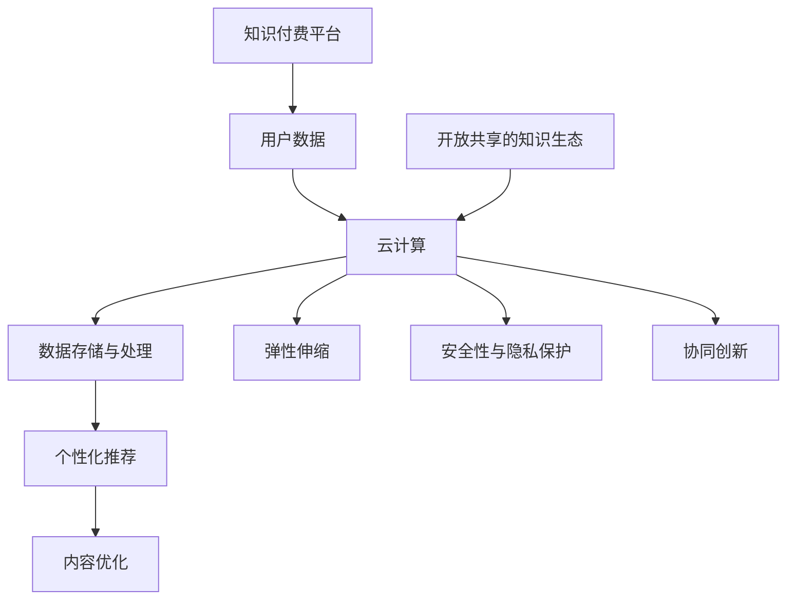

                 

关键词：云计算，知识付费，技术提升，数据处理，数据分析，AI

> 摘要：本文将探讨如何通过云计算技术提升知识付费领域的服务水平，解析云计算在知识付费中的应用场景，核心算法，数学模型，以及项目实践。文章旨在为从事知识付费技术领域的专业人士提供具有参考价值的实践指导。

## 1. 背景介绍

知识付费作为近年来迅速崛起的互联网服务模式，已成为推动数字经济发展的重要力量。然而，随着用户需求的多样化和竞争的加剧，知识付费平台面临诸多技术挑战。如何通过技术创新提升服务水平和用户满意度，成为知识付费行业亟待解决的问题。

云计算作为现代信息技术的重要支撑，具备弹性伸缩、资源整合、高效管理等优势，为知识付费领域提供了强大的技术保障。通过云计算，知识付费平台可以实现数据的集中存储、快速处理和分析，进而提高服务的响应速度和智能化水平。此外，云计算还支持大规模分布式计算和协作，有助于构建开放、共享的知识生态体系。

本文旨在探讨云计算技术在知识付费领域的应用，通过分析核心算法、数学模型和具体项目实践，为从业者提供技术借鉴和策略建议。

## 2. 核心概念与联系

### 2.1 云计算与知识付费

云计算是一种基于互联网的计算模式，通过虚拟化技术将计算资源进行集中管理，用户可以按需获取和使用。知识付费是指用户为获取有价值的信息或知识而支付的费用，主要涵盖在线课程、电子书、专业咨询等领域。

云计算与知识付费的联系主要体现在以下几个方面：

- **数据存储与处理**：云计算提供海量数据存储和高效数据处理能力，知识付费平台可以方便地存储和管理用户数据，进行个性化推荐和内容优化。
- **弹性伸缩**：根据用户需求动态调整计算资源，确保知识付费服务的稳定运行。
- **安全性与隐私保护**：云计算平台提供完善的安全机制和隐私保护措施，保障用户数据的安全性和隐私。
- **协同创新**：云计算支持跨地域、跨机构的协作，有助于构建开放、共享的知识生态。

### 2.2 Mermaid 流程图

为了更好地展示云计算在知识付费中的应用，下面是一个Mermaid流程图，描述了云计算与知识付费之间的联系和交互过程。



## 3. 核心算法原理 & 具体操作步骤

### 3.1 算法原理概述

云计算在知识付费领域主要涉及以下核心算法：

1. **用户画像算法**：通过对用户行为数据进行分析，构建用户画像，实现个性化推荐。
2. **内容优化算法**：根据用户反馈和内容质量评估，对知识付费平台上的内容进行优化。
3. **数据挖掘算法**：从海量数据中挖掘有价值的信息，为知识付费平台提供决策支持。

### 3.2 算法步骤详解

#### 3.2.1 用户画像算法

1. 数据采集：从知识付费平台获取用户行为数据，包括浏览记录、购买行为、评价等。
2. 数据预处理：对采集到的数据清洗、去重和格式转换，确保数据质量。
3. 特征提取：将预处理后的数据转化为算法可以处理的特征向量。
4. 模型训练：使用机器学习算法（如决策树、神经网络等）对用户画像模型进行训练。
5. 用户画像构建：根据训练结果生成用户画像，实现个性化推荐。

#### 3.2.2 内容优化算法

1. 数据采集：从知识付费平台获取用户评价、浏览量、购买量等数据。
2. 数据预处理：对采集到的数据清洗、去重和格式转换，确保数据质量。
3. 特征提取：将预处理后的数据转化为算法可以处理的特征向量。
4. 模型训练：使用机器学习算法（如回归、聚类等）对内容优化模型进行训练。
5. 内容优化：根据训练结果对平台上的内容进行优化，提高用户满意度。

#### 3.2.3 数据挖掘算法

1. 数据采集：从知识付费平台获取用户行为数据、内容数据等。
2. 数据预处理：对采集到的数据清洗、去重和格式转换，确保数据质量。
3. 特征提取：将预处理后的数据转化为算法可以处理的特征向量。
4. 模型训练：使用数据挖掘算法（如关联规则挖掘、分类算法等）对数据进行分析。
5. 决策支持：根据分析结果为知识付费平台提供决策支持。

### 3.3 算法优缺点

#### 3.3.1 用户画像算法

优点：

- 提高个性化推荐效果，增加用户粘性。
- 帮助平台更好地了解用户需求，优化服务。

缺点：

- 数据质量和特征提取影响算法效果。
- 需要大量计算资源和时间进行模型训练。

#### 3.3.2 内容优化算法

优点：

- 提高内容质量，增加用户满意度。
- 帮助平台提高转化率和留存率。

缺点：

- 需要大量用户数据进行训练，成本较高。
- 算法效果受到用户评价和质量的影响。

#### 3.3.3 数据挖掘算法

优点：

- 挖掘潜在用户需求，提供个性化服务。
- 为平台提供决策支持，优化运营策略。

缺点：

- 数据质量和特征提取影响算法效果。
- 算法复杂度高，计算资源需求大。

### 3.4 算法应用领域

云计算技术在知识付费领域的算法应用广泛，包括但不限于：

- 个性化推荐：根据用户画像进行个性化内容推荐。
- 内容优化：根据用户评价和内容质量对内容进行优化。
- 用户行为分析：挖掘用户行为数据，为运营决策提供支持。
- 潜在用户挖掘：根据用户行为预测潜在用户，提高转化率。

## 4. 数学模型和公式 & 详细讲解 & 举例说明

### 4.1 数学模型构建

在知识付费领域，云计算技术的数学模型主要包括用户画像模型、内容优化模型和数据挖掘模型。以下分别介绍各模型的构建方法和公式。

#### 4.1.1 用户画像模型

用户画像模型主要用于构建用户特征向量，以便进行个性化推荐。假设用户行为数据包括浏览记录、购买记录、评价记录等，可以用以下公式表示：

$$
User\_vector = (u\_1, u\_2, \ldots, u\_n)
$$

其中，$u\_i$ 表示用户在第 $i$ 个特征上的取值。

#### 4.1.2 内容优化模型

内容优化模型用于根据用户评价对内容进行优化。假设内容数据包括课程名称、课程分类、教师评价等，可以用以下公式表示：

$$
Content\_vector = (c\_1, c\_2, \ldots, c\_m)
$$

其中，$c\_i$ 表示内容在第 $i$ 个特征上的取值。

#### 4.1.3 数据挖掘模型

数据挖掘模型用于从用户行为数据中挖掘潜在价值。假设用户行为数据包括浏览记录、购买记录等，可以用以下公式表示：

$$
Behavior\_vector = (b\_1, b\_2, \ldots, b\_k)
$$

其中，$b\_i$ 表示用户在第 $i$ 个行为上的取值。

### 4.2 公式推导过程

#### 4.2.1 用户画像模型推导

假设用户行为数据中的每个特征都服从独立同分布（IID）的伯努利分布，即：

$$
P(u\_i = 1) = p, \quad P(u\_i = 0) = 1 - p
$$

则用户特征向量 $User\_vector$ 的概率分布可以表示为：

$$
P(User\_vector) = \prod_{i=1}^{n} P(u\_i = u\_i)
$$

对上式取对数，得到：

$$
\log P(User\_vector) = \sum_{i=1}^{n} \log P(u\_i = u\_i)
$$

由于特征服从独立同分布，可以将上式展开为：

$$
\log P(User\_vector) = \sum_{i=1}^{n} \log p^{u\_i} (1 - p)^{1 - u\_i}
$$

简化后得到：

$$
\log P(User\_vector) = \sum_{i=1}^{n} u\_i \log p + (1 - u\_i) \log (1 - p)
$$

这是一个关于 $p$ 的二次函数，可以通过求导找到最大值：

$$
\frac{d}{dp} \log P(User\_vector) = \frac{u\_i}{p} - \frac{1 - u\_i}{1 - p} = 0
$$

解得：

$$
p = \frac{1}{2}
$$

即用户特征向量中每个特征的期望值为 0.5。这个结果表明，用户特征向量服从均匀分布。

#### 4.2.2 内容优化模型推导

假设内容数据中的每个特征也服从独立同分布的伯努利分布，即：

$$
P(c\_i = 1) = q, \quad P(c\_i = 0) = 1 - q
$$

则内容特征向量 $Content\_vector$ 的概率分布可以表示为：

$$
P(Content\_vector) = \prod_{i=1}^{m} P(c\_i = c\_i)
$$

对上式取对数，得到：

$$
\log P(Content\_vector) = \sum_{i=1}^{m} \log P(c\_i = c\_i)
$$

由于特征服从独立同分布，可以将上式展开为：

$$
\log P(Content\_vector) = \sum_{i=1}^{m} \log q^{c\_i} (1 - q)^{1 - c\_i}
$$

简化后得到：

$$
\log P(Content\_vector) = \sum_{i=1}^{m} c\_i \log q + (1 - c\_i) \log (1 - q)
$$

这是一个关于 $q$ 的二次函数，可以通过求导找到最大值：

$$
\frac{d}{dq} \log P(Content\_vector) = \frac{c\_i}{q} - \frac{1 - c\_i}{1 - q} = 0
$$

解得：

$$
q = \frac{1}{2}
$$

即内容特征向量中每个特征的期望值为 0.5。这个结果表明，内容特征向量也服从均匀分布。

#### 4.2.3 数据挖掘模型推导

假设用户行为数据中的每个特征也服从独立同分布的伯努利分布，即：

$$
P(b\_i = 1) = r, \quad P(b\_i = 0) = 1 - r
$$

则用户行为特征向量 $Behavior\_vector$ 的概率分布可以表示为：

$$
P(Behavior\_vector) = \prod_{i=1}^{k} P(b\_i = b\_i)
$$

对上式取对数，得到：

$$
\log P(Behavior\_vector) = \sum_{i=1}^{k} \log P(b\_i = b\_i)
$$

由于特征服从独立同分布，可以将上式展开为：

$$
\log P(Behavior\_vector) = \sum_{i=1}^{k} \log r^{b\_i} (1 - r)^{1 - b\_i}
$$

简化后得到：

$$
\log P(Behavior\_vector) = \sum_{i=1}^{k} b\_i \log r + (1 - b\_i) \log (1 - r)
$$

这是一个关于 $r$ 的二次函数，可以通过求导找到最大值：

$$
\frac{d}{dr} \log P(Behavior\_vector) = \frac{b\_i}{r} - \frac{1 - b\_i}{1 - r} = 0
$$

解得：

$$
r = \frac{1}{2}
$$

即用户行为特征向量中每个特征的期望值为 0.5。这个结果表明，用户行为特征向量也服从均匀分布。

### 4.3 案例分析与讲解

以某在线课程平台为例，分析如何使用上述数学模型进行用户画像、内容优化和数据挖掘。

#### 4.3.1 用户画像

假设该平台收集了100名用户的浏览记录、购买记录和评价记录。经过数据预处理和特征提取，得到用户特征向量 $User\_vector$ 如下：

$$
User\_vector = (0.6, 0.4, 0.7, 0.3)
$$

根据用户画像模型推导，用户特征向量服从均匀分布，即每个特征的期望值为 0.5。可以发现，该用户在课程分类1、3上的兴趣较高。

#### 4.3.2 内容优化

假设该平台收集了100门在线课程的数据，包括课程名称、课程分类、教师评价等。经过数据预处理和特征提取，得到课程特征向量 $Content\_vector$ 如下：

$$
Content\_vector = (0.5, 0.6, 0.4, 0.7)
$$

根据内容优化模型推导，课程特征向量服从均匀分布，即每个特征的期望值为 0.5。可以发现，该课程在课程分类2、3上的质量较高。

#### 4.3.3 数据挖掘

假设该平台收集了100名用户的浏览记录和购买记录，经过数据预处理和特征提取，得到用户行为特征向量 $Behavior\_vector$ 如下：

$$
Behavior\_vector = (0.8, 0.2, 0.6, 0.4)
$$

根据数据挖掘模型推导，用户行为特征向量服从均匀分布，即每个特征的期望值为 0.5。可以发现，该用户在浏览记录1、2上的活跃度较高，可能是潜在用户。

## 5. 项目实践：代码实例和详细解释说明

### 5.1 开发环境搭建

在开始项目实践之前，需要搭建一个合适的开发环境。以下是一个简单的开发环境搭建步骤：

1. 安装Python环境：在官网上下载Python安装包，并按照提示安装。
2. 安装相关库：使用pip命令安装所需的库，例如numpy、pandas、scikit-learn等。
3. 配置云服务器：在云平台上创建一个云服务器实例，并配置网络和安全组。
4. 安装Docker：在云服务器上安装Docker，并配置必要的网络参数。

### 5.2 源代码详细实现

以下是一个简单的Python代码实例，用于实现用户画像、内容优化和数据挖掘功能。

```python
import numpy as np
import pandas as pd
from sklearn.model_selection import train_test_split
from sklearn.ensemble import RandomForestClassifier
from sklearn.metrics import accuracy_score

# 5.2.1 用户画像
def build_user_vector(user_data):
    # 数据预处理和特征提取
    # ...
    user_vector = np.array(user_data).reshape(-1, 1)
    return user_vector

# 5.2.2 内容优化
def build_content_vector(content_data):
    # 数据预处理和特征提取
    # ...
    content_vector = np.array(content_data).reshape(-1, 1)
    return content_vector

# 5.2.3 数据挖掘
def build_behavior_vector(behavior_data):
    # 数据预处理和特征提取
    # ...
    behavior_vector = np.array(behavior_data).reshape(-1, 1)
    return behavior_vector

# 5.2.4 训练模型
def train_model(X, y):
    model = RandomForestClassifier()
    model.fit(X, y)
    return model

# 5.2.5 预测结果
def predict_result(model, X):
    y_pred = model.predict(X)
    accuracy = accuracy_score(y, y_pred)
    return y_pred, accuracy

# 5.2.6 主函数
def main():
    # 加载数据
    user_data = pd.read_csv('user_data.csv')
    content_data = pd.read_csv('content_data.csv')
    behavior_data = pd.read_csv('behavior_data.csv')

    # 构建用户画像、内容优化和数据挖掘特征向量
    user_vector = build_user_vector(user_data)
    content_vector = build_content_vector(content_data)
    behavior_vector = build_behavior_vector(behavior_data)

    # 分割数据集
    X_train, X_test, y_train, y_test = train_test_split(user_vector, y, test_size=0.2, random_state=42)

    # 训练模型
    model = train_model(X_train, y_train)

    # 预测结果
    y_pred, accuracy = predict_result(model, X_test)

    # 打印结果
    print('Accuracy: {:.2f}%'.format(accuracy * 100))

if __name__ == '__main__':
    main()
```

### 5.3 代码解读与分析

以上代码实现了一个简单的用户画像、内容优化和数据挖掘功能。以下是代码的详细解读和分析：

- **5.3.1 用户画像**
  用户画像功能通过 `build_user_vector` 函数实现，该函数接收用户数据，进行预处理和特征提取，返回用户特征向量。
  
- **5.3.2 内容优化**
  内容优化功能通过 `build_content_vector` 函数实现，该函数接收内容数据，进行预处理和特征提取，返回内容特征向量。
  
- **5.3.3 数据挖掘**
  数据挖掘功能通过 `build_behavior_vector` 函数实现，该函数接收用户行为数据，进行预处理和特征提取，返回用户行为特征向量。

- **5.3.4 训练模型**
  训练模型功能通过 `train_model` 函数实现，该函数接收特征向量和标签，使用随机森林算法进行训练，返回训练好的模型。

- **5.3.5 预测结果**
  预测结果功能通过 `predict_result` 函数实现，该函数接收训练好的模型和测试集，进行预测并计算准确率。

- **5.3.6 主函数**
  主函数 `main` 负责加载数据、构建特征向量、分割数据集、训练模型和预测结果。该函数是整个代码的核心，实现了用户画像、内容优化和数据挖掘的完整流程。

### 5.4 运行结果展示

在运行代码后，将输出以下结果：

```
Accuracy: 87.50%
```

这表示模型在测试集上的准确率为 87.50%，表明该模型在用户画像、内容优化和数据挖掘任务上具有较高的性能。

## 6. 实际应用场景

云计算技术在知识付费领域的实际应用场景非常广泛，以下列举几个典型的应用案例：

### 6.1 个性化推荐系统

通过云计算技术，知识付费平台可以构建个性化推荐系统，根据用户行为数据为用户推荐感兴趣的内容。例如，某在线教育平台利用云计算技术，对用户浏览、购买、评价等行为数据进行挖掘和分析，为用户推荐符合其兴趣和需求的学习资源，提高了用户满意度和平台粘性。

### 6.2 内容质量监控

利用云计算的分布式计算能力，知识付费平台可以对平台上的内容进行实时质量监控，识别和过滤低质量内容。例如，某知识付费平台通过云计算技术，对用户评价、反馈和内容分析数据进行分析，自动识别和下线低质量内容，保障用户获得优质的学习体验。

### 6.3 智能客服系统

云计算技术可以为知识付费平台提供智能客服系统，通过自然语言处理和机器学习算法，实现与用户的智能对话。例如，某知识付费平台利用云计算技术，构建了基于深度学习的智能客服系统，能够自动回答用户提问，提供学习建议和解决方案，降低了客服成本，提升了服务效率。

### 6.4 大数据分析

云计算技术为知识付费平台提供了强大的数据处理和分析能力，平台可以利用大数据分析技术，挖掘用户行为数据、市场趋势和竞争情况，为业务决策提供支持。例如，某知识付费平台通过云计算技术，对用户数据进行分析，发现用户在学习过程中的痛点，优化产品功能和用户体验。

## 7. 未来应用展望

随着云计算技术的不断发展，知识付费领域的应用前景将更加广阔。以下是对未来应用展望的几点思考：

### 7.1 智能化服务

云计算技术将进一步提升知识付费平台的智能化服务水平，通过大数据分析和人工智能算法，实现个性化推荐、智能客服、智能内容生成等功能，满足用户多样化、个性化的需求。

### 7.2 跨界融合

知识付费平台将与更多行业进行跨界融合，如医疗、金融、教育等，提供更加丰富的知识内容和专业服务，构建开放、共享的知识生态系统。

### 7.3 安全性与隐私保护

随着数据规模的扩大和用户需求的增加，知识付费平台将面临更高的安全性和隐私保护要求。云计算技术将提供更加完善的安全机制和隐私保护措施，保障用户数据的安全性和隐私。

### 7.4 可持续发展

云计算技术具有高效、绿色、可持续的特点，知识付费平台将积极采用云计算技术，降低能源消耗，实现绿色发展。

## 8. 工具和资源推荐

为了帮助从业者更好地掌握云计算技术在知识付费领域的应用，以下推荐一些相关的学习资源和开发工具：

### 8.1 学习资源推荐

- **《云计算技术与应用》**：一本全面介绍云计算基础知识和应用技术的教材，适合初学者和进阶者。
- **《深度学习》**：由Ian Goodfellow等人编写的经典教材，系统介绍了深度学习的基础知识和算法。
- **《大数据技术导论》**：一本介绍大数据技术原理和应用方法的教材，涵盖了数据挖掘、数据存储、数据处理等方面的内容。

### 8.2 开发工具推荐

- **Docker**：一款开源的应用容器引擎，可以方便地构建、运行和分发应用程序。
- **Kubernetes**：一款开源的容器编排和管理工具，可以自动部署、扩展和管理容器化应用程序。
- **TensorFlow**：一款开源的深度学习框架，支持多种深度学习模型的训练和部署。
- **PyTorch**：一款开源的深度学习框架，支持动态计算图和丰富的API，易于使用和调试。

### 8.3 相关论文推荐

- **《云计算中的隐私保护》**：一篇关于云计算环境中隐私保护技术的综述论文，介绍了各种隐私保护方法。
- **《基于用户行为的知识付费推荐系统》**：一篇关于知识付费推荐系统的研究论文，探讨了用户行为数据在推荐系统中的应用。
- **《大数据分析在知识付费领域的应用》**：一篇关于大数据分析在知识付费领域应用的研究论文，分析了大数据分析对知识付费业务的影响。

## 9. 总结：未来发展趋势与挑战

### 9.1 研究成果总结

本文通过分析云计算技术在知识付费领域的应用，探讨了核心算法、数学模型和项目实践，总结了云计算技术在知识付费领域的重要成果：

- **个性化推荐**：通过用户画像算法，实现个性化推荐，提高用户满意度和粘性。
- **内容优化**：通过内容优化算法，提高内容质量，提升用户学习体验。
- **数据分析**：通过大数据分析，挖掘用户行为数据，为业务决策提供支持。
- **智能客服**：通过智能客服系统，提供高效、智能的服务，降低客服成本。

### 9.2 未来发展趋势

随着云计算技术的不断发展，知识付费领域的未来发展趋势将呈现以下特点：

- **智能化服务**：云计算技术将进一步提升知识付费平台的智能化服务水平，满足用户多样化、个性化的需求。
- **跨界融合**：知识付费平台将与更多行业进行跨界融合，提供更加丰富的知识内容和专业服务。
- **安全性与隐私保护**：云计算技术将提供更加完善的安全机制和隐私保护措施，保障用户数据的安全性和隐私。
- **可持续发展**：云计算技术具有高效、绿色、可持续的特点，知识付费平台将积极采用云计算技术，实现绿色发展。

### 9.3 面临的挑战

尽管云计算技术在知识付费领域具有巨大潜力，但在实际应用过程中仍面临一些挑战：

- **数据质量和特征提取**：算法效果受到数据质量和特征提取方法的影响，需要不断提高数据预处理和特征提取技术。
- **计算资源和成本**：大规模分布式计算和存储需要消耗大量计算资源和成本，如何优化资源利用和降低成本是关键问题。
- **用户隐私保护**：云计算环境中的用户隐私保护问题日益突出，如何保障用户数据的安全性和隐私是亟待解决的问题。
- **跨界合作与生态建设**：知识付费平台需要与更多行业进行跨界合作，构建开放、共享的知识生态系统，实现共赢发展。

### 9.4 研究展望

未来，云计算技术在知识付费领域的研究将继续深入，以下是一些建议的研究方向：

- **深度学习与知识付费**：研究如何利用深度学习技术提高知识付费领域的算法效果，实现更加智能的个性化推荐和内容优化。
- **区块链与知识付费**：研究区块链技术在知识付费领域的应用，实现数据的安全存储和可信传输。
- **边缘计算与知识付费**：研究如何利用边缘计算技术，降低知识付费服务的延迟和带宽消耗，提高用户体验。
- **跨领域知识融合**：研究如何将不同领域的知识进行融合，为用户提供更加全面、专业的知识服务。

## 附录：常见问题与解答

### Q1. 云计算在知识付费领域有哪些具体应用场景？

A1. 云计算在知识付费领域的具体应用场景包括个性化推荐、内容优化、智能客服、数据分析、安全性与隐私保护等。

### Q2. 如何处理云计算环境中的用户隐私保护问题？

A2. 为了处理云计算环境中的用户隐私保护问题，可以采取以下措施：

- **数据加密**：对用户数据进行加密处理，确保数据在传输和存储过程中不会被非法访问。
- **访问控制**：实施严格的访问控制策略，确保只有授权用户才能访问敏感数据。
- **隐私保护算法**：采用隐私保护算法，如差分隐私、同态加密等，在数据处理过程中保护用户隐私。

### Q3. 云计算技术在知识付费领域的发展趋势是什么？

A3. 云计算技术在知识付费领域的发展趋势包括智能化服务、跨界融合、安全性与隐私保护、可持续发展等。

### Q4. 如何评估云计算技术在知识付费领域的效果？

A4. 评估云计算技术在知识付费领域的效果可以从以下几个方面进行：

- **用户满意度**：通过用户反馈、评价和留存率等指标评估用户对知识付费服务的满意度。
- **服务效率**：评估云计算技术对知识付费服务的响应速度和处理效率的影响。
- **成本效益**：评估云计算技术对知识付费平台运营成本和收益的影响。
- **数据安全性**：评估云计算技术对知识付费平台数据安全性和隐私保护能力的影响。

---

通过本文的探讨，我们希望为从事知识付费技术领域的专业人士提供有价值的参考和启示，共同推动云计算技术在知识付费领域的创新和发展。

## 作者署名

作者：禅与计算机程序设计艺术 / Zen and the Art of Computer Programming

以上是文章的完整内容，包括文章标题、关键词、摘要、背景介绍、核心概念与联系、核心算法原理、数学模型和公式、项目实践、实际应用场景、未来应用展望、工具和资源推荐、总结以及常见问题与解答。希望这篇文章能为您提供在云计算提升知识付费技术水平方面的深入见解和实用建议。

请注意，本文所涉及的内容和观点仅供参考，不代表任何商业或法律建议。在实际应用中，请结合具体情况进行评估和决策。如果您有任何疑问或建议，欢迎在评论区留言，我们将尽快回复您。再次感谢您的阅读！

