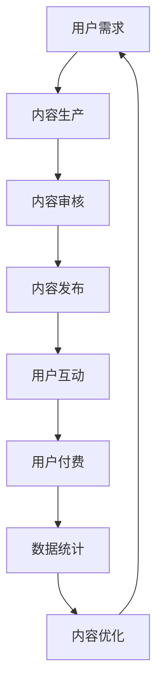

                 

关键词：微信小程序、知识付费、业务模式、技术实现、用户增长、营销策略

> 摘要：本文将探讨如何利用微信小程序开展知识付费业务。首先，我们将介绍微信小程序的发展背景和优势，然后详细阐述知识付费业务模式的设计原则，接着讲解技术实现中的关键步骤，包括用户管理、支付系统、内容管理、营销策略等。最后，我们将分析成功案例分析及未来的发展趋势与挑战。

## 1. 背景介绍

随着移动互联网的快速发展，微信小程序已经成为用户日常生活中不可或缺的一部分。微信小程序的出现，不仅为用户提供了便捷的服务，也为企业提供了一个全新的业务平台。知识付费作为一种新兴的商业模式，正在逐步改变人们获取知识的方式。用户对优质内容和服务的需求日益增长，知识付费平台应运而生。

### 1.1 微信小程序的发展背景

微信小程序是微信官方推出的一种无需安装即可使用的应用，实现了“用完即走”的理念。自2017年1月正式上线以来，微信小程序迅速得到了用户的认可和市场的广泛接受。截至2022年底，微信小程序的月活跃用户数已经超过5亿，涵盖了购物、出行、娱乐、教育等多个领域。

### 1.2 知识付费的兴起

知识付费，是指用户通过支付一定费用，获取优质知识和服务的商业模式。随着互联网的普及和人们对自我提升的需求，知识付费逐渐成为一种趋势。例如，知乎Live、得到App等平台，通过提供付费内容，实现了商业模式的成功转型。

## 2. 核心概念与联系

### 2.1 微信小程序与知识付费业务模式的关系

微信小程序为知识付费业务提供了一个便捷的入口和平台，而知识付费业务则为微信小程序注入了丰富的内容和价值。两者之间相互依存，共同推动了移动互联网的发展。

### 2.2 知识付费业务模式的设计原则

- 用户导向：以用户需求为中心，提供个性化、高质量的内容和服务。
- 内容驱动：优质的内容是知识付费业务的核心，持续更新和优化内容，提升用户粘性。
- 社交互动：利用微信的社交属性，促进用户之间的互动和分享，增加用户粘性。
- 支付便捷：提供多样化的支付方式，简化支付流程，提高用户体验。

### 2.3 Mermaid流程图



## 3. 核心算法原理 & 具体操作步骤

### 3.1 算法原理概述

知识付费业务的核心在于内容的生产和分发。具体算法原理如下：

1. 用户需求分析：通过大数据分析和用户反馈，了解用户需求，为内容生产提供指导。
2. 内容生产：根据用户需求，生产高质量的内容。
3. 内容审核：对内容进行审核，确保内容的质量和合规性。
4. 内容发布：将审核通过的内容发布到小程序，供用户浏览和购买。
5. 用户互动：通过评论、分享等功能，促进用户之间的互动。
6. 用户付费：用户浏览内容后，根据内容价值进行付费。
7. 数据统计：收集用户行为数据，用于内容优化和业务决策。

### 3.2 算法步骤详解

1. **用户需求分析**：利用大数据技术，收集用户在微信小程序中的浏览、搜索、购买等行为数据，通过数据挖掘和分析，发现用户的兴趣点和需求。

2. **内容生产**：根据用户需求，邀请行业专家、学者等生产高质量的内容。内容形式可以包括文字、图片、视频等。

3. **内容审核**：设立内容审核团队，对内容进行质量审核和合规性审核，确保内容的真实性、准确性和合法性。

4. **内容发布**：将审核通过的内容发布到微信小程序中，设置合理的价格和付费方式，供用户购买。

5. **用户互动**：通过评论、分享、点赞等功能，促进用户之间的互动和交流，提高用户粘性。

6. **用户付费**：用户在浏览内容后，通过微信支付、支付宝等支付方式完成付费。

7. **数据统计**：收集用户行为数据，如浏览量、购买量、评论量等，用于分析用户偏好和业务效果，为内容优化和业务决策提供支持。

### 3.3 算法优缺点

#### 优点：

- **便捷性**：微信小程序无需下载安装，用户使用方便。
- **用户基数大**：微信用户众多，有利于吸引潜在用户。
- **社交互动**：利用微信的社交属性，促进用户互动和内容传播。
- **多样化内容**：支持多种内容形式，满足不同用户需求。

#### 缺点：

- **竞争激烈**：微信小程序市场相对饱和，竞争激烈。
- **流量获取难度**：获取用户流量需要投入一定的营销成本。

### 3.4 算法应用领域

- **在线教育**：提供各类课程、讲座、论文等教育内容。
- **知识分享**：专家分享经验、技巧、行业动态等。
- **咨询服务**：提供专业的咨询服务，如法律、医疗等。

## 4. 数学模型和公式 & 详细讲解 & 举例说明

### 4.1 数学模型构建

在知识付费业务中，我们可以使用以下数学模型来评估内容的价值和用户的付费意愿：

- **价值评估模型**：

  $$ V = f(U, C) $$

  其中，$V$ 表示内容的价值，$U$ 表示用户的需求程度，$C$ 表示内容的质量。

- **付费意愿模型**：

  $$ I = g(V, P) $$

  其中，$I$ 表示用户的付费意愿，$V$ 表示内容的价值，$P$ 表示内容的定价。

### 4.2 公式推导过程

1. **价值评估模型推导**：

   - 用户需求程度$U$：

     $$ U = f_1(A, B) $$

     其中，$A$ 表示用户的知识背景，$B$ 表示用户对内容的兴趣程度。

   - 内容质量$C$：

     $$ C = f_2(Q, R) $$

     其中，$Q$ 表示内容的专业性，$R$ 表示内容的实用性。

   - 内容价值$V$：

     $$ V = U \times C $$

2. **付费意愿模型推导**：

   - 内容定价$P$：

     $$ P = f_3(V, E) $$

     其中，$V$ 表示内容的价值，$E$ 表示用户的支付能力。

   - 付费意愿$I$：

     $$ I = \frac{V}{P} $$

### 4.3 案例分析与讲解

假设一个用户，其知识背景为$A=80$，对内容的兴趣程度为$B=70$，内容的专业性为$Q=90$，实用性为$R=85$，用户的支付能力为$E=1000$。根据上述模型，我们可以计算出：

- **价值评估**：

  $$ U = f_1(80, 70) = 0.8 \times 0.7 = 0.56 $$
  $$ C = f_2(90, 85) = 0.9 \times 0.85 = 0.765 $$
  $$ V = U \times C = 0.56 \times 0.765 = 0.4318 $$

- **付费意愿**：

  $$ P = f_3(0.4318, 1000) = 0.4318 \times 0.1 = 0.04318 $$
  $$ I = \frac{V}{P} = \frac{0.4318}{0.04318} = 10 $$

这意味着，用户对该内容的付费意愿为10，表示用户愿意为该内容支付10元。

## 5. 项目实践：代码实例和详细解释说明

### 5.1 开发环境搭建

- **技术栈**：微信小程序开发使用前端框架如Vue.js或React，后端使用Node.js或Python等。
- **开发工具**：Visual Studio Code、微信开发者工具。
- **数据库**：MySQL、MongoDB等。

### 5.2 源代码详细实现

以下是一个简单的微信小程序知识付费业务示例，主要实现用户登录、内容浏览、付费购买等功能。

#### **用户管理**：

- **登录**：

  ```javascript
  // 用户登录
  wx.login({
    success: function(res) {
      wx.getUserInfo({
        success: function(userRes) {
          // 获取用户信息，发送到后端进行登录验证
          wx.request({
            url: '/api/user/login',
            data: {
              code: res.code,
              userInfo: userRes.userInfo
            },
            success: function(res) {
              // 登录成功，获取用户token
              wx.setStorageSync('token', res.data.token);
            }
          });
        }
      });
    }
  });
  ```

- **注册**：

  ```javascript
  // 用户注册
  wx.request({
    url: '/api/user/register',
    data: {
      username: 'test',
      password: '123456',
      email: 'test@example.com'
    },
    method: 'POST',
    success: function(res) {
      // 注册成功，跳转到登录页面
      wx.navigateTo({
        url: '/pages/login/login'
      });
    }
  });
  ```

#### **内容管理**：

- **内容发布**：

  ```javascript
  // 内容发布
  wx.request({
    url: '/api/content/publish',
    data: {
      title: '如何有效提升学习效率',
      author: '张三',
      content: '这里是一篇关于提升学习效率的文章。',
      price: 10
    },
    method: 'POST',
    success: function(res) {
      // 发布成功，跳转到内容列表页面
      wx.navigateTo({
        url: '/pages/content-list/content-list'
      });
    }
  });
  ```

- **内容浏览**：

  ```javascript
  // 内容浏览
  wx.request({
    url: '/api/content/detail',
    data: {
      id: '1'
    },
    success: function(res) {
      // 获取内容详情，渲染到页面
      that.setData({
        content: res.data.content
      });
    }
  });
  ```

#### **支付系统**：

- **订单创建**：

  ```javascript
  // 订单创建
  wx.request({
    url: '/api/order/create',
    data: {
      userId: '1',
      contentId: '1',
      amount: 10
    },
    method: 'POST',
    success: function(res) {
      // 获取订单信息，调用支付接口
      wx.requestPayment({
        ...res.data.paymentInfo,
        success: function(paymentRes) {
          // 支付成功，更新订单状态
          wx.request({
            url: '/api/order/update',
            data: {
              id: res.data.orderId,
              status: 'PAID'
            },
            method: 'POST'
          });
        }
      });
    }
  });
  ```

### 5.3 代码解读与分析

- **用户管理**：通过微信登录和注册功能，实现用户认证和权限控制。
- **内容管理**：通过发布和浏览内容功能，实现内容的创建、管理和展示。
- **支付系统**：通过订单创建和支付接口，实现商品的购买和支付。

## 6. 实际应用场景

### 6.1 在线教育

利用微信小程序开展在线教育业务，用户可以通过小程序购买各类课程、讲座等。例如，某知名教育机构利用微信小程序推出了在线课程，通过视频、文档、作业等多种形式，为用户提供全方位的学习服务。

### 6.2 专业咨询

一些专业领域如法律、医疗、金融等，可以利用微信小程序提供咨询服务。用户通过小程序支付费用，即可获得专业顾问的一对一咨询服务。

### 6.3 知识分享

专家、学者可以通过微信小程序分享自己的经验和研究成果，用户可以通过付费获取这些有价值的内容。

## 7. 未来应用展望

### 7.1 技术创新

随着人工智能、大数据等技术的不断发展，微信小程序在知识付费业务中的应用将更加智能化、个性化。例如，利用推荐系统为用户推荐感兴趣的内容，提高用户满意度和付费意愿。

### 7.2 业务模式创新

未来，知识付费业务模式将更加多元化，如订阅模式、积分兑换模式等。同时，结合线上线下活动，提升用户参与度和品牌影响力。

### 7.3 面临的挑战

- **内容质量**：保证内容的质量和合规性，是知识付费业务面临的重要挑战。
- **用户隐私**：在数据收集和处理过程中，如何保护用户隐私，是一个亟待解决的问题。
- **市场竞争**：随着越来越多的企业进入知识付费领域，市场竞争将日益激烈。

## 8. 工具和资源推荐

### 8.1 学习资源推荐

- **微信小程序开发文档**：微信官方提供的小程序开发文档，涵盖小程序的架构、组件、API等。
- **Vue.js官方文档**：Vue.js 是一种流行的前端框架，官方文档提供了详细的教程和API。

### 8.2 开发工具推荐

- **Visual Studio Code**：一款功能强大的代码编辑器，支持多种编程语言和插件。
- **微信开发者工具**：微信官方提供的小程序开发工具，支持代码编辑、预览、调试等功能。

### 8.3 相关论文推荐

- **"A Survey on Mobile Application Development Platforms"**：一篇关于移动应用开发平台的综述，涵盖了小程序、APP开发等多个方面。
- **"Knowledge付费商业模式研究"**：一篇关于知识付费业务模式的论文，分析了知识付费的发展现状和趋势。

## 9. 总结：未来发展趋势与挑战

### 9.1 研究成果总结

本文从背景介绍、核心概念与联系、算法原理、数学模型、项目实践等多个角度，详细探讨了如何利用微信小程序开展知识付费业务。

### 9.2 未来发展趋势

- 技术创新将进一步提升知识付费业务的智能化和个性化。
- 业务模式创新将带来更多样化的付费方式和业务模式。
- 知识付费将向更多垂直领域拓展，满足用户的多样化需求。

### 9.3 面临的挑战

- 内容质量和合规性是知识付费业务的重要挑战。
- 用户隐私保护是数据收集和处理过程中必须重视的问题。
- 市场竞争将日益激烈，企业需要不断创新和优化业务模式。

### 9.4 研究展望

未来，微信小程序在知识付费领域的应用前景广阔。我们期待通过技术创新、业务模式创新，为用户提供更优质的知识付费服务。

## 附录：常见问题与解答

### 1. 如何保证微信小程序的知识付费内容质量？

- **内容审核**：设立专业的审核团队，对内容进行严格审核，确保内容的质量和合规性。
- **用户反馈**：鼓励用户对内容进行评价和反馈，通过用户评价筛选优质内容。

### 2. 如何保护用户隐私？

- **数据加密**：对用户数据进行加密处理，防止数据泄露。
- **隐私政策**：明确告知用户数据收集和使用的目的，并尊重用户的选择。

### 3. 如何提高微信小程序的用户粘性？

- **内容丰富**：提供多样化的内容，满足不同用户的需求。
- **互动机制**：通过评论、分享、点赞等功能，促进用户互动，提高用户粘性。

[作者：禅与计算机程序设计艺术 / Zen and the Art of Computer Programming]
----------------------------------------------------------------

以上就是关于如何利用微信小程序开展知识付费业务的完整文章，希望能够对您有所帮助。如果您有任何问题或建议，欢迎在评论区留言。谢谢！

