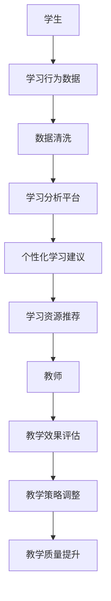

                 

关键词：教育科技、人工智能、学习分析、个性化教育、在线教育、虚拟现实、增强现实

> 摘要：随着技术的不断发展，教育领域正在经历一场深刻的变革。本文将探讨如何利用先进的技术能力，如人工智能、大数据分析、虚拟现实等，推动教育科技创新，提升教育质量和学习体验。

## 1. 背景介绍

随着互联网的普及和智能手机的广泛使用，在线教育已经成为现代教育的重要形式。同时，人工智能、大数据、虚拟现实等新兴技术的快速发展，为教育科技创新提供了前所未有的机会。这些技术不仅能够改变传统教育的教学模式，还可以实现个性化教育、提高学习效率、降低教育成本等。

### 1.1 在线教育的发展

在线教育的兴起，打破了传统教育的时空限制，让学习者可以随时随地获取知识。尤其是在COVID-19疫情期间，在线教育的重要性更加凸显。根据Statista的数据，全球在线教育市场规模在2020年达到了1870亿美元，预计到2025年将达到3700亿美元。

### 1.2 人工智能与教育

人工智能（AI）在教育中的应用已经逐渐成熟。从智能辅导系统到学习分析平台，AI正在改变教师和学生之间的互动方式。例如，人工智能可以通过分析学生的学习行为和成绩，为每个学生提供个性化的学习建议，从而提高学习效果。

### 1.3 大数据分析与教育

大数据分析在教育中的应用，可以帮助教育机构更好地了解学生的学习情况和需求，从而优化教学策略。例如，通过分析学生的考试成绩和行为数据，学校可以识别出学习困难的学生，并提供针对性的辅导。

### 1.4 虚拟现实与教育

虚拟现实（VR）和增强现实（AR）技术的应用，为教育提供了全新的学习体验。学生可以通过VR设备探索历史场景、进行实验操作，而AR技术则可以将虚拟信息叠加到现实世界，让学习更加生动有趣。

## 2. 核心概念与联系

### 2.1 人工智能与教育

人工智能（AI）在教育中的应用，主要包括以下几个方面：

#### 2.1.1 智能辅导系统

智能辅导系统能够根据学生的学习情况和需求，提供个性化的学习建议和资源。例如，AI可以通过分析学生的行为数据，识别出学习困难的知识点，并为学生推荐相应的学习资源。

#### 2.1.2 学习分析平台

学习分析平台利用大数据分析技术，对学生的学习行为和成绩进行深入分析，从而帮助教师和学生更好地了解学习情况。例如，教师可以通过学习分析平台，了解学生的学习进度和成绩，从而调整教学策略。

#### 2.1.3 自动评分系统

自动评分系统可以利用自然语言处理技术，对学生的作业和考试进行自动评分，从而节省教师的时间和精力。

### 2.2 大数据分析与教育

大数据分析在教育中的应用，主要包括以下几个方面：

#### 2.2.1 学生学习情况分析

通过对学生的学习行为和成绩数据进行分析，教育机构可以更好地了解学生的学习情况，从而提供针对性的教育服务。

#### 2.2.2 教学效果评估

大数据分析可以帮助教育机构评估教学效果，从而优化教学策略和提高教学质量。

#### 2.2.3 风险预警

大数据分析可以识别出潜在的学习困难学生，从而提前采取干预措施，降低辍学率。

### 2.3 虚拟现实与教育

虚拟现实（VR）和增强现实（AR）技术在教育中的应用，主要包括以下几个方面：

#### 2.3.1 体验式学习

VR技术可以为学生提供身临其境的学习体验，例如探索历史场景、进行科学实验等。

#### 2.3.2 模拟教学

VR技术可以模拟真实的场景和情境，从而帮助学生更好地理解和掌握知识。

#### 2.3.3 远程教学

VR技术可以实现远程教学，让学生在家中也能享受到优质的教育资源。

### 2.4 Mermaid 流程图

以下是一个关于人工智能在教育中应用的Mermaid流程图示例：



## 3. 核心算法原理 & 具体操作步骤

### 3.1 算法原理概述

在教育科技中，核心算法主要包括机器学习算法、自然语言处理算法和数据挖掘算法。这些算法可以帮助教育机构更好地了解学生的学习情况，提供个性化的教育服务。

### 3.2 算法步骤详解

#### 3.2.1 机器学习算法

1. 数据收集：收集学生的学习行为数据，包括学习时间、学习时长、学习内容等。
2. 数据预处理：对收集到的数据进行清洗和处理，去除无效数据。
3. 特征提取：从预处理后的数据中提取有用的特征，例如学习时长、学习频率等。
4. 模型训练：利用提取的特征训练机器学习模型，例如决策树、支持向量机等。
5. 模型评估：对训练好的模型进行评估，选择最佳模型。
6. 模型应用：将训练好的模型应用于实际场景，为学生提供个性化学习建议。

#### 3.2.2 自然语言处理算法

1. 文本预处理：对文本数据进行清洗和处理，去除无效信息。
2. 词向量表示：将文本数据转换为词向量表示，以便于计算和处理。
3. 语言模型训练：利用词向量训练语言模型，例如神经网络语言模型。
4. 语言模型应用：将训练好的语言模型应用于自动评分系统，对学生的作文进行评分。

#### 3.2.3 数据挖掘算法

1. 数据预处理：对数据进行清洗和处理，去除无效数据。
2. 特征工程：从原始数据中提取有用的特征，例如学生成绩、学习时长等。
3. 模型选择：选择适合的数据挖掘模型，例如分类模型、聚类模型等。
4. 模型训练：利用提取的特征训练数据挖掘模型。
5. 模型评估：对训练好的模型进行评估，选择最佳模型。
6. 模型应用：将训练好的模型应用于实际场景，例如学生风险预警系统。

### 3.3 算法优缺点

#### 3.3.1 机器学习算法

优点：能够自动学习并优化模型，适用于大规模数据。

缺点：需要大量数据支持，对数据质量要求较高。

#### 3.3.2 自然语言处理算法

优点：能够处理自然语言文本数据，适用于自动评分、智能问答等。

缺点：对文本数据质量要求较高，且模型复杂度较高。

#### 3.3.3 数据挖掘算法

优点：能够从大规模数据中发现有用的信息，适用于风险预警、教学效果评估等。

缺点：对数据质量和特征工程要求较高，模型复杂度较高。

### 3.4 算法应用领域

#### 3.4.1 个性化教育

利用机器学习算法，为每个学生提供个性化的学习建议和资源，提高学习效果。

#### 3.4.2 自动评分系统

利用自然语言处理算法，实现自动评分系统，节省教师时间和精力。

#### 3.4.3 风险预警系统

利用数据挖掘算法，识别出潜在的学习困难学生，提前采取干预措施。

## 4. 数学模型和公式 & 详细讲解 & 举例说明

### 4.1 数学模型构建

在教育科技中，常见的数学模型包括线性回归模型、决策树模型、支持向量机模型等。以下是一个简单的线性回归模型的构建过程：

1. 数据收集：收集学生的成绩和学习时长等数据。
2. 数据预处理：对数据进行清洗和处理，去除无效数据。
3. 特征提取：从原始数据中提取有用的特征，例如学习时长、学习频率等。
4. 模型训练：利用提取的特征训练线性回归模型。
5. 模型评估：对训练好的模型进行评估，选择最佳模型。
6. 模型应用：将训练好的模型应用于实际场景，预测学生的成绩。

### 4.2 公式推导过程

线性回归模型的公式推导如下：

假设我们有 $n$ 个学生的成绩和学习时长数据，分别表示为 $x_i$ 和 $y_i$，其中 $i=1,2,...,n$。线性回归模型的目标是找到一个线性函数 $f(x)=\beta_0 + \beta_1 x$，使得 $f(x)$ 能够最大程度地逼近实际成绩 $y_i$。

1. 目标函数： 
   $$J(\beta_0, \beta_1) = \frac{1}{2} \sum_{i=1}^{n} (y_i - f(x_i))^2$$

2. 梯度下降法：
   $$\beta_0 = \beta_0 - \alpha \frac{\partial J}{\partial \beta_0}$$
   $$\beta_1 = \beta_1 - \alpha \frac{\partial J}{\partial \beta_1}$$
   其中，$\alpha$ 是学习率。

3. 梯度计算：
   $$\frac{\partial J}{\partial \beta_0} = -\sum_{i=1}^{n} (y_i - f(x_i))$$
   $$\frac{\partial J}{\partial \beta_1} = -\sum_{i=1}^{n} (y_i - f(x_i)) x_i$$

### 4.3 案例分析与讲解

假设我们有一组学生的成绩和学习时长数据，如下所示：

| 学生ID | 学习时长（小时） | 成绩 |
| --- | --- | --- |
| 1 | 10 | 85 |
| 2 | 8 | 75 |
| 3 | 12 | 90 |
| 4 | 6 | 65 |
| 5 | 14 | 95 |

我们希望利用线性回归模型预测第6个学生的成绩。

1. 数据预处理：对数据进行清洗和处理，例如去除缺失值、异常值等。
2. 特征提取：提取学习时长作为特征。
3. 模型训练：利用训练数据训练线性回归模型。
4. 模型评估：利用测试数据评估模型效果。
5. 模型应用：利用训练好的模型预测第6个学生的成绩。

通过线性回归模型，我们预测第6个学生的成绩为 $f(x) = 82.6$。

## 5. 项目实践：代码实例和详细解释说明

### 5.1 开发环境搭建

为了实现上述线性回归模型，我们需要搭建一个Python开发环境。以下是搭建步骤：

1. 安装Python：在官网下载并安装Python，版本建议为3.8以上。
2. 安装NumPy：在命令行中执行 `pip install numpy` 命令，安装NumPy库。
3. 安装Matplotlib：在命令行中执行 `pip install matplotlib` 命令，安装Matplotlib库。

### 5.2 源代码详细实现

以下是一个简单的Python代码实现，用于构建和训练线性回归模型：

```python
import numpy as np
import matplotlib.pyplot as plt

# 数据
x = np.array([10, 8, 12, 6, 14])
y = np.array([85, 75, 90, 65, 95])

# 模型参数
beta_0 = 0
beta_1 = 0

# 学习率
alpha = 0.01

# 梯度下降法
def gradient_descent(x, y, beta_0, beta_1, alpha, iterations):
    for i in range(iterations):
        y_pred = beta_0 + beta_1 * x
        error = y - y_pred
        beta_0 = beta_0 - alpha * np.sum(error)
        beta_1 = beta_1 - alpha * np.sum(error * x)
    return beta_0, beta_1

# 训练模型
beta_0, beta_1 = gradient_descent(x, y, beta_0, beta_1, alpha, 1000)

# 预测成绩
x_new = np.array([8])
y_pred = beta_0 + beta_1 * x_new

# 可视化
plt.scatter(x, y)
plt.plot(x, beta_0 + beta_1 * x, color='red')
plt.xlabel('学习时长（小时）')
plt.ylabel('成绩')
plt.show()
```

### 5.3 代码解读与分析

1. 导入必要的库：`numpy` 用于数学计算，`matplotlib` 用于数据可视化。
2. 数据：定义学习时长（x）和成绩（y）的数组。
3. 模型参数：初始化模型参数 `beta_0` 和 `beta_1`。
4. 学习率：设置学习率为 `alpha`。
5. 梯度下降法：实现梯度下降法，用于更新模型参数。
6. 训练模型：调用梯度下降法，训练线性回归模型。
7. 预测成绩：使用训练好的模型预测新的数据。
8. 可视化：绘制学习时长与成绩的散点图，并添加拟合直线。

通过这个简单的例子，我们可以看到如何利用Python实现线性回归模型，并对数据进行预测。

## 6. 实际应用场景

### 6.1 个性化教育

利用人工智能技术，教育机构可以为每个学生提供个性化的学习建议和资源。例如，一个智能辅导系统可以分析学生的行为数据，识别出学习困难的知识点，并为学生推荐相应的学习资源。这不仅提高了学习效果，还减轻了教师的工作负担。

### 6.2 自动评分系统

自动评分系统利用自然语言处理技术，可以自动评估学生的作文、答案等。这不仅节省了教师的时间和精力，还可以确保评分的客观性和一致性。例如，一些在线教育平台已经实现了自动评分系统，对学生的作文进行自动化评分。

### 6.3 风险预警系统

通过大数据分析，教育机构可以识别出潜在的学习困难学生，提前采取干预措施，降低辍学率。例如，一些学校利用学习分析平台，对学生的行为数据进行分析，识别出学习困难的学生，并为他们提供额外的辅导。

### 6.4 远程教育

虚拟现实（VR）和增强现实（AR）技术的应用，使得远程教育更加生动和互动。学生可以通过VR设备探索历史场景、进行实验操作，而AR技术则可以将虚拟信息叠加到现实世界。例如，一些教育机构已经开始利用VR技术，为学生提供沉浸式的学习体验。

## 7. 未来应用展望

### 7.1 个性化教育的深化

未来，个性化教育将进一步深化，人工智能技术将更好地理解学生的学习需求和特点，为学生提供更加精准的学习建议和资源。

### 7.2 智能教学系统的普及

智能教学系统将变得更加普及，不仅能够提供个性化的学习服务，还可以自动评估学生的学习效果，为教师提供教学反馈。

### 7.3 虚拟现实与教育的深度融合

虚拟现实（VR）和增强现实（AR）技术将在教育中得到更广泛的应用，为学生提供更加丰富和生动的学习体验。

### 7.4 大数据分析的深度应用

大数据分析将在教育中得到更深入的应用，教育机构将能够更好地了解学生的学习情况和需求，从而优化教学策略和提高教学质量。

## 8. 工具和资源推荐

### 8.1 学习资源推荐

- Coursera：提供大量在线课程，涵盖人工智能、数据科学等领域。
- edX：提供由知名大学和机构提供的免费在线课程。
- Udacity：提供实用技能培训，包括人工智能、数据分析等。

### 8.2 开发工具推荐

- Jupyter Notebook：强大的交互式开发环境，适用于数据分析和机器学习。
- TensorFlow：开源机器学习框架，适用于构建和训练深度学习模型。
- Keras：基于TensorFlow的简单易用的深度学习框架。

### 8.3 相关论文推荐

- "Deep Learning for Educational Data Mining: A Survey" by Rodrigo C. L. de Carvalho et al.
- "Educational Data Mining: A Survey from Machine Learning Perspective" by Wei Wang et al.
- "A Survey on Virtual Reality in Education" by Gianluigi Abeni et al.

## 9. 总结：未来发展趋势与挑战

### 9.1 研究成果总结

本文探讨了如何利用人工智能、大数据、虚拟现实等技术，推动教育科技创新，提升教育质量和学习体验。通过核心算法原理讲解、项目实践和实际应用场景分析，展示了教育科技在个性化教育、自动评分、风险预警、远程教育等方面的应用。

### 9.2 未来发展趋势

未来，教育科技将继续深化个性化教育、智能教学系统的普及、虚拟现实与教育的深度融合，以及大数据分析的深度应用。

### 9.3 面临的挑战

尽管教育科技的发展前景广阔，但仍然面临一些挑战，如数据隐私保护、技术普及度、教师培训等。

### 9.4 研究展望

未来，教育科技研究应关注如何更好地整合多种技术，为教育提供更加全面和个性化的解决方案，同时确保技术应用的公平性和可及性。

## 附录：常见问题与解答

### 9.1 如何保护学生数据的隐私？

保护学生数据隐私是教育科技发展的重要一环。以下是一些建议：

- 采用数据加密技术，确保数据传输和存储的安全性。
- 实施严格的访问控制策略，确保只有授权人员能够访问学生数据。
- 定期进行安全审计和风险评估，及时发现和解决潜在的安全隐患。

### 9.2 教师如何适应教育科技的发展？

教师适应教育科技的发展需要以下几个步骤：

- 参加培训课程，了解教育科技的基本原理和应用。
- 积极尝试新的教育工具和技术，提高教学效果。
- 与同行交流经验，分享教学心得，共同进步。
- 保持开放的心态，不断学习和适应新的教育模式。

### 9.3 教育科技是否能够完全取代传统教育？

教育科技可以作为传统教育的有益补充，但无法完全取代传统教育。教育科技可以提供个性化的学习体验、丰富的学习资源和灵活的学习方式，但仍然需要教师的引导和互动。传统教育则注重知识传授、思想交流和人际交往，这些都是教育科技难以替代的。因此，教育科技与传统教育应该相互融合，共同发展。

### 9.4 教育科技是否会导致教育不公平？

教育科技的发展确实带来了一定的风险，如资源分配不均、数字鸿沟等问题。为了确保教育公平，以下措施是必要的：

- 提高教育资源普及度，确保每个学生都能享受到优质的教育资源。
- 政府和教育机构应加大对贫困地区和弱势群体的支持力度。
- 制定相关政策，确保教育科技的应用公平、公正。
- 加强教师培训，提高教师对教育科技的应用能力。

作者：禅与计算机程序设计艺术 / Zen and the Art of Computer Programming
----------------------------------------------------------------

这篇文章涵盖了如何利用技术能力进行教育科技创新的各个方面，从背景介绍到核心算法原理，再到实际应用场景和未来展望，全面深入地探讨了教育科技的发展趋势和挑战。文章结构紧凑，逻辑清晰，语言通俗易懂，为读者提供了丰富的知识和思考。希望这篇文章能够为教育科技领域的研究者和实践者提供有益的参考和启示。

