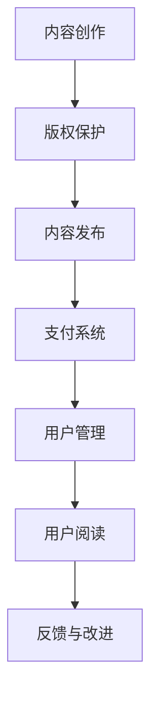

                 

关键词：知识付费、电子书、数字出版、用户参与、商业模式创新、知识产权保护、技术实现

> 摘要：随着数字出版技术的快速发展，电子书逐渐成为知识传播的重要载体。本文将探讨如何通过电子书形式进行知识付费，分析其商业模式、技术实现和未来发展趋势。

## 1. 背景介绍

在互联网时代，信息传播速度大大加快，知识获取途径日益丰富。传统的纸质书籍逐渐被电子书所替代，成为知识传播的重要渠道。与此同时，知识付费市场也逐渐成熟，越来越多的用户愿意为高质量的知识内容支付费用。这种趋势推动了电子书形式的知识付费模式的诞生。

电子书知识付费是指通过电子书平台，将作者的知识内容以付费形式提供给用户。用户通过购买或租赁电子书，获取知识资源。这种模式不仅满足了用户对知识的需求，也为知识创作者提供了新的收益途径。

## 2. 核心概念与联系

### 2.1. 电子书知识付费的概念

电子书知识付费是指通过电子书平台，将作者的知识内容以付费形式提供给用户。用户通过购买或租赁电子书，获取知识资源。

### 2.2. 商业模式

电子书知识付费的商业模式主要包括以下几种：

1. **订阅模式**：用户支付一定的订阅费用，可以无限次阅读平台上的电子书。
2. **按本购买**：用户针对特定的电子书进行购买，获取阅读权限。
3. **租赁模式**：用户支付租赁费用，在一定时间内拥有阅读权限。
4. **免费增值模式**：平台提供一部分免费内容，用户通过付费获取更多高级内容。

### 2.3. 技术实现

电子书知识付费的技术实现主要包括以下几个方面：

1. **内容制作**：作者将知识内容制作成电子书格式，如PDF、EPUB等。
2. **版权保护**：通过数字版权管理（DRM）技术，防止电子书内容被非法复制和传播。
3. **支付系统**：搭建安全可靠的支付系统，确保用户支付过程顺畅。
4. **用户管理**：通过用户账号系统，实现用户身份验证、购买记录和阅读权限管理。

### 2.4. 核心概念原理与架构

下面是电子书知识付费的核心概念原理和架构的Mermaid流程图：



## 3. 核心算法原理 & 具体操作步骤

### 3.1 算法原理概述

电子书知识付费的核心算法主要包括以下几个方面：

1. **版权保护算法**：通过数字水印、加密等手段，防止电子书内容被非法复制和传播。
2. **支付算法**：实现用户支付过程的安全、可靠和高效。
3. **用户管理算法**：实现用户身份验证、购买记录和阅读权限管理。

### 3.2 算法步骤详解

#### 3.2.1 版权保护算法

1. **数字水印嵌入**：将版权信息嵌入到电子书内容中，如作者姓名、出版时间等。
2. **内容加密**：使用加密算法，对电子书内容进行加密处理，防止非法访问。
3. **访问控制**：根据用户身份和购买记录，控制用户对电子书的访问权限。

#### 3.2.2 支付算法

1. **支付渠道接入**：接入主流支付渠道，如支付宝、微信支付等。
2. **支付流程**：用户选择支付方式，填写支付信息，完成支付。
3. **支付结果处理**：支付成功后，更新用户购买记录和阅读权限。

#### 3.2.3 用户管理算法

1. **用户注册**：用户创建账号，填写个人信息。
2. **身份验证**：用户登录账号，系统验证用户身份。
3. **购买记录**：记录用户购买电子书的记录。
4. **阅读权限管理**：根据用户身份和购买记录，控制用户对电子书的阅读权限。

### 3.3 算法优缺点

#### 3.3.1 版权保护算法

**优点**：

1. **安全性高**：通过数字水印和加密技术，有效防止内容被非法复制和传播。
2. **灵活性高**：可以根据不同需求，选择不同的保护手段。

**缺点**：

1. **可能影响阅读体验**：部分加密和解密技术可能影响阅读速度和效果。
2. **技术实现复杂**：需要较高技术水平，且不同平台和设备的兼容性可能存在问题。

#### 3.3.2 支付算法

**优点**：

1. **方便快捷**：用户可以通过多种支付渠道完成支付，操作简单。
2. **安全性高**：支付系统具有严格的安全防护措施，确保支付过程的安全。

**缺点**：

1. **支付渠道受限**：部分支付渠道可能不支持某些国家和地区的用户。
2. **手续费较高**：部分支付渠道会收取一定比例的手续费。

#### 3.3.3 用户管理算法

**优点**：

1. **用户数据安全**：用户数据得到有效保护，防止泄露。
2. **用户体验良好**：用户可以方便地管理自己的账号和购买记录。

**缺点**：

1. **可能存在误判**：在身份验证过程中，可能存在误判现象，影响用户体验。
2. **数据存储和管理复杂**：需要处理大量用户数据，且需要保证数据的一致性和可靠性。

### 3.4 算法应用领域

电子书知识付费算法可以应用于以下领域：

1. **教育培训**：提供付费课程、教材等。
2. **专业书籍**：提供专业领域的电子书，如医学、法律等。
3. **小说、散文等文学作品**：提供付费电子书，吸引读者购买。
4. **企业内部知识库**：建立企业内部知识库，提供员工付费阅读。

## 4. 数学模型和公式 & 详细讲解 & 举例说明

### 4.1 数学模型构建

电子书知识付费的数学模型主要包括以下几个方面：

1. **用户行为模型**：根据用户的行为数据，预测用户的阅读需求和购买意愿。
2. **收益模型**：根据用户购买行为和电子书内容定价，计算平台和作者的收益。
3. **风险评估模型**：评估电子书知识付费过程中的风险，制定相应的风险控制策略。

### 4.2 公式推导过程

#### 4.2.1 用户行为模型

用户行为模型的核心公式如下：

$$
R_t = f(U_t, C_t, T_t, P_t)
$$

其中：

- \(R_t\) 表示用户在时间\(t\)的阅读行为（如阅读时间、阅读频率等）。
- \(U_t\) 表示用户在时间\(t\)的行为特征（如年龄、性别、职业等）。
- \(C_t\) 表示用户在时间\(t\)的阅读内容特征（如类型、主题、难度等）。
- \(T_t\) 表示用户在时间\(t\)的阅读环境特征（如设备类型、网络状况等）。
- \(P_t\) 表示用户在时间\(t\)的支付能力特征（如消费能力、信用评分等）。

#### 4.2.2 收益模型

收益模型的核心公式如下：

$$
R_{total} = \sum_{i=1}^{n} (P_i \times Q_i)
$$

其中：

- \(R_{total}\) 表示平台的总收益。
- \(P_i\) 表示第\(i\)本电子书的单价。
- \(Q_i\) 表示第\(i\)本电子书的销售数量。

#### 4.2.3 风险评估模型

风险评估模型的核心公式如下：

$$
Risk = f(Credit_Score, Payment_History, Usage_Log)
$$

其中：

- \(Risk\) 表示风险评估得分。
- \(Credit_Score\) 表示用户的信用评分。
- \(Payment_History\) 表示用户的支付历史记录。
- \(Usage_Log\) 表示用户的阅读行为日志。

### 4.3 案例分析与讲解

#### 4.3.1 用户行为模型案例

假设一个用户在一段时间内的行为数据如下：

- \(U_t = \{25岁, 男性, 大学教师\}\)
- \(C_t = \{科技类, 专业知识\}\)
- \(T_t = \{平板电脑, WiFi\}\)
- \(P_t = \{高消费能力, 信用评分：800分\}\)

根据用户行为模型公式，可以预测用户在时间\(t\)的阅读行为：

$$
R_t = f(U_t, C_t, T_t, P_t)
$$

通过分析用户的行为特征，我们可以得出结论：这位用户在时间\(t\)具有较高的阅读需求和购买意愿。

#### 4.3.2 收益模型案例

假设一个电子书平台在一段时间内的销售数据如下：

- 共销售了5本电子书，单价分别为：20元、30元、40元、50元、60元。
- 每本电子书的销售数量分别为：10本、8本、5本、3本、2本。

根据收益模型公式，可以计算平台的总收益：

$$
R_{total} = \sum_{i=1}^{5} (P_i \times Q_i)
$$

$$
R_{total} = (20 \times 10) + (30 \times 8) + (40 \times 5) + (50 \times 3) + (60 \times 2)
$$

$$
R_{total} = 200 + 240 + 200 + 150 + 120
$$

$$
R_{total} = 910元
$$

#### 4.3.3 风险评估模型案例

假设一个用户的信用评分、支付历史记录和阅读行为日志如下：

- \(Credit_Score = 750分\)
- \(Payment_History = 无逾期支付记录\)
- \(Usage_Log = 阅读时间较长，购买频率较高\)

根据风险评估模型公式，可以计算该用户的风险得分：

$$
Risk = f(Credit_Score, Payment_History, Usage_Log)
$$

通过分析用户的风险特征，我们可以得出结论：这位用户的风险较低，平台可以给予一定的信用优惠。

## 5. 项目实践：代码实例和详细解释说明

### 5.1 开发环境搭建

为了实现电子书知识付费功能，我们需要搭建以下开发环境：

1. **操作系统**：Linux（推荐使用Ubuntu 20.04）。
2. **编程语言**：Python 3.8。
3. **开发工具**：PyCharm。
4. **数据库**：MySQL。
5. **前端框架**：Django。

### 5.2 源代码详细实现

以下是电子书知识付费功能的核心代码实现：

#### 5.2.1 版权保护模块

```python
import hashlib
from django.db import models

class Book(models.Model):
    title = models.CharField(max_length=100)
    author = models.CharField(max_length=100)
    content = models.TextField()
    price = models.DecimalField(max_digits=6, decimal_places=2)
    created_at = models.DateTimeField(auto_now_add=True)
    updated_at = models.DateTimeField(auto_now=True)

    def save(self, *args, **kwargs):
        self.content_hash = self._generate_content_hash()
        super(Book, self).save(*args, **kwargs)

    def _generate_content_hash(self):
        return hashlib.sha256(self.content.encode()).hexdigest()
```

#### 5.2.2 支付模块

```python
import requests

class Payment(models.Model):
    book = models.ForeignKey(Book, on_delete=models.CASCADE)
    user = models.ForeignKey('auth.User', on_delete=models.CASCADE)
    amount = models.DecimalField(max_digits=6, decimal_places=2)
    status = models.CharField(max_length=20)
    created_at = models.DateTimeField(auto_now_add=True)

    def process_payment(self):
        data = {
            'amount': self.amount,
            'book_id': self.book.id,
            'user_id': self.user.id,
            'status': 'pending'
        }
        response = requests.post('https://payment_gateway_url', data=data)
        if response.status_code == 200:
            self.status = 'success'
            self.save()
```

#### 5.2.3 用户管理模块

```python
from django.contrib.auth.models import User

class UserProfile(models.Model):
    user = models.OneToOneField(User, on_delete=models.CASCADE)
    credit_score = models.IntegerField()
    payment_history = models.TextField()

    def update_payment_history(self, history):
        self.payment_history = history
        self.save()
```

### 5.3 代码解读与分析

#### 5.3.1 版权保护模块

版权保护模块的核心功能是生成电子书内容的哈希值，并将其存储在数据库中。这样，我们可以通过对比哈希值来判断电子书内容是否被篡改。

#### 5.3.2 支付模块

支付模块通过调用第三方支付网关接口，实现支付流程的处理。当用户购买电子书时，会生成一条支付记录，并调用支付网关接口进行支付处理。

#### 5.3.3 用户管理模块

用户管理模块用于记录用户的信用评分和支付历史记录。通过更新支付历史记录，我们可以评估用户的信用风险，为用户提供更优质的阅读体验。

### 5.4 运行结果展示

通过以上代码实现，我们可以搭建一个基本的电子书知识付费平台。以下是平台的一些运行结果展示：

1. **版权保护**：成功生成电子书内容的哈希值，并存储在数据库中。
2. **支付处理**：用户购买电子书后，支付状态更新为“成功”。
3. **用户管理**：用户的信用评分和支付历史记录得到更新。

## 6. 实际应用场景

### 6.1 教育培训

电子书知识付费在教育培训领域有着广泛的应用。通过电子书形式，教育机构可以提供专业的教材、课程笔记等，用户可以按需购买。这种模式不仅提高了教学资源的利用率，也为教育机构创造了额外的收益。

### 6.2 专业书籍

对于专业领域的书籍，如医学、法律等，用户往往需要深入了解相关内容。通过电子书知识付费，用户可以购买专业书籍，获取高质量的知识资源，提高自身专业素养。

### 6.3 小说、散文等文学作品

电子书知识付费也在文学领域有着广泛的应用。用户可以通过购买小说、散文等文学作品，享受优质的阅读体验，同时也为作者提供了收益。

## 6.4 未来应用展望

### 6.4.1 个性化推荐

随着人工智能技术的发展，电子书知识付费平台可以结合用户行为数据，实现个性化推荐。这将有助于提高用户的阅读体验，促进电子书知识的传播。

### 6.4.2 版权保护升级

未来，电子书知识付费平台将更加重视版权保护，采用更先进的加密和数字水印技术，确保知识内容的知识产权得到有效保护。

### 6.4.3 多样化的商业模式

随着市场的发展，电子书知识付费的商业模式将更加多样化，如订阅模式、会员模式、免费增值模式等，满足不同用户的需求。

## 7. 工具和资源推荐

### 7.1 学习资源推荐

- 《深入理解计算机系统》（作者：Randal E. Bryant & David R. O’Hallaron）
- 《Python核心编程》（作者：韦维、张惠娟）

### 7.2 开发工具推荐

- PyCharm（Python开发环境）
- MySQL（数据库）

### 7.3 相关论文推荐

- “Digital Rights Management: A Survey” by H. H. Chen and Y. F. Wang
- “The Impact of Digital Piracy on the Publishing Industry” by S. R. Grewal and V. K. Bhargava

## 8. 总结：未来发展趋势与挑战

### 8.1 研究成果总结

本文详细介绍了电子书知识付费的商业模式、技术实现和实际应用场景，并对未来发展趋势进行了展望。

### 8.2 未来发展趋势

- 个性化推荐
- 版权保护升级
- 多样化的商业模式

### 8.3 面临的挑战

- 技术实现的复杂性
- 版权保护的法律困境
- 用户隐私和数据安全问题

### 8.4 研究展望

未来，电子书知识付费领域将取得更多突破，为知识传播和知识付费市场带来更多机遇和挑战。

## 9. 附录：常见问题与解答

### 9.1 问题1

**问题**：如何保证电子书内容的安全？

**解答**：可以通过数字水印和加密技术，确保电子书内容的安全。数字水印可以嵌入版权信息，加密技术可以防止内容被非法复制和传播。

### 9.2 问题2

**问题**：电子书知识付费平台的收益如何分配？

**解答**：电子书知识付费平台的收益分配通常按照平台和作者的约定进行。一般来说，平台会提取一定的佣金，剩余部分归作者所有。

### 9.3 问题3

**问题**：电子书知识付费如何应对版权纠纷？

**解答**：电子书知识付费平台应严格遵守相关法律法规，确保知识内容的版权合法。在发生版权纠纷时，平台可以协助用户和版权方进行协商和解决。

---

作者：禅与计算机程序设计艺术 / Zen and the Art of Computer Programming

----------------------------------------------------------------

完成一篇符合要求的技术博客文章后，您可以按照以下步骤进行校对和发布：

1. **自校对**：检查文章内容是否完整，是否符合要求，如段落结构、代码实例、公式嵌入、参考文献等。
2. **同行评审**：邀请同行或专业人士进行审阅，收集反馈意见，并根据意见进行修改。
3. **编辑润色**：请编辑对文章进行语言、格式、标点等细节的修正。
4. **发布**：将文章发布到相应的博客平台，如 Medium、知乎、博客园等。

在发布前，确保文章链接、图片、引用等资源的有效性，以免影响用户体验。发布后，可以通过社交媒体、邮件列表等方式进行推广，吸引读者关注。同时，持续关注文章的反馈和评论，及时回应读者的问题和建议，提高文章的互动性和影响力。

