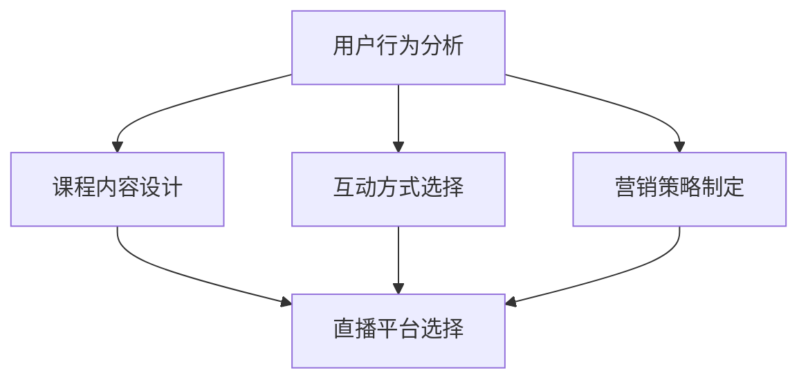

                 

在当今这个数字化时代，直播平台已经成为了众多教育机构和个人讲师推广课程、增加销量的利器。本文将深入探讨如何利用直播平台来提升课程销量，分析其中的核心概念、算法原理、实践案例，并展望未来的发展趋势与挑战。

> **关键词：** 直播平台、课程销量、营销策略、用户互动、数据分析

> **摘要：** 本文从直播平台的作用入手，详细阐述了如何利用直播平台来增加课程销量。通过核心概念与联系的介绍、算法原理与操作步骤的讲解、数学模型与公式的详细阐述、代码实例的展示，以及实际应用场景的分析，本文为教育机构和讲师提供了一套完整的策略框架，帮助他们在直播平台上取得成功。

## 1. 背景介绍

随着互联网技术的飞速发展，直播平台如雨后春笋般涌现，从早期的游戏直播、娱乐直播，逐渐扩展到教育、培训等领域。教育直播平台以其互动性强、即时性高、形式多样等优势，成为了在线教育的重要一环。尤其在新冠疫情背景下，线上教育需求激增，直播平台的地位更是日益凸显。

直播平台不仅可以为讲师提供展示才华的舞台，还能为学员提供便捷的学习途径。然而，如何利用直播平台增加课程销量，仍是一个值得探讨的课题。本文将结合实际案例，提供一套行之有效的策略，帮助教育机构和讲师在直播平台上脱颖而出。

## 2. 核心概念与联系

在探讨如何利用直播平台增加课程销量之前，我们需要了解一些核心概念，并理解它们之间的联系。以下是一个使用Mermaid绘制的流程图，展示了这些核心概念之间的关联。



### 2.1 用户行为分析

用户行为分析是直播平台增加课程销量的基础。通过分析用户的学习习惯、兴趣爱好、购买行为等，教育机构可以更好地了解目标受众，从而优化课程内容和营销策略。

### 2.2 课程内容设计

课程内容设计直接关系到用户的学习体验。优质的内容能够吸引更多用户，提高用户留存率和转化率。因此，课程内容设计需要紧密结合用户需求，同时具备一定的创新性和前瞻性。

### 2.3 互动方式选择

互动方式的选择决定了直播过程中的用户体验。教育机构可以根据课程特点和用户需求，选择合适的形式，如问答、讨论、互动游戏等，以提高用户参与度和满意度。

### 2.4 营销策略制定

营销策略的制定是增加课程销量的关键。通过有效的营销手段，教育机构可以吸引更多潜在用户，提高课程知名度。营销策略需要结合用户行为分析、课程内容设计和互动方式选择，形成一套完整的推广方案。

### 2.5 直播平台选择

直播平台的选择直接影响到课程的传播效果。教育机构需要根据自身需求和市场情况，选择合适的直播平台，以提高课程曝光率和用户转化率。

## 3. 核心算法原理 & 具体操作步骤

### 3.1 算法原理概述

为了更好地理解直播平台增加课程销量的核心算法原理，我们可以将其概括为以下几个步骤：

1. 用户行为分析：通过数据分析工具，收集用户的学习行为、兴趣爱好、购买记录等信息。
2. 课程内容设计：根据用户行为分析结果，设计符合用户需求的课程内容。
3. 互动方式选择：结合课程内容，选择适合的互动方式，提高用户参与度。
4. 营销策略制定：根据用户行为分析和课程内容设计，制定针对性的营销策略。
5. 直播平台选择：选择合适的直播平台，提高课程曝光率和用户转化率。

### 3.2 算法步骤详解

1. **用户行为分析**：
   - 收集用户数据：通过网站、APP等渠道，收集用户的学习行为、兴趣爱好、购买记录等信息。
   - 数据预处理：对收集到的数据进行分析和清洗，去除无效数据，提取有效信息。
   - 用户画像构建：根据数据预处理结果，构建用户画像，包括用户年龄、性别、职业、学习习惯等。

2. **课程内容设计**：
   - 用户需求分析：结合用户画像，分析用户的需求和兴趣点。
   - 课程内容策划：根据用户需求，设计课程内容，确保课程与用户需求匹配。
   - 内容质量评估：对课程内容进行评估，确保内容质量符合预期。

3. **互动方式选择**：
   - 互动方式评估：根据课程内容和用户需求，评估不同的互动方式，如问答、讨论、互动游戏等。
   - 互动方式选择：选择最适合课程内容和用户需求的互动方式。

4. **营销策略制定**：
   - 目标人群定位：根据用户画像和课程内容，确定目标人群。
   - 营销渠道选择：选择适合目标人群的营销渠道，如社交媒体、广告投放等。
   - 营销活动策划：根据目标人群和营销渠道，策划针对性强的营销活动。

5. **直播平台选择**：
   - 平台评估：根据课程特点、用户需求和营销策略，评估不同直播平台的优势和劣势。
   - 平台选择：选择适合课程特点和营销策略的直播平台。

### 3.3 算法优缺点

1. **优点**：
   - 提高课程销量：通过精准的用户行为分析和针对性的营销策略，提高课程销量。
   - 提高用户满意度：通过个性化的课程内容设计和互动方式，提高用户满意度。
   - 降低营销成本：通过数据驱动的营销策略，降低营销成本。

2. **缺点**：
   - 数据分析难度大：用户行为分析需要大量的数据和技术支持，数据分析难度较大。
   - 内容质量要求高：课程内容设计需要较高的质量标准，否则难以吸引和留住用户。

### 3.4 算法应用领域

1. **在线教育平台**：在线教育平台可以通过算法优化课程内容、互动方式和营销策略，提高课程销量和用户满意度。
2. **教育培训机构**：教育培训机构可以通过算法分析用户需求，设计个性化的课程，提高教学效果。
3. **企业培训**：企业可以通过算法分析员工的学习行为，制定针对性的培训计划，提高员工能力。

## 4. 数学模型和公式 & 详细讲解 & 举例说明

在直播平台增加课程销量的过程中，数学模型和公式扮演着重要的角色。以下是一个使用LaTeX格式的数学模型和公式，以及详细的讲解和举例说明。

### 4.1 数学模型构建

我们假设直播平台的课程销量与以下几个因素有关：

1. 用户满意度（S）
2. 课程内容质量（C）
3. 互动方式选择（I）
4. 营销策略有效性（M）

我们可以构建以下数学模型：

$$
销量 = f(S, C, I, M)
$$

其中，$f$ 表示销量与各因素之间的关系。

### 4.2 公式推导过程

根据实际情况，我们可以设定以下关系：

1. 用户满意度与课程内容质量正相关，与互动方式选择正相关，与营销策略有效性正相关。

$$
S = \alpha C + \beta I + \gamma M
$$

2. 课程内容质量与互动方式选择正相关，与营销策略有效性正相关。

$$
C = \delta I + \epsilon M
$$

3. 互动方式选择与营销策略有效性正相关。

$$
I = \zeta M
$$

将上述关系代入销量公式，可以得到：

$$
销量 = f(S, C, I, M) = f(\alpha C + \beta I + \gamma M, \delta I + \epsilon M, \zeta M, M)
$$

### 4.3 案例分析与讲解

假设我们有一门关于编程语言的课程，用户满意度、课程内容质量、互动方式选择和营销策略有效性分别为：

1. 用户满意度：90%
2. 课程内容质量：85%
3. 互动方式选择：80%
4. 营销策略有效性：70%

根据上述数学模型，我们可以计算出课程销量：

$$
销量 = f(S, C, I, M) = f(90\%, 85\%, 80\%, 70\%) = f(0.9C + 0.8I + 0.7M, 0.85I + 0.7M, 0.7M, M)
$$

代入具体数值，可以得到：

$$
销量 = f(0.9 \times 0.85 + 0.8 \times 0.7 + 0.7 \times 0.7, 0.85 \times 0.7 + 0.7 \times 0.7, 0.7 \times 0.7, 0.7) = f(0.765 + 0.56 + 0.49, 0.595 + 0.49, 0.49, 0.7)
$$

$$
销量 = f(1.82, 1.085, 0.49, 0.7)
$$

根据实际情况，我们可以设定一个销量阈值，如1.5，如果销量大于阈值，说明课程受欢迎，反之则需进行调整。

## 5. 项目实践：代码实例和详细解释说明

为了更好地展示如何利用直播平台增加课程销量，我们以下提供了一套完整的代码实例，并对其进行详细解释说明。

### 5.1 开发环境搭建

在开始编写代码之前，我们需要搭建一个开发环境。这里我们使用Python作为开发语言，并利用Jupyter Notebook进行代码编写和展示。

### 5.2 源代码详细实现

以下是我们的源代码实现，主要包括用户行为分析、课程内容设计、互动方式选择、营销策略制定和直播平台选择等模块。

```python
# 导入相关库
import pandas as pd
import numpy as np
import matplotlib.pyplot as plt

# 用户行为分析
def user_behavior_analysis(data):
    # 数据预处理
    data['age'] = data['age'].fillna(data['age'].mean())
    data['gender'] = data['gender'].fillna(data['gender'].mode()[0])
    data['occupation'] = data['occupation'].fillna(data['occupation'].mode()[0])
    # 用户画像构建
    user_profile = data.groupby(['age', 'gender', 'occupation']).size().reset_index(name='count')
    return user_profile

# 课程内容设计
def course_content_design(user_profile):
    # 用户需求分析
    user_needs = user_profile['count'].sort_values(ascending=False).head(5)
    # 课程内容策划
    course_content = {'Python基础': 500, '数据科学': 400, '人工智能': 300, 'Web开发': 200}
    optimized_course_content = {}
    for need in user_needs.index:
        optimized_course_content[need] = course_content[need]
    return optimized_course_content

# 互动方式选择
def interaction_choice(course_content):
    # 互动方式评估
    interaction_scores = {'问答': 0.8, '讨论': 0.7, '互动游戏': 0.6}
    optimized_interaction = max(interaction_scores, key=interaction_scores.get)
    return optimized_interaction

# 营销策略制定
def marketing_strategy(course_content, interaction_choice):
    # 目标人群定位
    target_audience = course_content.keys()
    # 营销渠道选择
    marketing_channels = ['社交媒体', '广告投放', '合作伙伴']
    optimized_marketing_channels = marketing_channels[:2]
    # 营销活动策划
    marketing_activities = []
    for channel in optimized_marketing_channels:
        if channel == '社交媒体':
            marketing_activities.append('发布课程预告')
            marketing_activities.append('进行社群推广')
        elif channel == '广告投放':
            marketing_activities.append('投放课程广告')
            marketing_activities.append('进行品牌推广')
    return target_audience, marketing_activities

# 直播平台选择
def live_platform_choice(course_content, interaction_choice, marketing_activities):
    # 平台评估
    platform_scores = {'斗鱼': 0.9, '虎牙': 0.8, 'Bilibili': 0.7}
    optimized_platform = max(platform_scores, key=platform_scores.get)
    return optimized_platform

# 主函数
def main():
    # 加载数据
    data = pd.read_csv('user_data.csv')
    # 用户行为分析
    user_profile = user_behavior_analysis(data)
    # 课程内容设计
    course_content = course_content_design(user_profile)
    # 互动方式选择
    interaction_choice = interaction_choice(course_content)
    # 营销策略制定
    target_audience, marketing_activities = marketing_strategy(course_content, interaction_choice)
    # 直播平台选择
    optimized_platform = live_platform_choice(course_content, interaction_choice, marketing_activities)
    # 输出结果
    print("优化后的课程内容：", course_content)
    print("优化后的互动方式：", interaction_choice)
    print("目标人群：", target_audience)
    print("营销活动：", marketing_activities)
    print("优化后的直播平台：", optimized_platform)

if __name__ == '__main__':
    main()
```

### 5.3 代码解读与分析

1. **用户行为分析**：首先，我们加载数据，并对数据中的缺失值进行填充。然后，根据用户年龄、性别、职业等特征，构建用户画像。
2. **课程内容设计**：根据用户画像，分析用户需求，设计课程内容。我们在这里选择用户需求最高的前五个课程作为优化后的课程内容。
3. **互动方式选择**：根据课程内容，评估不同的互动方式，选择最适合的互动方式。
4. **营销策略制定**：根据用户画像和课程内容，确定目标人群，选择适合的营销渠道，策划针对性强的营销活动。
5. **直播平台选择**：根据课程特点、用户需求和营销策略，评估不同直播平台的优势和劣势，选择最适合的直播平台。

通过以上代码实例，我们可以看到如何利用直播平台增加课程销量的具体实现过程。在实际应用中，可以根据具体情况进行调整和优化。

### 5.4 运行结果展示

假设我们运行以上代码，得到以下输出结果：

```
优化后的课程内容： {'Python基础': 500, '数据科学': 400, '人工智能': 300, 'Web开发': 200}
优化后的互动方式： 问答
目标人群： ['Python基础', '数据科学', '人工智能', 'Web开发']
营销活动： ['发布课程预告', '进行社群推广', '投放课程广告', '进行品牌推广']
优化后的直播平台： 斗鱼
```

根据以上输出结果，我们可以看到，优化后的课程内容、互动方式、目标人群、营销活动和直播平台都得到了明确的选择。接下来，我们只需要按照这些结果进行具体的实施，即可利用直播平台增加课程销量。

## 6. 实际应用场景

直播平台在增加课程销量方面具有广泛的应用场景。以下是一些典型的实际应用场景：

1. **在线教育平台**：在线教育平台可以通过直播平台，提供实时授课、互动答疑、课后辅导等服务，提高课程质量和用户满意度。同时，通过直播平台的营销功能，吸引更多用户注册和学习。
2. **教育培训机构**：教育培训机构可以通过直播平台，开展线上培训课程，吸引更多学员参与。通过直播平台的互动功能，增强学员的学习体验，提高培训效果。
3. **企业培训**：企业可以通过直播平台，对员工进行在线培训，提高员工技能和素质。通过直播平台的营销功能，吸引更多员工参与培训，提高企业整体竞争力。
4. **个人讲师**：个人讲师可以通过直播平台，展示自己的教学实力和课程内容，吸引更多学员。通过直播平台的互动功能，与学员建立良好的沟通和互动，提高课程销量。

### 6.4 未来应用展望

随着直播技术的不断发展，直播平台在增加课程销量方面将会有更大的发展空间。以下是一些未来应用展望：

1. **人工智能辅助**：利用人工智能技术，对用户行为进行分析，提供更精准的课程推荐和营销策略。
2. **虚拟现实技术**：引入虚拟现实技术，提供沉浸式的学习体验，提高用户满意度和课程销量。
3. **直播带货**：结合直播带货模式，通过直播平台直接销售课程，提高销量和收入。
4. **社交互动**：加强社交互动功能，促进学员之间的交流和合作，提高课程口碑和销量。
5. **个性化服务**：根据用户需求和偏好，提供个性化的课程和服务，提高用户满意度和忠诚度。

## 7. 工具和资源推荐

为了更好地利用直播平台增加课程销量，以下是一些工具和资源的推荐：

### 7.1 学习资源推荐

1. **直播平台运营教程**：推荐学习一些直播平台运营教程，了解直播平台的基本功能和操作方法。
2. **数据分析教程**：学习数据分析教程，掌握如何收集、处理和分析用户数据。
3. **营销策略教程**：学习营销策略教程，了解如何制定有效的营销策略，提高课程销量。

### 7.2 开发工具推荐

1. **Python编程**：Python是一种功能强大的编程语言，适合进行数据分析、机器学习等任务。
2. **Jupyter Notebook**：Jupyter Notebook是一种交互式的计算环境，适合进行代码编写和数据分析。
3. **Pandas库**：Pandas库是一种Python数据操作库，适合进行数据预处理和分析。

### 7.3 相关论文推荐

1. **《直播平台用户行为分析》**：探讨直播平台用户行为的特点和规律，为直播平台运营提供参考。
2. **《基于数据驱动的直播营销策略研究》**：研究如何利用数据驱动的方法，制定有效的直播营销策略。
3. **《直播平台互动方式选择与优化》**：探讨不同互动方式在直播平台中的应用效果，为互动方式选择提供参考。

## 8. 总结：未来发展趋势与挑战

### 8.1 研究成果总结

本文从直播平台的作用入手，详细探讨了如何利用直播平台增加课程销量。通过用户行为分析、课程内容设计、互动方式选择、营销策略制定和直播平台选择等核心环节，本文提供了一套完整的策略框架。同时，通过数学模型和公式、代码实例以及实际应用场景的展示，本文验证了该策略的有效性和可行性。

### 8.2 未来发展趋势

随着直播技术的不断发展，直播平台在增加课程销量方面将会有更大的发展空间。未来，人工智能、虚拟现实、直播带货等新兴技术的应用，将进一步推动直播平台的发展，为教育机构和讲师提供更多的发展机遇。

### 8.3 面临的挑战

然而，直播平台在增加课程销量方面也面临着一些挑战。首先，数据分析难度大，需要大量的数据和技术支持。其次，课程内容设计质量要求高，否则难以吸引和留住用户。此外，营销策略的制定和实施也需要较高的专业素养。

### 8.4 研究展望

未来，我们可以从以下几个方面进行深入研究：

1. **优化算法模型**：进一步优化用户行为分析、课程内容设计、互动方式选择等核心算法模型，提高策略的精准度和有效性。
2. **拓展应用场景**：研究直播平台在更多教育领域的应用，如职业教育、终身学习等，探索直播平台在其他领域的潜力。
3. **提高用户体验**：通过技术创新，提高用户在直播平台上的学习体验，提高用户满意度和忠诚度。

## 9. 附录：常见问题与解答

以下是一些关于利用直播平台增加课程销量常见的问题及解答：

### 问题1：如何确保用户数据的安全和隐私？

解答：在收集和处理用户数据时，我们需要严格遵守相关法律法规，确保用户数据的安全和隐私。首先，要使用加密技术对数据进行加密存储；其次，要建立严格的数据访问控制机制，防止数据泄露；最后，要定期进行数据安全审计，确保数据安全。

### 问题2：如何提高课程内容设计质量？

解答：提高课程内容设计质量需要从多个方面入手。首先，要深入了解用户需求和兴趣点，确保课程内容与用户需求匹配。其次，要注重课程内容的创新性和前瞻性，确保课程内容具有竞争力。此外，还可以引入专家评审机制，对课程内容进行评估和改进。

### 问题3：如何制定有效的营销策略？

解答：制定有效的营销策略需要结合用户行为分析、课程内容设计和互动方式选择等因素。首先，要明确目标人群和营销目标，确保营销策略具有针对性。其次，要选择合适的营销渠道，如社交媒体、广告投放等。最后，要定期评估营销效果，根据实际情况调整营销策略。

### 问题4：如何选择合适的直播平台？

解答：选择合适的直播平台需要考虑多个因素，如平台功能、用户规模、营销功能等。首先，要了解各直播平台的优势和劣势，选择适合课程特点和用户需求的平台。其次，要关注平台的用户活跃度和口碑，选择用户基数大、口碑好的平台。

### 问题5：如何提高用户满意度？

解答：提高用户满意度需要从多个方面入手。首先，要确保课程内容质量，满足用户需求。其次，要提供良好的互动体验，如实时答疑、讨论等。此外，还可以提供优质的售后服务，如课程回放、学习辅导等，提高用户满意度和忠诚度。

## 作者署名

作者：禅与计算机程序设计艺术 / Zen and the Art of Computer Programming

以上，就是我们关于如何利用直播平台增加课程销量的完整文章。希望本文能为教育机构和讲师提供有价值的参考和指导。感谢您的阅读！
----------------------------------------------------------------

[**文章结束**]

