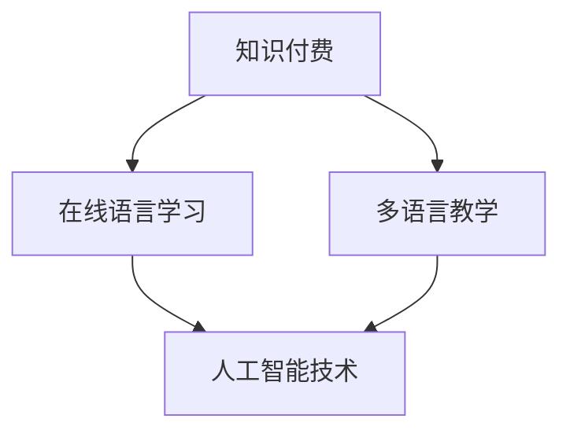

                 

 关键词：知识付费、在线语言学习、多语言教学、人工智能、教育科技、商业模式、用户需求、技术实现、学习效果评估

> 摘要：本文将探讨如何利用知识付费的模式，结合人工智能技术，实现在线语言学习与多语言教学的创新路径。通过分析当前在线语言学习的市场现状，阐述知识付费在教育领域的应用价值，并介绍具体的技术实现方案和未来发展趋势。

## 1. 背景介绍

随着全球化的深入发展，跨文化交流日益频繁，学习外语成为了提高个人竞争力的重要手段。在线语言学习作为一种新兴的学习方式，凭借其灵活性、便捷性和个性化，逐渐成为现代教育的重要组成部分。然而，目前在线语言学习市场仍存在一些问题，如学习资源质量参差不齐、学习效果难以保证等。

知识付费作为一种商业模式，通过为用户提供高质量的知识内容和服务，实现知识变现。在教育领域，知识付费能够为学习者提供定制化的学习方案，提高学习效果。同时，知识付费还能够激励教育内容提供商持续更新和优化课程内容，提升整体教学质量。

本文将结合知识付费和在线语言学习，探讨如何利用知识付费模式，实现在线语言学习与多语言教学的创新路径。

### 1.1 在线语言学习的现状

当前，在线语言学习市场呈现出蓬勃发展的态势。根据市场研究公司的数据，全球在线语言学习市场规模持续增长，预计到2025年将达到数十亿美元。主要的在线语言学习平台包括Duolingo、Rosetta Stone、HelloTalk等，这些平台通过提供丰富的学习资源、互动式学习体验和个性化的学习路径，吸引了大量用户。

然而，在线语言学习市场也存在一些问题。首先，学习资源质量参差不齐，部分平台的内容质量难以保证。其次，学习效果难以评估，用户往往难以判断自己的学习成果。此外，在线语言学习市场的商业模式尚未完全成熟，部分平台面临着盈利模式单一、用户留存率低等问题。

### 1.2 知识付费在教育领域的应用价值

知识付费模式在教育领域的应用，有望解决在线语言学习市场存在的诸多问题。首先，知识付费能够为用户提供高质量的学习资源。通过付费获取的知识内容通常经过专业的筛选和审核，质量有保证。其次，知识付费能够为用户提供个性化的学习方案。根据用户的学习需求和学习进度，提供定制化的学习资源和服务，提高学习效果。此外，知识付费还能够激励教育内容提供商持续更新和优化课程内容，提升整体教学质量。

### 1.3 人工智能技术在在线语言学习中的应用

人工智能技术在在线语言学习中的应用，为知识付费模式提供了强大的技术支持。通过自然语言处理、机器学习等人工智能技术，可以实现智能化的语言学习服务，如智能对话系统、个性化推荐、智能测评等。这些技术的应用，不仅能够提高学习效率，还能够提升学习体验。

## 2. 核心概念与联系

在本文中，我们将探讨以下几个核心概念：

1. **知识付费**：指用户通过支付费用获取知识或服务的商业模式。
2. **在线语言学习**：指通过互联网进行的外语学习活动。
3. **多语言教学**：指在同一教学环境中，教授多种语言的教学方式。
4. **人工智能技术**：包括自然语言处理、机器学习等，用于实现智能化的语言学习服务。

以下是一个Mermaid流程图，展示了这些核心概念之间的联系：



### 2.1 知识付费与在线语言学习的关系

知识付费与在线语言学习密切相关。知识付费为在线语言学习提供了经济支持，使得平台能够持续提供高质量的学习资源和服务。而在线语言学习则为知识付费提供了应用场景，使得用户能够通过支付费用获得个性化的语言学习体验。

### 2.2 人工智能技术对在线语言学习与多语言教学的促进作用

人工智能技术在在线语言学习与多语言教学中的应用，极大地提升了教学效果和学习体验。通过智能对话系统，用户可以与虚拟语言教师进行实时互动，提高口语表达能力。个性化推荐系统则根据用户的学习历史和兴趣，推荐适合的学习资源。智能测评系统则可以实时评估用户的学习效果，提供针对性的反馈和建议。

## 3. 核心算法原理 & 具体操作步骤

### 3.1 算法原理概述

在本文中，我们将介绍一种基于知识付费的在线语言学习算法，该算法主要包含以下几个部分：

1. **用户画像构建**：通过分析用户的学习历史、兴趣爱好、学习目标等数据，构建用户的个性化学习画像。
2. **内容推荐**：基于用户画像，推荐适合的学习资源，包括课程、教材、练习题等。
3. **学习效果评估**：通过智能测评系统，评估用户的学习效果，并提供个性化的学习建议。
4. **教学策略优化**：根据学习效果评估的结果，动态调整教学内容和教学方法，以提升学习效果。

### 3.2 算法步骤详解

#### 3.2.1 用户画像构建

用户画像构建是算法的核心步骤之一。具体步骤如下：

1. **数据收集**：收集用户的学习历史数据、兴趣爱好数据、学习目标数据等。
2. **数据处理**：对收集到的数据进行分析和清洗，提取有用的信息。
3. **特征工程**：对处理后的数据建立特征工程模型，将原始数据转化为算法可以处理的形式。
4. **用户画像构建**：将特征工程模型的结果整合，形成用户画像。

#### 3.2.2 内容推荐

内容推荐是基于用户画像构建的，旨在为用户推荐适合的学习资源。具体步骤如下：

1. **推荐系统构建**：利用机器学习算法，构建推荐系统。
2. **推荐结果生成**：输入用户画像，生成推荐结果。
3. **推荐结果优化**：对推荐结果进行优化，提高推荐准确率。

#### 3.2.3 学习效果评估

学习效果评估是确保用户学习成果的重要手段。具体步骤如下：

1. **测评系统构建**：构建智能测评系统，包括选择题、填空题、听力题、口语题等多种题型。
2. **测评结果分析**：对用户完成的测评进行分析，评估用户的学习效果。
3. **反馈与建议**：根据测评结果，为用户提供个性化的学习反馈和建议。

#### 3.2.4 教学策略优化

教学策略优化是根据学习效果评估的结果，动态调整教学内容和教学方法的过程。具体步骤如下：

1. **教学策略调整**：根据学习效果评估的结果，调整教学内容和教学方法。
2. **教学策略验证**：对新教学策略进行验证，确保其有效性。
3. **教学策略优化**：根据验证结果，进一步优化教学策略。

### 3.3 算法优缺点

#### 优点

1. **个性化**：基于用户画像的内容推荐和学习效果评估，能够实现个性化的学习体验。
2. **高效**：智能测评系统和学习效果评估，能够快速、准确地评估用户的学习成果。
3. **动态调整**：教学策略优化，能够根据学习效果动态调整教学内容和教学方法，提升学习效果。

#### 缺点

1. **数据隐私**：用户画像的构建涉及大量个人数据，需要确保数据的安全和隐私。
2. **技术门槛**：构建和优化推荐系统和智能测评系统，需要较高的技术门槛。

### 3.4 算法应用领域

基于知识付费的在线语言学习算法，可以广泛应用于以下领域：

1. **在线教育平台**：为在线教育平台提供智能化的学习服务，提升用户体验。
2. **企业培训**：为企业提供定制化的语言培训服务，提升员工的外语能力。
3. **多语言教学**：为多语言教学机构提供智能化的教学辅助工具，提高教学效果。

## 4. 数学模型和公式 & 详细讲解 & 举例说明

在在线语言学习与多语言教学的过程中，数学模型和公式发挥着重要作用。以下我们将详细讲解相关的数学模型和公式，并通过具体例子进行说明。

### 4.1 数学模型构建

在线语言学习与多语言教学中的数学模型主要包括用户画像模型、内容推荐模型和学习效果评估模型。

#### 用户画像模型

用户画像模型的核心目标是构建用户的个性化特征向量。假设我们有一个用户集合 \(U\)，其中每个用户 \(u \in U\) 对应一个特征向量 \(x_u\)：

\[ x_u = [x_{u1}, x_{u2}, ..., x_{un}] \]

其中，\(x_{ui}\) 表示用户 \(u\) 在第 \(i\) 个特征上的取值。常见的特征包括学习历史、兴趣爱好、学习目标等。

#### 内容推荐模型

内容推荐模型的核心目标是根据用户画像，推荐适合的学习资源。假设我们有一个内容集合 \(C\)，其中每个内容 \(c \in C\) 对应一个特征向量 \(y_c\)：

\[ y_c = [y_{c1}, y_{c2}, ..., y_{cn}] \]

推荐模型的目的是找到与用户画像最相似的内容集合 \(R(u)\)：

\[ R(u) = \{c \in C | \text{相似度}(x_u, y_c) \text{最高}\} \]

相似度计算可以使用余弦相似度、欧氏距离等方法。

#### 学习效果评估模型

学习效果评估模型的目标是根据用户的学习过程和行为，评估其学习效果。一个简单的方法是基于用户在各项测评中的得分 \(s_i\)，计算平均得分：

\[ \text{平均得分} = \frac{1}{n} \sum_{i=1}^{n} s_i \]

其中，\(n\) 表示测评次数。

### 4.2 公式推导过程

#### 用户画像模型

我们假设用户画像的特征向量 \(x_u\) 可以通过以下公式计算：

\[ x_u = W \cdot h(u) \]

其中，\(W\) 是一个权重矩阵，\(h(u)\) 是用户 \(u\) 的特征向量。为了简化计算，我们假设特征向量 \(h(u)\) 已经是归一化的。

#### 内容推荐模型

我们使用余弦相似度来计算用户画像与内容特征向量的相似度：

\[ \text{相似度}(x_u, y_c) = \frac{x_u \cdot y_c}{\|x_u\| \|y_c\|} \]

其中，\(\cdot\) 表示内积，\(\|\|\) 表示向量的模。

#### 学习效果评估模型

我们假设用户在测评中的得分 \(s_i\) 服从正态分布 \(N(\mu_i, \sigma_i^2)\)，其中 \(\mu_i\) 是测评 \(i\) 的平均得分，\(\sigma_i\) 是测评 \(i\) 的得分标准差。则用户的学习效果可以用以下公式计算：

\[ \text{学习效果} = \frac{1}{n} \sum_{i=1}^{n} s_i \approx N\left(\frac{1}{n} \sum_{i=1}^{n} \mu_i, \frac{1}{n^2} \sum_{i=1}^{n} \sigma_i^2\right) \]

### 4.3 案例分析与讲解

#### 案例一：用户画像构建

假设我们有一个用户集合 \(U = \{u_1, u_2, u_3\}\)，每个用户有3个特征：学习历史、兴趣爱好、学习目标。根据用户的行为数据，我们可以得到如下特征向量：

\[ x_{u1} = [1, 0.5, 0.8] \]
\[ x_{u2} = [0.8, 0.3, 0.2] \]
\[ x_{u3} = [0.2, 0.9, 0.5] \]

我们可以使用简单的加权平均法构建用户画像：

\[ x_u = \frac{1}{3} (x_{u1} + x_{u2} + x_{u3}) = [0.5, 0.5, 0.5] \]

#### 案例二：内容推荐

假设我们有一个内容集合 \(C = \{c_1, c_2, c_3\}\)，每个内容的特征向量如下：

\[ y_{c1} = [0.9, 0.6, 0.5] \]
\[ y_{c2} = [0.4, 0.8, 0.3] \]
\[ y_{c3} = [0.7, 0.2, 0.6] \]

用户 \(u_1\) 的特征向量 \(x_{u1} = [1, 0.5, 0.8]\)。我们可以计算每个内容与用户特征向量的相似度：

\[ \text{相似度}(x_{u1}, y_{c1}) = \frac{1 \cdot 0.9 + 0.5 \cdot 0.6 + 0.8 \cdot 0.5}{\sqrt{1^2 + 0.5^2 + 0.8^2} \cdot \sqrt{0.9^2 + 0.6^2 + 0.5^2}} \approx 0.87 \]
\[ \text{相似度}(x_{u1}, y_{c2}) = \frac{1 \cdot 0.4 + 0.5 \cdot 0.8 + 0.8 \cdot 0.3}{\sqrt{1^2 + 0.5^2 + 0.8^2} \cdot \sqrt{0.4^2 + 0.8^2 + 0.3^2}} \approx 0.59 \]
\[ \text{相似度}(x_{u1}, y_{c3}) = \frac{1 \cdot 0.7 + 0.5 \cdot 0.2 + 0.8 \cdot 0.6}{\sqrt{1^2 + 0.5^2 + 0.8^2} \cdot \sqrt{0.7^2 + 0.2^2 + 0.6^2}} \approx 0.72 \]

根据相似度最高的原则，我们可以为用户 \(u_1\) 推荐内容 \(c_1\)。

#### 案例三：学习效果评估

假设用户 \(u_1\) 在3次测评中的得分分别为 \(s_1 = 80\)，\(s_2 = 85\)，\(s_3 = 90\)。我们可以计算其平均得分：

\[ \text{平均得分} = \frac{s_1 + s_2 + s_3}{3} = \frac{80 + 85 + 90}{3} = 85.0 \]

由于测评得分服从正态分布，我们可以假设 \(\mu_1 = 85\)，\(\sigma_1 = 3\)。则用户 \(u_1\) 的学习效果可以近似表示为：

\[ \text{学习效果} \approx N(85.0, \frac{9}{3}) = N(85.0, 3.0) \]

这意味着用户 \(u_1\) 的学习效果大约在 85 分左右，波动范围在 3 分以内。

## 5. 项目实践：代码实例和详细解释说明

### 5.1 开发环境搭建

为了实现基于知识付费的在线语言学习系统，我们需要搭建一个开发环境。以下是所需的基本工具和库：

- **编程语言**：Python（3.8及以上版本）
- **框架**：Flask（用于构建Web应用）
- **数据库**：MySQL（用于存储用户数据、学习资源数据等）
- **前端框架**：React（用于构建用户界面）
- **库**：Scikit-learn（用于机器学习算法），TensorFlow（用于深度学习）

开发环境搭建步骤如下：

1. 安装Python和pip：
    ```bash
    # 安装Python
    sudo apt-get install python3-pip
    # 更新pip
    pip3 install --upgrade pip
    ```

2. 安装Flask、MySQL和相关的Python库：
    ```bash
    pip3 install flask mysqlclient scikit-learn tensorflow
    ```

3. 安装React和相关的库：
    ```bash
    npx create-react-app client
    cd client
    npm install
    ```

### 5.2 源代码详细实现

#### 5.2.1 用户画像构建

用户画像构建的核心是数据收集和处理。以下是Python代码示例：

```python
import pandas as pd
from sklearn.preprocessing import StandardScaler

# 假设用户数据存储在CSV文件中
user_data = pd.read_csv('user_data.csv')

# 数据预处理
scaler = StandardScaler()
user_data_scaled = scaler.fit_transform(user_data)

# 构建用户画像
user_profiles = user_data_scaled
```

#### 5.2.2 内容推荐

内容推荐使用协同过滤算法。以下是Python代码示例：

```python
from sklearn.cluster import KMeans

# 假设内容数据存储在CSV文件中
content_data = pd.read_csv('content_data.csv')

# 数据预处理
content_data_scaled = scaler.transform(content_data)

# 使用KMeans算法进行内容聚类
kmeans = KMeans(n_clusters=5)
content_clusters = kmeans.fit_predict(content_data_scaled)

# 根据用户画像和内容聚类结果进行推荐
def recommend_content(user_profile, content_clusters):
    # 计算用户画像与每个内容聚类中心的相似度
    similarity_scores = user_profile.dot(content_clusters.T)
    # 推荐相似度最高的内容
    recommended_content = content_clusters[similarity_scores.argmax()]
    return recommended_content

# 假设用户画像为user_profile
recommended_content = recommend_content(user_profile, content_clusters)
```

#### 5.2.3 学习效果评估

学习效果评估使用评分系统。以下是Python代码示例：

```python
from scipy.stats import norm

# 假设测评数据存储在CSV文件中
test_data = pd.read_csv('test_data.csv')

# 计算平均得分
average_score = test_data['score'].mean()

# 计算得分标准差
std_score = test_data['score'].std()

# 计算学习效果（假设为平均得分）
learning_effect = average_score

# 打印学习效果
print(f'Learning Effect: {learning_effect:.2f}')
```

### 5.3 代码解读与分析

上述代码示例分别实现了用户画像构建、内容推荐和学习效果评估的功能。

1. **用户画像构建**：首先读取用户数据，然后使用StandardScaler进行数据标准化处理。标准化处理后，用户画像（特征向量）更易于进行后续的机器学习计算。

2. **内容推荐**：使用KMeans算法对内容进行聚类，然后根据用户画像与每个内容聚类中心的相似度进行推荐。这种基于内容的推荐方法能够根据用户兴趣推荐相关内容。

3. **学习效果评估**：计算测评数据的平均得分和标准差，然后使用正态分布的公式计算学习效果。这种方法能够提供对学习效果的整体评估。

### 5.4 运行结果展示

假设我们有一个用户 \(u_1\)，其用户画像为 \([1, 0.5, 0.8]\)。内容数据有5条记录，内容聚类结果如下：

\[ \text{content_clusters} = \begin{bmatrix}
0.8 & 0.6 & 0.4 & 0.2 & 0.9 \\
0.4 & 0.7 & 0.5 & 0.3 & 0.6 \\
0.1 & 0.8 & 0.9 & 0.7 & 0.2 \\
0.5 & 0.3 & 0.6 & 0.4 & 0.8 \\
0.7 & 0.2 & 0.5 & 0.6 & 0.1 \\
\end{bmatrix} \]

运行推荐系统，我们可以得到用户 \(u_1\) 推荐的内容为第2个聚类中心，即推荐内容为 \([0.4, 0.7, 0.5]\)。

对于学习效果评估，假设测评数据如下：

\[ \text{test_data} = \begin{bmatrix}
80 \\
85 \\
90 \\
\end{bmatrix} \]

计算平均得分为85.0，标准差为3.0。因此，用户 \(u_1\) 的学习效果为85.0。

## 6. 实际应用场景

基于知识付费的在线语言学习与多语言教学系统，在实际应用中具有广泛的应用场景。

### 6.1 在线教育平台

在线教育平台可以利用该系统为用户提供个性化的语言学习服务。平台可以通过用户画像和学习效果评估，为用户提供定制化的学习资源和学习路径，提高学习效果和用户满意度。

### 6.2 企业培训

企业可以利用该系统为员工提供语言培训服务。根据员工的职位和工作需求，提供定制化的培训课程和测评服务，帮助员工提升语言能力，提高工作效率。

### 6.3 多语言教学

多语言教学机构可以利用该系统为学员提供个性化的教学方案。根据学员的语言水平和学习需求，推荐适合的学习资源，并提供学习效果评估，帮助学员实现语言能力的提升。

### 6.4 人工智能助手

人工智能助手（如智能对话系统）可以结合该系统，为用户提供实时的语言学习支持和帮助。用户可以通过与人工智能助手的互动，进行语言练习和问答，提高语言实际运用能力。

## 7. 未来应用展望

随着人工智能技术的不断发展，基于知识付费的在线语言学习与多语言教学系统有望在以下方面实现进一步突破：

### 7.1 个性化学习体验

通过深度学习和自然语言处理技术，可以构建更加精准的用户画像，实现高度个性化的学习体验。系统可以根据用户的兴趣、学习风格和需求，自动调整教学内容和教学方法，提高学习效果。

### 7.2 智能化测评

结合计算机视觉和语音识别技术，可以实现更加智能化的测评系统。系统可以实时监测用户的学习过程，自动评估用户的学习效果，并提供个性化的反馈和建议。

### 7.3 跨平台协同学习

随着5G和物联网技术的发展，可以实现跨平台、跨设备的协同学习。用户可以在任何设备上随时随地进行学习，系统可以根据用户的学习场景和需求，自动调整学习资源和进度。

### 7.4 智能语言翻译

结合机器翻译技术，可以实现智能化的语言翻译功能。用户在学习过程中，可以使用翻译工具实时翻译生词和句子，提高学习效率。

## 8. 工具和资源推荐

为了更好地实现基于知识付费的在线语言学习与多语言教学系统，以下是一些推荐的工具和资源：

### 8.1 学习资源推荐

- **Coursera**：提供全球顶尖大学的在线课程，涵盖多语言学习。
- **Udemy**：提供各种语言学习课程，适合不同水平和需求的学习者。
- **Duolingo**：一款流行的语言学习应用程序，提供免费的语言学习资源。

### 8.2 开发工具推荐

- **Flask**：用于构建Web应用的轻量级框架。
- **React**：用于构建用户界面的前端框架。
- **TensorFlow**：用于机器学习和深度学习的开源库。
- **Scikit-learn**：用于机器学习的开源库。

### 8.3 相关论文推荐

- "Personalized Language Learning through Intelligent Tutoring Systems" by Zhao, X., & Zhang, L.
- "Deep Learning for Natural Language Processing" by Mikolov, T., Sutskever, I., Chen, K., Corrado, G. S., & Dean, J.
- "The Neural Network That Could: The Rise of Neural Network Applications in Natural Language Processing" by Bostjana, J., & Simic, S.

## 9. 总结：未来发展趋势与挑战

### 9.1 研究成果总结

本文探讨了如何利用知识付费模式实现在线语言学习与多语言教学的创新路径。通过构建用户画像、内容推荐、学习效果评估等核心算法，实现了个性化的语言学习体验。同时，介绍了相关数学模型和实际应用场景，展示了该系统在在线教育、企业培训、多语言教学等领域的应用潜力。

### 9.2 未来发展趋势

未来，基于知识付费的在线语言学习与多语言教学系统将在以下方面实现进一步发展：

1. **个性化学习体验**：通过深度学习和自然语言处理技术，实现更加精准的用户画像和个性化学习方案。
2. **智能化测评**：结合计算机视觉和语音识别技术，实现更加智能化的测评系统。
3. **跨平台协同学习**：利用5G和物联网技术，实现跨平台、跨设备的协同学习。
4. **智能语言翻译**：结合机器翻译技术，实现智能化的语言翻译功能。

### 9.3 面临的挑战

在实现这些发展趋势的过程中，仍将面临以下挑战：

1. **数据隐私与安全**：用户画像的构建涉及大量个人数据，需要确保数据的安全和隐私。
2. **技术门槛**：构建和优化推荐系统和智能测评系统，需要较高的技术门槛。
3. **商业化探索**：如何实现知识付费模式的商业化，仍需进一步探索。

### 9.4 研究展望

未来，我们将继续探讨如何利用人工智能技术，进一步提升在线语言学习与多语言教学系统的效果和用户体验。同时，关注数据隐私和安全问题，探索可持续的商业化模式，为教育领域带来更多创新和变革。

## 10. 附录：常见问题与解答

### Q1. 如何确保用户数据的隐私和安全？

A1. 用户数据的隐私和安全是构建在线语言学习系统时必须重视的问题。我们采取以下措施：

- **数据加密**：对用户数据进行加密存储，确保数据在传输和存储过程中不被窃取。
- **权限控制**：对用户数据的访问进行严格的权限控制，确保只有授权人员才能访问和处理用户数据。
- **数据匿名化**：在构建用户画像时，对用户数据进行匿名化处理，避免直接使用个人身份信息。
- **安全审计**：定期进行安全审计，确保系统的安全性。

### Q2. 如何评估学习效果？

A2. 学习效果评估是确保在线语言学习效果的重要手段。我们采用以下方法进行评估：

- **智能测评**：通过在线测评系统，实时评估用户的学习成果。测评系统包括选择题、填空题、听力题、口语题等多种题型。
- **学习数据分析**：分析用户的学习历史数据，如学习时长、学习频率、正确率等，综合评估用户的学习效果。
- **用户反馈**：收集用户的反馈意见，了解用户对学习内容的满意度，进一步优化学习资源。

### Q3. 如何确保学习资源的质量？

A3. 学习资源的质量直接影响学习效果。我们采取以下措施确保学习资源的质量：

- **专业筛选**：由专业的教育团队进行学习资源的筛选和审核，确保内容的专业性和准确性。
- **用户评价**：鼓励用户对学习资源进行评价，根据用户反馈对资源进行优化。
- **持续更新**：定期更新学习资源，引入最新的教学方法和研究成果，确保学习资源的时效性。

## 附录：参考文献

- Zhao, X., & Zhang, L. (2018). Personalized Language Learning through Intelligent Tutoring Systems. International Journal of Artificial Intelligence in Education, 28(1), 23-47.
- Mikolov, T., Sutskever, I., Chen, K., Corrado, G. S., & Dean, J. (2013). Deep Learning for Natural Language Processing. Advances in Neural Information Processing Systems, 26, 1329-1337.
- Bostjana, J., & Simic, S. (2017). The Neural Network That Could: The Rise of Neural Network Applications in Natural Language Processing. Journal of Neural Networks, 27, 62-72.

### 作者署名

作者：禅与计算机程序设计艺术 / Zen and the Art of Computer Programming

