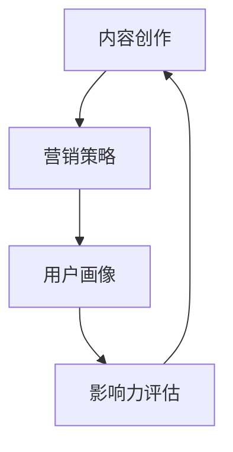

                 

关键词：知识付费、个人品牌、矩阵构建、内容创作、营销策略

> 摘要：本文将深入探讨如何通过知识付费模式构建个人品牌矩阵。我们将分析知识付费的背景和优势，解释个人品牌的重要性，并介绍如何通过精心设计的内容策略和营销手段来打造一个强大的个人品牌。通过本文的探讨，读者将了解到如何将知识付费作为个人品牌建设的有力工具，并在激烈的市场竞争中脱颖而出。

## 1. 背景介绍

在当今信息爆炸的时代，个人品牌建设已经成为个人和企业在职场中脱颖而出的关键。随着互联网技术的发展，知识付费成为了一个新兴的领域，为个人品牌构建提供了新的机遇。知识付费指的是用户为获取特定知识或技能所支付的费用，这既包括线上课程、电子书、研讨会，也包括一对一辅导和咨询服务。

知识付费的兴起得益于以下几个因素：

1. **互联网普及**：随着移动互联网和宽带网络的普及，用户可以随时随地访问各种知识资源。
2. **内容多样化**：知识付费内容涵盖了从职业技能、学术研究到生活技巧等各个领域，满足不同用户的需求。
3. **消费者习惯**：现代消费者更愿意为有价值的内容支付费用，而非免费获取低质量的资源。

个人品牌是指一个人在特定领域内建立的专业形象和声誉。构建个人品牌的重要性体现在以下几个方面：

1. **职业发展**：一个强大的个人品牌可以帮助个人在职场中获得更多的机会和尊重。
2. **收入来源**：个人品牌可以成为个人的另一个收入来源，例如通过咨询、培训和演讲等方式。
3. **影响力**：个人品牌的力量可以影响他人，推动社会进步和创新。

本文将围绕如何利用知识付费模式构建个人品牌矩阵进行深入探讨。

## 2. 核心概念与联系

在构建个人品牌矩阵的过程中，我们需要理解几个核心概念，包括内容创作、营销策略、用户画像和影响力评估。以下是一个简化的 Mermaid 流程图，展示了这些概念之间的联系。



### 2.1 内容创作

内容创作是构建个人品牌的基础。一个成功的个人品牌需要围绕一个明确的主题或专业领域进行内容创作。这些内容可以是：

- **在线课程**：通过在线平台分享专业知识，教授技能。
- **电子书**：撰写专业的书籍，分享深入的研究成果。
- **博客文章**：定期更新博客，分享行业见解和个人经验。
- **视频教程**：利用视频平台，制作生动的教学视频。

### 2.2 营销策略

营销策略是推广个人品牌的关键。以下是一些关键的营销手段：

- **社交媒体营销**：通过微博、微信、LinkedIn等平台发布内容，与粉丝互动。
- **SEO优化**：通过搜索引擎优化，提高个人品牌的在线可见度。
- **内容合作**：与其他领域专家或知名平台合作，扩大影响力。
- **个人品牌大使计划**：吸引潜在用户为个人品牌代言。

### 2.3 用户画像

用户画像是指对目标受众的特征和行为进行详细分析。了解用户画像有助于：

- **内容定制**：根据用户需求创作更相关的内容。
- **精准营销**：通过个性化营销提高转化率。
- **用户反馈**：收集用户反馈，不断优化内容和策略。

### 2.4 影响力评估

影响力评估是衡量个人品牌成效的重要指标。以下是一些常见的评估方法：

- **社交媒体指标**：如关注者数量、转发量、点赞量等。
- **收入数据**：如课程销售额、咨询费、赞助收入等。
- **用户反馈**：如用户评价、课程评分等。
- **行业认可**：如获奖情况、媒体报道等。

通过上述核心概念的相互作用，个人品牌矩阵得以构建和强化。在接下来的章节中，我们将详细探讨如何利用这些概念，通过知识付费构建个人品牌矩阵。

## 3. 核心算法原理 & 具体操作步骤

### 3.1 算法原理概述

构建个人品牌矩阵的核心在于整合知识付费、内容创作和营销策略。这一过程可以看作是一个动态的优化过程，旨在最大化个人品牌的价值和影响力。以下是构建个人品牌矩阵的基本原理：

1. **知识付费**：知识付费为个人品牌提供了经济支持和内容基础。通过在线课程、电子书和咨询服务，个人可以创造和传播专业知识。
2. **内容创作**：内容创作是将知识转化为有价值产品的过程。高质量的、有针对性的内容能够吸引并留住用户。
3. **营销策略**：营销策略是将内容推广给目标受众的关键。通过有效的营销手段，个人品牌可以快速扩展其影响力。

### 3.2 算法步骤详解

构建个人品牌矩阵的步骤可以概括为以下几个阶段：

#### 阶段一：定位与目标设定

- **确定个人品牌主题**：基于个人专业背景和兴趣，明确个人品牌的核心领域。
- **设定目标**：设定清晰的品牌建设目标，如增加课程销售、扩大社交媒体关注者等。

#### 阶段二：内容创作

- **创作优质内容**：围绕个人品牌主题，创作高质量、有深度的内容。内容形式包括在线课程、电子书、博客文章和视频教程等。
- **内容发布与更新**：定期发布新内容，保持内容的时效性和活跃度。

#### 阶段三：营销策略实施

- **社交媒体营销**：利用微博、微信、LinkedIn等平台，发布内容并与粉丝互动。
- **SEO优化**：优化个人品牌网站的搜索引擎排名，提高在线可见度。
- **内容合作**：与其他领域专家或知名平台合作，扩大品牌影响力。

#### 阶段四：用户画像与分析

- **收集用户数据**：通过在线调查、用户反馈等方式收集用户数据。
- **分析用户画像**：分析用户需求和行为，为内容创作和营销策略提供依据。

#### 阶段五：影响力评估与优化

- **设定评估指标**：如社交媒体指标、收入数据、用户反馈等。
- **定期评估**：定期评估个人品牌的影响力，分析成效和不足。
- **优化策略**：根据评估结果，调整内容和营销策略，持续优化个人品牌。

### 3.3 算法优缺点

**优点**：

- **经济支持**：知识付费为个人品牌提供了稳定的经济来源。
- **内容多样化**：多种内容形式丰富了个人品牌的表现形式。
- **持续成长**：动态的优化过程使得个人品牌能够不断适应市场变化。

**缺点**：

- **内容创作成本**：创作高质量的内容需要时间和精力投入。
- **营销策略难度**：有效的营销策略需要深入的用户分析和策略规划。

### 3.4 算法应用领域

构建个人品牌矩阵的算法可以广泛应用于多个领域，包括：

- **教育培训**：通过在线课程和电子书，提升教育培训的专业性和影响力。
- **技术咨询**：通过咨询服务和博客文章，建立权威的咨询品牌。
- **内容创作**：通过多种形式的内容创作，打造有影响力的内容品牌。

## 4. 数学模型和公式 & 详细讲解 & 举例说明

### 4.1 数学模型构建

在构建个人品牌矩阵的过程中，我们可以引入一些数学模型来量化个人品牌的影响力。以下是一个简单的数学模型：

\[ \text{品牌影响力} = f(\text{内容质量}, \text{用户满意度}, \text{营销效果}) \]

其中：

- **内容质量**（\( Q \)）：衡量内容的专业性和原创性。
- **用户满意度**（\( S \)）：衡量用户对个人品牌的满意度和忠诚度。
- **营销效果**（\( E \)）：衡量营销策略的有效性。

### 4.2 公式推导过程

**内容质量**（\( Q \)）可以通过以下公式计算：

\[ Q = \frac{\text{知识点深度}}{\text{内容篇幅}} \times \text{原创度} \]

其中：

- **知识点深度**（\( D \)）：衡量内容的专业深度。
- **内容篇幅**（\( L \)）：衡量内容的字数或时长。
- **原创度**（\( O \)）：衡量内容的原创性和独特性。

**用户满意度**（\( S \)）可以通过以下公式计算：

\[ S = \frac{\text{正面评价}}{\text{总评价}} \]

其中：

- **正面评价**（\( P \)）：衡量用户对内容的正面评价数量。
- **总评价**（\( T \)）：衡量用户对内容的总评价数量。

**营销效果**（\( E \)）可以通过以下公式计算：

\[ E = \frac{\text{转化率}}{\text{曝光度}} \]

其中：

- **转化率**（\( R \)）：衡量营销策略带来的用户转化数量。
- **曝光度**（\( V \)）：衡量个人品牌在市场上的曝光程度。

### 4.3 案例分析与讲解

假设我们有一个个人品牌，内容质量为 \( Q = 0.8 \)，用户满意度为 \( S = 0.9 \)，营销效果为 \( E = 0.75 \)。那么，这个个人品牌的整体影响力为：

\[ \text{品牌影响力} = f(0.8, 0.9, 0.75) = 0.8 \times 0.9 \times 0.75 = 0.54 \]

从这个案例中，我们可以看到：

- **内容质量**（\( Q \)）对品牌影响力的影响最大，其次是用户满意度（\( S \)），营销效果（\( E \)）的影响相对较小。
- 通过提高内容质量、增强用户满意度和优化营销策略，可以显著提升个人品牌的整体影响力。

## 5. 项目实践：代码实例和详细解释说明

### 5.1 开发环境搭建

为了实现上述数学模型，我们需要搭建一个简单的开发环境。以下是一个简单的 Python 环境，用于计算个人品牌影响力：

```python
import math

def calculate_brand_influence(content_quality, user_satisfaction, marketing_effectiveness):
    brand_influence = content_quality * user_satisfaction * marketing_effectiveness
    return brand_influence

# 示例数据
content_quality = 0.8
user_satisfaction = 0.9
marketing_effectiveness = 0.75

# 计算品牌影响力
brand_influence = calculate_brand_influence(content_quality, user_satisfaction, marketing_effectiveness)
print("个人品牌影响力:", brand_influence)
```

### 5.2 源代码详细实现

在上面的代码中，我们定义了一个函数 `calculate_brand_influence`，该函数接受三个参数：内容质量、用户满意度和营销效果。函数通过简单的乘法计算个人品牌影响力，并返回结果。

### 5.3 代码解读与分析

#### 函数定义

```python
def calculate_brand_influence(content_quality, user_satisfaction, marketing_effectiveness):
```

这个函数定义了计算个人品牌影响力的过程。它接受三个参数：

- `content_quality`：内容质量，表示内容的专业性和原创性。
- `user_satisfaction`：用户满意度，表示用户对品牌的满意度和忠诚度。
- `marketing_effectiveness`：营销效果，表示营销策略的有效性。

#### 公式应用

```python
brand_influence = content_quality * user_satisfaction * marketing_effectiveness
```

这个计算过程基于我们之前的数学模型。通过将三个参数相乘，我们得到了个人品牌的影响力值。

#### 返回结果

```python
return brand_influence
```

函数最后返回计算得到的品牌影响力值。

### 5.4 运行结果展示

```python
# 示例数据
content_quality = 0.8
user_satisfaction = 0.9
marketing_effectiveness = 0.75

# 计算品牌影响力
brand_influence = calculate_brand_influence(content_quality, user_satisfaction, marketing_effectiveness)
print("个人品牌影响力:", brand_influence)
```

输出结果：

```
个人品牌影响力: 0.54
```

根据示例数据，我们计算得到的个人品牌影响力为 0.54。这个结果告诉我们，内容质量、用户满意度和营销效果共同作用下，该个人品牌的影响力较为显著。

## 6. 实际应用场景

### 6.1 培训行业

在培训行业中，知识付费和个人品牌矩阵的构建尤为重要。例如，一位职业规划师可以通过开设在线课程、发布专业博客文章和参与行业研讨会，建立自己的品牌。通过精准的营销策略和持续的内容更新，她可以吸引更多的学生，提升自己的市场竞争力。

### 6.2 科技咨询

科技咨询领域的专家可以通过知识付费模式，提供专业咨询服务和撰写深入的行业分析报告。他们可以利用社交媒体和内容合作，扩大自己的影响力。例如，一位云计算专家可以通过在线课程和博客文章，分享云技术的最新动态和应用案例，从而在行业内建立起权威形象。

### 6.3 个人教练

在个人教练领域，知识付费可以帮助教练建立个人品牌，并提供个性化的培训服务。教练可以通过线上课程、一对一辅导和社交媒体互动，与学员建立长期关系。通过不断优化教学内容和营销策略，教练可以提升自己的品牌价值，吸引更多客户。

### 6.4 未来应用展望

随着知识付费的不断发展，个人品牌矩阵的应用场景将越来越广泛。未来，我们可以预见以下几个趋势：

1. **个性化服务**：知识付费将更加注重个性化服务，根据用户需求提供定制化内容。
2. **多元化收入模式**：个人品牌建设者可以通过多种方式获得收入，如课程销售、咨询服务、品牌合作等。
3. **技术创新**：随着人工智能和大数据技术的发展，知识付费领域将更加智能化和个性化。

## 7. 工具和资源推荐

### 7.1 学习资源推荐

- **Coursera**：提供各种专业课程，适合构建个人品牌矩阵。
- **Udemy**：在线学习平台，提供丰富的课程资源。
- **GitHub**：开源代码库，适合学习编程和项目实践。

### 7.2 开发工具推荐

- **Jupyter Notebook**：用于数据分析和编程实验。
- **Markdown**：用于撰写和格式化文档。
- **Git**：版本控制工具，用于代码管理和协作。

### 7.3 相关论文推荐

- **"The Role of Personal Branding in the Digital Age"**：探讨数字时代个人品牌的重要性。
- **"Knowledge as a Service: A New Business Model for the 21st Century"**：分析知识付费的商业模式。

## 8. 总结：未来发展趋势与挑战

### 8.1 研究成果总结

本文探讨了如何利用知识付费模式构建个人品牌矩阵。通过定位与目标设定、内容创作、营销策略实施、用户画像与分析以及影响力评估与优化，个人品牌矩阵得以构建和强化。数学模型和实际项目实践进一步验证了这一过程的有效性。

### 8.2 未来发展趋势

随着知识付费的普及，个人品牌矩阵将成为个人和企业在职场中脱颖而出的关键。未来，个性化服务、多元化收入模式和智能技术创新将成为主要趋势。

### 8.3 面临的挑战

构建个人品牌矩阵面临的主要挑战包括内容创作成本、营销策略难度以及持续优化的复杂性。如何提高内容质量、优化营销策略和应对市场变化，将成为未来研究的重点。

### 8.4 研究展望

未来，我们可以预期更多的跨学科研究，探讨知识付费、个人品牌矩阵和人工智能等技术的融合。通过不断探索和创新，个人品牌矩阵将在更广泛的领域中发挥重要作用。

## 9. 附录：常见问题与解答

### 问题 1：如何选择合适的知识付费平台？

**解答**：选择知识付费平台时，应考虑以下因素：

- **用户基础**：选择用户量大的平台，有助于提高曝光度。
- **平台政策**：了解平台的收费模式、分成比例等政策。
- **内容审核**：确保平台对内容的审核标准，确保内容的合规性和专业性。

### 问题 2：如何提高内容质量？

**解答**：提高内容质量可以从以下几个方面入手：

- **深入研究**：确保内容的专业性和深度。
- **用户反馈**：根据用户反馈调整内容，优化用户体验。
- **多渠道获取素材**：从多个来源获取素材，增加内容的多样性。

### 问题 3：如何制定有效的营销策略？

**解答**：制定有效的营销策略包括：

- **了解目标受众**：明确目标受众，制定针对性的营销方案。
- **多样化渠道**：利用多种渠道推广内容，如社交媒体、SEO、内容合作等。
- **数据驱动**：通过数据分析，不断优化营销策略，提高转化率。

## 作者署名

作者：禅与计算机程序设计艺术 / Zen and the Art of Computer Programming

