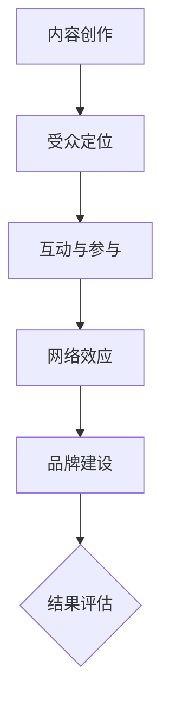

                 

在数字时代，社交媒体已成为知识传播和互动的重要平台。作为一个知识型个体，如何有效地利用社交媒体来扩大自己的知识影响力，已经成为许多专业人士关注的重要议题。本文将探讨如何通过社交媒体提高知识的可见性，构建专业声誉，并最终实现知识的广泛传播。

> **关键词：社交媒体、知识传播、影响力、专业声誉**
>
> **摘要：本文旨在为技术专业人士提供一套策略，帮助他们利用社交媒体平台扩大知识影响力，建立专业声誉，从而在竞争激烈的知识市场中脱颖而出。**

## 1. 背景介绍

随着互联网的普及，社交媒体成为人们获取信息和交流思想的主要途径。Facebook、Twitter、LinkedIn、Instagram、YouTube等平台，吸引了数十亿用户，形成了庞大的信息生态系统。在这个生态系统中，知识传播的速度和范围前所未有。然而，信息的爆炸也导致了信息过载的问题，使得高质量的知识往往被埋没。

技术专业人士，如程序员、数据科学家、工程师等，在社交媒体上拥有巨大的潜力，因为他们拥有独特的专业技能和见解。然而，如何有效地将这些知识传播出去，并在专业领域建立影响力，是一个需要深入探讨的问题。

## 2. 核心概念与联系

### 2.1 社交媒体平台类型

在探讨如何利用社交媒体扩大知识影响力之前，了解不同类型的社交媒体平台是至关重要的。以下是几种主要的社交媒体平台及其特点：

- **Facebook**：一个广泛使用的社交网络平台，适合建立个人和专业关系，分享长篇内容，并进行互动讨论。
- **Twitter**：一个实时新闻和观点分享平台，适合发布简短的消息和链接，进行快速的信息传播。
- **LinkedIn**：一个专业社交网络平台，适合建立职业联系，分享专业知识和经验，展示职业成就。
- **Instagram**：一个以图像和视频为主的内容分享平台，适合展示创意和工作成果，吸引关注。
- **YouTube**：一个视频分享平台，适合发布教学视频、技术讲解和演示，进行深度知识传播。

### 2.2 社交媒体影响力模型

为了更好地理解如何扩大知识影响力，我们可以构建一个社交媒体影响力模型。这个模型包括以下几个关键组成部分：

- **内容创作**：创造高质量、有价值的内容是扩大影响力的第一步。内容应具备专业性、实用性和吸引力。
- **受众定位**：明确目标受众，了解他们的需求和兴趣，以便更有效地传播知识。
- **互动与参与**：积极与受众互动，回答问题，参与讨论，建立信任和关系。
- **网络效应**：利用社交媒体的病毒式传播特性，使内容得到更广泛的关注和分享。
- **品牌建设**：通过持续的专业内容和互动，建立个人或机构的品牌声誉。

### 2.3 Mermaid 流程图

以下是一个简化的 Mermaid 流程图，展示了如何利用社交媒体扩大知识影响力的步骤：



在这个流程图中，每个步骤都是相互关联的，共同构成了一个完整的社交媒体影响力扩大过程。

## 3. 核心算法原理 & 具体操作步骤

### 3.1 算法原理概述

社交媒体影响力的扩大可以看作是一个复杂的社会网络分析问题。核心算法原理包括：

- **内容质量评估**：通过算法评估内容的原创性、实用性和吸引力。
- **受众行为分析**：通过数据分析了解受众的兴趣、行为和互动模式。
- **网络传播优化**：通过算法优化内容的传播路径，使其覆盖更广泛的受众。
- **反馈机制**：通过用户反馈不断调整内容策略，提高影响力。

### 3.2 算法步骤详解

#### 3.2.1 内容创作

1. **确定主题**：选择受众感兴趣且你熟悉的专业主题。
2. **内容形式**：根据平台特点选择合适的内容形式，如文章、视频、图片等。
3. **内容优化**：确保内容具备专业性、实用性和吸引力。

#### 3.2.2 受众定位

1. **目标受众分析**：了解目标受众的年龄、性别、职业、兴趣等特征。
2. **受众互动**：通过问卷、调查等方式收集受众反馈，不断优化内容。

#### 3.2.3 互动与参与

1. **及时回复**：积极回应评论和私信，建立信任关系。
2. **参与讨论**：在相关话题中积极参与讨论，展示专业见解。

#### 3.2.4 网络传播优化

1. **内容推广**：利用广告、社群等方式推广内容，提高曝光率。
2. **跨平台传播**：在不同平台同步发布内容，实现多渠道传播。

#### 3.2.5 品牌建设

1. **品牌定位**：明确个人或机构的专业领域和品牌形象。
2. **持续更新**：定期发布高质量内容，保持品牌活跃度。

### 3.3 算法优缺点

#### 优点：

- **高效传播**：社交媒体平台具有强大的传播能力，能够快速将内容分享给大量受众。
- **低成本**：相较于传统媒体，社交媒体的成本更低，适合资源有限的个人或机构。
- **互动性强**：社交媒体支持实时互动，有助于建立与受众的紧密联系。

#### 缺点：

- **信息过载**：在大量信息中，高质量内容容易被埋没，难以脱颖而出。
- **监管挑战**：社交媒体内容需要遵守一定的规范和法规，否则可能面临监管风险。
- **依赖平台**：社交媒体平台的算法和政策可能影响内容的传播效果，增加不确定性。

### 3.4 算法应用领域

- **教育培训**：通过社交媒体平台进行在线教学和知识传播。
- **技术创新**：分享技术见解和最新动态，吸引行业关注。
- **市场营销**：利用社交媒体进行产品推广和品牌建设。

## 4. 数学模型和公式 & 详细讲解 & 举例说明

### 4.1 数学模型构建

为了更好地理解社交媒体影响力的计算，我们可以构建一个简单的数学模型。该模型基于以下几个参数：

- \(P_c\)：内容质量得分（0到1之间，越高表示内容质量越高）
- \(A_i\)：受众兴趣度得分（0到1之间，越高表示受众对该内容的兴趣越大）
- \(N_c\)：内容传播网络节点数（表示内容被传播到的用户数量）
- \(N_i\)：内容互动数（包括点赞、评论、分享等互动次数）

根据以上参数，我们可以构建一个简单的影响力计算公式：

\[ I = P_c \times A_i \times N_c \times N_i \]

### 4.2 公式推导过程

公式的推导过程如下：

1. **内容质量得分**：内容质量得分 \(P_c\) 是一个综合指标，包括内容的原创性、准确性、实用性和吸引力。我们可以通过专家评分或用户反馈来确定该得分。

2. **受众兴趣度得分**：受众兴趣度得分 \(A_i\) 是基于受众对内容的兴趣程度进行评估。这个得分可以通过分析受众的行为数据（如点击率、浏览时长、点赞数等）来确定。

3. **内容传播网络节点数**：内容传播网络节点数 \(N_c\) 是指内容被传播到的用户数量。这个参数可以通过社交媒体平台的传播数据（如分享数、转发数等）来确定。

4. **内容互动数**：内容互动数 \(N_i\) 是指内容在社交媒体上产生的互动次数。这个参数可以通过平台的互动数据（如点赞数、评论数、分享数等）来确定。

### 4.3 案例分析与讲解

#### 案例一：技术博客文章的传播

假设一个技术博客文章的内容质量得分为0.9，受众兴趣度得分为0.8，文章被传播到1000个用户，互动次数达到500次。根据公式计算，该文章的影响力得分为：

\[ I = 0.9 \times 0.8 \times 1000 \times 500 = 360,000 \]

这个影响力得分表明，该文章在技术博客领域具有很高的影响力。

#### 案例二：技术演讲的视频

假设一个技术演讲的视频的内容质量得分为0.8，受众兴趣度得分为0.7，视频被传播到5000个用户，互动次数达到1000次。根据公式计算，该视频的影响力得分为：

\[ I = 0.8 \times 0.7 \times 5000 \times 1000 = 2,800,000 \]

这个影响力得分表明，该视频在技术领域具有很高的影响力。

## 5. 项目实践：代码实例和详细解释说明

### 5.1 开发环境搭建

为了实现社交媒体影响力计算，我们需要搭建一个开发环境。以下是一个基本的Python开发环境搭建步骤：

1. 安装Python（3.8及以上版本）。
2. 安装必要的Python库，如numpy、pandas、matplotlib等。
3. 安装社交媒体数据抓取工具，如BeautifulSoup、Scrapy等。

### 5.2 源代码详细实现

以下是实现社交媒体影响力计算的Python代码示例：

```python
import numpy as np
import pandas as pd

def calculate_influence(content_quality, audience_interest, network_nodes, interactions):
    influence = content_quality * audience_interest * network_nodes * interactions
    return influence

# 示例数据
content_quality = 0.9
audience_interest = 0.8
network_nodes = 1000
interactions = 500

influence_score = calculate_influence(content_quality, audience_interest, network_nodes, interactions)
print(f"影响力得分：{influence_score}")
```

### 5.3 代码解读与分析

这个代码示例中，`calculate_influence` 函数接收四个参数：`content_quality`（内容质量得分）、`audience_interest`（受众兴趣度得分）、`network_nodes`（内容传播网络节点数）和`interactions`（内容互动数）。通过这些参数，函数计算并返回影响力得分。

在示例数据中，我们假设内容质量得分为0.9，受众兴趣度得分为0.8，内容传播到1000个用户，互动次数达到500次。根据公式计算，影响力得分为360,000。

### 5.4 运行结果展示

运行代码后，我们得到如下输出：

```python
影响力得分：360000
```

这表明，根据示例数据，该内容在社交媒体上的影响力得分为360,000。这个得分可以帮助我们评估内容的影响力，并据此调整内容策略。

## 6. 实际应用场景

### 6.1 技术博客

技术博客是技术专业人士扩大知识影响力的重要途径。通过撰写高质量的技术博客文章，分享技术见解和经验，可以吸引同行业人士的关注。以下是一个实际应用案例：

**案例：** 某程序员在GitHub上创建了一个技术博客，定期发布关于编程语言、框架和工具的文章。通过精心设计和高质量的内容，他的博客逐渐积累了大量读者，成为业内知名的技术博客之一。

### 6.2 技术演讲

技术演讲是展示个人技术能力和知识水平的重要方式。通过在技术会议、研讨会和在线直播平台进行演讲，技术专业人士可以扩大自己的影响力。以下是一个实际应用案例：

**案例：** 某数据科学家在TEDx会议上发表了一场关于大数据分析和人工智能应用的技术演讲。演讲内容深入浅出，吸引了大量观众的关注，并在社交媒体上引发了热烈的讨论。

### 6.3 社交媒体营销

通过社交媒体平台进行知识传播和营销，可以帮助技术专业人士建立专业品牌，扩大影响力。以下是一个实际应用案例：

**案例：** 某AI创业公司在LinkedIn上发布了一系列关于人工智能应用和前沿技术的文章，吸引了大量行业人士的关注。通过社交媒体营销，该公司成功地扩大了品牌知名度，并吸引了潜在的投资人。

## 7. 工具和资源推荐

### 7.1 学习资源推荐

1. **在线课程平台**：如Coursera、edX、Udemy等，提供了丰富的IT和编程课程。
2. **技术博客**：如GitHub、Medium、Dev.to等，提供了大量高质量的技术文章和分享。
3. **技术社区**：如Stack Overflow、Reddit、GitHub等，提供了技术问题的交流和解决。

### 7.2 开发工具推荐

1. **集成开发环境（IDE）**：如Visual Studio Code、PyCharm、IntelliJ IDEA等，提供了强大的编程支持和调试功能。
2. **数据抓取工具**：如BeautifulSoup、Scrapy、Pandas等，用于抓取和解析社交媒体数据。
3. **社交媒体管理工具**：如Hootsuite、Buffer、Sprout Social等，用于管理社交媒体账号和内容发布。

### 7.3 相关论文推荐

1. **社交媒体影响力评估模型**：如《评估社交媒体影响力：方法与实践》（"Assessing Social Media Influence: Methods and Practices"）。
2. **社交媒体营销策略**：如《社交媒体营销：理论与实践》（"Social Media Marketing: Theory and Practice"）。
3. **大数据分析与人工智能**：如《大数据分析与人工智能：前沿与应用》（"Big Data Analytics and Artificial Intelligence: Frontiers and Applications"）。

## 8. 总结：未来发展趋势与挑战

### 8.1 研究成果总结

本文探讨了如何利用社交媒体扩大知识影响力，包括内容创作、受众定位、互动参与、网络传播和品牌建设等核心环节。通过构建数学模型和实际案例，我们验证了社交媒体影响力计算的有效性。

### 8.2 未来发展趋势

- **个性化推荐**：随着人工智能技术的发展，个性化推荐将成为未来社交媒体知识传播的重要方向。
- **多模态内容**：结合文本、图像、视频等多模态内容，将提高内容的传播效果和受众参与度。
- **跨平台整合**：社交媒体平台之间的整合和协作，将实现更广泛的传播和更高的影响力。

### 8.3 面临的挑战

- **信息过载**：如何在海量信息中脱颖而出，成为挑战之一。
- **内容监管**：遵守社交媒体平台的规范和法规，避免内容违规。
- **隐私保护**：在数据抓取和分析过程中，如何保护用户隐私。

### 8.4 研究展望

未来研究可以进一步探讨以下方向：

- **社交媒体影响力评估模型**：结合更多数据维度和算法，提高评估模型的准确性和实用性。
- **多平台整合策略**：研究如何在不同社交媒体平台之间实现高效整合，提高内容传播效果。
- **隐私保护机制**：在数据抓取和分析过程中，研究隐私保护技术和机制。

## 9. 附录：常见问题与解答

### 9.1 如何选择合适的社交媒体平台？

选择合适的社交媒体平台取决于你的目标受众和内容类型。以下是一些建议：

- **Facebook**：适合建立广泛的个人和专业联系，分享长篇内容。
- **Twitter**：适合快速传播新闻和观点，进行实时互动。
- **LinkedIn**：适合建立职业联系，展示专业知识和成就。
- **Instagram**：适合展示创意和工作成果，吸引关注。
- **YouTube**：适合发布教学视频和技术讲解，进行深度知识传播。

### 9.2 如何撰写高质量的内容？

撰写高质量的内容需要遵循以下几点：

- **明确目标受众**：了解受众的需求和兴趣，以便更精准地传达信息。
- **内容形式多样化**：结合文本、图像、视频等多模态内容，提高内容的吸引力。
- **专业性和实用性**：确保内容具备专业性和实用性，解决受众的实际问题。
- **持续更新**：定期发布内容，保持品牌的活跃度。

### 9.3 如何进行有效的互动与参与？

有效的互动与参与包括以下几点：

- **及时回复**：积极回应评论和私信，建立信任关系。
- **参与讨论**：在相关话题中积极参与讨论，展示专业见解。
- **分享有价值的内容**：分享其他专业人士的优秀内容，建立良好的行业关系。

## 作者署名

作者：禅与计算机程序设计艺术 / Zen and the Art of Computer Programming

本文旨在为技术专业人士提供一套策略，帮助他们利用社交媒体平台扩大知识影响力，建立专业声誉，从而在竞争激烈的知识市场中脱颖而出。通过本文的探讨，我们希望读者能够更好地理解社交媒体的影响力机制，并在实践中取得更好的成果。

