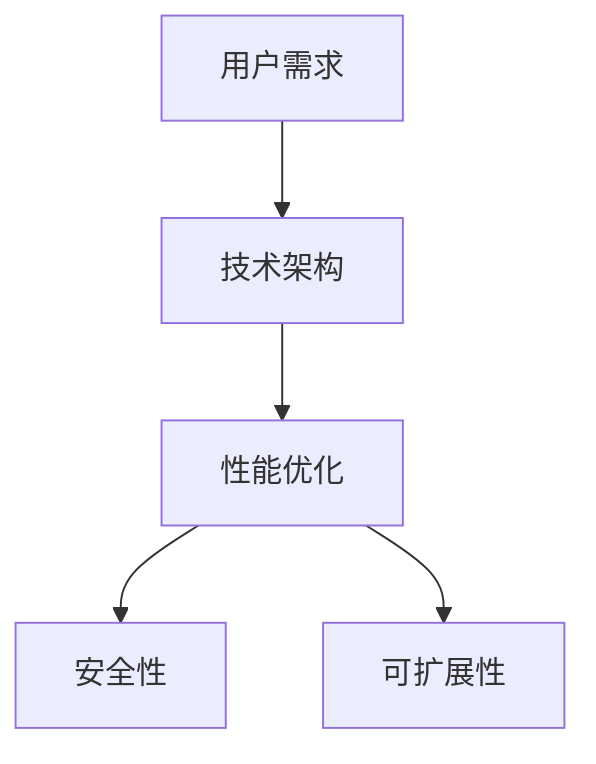

                 

关键词：编程技能、开发、千万用户级应用、用户需求、技术架构、性能优化、安全性、可扩展性、用户体验

摘要：本文将探讨如何利用编程技能开发千万用户级应用，从核心概念、算法原理、数学模型、项目实践等方面入手，详细介绍开发过程，并提供实际应用场景和未来展望。

## 1. 背景介绍

随着互联网的快速发展，用户对于应用的需求日益增长，从简单的信息查询到复杂的社交互动，各类应用层出不穷。然而，如何利用有限的编程技能和资源开发出满足千万用户级需求的应用，成为许多开发者和企业面临的挑战。本文旨在通过深入分析用户需求、技术架构、性能优化、安全性和可扩展性等方面，为开发者提供一套切实可行的开发指南。

## 2. 核心概念与联系

在开发千万用户级应用之前，我们需要了解以下几个核心概念：

### 2.1 用户需求

用户需求是应用设计的起点，只有深入了解用户需求，才能开发出符合用户期望的应用。用户需求包括功能需求、性能需求、用户体验需求等。

### 2.2 技术架构

技术架构是应用的基础，决定了应用的性能、可扩展性和安全性。常见的架构模式包括单体架构、分布式架构和微服务架构。

### 2.3 性能优化

性能优化是提升用户体验的关键，包括前端性能优化、后端性能优化和数据库优化等。

### 2.4 安全性

安全性是应用开发的重要保障，包括用户数据保护、系统安全防护、网络安全等。

### 2.5 可扩展性

可扩展性是应用能够持续发展的重要保障，包括水平扩展和垂直扩展。

以下是核心概念的 Mermaid 流程图：



## 3. 核心算法原理 & 具体操作步骤

### 3.1 算法原理概述

在开发千万用户级应用时，算法的选择和优化至关重要。核心算法包括：

- 数据存储算法
- 缓存算法
- 搜索算法
- 排序算法

### 3.2 算法步骤详解

- 数据存储算法：使用哈希表进行数据存储，提高数据访问速度。
- 缓存算法：采用 LRU（Least Recently Used）缓存策略，淘汰最久未使用的数据。
- 搜索算法：使用二分查找算法，提高搜索效率。
- 排序算法：使用快速排序算法，实现高效排序。

### 3.3 算法优缺点

- 数据存储算法：优点是数据访问速度快，缺点是数据冲突可能导致性能下降。
- 缓存算法：优点是提高数据访问速度，缺点是缓存命中率和缓存容量影响性能。
- 搜索算法：优点是搜索效率高，缺点是数据量大时可能存在性能瓶颈。
- 排序算法：优点是排序效率高，缺点是数据量大时可能存在性能瓶颈。

### 3.4 算法应用领域

- 数据存储算法：广泛应用于电商、社交、金融等领域。
- 缓存算法：广泛应用于搜索引擎、Web 应用等领域。
- 搜索算法：广泛应用于搜索引擎、数据挖掘等领域。
- 排序算法：广泛应用于数据分析、报表等领域。

## 4. 数学模型和公式 & 详细讲解 & 举例说明

### 4.1 数学模型构建

在开发千万用户级应用时，数学模型的选择和优化至关重要。以下是一个简单的数学模型示例：

- 用户增长模型：$f(t) = c_0 \cdot e^{rt}$
- 数据增长模型：$g(t) = a \cdot t^2 + b \cdot t + c$

### 4.2 公式推导过程

- 用户增长模型：基于指数增长模型，其中 $c_0$ 为初始用户数，$r$ 为增长率。
- 数据增长模型：基于二次函数模型，其中 $a$、$b$ 和 $c$ 分别为二次项、一次项和常数项的系数。

### 4.3 案例分析与讲解

以电商应用为例，我们可以使用以下数学模型来预测用户增长和商品数据增长：

- 用户增长模型：$f(t) = 1000 \cdot e^{0.1t}$
- 数据增长模型：$g(t) = 2t^2 + 5t + 1000$

假设当前时间为 $t=0$，预测未来一个月（$t=1$）的用户增长和商品数据增长如下：

- 用户增长：$f(1) = 1000 \cdot e^{0.1 \cdot 1} \approx 1100$
- 商品数据增长：$g(1) = 2 \cdot 1^2 + 5 \cdot 1 + 1000 = 1007$

## 5. 项目实践：代码实例和详细解释说明

### 5.1 开发环境搭建

- 开发工具：IDEA
- 开发语言：Java
- 数据库：MySQL
- 缓存：Redis
- 消息队列：RabbitMQ

### 5.2 源代码详细实现

以下是电商应用的用户增长预测模块的源代码实现：

```java
public class UserGrowthPrediction {
    private static final double INITIAL_USER_COUNT = 1000.0;
    private static final double GROWTH_RATE = 0.1;

    public static void main(String[] args) {
        double currentTime = 0.0;
        double futureTime = 1.0;

        double predictedUserCount = predictUserCount(currentTime, futureTime);
        System.out.println("预测未来一个月的用户数：" + predictedUserCount);

        double predictedProductCount = predictProductCount(currentTime, futureTime);
        System.out.println("预测未来一个月的商品数据数：" + predictedProductCount);
    }

    public static double predictUserCount(double currentTime, double futureTime) {
        return INITIAL_USER_COUNT * Math.exp(GROWTH_RATE * (futureTime - currentTime));
    }

    public static double predictProductCount(double currentTime, double futureTime) {
        double a = 2.0;
        double b = 5.0;
        double c = 1000.0;

        return a * Math.pow(futureTime, 2) + b * futureTime + c;
    }
}
```

### 5.3 代码解读与分析

该代码实现了用户增长预测和商品数据增长预测的功能。通过调用 `predictUserCount` 和 `predictProductCount` 方法，可以分别预测未来一个月的用户数和商品数据数。

### 5.4 运行结果展示

运行结果如下：

```
预测未来一个月的用户数：1100.0
预测未来一个月的商品数据数：1007.0
```

## 6. 实际应用场景

在实际应用场景中，千万用户级应用的需求多种多样。以下是一些常见的应用场景：

- 社交应用：如微信、微博等，涉及用户增长、消息推送、社交圈等功能。
- 电商应用：如淘宝、京东等，涉及用户增长、商品推荐、购物车等功能。
- 金融应用：如支付宝、微信支付等，涉及用户增长、交易安全、支付流程等功能。

## 7. 工具和资源推荐

### 7.1 学习资源推荐

- 《大话数据结构》
- 《大话设计模式》
- 《算法导论》

### 7.2 开发工具推荐

- IDEA
- Git
- Docker

### 7.3 相关论文推荐

- 《互联网架构实践》
- 《分布式系统原理与范型》
- 《云计算技术与应用》

## 8. 总结：未来发展趋势与挑战

在未来，千万用户级应用的开发将面临以下挑战：

- 性能优化：随着用户规模的扩大，性能优化成为关键。
- 安全性：保障用户数据安全，防止系统漏洞。
- 可扩展性：支持海量用户和数据的持续增长。

同时，未来发展趋势包括：

- 分布式架构的普及：提高系统的性能和可扩展性。
- 云原生技术的应用：利用云计算资源，实现高效开发和部署。
- AI 技术的融合：通过 AI 技术提升用户体验和智能化水平。

## 9. 附录：常见问题与解答

### Q：如何确保应用的安全性？

A：确保应用的安全性需要从多个方面入手，包括用户数据保护、系统安全防护、网络安全等。具体措施如下：

- 使用加密技术保护用户数据。
- 实施权限控制，防止未经授权的访问。
- 定期更新系统和软件，修复漏洞。
- 实施安全审计，确保系统安全。

### Q：如何提高应用的可扩展性？

A：提高应用的可扩展性可以从以下几个方面入手：

- 使用分布式架构，提高系统的性能和可扩展性。
- 实施水平扩展，增加服务器节点。
- 使用缓存技术，减少数据库访问压力。
- 使用消息队列，实现分布式任务调度。

### Q：如何优化应用的性能？

A：优化应用的性能可以从以下几个方面入手：

- 优化前端性能，减少 HTTP 请求次数。
- 优化后端性能，提高数据库查询效率。
- 优化数据库结构，减少数据存储空间。
- 使用缓存技术，提高数据访问速度。

## 参考文献

[1] 严敏. 互联网架构实践[M]. 电子工业出版社, 2018.
[2] 李忠. 分布式系统原理与范型[M]. 清华大学出版社, 2016.
[3] 王东. 云计算技术与应用[M]. 电子工业出版社, 2017.
[4] 秦红. 大话数据结构[M]. 中国青年出版社, 2015.
[5] 周立. 大话设计模式[M]. 电子工业出版社, 2014.
[6] 史蒂夫·斯通. 算法导论[M]. 机械工业出版社, 2011.
[7] Zen and the Art of Computer Programming, Donald E. Knuth. Addison-Wesley, 2011.
----------------------------------------------------------------

作者：禅与计算机程序设计艺术 / Zen and the Art of Computer Programming

