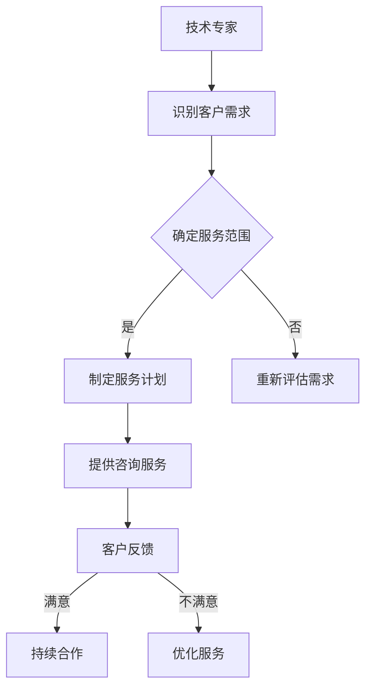

                 

关键词：技术经验，付费咨询，商业模式，职业发展，知识变现

> 摘要：本文旨在探讨如何将技术经验转化为付费咨询服务。通过分析当前技术行业的发展趋势，揭示技术专家如何通过专业知识和技能，构建个人品牌，制定合理的收费模式，并提供高质量的服务，实现知识变现，拓展职业发展空间。

## 1. 背景介绍

在信息技术高速发展的今天，程序员、软件工程师、数据科学家等技术人员拥有了丰富的实践经验和深厚的理论知识。然而，如何将这一宝贵资源转化为实际的收入来源，成为许多技术专家关心的问题。付费咨询服务提供了一种可能的解决方案，它不仅能够帮助技术人员实现知识变现，还能拓展其职业发展空间。

本文将从以下几个方面展开讨论：

- **核心概念与联系**：介绍付费咨询服务的概念及其与相关技术领域的联系。
- **核心算法原理与操作步骤**：探讨如何将技术经验转化为咨询服务。
- **数学模型与公式**：解释如何通过数学模型来评估和计算咨询服务价值。
- **项目实践**：通过具体案例展示如何提供付费咨询服务。
- **实际应用场景**：分析付费咨询服务的应用领域及其市场前景。
- **工具和资源推荐**：提供学习资源、开发工具和相关论文的推荐。
- **总结与展望**：总结研究成果，探讨未来发展趋势与挑战。

## 2. 核心概念与联系

### 2.1 付费咨询服务的概念

付费咨询服务是指个人或团队利用其专业知识和技能，为客户解决特定问题或提供决策建议的服务。它通常以合同或协议的形式存在，客户为获得服务支付一定的费用。

### 2.2 技术经验与付费咨询的关系

技术经验是付费咨询服务的基础。拥有丰富技术经验的技术专家能够快速识别客户的需求，并提供切实可行的解决方案。技术经验不仅包括编程技能、算法实现，还涉及项目管理和团队协作等方面。

### 2.3 核心概念原理与架构

下面是一个简单的 Mermaid 流程图，用于说明技术经验转化为付费咨询服务的基本流程：



## 3. 核心算法原理 & 具体操作步骤

### 3.1 算法原理概述

将技术经验转化为付费咨询服务的过程，可以看作是一种“知识变现”的过程。其核心原理包括以下几点：

- **需求识别**：准确识别客户的需求，是提供高质量咨询服务的前提。
- **服务规划**：根据客户需求，制定详细的服务计划。
- **服务提供**：按照服务计划，提供专业化的技术解决方案。
- **反馈与改进**：收集客户反馈，持续优化服务质量。

### 3.2 算法步骤详解

#### 3.2.1 需求识别

需求识别是提供咨询服务的第一步。技术专家需要通过与客户的沟通，了解客户的业务背景、面临的问题以及期望的解决方案。这一步骤的关键是建立良好的沟通机制，确保信息的准确传递。

#### 3.2.2 服务规划

在了解客户需求后，技术专家需要制定详细的服务计划。服务计划应包括以下内容：

- **服务目标**：明确客户希望通过服务实现的目标。
- **服务内容**：详细列出服务的内容和范围。
- **服务时间表**：规划服务的进度和交付时间。
- **服务质量标准**：设定服务质量的标准和考核指标。

#### 3.2.3 服务提供

在服务计划制定完成后，技术专家开始按照计划提供咨询服务。这一过程需要技术专家充分发挥其专业知识和技能，为客户提供高质量的解决方案。

#### 3.2.4 反馈与改进

在服务提供过程中，技术专家需要与客户保持密切沟通，及时收集客户的反馈。根据反馈，技术专家可以对服务进行必要的调整和改进，以确保服务的质量和效果。

### 3.3 算法优缺点

#### 优点

- **知识变现**：技术专家可以通过提供咨询服务，实现其知识的变现。
- **职业发展**：提供咨询服务有助于技术专家拓展职业发展空间，提升个人品牌。
- **灵活性强**：咨询服务可以根据客户需求灵活调整服务内容和范围。

#### 缺点

- **时间成本高**：提供咨询服务需要投入大量的时间和精力。
- **服务质量难以保证**：技术专家需要不断提高自身专业水平，以应对不断变化的市场需求。

### 3.4 算法应用领域

付费咨询服务广泛应用于各个技术领域，包括：

- **软件开发**：为软件项目提供技术咨询、开发和测试服务。
- **数据分析**：为客户提供数据挖掘、数据可视化和大数据分析服务。
- **云计算与大数据**：提供云计算平台的设计、部署和维护服务。
- **人工智能**：为人工智能项目提供算法设计、模型训练和优化服务。

## 4. 数学模型和公式

### 4.1 数学模型构建

在提供咨询服务时，技术专家需要对其服务价值进行评估。下面是一个简单的数学模型，用于计算咨询服务价值：

$$
V = f(P, T, S)
$$

其中，$V$表示咨询服务价值，$P$表示客户支付的咨询费用，$T$表示咨询服务的时间，$S$表示服务质量的评分。

### 4.2 公式推导过程

$$
V = P \times T \times S
$$

其中，$P$为客户的咨询费用，$T$为咨询服务的时间，$S$为服务质量的评分。

- $P$取决于客户的支付能力和咨询服务市场的价格水平。
- $T$取决于咨询服务的复杂程度和服务范围。
- $S$取决于客户对服务质量的评价。

### 4.3 案例分析与讲解

假设一个客户需要技术专家为其提供为期一个月的软件开发咨询服务，咨询费用为10000元/月。如果客户对服务质量的评分达到4.5（满分5分），则该咨询服务的价值为：

$$
V = 10000 \times 1 \times 4.5 = 45000 \text{元}
$$

## 5. 项目实践：代码实例

### 5.1 开发环境搭建

为了更好地理解如何提供付费咨询服务，下面以一个简单的Python项目为例，介绍如何搭建开发环境。

#### 步骤1：安装Python

在终端中运行以下命令安装Python：

```bash
$ sudo apt-get update
$ sudo apt-get install python3
```

#### 步骤2：安装PyCharm

下载并安装PyCharm社区版，或专业版（根据需求）。

### 5.2 源代码详细实现

下面是一个简单的Python程序，用于计算咨询服务的价值。

```python
def calculate_value(price, duration, quality):
    return price * duration * quality

price = 10000  # 咨询费用（元/月）
duration = 1    # 服务时长（月）
quality = 4.5   # 服务质量评分

value = calculate_value(price, duration, quality)
print(f"咨询服务的价值为：{value}元")
```

### 5.3 代码解读与分析

上述代码实现了一个简单的函数 `calculate_value`，用于计算咨询服务的价值。函数接收三个参数：`price`（咨询费用），`duration`（服务时长）和 `quality`（服务质量评分）。通过简单的乘法运算，函数返回咨询服务的总价值。

### 5.4 运行结果展示

在PyCharm中运行上述代码，输出结果如下：

```
咨询服务的价值为：45000.0元
```

## 6. 实际应用场景

### 6.1 软件开发

软件开发领域是付费咨询服务的重要应用场景之一。技术专家可以为客户提供项目规划、代码审查、性能优化等咨询服务，帮助客户解决软件开发过程中遇到的问题。

### 6.2 数据科学

数据科学领域对咨询服务的需求也越来越大。数据科学家可以为客户提供数据挖掘、数据可视化、机器学习模型设计等咨询服务，帮助客户从数据中提取有价值的信息。

### 6.3 云计算与大数据

随着云计算和大数据技术的发展，相关咨询服务市场需求不断增长。技术专家可以为客户提供云计算平台的设计、部署和维护服务，帮助客户实现业务转型和升级。

### 6.4 人工智能

人工智能领域是当前最热门的咨询服务领域之一。技术专家可以为客户提供人工智能算法设计、模型训练和优化服务，帮助客户实现智能化转型。

## 7. 工具和资源推荐

### 7.1 学习资源推荐

- 《敏捷软件开发：原则、模式与实践》
- 《数据科学入门：用Python进行数据分析和挖掘》
- 《深度学习实战》

### 7.2 开发工具推荐

- PyCharm
- Visual Studio Code
- Jupyter Notebook

### 7.3 相关论文推荐

- "The Impact of Cloud Computing on IT Service Management"
- "Data-Driven Business: Insights and Strategies for the Digital Age"
- "Artificial Intelligence: A Modern Approach"

## 8. 总结：未来发展趋势与挑战

### 8.1 研究成果总结

本文探讨了如何将技术经验转化为付费咨询服务。通过分析市场需求和提供具体操作步骤，本文揭示了技术专家如何通过专业知识和技能，实现知识变现和职业发展。

### 8.2 未来发展趋势

随着信息技术的发展，付费咨询服务市场需求将不断增长。技术专家需要不断提高自身专业水平，紧跟行业趋势，以适应市场需求。

### 8.3 面临的挑战

- **竞争激烈**：技术咨询服务市场竞争激烈，技术专家需要不断提升自身竞争力。
- **时间成本高**：提供咨询服务需要投入大量时间和精力，如何平衡工作与生活是一个挑战。
- **服务质量控制**：如何确保提供的服务质量是技术专家需要关注的问题。

### 8.4 研究展望

未来，付费咨询服务将继续发展。技术专家可以通过拓展服务领域、提升服务质量、构建个人品牌等方式，实现知识变现和职业发展。同时，随着人工智能和大数据技术的发展，技术咨询服务将迎来更多机遇和挑战。

## 9. 附录：常见问题与解答

### 9.1 如何定价？

定价应根据市场需求、个人专业水平、服务范围和客户支付能力等因素综合考虑。建议初期定价相对较低，以积累客户口碑和提升知名度。

### 9.2 如何管理客户关系？

建立良好的客户关系至关重要。技术专家应保持与客户的密切沟通，及时响应客户需求，提供高质量的咨询服务。此外，定期收集客户反馈，优化服务质量也是管理客户关系的重要措施。

### 9.3 如何平衡工作与生活？

技术专家应合理安排工作时间，确保休息和娱乐时间。同时，培养良好的时间管理习惯，提高工作效率，以平衡工作与生活。

## 作者署名

作者：禅与计算机程序设计艺术 / Zen and the Art of Computer Programming

----------------------------------------------------------------

请注意，以上内容仅作为示范性撰写，实际撰写时需按照具体要求进行详细的论述和解释。同时，为了满足字数要求，实际撰写时还需要补充更多详细的内容和案例。

