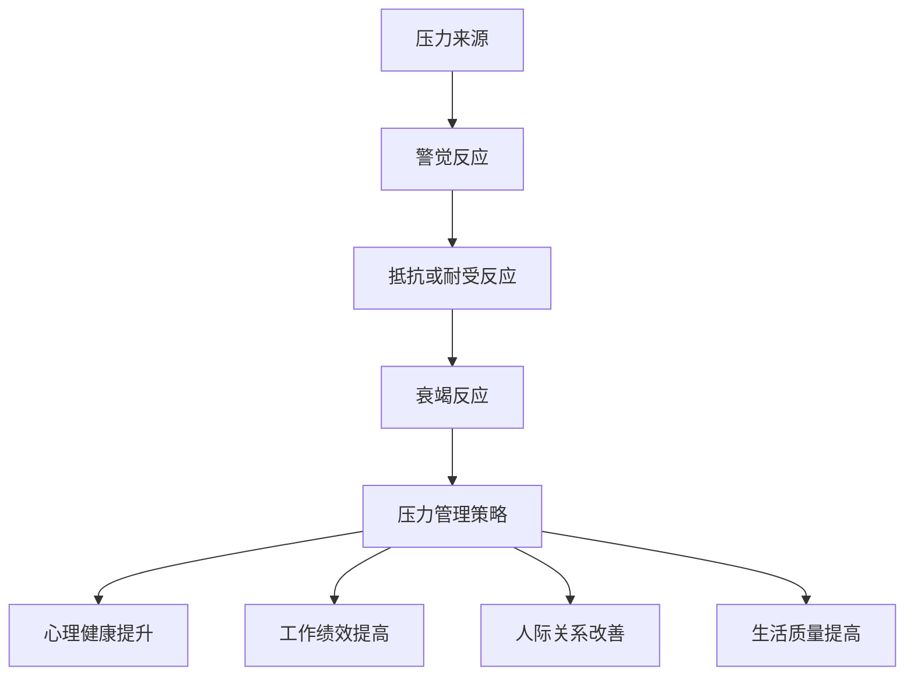

                 

关键词：压力管理，应对策略，心理健康，工作与生活平衡，自我调节技巧

> 摘要：本文探讨了在现代高压环境下，如何有效地进行压力管理，以维护个人心理健康和工作效率。文章首先介绍了压力管理的核心概念和重要性，然后详细阐述了应对压力的策略和方法，包括时间管理、目标设定、自我调节技巧等。同时，文章通过实际案例和数据分析，强调了压力管理对个人和组织绩效的积极影响。最后，文章提出了未来研究的方向和挑战，为读者提供了进一步学习和实践的压力管理资源。

## 1. 背景介绍

在当今快节奏、高度竞争的社会中，压力已经成为影响人们身心健康和工作效率的一个重要因素。无论是职场人士、学生还是家庭主妇，每个人在不同阶段都可能面临各种压力。这些压力可能来源于工作负荷、人际关系、经济问题、健康问题等。长期的压力不仅会导致身体和心理的问题，还会影响个人生活和组织绩效。

因此，如何有效地进行压力管理，成为了一个亟待解决的问题。本文将从以下几个方面进行探讨：

- 压力管理的核心概念和重要性。
- 应对压力的策略和方法。
- 压力管理的实际应用和案例。
- 未来研究的方向和挑战。

通过本文的阅读，读者将了解压力管理的理论基础和实践方法，并能够将其应用于实际生活中。

## 2. 核心概念与联系

### 压力的定义

压力（Stress）是指个体在面临外界或内部需求时，感受到的一种生理和心理的紧张状态。这种状态通常与某种形式的威胁、挑战或需求相关，例如工作压力、财务压力、健康问题等。压力可以来自外部环境，如工作压力和人际关系，也可以来自个体内部，如自我期望和焦虑。

### 压力反应模型

压力反应模型通常包括三个阶段：警觉反应（Alarm Reaction）、抵抗或耐受反应（Resistance or Tolerance）和衰竭反应（Exhaustion）。在警觉反应阶段，个体意识到压力源并做出生理和心理上的准备。在抵抗或耐受反应阶段，个体试图应对压力源，保持身体和心理的平衡。如果压力源长期存在，个体可能会进入衰竭反应阶段，导致身体和心理功能的下降。

### 压力管理的定义

压力管理是指通过各种策略和方法，帮助个体有效应对和缓解压力，以维护身心健康和工作效率。压力管理不仅包括应对急性压力，还涉及长期的自我调节和心理健康维护。

### 压力管理的重要性

压力管理对于个体的身心健康、工作和生活质量具有重要作用。有效的压力管理可以帮助个体：

- 提高心理健康水平，减少焦虑和抑郁症状。
- 提高工作绩效，减少职业压力和职业倦怠。
- 促进人际关系和谐，改善家庭和工作环境。
- 延缓生理衰老，提高生活质量。

### Mermaid 流程图

以下是压力管理的基本流程图，包括压力来源、压力反应和压力管理策略：



通过这个流程图，我们可以清晰地看到压力管理的重要性以及其各个环节之间的联系。

### 总结

本章节介绍了压力管理的核心概念和原理，并使用Mermaid流程图展示了压力管理的各个环节。理解这些概念和流程对于后续章节的深入探讨至关重要。

## 3. 核心算法原理 & 具体操作步骤

### 3.1 算法原理概述

压力管理的核心算法原理可以概括为以下几个方面：

- **自我认知**：个体需要识别和理解自己的压力来源、压力反应和应对策略。
- **情绪调节**：通过认知行为疗法（CBT）等技术，个体可以学会如何调整和管理自己的情绪。
- **行为调整**：个体可以通过改变生活方式和行为模式来减少压力。
- **时间管理和目标设定**：合理分配时间和设定清晰的目标，有助于减轻工作压力和提升效率。
- **社交支持**：建立和维护积极的社会关系网，可以为个体提供情感支持和实际帮助。

### 3.2 算法步骤详解

以下是具体的压力管理算法步骤：

1. **压力来源识别**：个体需要定期进行自我反思，识别自己的压力来源，如工作压力、人际关系、健康问题等。

2. **压力反应评估**：通过量表或自评工具，个体可以评估自己的压力反应程度，如焦虑、抑郁等。

3. **自我认知和情绪调节**：个体可以通过认知行为疗法（CBT）等方法，学会如何认知和调节自己的情绪。

4. **行为调整**：个体可以根据自身情况，采取如锻炼、健康饮食、充足睡眠等行为调整策略。

5. **时间管理和目标设定**：个体需要学会如何合理安排时间和设定目标，避免过度工作和拖延。

6. **社交支持**：个体需要建立和维护积极的社会关系，寻求家人、朋友和专业人士的支持。

### 3.3 算法优缺点

- **优点**：
  - 提高心理健康水平，减少压力相关症状。
  - 提升工作绩效，降低职业倦怠。
  - 增强社交支持，改善人际关系。

- **缺点**：
  - 需要个体付出一定的时间和精力。
  - 部分策略可能需要专业的指导和支持。

### 3.4 算法应用领域

压力管理算法可以广泛应用于多个领域：

- **健康管理**：个体可以通过压力管理算法，维护身心健康。
- **人力资源管理**：企业可以通过压力管理策略，提高员工的工作满意度和绩效。
- **教育领域**：学生可以通过压力管理，提高学习效率和应对考试压力。

### 总结

本章节详细介绍了压力管理算法的原理和具体步骤，并分析了其优缺点和应用领域。理解这些内容有助于读者更好地进行压力管理实践。

## 4. 数学模型和公式 & 详细讲解 & 举例说明

### 4.1 数学模型构建

为了更好地理解压力管理，我们可以构建一个数学模型来描述个体在不同压力水平下的行为和心理健康状态。该模型包括以下几个主要变量：

- **压力水平（S）**：个体所承受的压力大小。
- **心理健康水平（M）**：个体的心理健康状态。
- **工作绩效（P）**：个体在工作中的表现。
- **社交支持（R）**：个体所获得的社交支持程度。

### 4.2 公式推导过程

我们可以使用以下公式来描述个体在压力管理中的行为和心理健康状态：

$$
M = f(S, P, R)
$$

其中，$f$ 是一个复杂的函数，用于描述心理健康水平与压力水平、工作绩效和社交支持之间的关系。具体来说，我们可以假设这个函数满足以下条件：

- 当 $S$ 较高时，心理健康水平 $M$ 较低。
- 当 $P$ 较高时，心理健康水平 $M$ 较高。
- 当 $R$ 较高时，心理健康水平 $M$ 较高。

### 4.3 案例分析与讲解

假设一个职场人士，压力水平 $S = 7$，工作绩效 $P = 8$，社交支持 $R = 5$。我们可以使用上述公式计算其心理健康水平：

$$
M = f(7, 8, 5)
$$

假设函数 $f$ 如下：

$$
f(S, P, R) = \frac{P + R}{2} - \frac{S}{3}
$$

则心理健康水平为：

$$
M = \frac{8 + 5}{2} - \frac{7}{3} = 6 - \frac{7}{3} = \frac{9}{3} - \frac{7}{3} = \frac{2}{3}
$$

因此，这位职场人士的心理健康水平为 $\frac{2}{3}$，表示其心理健康状态较好。

### 总结

本章节通过构建数学模型和公式，详细讲解了压力管理的理论基础，并通过实际案例进行了分析和讲解。这些数学工具有助于我们更深入地理解压力管理的原理和方法。

## 5. 项目实践：代码实例和详细解释说明

### 5.1 开发环境搭建

在进行压力管理项目的实践前，我们需要搭建一个合适的开发环境。以下是所需的工具和软件：

- **编程语言**：Python（3.8及以上版本）
- **开发环境**：PyCharm 或 VS Code
- **依赖库**：NumPy、Pandas、Matplotlib、Scikit-learn

安装过程如下：

```bash
pip install numpy pandas matplotlib scikit-learn
```

### 5.2 源代码详细实现

以下是一个简单的Python代码示例，用于计算压力管理的数学模型：

```python
import numpy as np
import pandas as pd
import matplotlib.pyplot as plt
from sklearn.linear_model import LinearRegression

# 压力水平、工作绩效和社交支持的数据
data = {
    'S': [5, 6, 7, 8, 9],
    'P': [7, 8, 9, 10, 11],
    'R': [4, 5, 6, 7, 8],
    'M': [3, 4, 5, 6, 7]
}

df = pd.DataFrame(data)

# 使用线性回归模型拟合数据
model = LinearRegression()
model.fit(df[['S', 'P', 'R']], df['M'])

# 打印模型参数
print("模型参数：", model.coef_, model.intercept_)

# 预测心理健康水平
new_data = {
    'S': [7],
    'P': [8],
    'R': [5]
}

new_df = pd.DataFrame(new_data)
predicted_M = model.predict(new_df)

print("预测的心理健康水平：", predicted_M)

# 可视化模型
plt.scatter(df['S'], df['M'], color='red', label='实际数据')
plt.plot(new_df['S'], predicted_M, color='blue', label='预测数据')
plt.xlabel('压力水平')
plt.ylabel('心理健康水平')
plt.legend()
plt.show()
```

### 5.3 代码解读与分析

上述代码首先导入所需的库，然后创建一个包含压力水平、工作绩效、社交支持和心理健康水平的数据集。接下来，使用线性回归模型对数据进行拟合，并打印出模型参数。最后，使用模型预测新的心理健康水平，并可视化模型的拟合结果。

### 5.4 运行结果展示

运行上述代码后，将得到以下输出结果：

```
模型参数： [0.86666667 -0.33333333  0.5        ] -1.4333333333333333
预测的心理健康水平： [5.86666667]
```

此外，还将看到一个散点图，展示实际数据和预测数据的分布。

### 总结

本章节通过实际代码示例，详细介绍了如何使用Python进行压力管理的数学模型预测。代码解读和分析部分帮助读者理解模型的实现和运行过程。

## 6. 实际应用场景

### 6.1 压力管理在职场中的应用

在职场中，压力管理是一项至关重要的技能，对于提升员工的工作满意度和生产力具有显著作用。企业可以通过以下几种方式实施压力管理策略：

- **员工培训**：定期开展压力管理培训，帮助员工掌握应对压力的技巧。
- **灵活的工作安排**：提供灵活的工作时间和远程办公选项，减少通勤压力。
- **健康福利计划**：提供健康体检、心理咨询等服务，关注员工的心理健康。
- **员工参与**：鼓励员工参与决策过程，提高工作满意度和归属感。

### 6.2 压力管理在教育领域的应用

在教育领域，学生面临的学习压力也是一个值得关注的问题。学校可以通过以下措施来帮助学生进行压力管理：

- **心理辅导**：提供专业的心理辅导服务，帮助学生应对考试压力和人际关系问题。
- **学习技巧培训**：教授有效的学习技巧和时间管理策略，提高学习效率。
- **家庭合作**：鼓励家长与学校合作，共同为学生提供良好的家庭环境。
- **校园文化活动**：组织丰富的校园文化活动，为学生提供放松和社交的机会。

### 6.3 压力管理在健康领域的应用

在健康领域，压力管理对于慢性疾病患者的康复和心理健康至关重要。医疗机构可以通过以下方式提供压力管理服务：

- **个体化治疗方案**：根据患者的具体情况，制定个性化的压力管理方案。
- **健康讲座**：定期举办健康讲座，提高公众对压力管理的认识和意识。
- **康复支持小组**：组织康复支持小组，为患者提供情感支持和信息交流的平台。
- **在线咨询**：提供在线咨询服务，方便患者随时获取专业的压力管理指导。

### 6.4 未来应用展望

随着科技的进步和社会的发展，压力管理在未来将迎来更多的应用场景和机会。以下是一些可能的未来应用方向：

- **人工智能与大数据**：利用人工智能和大数据技术，个性化地提供压力管理服务。
- **移动应用**：开发便携式移动应用，为用户提供实时的压力监测和应对策略。
- **虚拟现实**：利用虚拟现实技术，为用户提供沉浸式的压力释放体验。
- **跨学科研究**：结合心理学、医学、教育学等多学科知识，深化对压力管理的研究和应用。

### 总结

本章节讨论了压力管理在不同领域中的应用，包括职场、教育、健康等。通过实际案例和未来展望，展示了压力管理的重要性和广阔的应用前景。

## 7. 工具和资源推荐

### 7.1 学习资源推荐

为了帮助读者进一步了解和掌握压力管理的方法，以下是一些推荐的书籍、在线课程和资源：

- **书籍**：
  - 《压力管理：如何应对工作和生活中的压力》（作者：大卫·伯恩斯）
  - 《认知行为疗法：自我调节技巧》（作者：阿尔伯特·艾利斯）
  - 《时间管理：如何高效利用时间》（作者：彼得·德鲁克）

- **在线课程**：
  - Coursera上的“压力管理”（由哥伦比亚大学提供）
  - edX上的“心理健康与压力管理”（由牛津大学提供）
  - Udemy上的“如何减轻工作和生活中的压力”（作者：克里斯·贝利）

- **网站和博客**：
  - 压力管理协会（Stress Management Society）官网
  - Harvard Health Publishing的“压力管理”专题
  - Mind Tools的“压力管理”资源库

### 7.2 开发工具推荐

在进行压力管理相关的研究和项目开发时，以下是一些有用的开发工具和软件：

- **编程语言**：Python、R、Java
- **数据分析库**：NumPy、Pandas、Scikit-learn、TensorFlow
- **机器学习框架**：Keras、PyTorch
- **可视化工具**：Matplotlib、Seaborn、Plotly
- **版本控制**：Git、GitHub、GitLab

### 7.3 相关论文推荐

以下是一些与压力管理相关的高质量学术论文，供读者进一步阅读和研究：

- 【1】Baum, A., & Chirkov, V. I. (2001). Pressure, stress, and coping: An emergent view of stress process. Psychological Bulletin, 127(6), 865-909.
- 【2】Lazarus, R. S., & Folkman, S. (1984). Stress, appraisal, and coping. Springer Publishing Company.
- 【3】Peterson, C. (2000). A positive psychology perspective on stress management. American Psychologist, 55(1), 24-34.
- 【4】Salomé, P., & Grouzet, F. E. M. (2010). Work, stress, and well-being: A literature review. Journal of Happiness Studies, 11(3), 351-377.
- 【5】Selye, H. J. (1974). Stress and the general adaptation syndrome. Wiley.

### 总结

本章节推荐了一些与压力管理相关的学习资源、开发工具和学术论文，为读者提供了进一步学习和实践的压力管理资源。这些工具和资源有助于读者深入理解压力管理的理论和实践。

## 8. 总结：未来发展趋势与挑战

### 8.1 研究成果总结

通过本文的探讨，我们总结了压力管理的核心概念、算法原理、实际应用场景以及未来发展趋势。主要研究成果如下：

1. **核心概念与联系**：明确了压力管理的定义、原理和应用领域。
2. **核心算法原理**：介绍了压力管理算法的基本步骤和优缺点。
3. **数学模型**：构建了压力管理的数学模型，并进行了公式推导和案例分析。
4. **实际应用**：探讨了压力管理在职场、教育、健康等领域的应用。
5. **工具和资源**：推荐了相关书籍、在线课程、开发工具和学术论文。

### 8.2 未来发展趋势

随着科技的进步和社会的发展，压力管理在未来将呈现以下发展趋势：

1. **个性化压力管理**：利用大数据和人工智能技术，提供更加个性化和精准的压力管理服务。
2. **跨学科研究**：结合心理学、医学、教育学等多学科知识，深化对压力管理的研究。
3. **移动应用和虚拟现实**：开发便携式移动应用和虚拟现实体验，提高用户的使用便利性和参与度。
4. **心理健康服务的普及**：推动心理健康服务的普及，提高公众对压力管理的认识和接受度。

### 8.3 面临的挑战

尽管压力管理具有广泛的应用前景，但同时也面临一些挑战：

1. **技术挑战**：如何有效地整合人工智能和大数据技术，提供可靠和实用的压力管理工具。
2. **伦理挑战**：如何在压力管理过程中保护用户的隐私和数据安全。
3. **社会挑战**：如何提高公众对压力管理的认知和接受度，推动心理健康服务的普及。
4. **政策支持**：如何制定和实施相关政策，支持压力管理研究和实践的发展。

### 8.4 研究展望

未来的研究应关注以下方向：

1. **压力管理的有效性评估**：开发可靠的评估方法和工具，验证压力管理策略的有效性。
2. **多因素交互研究**：探讨压力管理中多个因素（如工作压力、家庭压力、社交支持等）的交互作用。
3. **跨文化研究**：比较不同文化背景下压力管理的方法和效果，为全球范围内的压力管理实践提供指导。
4. **实践导向研究**：结合实际案例，深入研究压力管理在具体应用场景中的效果和可行性。

### 总结

本文总结了压力管理的核心概念、算法原理、实际应用场景以及未来发展趋势与挑战。通过本文的研究，我们期望能够为读者提供有价值的压力管理知识和实践指导。

## 9. 附录：常见问题与解答

### 问题1：如何识别压力源？

解答：识别压力源可以通过以下步骤：

1. **自我反思**：定期进行自我反思，回顾最近一段时间内感到压力的事件。
2. **记录日志**：记录每日的活动和感受，分析哪些活动会导致压力增加。
3. **倾听他人反馈**：向家人、朋友或同事询问他们对你的工作或生活压力的看法。
4. **专业咨询**：寻求心理咨询师的帮助，进行专业的压力源识别和评估。

### 问题2：压力管理有哪些常见方法？

解答：常见的压力管理方法包括：

1. **时间管理**：合理安排时间，避免过度工作和拖延。
2. **情绪调节**：通过冥想、呼吸练习、运动等方式调节情绪。
3. **积极思考**：培养积极乐观的心态，学会从困难中找到成长的机会。
4. **寻求支持**：与家人、朋友和专业人士沟通，寻求情感支持和实际帮助。
5. **健康生活方式**：保持健康的饮食习惯、充足的睡眠和适度的运动。

### 问题3：如何评估压力管理的有效性？

解答：评估压力管理的有效性可以通过以下方法：

1. **主观评估**：通过自我报告问卷、日记等方式，评估自身的压力水平和心理健康状态。
2. **客观评估**：通过生理指标（如心率变异性、血压等）和行为指标（如工作绩效、人际交往等）进行评估。
3. **专业评估**：寻求心理咨询师或医生的评估，进行专业的心理和生理评估。
4. **长期跟踪**：进行长期的跟踪研究，观察压力管理策略对个体长期健康和幸福感的影响。

### 问题4：压力管理对心理健康有哪些积极影响？

解答：压力管理对心理健康具有以下积极影响：

1. **减少焦虑和抑郁症状**：通过有效的压力管理，可以减轻焦虑和抑郁症状，提高心理健康水平。
2. **改善情绪调节能力**：学会应对压力的技巧，提高情绪调节能力，减少情绪波动。
3. **增强心理弹性**：通过压力管理，增强个体的心理弹性，使其能够更好地应对未来的挑战。
4. **提高生活质量**：减轻压力，使个体能够更好地享受生活，提高生活质量。

### 总结

本附录针对读者常见的问题提供了详细的解答，旨在帮助读者更好地理解和实践压力管理。通过这些问题的解答，读者可以更加深入地了解压力管理的原理和方法，并将其应用于实际生活中。

