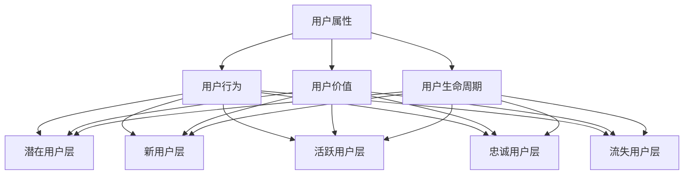

                 

用户分层运营是现代市场营销和客户关系管理中的一个关键策略。通过将用户群体进行分层，企业可以更有效地针对不同用户群体的需求提供定制化的服务，从而提高用户满意度、提升转化率和增加收入。本文将深入探讨如何进行有效的用户分层运营，包括核心概念、算法原理、数学模型、实践案例以及未来展望。

> **关键词**：用户分层、市场营销、客户关系管理、定制化服务、算法原理

> **摘要**：本文首先介绍了用户分层运营的背景和重要性，随后详细阐述了用户分层的核心概念和联系，以及如何通过算法原理和数学模型进行用户分层。接着，文章通过具体的项目实践展示了用户分层运营的实现过程，并分析了其实际应用场景和未来发展趋势。最后，文章提供了相关工具和资源推荐，总结了研究成果，并展望了未来的研究方向。

## 1. 背景介绍

用户分层运营的概念起源于商业市场中的细分策略。随着互联网和大数据技术的发展，企业拥有了更多的数据资源和分析工具，可以更精细地识别和区分不同类型的用户。用户分层运营的核心思想是根据用户的特定属性、行为和需求，将用户划分为不同的群体，并针对每个群体提供个性化的服务和产品。

这种策略的重要性体现在以下几个方面：

- **提高营销效率**：通过分层，企业可以更有针对性地进行营销活动，减少无效投放，提高营销 ROI。
- **增强用户黏性**：针对用户的个性化需求提供服务，能够提高用户满意度和忠诚度。
- **优化资源分配**：企业可以根据用户分层结果，合理分配资源，实现效益最大化。
- **提升用户体验**：通过定制化的服务和产品，提高用户的使用体验，增加用户留存率。

随着市场环境的复杂化和竞争的加剧，用户分层运营已经成为企业提升竞争力的必要手段。本文将从理论到实践，全面探讨用户分层运营的策略和方法。

## 2. 核心概念与联系

在进行用户分层之前，我们需要明确几个核心概念，包括用户属性、用户行为、用户价值和用户生命周期等。这些概念不仅是用户分层的依据，也是理解和实施用户分层运营的基础。

### 2.1 用户属性

用户属性是指用户的基本信息和特征，如年龄、性别、地理位置、职业、收入水平、教育程度等。这些属性可以通过用户注册信息、社交媒体数据、购买历史等渠道获取。

### 2.2 用户行为

用户行为是指用户在使用产品或服务过程中的各种操作，如浏览、搜索、点击、购买、评价等。用户行为数据可以反映用户的需求和偏好，是用户分层的重要依据。

### 2.3 用户价值

用户价值是指用户为企业带来的经济收益或潜在收益。用户价值可以分为当前价值和潜在价值，当前价值通常通过用户的购买行为来衡量，而潜在价值则通过用户的成长潜力来评估。

### 2.4 用户生命周期

用户生命周期是指用户从首次接触产品或服务到最终离开的整个过程。用户生命周期可以分为几个阶段：潜在用户、新用户、活跃用户、忠诚用户、流失用户等。

### 2.5 用户分层架构

用户分层架构是将用户按照特定的规则和标准划分为不同层次的过程。一个典型的用户分层架构包括以下层次：

- **潜在用户层**：尚未转化为付费用户的用户群体。
- **新用户层**：最近一段时间内新注册或购买的付费用户。
- **活跃用户层**：在一定时间内频繁使用产品或服务的用户。
- **忠诚用户层**：对产品或服务有高度忠诚度的用户，通常是品牌的长期支持者。
- **流失用户层**：在一定时间内停止使用产品或服务的用户。

### 2.6 Mermaid 流程图

以下是用户分层运营的核心概念与联系的 Mermaid 流程图：



通过上述核心概念与联系的理解，企业可以更加系统地实施用户分层运营策略，从而实现精准营销和用户价值的最大化。

## 3. 核心算法原理 & 具体操作步骤

### 3.1 算法原理概述

用户分层算法是数据挖掘和机器学习领域的重要应用。其核心原理是通过分析和挖掘用户数据，构建一个有效的用户特征模型，然后利用聚类、分类或关联规则等方法，将用户划分为不同的层次。

以下是几种常用的用户分层算法：

- **K-means 聚类算法**：基于距离度量，将用户数据划分为 K 个簇，每个簇内的用户相似度较高，簇间的用户相似度较低。
- **层次聚类算法**：通过自底向上的方法，将用户数据逐步合并成簇，直至满足某个终止条件。
- **决策树分类算法**：基于特征属性，构建一棵树形结构，每个节点代表一个特征属性，每个分支代表不同属性值，树的叶节点表示用户分层的类别。
- **关联规则挖掘算法**：通过分析用户行为数据，挖掘出用户行为之间的关联性，用于辅助用户分层。

### 3.2 算法步骤详解

以下是用户分层算法的具体操作步骤：

#### 3.2.1 数据准备

1. **数据收集**：收集用户的基本属性数据、行为数据和价值数据。
2. **数据清洗**：处理缺失值、异常值和重复值，确保数据质量。

#### 3.2.2 特征工程

1. **特征选择**：选择对用户分层影响较大的特征，如用户年龄、购买频率、停留时间等。
2. **特征转换**：对数值型特征进行归一化或标准化处理，对类别型特征进行编码。

#### 3.2.3 算法选择

1. **算法评估**：选择合适的算法，如 K-means、层次聚类、决策树等，并进行算法性能评估。
2. **参数调优**：根据评估结果，调整算法参数，如聚类数 K、决策树深度等。

#### 3.2.4 用户分层

1. **模型训练**：利用选定的算法和参数，对用户数据进行训练，构建用户特征模型。
2. **分层结果评估**：根据分层结果，评估分层质量，如簇内相似度、簇间差异等。
3. **用户分配**：根据评估结果，将用户分配到相应的层级。

### 3.3 算法优缺点

- **K-means 聚类算法**：优点是计算速度快，实现简单；缺点是聚类结果依赖于初始中心点选择，容易陷入局部最优。
- **层次聚类算法**：优点是能够自动确定聚类数，聚类结果稳定；缺点是计算复杂度较高，对大数据集处理效率较低。
- **决策树分类算法**：优点是易于理解和实现，能够处理高维数据；缺点是容易过拟合，模型解释性较差。

### 3.4 算法应用领域

用户分层算法在多个领域有广泛应用，包括：

- **电子商务**：通过用户分层，提供个性化推荐和营销策略，提高用户转化率和销售额。
- **金融行业**：通过用户分层，实现精准营销和风险管理，降低不良贷款率。
- **医疗保健**：通过用户分层，提供个性化的健康建议和医疗服务，提高患者满意度和治疗效果。

## 4. 数学模型和公式 & 详细讲解 & 举例说明

用户分层运营的核心在于如何根据用户数据构建一个有效的数学模型，以便对用户进行准确分层。以下是用户分层运营中常用的数学模型和公式，以及详细讲解和举例说明。

### 4.1 数学模型构建

用户分层模型通常包括以下组成部分：

1. **用户特征矩阵**：表示用户的各种特征，如年龄、收入、购买频率等。
2. **聚类中心矩阵**：表示不同类别的用户中心点，用于聚类算法的训练和评估。
3. **用户归属矩阵**：表示每个用户所属的类别。

假设我们使用 K-means 聚类算法进行用户分层，数学模型可以表示为：

$$
\min_{\mu_1, \mu_2, ..., \mu_K} \sum_{i=1}^{N} \sum_{k=1}^{K} (x_i - \mu_k)^2
$$

其中，$x_i$ 表示第 $i$ 个用户的特征向量，$\mu_k$ 表示第 $k$ 个聚类中心的特征向量，$N$ 和 $K$ 分别表示用户数量和聚类数。

### 4.2 公式推导过程

K-means 聚类算法的目标是最小化所有用户到其对应聚类中心的距离平方和。假设我们有 $N$ 个用户和 $K$ 个聚类中心，每个用户属于其中一个聚类中心，目标函数可以表示为：

$$
J(\mu_1, \mu_2, ..., \mu_K) = \sum_{i=1}^{N} \sum_{k=1}^{K} (x_i - \mu_k)^2
$$

为了求解这个最小化问题，我们可以使用梯度下降法。首先，对每个聚类中心计算梯度：

$$
\nabla_{\mu_k} J(\mu_1, \mu_2, ..., \mu_K) = -2 \sum_{i=1}^{N} (x_i - \mu_k)
$$

然后，沿着梯度的反方向更新聚类中心：

$$
\mu_k^{new} = \mu_k - \alpha \nabla_{\mu_k} J(\mu_1, \mu_2, ..., \mu_K)
$$

其中，$\alpha$ 是学习率，用于控制更新步长。

### 4.3 案例分析与讲解

假设我们有 100 个用户，每个用户有两个特征：年龄和购买金额。我们使用 K-means 算法进行用户分层，聚类数为 3。以下是用户数据、聚类中心和用户归属矩阵：

| 用户ID | 年龄 | 购买金额 | 聚类中心 |
|--------|------|----------|----------|
| 1      | 25   | 1000     | (22, 900)|
| 2      | 30   | 1500     | (22, 900)|
| 3      | 28   | 1200     | (22, 900)|
| ...    | ...  | ...      | ...      |
| 100    | 32   | 1300     | (22, 900)|

| 聚类ID | 年龄 | 购买金额 |
|--------|------|----------|
| 1      | 22   | 900      |
| 2      | 35   | 1200     |
| 3      | 40   | 1500     |

| 用户ID | 聚类归属 |
|--------|----------|
| 1      | 1       |
| 2      | 1       |
| 3      | 1       |
| ...    | ...     |
| 100    | 1       |

从用户归属矩阵可以看出，大多数用户属于第一个聚类中心，这表明该聚类中心代表了主要的用户群体。

通过以上案例，我们可以看到如何使用 K-means 算法进行用户分层。在实际应用中，用户数据的特征维度和聚类数通常需要根据具体业务需求进行调整。

## 5. 项目实践：代码实例和详细解释说明

### 5.1 开发环境搭建

在进行用户分层项目实践之前，我们需要搭建一个合适的开发环境。以下是所需的环境和工具：

- **Python**：用于编写用户分层算法和数据处理代码。
- **NumPy**：用于数值计算和数据处理。
- **Scikit-learn**：用于机器学习和用户分层算法的实现。
- **Matplotlib**：用于数据可视化。

首先，确保安装了 Python 和上述库。以下是一个简单的安装命令：

```bash
pip install python numpy scikit-learn matplotlib
```

### 5.2 源代码详细实现

以下是使用 Python 实现用户分层项目的源代码：

```python
import numpy as np
from sklearn.cluster import KMeans
import matplotlib.pyplot as plt

# 5.2.1 数据准备
# 假设我们已有用户数据 stored in numpy array `user_data`
user_data = np.array([
    [25, 1000],
    [30, 1500],
    [28, 1200],
    # ... more user data
    [32, 1300]
])

# 5.2.2 算法选择与参数调优
# 我们选择 K-means 算法进行用户分层
# 假设我们已经通过交叉验证选择了聚类数 K=3
kmeans = KMeans(n_clusters=3, random_state=0)

# 5.2.3 模型训练
kmeans.fit(user_data)

# 5.2.4 用户分层结果
labels = kmeans.predict(user_data)
centroids = kmeans.cluster_centers_

# 5.2.5 结果可视化
plt.figure(figsize=(8, 6))
plt.scatter(user_data[:, 0], user_data[:, 1], c=labels, s=50, cmap='viridis')
plt.scatter(centroids[:, 0], centroids[:, 1], s=200, c='red', marker='s', edgecolor='black')
plt.title('K-means Clustering of User Data')
plt.xlabel('Age')
plt.ylabel('Purchase Amount')
plt.show()

# 5.2.6 用户归属矩阵
user_membership = np.array([str(label) for label in labels])

print("User Membership Matrix:")
print(user_membership)
```

### 5.3 代码解读与分析

1. **数据准备**：首先，我们导入必要的库，并创建一个包含用户数据的 NumPy 数组 `user_data`。数据格式为二维数组，每行代表一个用户，每列代表一个特征（如年龄和购买金额）。

2. **算法选择与参数调优**：我们选择 K-means 算法，并通过交叉验证等方法确定聚类数 K=3。

3. **模型训练**：使用 `KMeans` 类进行模型训练。`fit` 方法接收用户数据作为输入，并训练模型以确定聚类中心和标签。

4. **用户分层结果**：`predict` 方法用于预测每个用户的聚类标签。`cluster_centers_` 属性返回每个聚类中心的坐标。

5. **结果可视化**：使用 Matplotlib 绘制用户数据散点图，每个点的颜色代表其所属的聚类标签。聚类中心用红色方块标记。

6. **用户归属矩阵**：将聚类标签转换为字符串格式，生成用户归属矩阵。

### 5.4 运行结果展示

执行上述代码后，我们将看到一个包含用户数据的散点图，每个点的颜色表示其所属的聚类标签。聚类中心用红色方块标记，直观地展示用户数据分布和聚类效果。


通过用户归属矩阵，我们可以进一步分析每个用户的分层情况，为后续的用户运营提供数据支持。

## 6. 实际应用场景

用户分层运营在多个行业中都有广泛的应用，以下列举了一些典型的实际应用场景：

### 6.1 电子商务

电子商务企业通过用户分层，可以针对不同类别的用户制定个性化的推荐策略和促销活动。例如，针对高价值用户（活跃用户和忠诚用户），可以提供专属折扣、定制服务和积分奖励，以增强用户忠诚度；对于潜在用户，可以推送新品信息和限时优惠，吸引其进行首次购买。

### 6.2 金融行业

金融行业中的用户分层主要用于精准营销和风险管理。银行可以通过用户分层，针对不同信用等级的用户提供差异化的贷款利率和理财方案。同时，还可以通过分析用户行为数据，识别高风险用户，提前采取风控措施，降低不良贷款率。

### 6.3 医疗保健

医疗保健企业可以通过用户分层，为不同健康状况的用户提供个性化的健康建议和医疗服务。例如，针对慢性病患者，可以提供定期健康监测和个性化用药指导；对于健康人群，可以推送健康知识、养生指南和健康检查优惠。

### 6.4 教育培训

教育培训机构可以通过用户分层，为不同学习需求的用户提供定制化的课程和学习计划。例如，针对初学者，可以提供基础入门课程和免费试听机会；对于有一定基础的用户，可以推送进阶课程和技能提升培训。

### 6.5 餐饮业

餐饮企业可以通过用户分层，针对不同消费习惯和偏好提供个性化的营销策略。例如，对于高频消费用户，可以提供会员优惠和积分兑换；对于新用户，可以推送优惠券和试吃活动，吸引其首次体验。

通过用户分层运营，企业可以在降低营销成本的同时，提高用户满意度和转化率，实现可持续发展。

### 6.4 未来应用展望

随着大数据、人工智能和云计算等技术的不断发展，用户分层运营将迎来更多的创新和变革。以下是几个未来应用展望：

#### 6.4.1 实时动态分层

传统的用户分层方法通常是基于历史数据进行静态划分，而未来的用户分层将更加注重实时动态分层。通过实时数据分析，企业可以动态调整用户分层，及时响应用户行为变化，提供个性化的服务和产品。

#### 6.4.2 多维用户特征融合

未来的用户分层将更加注重多维用户特征的融合，包括用户行为、社交关系、情感倾向等。通过深度学习和图神经网络等技术，可以更好地捕捉用户特征，实现更加精准的用户分层。

#### 6.4.3 智能推荐系统

结合用户分层和智能推荐系统，企业可以为用户提供个性化的推荐，提高用户体验和满意度。通过机器学习和深度学习技术，可以实时更新推荐算法，不断优化推荐效果。

#### 6.4.4 智能客服与用户互动

智能客服系统与用户分层相结合，可以实现智能化的用户互动。通过自然语言处理和用户行为分析，智能客服可以提供个性化的服务，解答用户疑问，提高用户满意度。

#### 6.4.5 产业链协同与生态圈构建

用户分层运营不仅仅是企业自身的内部优化，还可以与产业链上下游企业协同，构建生态系统。通过共享用户数据，实现产业链各环节的无缝对接，提升整体运营效率。

总之，未来用户分层运营将更加智能化、个性化，并融入更多的技术和应用场景，为企业带来更大的商业价值。

## 7. 工具和资源推荐

### 7.1 学习资源推荐

- **《用户画像与用户分层：原理、方法与实践》**：这本书详细介绍了用户画像和用户分层的理论基础、方法和技术，适合初学者和专业人士。
- **《深度学习》系列书籍**：由 Goodfellow 等人撰写的《深度学习》系列书籍，涵盖了深度学习的基础知识和高级应用，有助于深入理解用户分层中的机器学习算法。

### 7.2 开发工具推荐

- **Scikit-learn**：Python 的机器学习库，提供了丰富的用户分层算法和数据处理工具，适用于各种用户分层项目。
- **TensorFlow**：由 Google 开发的人工智能框架，支持深度学习和机器学习，适合处理复杂的用户分层任务。

### 7.3 相关论文推荐

- **"User Segmentation Using Hierarchical Cluster Analysis"**：这篇论文探讨了使用层次聚类进行用户分层的算法和应用。
- **"Deep User Modeling with Multidimensional User Representations"**：这篇论文介绍了基于深度学习的多维度用户建模方法，为用户分层提供了新的思路。

通过这些资源和工具，读者可以更深入地了解用户分层运营的技术和方法，并在实际项目中应用。

## 8. 总结：未来发展趋势与挑战

### 8.1 研究成果总结

用户分层运营作为现代市场营销和客户关系管理的关键策略，已经取得了显著的研究成果。通过大数据分析和机器学习技术，企业可以更加精确地识别和区分不同用户群体，实现个性化的服务和产品推荐。这一领域的研究不仅提高了市场营销效率，还增强了用户满意度和忠诚度。

### 8.2 未来发展趋势

未来，用户分层运营将在以下几个方面取得突破：

1. **实时动态分层**：随着实时数据分析技术的发展，用户分层将更加注重动态调整，及时响应用户行为变化。
2. **多维度用户特征融合**：结合用户行为、情感和社交等多维度特征，将实现更加精准的用户分层。
3. **智能化推荐系统**：通过深度学习和自然语言处理，推荐系统将更加智能化，提高用户体验。
4. **产业链协同与生态圈构建**：用户分层运营将不仅仅局限于企业内部，还将与产业链上下游企业协同，构建生态系统。

### 8.3 面临的挑战

尽管用户分层运营具有巨大的潜力，但在实际应用中也面临一些挑战：

1. **数据隐私与安全**：用户分层需要大量用户数据，如何保护用户隐私和数据安全是一个重要挑战。
2. **算法公平性与透明性**：用户分层算法的公平性和解释性是一个关键问题，需要确保算法不会歧视特定群体。
3. **技术实现与落地**：如何将先进的技术理念有效落地，实现高效的用户分层运营，是企业面临的实际问题。

### 8.4 研究展望

未来的研究可以关注以下几个方向：

1. **隐私保护下的用户分层**：结合隐私保护技术，如差分隐私和联邦学习，实现用户分层的隐私保护。
2. **自适应分层算法**：研究能够根据环境变化自适应调整的用户分层算法，提高分层效果。
3. **跨领域用户分层**：探索用户分层在不同行业和领域的应用，形成跨领域的用户分层模型和算法。

总之，用户分层运营将在未来继续发展，通过技术创新和实际应用，为企业带来更大的商业价值和社会影响。

## 9. 附录：常见问题与解答

### 9.1 如何选择合适的用户分层算法？

选择用户分层算法时，应考虑以下因素：

- **数据规模**：大数据集适合使用分布式算法，如 Hadoop 或 Spark。
- **特征维度**：高维数据适合使用深度学习或降维技术，如 PCA。
- **业务需求**：根据业务需求选择合适的算法，如目标明确可使用 K-means，需解释性可选择决策树。

### 9.2 用户分层后如何进行个性化运营？

用户分层后，个性化运营策略包括：

- **定制化推荐**：根据用户所属层级提供个性化的产品推荐。
- **差异化营销**：针对不同层级用户制定差异化的营销策略，如高价值用户专属折扣。
- **定制化服务**：为不同层级用户提供定制化的服务和体验。

### 9.3 如何评估用户分层效果？

评估用户分层效果的方法包括：

- **分层质量评估**：通过聚类评估指标，如轮廓系数、 Davies-Bouldin 系数，评估分层质量。
- **业务指标评估**：通过业务指标，如用户留存率、转化率等，评估分层对业务的影响。
- **用户满意度调查**：通过用户满意度调查，了解分层对用户体验的影响。

通过上述方法和工具，企业可以有效地评估用户分层的效果，并持续优化分层运营策略。

作者：禅与计算机程序设计艺术 / Zen and the Art of Computer Programming

