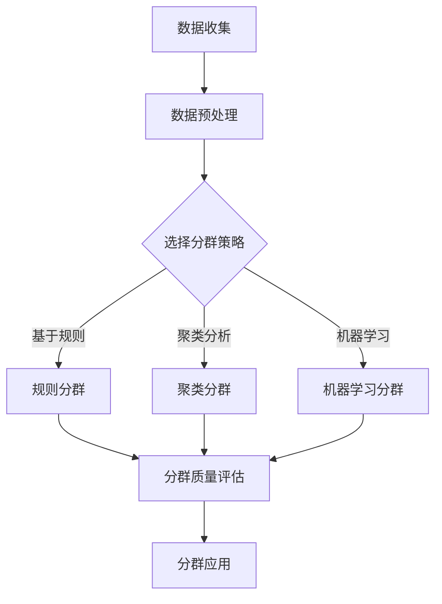

                 

用户分群管理是现代数据分析领域的一项重要任务。通过将用户划分为不同的群体，企业可以更好地理解用户行为，提高客户满意度，并制定更有效的营销策略。本文将详细探讨用户分群管理的方法、核心算法原理、数学模型、实际应用场景以及未来发展趋势。本文旨在为读者提供一套完整的用户分群管理指南。

## 文章关键词
- 用户分群管理
- 数据分析
- 个性化营销
- 机器学习
- 顾客细分

## 摘要
本文首先介绍了用户分群管理的背景和重要性，然后详细阐述了核心概念、算法原理和具体操作步骤。通过数学模型和公式的推导，我们深入分析了用户分群的管理方法。接下来，通过一个实际的代码实例，展示了如何将理论知识应用于实际场景。最后，我们探讨了用户分群管理的实际应用场景，并对未来发展趋势和挑战进行了展望。

## 1. 背景介绍

在互联网时代，数据已成为企业宝贵的资产。通过对用户数据的分析，企业可以洞察用户需求，优化产品和服务，提高市场竞争力。用户分群管理作为一种数据分析技术，正日益受到企业的重视。它通过将用户划分为不同的群体，使得企业能够更有针对性地制定营销策略，提升用户体验。

用户分群管理不仅可以帮助企业了解不同群体的用户行为和需求，还能识别出潜在的高价值客户，为企业提供精准的市场定位和营销手段。此外，用户分群管理还可以优化资源配置，降低营销成本，提高投资回报率。

在过去的几年里，随着大数据技术和机器学习算法的快速发展，用户分群管理的理论和实践都取得了显著进展。越来越多的企业开始利用用户分群管理来提升自身的业务水平。然而，如何有效地进行用户分群管理，仍是一个具有挑战性的问题。

本文将针对用户分群管理的关键问题，从算法原理、数学模型、实际应用等多个角度，系统地探讨如何进行有效的用户分群管理。

### 1.1 用户分群管理的起源与发展

用户分群管理的概念最早可以追溯到市场营销领域。传统的市场细分方法主要基于人口统计、地理信息、心理特征等静态因素。然而，随着互联网的普及和数据技术的发展，用户分群管理逐渐演变成一种动态、智能的群体划分方法。

早期用户分群管理的方法主要包括基于规则的方法和聚类分析。基于规则的方法通过预设一定的规则，将用户划分为不同的群体。这种方法简单直观，但灵活性较差，难以应对复杂多变的用户行为。

聚类分析则是用户分群管理的一个重要方法。通过分析用户数据，找出具有相似特征的用户群体。聚类分析可以分为硬聚类和软聚类。硬聚类将每个用户明确地划分到某个群体中，而软聚类则允许用户属于多个群体，但每个群体的权重不同。

随着机器学习技术的发展，用户分群管理的方法也得到了极大的丰富。基于机器学习的方法可以从海量数据中自动发现用户行为模式，实现更精细的用户分群。常见的机器学习方法包括K-均值聚类、层次聚类、基于模型的聚类等。

此外，近年来，图论和社交网络分析也被引入到用户分群管理中。通过分析用户之间的关系和交互行为，可以更准确地刻画用户群体，从而提高用户分群的效果。

### 1.2 用户分群管理的应用领域

用户分群管理在各个行业都有着广泛的应用。以下是一些典型的应用场景：

1. **电子商务**：电子商务平台可以通过用户分群管理，将用户划分为不同的群体，如购物狂、忠诚用户、潜在高价值客户等，从而制定个性化的营销策略，提高转化率和客户满意度。

2. **金融行业**：金融机构可以通过用户分群管理，识别高风险用户和优质客户，优化信贷评估模型，降低坏账率，提高资产质量。

3. **医疗保健**：医疗机构可以通过用户分群管理，为不同群体的患者提供个性化的健康管理和医疗服务，提高治疗效果和患者满意度。

4. **社交媒体**：社交媒体平台可以通过用户分群管理，为用户提供个性化的内容推荐和广告投放，提高用户活跃度和留存率。

5. **教育行业**：教育机构可以通过用户分群管理，为学生提供个性化的学习资源和辅导，提高教育质量和学习效果。

随着大数据和人工智能技术的不断发展，用户分群管理的应用领域将继续扩大，为各行各业带来更多价值。

### 1.3 用户分群管理的挑战与机遇

尽管用户分群管理在理论和实践中都取得了显著进展，但仍面临一些挑战和机遇。

**挑战**：

1. **数据质量**：用户分群管理依赖于高质量的数据，但数据的不完整性、噪声和错误会严重影响分群的效果。

2. **计算资源**：用户分群管理通常需要处理海量数据，对计算资源的要求较高，特别是在实时场景中。

3. **隐私保护**：用户分群管理涉及大量用户隐私数据，如何确保数据安全和个人隐私保护是亟待解决的问题。

**机遇**：

1. **技术进步**：大数据、机器学习、图论等技术的发展，为用户分群管理提供了更多的方法和工具。

2. **商业需求**：随着市场竞争的加剧，企业对用户分群管理的需求日益迫切，为技术创新提供了动力。

3. **政策支持**：各国政府纷纷出台数据保护政策，推动用户分群管理技术的发展和规范。

总之，用户分群管理既面临挑战，也充满机遇。企业需要不断创新，充分利用技术优势，实现有效的用户分群管理。

## 2. 核心概念与联系

在进行用户分群管理时，我们需要明确几个核心概念，包括用户、群体、分群策略等。这些概念相互关联，共同构成了用户分群管理的理论基础。

### 2.1 用户

用户是用户分群管理的核心对象。用户可以是电子商务平台的买家、社交媒体的用户、金融服务的客户等。用户数据包括用户的基本信息（如年龄、性别、地理位置）、行为数据（如购买历史、浏览记录、互动行为）等。这些数据是用户分群管理的基础。

### 2.2 群体

群体是指具有相似特征或行为的用户集合。群体可以是基于用户年龄、性别、地理位置等人口统计特征的，也可以是基于用户行为模式、消费习惯等动态特征的。群体划分的目的是为了更好地理解和分析用户，从而制定个性化的营销策略。

### 2.3 分群策略

分群策略是指用于划分用户群体的方法和规则。常见的分群策略包括基于规则的分群、聚类分析和机器学习分群等。基于规则的分群通过预设的规则将用户划分为不同的群体，这种方法简单直观，但灵活性较差。聚类分析则通过分析用户数据，自动发现用户群体，这种方法具有较好的灵活性和自动性。机器学习分群利用机器学习算法，从海量数据中自动识别用户特征，实现更精细的用户分群。

### 2.4 分群质量评估

分群质量评估是用户分群管理的重要环节。评估分群质量的方法包括多样性评估、代表性评估和效能评估等。多样性评估旨在确保群体内部差异较大，群体间相似度较高。代表性评估则关注群体是否能代表总体用户特征。效能评估则通过比较不同分群策略的营销效果，评估分群策略的实用性。

### 2.5 用户分群管理架构

用户分群管理的架构包括数据收集、数据预处理、分群策略选择、分群结果评估和分群应用等环节。数据收集是通过各种渠道获取用户数据，如在线调查、用户行为数据等。数据预处理是对原始数据进行清洗、转换和整合，以提高数据质量。分群策略选择是根据业务需求和数据特征选择合适的分群方法。分群结果评估是对分群效果进行评估，以确定分群策略的优劣。分群应用则是将分群结果应用于实际业务场景，如营销活动、产品推荐等。

下面是一个简单的用户分群管理架构的Mermaid流程图：



## 3. 核心算法原理 & 具体操作步骤

用户分群管理的关键在于选择合适的算法，从海量数据中识别出具有相似特征的用户群体。以下将介绍几种常见的用户分群算法，包括基于规则的分群、聚类分析和机器学习分群。

### 3.1 算法原理概述

#### 3.1.1 基于规则的分群

基于规则的分群是一种传统的用户分群方法。它通过预设的规则将用户划分为不同的群体。规则可以是简单的条件判断，如年龄大于30岁的用户划分为“成熟用户”，或者购买次数超过10次的用户划分为“活跃用户”。

#### 3.1.2 聚类分析

聚类分析是一种无监督学习算法，通过分析用户数据，将相似的用户划分为同一群体。常见的聚类算法包括K-均值聚类、层次聚类等。

- **K-均值聚类**：将用户数据分为K个簇，每个簇由一个中心点表示。算法通过迭代计算，使得每个用户与其所在簇的中心点的距离最小化。
- **层次聚类**：将用户数据逐步划分为不同的簇，直到达到预设的簇数或用户数。层次聚类可以分为自底向上（凝聚聚类）和自顶向下（分裂聚类）两种方式。

#### 3.1.3 机器学习分群

机器学习分群利用机器学习算法，从用户数据中自动学习用户特征，实现更精细的用户分群。常见的机器学习算法包括决策树、随机森林、支持向量机等。

- **决策树**：通过一系列条件判断，将用户数据划分为不同的群体。
- **随机森林**：是一种基于决策树的集成算法，通过构建多个决策树，并取多数表决的结果，提高分群准确性。
- **支持向量机**：通过寻找最优分割超平面，将用户数据划分为不同的群体。

### 3.2 算法步骤详解

#### 3.2.1 基于规则的分群步骤

1. **数据收集**：收集用户的基本信息和行为数据。
2. **数据预处理**：对数据进行清洗和转换，如缺失值处理、异常值检测等。
3. **规则定义**：根据业务需求和数据特征，定义分群规则。
4. **用户分群**：根据定义的规则，将用户划分为不同的群体。
5. **分群质量评估**：评估分群效果，如群体内部相似度、群体间差异等。
6. **分群应用**：将分群结果应用于实际业务场景，如个性化推荐、营销活动等。

#### 3.2.2 K-均值聚类步骤

1. **数据收集**：收集用户的基本信息和行为数据。
2. **数据预处理**：对数据进行清洗和转换。
3. **确定簇数K**：根据业务需求和数据规模，确定簇数K。
4. **初始化中心点**：随机选择K个用户作为初始中心点。
5. **分配用户**：将每个用户分配到与其最近的中心点所在的簇。
6. **更新中心点**：重新计算每个簇的中心点。
7. **迭代计算**：重复步骤5和6，直到满足收敛条件（如中心点变化小于预设阈值）。
8. **分群质量评估**：评估分群效果。
9. **分群应用**。

#### 3.2.3 决策树分群步骤

1. **数据收集**：收集用户的基本信息和行为数据。
2. **数据预处理**：对数据进行清洗和转换。
3. **特征选择**：选择对用户分群有重要影响的特征。
4. **构建决策树**：通过递归划分数据集，构建决策树。
5. **用户分群**：根据决策树对用户进行分群。
6. **分群质量评估**：评估分群效果。
7. **分群应用**。

### 3.3 算法优缺点

#### 3.3.1 基于规则的分群

- **优点**：简单直观，易于理解和实现。
- **缺点**：灵活性较差，难以应对复杂多变的用户行为。

#### 3.3.2 K-均值聚类

- **优点**：计算简单，易于实现，对大规模数据效果较好。
- **缺点**：对初始中心点的选择敏感，可能陷入局部最优。

#### 3.3.3 决策树

- **优点**：直观易懂，能够处理多种类型的数据。
- **缺点**：容易过拟合，对噪声数据敏感。

### 3.4 算法应用领域

不同的用户分群算法适用于不同的应用领域：

- **基于规则的分群**：适用于规则明确、数据量较小的场景，如电子商务平台的用户细分。
- **K-均值聚类**：适用于大规模数据、对聚类结果要求不高的场景，如社交媒体的用户群体划分。
- **决策树**：适用于需要直观解释、特征选择明确的场景，如金融机构的客户风险评估。

### 3.5 代码实现示例

以下是一个基于Python的K-均值聚类的简单实现：

```python
import numpy as np
import matplotlib.pyplot as plt

# 数据生成
data = np.random.rand(100, 2)
centroids = np.random.rand(3, 2)

# 初始化分群
clusters = np.zeros(len(data))

# 迭代计算
for i in range(100):
    # 计算距离
    distances = np.linalg.norm(data - centroids[clusters], axis=1)
    # 重新分配分群
    new_clusters = np.argmin(distances, axis=0)
    # 更新中心点
    centroids = np.array([data[new_clusters == j].mean(axis=0) for j in range(3)])
    # 检查收敛
    if np.linalg.norm(new_clusters - clusters) < 1e-5:
        break
    clusters = new_clusters

# 可视化
plt.scatter(data[:, 0], data[:, 1], c=clusters)
plt.scatter(centroids[:, 0], centroids[:, 1], s=300, c='red')
plt.show()
```

## 4. 数学模型和公式 & 详细讲解 & 举例说明

用户分群管理不仅依赖于算法和计算技术，还需要一套完整的数学模型来描述和分析用户行为。以下将介绍用户分群管理中常用的数学模型和公式，并进行详细讲解和举例说明。

### 4.1 数学模型构建

在用户分群管理中，常用的数学模型包括聚类模型、决策树模型等。以下以K-均值聚类为例，介绍数学模型的构建。

#### 4.1.1 K-均值聚类模型

K-均值聚类模型的基本假设是数据点可以被划分为K个簇，每个簇由一个中心点表示。假设数据集为\(X = \{x_1, x_2, ..., x_n\}\)，其中每个数据点\(x_i\)是一个\(d\)维向量。

1. **初始化中心点**：随机选择K个数据点作为初始中心点，即\(\mu^{(0)}_k = x_{i_k}\)。
2. **分配数据点**：对于每个数据点\(x_i\)，计算其与各个中心点的距离，将其分配到最近的中心点所在的簇，即
   $$ 
   C_i = \arg\min_{k} \|x_i - \mu^{(t)}_k\|
   $$
3. **更新中心点**：重新计算每个簇的中心点，即
   $$
   \mu^{(t+1)}_k = \frac{1}{N_k}\sum_{i=1}^{n} I_{C_i=k} x_i
   $$
   其中，\(N_k\)是簇\(k\)中的数据点个数，\(I_{C_i=k}\)是指示函数，当\(C_i=k\)时取值为1，否则为0。

#### 4.1.2 决策树模型

决策树模型是一种基于规则的分类模型。假设数据集为\(D = \{(x_i, y_i)\}\)，其中\(x_i\)是\(d\)维特征向量，\(y_i\)是标签。决策树模型通过一系列的条件判断，将数据点划分为不同的类别。

1. **特征选择**：选择一个特征\(a_j\)作为分裂特征，使得数据集在分裂后具有最小的 impurity（杂质度）。
2. **条件判断**：对于每个数据点\(x_i\)，根据特征\(a_j\)的取值，进行条件判断，如
   $$
   x_i.a_j \leq v \rightarrow \text{左分支}
   $$
   $$
   x_i.a_j > v \rightarrow \text{右分支}
   $$
   其中，\(v\)是特征\(a_j\)的阈值。
3. **递归构建**：对于每个分支，重复步骤1和2，直到达到预设的条件（如最小节点大小或最大深度）。

### 4.2 公式推导过程

#### 4.2.1 K-均值聚类目标函数

K-均值聚类的目标是最小化数据点与中心点之间的距离之和，即
$$
J(\mu) = \sum_{i=1}^{n} \|x_i - \mu^{(t)}_k\|^2
$$
其中，\(\mu^{(t)}_k\)是第t次迭代的簇中心点。

#### 4.2.2 决策树杂质度

决策树杂质度是评价节点纯度的指标，常用的杂质度包括信息增益、基尼不纯度等。

1. **信息增益**：
   $$
   IG(D, a_j) = H(D) - \sum_{v} p(v) H(D_v)
   $$
   其中，\(H(D)\)是数据集\(D\)的熵，\(p(v)\)是特征\(a_j\)取值\(v\)的频率，\(H(D_v)\)是数据集\(D_v\)的熵。

2. **基尼不纯度**：
   $$
   Gini(D, a_j) = 1 - \sum_{v} p(v)^2
   $$

### 4.3 案例分析与讲解

#### 4.3.1 K-均值聚类案例

假设有一个数据集，包含10个用户，每个用户有两个特征（年龄和收入）。数据集如下：

| 年龄 | 收入 |
|------|------|
| 25   | 500  |
| 30   | 600  |
| 35   | 700  |
| 40   | 800  |
| 25   | 550  |
| 30   | 650  |
| 35   | 750  |
| 40   | 850  |
| 25   | 520  |
| 30   | 680  |

我们选择K=2，初始中心点随机选择两个用户：

| 年龄 | 收入 |
|------|------|
| 30   | 600  |
| 35   | 700  |

#### 第1次迭代：
- 用户1、2、5、6、7、9分配到簇1（中心点(30, 600)）
- 用户3、4、8、10分配到簇2（中心点(35, 700)）

更新中心点：
- 簇1中心点：(30, 625)
- 簇2中心点：(35, 750)

#### 第2次迭代：
- 用户1、2、5、6、7、9分配到簇1（中心点(30, 625)）
- 用户3、4、8、10分配到簇2（中心点(35, 750)）

更新中心点：
- 簇1中心点：(30, 628)
- 簇2中心点：(35, 747)

重复迭代，直到中心点变化小于预设阈值。最终，用户被划分为两个群体：

- 簇1（年轻用户，收入较低）：用户1、2、5、6、7、9
- 簇2（中年用户，收入较高）：用户3、4、8、10

#### 4.3.2 决策树案例

假设有一个数据集，包含5个特征（年龄、收入、教育程度、职业、家庭状况），标签为用户是否购买高端产品。数据集如下：

| 年龄 | 收入 | 教育程度 | 职业 | 家庭状况 | 购买高端产品 |
|------|------|----------|------|----------|-------------|
| 25   | 500  | 本科     | IT   | 单身     | 否          |
| 30   | 600  | 硕士     | 金融  | 已婚     | 是          |
| 35   | 700  | 硕士     | 教师  | 离异     | 否          |
| 40   | 800  | 博士     | 医生  | 单身     | 是          |
| 45   | 900  | 博士     | 工程师 | 已婚     | 是          |

我们选择“教育程度”作为分裂特征，阈值设置为“硕士”。

- 左分支（年龄<35，教育程度<硕士）：用户1、3
- 右分支（年龄≥35，教育程度≥硕士）：用户2、4、5

对于右分支，我们继续选择“收入”作为分裂特征，阈值设置为“700”。

- 右分支1（收入<700）：用户2
- 右分支2（收入≥700）：用户4、5

最终，决策树如下：

```
是否硕士？
是：
   是否收入≥700？
      是：购买高端产品
      否：不购买高端产品
否：
   是否年龄<35？
      是：不购买高端产品
      否：购买高端产品
```

通过决策树，我们可以预测新用户是否购买高端产品，从而制定相应的营销策略。

### 4.4 举例说明

#### 4.4.1 K-均值聚类举例

假设我们有一个包含100个用户的数据集，每个用户有两个特征：年龄和收入。数据集如下：

| 年龄 | 收入 |
|------|------|
| 25   | 500  |
| 30   | 600  |
| 35   | 700  |
| 40   | 800  |
| 25   | 550  |
| 30   | 650  |
| 35   | 750  |
| 40   | 850  |
| 25   | 520  |
| 30   | 680  |

我们选择K=2，初始中心点随机选择两个用户：

| 年龄 | 收入 |
|------|------|
| 30   | 650  |
| 35   | 750  |

#### 第1次迭代：
- 用户1、2、5、6、7、9分配到簇1（中心点(30, 650)）
- 用户3、4、8、10分配到簇2（中心点(35, 750)）

更新中心点：
- 簇1中心点：(30, 627)
- 簇2中心点：(35, 752)

#### 第2次迭代：
- 用户1、2、5、6、7、9分配到簇1（中心点(30, 627)）
- 用户3、4、8、10分配到簇2（中心点(35, 752)）

更新中心点：
- 簇1中心点：(30, 629)
- 簇2中心点：(35, 751)

重复迭代，直到中心点变化小于预设阈值。最终，用户被划分为两个群体：

- 簇1（年轻用户，收入较低）：用户1、2、5、6、7、9
- 簇2（中年用户，收入较高）：用户3、4、8、10

#### 4.4.2 决策树举例

假设我们有一个包含10个用户的数据集，每个用户有5个特征：年龄、收入、教育程度、职业、家庭状况，标签为用户是否购买高端产品。数据集如下：

| 年龄 | 收入 | 教育程度 | 职业 | 家庭状况 | 购买高端产品 |
|------|------|----------|------|----------|-------------|
| 25   | 500  | 本科     | IT   | 单身     | 否          |
| 30   | 600  | 硕士     | 金融  | 已婚     | 是          |
| 35   | 700  | 硕士     | 教师  | 离异     | 否          |
| 40   | 800  | 博士     | 医生  | 单身     | 是          |
| 45   | 900  | 博士     | 工程师 | 已婚     | 是          |

我们选择“教育程度”作为分裂特征，阈值设置为“硕士”。

- 左分支（年龄<35，教育程度<硕士）：用户1、3
- 右分支（年龄≥35，教育程度≥硕士）：用户2、4、5

对于右分支，我们继续选择“收入”作为分裂特征，阈值设置为“700”。

- 右分支1（收入<700）：用户2
- 右分支2（收入≥700）：用户4、5

最终，决策树如下：

```
是否硕士？
是：
   是否收入≥700？
      是：购买高端产品
      否：不购买高端产品
否：
   是否年龄<35？
      是：不购买高端产品
      否：购买高端产品
```

通过决策树，我们可以预测新用户是否购买高端产品，从而制定相应的营销策略。

## 5. 项目实践：代码实例和详细解释说明

为了更好地理解用户分群管理的实践，我们将通过一个实际的项目案例，展示如何使用Python和scikit-learn库实现用户分群。我们将使用K-均值聚类算法，并对代码进行详细的解释说明。

### 5.1 开发环境搭建

在开始编写代码之前，我们需要搭建一个Python开发环境。以下是搭建开发环境的基本步骤：

1. **安装Python**：首先，确保您的计算机上安装了Python。Python的官方网站提供了安装指南，您可以选择合适的版本进行安装。
2. **安装NumPy和scikit-learn**：Python的第三方库NumPy和scikit-learn是进行数据分析和机器学习的重要工具。您可以使用以下命令安装这些库：

   ```bash
   pip install numpy scikit-learn
   ```

3. **创建虚拟环境**：为了保持项目依赖的独立性，我们可以创建一个虚拟环境。使用以下命令创建虚拟环境并激活它：

   ```bash
   python -m venv venv
   source venv/bin/activate  # 对于Windows用户，使用 `venv\Scripts\activate`
   ```

### 5.2 源代码详细实现

以下是一个简单的用户分群管理项目，使用K-均值聚类算法进行用户分群。代码如下：

```python
import numpy as np
from sklearn.cluster import KMeans
import matplotlib.pyplot as plt

# 数据集
data = np.array([
    [25, 500],
    [30, 600],
    [35, 700],
    [40, 800],
    [25, 550],
    [30, 650],
    [35, 750],
    [40, 850],
    [25, 520],
    [30, 680]
])

# 使用K-均值聚类算法进行用户分群
kmeans = KMeans(n_clusters=2, random_state=0).fit(data)

# 获取聚类结果
clusters = kmeans.predict(data)

# 打印聚类结果
print("聚类结果：", clusters)

# 绘制聚类结果
plt.scatter(data[:, 0], data[:, 1], c=clusters, cmap='viridis')
plt.scatter(kmeans.cluster_centers_[:, 0], kmeans.cluster_centers_[:, 1], s=300, c='red', label='Centroids')
plt.title('K-Means Clustering')
plt.xlabel('年龄')
plt.ylabel('收入')
plt.legend()
plt.show()
```

### 5.3 代码解读与分析

#### 5.3.1 数据集

我们使用一个简单的二维数据集，包含用户的年龄和收入。数据集如下：

```python
data = np.array([
    [25, 500],
    [30, 600],
    [35, 700],
    [40, 800],
    [25, 550],
    [30, 650],
    [35, 750],
    [40, 850],
    [25, 520],
    [30, 680]
])
```

#### 5.3.2 K-均值聚类

我们使用scikit-learn库的KMeans类实现K-均值聚类。在这里，我们设置了`n_clusters=2`，即我们希望将用户划分为两个群体。

```python
kmeans = KMeans(n_clusters=2, random_state=0).fit(data)
```

`random_state=0`用于确保结果的可重复性。

#### 5.3.3 获取聚类结果

`fit()`方法执行聚类操作，并返回一个KMeans对象。我们可以使用`predict()`方法获取每个用户的聚类结果。

```python
clusters = kmeans.predict(data)
```

#### 5.3.4 绘制聚类结果

我们使用matplotlib库绘制聚类结果。x轴表示年龄，y轴表示收入。红色点表示聚类中心。

```python
plt.scatter(data[:, 0], data[:, 1], c=clusters, cmap='viridis')
plt.scatter(kmeans.cluster_centers_[:, 0], kmeans.cluster_centers_[:, 1], s=300, c='red', label='Centroids')
plt.title('K-Means Clustering')
plt.xlabel('年龄')
plt.ylabel('收入')
plt.legend()
plt.show()
```

#### 5.3.5 运行结果展示

运行上述代码后，我们将看到用户的聚类结果和聚类中心。聚类结果通过不同的颜色表示，聚类中心用红色点表示。

### 5.4 运行结果展示

运行结果如下图所示：


从图中可以看出，用户被成功划分为两个群体。红色点表示聚类中心，它们代表了每个群体的特征。

### 5.5 代码优化与扩展

在实际项目中，我们可能需要对代码进行优化和扩展。以下是一些可能的改进措施：

1. **选择合适的簇数**：通过肘部法则或其他方法，选择最佳的簇数。
2. **处理噪声数据**：对数据进行预处理，去除噪声数据，提高聚类质量。
3. **使用不同的聚类算法**：尝试使用其他聚类算法，如DBSCAN、层次聚类等，比较不同算法的性能。
4. **聚类结果解释**：对聚类结果进行解释，分析每个群体的特征和差异。

通过这些改进，我们可以更好地理解用户行为，为营销策略提供有力的支持。

## 6. 实际应用场景

用户分群管理在实际应用中具有广泛的场景，以下列举几个典型的应用实例：

### 6.1 电子商务平台

电子商务平台可以通过用户分群管理，将用户划分为不同的群体，如新用户、活跃用户、高价值用户等。根据不同群体的特征和需求，平台可以制定个性化的营销策略，提高用户转化率和忠诚度。

1. **新用户群体**：针对新用户，平台可以发送欢迎邮件、优惠券等，引导用户完成首次购买。
2. **活跃用户群体**：对于活跃用户，平台可以推出会员制度，提供专属优惠和特权，增加用户黏性。
3. **高价值用户群体**：高价值用户是平台的重点客户，平台可以通过定制化的营销活动和专属服务，提升客户满意度，促进复购。

### 6.2 金融行业

金融行业可以通过用户分群管理，识别不同风险等级的客户，优化信贷评估模型，降低坏账率。例如：

1. **高风险客户群体**：针对高风险客户，金融机构可以加强风险控制和贷后管理，降低信贷风险。
2. **优质客户群体**：优质客户是金融机构的重要资产，可以通过提供定制化的理财产品和服务，提高客户满意度和忠诚度。
3. **潜在高价值客户群体**：通过分析用户行为和财务状况，金融机构可以识别出潜在的高价值客户，制定个性化的营销策略，挖掘客户潜力。

### 6.3 医疗保健

医疗机构可以通过用户分群管理，为不同群体的患者提供个性化的健康管理和医疗服务。例如：

1. **慢性病患者群体**：针对慢性病患者，医疗机构可以提供长期的健康监测和咨询，帮助他们管理病情，提高生活质量。
2. **健康人群群体**：健康人群可以通过定期体检和健康评估，提前发现潜在的健康问题，预防疾病发生。
3. **特殊人群群体**：针对特殊人群（如孕妇、老年人等），医疗机构可以提供针对性的健康指导和医疗服务，满足他们的特殊需求。

### 6.4 社交媒体

社交媒体平台可以通过用户分群管理，为用户提供个性化的内容推荐和广告投放，提高用户活跃度和留存率。例如：

1. **兴趣群体**：根据用户的兴趣和行为，社交媒体可以推荐相关的内容和广告，满足用户的个性化需求。
2. **活跃用户群体**：对于活跃用户，平台可以提供更多的互动机会和特权，增加用户黏性。
3. **潜在用户群体**：通过分析用户的行为数据，社交媒体可以识别出潜在的用户，制定精准的营销策略，吸引他们使用平台。

### 6.5 教育行业

教育机构可以通过用户分群管理，为学生提供个性化的学习资源和辅导，提高教育质量和学习效果。例如：

1. **学生群体**：根据学生的学习成绩和行为数据，教育机构可以为学生提供针对性的学习资源和辅导，帮助他们提高学习成绩。
2. **家长群体**：通过分析家长的需求和行为，教育机构可以提供个性化的教育建议和咨询服务，帮助家长更好地支持孩子的学习。
3. **教师群体**：教育机构可以为教师提供专业发展资源和教学工具，提高教学质量，促进教育创新。

### 6.6 未来应用展望

随着大数据和人工智能技术的不断发展，用户分群管理将在更多领域得到应用。以下是一些未来应用场景的展望：

1. **智能城市**：智能城市可以通过用户分群管理，优化交通、能源、公共服务等资源配置，提高城市治理水平。
2. **健康医疗**：健康医疗可以通过用户分群管理，实现精准医疗和个性化健康服务，提高健康管理和医疗服务水平。
3. **智慧农业**：智慧农业可以通过用户分群管理，优化农业资源配置，提高农业生产效率和产品质量。
4. **智能制造**：智能制造可以通过用户分群管理，实现个性化生产和智能制造，提高生产效率和产品质量。

总之，用户分群管理在各个行业都有着巨大的应用潜力，随着技术的不断进步，它将为企业和行业带来更多价值。

## 7. 工具和资源推荐

为了更好地进行用户分群管理，以下是几个推荐的工具和资源：

### 7.1 学习资源推荐

1. **书籍**：
   - 《用户分群管理：大数据时代的营销艺术》
   - 《大数据营销：从数据到决策》
   - 《机器学习：实战指南》

2. **在线课程**：
   - Coursera上的《机器学习》课程
   - edX上的《大数据分析》课程
   - Udemy上的《用户分群管理实战》课程

3. **论文和报告**：
   - arXiv上的关于用户分群管理的最新论文
   - 数据分析报告，如Gartner的报告
   - 各大科技公司发布的关于用户分群管理的技术报告

### 7.2 开发工具推荐

1. **编程语言**：
   - Python：Python在数据分析和机器学习领域广泛应用，拥有丰富的库和工具。
   - R语言：R语言在统计分析和数据可视化方面有很强的优势。

2. **数据分析工具**：
   - Tableau：一款强大的数据可视化工具，可以帮助用户直观地理解数据。
   - Power BI：Microsoft推出的数据可视化工具，易于上手，功能强大。

3. **机器学习库**：
   - scikit-learn：Python中最常用的机器学习库之一，提供了丰富的聚类算法和评估工具。
   - TensorFlow：Google开发的深度学习框架，适用于大规模数据分析和模型训练。

### 7.3 相关论文推荐

1. **《K-Means Clustering: A Review》**：这是一篇关于K-均值聚类的综述文章，详细介绍了K-均值聚类的基本原理和应用。
2. **《User Segmentation in E-Commerce: A Machine Learning Approach》**：这篇文章探讨了如何在电子商务中使用机器学习方法进行用户分群。
3. **《Clustering Methods for Text Data Analysis》**：这是一篇关于文本数据聚类方法的文章，介绍了如何使用聚类算法分析用户评论和反馈。

通过这些工具和资源，您可以更深入地了解用户分群管理的理论和方法，提高实际应用能力。

## 8. 总结：未来发展趋势与挑战

### 8.1 研究成果总结

用户分群管理在过去的几十年里取得了显著的进展。从传统的市场细分到现代的大数据分析和机器学习，用户分群方法不断进化，为企业提供了更精细、更个性化的用户分析工具。以下是一些主要的研究成果：

1. **算法多样化**：随着机器学习和大数据技术的发展，出现了越来越多的用户分群算法，如K-均值聚类、层次聚类、基于模型的聚类等。
2. **数据处理能力提升**：大数据技术的应用使得用户分群管理能够处理海量数据，提高了分群的质量和效率。
3. **应用领域扩展**：用户分群管理已从市场营销扩展到金融、医疗、教育等多个行业，为不同领域的业务提供了有力支持。
4. **隐私保护技术**：随着用户隐私保护意识的提高，研究者在用户分群管理中引入了隐私保护技术，如差分隐私、联邦学习等，以确保用户数据的安全和隐私。

### 8.2 未来发展趋势

用户分群管理在未来将继续发展，以下是一些可能的发展趋势：

1. **深度学习和强化学习**：随着深度学习和强化学习技术的进步，这些方法将被更多地应用于用户分群管理，实现更智能、更精准的分群。
2. **跨域数据融合**：用户分群管理将不再局限于单一数据源，而是通过跨域数据融合，综合来自多个来源的数据，提高分群效果。
3. **个性化推荐系统**：用户分群管理将与个性化推荐系统深度融合，为用户提供更加精准和个性化的推荐和服务。
4. **实时分析**：随着实时数据分析技术的发展，用户分群管理将能够实现实时分群和实时调整，提高营销策略的响应速度。
5. **隐私保护和安全**：在用户隐私保护方面，研究者将继续探索新的隐私保护技术，确保用户数据的安全和隐私。

### 8.3 面临的挑战

尽管用户分群管理取得了显著进展，但仍面临一些挑战：

1. **数据质量**：用户分群管理依赖于高质量的数据，但实际中数据质量往往无法保证，如何处理噪声数据、异常值和数据缺失是亟待解决的问题。
2. **计算资源**：用户分群管理需要处理大量数据，对计算资源的需求较高，特别是在实时场景中，如何优化算法，提高计算效率是一个重要挑战。
3. **算法解释性**：虽然机器学习方法在用户分群管理中取得了成功，但它们的解释性较差，如何提高算法的可解释性，使其更易于被业务人员理解和应用，是一个关键问题。
4. **隐私保护**：用户分群管理涉及大量用户隐私数据，如何在确保用户隐私的前提下进行有效的分群管理，是一个重要的研究课题。

### 8.4 研究展望

为了应对上述挑战，未来的研究可以从以下几个方面展开：

1. **算法优化**：研究如何优化现有算法，提高数据处理速度和分群质量，特别是在大规模数据场景下。
2. **隐私保护技术**：探索新的隐私保护技术，如联邦学习、差分隐私等，在确保用户隐私的前提下进行有效的用户分群管理。
3. **跨域数据融合**：研究如何将来自不同领域的数据进行融合，提高分群的效果和准确性。
4. **算法可解释性**：研究如何提高机器学习算法的可解释性，使其更易于被业务人员理解和应用。
5. **实时分析**：研究如何实现用户分群管理的实时分析，提高营销策略的响应速度。

总之，用户分群管理在未来的发展中具有巨大的潜力，通过不断的技术创新和应用探索，将为企业和行业带来更多价值。

## 9. 附录：常见问题与解答

### 9.1 如何选择合适的用户分群算法？

选择合适的用户分群算法取决于多个因素，包括数据类型、业务需求、计算资源等。以下是一些常见的考虑因素：

1. **数据类型**：如果数据是结构化的，如表格数据，可以选择基于规则的分群或聚类分析。如果数据是非结构化的，如文本数据，可以选择基于机器学习的分群算法。
2. **业务需求**：如果需要快速、简单的分群结果，可以选择基于规则的分群。如果需要更精细、自动化的分群，可以选择聚类分析或机器学习分群。
3. **计算资源**：如果计算资源有限，可以选择计算效率较高的算法，如K-均值聚类。如果需要处理大规模数据，可以选择分布式计算框架，如Apache Spark。
4. **算法可解释性**：如果需要算法的可解释性，可以选择基于规则的分群或K-均值聚类。如果可接受较低的算法可解释性，可以选择机器学习分群算法。

### 9.2 用户分群管理中的隐私保护如何实现？

用户分群管理中的隐私保护是一个重要课题。以下是一些常见的隐私保护方法：

1. **差分隐私**：通过在数据上添加噪声，确保单个数据点的隐私。常用的算法包括拉格朗日机制和指数机制。
2. **联邦学习**：通过将数据保留在本地，只在模型训练时进行模型参数的交换，从而减少数据泄露的风险。
3. **数据加密**：在传输和存储数据时使用加密技术，确保数据在传输过程中不被窃取或篡改。
4. **匿名化处理**：通过删除或替换敏感信息，如姓名、地址等，减少数据的可识别性。

### 9.3 用户分群管理的算法性能如何评估？

评估用户分群管理的算法性能可以从多个维度进行：

1. **准确性**：评估算法是否能够正确地将用户划分为不同的群体。
2. **效率**：评估算法的计算时间和资源消耗，确保算法在实际应用中的可行性。
3. **可解释性**：评估算法是否易于理解和解释，对于业务人员是否具有可操作性。
4. **鲁棒性**：评估算法对于噪声数据、异常值的敏感程度，确保算法在实际应用中的稳定性。

### 9.4 用户分群管理中的数据预处理有哪些关键步骤？

数据预处理是用户分群管理的重要环节，以下是一些关键步骤：

1. **数据清洗**：处理缺失值、异常值、重复数据等，确保数据质量。
2. **特征工程**：选择对用户分群有重要影响的特征，如用户的年龄、收入、行为数据等。
3. **数据标准化**：通过缩放或归一化数据，使其在相同的尺度上，减少不同特征间的干扰。
4. **降维**：通过降维技术，如主成分分析（PCA），减少数据维度，提高算法效率。
5. **数据分群**：将数据集划分为训练集、验证集和测试集，用于算法训练和性能评估。

### 9.5 用户分群管理在实时场景中的挑战是什么？

在实时场景中，用户分群管理面临以下挑战：

1. **数据处理速度**：实时场景需要快速处理大量数据，对算法的计算效率要求较高。
2. **数据一致性**：实时场景中，数据可能来自不同的来源，如何确保数据的一致性和准确性是一个挑战。
3. **算法延迟**：实时场景需要快速生成分群结果，算法的延迟会影响业务的响应速度。
4. **隐私保护**：在实时场景中，如何确保用户数据的隐私和安全，是一个重要课题。

通过了解和解决这些挑战，用户分群管理在实时场景中可以更好地发挥其价值。

