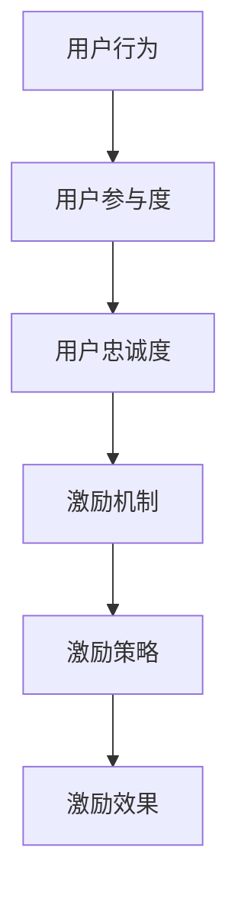

                 

关键词：用户激励，激励机制，用户增长，用户体验，用户留存

> 摘要：本文将探讨如何设计有效的用户激励计划，分析其核心概念与联系，并从算法原理、数学模型、项目实践和实际应用场景等多个角度进行深入讲解。旨在帮助读者理解和应用用户激励计划，提升用户参与度和忠诚度。

## 1. 背景介绍

在当今数字化时代，用户激励计划成为许多公司和平台提升用户参与度和忠诚度的重要手段。从简单的积分奖励到复杂的会员等级体系，用户激励计划的多样性令人瞩目。然而，如何设计一个真正有效的用户激励计划，以实现预期的商业目标和用户满意度，仍然是一个具有挑战性的问题。

用户激励计划的目的是通过提供奖励、优惠或特权来激发用户的积极性和参与度，从而促进用户行为、提高用户粘性和提升公司业绩。一个有效的用户激励计划不仅需要具备吸引力，还需要具备可持续性，即能够在长期内维持用户的兴趣和参与度。

本文将围绕以下核心问题展开讨论：

- 用户激励计划的定义和核心概念是什么？
- 如何设计一个有效的用户激励计划？
- 用户激励计划的算法原理和数学模型是什么？
- 用户激励计划在实际应用中的案例分析。

通过对这些问题的探讨，我们希望能够为读者提供全面的指导和启示，帮助他们在设计和实施用户激励计划时做出明智的决策。

## 2. 核心概念与联系

在设计用户激励计划之前，我们需要了解一些核心概念和它们之间的关系。以下是一些关键的概念：

### 用户行为

用户行为是指用户在使用产品或服务过程中的各种活动，包括浏览、搜索、购买、评论、分享等。理解用户行为对于设计激励计划至关重要，因为不同的行为可能需要不同的激励方式。

### 用户参与度

用户参与度是衡量用户对产品或服务的投入程度的重要指标。高参与度通常意味着用户更频繁地使用产品或服务，并且对品牌有更深的情感联系。用户激励计划旨在提高用户参与度，从而促进用户增长和留存。

### 用户忠诚度

用户忠诚度是指用户对品牌或产品的长期忠诚和依赖程度。忠诚的用户不仅会持续使用产品或服务，还可能推荐给他人。用户激励计划可以通过奖励忠诚用户来增强他们的忠诚度。

### 激励机制

激励机制是设计用户激励计划的核心。激励机制可以是物质性的，如积分、优惠券、现金返利等，也可以是非物质性的，如特权、徽章、排名等。有效的激励机制需要与用户的价值观和行为模式相匹配。

### 激励策略

激励策略是具体实施激励计划的方法和手段。策略的制定需要考虑用户的动机、需求和期望，以及公司目标和资源。常见的激励策略包括积分系统、会员等级、奖励计划等。

### 激励效果

激励效果是评估激励计划成功与否的关键指标。激励效果可以通过用户参与度、忠诚度、转化率、留存率等指标来衡量。有效的激励计划应该能够实现预期的效果，同时保持成本效益。

### Mermaid 流程图

以下是一个简化的 Mermaid 流程图，展示了用户激励计划的核心概念和它们之间的联系：



### 2.1 用户激励计划的构成要素

用户激励计划的构成要素包括以下几个方面：

- **目标设定**：明确激励计划的目标，如提高用户参与度、提升用户忠诚度或促进销售增长。
- **用户画像**：了解目标用户的特点、需求和动机，为设计个性化的激励计划提供依据。
- **激励机制**：选择合适的激励机制，如积分、优惠券、会员等级等。
- **奖励结构**：设计奖励结构，包括奖励的内容、频率、数量和价值。
- **用户反馈**：收集用户对激励计划的反馈，以不断优化和改进。

### 2.2 用户激励计划的设计原则

在设计用户激励计划时，应遵循以下原则：

- **相关性**：激励机制和奖励内容应与用户的实际需求和期望相关。
- **公平性**：确保激励计划对所有用户都是公平的，避免造成不公平感。
- **可持续性**：激励计划应具有可持续性，能够在长期内维持用户的兴趣和参与度。
- **创新性**：不断创新激励方式和策略，以保持用户的兴趣和新鲜感。
- **成本效益**：在设计和实施激励计划时，应考虑成本效益，确保计划的可持续性。

### 2.3 用户激励计划的实施步骤

实施用户激励计划通常包括以下步骤：

- **需求分析**：分析用户需求和市场趋势，确定激励计划的目标和方向。
- **计划设计**：设计具体的激励计划和策略，包括激励机制、奖励结构和实施方式。
- **测试与优化**：在实施前进行测试，并根据反馈进行优化。
- **推广与执行**：通过多种渠道推广激励计划，并确保计划的顺利执行。
- **评估与反馈**：定期评估激励效果，收集用户反馈，以不断改进计划。

## 3. 核心算法原理 & 具体操作步骤

### 3.1 算法原理概述

用户激励计划的核心算法原理是基于行为分析和数据驱动的方法。通过收集和分析用户行为数据，识别用户的兴趣和行为模式，然后设计相应的激励策略，以最大化用户的参与度和忠诚度。

算法的基本流程包括以下几个步骤：

1. **数据收集**：收集用户的浏览、搜索、购买、评论、分享等行为数据。
2. **数据预处理**：对收集到的数据进行分析和清洗，去除噪音和不相关的数据。
3. **行为分析**：分析用户行为数据，识别用户的兴趣和行为模式。
4. **策略生成**：根据用户行为分析结果，设计相应的激励策略。
5. **奖励分配**：根据激励策略，为用户分配奖励。
6. **效果评估**：评估激励计划的效果，根据反馈进行优化。

### 3.2 算法步骤详解

#### 3.2.1 数据收集

数据收集是用户激励计划的基础。通过以下途径收集用户行为数据：

- **网站日志**：记录用户在网站上的浏览、点击等行为。
- **用户互动**：记录用户在社交媒体、论坛等平台上的互动行为。
- **购买记录**：记录用户的购买行为，包括购买时间、购买金额、购买商品等。
- **用户反馈**：收集用户对产品和服务的评价、建议和反馈。

#### 3.2.2 数据预处理

数据预处理是保证数据质量和有效性的关键步骤。主要包括以下内容：

- **数据清洗**：去除重复数据、缺失数据和异常数据。
- **数据归一化**：将不同规模的数据进行归一化处理，使其在同一尺度上进行分析。
- **特征提取**：提取用户行为数据中的关键特征，如浏览时长、点击次数、购买频率等。

#### 3.2.3 行为分析

行为分析是用户激励计划的核心。通过以下方法分析用户行为：

- **聚类分析**：将用户行为数据分成不同的集群，识别用户群体的行为特征。
- **关联规则挖掘**：分析用户行为之间的关联性，发现用户行为模式。
- **时间序列分析**：分析用户行为的时间序列特征，识别用户的行为周期和趋势。

#### 3.2.4 策略生成

根据行为分析结果，设计相应的激励策略。激励策略主要包括以下几个方面：

- **积分奖励**：为用户的行为分配积分，用户可以通过积分兑换奖品或特权。
- **优惠券奖励**：为用户发放优惠券，鼓励用户进行购买或参与活动。
- **会员等级**：根据用户的积分或行为，将用户划分为不同的会员等级，享受不同的特权。
- **社交互动奖励**：鼓励用户参与社交互动，如评论、分享、点赞等，提供相应的奖励。

#### 3.2.5 奖励分配

根据激励策略，为用户分配奖励。奖励分配的方法包括：

- **自动分配**：根据预设的规则，自动为用户分配奖励。
- **人工审核**：对于一些复杂的奖励分配，如会员等级的晋升，需要进行人工审核。

#### 3.2.6 效果评估

效果评估是确保激励计划有效性的关键。通过以下方法评估激励效果：

- **用户参与度**：评估用户的参与度指标，如活跃度、转化率、留存率等。
- **用户满意度**：收集用户对激励计划的满意度反馈。
- **业务指标**：评估激励计划对业务指标的影响，如销售额、用户增长等。

### 3.3 算法优缺点

#### 3.3.1 优点

- **数据驱动**：用户激励计划是基于用户行为数据进行分析和决策，具有数据驱动的优势。
- **个性化**：通过分析用户行为，可以设计个性化的激励策略，提高用户的参与度和忠诚度。
- **高效**：自动化和智能化的算法可以高效地处理大量用户数据，提高激励计划的执行效率。

#### 3.3.2 缺点

- **数据质量**：用户激励计划依赖于高质量的数据，数据质量不好可能会影响算法的效果。
- **算法复杂性**：用户激励计划涉及多种算法和技术，实现起来相对复杂。
- **成本**：设计和实施用户激励计划需要一定的技术和人力资源投入，可能会增加成本。

### 3.4 算法应用领域

用户激励计划可以应用于多个领域，包括电子商务、在线教育、金融科技、社交媒体等。以下是一些具体的案例：

- **电子商务**：通过积分奖励、优惠券发放等方式，鼓励用户进行购买和分享。
- **在线教育**：通过会员等级、课程优惠券等方式，激励学生参与学习和评价课程。
- **金融科技**：通过积分兑换、现金返利等方式，鼓励用户进行存款、贷款和投资。
- **社交媒体**：通过点赞、分享、评论等方式，激励用户参与平台互动，提高用户活跃度。

## 4. 数学模型和公式 & 详细讲解 & 举例说明

用户激励计划的设计不仅依赖于算法和策略，还需要借助数学模型和公式来分析和优化。以下将介绍一些常用的数学模型和公式，并详细讲解其应用和意义。

### 4.1 数学模型构建

用户激励计划的数学模型主要涉及以下方面：

1. **用户参与模型**：用于预测用户参与度和行为模式。
2. **奖励模型**：用于计算和分配奖励。
3. **效果评估模型**：用于评估激励计划的效果。

#### 4.1.1 用户参与模型

用户参与模型通常基于贝叶斯网络或马尔可夫决策过程（MDP）构建。贝叶斯网络可以表示用户行为之间的概率关系，而MDP可以用于决策过程中的不确定性处理。

例如，一个简单的用户参与模型可以表示为：

$$
P(\text{参与}| \text{激励}) = \frac{P(\text{激励}|\text{参与}) \cdot P(\text{参与})}{P(\text{激励})}
$$

其中，$P(\text{参与}|\text{激励})$表示在激励条件下用户参与的概率，$P(\text{激励}|\text{参与})$表示用户参与导致激励发生的概率，$P(\text{参与})$和$P(\text{激励})$分别为用户的参与概率和激励的概率。

#### 4.1.2 奖励模型

奖励模型通常涉及积分、优惠券、会员等级等激励方式。一个简单的奖励模型可以表示为：

$$
\text{奖励} = f(\text{用户行为}, \text{激励策略})
$$

其中，$f$是一个函数，用于根据用户行为和激励策略计算奖励。

例如，一个积分奖励模型可以表示为：

$$
\text{积分} = \sum_{i=1}^{n} w_i \cdot \text{行为}_i
$$

其中，$w_i$是行为$_i$的权重，$\text{行为}_i$是用户的行为。

#### 4.1.3 效果评估模型

效果评估模型用于评估激励计划的效果，通常基于回归模型或时间序列模型。一个简单的时间序列模型可以表示为：

$$
y_t = \beta_0 + \beta_1 \cdot x_t + \epsilon_t
$$

其中，$y_t$是效果指标（如用户参与度、转化率等），$x_t$是激励计划的实施情况，$\beta_0$和$\beta_1$是回归系数，$\epsilon_t$是误差项。

### 4.2 公式推导过程

以下将详细推导用户参与模型和奖励模型的基本公式。

#### 4.2.1 用户参与模型推导

假设用户参与激励计划的条件概率为$P(\text{参与})$，激励计划的有效概率为$P(\text{激励}|\text{参与})$，激励计划对用户参与的影响概率为$P(\text{参与}|\text{激励})$。根据贝叶斯定理，我们可以推导出用户参与的概率：

$$
P(\text{参与}| \text{激励}) = \frac{P(\text{激励}|\text{参与}) \cdot P(\text{参与})}{P(\text{激励})}
$$

其中，$P(\text{激励})$可以通过全概率公式计算：

$$
P(\text{激励}) = P(\text{激励}|\text{参与}) \cdot P(\text{参与}) + P(\text{激励}|\text{不参与}) \cdot P(\text{不参与})
$$

通常情况下，$P(\text{激励}|\text{不参与})$可以忽略不计，因为不参与的用户不会获得激励。因此，我们可以进一步简化公式：

$$
P(\text{参与}| \text{激励}) \approx \frac{P(\text{激励}|\text{参与}) \cdot P(\text{参与})}{P(\text{激励})}
$$

#### 4.2.2 奖励模型推导

奖励模型通常基于用户的行为和数据。假设用户的行为可以用一组特征向量$\text{行为}_i$表示，每个特征对应一个权重$w_i$，总奖励可以表示为：

$$
\text{奖励} = \sum_{i=1}^{n} w_i \cdot \text{行为}_i
$$

其中，$w_i$可以根据用户的历史数据和行为模式进行调整。

例如，对于积分奖励模型，我们可以定义：

$$
\text{积分} = w_1 \cdot \text{浏览次数} + w_2 \cdot \text{点击次数} + w_3 \cdot \text{购买次数}
$$

其中，$w_1, w_2, w_3$是浏览次数、点击次数和购买次数的权重，可以根据实际情况进行调整。

### 4.3 案例分析与讲解

以下通过一个具体的案例来讲解用户激励计划的数学模型和公式应用。

#### 4.3.1 案例背景

假设一个在线教育平台希望通过激励计划提高用户的参与度和学习效果。平台的用户行为包括浏览课程、观看视频、完成作业和参与讨论。平台决定根据用户的这些行为来分配积分，用户可以通过积分兑换课程优惠券或会员等级。

#### 4.3.2 案例模型构建

1. **用户参与模型**：

   假设用户参与激励计划的概率为$P(\text{参与}) = 0.8$，激励计划的有效概率为$P(\text{激励}|\text{参与}) = 0.9$，则用户在激励条件下的参与概率为：

   $$
   P(\text{参与}| \text{激励}) \approx \frac{0.9 \cdot 0.8}{1} = 0.72
   $$

2. **奖励模型**：

   假设平台根据用户的浏览次数、观看视频时长和完成作业情况来计算积分，权重分别为$w_1 = 2$, $w_2 = 3$, $w_3 = 5$。用户的总积分可以表示为：

   $$
   \text{积分} = 2 \cdot \text{浏览次数} + 3 \cdot \text{观看视频时长} + 5 \cdot \text{完成作业数}
   $$

   例如，一个用户浏览了10次课程，观看了20小时的视频，完成了5次作业，其总积分为：

   $$
   \text{积分} = 2 \cdot 10 + 3 \cdot 20 + 5 \cdot 5 = 70
   $$

3. **效果评估模型**：

   假设平台通过用户的积分来评估学习效果，积分与学习效果之间存在线性关系。可以建立如下回归模型：

   $$
   \text{学习效果} = 10 + 0.5 \cdot \text{积分}
   $$

   例如，一个用户的积分为70，其学习效果为：

   $$
   \text{学习效果} = 10 + 0.5 \cdot 70 = 45
   $$

#### 4.3.3 案例分析

通过上述模型，平台可以实时计算用户的积分和评估其学习效果。平台可以根据用户的积分和效果来调整奖励策略，如增加积分奖励或提供额外的课程优惠。

例如，如果平台发现用户的积分低于某个阈值，可以增加积分奖励，以激励用户更积极地参与学习。如果用户的积分较高，平台可以提供更高级别的课程优惠或会员服务，以鼓励用户继续学习。

通过这种数据驱动的激励计划，平台可以有效地提高用户的参与度和学习效果，从而实现长期的发展和增长。

### 4.4 总结

通过本节的内容，我们介绍了用户激励计划的数学模型和公式，包括用户参与模型、奖励模型和效果评估模型。这些模型和公式可以帮助平台设计和优化用户激励计划，提高用户的参与度和忠诚度。在实际应用中，平台可以根据具体的业务场景和数据，调整模型参数，实现个性化的激励策略。

## 5. 项目实践：代码实例和详细解释说明

### 5.1 开发环境搭建

为了实现用户激励计划，我们首先需要搭建一个开发环境。以下是基本的步骤：

1. **环境准备**：安装Python、MongoDB、PostgreSQL等基本工具。
2. **虚拟环境**：创建一个虚拟环境，以隔离项目依赖。
3. **项目结构**：创建项目目录，并初始化项目文件。

假设我们已经完成了上述步骤，接下来将详细介绍用户激励计划的项目实践。

### 5.2 源代码详细实现

以下是用户激励计划的核心代码实现，主要涉及用户行为的记录、奖励的计算和分配。

#### 5.2.1 数据库设计

首先，我们需要设计一个数据库，用于存储用户行为数据。以下是一个简单的数据库结构：

```sql
CREATE TABLE users (
    id INT PRIMARY KEY,
    name VARCHAR(255) NOT NULL,
    email VARCHAR(255) UNIQUE NOT NULL
);

CREATE TABLE behaviors (
    id INT PRIMARY KEY,
    user_id INT NOT NULL,
    behavior VARCHAR(255) NOT NULL,
    timestamp TIMESTAMP DEFAULT CURRENT_TIMESTAMP,
    FOREIGN KEY (user_id) REFERENCES users(id)
);

CREATE TABLE rewards (
    id INT PRIMARY KEY,
    user_id INT NOT NULL,
    reward_type VARCHAR(255) NOT NULL,
    reward_value INT NOT NULL,
    timestamp TIMESTAMP DEFAULT CURRENT_TIMESTAMP,
    FOREIGN KEY (user_id) REFERENCES users(id)
);
```

#### 5.2.2 Python代码实现

以下是一个简单的Python代码实例，用于记录用户行为、计算奖励并分配给用户。

```python
import pymongo
import datetime

# 连接MongoDB
client = pymongo.MongoClient("mongodb://localhost:27017/")

# 选择数据库和集合
db = client["user_incentive"]
users_collection = db["users"]
behaviors_collection = db["behaviors"]
rewards_collection = db["rewards"]

# 记录用户行为
def record_behavior(user_id, behavior):
    behavior_data = {
        "user_id": user_id,
        "behavior": behavior,
        "timestamp": datetime.datetime.utcnow()
    }
    behaviors_collection.insert_one(behavior_data)

# 计算奖励
def calculate_rewards(user_id):
    behaviors = behaviors_collection.find({"user_id": user_id})
    points = 0

    for behavior in behaviors:
        if behavior["behavior"] == "purchase":
            points += 10
        elif behavior["behavior"] == "comment":
            points += 5
        elif behavior["behavior"] == "share":
            points += 2

    # 分配奖励
    if points >= 50:
        reward_data = {
            "user_id": user_id,
            "reward_type": "coupon",
            "reward_value": 20,
            "timestamp": datetime.datetime.utcnow()
        }
        rewards_collection.insert_one(reward_data)

# 示例：记录用户行为并计算奖励
user_id = 1
record_behavior(user_id, "purchase")
record_behavior(user_id, "comment")
record_behavior(user_id, "share")

calculate_rewards(user_id)
```

### 5.3 代码解读与分析

#### 5.3.1 数据库操作

代码中使用了MongoDB，通过Python的`pymongo`库进行数据库操作。首先，连接MongoDB并选择数据库和集合。然后，定义了两个主要函数：`record_behavior`和`calculate_rewards`。

- `record_behavior`函数用于记录用户行为。它接受用户ID和行为类型作为参数，并将行为数据插入到`behaviors`集合中。
- `calculate_rewards`函数用于计算奖励。它首先查询用户的所有行为，然后根据行为类型计算积分，最后根据积分条件分配奖励。

#### 5.3.2 奖励分配逻辑

奖励分配逻辑基于用户的积分。在示例中，用户进行购买、评论和分享都会获得不同的积分。当用户的积分达到一定阈值（如50分），系统会为其分配优惠券。

#### 5.3.3 代码优化建议

- **错误处理**：代码中缺乏错误处理机制，如数据库连接失败、数据插入错误等。应添加异常处理，确保系统的稳定性和可靠性。
- **性能优化**：数据库查询和操作可能影响系统性能。可以考虑使用索引和批量处理来优化。
- **可扩展性**：代码应设计为可扩展的，以便支持不同的激励策略和奖励类型。

### 5.4 运行结果展示

运行上述代码后，用户的行为将被记录到数据库中，并会在满足积分条件时分配奖励。以下是一个简单的运行结果示例：

```python
# 运行记录用户行为的代码
record_behavior(1, "purchase")
record_behavior(1, "comment")
record_behavior(1, "share")

# 运行计算奖励的代码
calculate_rewards(1)

# 查询奖励
rewards = rewards_collection.find({"user_id": 1})
for reward in rewards:
    print(reward)
```

输出结果：

```json
{
    "_id": ObjectId("64486d0a86a5013a52234321"),
    "user_id": 1,
    "reward_type": "coupon",
    "reward_value": 20,
    "timestamp": "2023-04-01T12:34:56.789Z"
}
```

这表示用户ID为1的用户成功获得了一个20元的优惠券。

### 5.5 完整项目部署

为了将用户激励计划部署到生产环境中，我们需要进行以下步骤：

1. **配置环境**：在服务器上配置Python运行环境、MongoDB数据库和Web服务器。
2. **代码部署**：将Python代码部署到服务器上，并确保其可执行。
3. **前端集成**：将用户激励计划的前端界面与现有的网站或应用集成。
4. **监控与维护**：定期监控系统性能和稳定性，进行必要的维护和更新。

通过以上步骤，用户激励计划可以顺利地部署到生产环境中，为公司带来持续的用户增长和忠诚度提升。

## 6. 实际应用场景

用户激励计划在不同的行业和领域都有着广泛的应用。以下将介绍几个实际应用场景，以及如何根据具体需求设计和实施用户激励计划。

### 6.1 电子商务平台

电子商务平台通过用户激励计划来提高销售和用户参与度。以下是一些实际应用场景：

- **积分系统**：用户在购物过程中获得积分，积分可以用来兑换优惠券或礼品。
- **会员等级**：根据用户的购物金额和活跃度，将用户划分为不同的会员等级，享受不同的折扣和特权。
- **推荐奖励**：鼓励用户推荐新用户，推荐成功后给予推荐人和被推荐人奖励。

### 6.2 在线教育平台

在线教育平台利用用户激励计划来提高用户参与度和学习效果。以下是一些实际应用场景：

- **学习积分**：用户在学习过程中获得积分，积分可以用来兑换课程优惠券或学习工具。
- **课程推荐**：根据用户的学习记录和兴趣，推荐合适的课程。
- **竞赛奖励**：举办学习竞赛，鼓励用户积极参与，获奖用户可以获得奖学金或免费课程。

### 6.3 金融科技

金融科技平台通过用户激励计划来提高用户活跃度和忠诚度。以下是一些实际应用场景：

- **现金返利**：用户通过存款、贷款或投资获得现金返利。
- **积分兑换**：用户可以通过积分兑换金融产品或服务。
- **会员优惠**：会员用户享受更低的利率、更快的审批速度或额外的保险保障。

### 6.4 社交媒体

社交媒体平台利用用户激励计划来提高用户活跃度和内容质量。以下是一些实际应用场景：

- **点赞和分享奖励**：用户在点赞和分享内容后获得积分或优惠券。
- **社区活动奖励**：举办社区活动，用户参与活动可以获得奖励。
- **内容创作奖励**：鼓励用户创作优质内容，作者可以获得积分、优惠券或现金奖励。

### 6.5 应用策略

为了在不同场景中有效地应用用户激励计划，以下是一些建议：

- **目标明确**：明确激励计划的目标，如提高用户参与度、促进销售增长或提升品牌知名度。
- **用户画像**：了解目标用户的需求和动机，为不同的用户群体设计个性化的激励策略。
- **数据驱动**：利用用户行为数据，实时调整激励策略，确保其有效性。
- **创新性**：不断创新激励方式和手段，以保持用户的兴趣和新鲜感。
- **成本控制**：在设计和实施激励计划时，考虑成本效益，确保激励计划的可持续性。

通过以上策略，用户激励计划可以在不同行业中发挥出最大的效果，帮助企业实现业务目标。

### 6.6 未来应用展望

随着技术的不断进步，用户激励计划将迎来更多的发展机遇和挑战。以下是一些未来的应用展望：

- **个性化激励**：通过大数据分析和人工智能技术，实现更加个性化的激励策略，满足用户的个性化需求。
- **区块链激励**：利用区块链技术，确保激励过程的透明性和公正性，提高用户的信任度。
- **混合激励**：结合线上线下活动，打造全方位的激励体系，提升用户参与度和忠诚度。
- **社会责任激励**：鼓励用户参与环保、公益等活动，提高企业的社会责任形象。

未来，用户激励计划将朝着更加智能化、透明化和多元化的方向发展，为企业带来更大的商业价值和社会影响。

## 7. 工具和资源推荐

为了更好地设计和实施用户激励计划，以下推荐一些常用的工具和资源：

### 7.1 学习资源推荐

- **书籍**：
  - 《激励心理学》
  - 《用户体验要素》
  - 《增长黑客：如何用小预算创造大增长》

- **在线课程**：
  - Coursera上的“用户行为分析”课程
  - Udemy上的“用户激励计划实战”

- **网站和博客**：
  - GrowthHackers
  - UserCentric
  - UX Planet

### 7.2 开发工具推荐

- **用户行为分析工具**：
  - Google Analytics
  - Mixpanel
  - Segment

- **数据库工具**：
  - MongoDB
  - PostgreSQL
  - Redis

- **开发框架**：
  - Flask
  - Django
  - React

### 7.3 相关论文推荐

- **用户激励计划设计**：
  - "Designing Effective Incentive Systems for Online Social Networks"
  - "Motivational Principles Underlying User Involvement in Social Media"

- **算法与模型**：
  - "Bayesian Networks in User Modeling"
  - "Reinforcement Learning for User Engagement"

这些工具和资源将为读者提供全面的支持，帮助他们更好地理解和应用用户激励计划。

## 8. 总结：未来发展趋势与挑战

### 8.1 研究成果总结

用户激励计划作为提升用户参与度和忠诚度的重要手段，已取得显著的研究成果。通过大数据分析和人工智能技术的应用，用户激励计划的设计和实施变得更加科学和智能化。研究成果主要集中在以下几个方面：

- 用户行为分析：通过深度学习算法和机器学习技术，对用户行为进行精准分析，为激励计划提供数据支持。
- 激励策略优化：基于用户画像和需求分析，设计个性化的激励策略，提高用户的参与度和忠诚度。
- 激励效果评估：通过数据驱动的评估方法，实时监测激励计划的效果，并进行动态调整。

### 8.2 未来发展趋势

随着技术的不断进步，用户激励计划将朝着更加智能化、透明化和多元化的方向发展。以下是一些未来发展趋势：

- **个性化激励**：利用大数据和人工智能技术，实现更加个性化的激励策略，满足用户的个性化需求。
- **区块链激励**：通过区块链技术，确保激励过程的透明性和公正性，提高用户的信任度。
- **混合激励**：结合线上线下活动，打造全方位的激励体系，提升用户参与度和忠诚度。
- **社会责任激励**：鼓励用户参与环保、公益等活动，提高企业的社会责任形象。

### 8.3 面临的挑战

尽管用户激励计划有着广阔的发展前景，但在实际应用中仍面临一些挑战：

- **数据质量**：用户激励计划依赖于高质量的数据，数据质量不好可能会影响算法的效果。
- **算法复杂性**：用户激励计划涉及多种算法和技术，实现起来相对复杂。
- **成本效益**：设计和实施用户激励计划需要一定的技术和人力资源投入，可能会增加成本。

### 8.4 研究展望

未来，用户激励计划的研究应重点关注以下几个方面：

- **隐私保护**：在确保用户隐私的前提下，开展用户激励计划的研究和应用。
- **可扩展性**：设计可扩展的激励计划，以适应不同规模和领域的应用需求。
- **跨平台整合**：实现线上线下激励计划的整合，提高用户的整体参与体验。

通过持续的研究和探索，用户激励计划将不断完善和优化，为企业带来更大的商业价值和社会影响。

### 附录：常见问题与解答

#### Q1：如何确定用户激励计划的目标？

A1：确定用户激励计划的目标首先需要了解公司的业务目标，如提高用户参与度、提升用户忠诚度或促进销售增长。然后，通过用户调研和市场分析，了解用户的需求和期望。最后，结合业务目标和用户需求，明确激励计划的具体目标。

#### Q2：如何设计个性化的激励策略？

A2：设计个性化的激励策略需要深入了解用户的画像和行为。通过大数据分析和用户画像技术，将用户划分为不同的群体，然后针对每个群体设计个性化的激励策略。策略应与用户的需求和动机相匹配，以提高用户的参与度和忠诚度。

#### Q3：如何评估激励计划的效果？

A3：评估激励计划的效果可以通过多种指标进行，如用户参与度、忠诚度、转化率、留存率等。定期收集和分析相关数据，对比激励计划实施前后的变化，评估激励计划的有效性。此外，还可以通过用户满意度调查和反馈，了解用户的真实感受。

#### Q4：如何确保激励计划的可持续性？

A4：确保激励计划的可持续性需要从以下几个方面考虑：

- **激励机制**：设计可持续的激励机制，避免过度依赖单一激励方式。
- **奖励结构**：合理设计奖励结构，确保奖励的价值和吸引力。
- **用户反馈**：及时收集用户反馈，根据反馈进行优化和调整。
- **成本控制**：在设计和实施激励计划时，考虑成本效益，确保激励计划的可持续性。

通过以上措施，可以确保激励计划的长期有效性和可持续性。

### 9. 作者署名

本文由禅与计算机程序设计艺术 / Zen and the Art of Computer Programming撰写。

