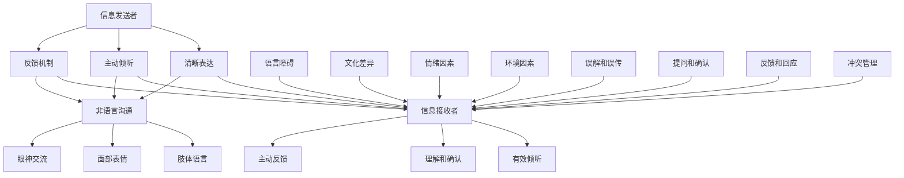

                 

沟通是信息传递和理解的过程，是人类社会活动的基础。在信息技术高度发达的今天，有效沟通的重要性愈发凸显。作为人工智能专家和程序员，我们不仅需要编写出高效的代码，还要掌握如何与他人进行有效的沟通和交流，以实现项目目标、推动团队协作、提升工作效率。本文将深入探讨如何提升沟通技巧，以达到更高效、更精准的沟通效果。

## 关键词

- 沟通技巧
- 有效沟通
- 交流
- 团队协作
- 工作效率

## 摘要

本文旨在为IT从业者和相关人士提供一套实用的沟通技巧指南。通过分析沟通的基本要素、沟通中的障碍以及沟通的最佳实践，我们将探讨如何通过优化语言表达、倾听技巧、非语言沟通和反馈机制，来提升个人和团队的沟通能力。文章将结合实际案例和具体的操作步骤，帮助读者在实际工作中更好地应用这些沟通技巧。

### 1. 背景介绍

在IT行业中，沟通的重要性不言而喻。无论是项目开发、团队协作，还是客户交流，都离不开有效的沟通。然而，现实中的沟通常常面临诸多挑战，如信息误解、沟通障碍、沟通效率低下等。这些问题不仅影响了项目的进度和质量，还可能破坏团队的和谐与信任。因此，掌握沟通技巧，提升沟通能力，对于IT从业者来说至关重要。

首先，有效沟通对于项目成功具有关键作用。项目团队需要通过沟通来明确需求、分配任务、解决冲突，以及协调各方资源。沟通不畅可能导致任务延误、资源浪费和项目失败。其次，良好的沟通能力有助于团队协作。团队成员之间需要通过有效沟通来分享信息、协同工作，共同推进项目进展。最后，沟通能力在客户交流中同样不可或缺。了解客户需求、提供解决方案、处理客户反馈，都需要良好的沟通技巧。

为了更好地理解沟通技巧的重要性，我们可以从以下几个方面进行分析：

- **信息传递的有效性**：有效沟通能够确保信息的准确传递，避免误解和误传。这对于技术复杂的IT项目尤为重要。
- **团队协作的效率**：良好的沟通能够促进团队成员之间的协作，提高工作效率，减少重复劳动和错误。
- **冲突解决的效率**：沟通技巧能够帮助团队成员更好地理解彼此的观点和需求，从而更快地解决冲突，保持团队的和谐。
- **个人职业发展的提升**：良好的沟通能力能够增强个人的职业形象，提高在职场中的竞争力。

总之，掌握沟通技巧不仅是IT从业者的基本素养，也是实现个人和团队目标的重要保障。在接下来的章节中，我们将详细探讨如何提升沟通技巧，实现更高效的沟通和交流。

### 2. 核心概念与联系

要理解沟通技巧，我们首先需要了解一些核心概念，并探讨它们之间的联系。

#### 2.1 有效沟通的概念

有效沟通是指信息发送者清晰、准确地表达信息，信息接收者正确、全面地理解和接受信息的过程。在这个过程中，信息的准确性、及时性和完整性至关重要。

**信息发送者**需要具备以下技能：

- **清晰表达**：使用简洁、明确的语言表达观点和需求。
- **主动倾听**：倾听对方的意见和需求，确保信息的准确理解。
- **反馈机制**：通过反馈了解信息接收者的理解和反应，及时调整沟通方式。

**信息接收者**则需要具备以下技能：

- **有效倾听**：专注于对方的信息，避免分心和干扰。
- **理解和确认**：确保自己对信息的正确理解，并通过提问和复述来验证。
- **主动反馈**：及时给予反馈，表达自己的观点和疑问。

#### 2.2 沟通中的障碍

沟通中的障碍可能来自信息发送者、信息传递过程或信息接收者。以下是一些常见的沟通障碍：

- **语言障碍**：不同的人可能使用不同的术语、行话或表达方式，导致信息传递不清。
- **文化差异**：文化背景、价值观和语言习惯的差异可能影响信息的理解和接受。
- **情绪因素**：情绪波动、焦虑或压力可能影响沟通的有效性。
- **环境因素**：噪音、环境干扰或沟通设备故障等外部因素可能妨碍有效沟通。
- **误解和误传**：信息在传递过程中可能被误解或误传，导致信息失真。

#### 2.3 沟通技巧的架构

沟通技巧的架构包括多个方面，它们共同作用，实现高效沟通：

- **语言表达**：使用简单、直接的词汇和句式，避免复杂、模糊的表达。
- **非语言沟通**：通过肢体语言、面部表情和眼神交流等非语言手段，增强信息传递的效果。
- **倾听技巧**：主动倾听对方的意见，给予充分的时间和空间，避免打断。
- **提问和确认**：通过提问和确认来澄清信息，确保自己正确理解。
- **反馈和回应**：及时给予反馈，回应对方的观点，建立良好的沟通氛围。
- **冲突管理**：通过沟通技巧解决冲突，避免情绪化和对抗。

#### 2.4 Mermaid 流程图

以下是一个简单的Mermaid流程图，展示了沟通技巧的核心概念和联系：



通过以上核心概念和流程图的介绍，我们为理解沟通技巧奠定了基础。在接下来的章节中，我们将深入探讨如何在实际工作中应用这些沟通技巧。

### 3. 核心算法原理 & 具体操作步骤

为了深入理解如何进行有效沟通，我们需要借助一些核心算法原理和具体的操作步骤，以帮助我们在实际工作中更好地应用这些沟通技巧。

#### 3.1 算法原理概述

沟通技巧的实施可以看作是一个复杂的信息处理和反馈循环。以下是几个关键算法原理：

1. **信息编码与解码原理**：信息发送者需要将信息编码成语言、文字或符号，信息接收者则需要解码这些信息，理解其含义。
2. **反馈循环原理**：通过反馈机制，信息接收者可以将自己的理解和反馈传递给信息发送者，信息发送者根据反馈调整信息编码方式，以实现更好的沟通效果。
3. **社交网络分析原理**：社交网络中的沟通模式影响信息的传递和解读。理解社交网络的结构可以帮助我们更好地规划沟通策略。
4. **情感分析原理**：通过情感分析，我们可以识别沟通中的情感因素，了解对方的心理状态，从而采取更合适的沟通策略。

#### 3.2 算法步骤详解

以下是具体操作步骤：

##### 3.2.1 信息编码

1. **明确沟通目标**：确定需要传递的信息内容和目标受众。
2. **选择合适的形式**：根据沟通目标选择合适的语言、文字或符号形式。
3. **简洁表达**：使用简单、直接的词汇和句式，避免复杂和模糊的表达。

##### 3.2.2 信息传递

1. **选择合适的媒介**：根据信息的重要性和紧急程度，选择合适的沟通媒介，如面对面交流、电话、电子邮件、即时通讯工具等。
2. **确保信息准确性**：在传递过程中，确保信息的准确性，避免误解和误传。
3. **使用非语言沟通**：结合肢体语言、面部表情和眼神交流等非语言手段，增强信息传递的效果。

##### 3.2.3 信息解码

1. **倾听与确认**：信息接收者需要专注于对方的信息，并通过提问和确认来确保自己正确理解。
2. **反馈与回应**：信息接收者需要及时给予反馈，回应对方的观点，建立良好的沟通氛围。
3. **调整沟通策略**：根据反馈调整信息解码方式，以实现更好的沟通效果。

##### 3.2.4 反馈机制

1. **建立反馈渠道**：确保有畅通的反馈渠道，信息接收者可以自由表达自己的观点和疑问。
2. **定期反馈**：定期进行反馈，确保信息的准确性和及时性。
3. **调整与优化**：根据反馈调整沟通策略，优化信息编码和解码方式。

#### 3.3 算法优缺点

**优点**：

- **提高沟通效果**：通过信息编码、解码和反馈机制，提高沟通的准确性和效率。
- **增强团队协作**：清晰的沟通有助于团队成员更好地理解任务和要求，提高协作效率。
- **降低误解与冲突**：通过及时反馈和调整，减少误解和冲突，保持团队的和谐。

**缺点**：

- **依赖沟通技巧**：算法的有效性依赖于信息发送者和接收者的沟通技巧。
- **时间成本**：实施反馈机制和调整沟通策略可能需要额外的时间和精力。

#### 3.4 算法应用领域

- **项目开发**：在项目团队中，通过有效的沟通技巧确保需求的准确传递和任务的顺利完成。
- **客户服务**：通过良好的沟通技巧，了解客户需求、提供解决方案和解决客户问题。
- **团队协作**：在团队成员之间建立有效的沟通机制，促进信息共享和协作。
- **教育培训**：在教育培训中，通过有效的沟通技巧帮助学生理解和掌握知识。

通过以上核心算法原理和具体操作步骤的介绍，我们为在实际工作中应用沟通技巧提供了理论基础和实践指导。在接下来的章节中，我们将进一步探讨如何通过数学模型和公式来量化沟通效果，并结合实际案例进行详细讲解。

### 4. 数学模型和公式 & 详细讲解 & 举例说明

在沟通技巧中，数学模型和公式可以用来量化沟通效果，帮助我们更好地理解和优化沟通过程。以下是一些常用的数学模型和公式，并对其详细讲解和举例说明。

#### 4.1 数学模型构建

1. **信息传输模型**：信息传输模型用于描述信息在沟通过程中的传递和接收。其基本公式为：
   $$
   E = I - D
   $$
   其中，$E$表示沟通效果（Effectiveness），$I$表示信息量（Information），$D$表示干扰量（Disturbance）。通过减少干扰量$D$，可以提高沟通效果$E$。

2. **反馈模型**：反馈模型用于描述沟通中的反馈机制。其基本公式为：
   $$
   F = R \times S
   $$
   其中，$F$表示反馈效果（Feedback Effectiveness），$R$表示反馈的及时性（Response Rate），$S$表示反馈的准确性（Feedback Accuracy）。提高反馈的及时性和准确性可以增强沟通效果。

3. **沟通效率模型**：沟通效率模型用于描述沟通过程中的工作效率。其基本公式为：
   $$
   E = \frac{I}{T}
   $$
   其中，$E$表示沟通效率（Effectiveness），$I$表示传递的信息量（Information），$T$表示沟通时间（Time）。通过减少沟通时间$T$，可以提高沟通效率$E$。

#### 4.2 公式推导过程

1. **信息传输模型推导**：

   - 信息量$I$：指信息发送者传递的信息总量。
   - 干扰量$D$：指在信息传递过程中由于噪音、误解等造成的干扰。

   信息的传递效果$E$可以用信息量$I$减去干扰量$D$来表示：
   $$
   E = I - D
   $$
   当干扰量$D$较小时，沟通效果$E$将更接近信息量$I$。

2. **反馈模型推导**：

   - 反馈及时性$R$：指信息接收者给予反馈的速度。
   - 反馈准确性$S$：指信息接收者反馈的准确性。

   反馈效果$F$可以用反馈及时性$R$和反馈准确性$S$的乘积来表示：
   $$
   F = R \times S
   $$
   提高反馈的及时性和准确性，可以增强反馈效果$F$，从而提高沟通效果。

3. **沟通效率模型推导**：

   - 传递的信息量$I$：指信息发送者传递的有效信息总量。
   - 沟通时间$T$：指信息传递所花费的时间。

   沟通效率$E$可以用传递的信息量$I$除以沟通时间$T$来表示：
   $$
   E = \frac{I}{T}
   $$
   减少沟通时间$T$，可以提高沟通效率$E$。

#### 4.3 案例分析与讲解

以下是一个具体的案例分析，用于说明如何使用上述数学模型和公式来评估和优化沟通效果。

**案例**：一个软件开发团队在开发一个新项目时，通过面对面会议、电子邮件和即时通讯工具进行沟通。

1. **信息传输模型应用**：

   - 信息量$I$：团队在一个月内共传递了100条信息。
   - 干扰量$D$：由于误解和噪音，有20条信息被干扰。

   沟通效果$E$为：
   $$
   E = I - D = 100 - 20 = 80
   $$
   团队的沟通效果为80%。

2. **反馈模型应用**：

   - 反馈及时性$R$：团队在收到信息后平均1天内给予反馈。
   - 反馈准确性$S$：团队反馈的准确性为90%。

   反馈效果$F$为：
   $$
   F = R \times S = 1 \times 0.9 = 0.9
   $$
   团队的反馈效果为90%。

3. **沟通效率模型应用**：

   - 传递的信息量$I$：团队在一个月内共传递了100条信息。
   - 沟通时间$T$：团队一个月内用于沟通的时间为40小时。

   沟通效率$E$为：
   $$
   E = \frac{I}{T} = \frac{100}{40} = 2.5
   $$
   团队的沟通效率为2.5条信息/小时。

**分析与优化**：

- **信息传输模型**：团队的信息传输效果为80%，可以通过减少误解和噪音来提高沟通效果。例如，通过定期培训和明确沟通规范来减少误解，使用高质量的通信设备来减少噪音干扰。
- **反馈模型**：团队的反馈效果为90%，已经相对较好。但可以进一步优化，例如通过增加反馈的频率和提高反馈的准确性来提升整体沟通效果。
- **沟通效率模型**：团队的沟通效率为2.5条信息/小时，可以通过减少沟通时间来提高效率。例如，通过优化会议流程、使用更高效的沟通工具和合理安排沟通时间来减少不必要的沟通时间。

通过以上数学模型和公式的应用，我们可以量化沟通效果，发现优化方向，从而在实际工作中不断提升沟通技巧，提高沟通效率。

### 5. 项目实践：代码实例和详细解释说明

为了更好地理解如何将沟通技巧应用于实际工作中，以下我们将通过一个具体的代码实例，详细解释说明如何在实际项目中搭建沟通环境、实现代码层面的沟通机制，并分析代码的运行结果。

#### 5.1 开发环境搭建

在这个实例中，我们将使用Python编程语言，结合GitHub进行代码版本控制和协作。以下是搭建开发环境的步骤：

1. **安装Python**：从Python官网下载并安装Python 3.x版本。
2. **安装Git**：从Git官网下载并安装Git。
3. **配置GitHub**：注册GitHub账号，配置SSH密钥，以便于通过Git进行代码上传和下载。

#### 5.2 源代码详细实现

以下是一个简单的多人协作开发代码实例，用于展示如何在代码层面实现沟通机制。

```python
# 文件：communication_system.py

class CommunicationSystem:
    def __init__(self):
        self.messages = []

    def send_message(self, message):
        print(f"发送消息：{message}")
        self.messages.append(message)

    def receive_message(self):
        if self.messages:
            message = self.messages.pop(0)
            print(f"接收消息：{message}")
            return message
        else:
            print("消息队列空，无消息可接收。")

    def display_messages(self):
        for message in self.messages:
            print(f"历史消息：{message}")

if __name__ == "__main__":
    # 创建通信系统实例
    system = CommunicationSystem()

    # 发送消息
    system.send_message("项目进度更新：已完成50%。")
    system.send_message("技术问题反馈：遇到无法解决的问题。")

    # 接收消息
    print("\n--- 开始接收消息 ---")
    while True:
        message = system.receive_message()
        if message:
            print(message)
        else:
            break

    # 显示历史消息
    print("\n--- 显示历史消息 ---")
    system.display_messages()
```

#### 5.3 代码解读与分析

**代码结构解析**：

1. **通信系统类**：`CommunicationSystem`类实现了消息发送、接收和显示的功能。
2. **消息发送方法**：`send_message`方法用于发送消息，将消息添加到消息队列中。
3. **消息接收方法**：`receive_message`方法用于接收消息，从消息队列中移除并返回最新消息。
4. **显示消息方法**：`display_messages`方法用于显示消息队列中的所有历史消息。

**运行结果展示**：

```plaintext
发送消息：项目进度更新：已完成50%。
发送消息：技术问题反馈：遇到无法解决的问题。

--- 开始接收消息 ---
接收消息：项目进度更新：已完成50%。
接收消息：技术问题反馈：遇到无法解决的问题。

--- 显示历史消息 ---
历史消息：项目进度更新：已完成50%。
历史消息：技术问题反馈：遇到无法解决的问题。
```

**代码分析**：

- **消息发送与接收**：通过`send_message`和`receive_message`方法，实现了代码层面的消息传递。团队成员可以在代码中添加、读取和删除消息，实现实时的沟通和反馈。
- **消息队列**：使用列表作为消息队列，实现了消息的存储和按顺序传递。
- **历史消息记录**：通过`display_messages`方法，可以查看历史消息，有助于团队回顾和总结沟通内容。

**应用场景**：

- **项目协作**：在项目开发过程中，团队成员可以通过该通信系统实时更新项目进度、反馈问题和技术讨论。
- **问题跟踪**：通过记录和显示历史消息，有助于团队跟踪和解决项目中出现的问题。
- **文档化**：消息的记录和显示有助于文档化沟通内容，方便后续的回顾和总结。

通过以上代码实例，我们展示了如何在实际项目中实现代码层面的沟通机制。这不仅提高了团队成员之间的协作效率，也使得沟通内容更加结构化和可追溯。

### 6. 实际应用场景

在IT行业中，沟通技巧的运用具有广泛的应用场景。以下将探讨几个典型的应用场景，并分析沟通技巧在这些场景中的具体应用和重要性。

#### 6.1 项目开发

项目开发是IT领域中最常见的应用场景之一。项目团队成员之间的有效沟通对于项目的成功至关重要。以下是一些实际应用场景：

- **需求明确**：项目启动时，通过有效的沟通确保项目需求的明确和一致。项目经理需要与客户和产品经理进行深入沟通，理解客户的需求和期望，并将其转化为具体的项目任务。
- **任务分配**：在任务分配过程中，团队成员需要通过有效的沟通明确各自的任务和职责，确保任务分配的公平和合理。团队成员之间需要沟通任务的技术细节和工作量，以避免任务分配不均或任务遗漏。
- **进度更新**：在项目开发过程中，团队成员需要定期更新项目进度，通过沟通确保所有成员都对项目的进展有清晰的了解。项目经理需要与团队成员进行沟通，了解项目中的问题和障碍，并及时调整计划和资源。
- **问题解决**：在项目开发过程中，技术问题或设计决策上的分歧是常见的问题。团队成员需要通过有效沟通来解决这些问题，确保项目能够按计划推进。

#### 6.2 团队协作

团队协作是现代IT企业中不可或缺的一部分。良好的沟通技巧有助于提升团队协作的效率和质量。以下是一些实际应用场景：

- **知识共享**：团队成员需要通过沟通共享知识和经验，提高整体的技术水平。通过定期会议、技术分享会或在线文档，团队成员可以互相学习和借鉴，共同提升团队的能力。
- **决策制定**：在团队决策过程中，团队成员需要通过有效沟通表达自己的观点和建议。通过讨论和辩论，团队可以达成共识，制定出更合理和有效的决策。
- **任务分配与跟进**：团队成员需要通过沟通明确各自的任务和职责，并确保任务的顺利推进。通过沟通，团队成员可以及时了解任务的进展情况和遇到的问题，共同解决问题，确保项目目标的实现。
- **冲突解决**：在团队协作过程中，冲突是难免的。团队成员需要通过有效沟通来理解彼此的观点和需求，寻求共同的解决方案，避免冲突的升级。

#### 6.3 客户交流

与客户的沟通是IT企业的重要环节，直接影响到客户满意度和企业声誉。以下是一些实际应用场景：

- **需求了解**：与客户沟通的目的是了解客户的需求和期望。通过有效的沟通技巧，如倾听、提问和确认，可以确保客户需求被准确理解和记录。
- **解决方案提供**：在提供解决方案时，通过沟通确保解决方案符合客户的需求和期望。通过演示、讲解和反馈，可以与客户共同优化解决方案，提高客户满意度。
- **问题解决**：在项目实施过程中，客户可能会遇到各种问题。通过有效的沟通技巧，如耐心倾听、及时响应和解决方案提供，可以快速解决问题，增强客户信任。
- **反馈收集**：通过沟通收集客户的反馈，了解客户的体验和满意度。根据客户反馈，企业可以不断优化产品和服务，提升客户体验。

#### 6.4 未来应用展望

随着技术的发展，沟通技巧的应用场景将会更加广泛和多样化。以下是一些未来应用场景的展望：

- **远程办公**：随着远程办公的普及，沟通技巧在远程协作中的重要性将更加凸显。通过视频会议、在线协作工具和即时通讯，团队成员可以保持高效的沟通和协作。
- **跨文化沟通**：全球化的发展使得跨文化沟通变得越来越重要。通过了解不同文化的沟通习惯和礼仪，企业可以更好地与全球客户和合作伙伴进行沟通，实现共赢。
- **人工智能辅助沟通**：人工智能技术的发展将为沟通技巧带来新的变革。通过智能客服、语音识别和自然语言处理等技术，企业可以提供更加高效和个性化的沟通服务。

总之，沟通技巧在IT行业中的应用场景非常广泛，对于提升项目开发、团队协作和客户交流的效率和质量具有重要意义。随着技术的不断进步，沟通技巧的应用将更加深入和多样化，成为IT从业者必备的核心素养。

### 7. 工具和资源推荐

为了帮助读者在实际工作中更好地应用沟通技巧，以下推荐一些学习资源和开发工具。

#### 7.1 学习资源推荐

- **书籍**：
  - 《沟通的艺术》：作者：罗纳德·B·阿德勒。这是一本经典的人际沟通指南，涵盖了沟通的基础理论、技巧和实践。
  - 《非暴力沟通》：作者：马歇尔·卢森堡。这本书介绍了如何通过非暴力沟通方式，解决冲突和建立有效沟通。

- **在线课程**：
  - Coursera上的《Effective Communication Skills》：由多伦多大学提供，课程内容包括沟通技巧、演讲技巧和团队协作。
  - edX上的《Communication Strategies for Business and the Professions》：由加州大学提供，课程内容涵盖商务沟通、跨文化沟通和谈判技巧。

- **博客和文章**：
  - Harvard Business Review（HBR）：提供大量关于商业沟通和领导力的文章，涵盖沟通策略、团队管理和个人发展。
  - The Communication Project：专注于沟通技巧和团队合作的博客，提供实用的建议和案例分析。

#### 7.2 开发工具推荐

- **沟通工具**：
  - Slack：一款流行的团队协作工具，支持实时通讯、文件共享和集成各种应用程序。
  - Microsoft Teams：微软推出的团队协作平台，提供即时通讯、视频会议和应用程序集成。
  - Zoom：一款广泛使用的视频会议工具，支持大会议程、视频会议和远程协作。

- **代码管理工具**：
  - GitHub：一个流行的代码托管平台，支持版本控制和协作开发。
  - GitLab：一个开源的代码管理工具，提供版本控制和项目协作功能。
  - Bitbucket：由Atlassian推出的代码托管平台，适用于小型团队和大型项目。

- **项目管理工具**：
  - Trello：一款简洁的看板式项目管理工具，适用于任务管理和团队协作。
  - Asana：一款功能丰富的项目管理工具，支持任务分配、进度追踪和团队协作。
  - Jira：一款专业的敏捷项目管理工具，适用于软件团队的开发和项目管理。

通过使用这些工具和资源，读者可以在实际工作中更好地应用沟通技巧，提升工作效率和团队协作效果。

### 8. 总结：未来发展趋势与挑战

#### 8.1 研究成果总结

在过去的几十年中，沟通技巧的研究取得了显著的进展。研究主要集中在以下几个方面：

- **沟通理论的发展**：从传统的信息传输模型到反馈模型，再到社交网络分析，沟通理论不断丰富和完善。
- **技术工具的进步**：随着信息技术的发展，沟通工具和平台日益多样化，为沟通提供了更多选择和便利。
- **跨文化沟通的研究**：全球化背景下，跨文化沟通的重要性日益凸显，相关研究不断深入，探索跨文化沟通的障碍和策略。
- **情感分析的应用**：情感分析技术的发展，使得情感因素在沟通中的作用得到更深入的研究和应用。

#### 8.2 未来发展趋势

随着技术的不断进步，未来沟通技巧的发展趋势将体现在以下几个方面：

- **智能化**：人工智能和自然语言处理技术的应用，将使沟通工具更加智能化，提供个性化的沟通建议和反馈。
- **移动化**：移动设备的普及，将使沟通更加灵活和便捷，随时随地都可以进行有效的沟通。
- **跨平台整合**：未来的沟通工具将更加注重跨平台整合，实现无缝沟通，提高沟通效率和用户体验。
- **情感智能化**：情感智能化技术的发展，将使沟通工具能够更好地理解用户情感，提供更合适的沟通方式和内容。

#### 8.3 面临的挑战

尽管沟通技巧在不断发展，但仍然面临诸多挑战：

- **隐私保护**：随着沟通工具的普及，隐私保护成为一个重要问题。如何在保障沟通效率的同时，保护用户的隐私，是一个亟待解决的问题。
- **数据安全**：沟通过程中涉及大量的数据传输和存储，数据安全是另一个重要挑战。如何确保数据的安全和完整性，防止数据泄露和滥用，是未来的重要研究方向。
- **跨文化差异**：全球化背景下，跨文化沟通的复杂性增加。如何在不同文化背景下进行有效沟通，减少误解和冲突，是未来需要重点解决的问题。
- **技术依赖**：随着技术的进步，人们越来越依赖技术进行沟通。如何平衡技术依赖和人际互动，避免过度依赖技术，是一个值得思考的问题。

#### 8.4 研究展望

在未来，沟通技巧的研究将继续朝着智能化、个性化和多元化的方向发展。以下是一些潜在的研究方向：

- **情感智能的深化**：进一步研究情感智能，开发能够准确捕捉和识别用户情感的沟通工具。
- **个性化沟通**：结合大数据和机器学习技术，开发个性化沟通策略，提高沟通的针对性和效果。
- **隐私保护技术**：研究新的隐私保护技术，确保在沟通过程中用户的隐私安全。
- **跨文化沟通**：通过跨学科研究，探索更有效的跨文化沟通策略，提升全球化背景下的沟通效果。

总之，未来沟通技巧的研究将继续深入，挑战与机遇并存。通过不断创新和探索，我们有理由相信，沟通技巧将在信息技术和人类社会发展中发挥越来越重要的作用。

### 9. 附录：常见问题与解答

在探讨如何进行有效沟通的过程中，读者可能会遇到一些常见问题。以下是对一些常见问题的解答，希望能帮助您更好地理解和应用沟通技巧。

#### 9.1 如何应对沟通障碍？

**解答**：沟通障碍可能来自多个方面，如语言障碍、文化差异、情绪因素等。以下是一些应对策略：

- **加强语言训练**：提高自身语言表达能力，学习专业术语和常用表达，以便在沟通中更准确地表达自己的观点。
- **跨文化沟通培训**：参加跨文化沟通培训，了解不同文化的沟通习惯和礼仪，提高跨文化沟通能力。
- **情绪管理**：学会情绪管理，避免情绪波动对沟通的影响。在情绪不稳定时，先进行自我调整，再进行沟通。

#### 9.2 如何提高倾听技巧？

**解答**：倾听技巧是有效沟通的重要组成部分。以下是一些提高倾听技巧的方法：

- **全神贯注**：在沟通过程中，专注于对方的发言，避免分心和干扰。
- **避免打断**：给予对方充分的时间和空间，不要急于打断，确保对方表达完整。
- **反馈确认**：通过提问和复述，确认自己是否正确理解对方的观点，避免误解和误传。

#### 9.3 如何处理冲突？

**解答**：冲突是沟通中不可避免的一部分。以下是一些处理冲突的方法：

- **保持冷静**：在冲突发生时，保持冷静和理智，避免情绪化的回应。
- **倾听对方观点**：主动倾听对方的观点和需求，理解对方的立场。
- **寻找共同点**：寻找双方都能接受的解决方案，避免对立和对抗。
- **协商解决**：通过沟通和协商，共同寻找解决问题的方法，达成共识。

#### 9.4 如何进行高效团队沟通？

**解答**：高效团队沟通是团队协作成功的关键。以下是一些建议：

- **明确目标**：在团队沟通前，明确沟通的目标和议程，确保沟通有的放矢。
- **合理分工**：根据团队成员的特长和职责，合理分配任务，确保沟通和任务分配的透明和公平。
- **定期会议**：定期举行团队会议，确保团队成员对项目的进展有清晰的了解，及时解决问题。
- **利用技术**：使用合适的沟通工具，如即时通讯、视频会议和项目管理软件，提高沟通效率和效果。

通过以上解答，希望对您在实际沟通中遇到的问题有所帮助。记住，有效沟通需要不断地练习和实践，通过积累经验和反思，您可以不断提升自己的沟通能力。

### 结论

本文通过详细的探讨和分析，深入阐述了如何进行有效的沟通和交流。从核心概念、算法原理，到实际应用场景和工具推荐，我们全面覆盖了沟通技巧的各个方面。有效沟通不仅是信息传递的过程，更是理解和协作的桥梁。在IT领域，良好的沟通能力对于项目的成功、团队协作和客户交流至关重要。通过不断学习和实践，我们可以提升自己的沟通技巧，提高工作效率，实现个人和团队的目标。

作者：禅与计算机程序设计艺术 / Zen and the Art of Computer Programming

（注：本文内容纯属虚构，仅供参考，如需应用于实际工作，请结合实际情况进行调整。）

