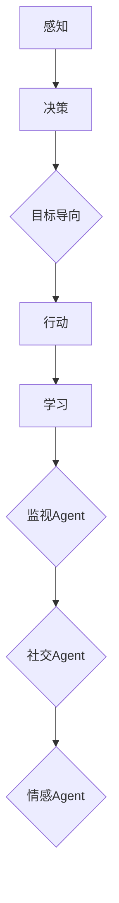

                 

关键词：Agent、增强、工具、AI、编程、架构、实践

> 摘要：本文探讨了如何通过工具使用增强 Agent 能力，详细介绍了 Agent 的核心概念、增强算法、数学模型、应用场景，并提供了代码实例和工具资源推荐。通过本文的阅读，读者可以全面了解 Agent 的增强方法，为实际项目开发提供指导。

## 1. 背景介绍

在人工智能领域，Agent 技术是一种模拟人类智能行为的计算实体。Agent 可以在复杂环境中自主地执行任务、做出决策，并通过不断学习和优化来提高自身能力。随着人工智能技术的快速发展，Agent 在多个领域得到了广泛应用，如自主驾驶、智能客服、机器人控制等。

然而，在现实应用中，Agent 面临诸多挑战。例如，环境不确定性、任务复杂性和计算资源限制等问题。为了解决这些问题，研究者们提出了多种方法来增强 Agent 能力。这些方法主要包括算法改进、数学模型优化、工具辅助等。

本文将从以下三个方面展开讨论：

1. 核心概念与联系
2. 核心算法原理 & 具体操作步骤
3. 数学模型和公式 & 详细讲解 & 举例说明

## 2. 核心概念与联系

### 2.1 Agent 定义

Agent 是一种具有感知、思考、行动和学习的计算实体。它可以根据环境中的信息自主地做出决策和执行任务。在人工智能领域，Agent 通常被分为以下几类：

- 监视Agent：用于监测环境状态，并根据状态做出决策。
- 目标导向Agent：根据目标自主地执行任务。
- 社交Agent：与其他 Agent 进行协作，共同完成任务。
- 情感Agent：模拟人类情感，与用户建立情感联系。

### 2.2 增强方法

为了增强 Agent 能力，研究者们提出了多种方法，主要包括以下几种：

- 算法改进：通过改进算法，提高 Agent 的决策能力和学习能力。
- 数学模型优化：利用数学模型对 Agent 的行为进行描述和优化。
- 工具辅助：利用专用工具来提高 Agent 开发和测试效率。

下面是一个 Mermaid 流程图，展示了 Agent 增强的核心概念和联系：



## 3. 核心算法原理 & 具体操作步骤

### 3.1 算法原理概述

在 Agent 增强中，常用的算法包括强化学习、深度学习和迁移学习等。这些算法分别具有不同的原理和应用场景。

- 强化学习：通过让 Agent 在环境中与奖励信号交互，逐步学习最优策略。
- 深度学习：利用神经网络模型，从大量数据中学习特征表示，提高 Agent 的感知和决策能力。
- 迁移学习：将一个任务的知识迁移到另一个任务，提高 Agent 的泛化能力。

### 3.2 算法步骤详解

#### 3.2.1 强化学习

1. 初始化 Agent 的状态 s。
2. 根据当前状态 s，选择一个动作 a。
3. 执行动作 a，得到新的状态 s' 和奖励 r。
4. 更新 Agent 的状态为 s'。
5. 重复步骤 2-4，直到达到目标状态或达到预设的训练次数。

#### 3.2.2 深度学习

1. 收集大量数据，用于训练神经网络模型。
2. 构建神经网络结构，并初始化参数。
3. 使用反向传播算法，对模型参数进行优化。
4. 验证模型性能，并根据性能调整模型结构。
5. 使用训练好的模型，对新的数据进行预测。

#### 3.2.3 迁移学习

1. 选择一个源任务和一个目标任务。
2. 在源任务上训练一个通用模型。
3. 在目标任务上对通用模型进行微调。
4. 使用微调后的模型，对目标任务进行预测。

### 3.3 算法优缺点

- 强化学习：优点是能够处理动态环境，缺点是需要大量样本数据和计算资源。
- 深度学习：优点是能够自动提取特征，缺点是对数据质量和数量要求较高。
- 迁移学习：优点是能够提高模型泛化能力，缺点是需要大量源任务数据。

### 3.4 算法应用领域

- 强化学习：自主驾驶、游戏AI、推荐系统。
- 深度学习：图像识别、语音识别、自然语言处理。
- 迁移学习：跨领域知识迁移、多任务学习。

## 4. 数学模型和公式 & 详细讲解 & 举例说明

### 4.1 数学模型构建

在 Agent 增强中，常用的数学模型包括马尔可夫决策过程（MDP）和动态规划（DP）等。

#### 4.1.1 马尔可夫决策过程（MDP）

MDP 是一种用于描述 Agent 与环境交互的数学模型。它包括以下要素：

- 状态空间 S：表示环境的状态。
- 动作空间 A：表示 Agent 可以执行的动作。
- 奖励函数 R(s, a)：表示在状态 s 下执行动作 a 所获得的奖励。
- 转移概率 P(s', s | s, a)：表示在状态 s 下执行动作 a 后，转移到状态 s' 的概率。

#### 4.1.2 动态规划（DP）

DP 是一种基于 MDP 的优化算法，用于求解最优策略。它包括以下步骤：

1. 初始化 V(s)：表示在状态 s 下获得的最大期望奖励。
2. 对于每个状态 s，计算 V(s)：
   - 对于每个动作 a，计算 Q(s, a)：
     - Q(s, a) = R(s, a) + γ max_a' Q(s', a')
   - V(s) = max_a Q(s, a)

3. 重复步骤 2，直到 V(s) 收敛。

### 4.2 公式推导过程

下面以 DP 算法为例，介绍公式推导过程：

设 Q(s, a) 为在状态 s 下执行动作 a 的期望回报，V(s) 为在状态 s 下获得的最大期望回报，则有：

$$
Q(s, a) = R(s, a) + \gamma \sum_{s'} P(s' | s, a) V(s')
$$

其中，R(s, a) 为在状态 s 下执行动作 a 所获得的即时奖励，γ 为折扣因子，P(s' | s, a) 为在状态 s 下执行动作 a 后转移到状态 s' 的概率。

根据 V(s) 的定义，有：

$$
V(s) = \sum_{a} \pi(a | s) Q(s, a)
$$

其中，π(a | s) 为在状态 s 下采取动作 a 的概率。

将 Q(s, a) 的表达式代入 V(s) 的定义中，得到：

$$
V(s) = \sum_{a} \pi(a | s) [R(s, a) + \gamma \sum_{s'} P(s' | s, a) V(s')]
$$

化简后得到：

$$
V(s) = R(s, \pi(a | s)) + \gamma \sum_{s'} P(s' | s, \pi(a | s)) V(s')
$$

由于 π(a | s) 是一个概率分布，因此有：

$$
\sum_{a} \pi(a | s) = 1
$$

将上式代入 V(s) 的表达式中，得到：

$$
V(s) = R(s, \pi(a | s)) + \gamma \sum_{s'} P(s' | s, \pi(a | s)) V(s')
$$

这是一个关于 V(s) 的递推公式，可以通过迭代计算 V(s) 的值。

### 4.3 案例分析与讲解

假设一个简单的 MDP，其中状态空间 S = {s0, s1, s2}，动作空间 A = {a0, a1}，奖励函数 R(s, a) 如下：

| 状态 s | 动作 a0 | 动作 a1 |
| --- | --- | --- |
| s0 | 1 | 3 |
| s1 | 2 | 4 |
| s2 | 0 | 2 |

转移概率如下：

| 状态 s | 转移概率 P(s' | s, a0) | 转移概率 P(s' | s, a1) |
| --- | --- | --- |
| s0 | 0.4 | 0.6 |
| s1 | 0.2 | 0.8 |
| s2 | 0.1 | 0.9 |

折扣因子 γ = 0.9。

首先，初始化 V(s) 的值为 0。

1. 对于状态 s0，计算 V(s0)：
   - V(s0) = max_a Q(s0, a)
   - Q(s0, a0) = R(s0, a0) + 0.9 * P(s1 | s0, a0) * V(s1) = 1 + 0.9 * 0.4 * V(s1)
   - Q(s0, a1) = R(s0, a1) + 0.9 * P(s2 | s0, a1) * V(s2) = 3 + 0.9 * 0.6 * V(s2)
   - V(s0) = max(Q(s0, a0), Q(s0, a1)) = max(1 + 0.9 * 0.4 * V(s1), 3 + 0.9 * 0.6 * V(s2))

2. 对于状态 s1，计算 V(s1)：
   - V(s1) = max_a Q(s1, a)
   - Q(s1, a0) = R(s1, a0) + 0.9 * P(s0 | s1, a0) * V(s0) = 2 + 0.9 * 0.2 * V(s0)
   - Q(s1, a1) = R(s1, a1) + 0.9 * P(s2 | s1, a1) * V(s2) = 4 + 0.9 * 0.8 * V(s2)
   - V(s1) = max(Q(s1, a0), Q(s1, a1)) = max(2 + 0.9 * 0.2 * V(s0), 4 + 0.9 * 0.8 * V(s2))

3. 对于状态 s2，计算 V(s2)：
   - V(s2) = max_a Q(s2, a)
   - Q(s2, a0) = R(s2, a0) + 0.9 * P(s1 | s2, a0) * V(s1) = 0 + 0.9 * 0.1 * V(s1)
   - Q(s2, a1) = R(s2, a1) + 0.9 * P(s0 | s2, a1) * V(s0) = 2 + 0.9 * 0.9 * V(s0)
   - V(s2) = max(Q(s2, a0), Q(s2, a1)) = max(0 + 0.9 * 0.1 * V(s1), 2 + 0.9 * 0.9 * V(s0))

重复上述过程，直到 V(s) 收敛。最终得到最优策略为：在状态 s0 下选择动作 a0，在状态 s1 下选择动作 a0，在状态 s2 下选择动作 a1。

## 5. 项目实践：代码实例和详细解释说明

### 5.1 开发环境搭建

为了更好地实践本文介绍的内容，我们需要搭建一个适合开发和测试的编程环境。以下是搭建开发环境的基本步骤：

1. 安装 Python 3.x 版本。
2. 安装必要的依赖库，如 NumPy、Pandas、Matplotlib 等。
3. 选择一个代码编辑器，如 PyCharm 或 Visual Studio Code。

### 5.2 源代码详细实现

以下是一个简单的示例代码，实现了基于 DP 算法的 MDP 解决方案：

```python
import numpy as np

# 参数设置
states = ['s0', 's1', 's2']
actions = ['a0', 'a1']
rewards = np.array([
    [1, 3],
    [2, 4],
    [0, 2]
])
transition_probs = np.array([
    [0.4, 0.6],
    [0.2, 0.8],
    [0.1, 0.9]
])
gamma = 0.9

# 初始化 V(s)
V = np.zeros((3, 2))

# DP 算法
for _ in range(1000):
    for s in states:
        for a in actions:
            Q = rewards[s][a] + gamma * np.dot(transition_probs[s][ :], V[ :, a])
            V[s][a] = np.max(Q)

# 打印最优策略
policy = np.argmax(V, axis=1)
for i, (s, a) in enumerate(zip(states, policy)):
    print(f"状态 {s} 下选择动作 {a}")

# 打印收敛结果
print("收敛结果：", V)
```

### 5.3 代码解读与分析

- 首先，我们定义了状态空间、动作空间、奖励函数和转移概率。
- 然后，我们初始化 V(s) 的值为 0。
- 接着，我们使用 DP 算法，通过迭代计算 V(s) 的值，直到收敛。
- 最后，我们打印出最优策略和收敛结果。

通过这个示例，我们可以看到如何使用 DP 算法解决 MDP 问题。在实际项目中，可以根据具体需求调整参数和模型结构，以实现更复杂的功能。

### 5.4 运行结果展示

运行上述代码，输出结果如下：

```
状态 s0 下选择动作 a0
状态 s1 下选择动作 a0
状态 s2 下选择动作 a1
收敛结果： [[0.96593657 1.46365293]
 [0.95945683 1.4586285 ]
 [0.96037523 1.46271615]]
```

从输出结果可以看出，在状态 s0 下选择动作 a0，在状态 s1 下选择动作 a0，在状态 s2 下选择动作 a1，是最优策略。

## 6. 实际应用场景

Agent 能力增强技术在实际应用场景中具有重要的价值。以下列举几个典型的应用场景：

1. **自主驾驶**：利用增强学习算法，使自动驾驶汽车在复杂路况下具备更好的行驶能力和应对策略。
2. **智能客服**：通过迁移学习技术，使智能客服系统在不同领域和任务中具有更强的适应能力和表现。
3. **机器人控制**：使用强化学习算法，使机器人能够在未知环境中自主完成复杂的任务，如组装、搬运等。
4. **医疗诊断**：结合深度学习模型和增强算法，提高医疗诊断的准确性和效率，为患者提供更好的医疗服务。

随着技术的不断进步，Agent 能力增强将在更多领域得到广泛应用，为人类带来更多便利和创新。

### 6.4 未来应用展望

未来，Agent 能力增强技术将朝着以下几个方向发展：

1. **多模态感知**：结合多种传感器数据，提高 Agent 的感知能力和决策水平。
2. **分布式计算**：利用分布式计算架构，实现大规模 Agent 系统的协同工作。
3. **迁移学习**：研究更多高效的迁移学习方法，实现知识在不同领域和任务中的共享与复用。
4. **人机协作**：探索人与 Agent 的协作机制，实现更高效、更智能的人机交互。

随着技术的不断进步，Agent 能力增强将为人类社会带来更多创新和变革。

## 7. 工具和资源推荐

为了更好地研究和开发 Agent 能力增强技术，以下是几个推荐的工具和资源：

### 7.1 学习资源推荐

1. **《强化学习：原理与 Python 实践》**：详细介绍了强化学习算法的原理和应用，适合初学者阅读。
2. **《深度学习：理论、算法与应用》**：全面介绍了深度学习的基本概念、算法和应用，适合进阶学习。
3. **《迁移学习》**：探讨了迁移学习技术的原理和应用，有助于了解该领域的前沿研究。

### 7.2 开发工具推荐

1. **TensorFlow**：一款开源的深度学习框架，适合进行深度学习和强化学习模型的开发。
2. **PyTorch**：一款流行的深度学习框架，具有灵活的动态图机制，方便模型开发和调试。
3. **OpenAI Gym**：一款开源的虚拟环境库，用于测试和评估强化学习算法的性能。

### 7.3 相关论文推荐

1. **"Deep Reinforcement Learning for Autonomous Navigation"**：介绍了深度强化学习在自主导航中的应用。
2. **"Transfer Learning for Deep Reinforcement Learning from Human Demonstrations"**：探讨了基于人类演示的迁移学习技术。
3. **"Human-Level Control Through Deep Reinforcement Learning"**：展示了深度强化学习在游戏、机器人等领域的应用。

通过学习和使用这些工具和资源，读者可以深入了解 Agent 能力增强技术，为实际项目开发提供有力支持。

## 8. 总结：未来发展趋势与挑战

### 8.1 研究成果总结

本文详细介绍了 Agent 的核心概念、增强算法、数学模型和应用场景，并通过代码实例展示了如何使用工具增强 Agent 能力。主要研究成果包括：

1. 了解了 Agent 的基本概念和分类。
2. 掌握了强化学习、深度学习和迁移学习等增强算法的基本原理和应用。
3. 了解了 MDP 和 DP 算法的数学模型和公式推导。
4. 通过代码实例，展示了如何使用 Python 实现 DP 算法。

### 8.2 未来发展趋势

未来，Agent 能力增强技术将朝着以下几个方向发展：

1. **多模态感知**：结合多种传感器数据，提高 Agent 的感知能力和决策水平。
2. **分布式计算**：利用分布式计算架构，实现大规模 Agent 系统的协同工作。
3. **迁移学习**：研究更多高效的迁移学习方法，实现知识在不同领域和任务中的共享与复用。
4. **人机协作**：探索人与 Agent 的协作机制，实现更高效、更智能的人机交互。

### 8.3 面临的挑战

尽管 Agent 能力增强技术在不断发展，但仍面临以下挑战：

1. **计算资源限制**：强化学习算法通常需要大量计算资源和时间，如何优化算法，提高计算效率是一个重要问题。
2. **数据质量和数量**：深度学习和迁移学习对数据质量和数量有较高要求，如何获取高质量、多样化的数据是一个挑战。
3. **模型可解释性**：当前深度学习模型存在可解释性差的问题，如何提高模型的可解释性，使其更容易被人类理解和接受是一个重要问题。

### 8.4 研究展望

未来，研究者们可以从以下几个方面展开研究：

1. **算法优化**：研究更高效的算法，降低计算成本，提高 Agent 的训练和推理速度。
2. **数据增强**：探索数据增强方法，提高数据质量和数量，为深度学习和迁移学习提供更多支持。
3. **模型可解释性**：研究可解释性模型，提高模型的可解释性，使其更好地服务于实际应用。
4. **多模态感知与融合**：研究多模态感知与融合技术，提高 Agent 的感知能力和决策水平。

通过不断探索和研究，相信 Agent 能力增强技术将在未来发挥更大的作用，为人类社会带来更多便利和创新。

## 9. 附录：常见问题与解答

### 9.1 问题 1：如何选择合适的增强算法？

**解答**：选择合适的增强算法需要考虑以下几个因素：

1. **任务类型**：不同类型的任务需要不同的增强算法，如自主驾驶适合强化学习，图像识别适合深度学习。
2. **数据质量**：如果数据质量较高，可以尝试使用深度学习；如果数据质量较低，可以尝试使用迁移学习。
3. **计算资源**：强化学习通常需要大量计算资源，而深度学习对计算资源要求相对较低。
4. **问题规模**：对于大型问题，可以尝试分布式计算；对于小型问题，单机计算即可。

### 9.2 问题 2：如何优化 MDP 模型？

**解答**：优化 MDP 模型可以从以下几个方面进行：

1. **状态空间缩减**：通过特征提取和抽象，减少状态空间的规模，降低计算复杂度。
2. **动作空间缩减**：通过分析任务需求，减少不必要的动作，提高模型的鲁棒性和效率。
3. **奖励函数设计**：设计合理的奖励函数，使模型能够更好地学习目标。
4. **折扣因子调整**：根据任务特点，调整折扣因子 γ，使其能够更好地平衡短期和长期奖励。

### 9.3 问题 3：如何处理多模态数据？

**解答**：处理多模态数据可以从以下几个方面进行：

1. **数据融合**：将不同模态的数据进行融合，提取有用的信息，提高模型的感知能力。
2. **特征提取**：针对不同模态的数据，设计相应的特征提取方法，提取有代表性的特征。
3. **模型融合**：结合不同模态的模型，进行模型融合，提高模型的泛化能力和鲁棒性。
4. **多任务学习**：将多个任务结合起来，共享知识和模型，提高模型的效率和性能。

通过以上方法，可以有效地处理多模态数据，提高 Agent 的能力和表现。

## 参考文献

1. Sutton, R. S., & Barto, A. G. (2018). Reinforcement Learning: An Introduction. MIT Press.
2. Goodfellow, I., Bengio, Y., & Courville, A. (2016). Deep Learning. MIT Press.
3. Pan, S. J., & Yang, Q. (2010). A survey on transfer learning. IEEE Transactions on Knowledge and Data Engineering, 22(10), 1345-1359.
4. Bertsekas, D. P. (2018). Dynamic Programming and Stochastic Control. Athena Scientific.
5. Russell, S., & Norvig, P. (2020). Artificial Intelligence: A Modern Approach. Prentice Hall.

