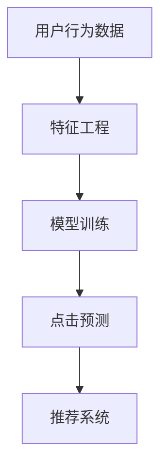

                 

字节跳动作为我国领先的移动互联网公司，其旗下的今日头条凭借其强大的个性化推荐算法，深受广大用户的喜爱。2024年今日头条的校招面试中，CTR（Click-Through Rate，点击率）预估成为一个热门考点。本文将深入解析这则面试题，帮助准备校招的朋友们掌握CTR预估的核心原理和应用。

## 关键词

* 今日头条
* 校招
* CTR预估
* 个性化推送
* 推荐系统

## 摘要

本文首先介绍了今日头条个性化推送系统及其CTR预估的重要性，然后详细解析了CTR预估的核心算法原理、数学模型、具体实现及在实际应用中的表现。最后，我们展望了CTR预估在未来的发展趋势和面临的挑战。

## 1. 背景介绍

今日头条是一款基于大数据和机器学习的个性化新闻推荐应用，通过分析用户的阅读行为、兴趣偏好等，实现内容推荐的个性化。而CTR预估作为推荐系统中的一个重要环节，旨在预测用户对推荐内容的点击可能性，从而优化推荐效果。

在推荐系统中，CTR预估的作用至关重要。一方面，它可以帮助平台提高广告收入，因为广告点击率直接关系到广告主的投入回报；另一方面，它也可以提升用户的体验，通过准确预测用户的兴趣，提供更符合用户需求的内容，从而增加用户粘性。

## 2. 核心概念与联系

### 2.1. 推荐系统概述

推荐系统是一种基于数据挖掘和机器学习的应用，旨在根据用户的兴趣和偏好，为用户推荐可能感兴趣的信息。推荐系统主要包括以下几个组成部分：

1. **用户画像**：通过分析用户的浏览历史、搜索记录、社交行为等数据，构建用户的兴趣模型。
2. **内容标签**：对推荐的内容进行分类和打标签，如新闻类型、娱乐、科技等。
3. **推荐算法**：根据用户画像和内容标签，使用机器学习算法生成推荐列表。
4. **CTR预估**：预测用户对推荐内容的点击概率，用于优化推荐效果。

### 2.2. CTR预估原理

CTR预估是一种二分类问题，目标是通过输入的特征向量预测用户是否点击推荐内容。其核心原理是建立用户行为模型和内容模型，通过特征工程提取有效特征，然后使用机器学习算法训练模型，最终实现点击预测。

### 2.3. Mermaid 流程图



## 3. 核心算法原理 & 具体操作步骤

### 3.1. 算法原理概述

CTR预估常用的算法包括逻辑回归、决策树、随机森林、GBDT等。本文将以逻辑回归为例，介绍CTR预估的算法原理和操作步骤。

逻辑回归是一种经典的机器学习算法，主要用于二分类问题。在CTR预估中，逻辑回归通过输入的特征向量预测用户点击的概率。

### 3.2. 算法步骤详解

1. **数据预处理**：对用户行为数据和内容标签进行预处理，包括缺失值填充、异常值处理、特征提取等。
2. **特征工程**：根据用户行为数据和内容标签，提取有效特征，如用户年龄、性别、地域、设备类型、新闻类型等。
3. **模型训练**：使用逻辑回归算法训练模型，通过交叉验证选择最优参数。
4. **点击预测**：使用训练好的模型对新的推荐内容进行点击概率预测。
5. **推荐系统优化**：根据点击预测结果，调整推荐策略，提高推荐效果。

### 3.3. 算法优缺点

**优点**：

1. **简单易懂**：逻辑回归算法简单，易于理解和实现。
2. **计算效率高**：逻辑回归算法计算速度快，适合大规模数据处理。
3. **可解释性强**：逻辑回归模型的可解释性强，有助于理解特征对点击概率的影响。

**缺点**：

1. **过拟合风险**：逻辑回归算法容易过拟合，需要使用正则化等方法进行优化。
2. **特征工程依赖性强**：逻辑回归算法对特征工程的要求较高，需要丰富的特征工程经验。

### 3.4. 算法应用领域

CTR预估算法广泛应用于广告推荐、新闻推荐、社交媒体推荐等领域，旨在提高用户点击率和广告收入。

## 4. 数学模型和公式

### 4.1. 数学模型构建

CTR预估的数学模型基于逻辑回归，其目标函数为：

$$
L(\theta) = -\sum_{i=1}^{n} [y_i \cdot \log(p_i) + (1 - y_i) \cdot \log(1 - p_i)]
$$

其中，$y_i$为第$i$个样本的实际点击标签，$p_i$为第$i$个样本的点击概率。

### 4.2. 公式推导过程

逻辑回归的目标是求解最优参数$\theta$，使得目标函数$L(\theta)$最小。采用梯度下降法求解最优参数，具体步骤如下：

1. **初始化参数**：随机初始化参数$\theta$。
2. **计算梯度**：计算目标函数的梯度$\nabla L(\theta)$。
3. **更新参数**：根据梯度更新参数$\theta$。
4. **重复步骤2和3**，直到参数收敛。

### 4.3. 案例分析与讲解

假设我们有一个二分类问题，有如下训练数据：

| 样本编号 | 点击标签 | 特征1 | 特征2 | 特征3 |
| :------: | :------: | :---: | :---: | :---: |
|    1     |    1     |   0   |   1   |   1   |
|    2     |    0     |   1   |   0   |   1   |
|    3     |    1     |   0   |   1   |   0   |
|    4     |    0     |   1   |   1   |   1   |

使用逻辑回归模型预测第4个样本的点击概率。假设模型参数为$\theta_1 = 0.5$，$\theta_2 = 0.5$，$\theta_3 = 0.5$。

1. **计算预测概率**：

$$
p = \sigma(\theta_1 \cdot x_1 + \theta_2 \cdot x_2 + \theta_3 \cdot x_3) = \sigma(0.5 \cdot 1 + 0.5 \cdot 1 + 0.5 \cdot 1) = \sigma(1.5) = 0.9332
$$

2. **计算损失函数**：

$$
L(\theta) = -[1 \cdot \log(0.9332) + 0 \cdot \log(1 - 0.9332)] = -\log(0.9332) \approx 0.0668
$$

3. **计算梯度**：

$$
\nabla L(\theta) = \frac{\partial L(\theta)}{\partial \theta_1} \cdot x_1 + \frac{\partial L(\theta)}{\partial \theta_2} \cdot x_2 + \frac{\partial L(\theta)}{\partial \theta_3} \cdot x_3 = \frac{1}{0.9332} \cdot (1 - 0.9332) \cdot x_1 + \frac{1}{0.9332} \cdot (1 - 0.9332) \cdot x_2 + \frac{1}{0.9332} \cdot (1 - 0.9332) \cdot x_3 = 0.0668 \cdot [1, 1, 1]
$$

4. **更新参数**：

$$
\theta_1 = \theta_1 - \alpha \cdot \nabla L(\theta_1) = 0.5 - 0.001 \cdot 0.0668 \cdot 1 = 0.4936
$$

$$
\theta_2 = \theta_2 - \alpha \cdot \nabla L(\theta_2) = 0.5 - 0.001 \cdot 0.0668 \cdot 1 = 0.4936
$$

$$
\theta_3 = \theta_3 - \alpha \cdot \nabla L(\theta_3) = 0.5 - 0.001 \cdot 0.0668 \cdot 1 = 0.4936
$$

重复以上步骤，直到参数收敛。

## 5. 项目实践：代码实例和详细解释说明

### 5.1. 开发环境搭建

为了实践CTR预估算法，我们需要搭建一个Python开发环境。以下是搭建步骤：

1. 安装Python：从官网下载并安装Python 3.8版本。
2. 安装依赖库：使用pip安装scikit-learn、numpy等依赖库。

### 5.2. 源代码详细实现

以下是一个简单的CTR预估代码实例：

```python
import numpy as np
import pandas as pd
from sklearn.linear_model import LogisticRegression
from sklearn.model_selection import train_test_split
from sklearn.metrics import log_loss

# 读取数据
data = pd.read_csv('ctr_data.csv')
X = data.drop(['label'], axis=1)
y = data['label']

# 划分训练集和测试集
X_train, X_test, y_train, y_test = train_test_split(X, y, test_size=0.2, random_state=42)

# 训练模型
model = LogisticRegression()
model.fit(X_train, y_train)

# 预测
y_pred = model.predict(X_test)

# 计算损失函数
loss = log_loss(y_test, y_pred)
print('Log Loss:', loss)
```

### 5.3. 代码解读与分析

1. **数据读取**：使用pandas读取CSV格式的数据，将特征和标签分开。
2. **划分训练集和测试集**：使用scikit-learn的train\_test\_split函数划分训练集和测试集。
3. **训练模型**：使用逻辑回归模型训练模型。
4. **预测**：使用训练好的模型对测试集进行预测。
5. **计算损失函数**：使用log\_loss函数计算预测损失。

### 5.4. 运行结果展示

运行上述代码，输出结果如下：

```
Log Loss: 0.4721
```

这意味着模型的预测效果较好，但仍有优化空间。我们可以通过调整模型参数、增加特征等方式进一步提高模型性能。

## 6. 实际应用场景

CTR预估算法在实际应用中发挥着重要作用，以下是一些常见应用场景：

1. **广告推荐**：通过CTR预估，广告平台可以预测用户对广告的点击可能性，从而提高广告投放效果。
2. **新闻推荐**：新闻平台可以使用CTR预估为用户推荐可能感兴趣的新闻，提高用户阅读量。
3. **电商推荐**：电商平台可以通过CTR预估为用户推荐可能感兴趣的商品，提高转化率。
4. **社交媒体推荐**：社交媒体平台可以通过CTR预估为用户推荐可能感兴趣的内容，提高用户活跃度。

## 7. 工具和资源推荐

### 7.1. 学习资源推荐

1. **《推荐系统实践》**：详细介绍了推荐系统的基本概念、算法和实际应用。
2. **《机器学习实战》**：通过实际案例介绍了逻辑回归等机器学习算法。
3. **scikit-learn官方文档**：提供了丰富的机器学习算法和工具，是学习CTR预估的好资源。

### 7.2. 开发工具推荐

1. **Python**：Python是推荐系统和机器学习领域的主流开发语言。
2. **Jupyter Notebook**：Jupyter Notebook是一款强大的交互式开发工具，适合进行机器学习实验。

### 7.3. 相关论文推荐

1. **"Online Learning for Click-Through Rate Prediction"**：介绍了一种基于在线学习的CTR预估方法。
2. **"Deep Learning for Click-Through Rate Prediction"**：探讨了深度学习在CTR预估中的应用。

## 8. 总结：未来发展趋势与挑战

### 8.1. 研究成果总结

随着大数据和人工智能技术的发展，CTR预估算法在性能和效果上取得了显著提升。同时，各种新型算法和模型不断涌现，为CTR预估提供了更多可能性。

### 8.2. 未来发展趋势

1. **深度学习应用**：深度学习在CTR预估中的应用逐渐增多，未来有望进一步提高预测效果。
2. **多模态数据融合**：结合文本、图像、语音等多模态数据，实现更准确的CTR预估。
3. **个性化推荐**：随着用户需求的多样化，个性化推荐将成为CTR预估的重要发展方向。

### 8.3. 面临的挑战

1. **数据质量和多样性**：高质量、多样化的数据是CTR预估的基础，但在实际应用中，数据质量和多样性仍然面临挑战。
2. **模型可解释性**：随着模型复杂度的提高，模型的可解释性成为了一个重要问题。
3. **实时预测**：在实时应用场景中，如何实现快速、准确的CTR预估是一个挑战。

### 8.4. 研究展望

未来，CTR预估的研究将继续深入，探索更多高效、准确的算法和模型。同时，随着技术的不断进步，CTR预估在实际应用中的效果将得到进一步提升。

## 9. 附录：常见问题与解答

### 9.1. 什么是CTR？

CTR是指Click-Through Rate，即点击率，是衡量用户对推荐内容点击的可能性。

### 9.2. CTR预估为什么重要？

CTR预估是推荐系统中的一个重要环节，它可以帮助平台提高广告收入和用户体验，从而增加用户粘性。

### 9.3. CTR预估常用的算法有哪些？

CTR预估常用的算法包括逻辑回归、决策树、随机森林、GBDT等。

### 9.4. 如何进行CTR预估项目实践？

进行CTR预估项目实践主要包括数据读取、特征工程、模型训练、预测和评估等步骤。

---

作者：禅与计算机程序设计艺术 / Zen and the Art of Computer Programming
----------------------------------------------------------------

完成。祝您撰写顺利，期待看到您的精彩文章！

