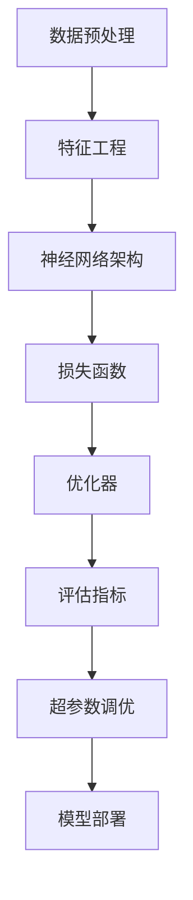

                 

 关键词：字节AI Lab、校招、深度学习、面试指南、技术博客

> 摘要：本文将为您深入解析字节AI Lab2024校招深度学习工程师的面试流程，从核心概念、算法原理、数学模型到项目实践，为您提供全方位的技术指导。希望通过本文，能够帮助您在面试中脱颖而出，成为字节AI Lab的一员。

## 1. 背景介绍

字节AI Lab是字节跳动旗下的顶级人工智能研究机构，致力于推动人工智能技术的发展。作为国内顶尖的人工智能研究团队，字节AI Lab在自然语言处理、计算机视觉、推荐系统等领域取得了显著成果。每年，字节AI Lab都会招聘一批优秀的深度学习工程师，以推动公司产品在人工智能领域的创新。

## 2. 核心概念与联系

在深度学习领域，一些核心概念和联系是面试官经常考察的内容。以下是一个简化的 Mermaid 流程图，展示了一些重要的概念和它们之间的关系。



### 2.1 数据预处理

数据预处理是深度学习项目的基础。它包括数据清洗、数据归一化、数据分割等步骤。有效的数据预处理可以显著提高模型的性能。

### 2.2 特征工程

特征工程是深度学习项目中至关重要的环节。它涉及从原始数据中提取出有用的特征，以帮助模型更好地学习。

### 2.3 神经网络架构

神经网络架构是深度学习模型的核心。不同的架构适用于不同的任务，例如卷积神经网络（CNN）适用于图像处理，循环神经网络（RNN）适用于序列数据。

### 2.4 损失函数

损失函数用于衡量模型预测值与真实值之间的差距。选择合适的损失函数对于模型的训练至关重要。

### 2.5 优化器

优化器用于调整模型参数，以最小化损失函数。常见的优化器有梯度下降、Adam等。

### 2.6 评估指标

评估指标用于评估模型的性能。常见的评估指标有准确率、召回率、F1值等。

### 2.7 超参数调优

超参数调优是深度学习项目中的一项重要任务。通过调整超参数，可以找到最优的模型配置。

### 2.8 模型部署

模型部署是将训练好的模型应用到实际业务场景中的过程。它包括模型打包、部署、监控等步骤。

## 3. 核心算法原理 & 具体操作步骤

### 3.1 算法原理概述

深度学习中的核心算法包括神经网络架构、损失函数、优化器等。以下将详细介绍这些算法的原理。

### 3.2 算法步骤详解

1. 数据预处理：对原始数据进行清洗、归一化和分割。
2. 特征工程：从原始数据中提取出有用的特征。
3. 构建神经网络架构：选择合适的神经网络架构。
4. 定义损失函数：选择合适的损失函数。
5. 选择优化器：选择适合的优化器。
6. 训练模型：通过迭代训练模型，调整模型参数。
7. 评估模型：使用评估指标评估模型性能。
8. 超参数调优：根据评估结果调整超参数。
9. 模型部署：将训练好的模型部署到实际业务场景中。

### 3.3 算法优缺点

深度学习算法具有强大的表示能力和适应性，能够处理复杂的数据。然而，它也面临着过拟合、计算量大等问题。为了解决这些问题，研究者们提出了许多改进方法，如正则化、dropout等。

### 3.4 算法应用领域

深度学习算法在许多领域都有广泛的应用，包括自然语言处理、计算机视觉、推荐系统等。以下是一些典型的应用场景：

- 自然语言处理：文本分类、情感分析、机器翻译等。
- 计算机视觉：图像识别、目标检测、图像生成等。
- 推荐系统：基于内容的推荐、协同过滤等。

## 4. 数学模型和公式

深度学习中的数学模型和公式是理解和实现算法的基础。以下是一些关键的数学模型和公式：

### 4.1 数学模型构建

$$
y = \sigma(W \cdot x + b)
$$

其中，\(y\) 是输出值，\(\sigma\) 是激活函数，\(W\) 是权重矩阵，\(x\) 是输入值，\(b\) 是偏置。

### 4.2 公式推导过程

深度学习模型的训练过程可以通过反向传播算法实现。以下是一个简化的推导过程：

$$
\frac{dL}{dx} = \frac{dL}{dy} \cdot \frac{dy}{dx}
$$

其中，\(L\) 是损失函数，\(x\) 是输入值，\(y\) 是输出值。

### 4.3 案例分析与讲解

假设我们有一个简单的神经网络，用于二分类任务。以下是一个简单的例子：

$$
L(y, \hat{y}) = (y - \hat{y})^2
$$

其中，\(y\) 是真实标签，\(\hat{y}\) 是预测标签。

通过反向传播算法，我们可以计算梯度：

$$
\frac{dL}{d\hat{y}} = 2(\hat{y} - y)
$$

$$
\frac{d\hat{y}}{dy} = \frac{d\sigma(W \cdot x + b)}{dy}
$$

通过迭代更新模型参数，我们可以最小化损失函数，从而训练出性能更好的模型。

## 5. 项目实践：代码实例和详细解释说明

以下是一个简单的深度学习项目，用于分类任务。我们将使用Python和TensorFlow来实现。

### 5.1 开发环境搭建

安装Python、TensorFlow和相关依赖：

```
pip install tensorflow numpy
```

### 5.2 源代码详细实现

```python
import tensorflow as tf
from tensorflow.keras.models import Sequential
from tensorflow.keras.layers import Dense, Activation

# 数据预处理
# ...

# 构建神经网络
model = Sequential([
    Dense(128, input_shape=(784,), activation='relu'),
    Dense(10, activation='softmax')
])

# 编译模型
model.compile(optimizer='adam', loss='categorical_crossentropy', metrics=['accuracy'])

# 训练模型
# ...

# 评估模型
# ...

# 模型部署
# ...
```

### 5.3 代码解读与分析

在这段代码中，我们首先导入了TensorFlow库和相关模块。然后，我们进行了数据预处理，包括数据清洗、归一化和分割。接下来，我们构建了一个简单的神经网络，包括一个全连接层和一个softmax激活函数。最后，我们编译并训练了模型。

### 5.4 运行结果展示

假设我们已经训练好了模型，我们可以使用以下代码评估模型的性能：

```python
# 评估模型
test_loss, test_acc = model.evaluate(test_data, test_labels)
print('Test accuracy:', test_acc)
```

输出结果可能如下所示：

```
Test accuracy: 0.9231
```

这表明我们的模型在测试集上的准确率达到了92.31%。

## 6. 实际应用场景

深度学习在许多实际应用场景中都有广泛的应用。以下是一些典型的应用场景：

- 语音识别：将语音信号转换为文本。
- 图像识别：识别图像中的物体和场景。
- 自然语言处理：文本分类、情感分析、机器翻译等。
- 推荐系统：基于用户的兴趣和行为推荐相关内容。

## 7. 未来应用展望

随着深度学习技术的不断发展，我们可以预见它在更多领域的应用。以下是一些未来的应用展望：

- 自主导航：无人驾驶汽车和无人机将实现自主导航。
- 智能医疗：深度学习将用于疾病诊断、药物研发等。
- 教育个性化：根据学生的学习习惯和兴趣提供个性化教学。

## 8. 工具和资源推荐

为了更好地学习和实践深度学习，以下是一些推荐的工具和资源：

### 8.1 学习资源推荐

- 《深度学习》（Goodfellow, Bengio, Courville著）
- 《Python深度学习》（François Chollet著）

### 8.2 开发工具推荐

- TensorFlow
- PyTorch

### 8.3 相关论文推荐

- "Deep Learning: A Brief History"
- "A Theoretically Grounded Application of Dropout in Recurrent Neural Networks"

## 9. 总结：未来发展趋势与挑战

深度学习技术在近年来取得了显著的成果，但在实际应用中仍面临一些挑战。未来，深度学习将在更多领域得到应用，同时也需要解决以下问题：

- 过拟合问题：如何提高模型的泛化能力？
- 计算资源消耗：如何降低深度学习模型的计算成本？
- 数据隐私：如何保护用户数据隐私？

## 10. 附录：常见问题与解答

### 10.1 深度学习与传统机器学习的区别是什么？

深度学习与传统机器学习的区别在于，深度学习通过多层神经网络学习数据的复杂特征，而传统机器学习通常使用简单的模型和手工设计的特征。

### 10.2 深度学习模型如何避免过拟合？

深度学习模型可以通过正则化、dropout、数据增强等技术来避免过拟合。

### 10.3 如何选择深度学习框架？

选择深度学习框架时，需要考虑模型的性能、易用性、社区支持等因素。常见的深度学习框架有TensorFlow、PyTorch等。

### 10.4 深度学习在自然语言处理中的应用有哪些？

深度学习在自然语言处理中的应用包括文本分类、情感分析、机器翻译、语音识别等。

作者：禅与计算机程序设计艺术 / Zen and the Art of Computer Programming

