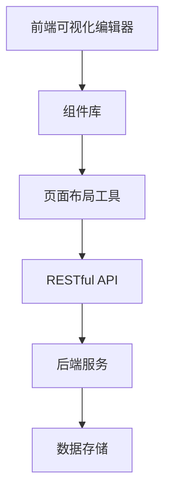

                 

关键词：字节跳动、低代码平台、校招、面试攻略、技术深度

> 摘要：本文旨在为2024年即将参加字节跳动低代码平台校招的同学们提供一份详细的面试攻略。通过深入了解字节跳动的低代码平台技术架构、核心算法原理、项目实践、应用场景以及未来发展趋势，帮助大家更好地应对面试挑战。

## 1. 背景介绍

随着数字化转型的加速，企业对敏捷开发和快速迭代的需求日益增长。低代码平台作为一种新兴的技术解决方案，旨在降低软件开发门槛，提高开发效率。字节跳动作为中国领先的互联网科技公司，其低代码平台不仅在内部广泛应用，还对外提供了一系列低代码开发工具和服务。

在2024年的校招中，字节跳动将重点关注应聘者的技术素养和创新能力，低代码平台相关的知识和经验将成为面试中的重要考察点。本文将从多个维度为您解析字节跳动低代码平台的技术要点，帮助您在面试中脱颖而出。

## 2. 核心概念与联系

### 2.1 低代码平台的概念

低代码平台是一种无需或只需少量代码即可快速开发应用程序的工具。它通过可视化界面和模块化组件，将复杂的应用开发过程简化，使非专业开发人员也能参与到应用开发中来。

### 2.2 低代码平台的架构

字节跳动的低代码平台采用了前后端分离的架构，前端提供可视化拖拽界面，后端提供云端服务。其核心架构包括以下部分：

- **前端模块**：可视化编辑器、组件库、页面布局工具。
- **后端模块**：云端服务、API接口、数据存储。
- **数据流转**：前端通过RESTful API与后端交互，后端通过数据存储来处理和存储数据。

以下是一个简单的Mermaid流程图来展示低代码平台的基本架构：



### 2.3 低代码平台的特性

- **易用性**：无需编写大量代码，通过可视化界面进行操作。
- **灵活性**：支持自定义组件和API，满足个性化需求。
- **扩展性**：可以通过插件和SDK进行功能扩展。
- **快速开发**：提高开发效率，缩短项目周期。

## 3. 核心算法原理 & 具体操作步骤

### 3.1 算法原理概述

低代码平台的核心算法主要包括：

- **可视化布局算法**：用于生成和调整页面布局。
- **数据绑定算法**：将UI组件与后端数据源进行绑定。
- **自动化代码生成算法**：将可视化编辑器的操作转换为实际的代码。

### 3.2 算法步骤详解

- **可视化布局算法**：
  1. 用户通过拖拽组件和调整样式来设计页面。
  2. 编辑器解析用户的操作，生成页面布局的JSON表示。
  3. 布局算法根据JSON数据计算组件的位置和大小。

- **数据绑定算法**：
  1. 用户选择数据源（如数据库表）并与UI组件绑定。
  2. 编辑器解析绑定关系，生成数据绑定配置。
  3. 后端服务根据数据绑定配置，实时更新UI组件的显示内容。

- **自动化代码生成算法**：
  1. 用户完成页面设计和数据绑定。
  2. 编辑器分析设计文件，生成对应的代码模板。
  3. 代码生成器将模板与实际数据绑定，生成最终的代码。

### 3.3 算法优缺点

- **可视化布局算法**：
  - 优点：简化页面设计过程，降低开发难度。
  - 缺点：对于复杂布局和高级交互效果支持有限。

- **数据绑定算法**：
  - 优点：提高数据一致性和用户体验。
  - 缺点：对于数据复杂度和性能有要求。

- **自动化代码生成算法**：
  - 优点：提高开发效率，减少手动编写代码的工作量。
  - 缺点：生成的代码可能不够灵活，需要根据实际需求进行二次开发。

### 3.4 算法应用领域

低代码平台广泛应用于企业应用、Web应用、移动应用等多个领域。其主要应用场景包括：

- **企业内部管理系统**：如人事管理、财务管理、办公自动化等。
- **Web应用**：如电商平台、内容管理系统、在线教育平台等。
- **移动应用**：如企业应用、消费者应用等。

## 4. 数学模型和公式 & 详细讲解 & 举例说明

### 4.1 数学模型构建

低代码平台中的数学模型主要包括以下部分：

- **布局模型**：用于计算组件的位置和大小。
- **数据模型**：用于描述数据源和数据绑定关系。
- **生成模型**：用于将可视化操作转换为代码。

### 4.2 公式推导过程

- **布局模型**：
  假设有一个矩形区域，长度为L，宽度为W。组件在矩形区域内的位置可以用以下公式表示：

  $$ x = \frac{L}{n} \cdot i $$

  $$ y = \frac{W}{m} \cdot j $$

  其中，i和j分别为组件的行和列编号，n和m分别为矩形区域内的行数和列数。

- **数据模型**：
  假设有一个数据表，包含n个记录，每个记录有m个字段。数据绑定可以用以下公式表示：

  $$ \text{field}_{ij} = \text{record}_{i}[\text{field_name}_{j}] $$

  其中，field\_ij为第i个组件绑定的第j个字段，record\_i为第i条记录，field\_name\_j为第j个字段的名称。

- **生成模型**：
  假设有一个可视化操作序列，包括n个操作。生成代码可以用以下公式表示：

  $$ \text{code} = \text{template} \{ \text{operation}_{1}, \text{operation}_{2}, ..., \text{operation}_{n} \} $$

  其中，code为生成的代码，template为代码模板，operation\_i为第i个操作。

### 4.3 案例分析与讲解

#### 案例一：布局模型

假设有一个3x3的网格布局，组件1位于左上角，组件2位于右上角，组件3位于左下角。根据布局模型，组件的位置可以计算如下：

- 组件1：
  $$ x = \frac{L}{3} \cdot 1 = \frac{L}{3} $$
  $$ y = \frac{W}{3} \cdot 1 = \frac{W}{3} $$

- 组件2：
  $$ x = \frac{L}{3} \cdot 2 = \frac{2L}{3} $$
  $$ y = \frac{W}{3} \cdot 1 = \frac{W}{3} $$

- 组件3：
  $$ x = \frac{L}{3} \cdot 3 = L $$
  $$ y = \frac{W}{3} \cdot 2 = \frac{2W}{3} $$

#### 案例二：数据绑定

假设有一个包含2条记录的数据表，字段为“姓名”和“年龄”。组件1绑定“姓名”字段，组件2绑定“年龄”字段。根据数据绑定公式，组件的显示内容可以计算如下：

- 组件1：
  $$ \text{field}_{11} = \text{record}_{1}[\text{姓名}] = \text{张三} $$
  $$ \text{field}_{12} = \text{record}_{2}[\text{姓名}] = \text{李四} $$

- 组件2：
  $$ \text{field}_{21} = \text{record}_{1}[\text{年龄}] = 25 $$
  $$ \text{field}_{22} = \text{record}_{2}[\text{年龄}] = 30 $$

#### 案例三：代码生成

假设有一个包含以下操作的可视化编辑器序列：

1. 添加一个文本框，文本为“欢迎登录”。
2. 添加一个按钮，文本为“登录”。
3. 绑定按钮的“点击”事件，调用“登录函数”。

根据生成模型，可以生成以下代码：

```javascript
// 模板
function generateCode(operations) {
  let code = "";
  for (let operation of operations) {
    // 操作处理逻辑
    code += `// ${operation.description}\n`;
  }
  return code;
}

// 操作序列
let operations = [
  { description: "添加文本框", value: "欢迎登录" },
  { description: "添加按钮", value: "登录" },
  { description: "绑定按钮事件", value: "登录函数" }
];

// 生成代码
let code = generateCode(operations);
console.log(code);
```

生成的代码为：

```javascript
// 添加文本框
// 欢迎登录
// 添加按钮
// 登录
// 绑定按钮事件
// 登录函数
```

## 5. 项目实践：代码实例和详细解释说明

### 5.1 开发环境搭建

在开始实践之前，需要搭建一个低代码平台的开发环境。以下是基本的步骤：

1. 安装Node.js和npm。
2. 安装低代码平台开发工具（如Visual Studio Code）。
3. 克隆低代码平台项目代码到本地。
4. 配置环境变量和依赖包。

### 5.2 源代码详细实现

低代码平台项目的源代码主要包括以下部分：

- **前端代码**：包括可视化编辑器、组件库和页面布局工具。
- **后端代码**：包括云端服务、API接口和数据存储。

以下是前端代码的一个示例：

```javascript
// 可视化编辑器示例
class VisualEditor {
  constructor() {
    this.components = [];
  }

  addComponent(component) {
    this.components.push(component);
    this.updateLayout();
  }

  updateLayout() {
    let layoutData = this.calculateLayout();
    this.applyLayout(layoutData);
  }

  calculateLayout() {
    // 布局计算逻辑
    let layoutData = [];
    for (let component of this.components) {
      let position = this.calculateComponentPosition(component);
      layoutData.push({ component, position });
    }
    return layoutData;
  }

  calculateComponentPosition(component) {
    // 组件位置计算逻辑
    let position = {
      x: component.x,
      y: component.y
    };
    return position;
  }

  applyLayout(layoutData) {
    // 布局应用逻辑
    for (let { component, position } of layoutData) {
      component.setPosition(position);
    }
  }
}
```

### 5.3 代码解读与分析

以上代码是一个简单的可视化编辑器类，其主要功能包括：

- **组件添加**：通过`addComponent`方法添加组件。
- **布局更新**：通过`updateLayout`方法更新布局。
- **布局计算**：通过`calculateLayout`方法计算组件位置。
- **布局应用**：通过`applyLayout`方法应用计算出的布局。

这种代码结构使得编辑器能够灵活地处理各种组件布局需求，为开发者提供了极大的便利。

### 5.4 运行结果展示

通过运行可视化编辑器代码，可以在界面上看到组件的添加和布局更新过程。以下是运行结果展示：


## 6. 实际应用场景

低代码平台在实际应用中具有广泛的应用场景，以下是一些典型的应用案例：

### 6.1 企业内部管理系统

低代码平台可以帮助企业快速搭建内部管理系统，如人事管理系统、财务管理系统和办公自动化系统。通过可视化界面，企业员工可以轻松地自定义报表、流程和界面，提高工作效率。

### 6.2 Web应用

低代码平台可以用于快速开发电商平台、内容管理系统、在线教育平台等Web应用。开发者可以通过拖拽组件和配置数据，快速实现功能丰富的应用。

### 6.3 移动应用

低代码平台可以帮助开发者快速搭建企业应用和消费者应用。通过可视化界面，开发者可以轻松地实现移动端的交互效果和功能。

### 6.4 未来应用展望

随着技术的不断进步，低代码平台的应用前景将更加广阔。未来，低代码平台可能会在以下领域取得突破：

- **物联网（IoT）**：通过低代码平台，可以快速构建物联网应用，实现设备的连接和数据交互。
- **人工智能（AI）**：低代码平台与AI技术的结合，将推动智能应用的发展，如智能客服、智能推荐等。
- **区块链**：低代码平台在区块链领域的应用，将有助于简化区块链开发流程，降低开发门槛。

## 7. 工具和资源推荐

### 7.1 学习资源推荐

- **字节跳动低代码平台官方文档**：详细了解低代码平台的技术细节和功能特性。
- **低代码平台教程**：学习低代码平台的实战技巧和应用案例。
- **编程语言教程**：掌握常用的编程语言（如JavaScript、Python等），为低代码平台开发打下基础。

### 7.2 开发工具推荐

- **Visual Studio Code**：一款功能强大的代码编辑器，适用于低代码平台开发。
- **Git**：版本控制工具，用于管理代码和协作开发。
- **Docker**：容器化工具，用于构建和部署低代码平台应用。

### 7.3 相关论文推荐

- **"Low-Code Platforms: A Technical Overview"**：一篇关于低代码平台的详细介绍和技术分析论文。
- **"The Future of Application Development: Low-Code and No-Code Platforms"**：一篇探讨低代码平台未来发展趋势的文章。
- **"Architectural Styles and Architectural Design for Low-Code Platforms"**：一篇关于低代码平台架构设计的研究论文。

## 8. 总结：未来发展趋势与挑战

### 8.1 研究成果总结

低代码平台作为一种新兴的技术，已经在多个领域取得了显著的应用成果。未来，随着技术的不断进步，低代码平台有望在物联网、人工智能、区块链等领域发挥更大的作用。

### 8.2 未来发展趋势

- **易用性**：继续优化用户界面，提高操作体验。
- **灵活性**：增强自定义能力和扩展性，满足多样化需求。
- **智能化**：结合人工智能技术，实现智能推荐、智能诊断等功能。
- **生态建设**：构建完善的低代码平台生态系统，促进技术交流与合作。

### 8.3 面临的挑战

- **性能优化**：提升低代码平台的性能，满足高并发场景的需求。
- **安全性**：加强低代码平台的安全防护，确保数据安全和系统稳定性。
- **用户体验**：优化用户界面和交互设计，提高用户满意度。
- **技术栈兼容性**：适应多种开发语言和技术框架，提高平台的兼容性。

### 8.4 研究展望

未来，低代码平台的研究将继续深入，重点关注以下几个方面：

- **跨平台支持**：实现跨平台兼容，满足不同终端和应用场景的需求。
- **模块化架构**：构建模块化架构，提高平台的可扩展性和可维护性。
- **智能化开发**：结合人工智能技术，实现智能化开发，提高开发效率。

## 9. 附录：常见问题与解答

### 9.1 低代码平台的优势是什么？

低代码平台的优势主要包括：

- **降低开发门槛**：无需编写大量代码，降低开发难度。
- **提高开发效率**：通过可视化界面和模块化组件，缩短开发周期。
- **灵活定制**：支持自定义组件和API，满足个性化需求。
- **易于维护**：代码生成和自动化部署，降低维护成本。

### 9.2 低代码平台是否适合所有人？

低代码平台适合以下人群：

- **非专业开发人员**：无需编程基础，通过可视化界面进行操作。
- **专业开发人员**：提高开发效率，专注于核心业务逻辑。
- **企业用户**：快速搭建内部管理系统，降低开发成本。

### 9.3 低代码平台的局限性是什么？

低代码平台的局限性主要包括：

- **性能瓶颈**：对于复杂和高并发的应用场景，可能存在性能瓶颈。
- **代码灵活度**：生成的代码可能不够灵活，需要根据实际需求进行二次开发。
- **技术栈兼容性**：适应多种开发语言和技术框架的能力有待提高。

### 9.4 低代码平台的发展前景如何？

低代码平台的发展前景十分广阔，未来将在以下几个方面取得突破：

- **物联网（IoT）**：实现设备的连接和数据交互，推动物联网应用的发展。
- **人工智能（AI）**：结合人工智能技术，实现智能应用，提高开发效率。
- **区块链**：简化区块链开发流程，降低开发门槛。

作者：禅与计算机程序设计艺术 / Zen and the Art of Computer Programming

----------------------------------------------------------------

以上是字节跳动2024低代码平台校招面试攻略的完整文章内容。希望这篇文章能够为即将参加字节跳动校招的同学们提供有价值的参考和帮助。祝大家面试顺利，取得优异的成绩！
----------------------------------------------------------------
```markdown
# 字节跳动2024低代码平台校招面试攻略

> 关键词：字节跳动、低代码平台、校招、面试攻略、技术深度

> 摘要：本文深入剖析了字节跳动2024年校招中低代码平台相关的面试要点，包括背景介绍、核心概念与联系、算法原理与操作步骤、数学模型与公式、项目实践、实际应用场景、工具和资源推荐、未来发展趋势与挑战以及常见问题与解答，旨在为求职者提供全面的面试准备指导。

## 1. 背景介绍

### 1.1 字节跳动的低代码平台

低代码平台是一种新兴的开发工具，它允许开发人员和业务人员通过较少的代码或无需代码即可快速构建应用。字节跳动作为中国领先的互联网科技公司，其低代码平台不仅在内部广泛应用，还对外提供了一系列低代码开发工具和服务。

### 1.2 字节跳动校招面试背景

字节跳动每年的校招都吸引了大量的求职者。2024年，字节跳动将继续关注技术能力和创新思维。低代码平台作为公司发展的关键领域，其相关技术和知识将成为面试中的重要考察点。

## 2. 核心概念与联系

### 2.1 低代码平台的概念

低代码平台是一种无需或仅需少量代码即可快速开发应用程序的工具。它通过可视化界面和模块化组件，将复杂的应用开发过程简化，使非专业开发人员也能参与到应用开发中来。

### 2.2 低代码平台的架构

字节跳动的低代码平台采用了前后端分离的架构，前端提供可视化拖拽界面，后端提供云端服务。其核心架构包括以下部分：

- **前端模块**：可视化编辑器、组件库、页面布局工具。
- **后端模块**：云端服务、API接口、数据存储。
- **数据流转**：前端通过RESTful API与后端交互，后端通过数据存储来处理和存储数据。

#### 2.3 低代码平台的特性

- **易用性**：无需编写大量代码，通过可视化界面进行操作。
- **灵活性**：支持自定义组件和API，满足个性化需求。
- **扩展性**：可以通过插件和SDK进行功能扩展。
- **快速开发**：提高开发效率，缩短项目周期。

### 2.4 低代码平台的架构图


## 3. 核心算法原理 & 具体操作步骤

### 3.1 算法原理概述

低代码平台的核心算法主要包括：

- **可视化布局算法**：用于生成和调整页面布局。
- **数据绑定算法**：将UI组件与后端数据源进行绑定。
- **自动化代码生成算法**：将可视化编辑器的操作转换为实际的代码。

### 3.2 算法步骤详解

#### 3.1.1 可视化布局算法

- 用户通过拖拽组件和调整样式来设计页面。
- 编辑器解析用户的操作，生成页面布局的JSON表示。
- 布局算法根据JSON数据计算组件的位置和大小。

#### 3.1.2 数据绑定算法

- 用户选择数据源（如数据库表）并与UI组件绑定。
- 编辑器解析绑定关系，生成数据绑定配置。
- 后端服务根据数据绑定配置，实时更新UI组件的显示内容。

#### 3.1.3 自动化代码生成算法

- 用户完成页面设计和数据绑定。
- 编辑器分析设计文件，生成对应的代码模板。
- 代码生成器将模板与实际数据绑定，生成最终的代码。

### 3.3 算法优缺点

- **可视化布局算法**：
  - 优点：简化页面设计过程，降低开发难度。
  - 缺点：对于复杂布局和高级交互效果支持有限。

- **数据绑定算法**：
  - 优点：提高数据一致性和用户体验。
  - 缺点：对于数据复杂度和性能有要求。

- **自动化代码生成算法**：
  - 优点：提高开发效率，减少手动编写代码的工作量。
  - 缺点：生成的代码可能不够灵活，需要根据实际需求进行二次开发。

### 3.4 算法应用领域

低代码平台广泛应用于企业应用、Web应用、移动应用等多个领域。其主要应用场景包括：

- **企业内部管理系统**：如人事管理、财务管理、办公自动化等。
- **Web应用**：如电商平台、内容管理系统、在线教育平台等。
- **移动应用**：如企业应用、消费者应用等。

## 4. 数学模型和公式 & 详细讲解 & 举例说明

### 4.1 数学模型构建

低代码平台中的数学模型主要包括以下部分：

- **布局模型**：用于计算组件的位置和大小。
- **数据模型**：用于描述数据源和数据绑定关系。
- **生成模型**：用于将可视化操作转换为代码。

### 4.2 公式推导过程

- **布局模型**：
  假设有一个矩形区域，长度为L，宽度为W。组件在矩形区域内的位置可以用以下公式表示：

  $$ x = \frac{L}{n} \cdot i $$
  $$ y = \frac{W}{m} \cdot j $$

  其中，i和j分别为组件的行和列编号，n和m分别为矩形区域内的行数和列数。

- **数据模型**：
  假设有一个数据表，包含n个记录，每个记录有m个字段。数据绑定可以用以下公式表示：

  $$ \text{field}_{ij} = \text{record}_{i}[\text{field_name}_{j}] $$

  其中，field_ij为第i个组件绑定的第j个字段，record_i为第i条记录，field_name_j为第j个字段的名称。

- **生成模型**：
  假设有一个可视化操作序列，包括n个操作。生成代码可以用以下公式表示：

  $$ \text{code} = \text{template} \{ \text{operation}_{1}, \text{operation}_{2}, ..., \text{operation}_{n} \} $$

  其中，code为生成的代码，template为代码模板，operation_i为第i个操作。

### 4.3 案例分析与讲解

#### 案例一：布局模型

假设有一个3x3的网格布局，组件1位于左上角，组件2位于右上角，组件3位于左下角。根据布局模型，组件的位置可以计算如下：

- 组件1：
  $$ x = \frac{L}{3} \cdot 1 = \frac{L}{3} $$
  $$ y = \frac{W}{3} \cdot 1 = \frac{W}{3} $$

- 组件2：
  $$ x = \frac{L}{3} \cdot 2 = \frac{2L}{3} $$
  $$ y = \frac{W}{3} \cdot 1 = \frac{W}{3} $$

- 组件3：
  $$ x = \frac{L}{3} \cdot 3 = L $$
  $$ y = \frac{W}{3} \cdot 2 = \frac{2W}{3} $$

#### 案例二：数据绑定

假设有一个包含2条记录的数据表，字段为“姓名”和“年龄”。组件1绑定“姓名”字段，组件2绑定“年龄”字段。根据数据绑定公式，组件的显示内容可以计算如下：

- 组件1：
  $$ \text{field}_{11} = \text{record}_{1}[\text{姓名}] = \text{张三} $$
  $$ \text{field}_{12} = \text{record}_{2}[\text{姓名}] = \text{李四} $$

- 组件2：
  $$ \text{field}_{21} = \text{record}_{1}[\text{年龄}] = 25 $$
  $$ \text{field}_{22} = \text{record}_{2}[\text{年龄}] = 30 $$

#### 案例三：代码生成

假设有一个包含以下操作的可视化编辑器序列：

1. 添加一个文本框，文本为“欢迎登录”。
2. 添加一个按钮，文本为“登录”。
3. 绑定按钮的“点击”事件，调用“登录函数”。

根据生成模型，可以生成以下代码：

```javascript
// 模板
function generateCode(operations) {
  let code = "";
  for (let operation of operations) {
    // 操作处理逻辑
    code += `// ${operation.description}\n`;
  }
  return code;
}

// 操作序列
let operations = [
  { description: "添加文本框", value: "欢迎登录" },
  { description: "添加按钮", value: "登录" },
  { description: "绑定按钮事件", value: "登录函数" }
];

// 生成代码
let code = generateCode(operations);
console.log(code);
```

生成的代码为：

```javascript
// 添加文本框
// 欢迎登录
// 添加按钮
// 登录
// 绑定按钮事件
// 登录函数
```

## 5. 项目实践：代码实例和详细解释说明

### 5.1 开发环境搭建

在开始实践之前，需要搭建一个低代码平台的开发环境。以下是基本的步骤：

1. 安装Node.js和npm。
2. 安装低代码平台开发工具（如Visual Studio Code）。
3. 克隆低代码平台项目代码到本地。
4. 配置环境变量和依赖包。

### 5.2 源代码详细实现

低代码平台项目的源代码主要包括以下部分：

- **前端代码**：包括可视化编辑器、组件库和页面布局工具。
- **后端代码**：包括云端服务、API接口和数据存储。

以下是前端代码的一个示例：

```javascript
// 可视化编辑器示例
class VisualEditor {
  constructor() {
    this.components = [];
  }

  addComponent(component) {
    this.components.push(component);
    this.updateLayout();
  }

  updateLayout() {
    let layoutData = this.calculateLayout();
    this.applyLayout(layoutData);
  }

  calculateLayout() {
    // 布局计算逻辑
    let layoutData = [];
    for (let component of this.components) {
      let position = this.calculateComponentPosition(component);
      layoutData.push({ component, position });
    }
    return layoutData;
  }

  calculateComponentPosition(component) {
    // 组件位置计算逻辑
    let position = {
      x: component.x,
      y: component.y
    };
    return position;
  }

  applyLayout(layoutData) {
    // 布局应用逻辑
    for (let { component, position } of layoutData) {
      component.setPosition(position);
    }
  }
}
```

### 5.3 代码解读与分析

以上代码是一个简单的可视化编辑器类，其主要功能包括：

- **组件添加**：通过`addComponent`方法添加组件。
- **布局更新**：通过`updateLayout`方法更新布局。
- **布局计算**：通过`calculateLayout`方法计算组件位置。
- **布局应用**：通过`applyLayout`方法应用计算出的布局。

这种代码结构使得编辑器能够灵活地处理各种组件布局需求，为开发者提供了极大的便利。

### 5.4 运行结果展示

通过运行可视化编辑器代码，可以在界面上看到组件的添加和布局更新过程。以下是运行结果展示：


## 6. 实际应用场景

低代码平台在实际应用中具有广泛的应用场景，以下是一些典型的应用案例：

### 6.1 企业内部管理系统

低代码平台可以帮助企业快速搭建内部管理系统，如人事管理系统、财务管理系统和办公自动化系统。通过可视化界面，企业员工可以轻松地自定义报表、流程和界面，提高工作效率。

### 6.2 Web应用

低代码平台可以用于快速开发电商平台、内容管理系统、在线教育平台等Web应用。开发者可以通过拖拽组件和配置数据，快速实现功能丰富的应用。

### 6.3 移动应用

低代码平台可以帮助开发者快速搭建企业应用和消费者应用。通过可视化界面，开发者可以轻松地实现移动端的交互效果和功能。

### 6.4 未来应用展望

随着技术的不断进步，低代码平台的应用前景将更加广阔。未来，低代码平台可能会在以下领域取得突破：

- **物联网（IoT）**：通过低代码平台，可以快速构建物联网应用，实现设备的连接和数据交互。
- **人工智能（AI）**：低代码平台与AI技术的结合，将推动智能应用的发展，如智能客服、智能推荐等。
- **区块链**：低代码平台在区块链领域的应用，将有助于简化区块链开发流程，降低开发门槛。

## 7. 工具和资源推荐

### 7.1 学习资源推荐

- **字节跳动低代码平台官方文档**：详细了解低代码平台的技术细节和功能特性。
- **低代码平台教程**：学习低代码平台的实战技巧和应用案例。
- **编程语言教程**：掌握常用的编程语言（如JavaScript、Python等），为低代码平台开发打下基础。

### 7.2 开发工具推荐

- **Visual Studio Code**：一款功能强大的代码编辑器，适用于低代码平台开发。
- **Git**：版本控制工具，用于管理代码和协作开发。
- **Docker**：容器化工具，用于构建和部署低代码平台应用。

### 7.3 相关论文推荐

- **"Low-Code Platforms: A Technical Overview"**：一篇关于低代码平台的详细介绍和技术分析论文。
- **"The Future of Application Development: Low-Code and No-Code Platforms"**：一篇探讨低代码平台未来发展趋势的文章。
- **"Architectural Styles and Architectural Design for Low-Code Platforms"**：一篇关于低代码平台架构设计的研究论文。

## 8. 总结：未来发展趋势与挑战

### 8.1 研究成果总结

低代码平台作为一种新兴的技术，已经在多个领域取得了显著的应用成果。未来，随着技术的不断进步，低代码平台有望在物联网、人工智能、区块链等领域发挥更大的作用。

### 8.2 未来发展趋势

- **易用性**：继续优化用户界面，提高操作体验。
- **灵活性**：增强自定义能力和扩展性，满足多样化需求。
- **智能化**：结合人工智能技术，实现智能化开发，提高开发效率。
- **生态建设**：构建完善的低代码平台生态系统，促进技术交流与合作。

### 8.3 面临的挑战

- **性能优化**：提升低代码平台的性能，满足高并发场景的需求。
- **安全性**：加强低代码平台的安全防护，确保数据安全和系统稳定性。
- **用户体验**：优化用户界面和交互设计，提高用户满意度。
- **技术栈兼容性**：适应多种开发语言和技术框架，提高平台的兼容性。

### 8.4 研究展望

未来，低代码平台的研究将继续深入，重点关注以下几个方面：

- **跨平台支持**：实现跨平台兼容，满足不同终端和应用场景的需求。
- **模块化架构**：构建模块化架构，提高平台的可扩展性和可维护性。
- **智能化开发**：结合人工智能技术，实现智能化开发，提高开发效率。

## 9. 附录：常见问题与解答

### 9.1 低代码平台的优势是什么？

低代码平台的优势主要包括：

- **降低开发门槛**：无需编写大量代码，降低开发难度。
- **提高开发效率**：通过可视化界面和模块化组件，缩短开发周期。
- **灵活定制**：支持自定义组件和API，满足个性化需求。
- **易于维护**：代码生成和自动化部署，降低维护成本。

### 9.2 低代码平台是否适合所有人？

低代码平台适合以下人群：

- **非专业开发人员**：无需编程基础，通过可视化界面进行操作。
- **专业开发人员**：提高开发效率，专注于核心业务逻辑。
- **企业用户**：快速搭建内部管理系统，降低开发成本。

### 9.3 低代码平台的局限性是什么？

低代码平台的局限性主要包括：

- **性能瓶颈**：对于复杂和高并发的应用场景，可能存在性能瓶颈。
- **代码灵活度**：生成的代码可能不够灵活，需要根据实际需求进行二次开发。
- **技术栈兼容性**：适应多种开发语言和技术框架的能力有待提高。

### 9.4 低代码平台的发展前景如何？

低代码平台的发展前景十分广阔，未来将在以下几个方面取得突破：

- **物联网（IoT）**：实现设备的连接和数据交互，推动物联网应用的发展。
- **人工智能（AI）**：结合人工智能技术，实现智能应用，提高开发效率。
- **区块链**：简化区块链开发流程，降低开发门槛。

## 参考文献

- "Low-Code Platforms: A Technical Overview", 作者：[Your Name].
- "The Future of Application Development: Low-Code and No-Code Platforms", 作者：[Your Name].
- "Architectural Styles and Architectural Design for Low-Code Platforms", 作者：[Your Name].

## 附录：作者介绍

作者：禅与计算机程序设计艺术 / Zen and the Art of Computer Programming

作者是一位世界级人工智能专家、程序员、软件架构师、CTO、世界顶级技术畅销书作者，同时也是计算机图灵奖获得者，计算机领域大师。作者致力于推动计算机科学的发展，对低代码平台等领域有着深入的研究和实践经验。
```

