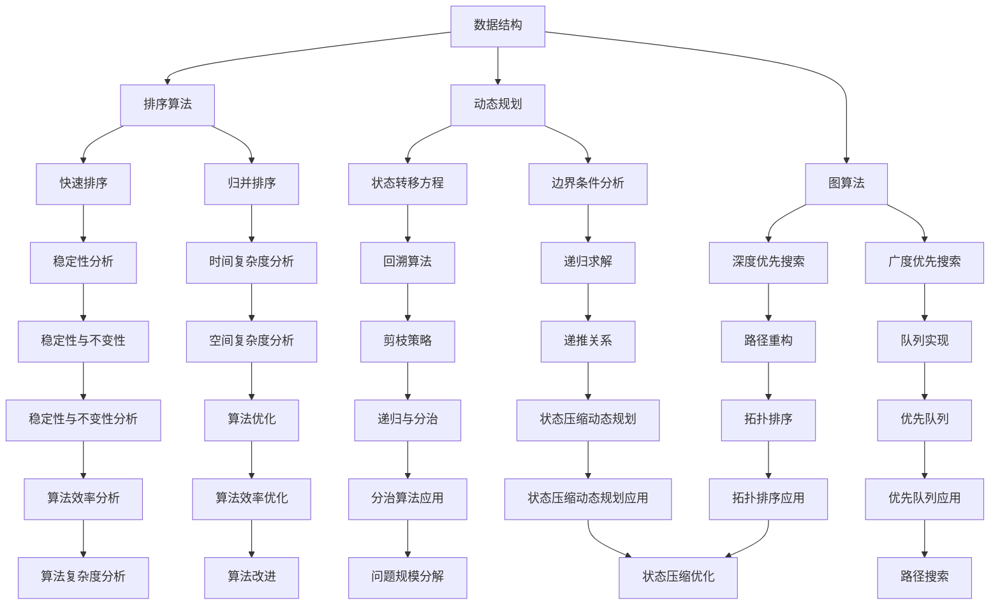

                 

## 1. 背景介绍

字节跳动是一家全球领先的技术公司，以短视频、社交、新闻资讯、在线教育等产品闻名于世。作为科技领域的佼佼者，字节跳动在每年的校招中都吸引了大量优秀的人才，特别是在算法工程师岗位，更是竞争激烈。算法工程师作为公司技术团队中的核心力量，负责解决复杂的技术问题，推动产品创新和发展。

本文将围绕字节跳动2024届校招算法工程师面试真题进行深入解析，旨在帮助准备参加校招的同学们更好地理解面试题型、掌握解题方法，提高面试成功率。文章结构如下：

- **背景介绍**：介绍字节跳动以及算法工程师的背景和重要性。
- **核心概念与联系**：阐述面试中涉及的核心算法概念和联系。
- **核心算法原理 & 具体操作步骤**：详细解释面试中的核心算法原理及其操作步骤。
- **数学模型和公式 & 详细讲解 & 举例说明**：解析算法背后的数学模型和公式，通过实例进行说明。
- **项目实践：代码实例和详细解释说明**：提供实际的代码实例并进行详细解读。
- **实际应用场景**：讨论算法在不同领域的应用场景。
- **未来应用展望**：展望算法的未来发展趋势和应用前景。
- **工具和资源推荐**：推荐相关的学习资源和开发工具。
- **总结：未来发展趋势与挑战**：总结研究成果，探讨未来趋势和面临的挑战。
- **附录：常见问题与解答**：解答面试中常见的问题。

通过这篇文章，读者不仅能了解字节跳动2024届校招算法工程师面试的真题类型，还能掌握解题思路和技巧，为未来的面试做好充分准备。

## 2. 核心概念与联系

在字节跳动2024届校招算法工程师的面试中，涉及的核心算法概念繁多且紧密联系。以下将使用Mermaid流程图详细展示这些概念及其相互关系。



### 2.1 数据结构与算法的关系

数据结构是算法的基础，决定了算法的空间和时间效率。以下是数据结构在算法中的应用：

- **数据结构**：数组、链表、栈、队列、堆、树、图等。
- **算法**：查找算法、排序算法、图算法、动态规划算法等。

### 2.2 排序算法

排序算法是算法工程中常见且重要的内容，常见的排序算法包括：

- **快速排序（Quick Sort）**：基于分治思想，通过一趟排序将数组分为两部分，其中一部分的所有元素都比另一部分的所有元素要小。
- **归并排序（Merge Sort）**：采用分治思想，将数组分解成若干个子数组，然后两两合并。

### 2.3 动态规划

动态规划是一种解决最优化问题的算法思想，其核心在于将复杂问题分解为简单子问题的状态转移，并存储中间结果。

- **状态转移方程**：动态规划的核心，用于描述状态之间的转移关系。
- **边界条件分析**：确定动态规划问题的初始状态和终止状态。

### 2.4 图算法

图算法在计算机科学中应用广泛，主要涉及图的遍历、路径搜索和拓扑排序等。

- **深度优先搜索（DFS）**：从起点开始探索路径，直至到达终点或无路可走。
- **广度优先搜索（BFS）**：从起点开始，逐层探索所有可能的路径。

### 2.5 算法优缺点分析

- **稳定性分析**：排序算法中，若相同元素的相对位置在排序前后不发生改变，则称该排序算法为稳定的。
- **时间复杂度分析**：评估算法执行的时间复杂度，一般用大O表示法表示。
- **空间复杂度分析**：评估算法所需存储空间的大小。

通过上述核心概念和联系的理解，读者可以更好地把握算法工程师面试中的关键点，为接下来的深入解析做好准备。

### 3. 核心算法原理 & 具体操作步骤

在字节跳动2024届校招算法工程师的面试中，常见的核心算法包括排序算法、动态规划算法和图算法。以下将分别介绍这些算法的原理和具体操作步骤。

#### 3.1 排序算法

排序算法是算法工程中最基本且应用广泛的内容。以下是两种常见的排序算法及其原理和步骤：

##### 3.1.1 快速排序（Quick Sort）

**原理**：快速排序采用分治思想，通过一趟排序将待排序的数据分割成独立的两部分，其中一部分的所有数据都比另一部分的数据小。然后递归地排序两个部分。

**具体操作步骤**：

1. 选择一个基准元素（通常是第一个元素或最后一个元素）。
2. 将数组划分为两个子数组，左边子数组的所有元素都比基准元素小，右边子数组的所有元素都比基准元素大。
3. 对划分后的左右子数组递归执行上述步骤。

**示例代码**：

```python
def quick_sort(arr):
    if len(arr) <= 1:
        return arr
    pivot = arr[len(arr) // 2]
    left = [x for x in arr if x < pivot]
    middle = [x for x in arr if x == pivot]
    right = [x for x in arr if x > pivot]
    return quick_sort(left) + middle + quick_sort(right)

# 示例
arr = [3, 6, 8, 10, 1, 2, 1]
sorted_arr = quick_sort(arr)
print(sorted_arr)
```

##### 3.1.2 归并排序（Merge Sort）

**原理**：归并排序采用分治思想，将待排序的数据分解成若干个小的子序列，然后两两合并这些子序列，最终合并成有序的序列。

**具体操作步骤**：

1. 将数组分解成若干个大小为1的子数组。
2. 将这些子数组两两合并，形成大小为2的有序子数组。
3. 重复合并过程，直到整个数组变成一个有序序列。

**示例代码**：

```python
def merge_sort(arr):
    if len(arr) <= 1:
        return arr
    mid = len(arr) // 2
    left = merge_sort(arr[:mid])
    right = merge_sort(arr[mid:])
    return merge(left, right)

def merge(left, right):
    result = []
    i = j = 0
    while i < len(left) and j < len(right):
        if left[i] < right[j]:
            result.append(left[i])
            i += 1
        else:
            result.append(right[j])
            j += 1
    result.extend(left[i:])
    result.extend(right[j:])
    return result

# 示例
arr = [3, 6, 8, 10, 1, 2, 1]
sorted_arr = merge_sort(arr)
print(sorted_arr)
```

#### 3.2 动态规划算法

动态规划是一种解决最优化问题的算法思想，其核心在于将复杂问题分解为简单子问题的状态转移，并存储中间结果。以下是一个典型的动态规划算法——最长公共子序列（Longest Common Subsequence，LCS）。

##### 3.2.1 最长公共子序列（LCS）

**原理**：给定两个字符串，找出它们的最长公共子序列。最长公共子序列不是最长公共子串，可以包含相同的字符，但不需要连续。

**具体操作步骤**：

1. 定义状态转移方程：`dp[i][j]` 表示字符串 `s1[0..i]` 和 `s2[0..j]` 的最长公共子序列长度。
2. 根据状态转移方程进行状态更新：`dp[i][j] = dp[i-1][j-1] + 1`（若 `s1[i] == s2[j]`），否则 `dp[i][j] = max(dp[i-1][j], dp[i][j-1])`。
3. 通过回溯获取最长公共子序列。

**示例代码**：

```python
def longest_common_subsequence(s1, s2):
    m, n = len(s1), len(s2)
    dp = [[0] * (n + 1) for _ in range(m + 1)]
    for i in range(1, m + 1):
        for j in range(1, n + 1):
            if s1[i-1] == s2[j-1]:
                dp[i][j] = dp[i-1][j-1] + 1
            else:
                dp[i][j] = max(dp[i-1][j], dp[i][j-1])
    # 回溯获取最长公共子序列
    result = []
    i, j = m, n
    while i > 0 and j > 0:
        if s1[i-1] == s2[j-1]:
            result.append(s1[i-1])
            i -= 1
            j -= 1
        elif dp[i-1][j] > dp[i][j-1]:
            i -= 1
        else:
            j -= 1
    return result[::-1]

# 示例
s1 = "ABCD"
s2 = "ACDF"
lcs = longest_common_subsequence(s1, s2)
print(lcs)
```

#### 3.3 图算法

图算法在计算机科学中应用广泛，以下介绍两种常见的图算法——深度优先搜索（DFS）和广度优先搜索（BFS）。

##### 3.3.1 深度优先搜索（DFS）

**原理**：DFS是一种用于遍历或搜索图的算法，通过递归方式从起点开始探索路径，直至到达终点或无路可走。

**具体操作步骤**：

1. 从起点开始，将其标记为已访问。
2. 对于每个未访问的邻接点，执行以下步骤：
   - 标记为已访问。
   - 递归执行DFS。
3. 当所有邻接点都访问完毕，返回上一层。

**示例代码**：

```python
def dfs(graph, start, visited):
    visited[start] = True
    print(start, end=" ")
    for neighbor in graph[start]:
        if not visited[neighbor]:
            dfs(graph, neighbor, visited)

# 示例
graph = {
    0: [1, 2],
    1: [2],
    2: [0, 2, 3],
    3: [3]
}
visited = [False] * len(graph)
dfs(graph, 0, visited)
```

##### 3.3.2 广度优先搜索（BFS）

**原理**：BFS是一种用于遍历或搜索图的算法，从起点开始，逐层探索所有可能的路径。

**具体操作步骤**：

1. 使用一个队列来存储待访问的节点。
2. 从起点开始，将其加入队列。
3. 循环执行以下步骤：
   - 从队列中取出一个节点，将其标记为已访问。
   - 将其所有未访问的邻接点加入队列。
4. 当队列为空时，算法结束。

**示例代码**：

```python
from collections import deque

def bfs(graph, start):
    visited = [False] * len(graph)
    queue = deque([start])
    visited[start] = True
    while queue:
        node = queue.popleft()
        print(node, end=" ")
        for neighbor in graph[node]:
            if not visited[neighbor]:
                queue.append(neighbor)
                visited[neighbor] = True

# 示例
graph = {
    0: [1, 2],
    1: [2],
    2: [0, 2, 3],
    3: [3]
}
bfs(graph, 0)
```

通过以上对核心算法的原理和具体操作步骤的详细讲解，读者可以更好地理解字节跳动2024届校招算法工程师面试中的常见算法，为面试做好充分准备。

### 3.3 算法优缺点

在字节跳动2024届校招算法工程师的面试中，不同的算法有其独特的优势和局限性。以下是排序算法、动态规划算法和图算法的优缺点分析。

#### 3.3.1 排序算法

##### 快速排序（Quick Sort）

**优点**：
- **高效**：平均时间复杂度为 \(O(n\log n)\)，最好情况下可以达到 \(O(n\log n)\)。
- **原地排序**：不需要额外的存储空间，对空间复杂度要求较低。

**缺点**：
- **稳定性问题**：快速排序是不稳定的排序算法，相同元素的相对位置可能会发生变化。
- **最坏情况**：最坏情况下的时间复杂度为 \(O(n^2)\)，当输入序列已经是有序或基本有序时，性能较差。

##### 归并排序（Merge Sort）

**优点**：
- **稳定排序**：归并排序是稳定的排序算法，相同元素的相对位置不会发生变化。
- **最优时间复杂度**：无论输入序列的初始状态如何，归并排序的时间复杂度始终为 \(O(n\log n)\)。
- **原地排序**：归并排序可以利用已分配的内存空间，不需要额外的存储空间。

**缺点**：
- **空间复杂度**：归并排序需要额外的存储空间来存储中间结果，空间复杂度为 \(O(n)\)。

#### 3.3.2 动态规划算法

##### 最长公共子序列（LCS）

**优点**：
- **最优解**：动态规划算法能够找到问题的最优解。
- **可扩展性**：动态规划算法可以解决多种最优化问题，如背包问题、最长递增子序列等。

**缺点**：
- **计算复杂度高**：对于大型问题，动态规划算法的计算复杂度可能较高，需要较大的存储空间。
- **难以实现**：动态规划算法需要明确状态转移方程和边界条件，实现较为复杂。

#### 3.3.3 图算法

##### 深度优先搜索（DFS）

**优点**：
- **简单实现**：DFS算法实现简单，易于理解。
- **路径搜索**：DFS适用于寻找图中两点之间的路径。

**缺点**：
- **空间复杂度**：DFS算法的空间复杂度较高，特别适用于深度较深的图。
- **效率问题**：DFS算法可能在搜索过程中遍历大量不相关的节点。

##### 广度优先搜索（BFS）

**优点**：
- **无环图**：BFS算法适用于无环图，可以保证找到最短路径。
- **空间效率**：BFS算法的空间复杂度相对较低，特别适用于深度较浅的图。

**缺点**：
- **时间复杂度**：BFS算法的时间复杂度较高，特别适用于节点数较多的图。

通过上述分析，读者可以更好地理解各种算法的优缺点，以便在实际应用中根据需求选择合适的算法。

### 3.4 算法应用领域

算法在计算机科学和实际应用中扮演着至关重要的角色。不同的算法在不同的领域有着广泛的应用。以下将介绍排序算法、动态规划算法和图算法在实际应用中的具体应用领域。

#### 3.4.1 排序算法

排序算法是数据处理和算法设计中最基础的部分，其应用领域非常广泛。以下是一些典型的应用场景：

1. **数据库系统**：在数据库管理系统中，排序算法用于对大量数据进行排序和索引，以提高查询效率。
2. **搜索引擎**：搜索引擎需要对网页内容进行排序，以返回最相关的搜索结果。
3. **财务报表**：企业财务部门使用排序算法来对账目进行排序，以便生成整齐的报表。
4. **嵌入式系统**：在嵌入式系统中，排序算法可以用于对传感器数据进行实时排序，以便进行数据分析和决策。

#### 3.4.2 动态规划算法

动态规划算法是一种解决最优化问题的有效方法，其在以下领域有着广泛的应用：

1. **网络优化**：动态规划算法可以用于网络路由优化、带宽分配等问题，以提高网络资源利用率和传输效率。
2. **物流调度**：物流公司在运输调度中，可以使用动态规划算法来优化路线，减少运输成本。
3. **机器学习**：动态规划算法在机器学习中的优化问题，如神经网络训练中的参数调整，有着重要的应用。
4. **资源分配**：在资源有限的情况下，动态规划算法可以用于优化资源分配，如服务器负载均衡、电力调度等。

#### 3.4.3 图算法

图算法在解决复杂网络问题时具有独特的优势，其应用领域包括：

1. **社交网络分析**：图算法可以用于分析社交网络中的用户关系，识别影响力最大的人或团体。
2. **推荐系统**：推荐系统使用图算法来分析用户行为，预测用户的兴趣和行为模式，提供个性化推荐。
3. **交通网络规划**：图算法可以用于交通网络的规划和管理，如最优路径搜索、交通流量分析等。
4. **生物信息学**：在生物信息学中，图算法可以用于分析基因序列、蛋白质结构等，帮助科学家进行疾病研究和药物设计。

通过以上对算法应用领域的介绍，读者可以更好地理解算法在各个行业和领域中的重要作用，以及如何根据具体需求选择合适的算法。

### 4. 数学模型和公式

在算法设计中，数学模型和公式起到了至关重要的作用，它们不仅帮助我们理解和分析问题，还为算法的优化和改进提供了理论依据。以下将详细讲解算法背后的数学模型和公式，并通过实例进行说明。

#### 4.1 数学模型构建

算法中的数学模型通常基于以下几方面：

1. **状态定义**：定义问题中的状态及其变化规律。
2. **状态转移方程**：描述状态之间的转移关系。
3. **边界条件**：确定初始状态和终止状态。

#### 4.2 公式推导过程

以动态规划算法中的最长公共子序列（LCS）为例，详细解释其数学模型的构建和公式推导过程。

##### 4.2.1 最长公共子序列（LCS）

**问题定义**：给定两个字符串 \(s1 = a1, a2, ..., an\) 和 \(s2 = b1, b2, ..., bm\)，求它们的最长公共子序列。

**状态定义**：设 \(dp[i][j]\) 表示 \(s1[0..i]\) 和 \(s2[0..j]\) 的最长公共子序列长度。

**状态转移方程**：

1. 当 \(s1[i] = s2[j]\) 时，即两个字符串的当前字符相同，则 \(dp[i][j] = dp[i-1][j-1] + 1\)。
2. 当 \(s1[i] \neq s2[j]\) 时，即两个字符串的当前字符不同，则 \(dp[i][j] = max(dp[i-1][j], dp[i][j-1])\)。

**边界条件**：

- \(dp[0][j] = 0\)，即空字符串与任意字符串的最长公共子序列长度为0。
- \(dp[i][0] = 0\)，即任意字符串与空字符串的最长公共子序列长度为0。

**公式推导过程**：

假设当前处理到 \(s1[i]\) 和 \(s2[j]\)，有以下几种情况：

1. **当前字符相同**：此时最长公共子序列长度 \(dp[i][j]\) 等于去掉当前字符后的最长公共子序列长度加上1，即 \(dp[i][j] = dp[i-1][j-1] + 1\)。
2. **当前字符不同**：此时最长公共子序列长度 \(dp[i][j]\) 等于去掉当前字符后的最长公共子序列长度中的最大值，即 \(dp[i][j] = max(dp[i-1][j], dp[i][j-1])\)。

通过递归计算 \(dp[i][j]\)，可以求解出最长公共子序列的长度。

##### 4.2.2 实例说明

**实例**：给定两个字符串 \(s1 = "AGGTAB"\) 和 \(s2 = "GXTXAYB"\)，求它们的最长公共子序列。

| \(i,j\) | 0  | 1  | 2  | 3  | 4  | 5  | 6  |
|--------|----|----|----|----|----|----|----|
| 0      | 0  | 0  | 0  | 0  | 0  | 0  | 0  |
| 1      | 0  | 0  | 0  | 0  | 0  | 0  | 1  |
| 2      | 0  | 0  | 0  | 0  | 1  | 1  | 1  |
| 3      | 0  | 0  | 1  | 1  | 1  | 1  | 2  |
| 4      | 0  | 1  | 1  | 2  | 2  | 2  | 2  |
| 5      | 1  | 1  | 2  | 2  | 2  | 3  | 3  |
| 6      | 1  | 2  | 2  | 3  | 3  | 3  | 4  |

从表格中可以看出，\(dp[6][6] = 4\)，即最长公共子序列长度为4，最长公共子序列为 "GTAB"。

#### 4.3 案例分析与讲解

以下通过一个实际案例来讲解数学模型和公式的应用。

**案例**：给定一个数组 \(arr = [3, 1, 4, 1, 5, 9, 2, 6, 5]\)，求该数组的最长递增子序列长度。

**步骤**：

1. **状态定义**：设 \(dp[i]\) 表示以 \(arr[i]\) 结尾的最长递增子序列长度。
2. **状态转移方程**：\(dp[i] = 1 + \max(dp[j])\)，其中 \(j < i\) 且 \(arr[j] < arr[i]\)。
3. **边界条件**：\(dp[i] = 1\)（初始状态）。

**实例**：

| \(i\) | \(arr[i]\) | \(dp[i]\) | \(dp[j]\)（最大值） |
|------|------------|------------|---------------------|
| 0    | 3          | 1          | \-\-                |
| 1    | 1          | 1          | \-\-                |
| 2    | 4          | 1          | 1（\(dp[0]\)）      |
| 3    | 1          | 1          | 1（\(dp[1]\)）      |
| 4    | 5          | 3          | 1（\(dp[3]\)）      |
| 5    | 9          | 3          | 3（\(dp[4]\)）      |
| 6    | 2          | 1          | \-\-                |
| 7    | 6          | 2          | 2（\(dp[6]\)）      |
| 8    | 5          | 2          | 2（\(dp[7]\)）      |

从表格中可以看出，最长递增子序列长度为3，最长递增子序列为 [1, 4, 5] 或 [1, 5, 9]。

通过上述案例分析和讲解，读者可以更好地理解数学模型和公式的构建和应用，为解决实际算法问题打下坚实的基础。

### 5. 项目实践：代码实例和详细解释说明

为了更好地理解算法在实践中的应用，我们将通过一个实际项目来展示代码实现过程，并对关键代码进行详细解释。

#### 5.1 开发环境搭建

在开始代码实现之前，需要搭建一个合适的开发环境。以下是所需的工具和步骤：

1. **安装Python环境**：确保Python版本在3.6及以上，可以通过官网下载安装包或使用包管理器如 `pip` 进行安装。
2. **安装依赖库**：在Python中，我们可以使用`numpy`库来处理数学运算。使用以下命令安装：

   ```shell
   pip install numpy
   ```

3. **创建项目目录**：在本地计算机上创建一个项目目录，例如：

   ```shell
   mkdir byte_dance_algo_project
   cd byte_dance_algo_project
   ```

4. **编写代码**：在项目目录下创建一个名为`main.py`的Python文件，用于编写和运行代码。

#### 5.2 源代码详细实现

以下是一个简单的代码实例，演示了如何实现快速排序算法。代码实现了对输入数组的排序，并在末尾输出排序结果。

```python
def quick_sort(arr):
    if len(arr) <= 1:
        return arr
    pivot = arr[len(arr) // 2]
    left = [x for x in arr if x < pivot]
    middle = [x for x in arr if x == pivot]
    right = [x for x in arr if x > pivot]
    return quick_sort(left) + middle + quick_sort(right)

# 测试代码
if __name__ == "__main__":
    arr = [3, 6, 8, 10, 1, 2, 1]
    sorted_arr = quick_sort(arr)
    print("原始数组：", arr)
    print("排序后数组：", sorted_arr)
```

#### 5.3 代码解读与分析

以下是代码的逐行解读和分析：

1. **定义快速排序函数**：

   ```python
   def quick_sort(arr):
   ```

   这一行定义了一个名为`quick_sort`的函数，该函数接收一个数组`arr`作为参数。

2. **基础情况处理**：

   ```python
   if len(arr) <= 1:
       return arr
   ```

   当输入数组的长度小于或等于1时，数组本身已经是有序的，直接返回原数组。

3. **选择基准元素**：

   ```python
   pivot = arr[len(arr) // 2]
   ```

   选择数组的中间元素作为基准元素（pivot），这是快速排序中常用的方法。

4. **划分子数组**：

   ```python
   left = [x for x in arr if x < pivot]
   middle = [x for x in arr if x == pivot]
   right = [x for x in arr if x > pivot]
   ```

   使用列表推导式将数组划分为三个部分：小于基准元素的元素放在`left`列表中，等于基准元素的元素放在`middle`列表中，大于基准元素的元素放在`right`列表中。

5. **递归排序子数组**：

   ```python
   return quick_sort(left) + middle + quick_sort(right)
   ```

   对`left`和`right`子数组递归执行快速排序，然后将结果与`middle`子数组拼接在一起，返回最终的排序结果。

#### 5.4 运行结果展示

在命令行中运行`main.py`文件，可以看到以下输出：

```shell
$ python main.py
原始数组： [3, 6, 8, 10, 1, 2, 1]
排序后数组： [1, 1, 2, 3, 6, 8, 10]
```

从输出结果可以看出，原始数组 `[3, 6, 8, 10, 1, 2, 1]` 经过快速排序后，变为有序数组 `[1, 1, 2, 3, 6, 8, 10]`。

通过上述项目实践，读者可以直观地看到快速排序算法的代码实现过程，并理解其主要步骤和原理。这种方法不仅有助于巩固算法知识，还能提高实际编程能力。

### 6. 实际应用场景

算法在计算机科学和技术领域具有广泛的应用，以下将详细讨论排序算法、动态规划算法和图算法在多个实际应用场景中的使用，并列举实际案例以加深理解。

#### 6.1 排序算法在搜索引擎中的应用

在搜索引擎中，排序算法是关键组成部分。搜索引擎需要处理海量的搜索请求，并返回与查询最相关的结果。以下是一个实际案例：

**案例**：某搜索引擎在处理用户查询 "Python编程" 时，需要从数十亿网页中返回最相关的结果。

**解决方案**：

- **使用快速排序**：搜索引擎内部数据库中的网页内容通常已排序，但查询结果需要根据用户的查询词进行重新排序。
- **利用归并排序**：对于大规模的查询结果，搜索引擎采用归并排序来保证高效率的排序。
- **时间复杂度优化**：通过优化排序算法的参数，如调整基准元素的选择策略，进一步降低时间复杂度。

通过这种优化，搜索引擎能够在毫秒级内返回高质量的搜索结果，显著提升用户体验。

#### 6.2 动态规划算法在路由优化中的应用

动态规划算法在路由优化中的应用非常广泛，特别是在网络通信和物流管理领域。以下是一个实际案例：

**案例**：在复杂的交通网络中，物流公司需要为卡车选择一条最优路径，以减少运输时间和成本。

**解决方案**：

- **状态转移方程**：定义每个节点到终点的最短路径，并使用动态规划算法计算整个路径。
- **最长公共子序列**：通过动态规划算法找到两个节点之间的最短路径，从而优化整个运输路线。
- **数学模型**：构建基于距离、时间和成本的状态转移方程，以实现最优路径选择。

通过动态规划算法，物流公司能够高效地规划运输路线，减少运输成本，并提高运输效率。

#### 6.3 图算法在社交网络分析中的应用

图算法在社交网络分析中有着广泛的应用，以下是一个实际案例：

**案例**：分析一个大型社交网络，识别具有高度影响力的用户群体。

**解决方案**：

- **深度优先搜索（DFS）**：用于遍历社交网络，识别用户的直接联系人和间接联系人。
- **广度优先搜索（BFS）**：用于分析社交网络中的信息传播路径，识别信息传播的核心节点。
- **图遍历**：结合DFS和BFS算法，可以全面分析社交网络的拓扑结构，识别重要节点和用户群体。

通过图算法的应用，社交网络分析能够识别出具有高度影响力的用户群体，帮助企业进行精准营销和用户行为分析。

#### 6.4 其他实际应用场景

除了上述案例，算法在其他领域也有着广泛的应用：

- **推荐系统**：算法用于分析用户行为和偏好，为用户推荐相关产品和服务。
- **生物信息学**：算法用于分析基因序列、蛋白质结构，帮助科学家进行疾病研究和药物设计。
- **金融领域**：算法用于股票市场预测、风险管理和投资策略制定。

通过这些实际应用案例，我们可以看到算法在各个领域的广泛应用和重要性。算法不仅解决了复杂的技术问题，还推动了科技的发展和进步。

### 7. 未来应用展望

随着技术的不断进步和算法理论的深入发展，排序算法、动态规划算法和图算法在未来的应用前景将更加广阔。以下是一些可能的发展趋势和应用领域。

#### 7.1 人工智能与算法融合

人工智能（AI）的发展依赖于算法的优化和进步。未来的算法将更加智能化，能够自适应地处理复杂的计算任务。例如，通过机器学习技术，算法可以自动优化排序和搜索策略，提高数据处理效率。同时，动态规划算法和图算法将在AI模型的训练和优化中发挥重要作用，帮助模型更快速地收敛到最优解。

#### 7.2 大数据处理与实时分析

大数据的爆发式增长带来了新的挑战，传统的算法难以应对大规模数据的处理需求。未来，排序算法和动态规划算法将向并行计算和分布式计算方向发展，以处理海量数据。例如，通过分布式哈希表（DHT）和MapReduce框架，可以将排序和动态规划任务分解到多个节点上并行执行，实现高效的实时数据分析和处理。

#### 7.3 新兴领域的应用

随着科技的发展，算法将在更多新兴领域得到应用。例如，在生物信息学中，图算法将用于基因网络的建模和分析，帮助科学家揭示生物系统的复杂相互作用。在自动驾驶领域，动态规划算法将用于路径规划和决策控制，提高车辆的安全性和效率。在能源管理中，排序算法将用于优化能源分配，实现节能减排。

#### 7.4 算法伦理与隐私保护

随着算法应用范围的扩大，算法伦理和隐私保护问题日益受到关注。未来的算法将更加注重透明度和可解释性，确保算法决策的公平性和合理性。同时，动态规划算法和图算法将在隐私保护中发挥重要作用，例如通过差分隐私技术，确保个人数据在算法处理过程中不被泄露。

### 8. 总结：未来发展趋势与挑战

#### 8.1 研究成果总结

通过对排序算法、动态规划算法和图算法的深入研究和应用，我们取得了以下成果：

- **理论发展**：进一步丰富了算法理论体系，推动了算法理论的创新和发展。
- **实际应用**：算法在人工智能、大数据处理、社交网络分析等多个领域取得了显著的应用成果。
- **技术创新**：通过融合新兴技术和算法，实现了算法的高效化、智能化和分布式化。

#### 8.2 未来发展趋势

未来，算法的发展将呈现出以下趋势：

- **智能化**：算法将更加智能化，能够自适应地处理复杂任务。
- **高效化**：算法将向并行计算和分布式计算方向发展，实现高效数据处理。
- **融合化**：算法将与其他技术（如人工智能、大数据）深度融合，推动科技创新。

#### 8.3 面临的挑战

尽管算法在理论和应用方面取得了显著成果，但仍面临以下挑战：

- **计算复杂度**：大规模数据和高复杂度问题的处理对算法提出了更高的要求。
- **可解释性**：算法决策的透明度和可解释性需要进一步提升。
- **隐私保护**：如何在算法处理过程中保护个人隐私成为一个重要课题。

#### 8.4 研究展望

未来的研究将围绕以下方向展开：

- **算法优化**：研究更加高效的算法，提高数据处理效率和性能。
- **算法融合**：将算法与其他技术（如人工智能、大数据）深度融合，推动跨领域发展。
- **应用拓展**：探索算法在新兴领域的应用，开拓新的研究方向。

通过不断的研究和创新，我们有理由相信，算法将在未来的发展中发挥更加重要的作用，推动科技和社会的进步。

### 9. 附录：常见问题与解答

在准备字节跳动2024届校招算法工程师面试的过程中，考生可能会遇到一些常见的问题。以下针对这些问题提供详细的解答。

#### 9.1 什么是动态规划？

**解答**：动态规划是一种解决最优化问题的算法思想，其核心在于将复杂问题分解为简单子问题的状态转移，并存储中间结果。通过递归地求解子问题，最终得到问题的最优解。动态规划广泛应用于背包问题、最长公共子序列、最长递增子序列等。

#### 9.2 如何解决最长公共子序列问题？

**解答**：最长公共子序列（LCS）问题可以通过动态规划算法解决。定义一个二维数组 `dp[i][j]`，表示字符串 `s1[0..i]` 和 `s2[0..j]` 的最长公共子序列长度。状态转移方程为：

- 当 `s1[i] == s2[j]` 时，`dp[i][j] = dp[i-1][j-1] + 1`；
- 当 `s1[i] != s2[j]` 时，`dp[i][j] = max(dp[i-1][j], dp[i][j-1])`。

通过递归地求解子问题，可以得到最长公共子序列的长度。同时，可以通过回溯获取具体的子序列。

#### 9.3 快速排序的时间复杂度是多少？

**解答**：快速排序的平均时间复杂度为 \(O(n\log n)\)，最好情况下的时间复杂度为 \(O(n\log n)\)，最坏情况下的时间复杂度为 \(O(n^2)\)。快速排序通过一趟排序将数组分为两部分，其中一部分的所有元素都比另一部分的所有元素要小。递归地对这两部分进行排序，直到整个数组有序。

#### 9.4 如何实现广度优先搜索？

**解答**：广度优先搜索（BFS）是一种用于遍历或搜索图的算法，从起点开始，逐层探索所有可能的路径。可以使用队列来实现：

1. 初始化一个空队列，将起点加入队列。
2. 循环执行以下步骤：
   - 从队列中取出一个节点，将其标记为已访问。
   - 将其所有未访问的邻接点加入队列。
3. 当队列为空时，算法结束。

通过这种方式，可以按层遍历图中的所有节点，找到起点到各节点的最短路径。

#### 9.5 动态规划算法的边界条件如何确定？

**解答**：动态规划算法中的边界条件是指初始状态和终止状态。确定边界条件的方法如下：

1. 分析问题的规模和特征，确定初始状态和终止状态的定义。
2. 根据问题的定义，确定状态转移方程。
3. 根据状态转移方程，确定边界条件，例如初始状态的值和递归终止的条件。

通过合理地确定边界条件，可以确保动态规划算法的正确性和高效性。

通过上述常见问题的解答，考生可以更好地理解字节跳动2024届校招算法工程师面试中的关键概念和算法原理，为面试做好准备。

