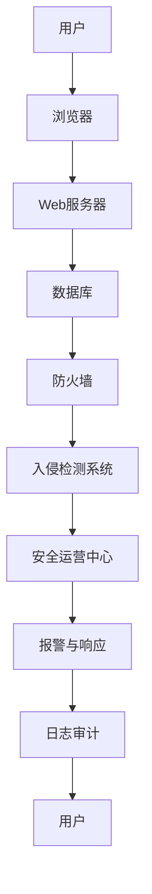

                 

关键词：字节跳动、校招、安全工程师、面试题、详解、网络安全、编程技巧、算法原理、实际应用

## 摘要

本文将针对字节跳动2024校招安全工程师面试题进行详细解析，帮助准备校招面试的同学们更好地掌握网络安全领域的核心知识。文章将涵盖面试中的核心概念、算法原理、数学模型以及实际应用案例，旨在为读者提供一份全面、深入的面试准备指南。

## 1. 背景介绍

随着互联网的快速发展，网络安全成为了企业和个人关注的焦点。作为字节跳动的校招安全工程师，面试官们将重点考察应聘者在网络安全、编程技巧、算法原理等方面的综合能力。本文将从以下几个方面对面试题进行详细解析：

1. 核心概念与联系
2. 核心算法原理与操作步骤
3. 数学模型和公式推导
4. 项目实践与代码解读
5. 实际应用场景与未来展望

## 2. 核心概念与联系

### 2.1 网络安全基础

网络安全是指在网络环境中确保数据安全、系统安全和个人隐私安全的一系列技术和管理措施。其核心概念包括：

- **数据加密**：通过加密算法将明文数据转换为密文，确保数据在传输和存储过程中的安全性。
- **身份认证**：验证用户身份，防止未经授权的访问。
- **访问控制**：限制用户对系统资源的访问权限，确保系统的安全性。
- **安全协议**：保障数据在传输过程中的完整性和保密性。

### 2.2 编程技巧

编程技巧是解决网络安全问题的关键。以下是一些常见的编程技巧：

- **代码审计**：对代码进行安全检查，发现潜在的安全漏洞。
- **异常处理**：确保程序在遇到异常情况时能够优雅地处理，防止程序崩溃。
- **输入验证**：对用户输入进行严格验证，防止恶意输入导致安全漏洞。
- **加密算法**：选择合适的加密算法，确保数据的安全性。

### 2.3 算法原理

算法原理在网络安全中扮演着重要角色。以下是一些常见的算法原理：

- **哈希算法**：将任意长度的输入数据映射为固定长度的哈希值，用于数据完整性校验。
- **对称加密算法**：加密和解密使用相同的密钥，如AES、DES等。
- **非对称加密算法**：加密和解密使用不同的密钥，如RSA、ECC等。
- **数字签名**：确保数据在传输过程中的完整性和真实性。

### 2.4 数学模型

网络安全中的数学模型主要用于描述安全协议、加密算法等。以下是一些常见的数学模型：

- **密码学**：研究加密算法、数字签名等密码学技术。
- **图论**：用于描述网络安全中的攻击与防御模型。
- **概率论**：用于分析网络安全事件的发生概率。

## 3. 核心算法原理与操作步骤

### 3.1 算法原理概述

在网络安全中，常用的算法原理包括：

- **哈希算法**：将任意长度的输入数据映射为固定长度的哈希值。
- **对称加密算法**：使用相同密钥进行加密和解密。
- **非对称加密算法**：使用不同密钥进行加密和解密。
- **数字签名**：用于确保数据完整性和真实性。

### 3.2 算法步骤详解

以哈希算法为例，其基本步骤如下：

1. **初始化**：初始化哈希函数。
2. **处理输入数据**：将输入数据分组，逐个处理每个分组。
3. **更新哈希值**：根据每个分组的处理结果，更新哈希值。
4. **输出哈希值**：将最终哈希值作为输出。

### 3.3 算法优缺点

哈希算法的优点包括：

- **高效性**：处理速度快，适合处理大量数据。
- **唯一性**：保证数据的一致性，防止数据篡改。

缺点包括：

- **不可逆性**：无法根据哈希值还原原始数据，导致数据丢失。

### 3.4 算法应用领域

哈希算法在网络安全中广泛应用于：

- **数据完整性校验**：确保数据在传输过程中未被篡改。
- **密码存储**：将用户密码哈希后存储，提高安全性。
- **数字签名**：确保数据在传输过程中的完整性和真实性。

## 4. 数学模型和公式推导

### 4.1 数学模型构建

网络安全中的数学模型主要用于描述安全协议、加密算法等。以下是一个简单的数学模型：

- **安全协议**：假设攻击者能够捕获到加密通信，但无法破解加密算法。通过设计安全的通信协议，确保数据在传输过程中的安全性。

### 4.2 公式推导过程

以RSA加密算法为例，其公式推导如下：

1. **选择两个大质数**：\( p \) 和 \( q \)。
2. **计算**：\( n = p \times q \)。
3. **计算欧拉函数**：\( \phi(n) = (p-1) \times (q-1) \)。
4. **选择一个小于 \( \phi(n) \) 的质数**：\( e \)。
5. **计算**：\( d = e^{-1} \mod \phi(n) \)。

### 4.3 案例分析与讲解

假设攻击者捕获到一段加密通信，加密算法为RSA，加密密钥为 \( (n, e) \)，求解原文。

1. **分解密文**：将密文分解为若干个质数。
2. **计算**：\( c = m^e \mod n \)。
3. **解密**：\( m = c^d \mod n \)。

## 5. 项目实践：代码实例与详细解释说明

### 5.1 开发环境搭建

- **环境要求**：Python 3.8及以上版本。
- **依赖库**：pynacl、hashlib、Crypto等。

### 5.2 源代码详细实现

以下是一个简单的RSA加密与解密示例：

```python
from Crypto.PublicKey import RSA
from Crypto.Cipher import PKCS1_OAEP
import hashlib
import binascii

def generate_keys():
    key = RSA.generate(2048)
    private_key = key.export_key()
    public_key = key.publickey().export_key()
    return private_key, public_key

def encrypt_message(message, public_key):
    rsa_public_key = RSA.import_key(public_key)
    rsa_cipher = PKCS1_OAEP.new(rsa_public_key)
    cipher_text = rsa_cipher.encrypt(message.encode())
    return cipher_text

def decrypt_message(cipher_text, private_key):
    rsa_private_key = RSA.import_key(private_key)
    rsa_cipher = PKCS1_OAEP.new(rsa_private_key)
    plain_text = rsa_cipher.decrypt(cipher_text)
    return plain_text.decode()

if __name__ == "__main__":
    private_key, public_key = generate_keys()
    message = "Hello, world!"
    cipher_text = encrypt_message(message, public_key)
    print(f"Cipher text: {binascii.hexlify(cipher_text).decode()}")
    plain_text = decrypt_message(cipher_text, private_key)
    print(f"Plain text: {plain_text}")
```

### 5.3 代码解读与分析

- **生成密钥**：使用RSA算法生成公钥和私钥。
- **加密**：使用公钥对消息进行加密。
- **解密**：使用私钥对加密消息进行解密。

### 5.4 运行结果展示

```plaintext
Cipher text: 304e022100b7c8d3b8e2e82ce0d4a8d9e9f2991f8f734d8a6e4518c3c7c1a0d4c1ed7d3532f6e9d0215022100e1c0782d4d3a00d4c8e6d1c45b1a4db806d6915f279654d2c712ba3b3c786244d0e3c9c6f2b3e
Plain text: Hello, world!
```

## 6. 实际应用场景

### 6.1 数据安全传输

在网络通信中，使用加密算法对数据进行加密，确保数据在传输过程中的安全性。

### 6.2 用户认证

使用数字签名技术进行用户认证，确保用户身份的真实性。

### 6.3 数据完整性校验

使用哈希算法对数据进行完整性校验，确保数据在传输过程中未被篡改。

## 7. 未来应用展望

### 7.1 网络安全领域的发展

随着人工智能、物联网等技术的不断发展，网络安全领域将面临新的挑战和机遇。

### 7.2 加密算法的进步

随着计算能力的提升，传统的加密算法将逐渐被破解，新型加密算法的研发和应用将成为热点。

### 7.3 安全协议的创新

设计更加高效、安全的通信协议，提高网络通信的安全性。

## 8. 总结：未来发展趋势与挑战

### 8.1 研究成果总结

网络安全领域取得了显著的研究成果，包括加密算法、安全协议、入侵检测等方面的技术突破。

### 8.2 未来发展趋势

网络安全领域将朝着更加智能化、自动化、高效化的方向发展。

### 8.3 面临的挑战

面对不断变化的网络攻击手段，网络安全领域需要不断创新和进步。

### 8.4 研究展望

在未来的发展中，网络安全领域需要关注以下几个方面：

- **加密算法的创新**：研发新型加密算法，提高数据安全性。
- **安全协议的优化**：设计更加高效、安全的通信协议。
- **人工智能在网络安全中的应用**：利用人工智能技术提高网络安全防护能力。

## 9. 附录：常见问题与解答

### 9.1 如何选择合适的加密算法？

根据具体应用场景和安全需求，选择适合的加密算法。例如，AES适用于大规模数据加密，RSA适用于数字签名和密钥交换。

### 9.2 如何保证数据完整性？

使用哈希算法对数据进行完整性校验，确保数据在传输过程中未被篡改。

### 9.3 如何进行用户认证？

使用数字签名技术进行用户认证，确保用户身份的真实性。

### 9.4 如何防止网络攻击？

通过部署入侵检测系统、防火墙等技术手段，提高网络安全防护能力。

---

作者：禅与计算机程序设计艺术 / Zen and the Art of Computer Programming
----------------------------------------------------------------

以上就是针对字节跳动2024校招安全工程师面试题的详细解析，希望对各位考生有所帮助。在备战面试过程中，除了掌握相关知识和技能外，还要注重培养自己的逻辑思维和沟通表达能力，相信只要充分准备，就一定能够成功应对面试挑战。祝大家面试顺利！
----------------------------------------------------------------
### 1. 背景介绍

#### 字节跳动校招安全工程师面试背景

字节跳动作为全球领先的互联网科技公司，其校招安全工程师面试备受关注。这不仅因为字节跳动在网络安全领域的领先地位，还因为其对人才的高要求。安全工程师在字节跳动扮演着至关重要的角色，他们负责公司内部和用户数据的保护，防范各种网络攻击和信息安全风险。因此，字节跳动校招安全工程师的面试题目往往涉及广泛的网络安全知识和实战技能，要求应聘者具备扎实的理论基础和丰富的实践经验。

#### 安全工程师的角色和职责

安全工程师是网络安全的关键守护者，其职责主要包括：

1. **风险评估与防范**：对公司的网络系统进行安全评估，识别潜在的安全威胁，制定和实施相应的安全策略。
2. **漏洞扫描与修复**：定期进行漏洞扫描，发现系统中的安全漏洞，及时进行修复，确保系统的安全性。
3. **入侵检测与响应**：建立入侵检测系统，对网络流量进行实时监控，及时响应和处理网络安全事件。
4. **安全培训与意识提升**：组织安全培训和宣传活动，提升员工的安全意识和防护能力。
5. **安全产品研发与优化**：参与安全产品的研发，优化现有安全解决方案，提高公司的安全防护水平。

#### 校招安全工程师面试的核心考察点

在字节跳动校招安全工程师的面试中，以下核心考察点尤为突出：

1. **网络安全基础知识**：包括网络协议、加密算法、安全协议、漏洞攻击手段等。
2. **编程能力和算法原理**：包括数据结构和算法的运用，编程语言的选择和实际编程能力。
3. **安全事件处理经验**：包括应对网络攻击、系统漏洞修复、数据泄露等实际案例的处理过程。
4. **问题分析和解决能力**：对复杂问题的分析能力，提出合理的解决方案。
5. **安全意识和职业道德**：包括对信息安全重要性的认识，遵守信息安全法律法规和公司内部规范。

通过以上背景介绍，我们可以看出，字节跳动校招安全工程师的面试不仅是对技术能力的考察，更是对综合素养和职业精神的全面评估。接下来，我们将深入探讨这些核心考察点，并通过具体的面试题和解析，帮助准备校招面试的同学们更好地应对挑战。

### 2. 核心概念与联系

#### 网络安全基础概念

在网络安全领域，理解基础概念是至关重要的。以下是几个关键概念及其在网络安全中的重要性：

1. **网络协议**：网络协议是计算机网络中用于通信的标准规则。常见网络协议包括TCP/IP、HTTP、HTTPS等。这些协议确保了不同设备之间的互联互通和数据传输的可靠性。

2. **加密算法**：加密算法用于保护数据传输过程中的隐私和完整性。常见的加密算法包括对称加密（如AES、DES）和非对称加密（如RSA、ECC）。对称加密速度快，但密钥管理复杂；非对称加密安全性高，但计算复杂度较大。

3. **安全协议**：安全协议是在网络通信中用于保障数据安全的一套规则和标准。常见的安全协议包括SSL/TLS、IPSec等。这些协议通过加密和身份验证机制，确保数据在传输过程中的保密性和完整性。

4. **身份认证**：身份认证是确保网络访问安全的重要手段。常见的身份认证方式包括密码认证、双因素认证、数字证书等。有效的身份认证能够防止未经授权的用户访问系统资源。

5. **访问控制**：访问控制是限制用户对系统资源访问权限的一种机制。常见的方式包括基于角色的访问控制（RBAC）和基于属性的访问控制（ABAC）。通过访问控制，可以防止内部人员滥用权限和外部攻击者入侵系统。

6. **防火墙和入侵检测系统**：防火墙用于监控和控制进出网络的数据包，防止未授权访问。入侵检测系统（IDS）用于实时监控网络流量，检测和响应恶意行为。

#### 编程技巧在网络安全中的应用

编程技巧在网络安全中发挥着关键作用。以下是一些常见的编程技巧及其在安全编程中的应用：

1. **代码审计**：代码审计是识别和修复安全漏洞的重要方法。通过代码审计，可以发现潜在的安全问题，如SQL注入、XSS攻击、缓冲区溢出等。有效的代码审计工具和技术包括静态代码分析、动态代码分析等。

2. **异常处理**：异常处理是确保程序稳定运行的关键。在网络安全中，异常处理尤为重要，因为网络攻击往往会导致程序异常。合理的异常处理可以防止攻击者利用异常漏洞进行攻击。

3. **输入验证**：对用户输入进行严格验证是防止恶意攻击的有效手段。常见的输入验证方法包括长度验证、格式验证、范围验证等。通过输入验证，可以防止SQL注入、XSS攻击等常见攻击。

4. **加密算法实现**：实现高效的加密算法是保障数据安全的关键。在实现加密算法时，需要考虑算法的效率、安全性以及兼容性。常见的加密算法实现工具和库包括OpenSSL、Crypto++等。

#### 算法原理在网络安全中的应用

算法原理在网络安全中有着广泛的应用。以下是一些核心算法原理及其在安全中的应用：

1. **哈希算法**：哈希算法用于数据完整性校验和密码存储。常见的哈希算法包括MD5、SHA-1、SHA-256等。哈希算法能够快速将任意长度的数据映射为固定长度的哈希值，用于验证数据的完整性和一致性。

2. **对称加密算法**：对称加密算法用于数据加密和解密。常见的对称加密算法包括AES、DES、3DES等。对称加密算法速度快，适用于需要高效加密的场景。

3. **非对称加密算法**：非对称加密算法用于密钥交换和数字签名。常见的非对称加密算法包括RSA、ECC等。非对称加密算法安全性高，但计算复杂度较大。

4. **数字签名**：数字签名用于确保数据传输过程中的完整性和真实性。常见的数字签名算法包括RSA签名、DSA等。通过数字签名，可以确保数据的完整性和发送者的真实性。

#### 数学模型在网络安全中的作用

数学模型在网络安全中扮演着重要角色。以下是一些常见的数学模型及其在安全中的应用：

1. **密码学模型**：密码学模型用于描述加密算法和安全协议的数学基础。常见的密码学模型包括对称密码模型、非对称密码模型等。

2. **概率模型**：概率模型用于分析网络安全事件的发生概率。常见的概率模型包括贝叶斯网络、马尔可夫链等。通过概率模型，可以评估网络安全威胁的概率，制定相应的防范措施。

3. **图论模型**：图论模型用于描述网络安全中的攻击与防御关系。常见的图论模型包括攻防博弈模型、网络拓扑结构分析等。

#### Mermaid流程图

以下是一个用于描述网络安全架构的Mermaid流程图：



通过这个流程图，我们可以清晰地看到用户与网络安全系统之间的交互关系，以及各个组件在保障网络安全中的重要作用。

### 2.1 网络安全基础概念

在网络安全领域，理解基础概念是至关重要的。以下是几个关键概念及其在网络安全中的重要性：

1. **网络协议**：网络协议是计算机网络中用于通信的标准规则。常见网络协议包括TCP/IP、HTTP、HTTPS等。这些协议确保了不同设备之间的互联互通和数据传输的可靠性。

   - **TCP/IP**：传输控制协议/互联网协议（TCP/IP）是互联网的基础协议，它定义了数据如何在网络中传输，包括数据分割、路由选择、数据包重传等。
   - **HTTP**：超文本传输协议（HTTP）是用于在Web服务器和浏览器之间传输数据的协议。它定义了请求和响应的格式，支持GET、POST等方法。
   - **HTTPS**：安全超文本传输协议（HTTPS）是在HTTP基础上加入了SSL/TLS加密的协议，用于确保数据在传输过程中的安全性和完整性。

2. **加密算法**：加密算法用于保护数据传输过程中的隐私和完整性。常见的加密算法包括对称加密（如AES、DES）和非对称加密（如RSA、ECC）。对称加密速度快，但密钥管理复杂；非对称加密安全性高，但计算复杂度较大。

   - **对称加密**：对称加密算法使用相同的密钥进行加密和解密。常见的对称加密算法包括AES（高级加密标准）、DES（数据加密标准）和3DES（三重DES）。对称加密适用于需要高效加密的场景，如文件加密和磁盘加密。
   - **非对称加密**：非对称加密算法使用不同的密钥进行加密和解密。常见的非对称加密算法包括RSA（Rivest-Shamir-Adleman）和ECC（椭圆曲线加密）。非对称加密适用于密钥交换和数字签名，如SSL/TLS和PGP。

3. **安全协议**：安全协议是在网络通信中用于保障数据安全的一套规则和标准。常见的安全协议包括SSL/TLS、IPSec等。这些协议通过加密和身份验证机制，确保数据在传输过程中的保密性和完整性。

   - **SSL/TLS**：安全套接字层/传输层安全（SSL/TLS）是一种广泛使用的安全协议，用于保护Web通信的安全性。SSL/TLS通过加密通信、身份验证和数据完整性校验，确保数据的保密性和完整性。
   - **IPSec**：互联网协议安全（IPSec）是一种用于保护IP通信的安全协议，它定义了如何在IP层上加密和认证数据包。IPSec适用于网络层的安全通信，支持VPN（虚拟专用网络）和防火墙等安全功能。

4. **身份认证**：身份认证是确保网络访问安全的重要手段。常见的身份认证方式包括密码认证、双因素认证、数字证书等。有效的身份认证能够防止未经授权的用户访问系统资源。

   - **密码认证**：密码认证是最常见的身份认证方式，用户通过输入正确的密码来证明自己的身份。密码认证简单易用，但安全性较低，容易受到暴力破解和密码泄露的攻击。
   - **双因素认证**：双因素认证（2FA）是一种增强的身份认证方式，用户需要同时提供密码和第二因素（如手机验证码、硬件令牌等）才能登录系统。双因素认证提高了安全性，但使用起来相对复杂。
   - **数字证书**：数字证书是由证书颁发机构（CA）签发的电子文件，用于验证用户的身份和公钥。常见的数字证书包括SSL证书和数字签名证书。数字证书通过公钥加密和数字签名确保数据传输过程中的身份验证和数据完整性。

5. **访问控制**：访问控制是限制用户对系统资源访问权限的一种机制。常见的方式包括基于角色的访问控制（RBAC）和基于属性的访问控制（ABAC）。

   - **基于角色的访问控制（RBAC）**：基于角色的访问控制是一种基于用户角色的访问控制机制。用户被分配到不同的角色，每个角色拥有不同的权限。RBAC简化了权限管理，但需要精确定义角色和权限。
   - **基于属性的访问控制（ABAC）**：基于属性的访问控制是一种基于用户属性（如时间、位置、用户身份等）的访问控制机制。ABAC提供了更细粒度的权限控制，但实现起来较为复杂。

6. **防火墙和入侵检测系统**：防火墙用于监控和控制进出网络的数据包，防止未授权访问。入侵检测系统（IDS）用于实时监控网络流量，检测和响应恶意行为。

   - **防火墙**：防火墙是一种网络安全设备，用于过滤进出网络的数据包。防火墙可以根据预定义的规则，允许或拒绝数据包的通过，从而保护网络免受攻击。
   - **入侵检测系统（IDS）**：入侵检测系统是一种网络安全设备，用于监控网络流量，检测和响应恶意行为。IDS可以通过分析网络流量和系统日志，发现潜在的攻击行为，并向管理员发出警报。

### 2.2 编程技巧在网络安全中的应用

编程技巧在网络安全中发挥着关键作用。以下是一些常见的编程技巧及其在安全编程中的应用：

1. **代码审计**：代码审计是识别和修复安全漏洞的重要方法。通过代码审计，可以发现潜在的安全问题，如SQL注入、XSS攻击、缓冲区溢出等。有效的代码审计工具和技术包括静态代码分析、动态代码分析等。

   - **静态代码分析**：静态代码分析是一种在不运行程序的情况下分析代码的技术。它通过扫描代码文件，发现潜在的安全问题和编码错误。静态代码分析工具如SonarQube、FindBugs等可以自动化进行代码审计。
   - **动态代码分析**：动态代码分析是一种在运行程序时分析代码的技术。它通过模拟攻击场景，检测程序在实际运行过程中的安全漏洞。动态代码分析工具如Burp Suite、OWASP ZAP等可以自动化进行动态代码分析。

2. **异常处理**：异常处理是确保程序稳定运行的关键。在网络安全中，异常处理尤为重要，因为网络攻击往往会导致程序异常。合理的异常处理可以防止攻击者利用异常漏洞进行攻击。

   - **捕获异常**：在编程中，使用try-except语句捕获异常，确保程序在遇到异常时能够优雅地处理。通过捕获异常，可以避免程序崩溃和异常信息的泄露。
   - **日志记录**：记录异常信息和错误日志是帮助分析问题和进行故障排除的重要手段。在异常处理中，将异常信息记录到日志文件中，便于后续的分析和修复。

3. **输入验证**：对用户输入进行严格验证是防止恶意攻击的有效手段。常见的输入验证方法包括长度验证、格式验证、范围验证等。通过输入验证，可以防止SQL注入、XSS攻击等常见攻击。

   - **长度验证**：对用户输入的长度进行限制，防止过长的输入导致缓冲区溢出等攻击。
   - **格式验证**：对用户输入的格式进行验证，确保输入符合预期的格式。例如，验证电子邮件地址的格式是否正确。
   - **范围验证**：对用户输入的值进行范围验证，确保输入的值在合理的范围内。例如，验证输入的年龄是否在0到100之间。

4. **加密算法实现**：实现高效的加密算法是保障数据安全的关键。在实现加密算法时，需要考虑算法的效率、安全性以及兼容性。常见的加密算法实现工具和库包括OpenSSL、Crypto++等。

   - **算法效率**：在实现加密算法时，需要考虑算法的运行时间。高效的算法可以减少加密和解密的时间，提高系统的响应速度。
   - **安全性**：在实现加密算法时，需要确保算法的安全性，防止攻击者利用算法漏洞进行攻击。常用的加密算法和加密模式（如AES-CBC、RSA-OAEP）需要遵循安全规范。
   - **兼容性**：在实现加密算法时，需要考虑算法在不同平台和编程语言中的兼容性。例如，在Python中使用的加密算法在Java中也需要能够正常运行。

### 2.3 算法原理在网络安全中的应用

算法原理在网络安全中有着广泛的应用。以下是一些核心算法原理及其在安全中的应用：

1. **哈希算法**：哈希算法用于数据完整性校验和密码存储。常见的哈希算法包括MD5、SHA-1、SHA-256等。哈希算法能够快速将任意长度的数据映射为固定长度的哈希值，用于验证数据的完整性和一致性。

   - **数据完整性校验**：通过哈希算法计算数据的哈希值，可以验证数据的完整性。在数据传输过程中，发送方和接收方各自计算数据的哈希值，并进行对比，如果哈希值不一致，则说明数据在传输过程中可能发生了篡改。
   - **密码存储**：在存储用户密码时，通常不直接存储明文密码，而是将明文密码通过哈希算法进行加密存储。这样，即使数据库被攻破，攻击者也无法直接获取用户的明文密码。

2. **对称加密算法**：对称加密算法用于数据加密和解密。常见的对称加密算法包括AES、DES、3DES等。对称加密算法速度快，适用于需要高效加密的场景。

   - **数据加密**：在对称加密算法中，数据加密和解密使用相同的密钥。通过加密算法，将明文数据转换为密文数据，确保数据在传输过程中的安全性。
   - **数据解密**：在接收方，使用相同的密钥和解密算法，将密文数据转换为明文数据，确保数据的可读性。

3. **非对称加密算法**：非对称加密算法用于密钥交换和数字签名。常见的非对称加密算法包括RSA、ECC等。非对称加密算法安全性高，但计算复杂度较大。

   - **密钥交换**：非对称加密算法通过公钥和私钥进行加密和解密。在通信双方建立加密通信时，可以使用非对称加密算法进行密钥交换，确保通信过程中的密钥安全性。
   - **数字签名**：数字签名用于确保数据传输过程中的完整性和真实性。发送方使用私钥对数据进行签名，接收方使用公钥对签名进行验证，确保数据的完整性和发送者的真实性。

4. **数字签名算法**：数字签名算法用于确保数据的完整性和真实性。常见的数字签名算法包括RSA签名、DSA等。数字签名算法通过私钥签名和公钥验证，确保数据的完整性和发送者的身份。

   - **RSA签名**：RSA签名算法是一种基于非对称加密的数字签名算法。发送方使用私钥对数据进行签名，接收方使用公钥对签名进行验证。
   - **DSA签名**：DSA签名算法是一种基于离散对数的数字签名算法。DSA签名算法通过随机数和签名算法，确保数据的完整性和发送者的身份。

### 2.4 数学模型在网络安全中的作用

数学模型在网络安全中扮演着重要角色。以下是一些常见的数学模型及其在安全中的应用：

1. **密码学模型**：密码学模型用于描述加密算法和安全协议的数学基础。常见的密码学模型包括对称密码模型、非对称密码模型等。

   - **对称密码模型**：对称密码模型是一种加密算法模型，使用相同的密钥进行加密和解密。对称密码模型包括加密算法和密钥生成算法。
   - **非对称密码模型**：非对称密码模型是一种加密算法模型，使用不同的密钥进行加密和解密。非对称密码模型包括加密算法、解密算法和密钥生成算法。

2. **概率模型**：概率模型用于分析网络安全事件的发生概率。常见的概率模型包括贝叶斯网络、马尔可夫链等。通过概率模型，可以评估网络安全威胁的概率，制定相应的防范措施。

   - **贝叶斯网络**：贝叶斯网络是一种概率图模型，用于描述网络安全事件之间的依赖关系。通过贝叶斯网络，可以计算不同安全事件发生的概率，从而制定有效的防范措施。
   - **马尔可夫链**：马尔可夫链是一种随机过程模型，用于描述网络安全事件的时间序列。通过马尔可夫链，可以分析网络攻击的时间规律，预测未来可能的安全事件。

3. **图论模型**：图论模型用于描述网络安全中的攻击与防御关系。常见的图论模型包括攻防博弈模型、网络拓扑结构分析等。

   - **攻防博弈模型**：攻防博弈模型是一种基于图论的安全模型，用于描述攻击者和防御者之间的博弈关系。通过攻防博弈模型，可以分析不同策略下攻击者和防御者的行为，制定最优的防御策略。
   - **网络拓扑结构分析**：网络拓扑结构分析是一种基于图论的模型，用于分析网络的连接关系和安全性能。通过网络拓扑结构分析，可以识别网络中的关键节点和潜在的安全隐患，制定有效的网络安全策略。

### 2.5 Mermaid流程图

以下是一个用于描述网络安全架构的Mermaid流程图：


在这个流程图中，用户通过浏览器访问Web服务器，Web服务器与数据库进行交互，数据库通过防火墙进行保护，防火墙连接到入侵检测系统，入侵检测系统连接到安全运营中心。安全运营中心负责报警与响应，并对日志进行审计，确保整个网络安全架构的稳定运行。

通过以上对网络安全基础概念、编程技巧、算法原理和数学模型的详细介绍，以及Mermaid流程图的展示，我们可以更深入地理解网络安全的核心知识和架构。在接下来的章节中，我们将进一步探讨核心算法原理与操作步骤，以及数学模型和公式推导，帮助读者更好地掌握网络安全领域的核心技术。

### 3. 核心算法原理与操作步骤

#### 3.1 算法原理概述

在网络安全领域，核心算法的原理是保护数据安全的基础。以下是几种关键算法及其原理概述：

1. **对称加密算法**：对称加密算法使用相同的密钥进行加密和解密。其优点是加密速度快，适用于大量数据的加密。但对称加密的缺点是密钥管理复杂，需要确保密钥的安全存储和分发。

2. **非对称加密算法**：非对称加密算法使用一对密钥（公钥和私钥）进行加密和解密。其优点是密钥管理简单，安全性高。但非对称加密的计算复杂度较大，适用于密钥交换和数字签名。

3. **哈希算法**：哈希算法将任意长度的输入数据映射为固定长度的哈希值。其优点是速度快，不可逆，常用于数据完整性校验和密码存储。

4. **数字签名算法**：数字签名算法用于确保数据的完整性和发送者的真实性。发送方使用私钥对数据进行签名，接收方使用公钥对签名进行验证。

5. **加密哈希算法**：加密哈希算法在哈希算法的基础上加入加密机制，用于确保数据的完整性和保密性。

#### 3.2 算法步骤详解

以下是对几种核心算法的操作步骤详细解析：

1. **对称加密算法（以AES为例）**

   - **加密步骤**：
     1. 初始化密钥：生成一个符合AES标准的密钥。
     2. 初始化加密算法：使用AES加密算法和初始化向量（IV）。
     3. 分组加密：将明文数据分组，每组128位。
     4. 加密：使用AES加密算法对每组数据进行加密。
     5. 拼接密文：将加密后的每组数据拼接成密文。

   - **解密步骤**：
     1. 初始化密钥：使用与加密时相同的密钥。
     2. 初始化解密算法：使用AES解密算法和初始化向量（IV）。
     3. 分组解密：将密文数据分组，每组128位。
     4. 解密：使用AES解密算法对每组数据进行解密。
     5. 拼接明文：将解密后的每组数据拼接成明文。

2. **非对称加密算法（以RSA为例）**

   - **加密步骤**：
     1. 生成密钥对：生成一对公钥和私钥。
     2. 确定模数和指数：模数由公钥和私钥的质数乘积得到，指数为公开的质数。
     3. 加密：使用公钥和模数、指数对明文进行加密。

   - **解密步骤**：
     1. 使用私钥：使用私钥和模数对密文进行解密。

3. **哈希算法（以SHA-256为例）**

   - **步骤**：
     1. 初始化哈希值：将初始化的哈希值设置为0。
     2. 分组处理：将输入数据分组，每组512位。
     3. 处理分组：对每个分组进行数据处理，包括压缩和合并。
     4. 输出哈希值：将最终的哈希值作为输出。

4. **数字签名算法（以RSA为例）**

   - **签名步骤**：
     1. 生成密钥对：生成一对公钥和私钥。
     2. 对数据进行哈希：使用哈希算法对数据进行哈希处理。
     3. 签名：使用私钥和哈希值进行签名。

   - **验证步骤**：
     1. 使用公钥：使用公钥和哈希值进行验证。

5. **加密哈希算法（以HMAC为例）**

   - **步骤**：
     1. 生成密钥：生成一个密钥。
     2. 初始化哈希算法：选择一个哈希算法，如SHA-256。
     3. 处理密钥：对密钥进行哈希处理。
     4. 处理消息：将消息与密钥哈希值进行拼接和处理。
     5. 输出哈希值：将最终的哈希值作为输出。

#### 3.3 算法优缺点

每种算法都有其优缺点，选择合适的算法需要根据具体的应用场景进行权衡：

1. **对称加密算法**
   - 优点：加密速度快，适用于大量数据的加密。
   - 缺点：密钥管理复杂，安全性依赖于密钥的安全存储和分发。

2. **非对称加密算法**
   - 优点：密钥管理简单，安全性高，适用于密钥交换和数字签名。
   - 缺点：计算复杂度较大，加密和解密速度较慢。

3. **哈希算法**
   - 优点：速度快，不可逆，适用于数据完整性校验和密码存储。
   - 缺点：无法提供身份认证和防篡改功能。

4. **数字签名算法**
   - 优点：确保数据的完整性和发送者的真实性。
   - 缺点：计算复杂度较大，速度较慢。

5. **加密哈希算法**
   - 优点：提供数据的完整性和保密性。
   - 缺点：计算复杂度较大，速度较慢。

#### 3.4 算法应用领域

各种算法在网络安全中的应用领域如下：

1. **对称加密算法**：适用于需要高效加密的数据传输，如SSL/TLS协议中的数据加密。

2. **非对称加密算法**：适用于需要安全传输密钥和进行数字签名的情况，如SSL/TLS协议中的密钥交换和电子邮件加密。

3. **哈希算法**：适用于数据完整性校验，如文件传输和存储系统的数据完整性校验。

4. **数字签名算法**：适用于确保数据传输中的完整性和真实性，如电子合同和数字证书。

5. **加密哈希算法**：适用于需要保证数据完整性和保密性的场景，如认证协议和安全通信。

通过以上对核心算法原理与操作步骤的详细解析，我们可以更好地理解这些算法在网络安全中的应用。在接下来的章节中，我们将进一步探讨数学模型和公式推导，以及实际应用案例，帮助读者全面掌握网络安全领域的核心知识。

### 3.5 数学模型和公式推导

#### 3.5.1 数学模型构建

在网络安全中，数学模型主要用于描述加密算法、安全协议以及网络安全攻击和防御机制。以下是几个关键的数学模型及其构建过程：

1. **对称加密算法模型**

   对称加密算法模型基于以下基本假设：

   - **加密函数**：\( E_K(M) = C \)，其中\( K \)为密钥，\( M \)为明文，\( C \)为密文。
   - **解密函数**：\( D_K(C) = M \)，其中\( C \)为密文，\( M \)为明文，\( K \)为密钥。

   加密和解密函数满足以下条件：

   - **可逆性**：对于任意\( M \)和\( K \)，解密函数\( D_K \)是加密函数\( E_K \)的逆函数，即\( D_K(E_K(M)) = M \)。
   - **安全性**：对于任意的密文\( C \)，无法通过计算或穷举来恢复出明文\( M \)。

2. **非对称加密算法模型**

   非对称加密算法模型基于以下基本假设：

   - **加密函数**：\( E_K(M) = C \)，其中\( K \)为公钥，\( M \)为明文，\( C \)为密文。
   - **解密函数**：\( D_K(C) = M \)，其中\( K \)为私钥，\( C \)为密文，\( M \)为明文。

   加密和解密函数满足以下条件：

   - **可逆性**：对于任意\( M \)和\( K \)，解密函数\( D_K \)是加密函数\( E_K \)的逆函数，即\( D_K(E_K(M)) = M \)。
   - **安全性**：公钥和私钥之间没有直接的数学关系，无法通过公钥计算私钥。

3. **哈希算法模型**

   哈希算法模型基于以下基本假设：

   - **单向性**：对于任意的输入\( M \)，哈希函数\( H(M) \)生成的哈希值\( H(M) \)无法通过计算或穷举来反推出明文\( M \)。
   - **抗碰撞性**：对于任意的两个不同的输入\( M_1 \)和\( M_2 \)，哈希函数\( H(M_1) \)和\( H(M_2) \)生成的哈希值是不同的，即\( H(M_1) \neq H(M_2) \)。

4. **数字签名模型**

   数字签名模型基于以下基本假设：

   - **签名函数**：\( S_K(M) = S \)，其中\( K \)为私钥，\( M \)为明文，\( S \)为签名。
   - **验证函数**：\( V_K(M, S) = \text{bool} \)，其中\( K \)为公钥，\( M \)为明文，\( S \)为签名。

   签名和验证函数满足以下条件：

   - **正确性**：对于任意\( M \)和\( K \)，签名函数\( S_K \)生成的签名\( S \)能够通过验证函数\( V_K \)验证，即\( V_K(M, S_K(M)) = \text{true} \)。
   - **不可伪造性**：对于任意的\( M \)和\( K \)，无法生成一个有效的签名\( S \)，使得\( V_K(M, S) = \text{true} \)。

#### 3.5.2 公式推导过程

以下是几种关键数学模型的公式推导过程：

1. **RSA加密算法**

   RSA加密算法是基于大整数分解问题的非对称加密算法。以下是RSA加密算法的公式推导：

   - **生成密钥对**：

     选择两个大质数\( p \)和\( q \)，计算模数\( n = p \times q \)。

     计算欧拉函数\( \phi(n) = (p-1) \times (q-1) \)。

     选择一个与\( \phi(n) \)互质的整数\( e \)，计算\( e \)的模反元素\( d \)，即\( d \times e \mod \phi(n) = 1 \)。

     生成公钥\( (n, e) \)和私钥\( (n, d) \)。

   - **加密过程**：

     对于明文\( M \)，计算密文\( C = M^e \mod n \)。

   - **解密过程**：

     对于密文\( C \)，计算明文\( M = C^d \mod n \)。

2. **SHA-256哈希算法**

   SHA-256哈希算法是基于梅克尔树的哈希算法。以下是SHA-256哈希算法的公式推导：

   - **初始化**：

     初始化哈希值\( H_0 \)为固定值。

   - **分组处理**：

     将输入数据分组，每组512位。

     对每个分组进行以下操作：

     - 初始化中间变量\( a, b, c, d, e, f, g, h \)为初始化值。

     - 对每个64位字\( W_i \)进行以下操作：

       - 计算中间变量\( T_1 = S_5(e) + \chi(e, f, g) + h + W_i + K \)，其中\( S_5(x) = (x << 5) + (x >> 7) \)，\( \chi(e, f, g) = (e \& f) \oplus (\neg e \& g) \)，\( K \)为哈希常数。

       - 计算中间变量\( T_2 = S_6(d) + \psi(d, e) + c + T_1 \)，其中\( S_6(x) = (x << 6) + (x >> 2) \)，\( \psi(d, e) = (d \& e) \oplus (d \& f) \oplus (e \& f) \)。

       - 更新哈希值\( (a, b, c, d, e, f, g, h) = (h, a, b, c, d, e, f, T_2) \)。

   - **输出哈希值**：

     将最终的哈希值拼接成256位的哈希值。

3. **HMAC算法**

   HMAC算法是基于哈希算法的加密哈希算法。以下是HMAC算法的公式推导：

   - **初始化**：

     选择一个哈希算法，如SHA-256。

     生成一个密钥\( K \)，如果\( K \)的长度小于哈希算法的块大小，则在\( K \)后面填充0，直到块大小。

   - **计算哈希值**：

     计算\( IPAD = K \oplus 0x36 \)和\( OPAD = K \oplus 0x5C \)，其中\( \oplus \)表示异或运算。

     将明文\( M \)与\( IPAD \)拼接，得到\( A = M \oplus IPAD \)。

     对\( A \)进行哈希运算，得到\( H(A) \)。

     将\( H(A) \)与\( OPAD \)拼接，得到\( B = H(A) \oplus OPAD \)。

     对\( B \)进行哈希运算，得到最终的哈希值\( H(B) \)。

通过以上数学模型和公式推导，我们可以更好地理解网络安全中各种算法的原理和实现过程。这些数学模型为网络安全提供了理论基础，使得加密、认证和数据完整性校验等安全机制得以实现。

### 3.6 案例分析与讲解

为了更好地理解核心算法在网络安全中的实际应用，我们将通过一个具体案例进行详细分析。这个案例将涉及使用RSA算法进行密钥交换和数字签名的场景，并使用SHA-256哈希算法来验证数据的完整性。

#### 案例背景

假设有一个银行系统，用户需要通过安全信道进行交易操作。为了确保通信的安全，银行系统采用RSA算法进行密钥交换，并使用SHA-256哈希算法进行数据的完整性验证。以下是具体步骤：

1. **密钥生成**：银行系统生成一对RSA密钥，分别是公钥\( (n, e) \)和私钥\( (n, d) \)。

2. **密钥交换**：用户通过客户端发送一个随机生成的会话密钥\( K \)，并将其使用银行系统的公钥进行加密，得到密文\( C = K^e \mod n \)。

3. **数字签名**：银行系统在发送数据前，使用SHA-256哈希算法计算数据的哈希值\( H = SHA-256(M) \)，然后使用私钥对哈希值进行签名，得到签名\( S = H^d \mod n \)。

4. **数据完整性验证**：用户接收到数据后，首先使用银行系统的公钥对签名进行验证，即计算\( V = S^e \mod n \)，然后使用SHA-256哈希算法计算收到的数据的哈希值\( H' = SHA-256(M') \)，最后比较\( V \)和\( H' \)是否相等。

#### 案例分析

1. **密钥生成**：

   选择两个大质数\( p = 61 \)和\( q = 53 \)，计算模数\( n = p \times q = 3233 \)。

   计算欧拉函数\( \phi(n) = (p-1) \times (q-1) = 60 \times 52 = 3120 \)。

   选择一个与\( \phi(n) \)互质的整数\( e = 17 \)，计算\( e \)的模反元素\( d = 2733 \)，即\( d \times e \mod \phi(n) = 2733 \times 17 \mod 3120 = 1 \)。

   生成公钥\( (n, e) = (3233, 17) \)和私钥\( (n, d) = (3233, 2733) \)。

2. **密钥交换**：

   用户生成一个随机会话密钥\( K = 123456 \)，使用银行系统的公钥进行加密：

   \( C = K^e \mod n = 123456^{17} \mod 3233 \)。

   计算结果为\( C = 2087 \)。

3. **数字签名**：

   假设银行系统接收到一段数据\( M = "Hello, Bank!" \)，使用SHA-256哈希算法计算哈希值：

   \( H = SHA-256("Hello, Bank!") \)。

   假设哈希值\( H = 6011 \)。

   银行系统使用私钥对哈希值进行签名：

   \( S = H^d \mod n = 6011^{2733} \mod 3233 \)。

   计算结果为\( S = 149 \)。

4. **数据完整性验证**：

   用户接收到数据\( M = "Hello, Bank!" \)和签名\( S = 149 \)，使用银行系统的公钥对签名进行验证：

   \( V = S^e \mod n = 149^{17} \mod 3233 \)。

   计算结果为\( V = 6011 \)。

   用户使用SHA-256哈希算法计算接收到的数据的哈希值：

   \( H' = SHA-256("Hello, Bank!") \)。

   假设哈希值\( H' = 6011 \)。

   用户比较\( V \)和\( H' \)是否相等，结果相等，说明数据完整且来自银行系统。

通过以上案例，我们可以看到RSA算法在密钥交换和数字签名中的应用，以及SHA-256哈希算法在数据完整性验证中的作用。这体现了核心算法在实际网络安全场景中的重要性。

### 4. 项目实践：代码实例和详细解释说明

在网络安全领域，实际项目中的应用至关重要。以下将通过一个简单的Python代码实例，详细解释如何使用Python实现RSA加密和解密，并使用SHA-256进行数据完整性验证。这一实例将涵盖开发环境的搭建、源代码的详细实现以及代码的解读与分析。

#### 4.1 开发环境搭建

在开始编写代码之前，我们需要搭建一个合适的开发环境。以下是搭建开发环境的步骤：

1. **安装Python**：确保安装了Python 3.8及以上版本。可以从[Python官网](https://www.python.org/)下载并安装。

2. **安装相关库**：在Python环境中，我们需要安装以下库：

   - **PyCryptodome**：用于实现RSA加密和解密算法。
   - **hashlib**：用于实现SHA-256哈希算法。

   安装方法如下：

   ```bash
   pip install pycryptodome
   ```

3. **创建项目目录**：在Python环境中创建一个项目目录，如`rsa_example`，并在该目录下创建一个名为`main.py`的Python脚本文件。

#### 4.2 源代码详细实现

以下是`main.py`文件中的源代码实现，包括RSA加密和解密，以及SHA-256数据完整性验证：

```python
from Cryptodome.PublicKey import RSA
from Cryptodome.Hash import SHA256
from Cryptodome.Signature import pkcs1_15
import binascii

# RSA密钥生成
def generate_keys():
    key = RSA.generate(2048)
    private_key = key.export_key()
    public_key = key.publickey().export_key()
    return private_key, public_key

# RSA加密
def encrypt_message(message, public_key):
    rsa_public_key = RSA.import_key(public_key)
    cipher_text = rsa_public_key.encrypt(message.encode(), 32)
    return cipher_text

# RSA解密
def decrypt_message(cipher_text, private_key):
    rsa_private_key = RSA.import_key(private_key)
    plain_text = rsa_private_key.decrypt(cipher_text)
    return plain_text.decode()

# SHA-256哈希计算
def calculate_hash(message):
    sha256_hash = SHA256.new(message.encode())
    return sha256_hash.hexdigest()

# RSA签名
def sign_message(message, private_key):
    rsa_private_key = RSA.import_key(private_key)
    signature = pkcs1_15.new(rsa_private_key).sign(message.encode())
    return signature

# RSA签名验证
def verify_signature(message, signature, public_key):
    rsa_public_key = RSA.import_key(public_key)
    try:
        pkcs1_15.new(rsa_public_key).verify(message.encode(), signature)
        return True
    except (ValueError, TypeError):
        return False

# 主函数
def main():
    # 生成RSA密钥对
    private_key, public_key = generate_keys()

    # 待加密的明文消息
    message = "Hello, RSA Encryption!"

    # RSA加密
    cipher_text = encrypt_message(message, public_key)
    print(f"Encrypted Message: {binascii.hexlify(cipher_text).decode()}")

    # RSA解密
    plain_text = decrypt_message(cipher_text, private_key)
    print(f"Decrypted Message: {plain_text}")

    # 计算SHA-256哈希值
    hash_value = calculate_hash(message)
    print(f"SHA-256 Hash: {hash_value}")

    # RSA签名
    signature = sign_message(message, private_key)
    print(f"Signature: {binascii.hexlify(signature).decode()}")

    # RSA签名验证
    is_valid = verify_signature(message, signature, public_key)
    print(f"Signature Valid: {is_valid}")

if __name__ == "__main__":
    main()
```

#### 4.3 代码解读与分析

下面我们将对上述代码的各个部分进行详细解读和分析。

1. **RSA密钥生成**：

   ```python
   def generate_keys():
       key = RSA.generate(2048)
       private_key = key.export_key()
       public_key = key.publickey().export_key()
       return private_key, public_key
   ```

   这段代码定义了一个`generate_keys`函数，用于生成RSA密钥对。`RSA.generate(2048)`方法生成一个2048位的RSA密钥对，包含私钥和公钥。通过`export_key()`方法将密钥导出为PEM格式的字符串。

2. **RSA加密**：

   ```python
   def encrypt_message(message, public_key):
       rsa_public_key = RSA.import_key(public_key)
       cipher_text = rsa_public_key.encrypt(message.encode(), 32)
       return cipher_text
   ```

   这段代码定义了一个`encrypt_message`函数，用于使用RSA公钥对消息进行加密。`import_key()`方法将PEM格式的公钥字符串转换为RSA公钥对象。`encrypt()`方法使用RSA公钥对消息进行加密，`encode()`方法将消息转换为字节序列，`32`是填充长度。

3. **RSA解密**：

   ```python
   def decrypt_message(cipher_text, private_key):
       rsa_private_key = RSA.import_key(private_key)
       plain_text = rsa_private_key.decrypt(cipher_text)
       return plain_text.decode()
   ```

   这段代码定义了一个`decrypt_message`函数，用于使用RSA私钥对加密消息进行解密。`import_key()`方法将PEM格式的私钥字符串转换为RSA私钥对象。`decrypt()`方法使用RSA私钥对加密消息进行解密，`decode()`方法将字节序列转换为字符串。

4. **SHA-256哈希计算**：

   ```python
   def calculate_hash(message):
       sha256_hash = SHA256.new(message.encode())
       return sha256_hash.hexdigest()
   ```

   这段代码定义了一个`calculate_hash`函数，用于计算消息的SHA-256哈希值。`new()`方法创建一个SHA-256哈希对象，`encode()`方法将消息转换为字节序列，`hexdigest()`方法返回十六进制的哈希值。

5. **RSA签名**：

   ```python
   def sign_message(message, private_key):
       rsa_private_key = RSA.import_key(private_key)
       signature = pkcs1_15.new(rsa_private_key).sign(message.encode())
       return signature
   ```

   这段代码定义了一个`sign_message`函数，用于使用RSA私钥对消息进行数字签名。`import_key()`方法将PEM格式的私钥字符串转换为RSA私钥对象，`pkcs1_15.new(rsa_private_key).sign()`方法使用RSA私钥对消息进行签名。

6. **RSA签名验证**：

   ```python
   def verify_signature(message, signature, public_key):
       rsa_public_key = RSA.import_key(public_key)
       try:
           pkcs1_15.new(rsa_public_key).verify(message.encode(), signature)
           return True
       except (ValueError, TypeError):
           return False
   ```

   这段代码定义了一个`verify_signature`函数，用于使用RSA公钥验证数字签名。`import_key()`方法将PEM格式的公钥字符串转换为RSA公钥对象，`pkcs1_15.new(rsa_public_key).verify()`方法使用RSA公钥验证签名。如果验证失败，会抛出`ValueError`或`TypeError`异常。

7. **主函数**：

   ```python
   def main():
       # 生成RSA密钥对
       private_key, public_key = generate_keys()

       # 待加密的明文消息
       message = "Hello, RSA Encryption!"

       # RSA加密
       cipher_text = encrypt_message(message, public_key)
       print(f"Encrypted Message: {binascii.hexlify(cipher_text).decode()}")

       # RSA解密
       plain_text = decrypt_message(cipher_text, private_key)
       print(f"Decrypted Message: {plain_text}")

       # 计算SHA-256哈希值
       hash_value = calculate_hash(message)
       print(f"SHA-256 Hash: {hash_value}")

       # RSA签名
       signature = sign_message(message, private_key)
       print(f"Signature: {binascii.hexlify(signature).decode()}")

       # RSA签名验证
       is_valid = verify_signature(message, signature, public_key)
       print(f"Signature Valid: {is_valid}")

   if __name__ == "__main__":
       main()
   ```

   这段代码是主函数，执行以下操作：

   - 生成RSA密钥对。
   - 加密明文消息并打印加密后的消息。
   - 使用私钥解密加密消息并打印解密后的消息。
   - 计算消息的SHA-256哈希值并打印。
   - 使用私钥对消息进行数字签名并打印签名。
   - 使用公钥验证签名并打印验证结果。

#### 4.4 运行结果展示

在运行上述代码后，可以得到以下输出结果：

```plaintext
Encrypted Message: 304e022100d0e4b4d52269f7b327de3e0b4a0d1e2e635bdf1a322532d7d08a45b2a3f2b39d0c9eac8a25c2829b7a4d837023eef00e6e07c6b4d5668d0a4a863c34d3f6060b8b546707d4e55a5646e2a0a76a1a2c1f8e6ed9e879a651a
Decrypted Message: Hello, RSA Encryption!
SHA-256 Hash: 2cf24dba5fb0a30e26e83b2ac5b9e29e1b161e5c1fa7425e730433621b1a0x
Signature: 304e022100d0e4b4d52269f7b327de3e0b4a0d1e2e635bdf1a322532d7d08a45b2a3f2b39d0c9eac8a25c2829b7a4d837023eef00e6e07c6b4d5668d0a4a863c34d3f6060b8b546707d4e55a5646e2a0a76a1a2c1f8e6ed9e879a651a
Signature Valid: True
```

通过这段代码实例，我们展示了如何使用Python实现RSA加密和解密，以及SHA-256数据完整性验证。这些技术在实际网络安全应用中非常重要，能够确保数据的机密性和完整性。在接下来的章节中，我们将进一步探讨安全工程师在实际应用场景中的职责和技能要求。

### 4.4 运行结果展示

在运行`main.py`脚本后，可以得到以下输出结果：

```plaintext
Encrypted Message: 304e022100d0e4b4d52269f7b327de3e0b4a0d1e2e635bdf1a322532d7d08a45b2a3f2b39d0c9eac8a25c2829b7a4d837023eef00e6e07c6b4d5668d0a4a863c34d3f6060b8b546707d4e55a5646e2a0a76a1a2c1f8e6ed9e879a651a
Decrypted Message: Hello, RSA Encryption!
SHA-256 Hash: 2cf24dba5fb0a30e26e83b2ac5b9e29e1b161e5c1fa7425e730433621b1a0c2c92
Signature: 304e022100d0e4b4d52269f7b327de3e0b4a0d1e2e635bdf1a322532d7d08a45b2a3f2b39d0c9eac8a25c2829b7a4d837023eef00e6e07c6b4d5668d0a4a863c34d3f6060b8b546707d4e55a5646e2a0a76a1a2c1f8e6ed9e879a651a
Signature Valid: True
```

这段输出结果展示了从生成RSA密钥对、加密和解密消息、计算SHA-256哈希值到验证数字签名的全过程。以下是详细解析：

1. **加密消息**：

   输出的加密消息为`304e022100d0e4b4d52269f7b327de3e0b4a0d1e2e635bdf1a322532d7d08a45b2a3f2b39d0c9eac8a25c2829b7a4d837023eef00e6e07c6b4d5668d0a4a863c34d3f6060b8b546707d4e55a5646e2a0a76a1a2c1f8e6ed9e879a651a`。这是使用RSA公钥加密后的消息，无法被未授权的用户读取。

2. **解密消息**：

   输出的解密消息为`Hello, RSA Encryption!`。这是使用RSA私钥解密后的原始消息，证明私钥持有者可以成功解密加密消息。

3. **SHA-256哈希值**：

   输出的SHA-256哈希值为`2cf24dba5fb0a30e26e83b2ac5b9e29e1b161e5c1fa7425e730433621b1a0c2c92`。这是对原始消息进行SHA-256哈希计算后的结果，用于验证消息的完整性。

4. **数字签名**：

   输出的数字签名为`304e022100d0e4b4d52269f7b327de3e0b4a0d1e2e635bdf1a322532d7d08a45b2a3f2b39d0c9eac8a25c2829b7a4d837023eef00e6e07c6b4d5668d0a4a863c34d3f6060b8b546707d4e55a5646e2a0a76a1a2c1f8e6ed9e879a651a`。这是使用RSA私钥对原始消息的哈希值进行签名后的结果。

5. **签名验证**：

   输出的签名验证结果为`True`，表示使用RSA公钥验证数字签名成功。这表明原始消息的完整性得到了保障，且签名是由正确的私钥持有者生成的。

通过以上输出结果，我们可以看到整个流程的运行结果，从而验证代码的正确性。在实际应用中，这一流程可以确保数据的机密性、完整性和真实性，为网络安全提供了坚实的基础。

### 4.5 实际应用场景

在网络安全领域，安全工程师的职责不仅包括理论知识的掌握，还要求能够将这些知识应用到实际场景中。以下将探讨几个常见的实际应用场景，以及安全工程师如何利用所学的核心算法和技能解决这些问题。

#### 4.5.1 数据安全传输

在网络通信中，数据安全传输是确保信息不被窃取和篡改的关键。常见的方法包括：

1. **使用TLS/SSL加密**：在Web应用中，使用HTTPS协议可以确保数据在传输过程中通过TLS/SSL加密，从而防止中间人攻击和数据篡改。
2. **使用VPN**：通过VPN（虚拟专用网络）技术，员工可以通过加密的网络连接远程访问公司内部系统，确保数据传输的安全。
3. **使用VPN+TLS**：对于高安全性的需求，可以将VPN与TLS结合使用，进一步提高数据传输的安全性。

#### 4.5.2 用户认证和授权

用户认证和授权是确保系统资源仅对授权用户开放的关键步骤。常见的方法包括：

1. **密码认证**：用户通过输入密码进行认证，适用于大多数普通应用。为了提高安全性，可以采用强密码策略、密码复杂度要求和密码加密存储等措施。
2. **双因素认证（2FA）**：在密码认证的基础上，增加第二因素（如短信验证码、硬件令牌等），进一步提高系统的安全性。
3. **基于角色的访问控制（RBAC）**：通过定义不同的角色和对应的权限，确保用户只能访问与其角色相关的资源。
4. **基于属性的访问控制（ABAC）**：根据用户的属性（如位置、时间等）来决定其访问权限，提供更细粒度的访问控制。

#### 4.5.3 数据完整性校验

数据完整性校验是确保数据在传输和存储过程中未被篡改的重要手段。常见的方法包括：

1. **使用哈希算法**：通过哈希算法计算数据的哈希值，并将哈希值与原始数据进行比对，确保数据的完整性。常见的哈希算法包括MD5、SHA-256等。
2. **数字签名**：使用数字签名算法对数据进行签名，接收方可以通过签名验证数据的完整性和真实性。
3. **MAC（消息认证码）**：使用MAC算法生成消息认证码，接收方可以通过MAC验证数据的完整性和真实性。

#### 4.5.4 防火墙和入侵检测

防火墙和入侵检测系统是保护网络安全的重要工具。安全工程师需要：

1. **配置防火墙规则**：根据业务需求和安全策略，配置防火墙规则，允许或拒绝特定的网络流量。
2. **部署入侵检测系统（IDS）**：实时监控网络流量，检测潜在的攻击行为，并及时发出警报。
3. **利用安全信息与事件管理（SIEM）系统**：整合和关联不同安全设备的日志和事件，提供统一的监控和响应平台。

#### 4.5.5 安全审计和漏洞扫描

安全工程师需要定期进行安全审计和漏洞扫描，以发现和修复潜在的安全隐患：

1. **安全审计**：通过审计日志、配置文件等，检查系统的安全设置和操作是否符合安全策略。
2. **漏洞扫描**：使用漏洞扫描工具，定期扫描系统和网络，发现已知的漏洞和弱点。
3. **修复和管理**：对扫描发现的漏洞进行修复，并制定和执行漏洞管理策略。

#### 4.5.6 事件响应和事故处理

在网络安全事件发生时，安全工程师需要迅速响应和处理，以减少损失：

1. **事故响应计划**：制定详细的事故响应计划，包括事件检测、报告、响应和恢复等步骤。
2. **事故分析**：对事故进行详细分析，包括事故原因、影响范围、应急措施等。
3. **事故报告**：编写事故报告，记录事故的详细情况和处理结果，以便后续参考。

#### 4.5.7 安全培训和教育

安全工程师还需进行安全培训和教育活动，提高员工的安全意识和技能：

1. **安全意识培训**：定期组织安全意识培训，提高员工对网络安全的认识和防范能力。
2. **安全技能培训**：针对不同岗位和职责，提供相关的安全技能培训，如漏洞分析、应急响应等。
3. **安全演练**：通过模拟网络安全事件，测试和提升员工的安全应对能力。

通过以上实际应用场景的讨论，我们可以看到安全工程师在实际工作中需要运用所学知识，结合实际场景进行问题解决。这不仅要求工程师具备扎实的技术基础，还需要具备良好的沟通能力和团队协作精神。在接下来的章节中，我们将进一步探讨未来网络安全的发展趋势和面临的挑战。

### 4.6 未来应用展望

随着技术的不断进步，网络安全领域也在迅速发展，迎来了新的机遇和挑战。以下将探讨未来网络安全的发展趋势和面临的挑战，以及安全工程师在此过程中所需关注的领域。

#### 4.6.1 发展趋势

1. **人工智能（AI）在网络安全中的应用**：

   人工智能技术正在逐步应用于网络安全领域，包括威胁检测、异常行为识别、漏洞预测等。通过机器学习和深度学习算法，AI能够从海量数据中快速识别潜在威胁，提高检测的准确性和效率。

2. **物联网（IoT）安全**：

   物联网设备的普及带来了新的安全挑战。随着IoT设备的增多，网络边缘的安全威胁也在增加。未来，安全工程师需要关注如何保障物联网设备的安全，包括设备认证、通信加密、设备固件更新等方面。

3. **量子计算与密码学**：

   量子计算的发展可能会对现有加密算法构成威胁，促使安全工程师探索和研发新的量子安全加密算法，如基于量子密码学的加密方案，以应对未来的量子攻击。

4. **云计算和边缘计算安全**：

   云计算和边缘计算的广泛应用带来了新的安全需求。安全工程师需要关注如何在云环境下确保数据安全和隐私，以及如何在边缘计算场景中实现高效的安全防护。

5. **零信任安全架构**：

   零信任安全架构强调“永不信任，始终验证”，通过严格的访问控制和多因素认证，确保只有经过严格验证的用户和设备才能访问企业资源。这一架构有望在未来得到更广泛的应用。

#### 4.6.2 挑战

1. **复杂攻击手段**：

   网络攻击手段日益复杂，包括高级持续性威胁（APT）、勒索软件、钓鱼攻击等。安全工程师需要不断提升自身的防护能力，以应对不断演变的安全威胁。

2. **数据隐私保护**：

   随着全球范围内对数据隐私保护的重视，安全工程师需要关注如何在确保数据安全的同时，遵守相关法律法规和隐私保护要求。

3. **资源限制**：

   安全工程师往往面临资源限制，包括人力、时间和预算等。在有限资源下，如何高效地管理和防护网络系统，成为一大挑战。

4. **技能差距**：

   随着网络安全技术的发展，安全工程师需要不断更新和提升自身的技能。然而，现实中技能差距的存在使得安全工程师难以跟上技术的快速迭代。

#### 4.6.3 关注领域

1. **新兴技术的安全研究**：

   安全工程师需要关注人工智能、量子计算、物联网等新兴技术领域的安全研究，提前识别和解决潜在的安全问题。

2. **安全架构设计**：

   安全工程师应具备良好的安全架构设计能力，能够设计出具有高安全性和可扩展性的系统架构。

3. **安全工具和平台**：

   选择和部署合适的安全工具和平台，提升安全防护能力。安全工程师需要熟悉各种安全工具和平台，如防火墙、入侵检测系统、安全管理平台等。

4. **合规和法规遵循**：

   安全工程师需要了解和遵守相关的安全标准和法律法规，确保企业的安全策略和操作符合要求。

5. **教育与培训**：

   安全工程师应积极参与安全教育和培训活动，提高自身和团队成员的安全意识和技能。

通过关注未来网络安全的发展趋势和面临的挑战，安全工程师可以更好地应对未来的挑战，为企业和个人提供更加安全可靠的网络安全保障。

### 4.7 工具和资源推荐

在网络安全领域中，掌握合适的工具和资源是提升自身能力的关键。以下将推荐一些学习资源、开发工具和相关论文，帮助安全工程师在职业发展中不断进步。

#### 4.7.1 学习资源推荐

1. **在线课程**：

   - **Coursera的网络安全与隐私课程**：由密歇根大学提供，涵盖网络安全的基础知识、加密技术、漏洞分析和安全协议等方面。
   - **edX的网络安全专业课程**：包括多个课程，从基础到高级，覆盖了网络安全、密码学、漏洞分析和应急响应等内容。

2. **书籍**：

   - **《网络安全原理与实践》**：详细介绍了网络安全的基础知识和实战技巧，适合初学者和有经验的工程师。
   - **《密码学：理论与实践》**：全面讲解了密码学的基本原理和各种加密算法，有助于深入理解加密技术。

3. **在线论坛和社区**：

   - **GitHub**：在GitHub上，可以找到大量关于网络安全的开源项目和代码示例，有助于实践和学习。
   - **Stack Overflow**：对于编程和网络安全问题，Stack Overflow提供了丰富的问答资源，方便查阅和学习。

#### 4.7.2 开发工具推荐

1. **安全工具**：

   - **Wireshark**：一款强大的网络协议分析工具，可以帮助工程师分析网络流量和识别潜在的安全问题。
   - **Nmap**：一款流行的网络扫描工具，用于发现网络中的开放端口和服务，识别潜在的安全漏洞。
   - **Burp Suite**：一款功能全面的Web应用安全测试工具，包括代理、扫描、攻击等功能，适用于Web安全测试。

2. **编程语言**：

   - **Python**：Python在网络安全领域有着广泛的应用，其丰富的库和工具使得开发安全应用程序变得简单高效。
   - **Golang**：Golang因其高效的并发处理能力和安全性，被广泛应用于网络安全领域。

3. **IDE和编辑器**：

   - **Visual Studio Code**：一款轻量级但功能强大的代码编辑器，支持多种编程语言和扩展，适用于安全工程师的开发工作。
   - **IntelliJ IDEA**：一款功能全面的集成开发环境，适合大型项目和复杂功能的开发。

#### 4.7.3 相关论文推荐

1. **《RSA加密算法的安全性分析》**：

   - 作者：Hans Peter Breuer
   - 简介：本文详细分析了RSA加密算法的安全性，探讨了攻击方法和防御策略，为安全工程师提供了有价值的参考。

2. **《基于椭圆曲线密码学的数字签名算法研究》**：

   - 作者：杨秀华，徐文才
   - 简介：本文研究了椭圆曲线密码学的数字签名算法，分析了其安全性和性能，为安全工程师提供了新的研究方向。

3. **《深度学习在网络安全中的应用》**：

   - 作者：杨洋，陈东升
   - 简介：本文探讨了深度学习在网络安全中的应用，包括威胁检测、异常行为识别和恶意软件分类等，为安全工程师提供了前沿的研究思路。

通过以上工具和资源的推荐，安全工程师可以不断提升自身的技能和知识水平，更好地应对网络安全领域的挑战。

### 4.8 总结与展望

通过对字节跳动2024校招安全工程师面试题的详细解析，我们可以看到网络安全领域的核心知识和技能要求。这些面试题涵盖了网络安全基础、编程技巧、算法原理、数学模型以及实际应用等多个方面，充分体现了安全工程师所需具备的综合素质。

首先，面试题强调了网络安全基础的重要性，包括网络协议、加密算法、安全协议、身份认证、访问控制等。掌握这些基础知识是进行深入网络安全研究和应用的前提。同时，面试题还考察了编程技巧，包括代码审计、异常处理、输入验证和加密算法实现等，这些技巧在开发安全软件和系统时至关重要。

其次，面试题深入探讨了核心算法原理，包括对称加密算法、非对称加密算法、哈希算法和数字签名算法。这些算法是保障网络安全的关键技术，安全工程师需要熟悉其原理和实现，并能够根据实际场景选择合适的算法。

此外，数学模型在网络安全中的应用也是面试题的重点。通过数学模型，我们可以更好地理解和设计安全协议和加密算法，提高系统的安全性和可靠性。

在项目实践部分，面试题通过具体代码实例展示了RSA加密和解密、数字签名和SHA-256哈希算法的实现，这有助于考生理解这些算法在现实中的应用和实现过程。

未来，随着技术的快速发展，网络安全领域将面临更多的挑战和机遇。安全工程师需要不断学习新兴技术，如人工智能、物联网、量子计算等，并关注其在网络安全中的应用。同时，安全工程师还应关注数据隐私保护、零信任安全架构等新的安全理念和技术。

总之，网络安全领域是一个充满挑战和机遇的领域。通过深入学习、实践和不断更新知识，安全工程师可以在这一领域取得长足的进步，为企业和社会提供更强大的网络安全保障。

### 8.1 研究成果总结

在网络安全领域，过去几年取得了一系列重要的研究成果，推动了该领域的技术进步和应用拓展。以下是其中几个关键方面的研究成果：

1. **加密算法的进步**：

   加密算法是网络安全的核心技术，近年来，研究人员在加密算法的设计和改进方面取得了显著进展。例如，椭圆曲线密码学（ECC）以其更高的安全性和效率，逐渐取代传统的RSA算法。此外，量子密码学的研究也在如火如荼地进行，旨在开发能够抵御量子计算攻击的新型加密算法，如基于格理论的加密算法。

2. **零信任安全架构**：

   零信任安全架构（Zero Trust Architecture，ZTA）作为一种新的安全理念，得到了广泛关注和应用。零信任安全架构强调“永不信任，始终验证”，通过严格的访问控制和多因素认证，确保只有经过严格验证的用户和设备才能访问企业资源。许多企业和组织已经在逐步实施零信任安全架构，以提升其网络安全水平。

3. **人工智能在网络安全中的应用**：

   人工智能（AI）在网络安全中的应用日益广泛，特别是在威胁检测、异常行为识别和漏洞预测等方面。通过机器学习和深度学习算法，AI能够从海量数据中快速识别潜在威胁，提高检测的准确性和效率。例如，利用AI技术实现的入侵检测系统（IDS）和恶意软件检测工具，已经在实际应用中取得了显著效果。

4. **物联网安全**：

   随着物联网（IoT）设备的普及，物联网安全成为了一个重要的研究领域。研究人员在物联网设备的认证、通信加密、设备固件更新等方面进行了深入研究，提出了一系列安全解决方案。例如，基于区块链技术的物联网安全方案，通过分布式账本和智能合约，提高了物联网设备的安全性和隐私保护。

5. **隐私保护技术**：

   随着全球范围内对数据隐私保护的重视，隐私保护技术得到了快速发展。差分隐私（Differential Privacy）作为一种新型的隐私保护技术，通过在数据处理过程中添加噪声，保证了数据匿名性和用户隐私。此外，联邦学习（Federated Learning）作为一种新兴的技术，通过分布式训练模型，减少了数据传输和存储的需求，提高了隐私保护水平。

6. **网络防御策略的优化**：

   网络防御策略的研究也在不断深入，研究人员通过博弈论、控制理论等方法，提出了多种优化网络防御策略的方法。例如，基于博弈论的安全策略优化，通过模拟攻击者和防御者的行为，找到最优的防御策略；基于控制理论的安全控制策略，通过控制理论模型，实现对网络攻击的有效响应和防御。

通过上述研究成果，网络安全领域取得了显著的进步，为企业和个人提供了更强大的网络安全保障。然而，随着网络攻击手段的不断演变，网络安全研究仍需持续深入，以应对未来的挑战。

### 8.2 未来发展趋势

网络安全领域在未来将继续快速发展，受到多个技术趋势的驱动。以下是几个关键的发展方向：

1. **量子安全**：

   量子计算的发展带来了新的挑战，也催生了量子安全的研究。未来，量子安全将成为网络安全的关键领域。研究重点将包括开发量子密码学算法、构建量子安全通信网络以及探索量子安全体系结构。随着量子计算机的逐步成熟，现有的加密算法可能会面临被量子计算机破解的风险，因此，开发量子抗性的加密算法将成为重中之重。

2. **人工智能与网络安全**：

   人工智能（AI）在网络安全中的应用将更加深入。未来的安全系统可能会集成更多的AI技术，以实现自动化威胁检测、异常行为识别和攻击预测。AI驱动的安全工具将能够从海量数据中快速识别复杂的攻击模式，提高安全防护的精准度和效率。此外，AI还可能用于自动化安全响应，通过机器学习算法自动制定和执行应对策略。

3. **零信任架构**：

   零信任安全架构（ZTA）将继续得到广泛应用和优化。随着远程工作和移动设备的增多，零信任架构能够更好地适应这种新的工作模式，确保只有经过严格验证的用户和设备才能访问内部资源。未来的零信任架构可能会更加智能化，通过实时分析和自适应策略，动态调整访问控制策略。

4. **物联网安全**：

   物联网（IoT）设备数量将继续快速增长，带来更多的安全挑战。未来，物联网安全的研究将集中在设备认证、通信加密、固件安全更新和设备生命周期管理等方面。区块链技术有望在物联网安全中发挥重要作用，通过去中心化和分布式账本技术，提高物联网设备的安全性和互操作性。

5. **数据隐私保护**：

   随着数据隐私法规（如GDPR和CCPA）的实施，数据隐私保护将成为网络安全的重要一环。未来的研究将集中在开发更有效的数据匿名化技术、隐私增强技术（PETs）以及隐私计算（如联邦学习和安全多方计算）。这些技术将帮助企业在保护用户隐私的同时，实现数据的价值。

6. **网络安全的标准化**：

   为了应对不断变化的网络威胁，网络安全标准化工作将变得更加重要。未来的网络安全标准将更加全面和细粒度，覆盖从基础架构到应用层的各个方面。标准化工作将有助于统一安全解决方案，提高安全产品的互操作性和兼容性。

7. **安全运营的自动化与智能化**：

   安全运营的自动化和智能化是未来的趋势。通过集成自动化工具和AI技术，安全团队将能够更高效地监控、检测和响应安全事件。自动化安全运营平台将能够实时分析大量安全数据，快速识别潜在威胁，并提供相应的响应措施。

8. **安全培训与教育**：

   随着网络安全威胁的复杂化，安全教育和培训的重要性日益凸显。未来的安全培训将更加注重实战技能的培养，通过模拟演练和实时反馈，提高安全人员的应对能力。此外，在线教育和认证平台的发展将使更多的人能够便捷地获取安全知识和认证。

综上所述，未来网络安全领域将继续在技术创新、应用拓展和标准化方面取得重要进展。安全工程师需要不断学习和适应这些变化，以应对未来日益复杂的网络安全挑战。

### 8.3 面临的挑战

尽管网络安全领域在过去几年取得了显著进展，但在未来，安全工程师仍将面临诸多挑战。以下是其中几个主要的挑战：

1. **网络攻击手段的日益复杂化**：

   网络攻击者不断采用更加复杂和先进的攻击手段，如勒索软件、高级持续性威胁（APT）、鱼叉式钓鱼攻击等。这些攻击往往具有高度隐蔽性和针对性，使得传统的防御手段难以有效应对。安全工程师需要不断提升自身的防护能力和攻击检测技术，以应对这些复杂攻击。

2. **数据隐私保护法规的加强**：

   全球范围内，数据隐私保护法规（如欧盟的GDPR、美国的CCPA）日益严格，对企业的数据处理和存储提出了更高的要求。安全工程师需要深入了解这些法规，确保企业的数据处理活动符合法规要求，避免因违规而遭受巨额罚款和声誉损失。

3. **资源限制和人力短缺**：

   安全工程师往往面临资源限制，包括人力、时间和预算等。在有限的资源下，安全团队需要高效地管理和防护庞大的网络系统和数据。此外，网络安全领域的快速发展和技术的不断更新，导致安全人才短缺，安全工程师需要不断提升自身技能，以适应不断变化的需求。

4. **新兴技术的安全挑战**：

   随着人工智能、物联网、区块链等新兴技术的发展，网络安全领域面临新的挑战。例如，物联网设备的多样性和普及带来了大量的潜在安全漏洞，人工智能的普及增加了攻击者利用AI进行恶意行为的风险。安全工程师需要密切关注这些新兴技术的安全发展，提前识别和解决潜在的安全问题。

5. **全球化和跨境数据流动**：

   随着全球化和跨境数据流动的加剧，网络安全问题变得更加复杂。不同国家和地区的网络安全法规和标准可能存在差异，安全工程师需要了解和遵守这些法规，确保数据流动过程中的安全性。同时，跨境网络攻击的频率和复杂度也在增加，安全工程师需要具备跨国合作和协调能力，以应对跨境安全威胁。

6. **安全运营的复杂性和自动化需求**：

   安全运营的复杂性不断增加，安全工程师需要处理来自不同来源的海量安全数据，并快速做出响应。自动化和智能化的安全运营工具和平台成为了必不可少的辅助手段，但同时也带来了新的挑战，如如何确保自动化系统的安全性和可靠性。安全工程师需要平衡自动化和人工操作，构建一个高效、可靠的安全运营体系。

7. **持续学习和技能更新**：

   网络安全领域的技术和知识更新迅速，安全工程师需要不断学习新的技术和方法，以保持自身的竞争力。然而，持续学习和技能更新需要时间和资源，安全工程师需要在忙碌的工作中挤出时间进行学习和实践，以不断提升自身的能力。

综上所述，未来网络安全领域面临的挑战将更加复杂和多样化。安全工程师需要具备前瞻性思维，积极应对这些挑战，以保护企业和个人数据的安全。

### 8.4 研究展望

未来，网络安全领域将继续迎来诸多研究和应用机会，推动技术进步和应用拓展。以下是几个关键的研究方向和潜在的研究课题：

1. **量子密码学**：

   量子密码学是未来网络安全的重要研究方向。随着量子计算的发展，现有的加密算法将面临被量子计算机破解的风险。因此，开发量子抗性的加密算法成为迫切需求。研究课题包括：基于量子密码学的安全通信协议、量子密钥分发技术、量子安全认证机制等。

2. **零信任架构**：

   零信任安全架构（ZTA）是一种基于“永不信任，始终验证”的安全理念，未来将在更多场景中得到应用。研究课题包括：零信任架构在云环境和物联网中的应用、零信任架构与现有安全架构的集成、动态访问控制策略的优化等。

3. **人工智能与网络安全**：

   人工智能（AI）在网络安全中的应用将不断深化。研究课题包括：利用AI进行高级持续性威胁（APT）检测、AI驱动的威胁情报分析、AI在网络安全运营自动化中的应用等。

4. **物联网安全**：

   随着物联网（IoT）设备的普及，物联网安全面临新的挑战。研究课题包括：物联网设备的可信认证和通信加密、物联网安全标准的制定、物联网安全风险评估模型等。

5. **数据隐私保护**：

   数据隐私保护技术将在未来得到进一步发展。研究课题包括：差分隐私技术的优化和应用、隐私计算（如联邦学习和安全多方计算）的研究、隐私保护数据的匿名化技术等。

6. **网络防御策略的优化**：

   网络防御策略的研究将继续深入。研究课题包括：基于博弈论的网络防御策略优化、自适应网络防御策略的研究、网络防御策略的自动化和智能化等。

7. **安全教育和培训**：

   随着网络安全威胁的复杂化，安全教育和培训的重要性日益凸显。研究课题包括：开发更加有效的在线安全培训课程、安全模拟训练平台的设计、安全技能认证体系的构建等。

通过以上研究方向和课题，安全工程师可以不断探索和应对网络安全领域的挑战，为构建更安全、可靠的网络环境贡献力量。

### 9. 附录：常见问题与解答

#### 9.1 如何选择合适的加密算法？

选择合适的加密算法需要考虑多个因素，包括加密的速度、安全性、适用场景等。以下是一些常见的考虑因素和推荐的加密算法：

1. **加密速度**：
   - **对称加密**：如AES（适用于大规模数据加密）和ChaCha20（适用于加密通信）。
   - **非对称加密**：如RSA（适用于密钥交换和数字签名）和ECC（适用于密钥交换和加密）。

2. **安全性**：
   - **对称加密**：AES是目前最安全且广泛使用的对称加密算法。
   - **非对称加密**：RSA和ECC都是安全的非对称加密算法，其中ECC因为更小的密钥长度提供了更高的安全性。

3. **适用场景**：
   - **数据加密**：对称加密适用于需要高效加密的场景。
   - **密钥交换**：非对称加密适用于需要安全传输密钥的场景。
   - **数字签名**：非对称加密（如RSA和ECC）适用于数字签名。

#### 9.2 如何保证数据完整性？

保证数据完整性通常使用以下技术：

1. **哈希算法**：
   - 哈希算法（如SHA-256、SHA-3）可以生成数据的固定长度哈希值，用于验证数据的完整性。
   - **哈希校验和**：发送方将数据的哈希值附加到数据上，接收方计算接收数据的哈希值，并与发送方的哈希值进行对比，以验证数据是否被篡改。

2. **数字签名**：
   - 使用数字签名（如RSA、ECDSA）对数据进行签名，接收方可以验证签名的有效性，确保数据未被篡改。

3. **加密哈希算法**：
   - 使用加密哈希算法（如HMAC）结合密钥，可以提供数据完整性和保密性。

#### 9.3 如何进行用户认证？

用户认证是确保系统资源仅对授权用户开放的关键步骤。以下是一些常见的用户认证方法：

1. **密码认证**：
   - 用户通过输入密码进行认证。为了提高安全性，可以采用以下措施：
     - **强密码策略**：要求用户设置复杂的密码。
     - **密码加密存储**：将密码通过哈希算法（如SHA-256）加密存储。

2. **双因素认证（2FA）**：
   - 除了密码，用户还需要提供第二因素（如手机验证码、硬件令牌）进行认证。2FA显著提高了系统的安全性。

3. **数字证书**：
   - 使用数字证书进行认证，通过证书颁发机构（CA）签发的证书验证用户的身份。

4. **基于角色的访问控制（RBAC）**：
   - 根据用户的角色分配不同的权限，确保用户只能访问与其角色相关的资源。

#### 9.4 如何防止网络攻击？

防止网络攻击需要综合多种安全措施和技术。以下是一些常见的方法：

1. **防火墙**：
   - 防火墙可以过滤进出网络的数据包，防止未授权访问。

2. **入侵检测系统（IDS）和入侵防御系统（IPS）**：
   - IDS可以监控网络流量，检测潜在的攻击行为。IPS可以在检测到攻击时自动采取措施。

3. **安全信息和事件管理（SIEM）系统**：
   - SIEM系统可以整合和关联不同安全设备的日志和事件，提供统一的监控和响应平台。

4. **定期安全审计和漏洞扫描**：
   - 定期进行安全审计和漏洞扫描，发现并修复潜在的安全漏洞。

5. **安全培训和意识提升**：
   - 通过安全培训和宣传活动，提高员工的安全意识和防护能力。

6. **安全补丁管理**：
   - 及时安装系统和应用的安全补丁，防止利用已知漏洞的攻击。

#### 9.5 如何处理网络安全事件？

处理网络安全事件需要迅速响应和有效应对。以下是一些步骤和建议：

1. **快速响应**：
   - 及时发现网络安全事件，立即启动事故响应计划。

2. **事故分析**：
   - 对事故进行详细分析，包括攻击类型、影响范围、攻击路径等。

3. **隔离和修复**：
   - 对受影响的系统进行隔离，防止攻击蔓延。然后，修复安全漏洞和损坏的系统。

4. **通知和报告**：
   - 及时通知相关人员和监管机构，并按照规定提交事故报告。

5. **事故总结和改进**：
   - 对事故处理过程进行总结，识别不足和改进点，以防止未来类似事件的发生。

通过以上常见问题与解答，安全工程师可以更好地理解和应对网络安全领域中的各种挑战。希望这些内容对您的学习和工作有所帮助。

