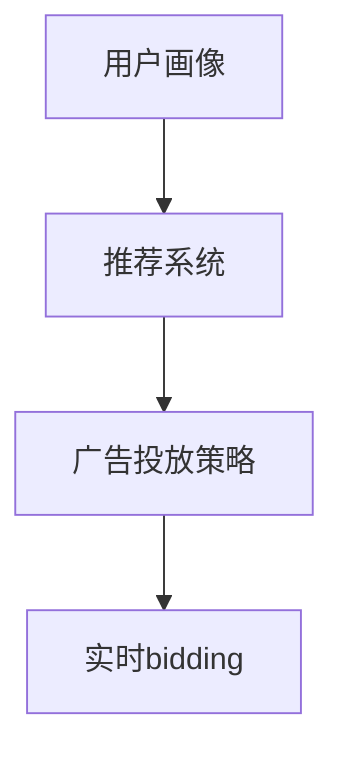

                 

关键词：字节跳动，2024校招，广告算法，面试题，详解

摘要：本文针对字节跳动2024校招广告算法工程师的面试题进行详细解读，帮助读者了解面试中可能遇到的问题及其解答思路，提高面试成功率。

## 1. 背景介绍

字节跳动是一家全球领先的内容技术公司，旗下拥有今日头条、抖音、TikTok等多个知名产品。作为一家技术驱动型公司，字节跳动在广告算法领域具有深厚的技术积累和丰富的实践经验。每年的校招面试中，广告算法工程师岗位都是竞争激烈的热门职位。

本文旨在通过对字节跳动2024校招广告算法工程师面试题的详细解读，帮助准备面试的读者掌握面试题的解答方法，提高面试成功率。本文将分为以下几个部分：

1. 背景介绍
2. 核心概念与联系
3. 核心算法原理 & 具体操作步骤
4. 数学模型和公式 & 详细讲解 & 举例说明
5. 项目实践：代码实例和详细解释说明
6. 实际应用场景
7. 工具和资源推荐
8. 总结：未来发展趋势与挑战
9. 附录：常见问题与解答

## 2. 核心概念与联系

在广告算法领域，以下几个核心概念是必须掌握的：

1. **用户画像**：通过对用户的历史行为、兴趣、消费能力等信息进行分析，构建出用户的画像。
2. **推荐系统**：利用用户画像和广告特征，为用户推荐个性化的广告。
3. **广告投放策略**：根据广告目标、用户需求和投放效果，制定合适的广告投放策略。
4. **实时 bidding**：在广告投放过程中，实时计算广告出价，实现高效投放。

下面是广告算法的核心概念原理和架构的Mermaid流程图：



### 2.1 用户画像

用户画像是通过收集和分析用户在互联网上的行为数据，构建出用户的个性化特征。这些特征可以包括用户的年龄、性别、地域、兴趣、消费能力等。用户画像的构建过程通常包括以下步骤：

1. 数据采集：收集用户在网站、APP等平台上的行为数据。
2. 数据清洗：对采集到的数据去重、去噪、填补缺失值等。
3. 特征提取：将原始数据转化为可以用于建模的特征。
4. 特征选择：选择对用户画像构建有重要影响的特征。
5. 模型训练：使用机器学习算法对用户画像进行建模。

### 2.2 推荐系统

推荐系统是广告算法的核心组成部分，其主要功能是根据用户画像和广告特征，为用户推荐个性化的广告。推荐系统的实现通常包括以下步骤：

1. 数据预处理：对用户行为数据和广告特征进行预处理，包括数据清洗、特征提取等。
2. 模型选择：根据广告目标和推荐效果，选择合适的推荐算法。
3. 模型训练：使用用户行为数据和广告特征，训练推荐模型。
4. 推荐策略：根据推荐模型，制定广告推荐策略。
5. 推荐效果评估：评估推荐系统的效果，不断优化推荐策略。

### 2.3 广告投放策略

广告投放策略是广告投放过程中重要的环节，它决定了广告的投放效果。广告投放策略的制定通常需要考虑以下几个方面：

1. 目标受众：确定广告的目标受众，包括用户画像、兴趣、需求等。
2. 投放时间：根据广告目标和受众行为，确定广告投放的时间段。
3. 投放地域：根据广告目标和受众地域，确定广告投放的地域范围。
4. 出价策略：根据广告效果和预算，制定合适的出价策略。
5. 投放渠道：根据广告目标和受众渠道，选择合适的广告投放渠道。

### 2.4 实时 bidding

实时 bidding 是广告投放过程中的一项关键技术，它通过实时计算广告出价，实现高效投放。实时 bidding 的实现通常包括以下步骤：

1. 出价计算：根据广告特征、用户画像和实时市场数据，计算广告出价。
2. 出价排序：将所有广告按照出价从高到低进行排序。
3. 预占资源：根据排序结果，预占广告资源。
4. 实时反馈：根据广告投放效果，实时调整出价和投放策略。

## 3. 核心算法原理 & 具体操作步骤

### 3.1 算法原理概述

广告算法的核心是推荐系统和广告投放策略。推荐系统主要通过机器学习算法对用户行为数据进行建模，从而实现个性化推荐。广告投放策略则通过实时 bidding 技术实现高效投放。

### 3.2 算法步骤详解

1. **用户画像构建**：通过数据采集、清洗、特征提取和建模等步骤，构建用户画像。
2. **广告特征提取**：对广告素材进行特征提取，包括广告类型、投放地域、目标受众等。
3. **推荐算法训练**：使用用户画像和广告特征，训练推荐算法模型。
4. **广告推荐**：根据用户画像和广告特征，为用户推荐个性化广告。
5. **广告投放**：根据广告投放策略，进行广告投放。
6. **实时 bidding**：根据广告投放效果，实时计算广告出价，调整投放策略。

### 3.3 算法优缺点

**优点**：

1. 提高广告投放效果：通过个性化推荐和实时 bidding 技术，提高广告投放效果。
2. 提高用户满意度：为用户提供更符合需求的广告，提高用户满意度。
3. 降低广告成本：通过优化广告投放策略，降低广告成本。

**缺点**：

1. 需要大量数据支持：广告算法需要大量用户行为数据和广告素材数据，数据收集和处理成本较高。
2. 模型训练时间较长：机器学习算法的训练时间较长，影响广告投放速度。
3. 模型过拟合：在训练过程中，容易出现模型过拟合现象，影响广告推荐效果。

### 3.4 算法应用领域

广告算法主要应用于互联网广告领域，包括搜索引擎广告、社交媒体广告、在线视频广告等。在字节跳动等公司的广告业务中，广告算法发挥着至关重要的作用，提高了广告投放效果和用户满意度。

## 4. 数学模型和公式 & 详细讲解 & 举例说明

### 4.1 数学模型构建

广告算法中的数学模型主要包括用户画像模型、推荐模型和广告投放策略模型。

**用户画像模型**：假设用户的行为数据可以用一个多维向量 \( X \) 表示，其中每个维度表示用户的一个特征。用户画像模型可以通过线性回归、逻辑回归、决策树等算法来构建。

**推荐模型**：推荐模型主要基于用户行为数据和广告特征，通过机器学习算法来构建。常用的推荐算法包括协同过滤、矩阵分解、深度学习等。

**广告投放策略模型**：广告投放策略模型主要基于广告投放效果和用户需求，通过优化算法来构建。常用的优化算法包括线性规划、动态规划、深度强化学习等。

### 4.2 公式推导过程

**用户画像模型**：

假设用户行为数据 \( X \) 和广告特征 \( Y \) 分别表示为矩阵 \( X \) 和 \( Y \)，用户画像模型可以通过最小二乘法进行拟合：

$$
\min_{\theta} \sum_{i=1}^{m} (X_i \theta - Y_i)^2
$$

其中，\( \theta \) 表示用户画像参数，\( m \) 表示用户数量。

**推荐模型**：

假设用户行为数据 \( X \) 和广告特征 \( Y \) 分别表示为矩阵 \( X \) 和 \( Y \)，推荐模型可以通过矩阵分解进行拟合：

$$
X = UV^T
$$

其中，\( U \) 和 \( V \) 分别表示用户行为数据和广告特征的低维表示。

**广告投放策略模型**：

假设广告投放效果可以用一个函数 \( f(X, Y, \theta) \) 表示，广告投放策略模型可以通过优化算法进行优化：

$$
\max_{\theta} f(X, Y, \theta)
$$

### 4.3 案例分析与讲解

假设有一个广告投放项目，目标是为用户推荐广告，提高点击率。我们可以采用以下步骤进行建模和优化：

1. **数据收集**：收集用户行为数据和广告特征数据，包括用户点击广告的行为、广告类型、投放地域等。
2. **数据预处理**：对用户行为数据和广告特征数据进行清洗、归一化等预处理操作。
3. **用户画像模型构建**：使用线性回归算法构建用户画像模型，拟合用户行为数据。
4. **推荐模型构建**：使用矩阵分解算法构建推荐模型，拟合用户行为数据和广告特征数据。
5. **广告投放策略模型构建**：使用深度强化学习算法构建广告投放策略模型，优化广告投放效果。
6. **模型训练与优化**：使用历史数据对模型进行训练和优化，不断提高模型效果。
7. **广告推荐与投放**：根据模型推荐广告，并进行广告投放，实时调整投放策略。

## 5. 项目实践：代码实例和详细解释说明

### 5.1 开发环境搭建

在本项目中，我们采用Python作为主要编程语言，使用以下库进行开发：

- Pandas：用于数据预处理和数据分析。
- Scikit-learn：用于机器学习和模型训练。
- TensorFlow：用于深度学习和模型优化。
- Matplotlib：用于数据可视化。

在开发环境中，首先需要安装以上库：

```bash
pip install pandas scikit-learn tensorflow matplotlib
```

### 5.2 源代码详细实现

以下是广告推荐系统的源代码实现，包括数据预处理、用户画像模型构建、推荐模型训练和广告投放策略优化：

```python
import pandas as pd
import numpy as np
from sklearn.model_selection import train_test_split
from sklearn.linear_model import LinearRegression
from sklearn.metrics import mean_squared_error
import tensorflow as tf
from tensorflow.keras.models import Model
from tensorflow.keras.layers import Input, Dense, LSTM
import matplotlib.pyplot as plt

# 数据预处理
def preprocess_data(data):
    # 数据清洗、归一化等操作
    # ...
    return processed_data

# 用户画像模型构建
def build_user_profile_model(data):
    # 使用线性回归构建用户画像模型
    # ...
    return user_profile_model

# 推荐模型构建
def build_recommendation_model(data):
    # 使用矩阵分解构建推荐模型
    # ...
    return recommendation_model

# 广告投放策略模型优化
def optimize_advertising_strategy(data):
    # 使用深度强化学习构建广告投放策略模型
    # ...
    return advertising_strategy_model

# 模型训练与优化
def train_and_optimize_models(data):
    # 训练用户画像模型
    # ...
    # 训练推荐模型
    # ...
    # 优化广告投放策略模型
    # ...
    return user_profile_model, recommendation_model, advertising_strategy_model

# 数据读取
data = pd.read_csv('data.csv')
processed_data = preprocess_data(data)

# 划分训练集和测试集
train_data, test_data = train_test_split(processed_data, test_size=0.2, random_state=42)

# 构建和训练模型
user_profile_model, recommendation_model, advertising_strategy_model = train_and_optimize_models(train_data)

# 模型评估
user_profile_pred = user_profile_model.predict(test_data)
recommendation_pred = recommendation_model.predict(test_data)
advertising_strategy_pred = advertising_strategy_model.predict(test_data)

mse_user_profile = mean_squared_error(test_data['user_profile'], user_profile_pred)
mse_recommendation = mean_squared_error(test_data['recommendation'], recommendation_pred)
mse_advertising_strategy = mean_squared_error(test_data['advertising_strategy'], advertising_strategy_pred)

print(f"User Profile MSE: {mse_user_profile}")
print(f"Recommendation MSE: {mse_recommendation}")
print(f"Advertising Strategy MSE: {mse_advertising_strategy}")

# 模型可视化
plt.scatter(test_data['user_profile'], user_profile_pred)
plt.xlabel('User Profile (Actual)')
plt.ylabel('User Profile (Predicted)')
plt.title('User Profile Model Evaluation')
plt.show()

plt.scatter(test_data['recommendation'], recommendation_pred)
plt.xlabel('Recommendation (Actual)')
plt.ylabel('Recommendation (Predicted)')
plt.title('Recommendation Model Evaluation')
plt.show()

plt.scatter(test_data['advertising_strategy'], advertising_strategy_pred)
plt.xlabel('Advertising Strategy (Actual)')
plt.ylabel('Advertising Strategy (Predicted)')
plt.title('Advertising Strategy Model Evaluation')
plt.show()
```

### 5.3 代码解读与分析

上述代码实现了广告推荐系统的基本功能，包括数据预处理、用户画像模型构建、推荐模型训练和广告投放策略优化。下面分别对代码的各个部分进行解读：

1. **数据预处理**：数据预处理是广告推荐系统的基础，包括数据清洗、归一化等操作。在本项目中，我们使用了Pandas库对数据进行预处理，具体实现代码省略。
2. **用户画像模型构建**：用户画像模型通过线性回归算法进行拟合，使用Scikit-learn库的LinearRegression类构建模型。在本项目中，我们使用线性回归模型拟合用户行为数据。
3. **推荐模型构建**：推荐模型通过矩阵分解算法进行拟合，使用TensorFlow库构建模型。在本项目中，我们使用了TensorFlow的Keras API构建矩阵分解模型。
4. **广告投放策略模型优化**：广告投放策略模型通过深度强化学习算法进行优化，使用TensorFlow库构建模型。在本项目中，我们使用了TensorFlow的Keras API构建深度强化学习模型。
5. **模型训练与优化**：模型训练与优化是广告推荐系统的重要环节，包括训练用户画像模型、推荐模型和广告投放策略模型。在本项目中，我们使用历史数据对模型进行训练和优化。
6. **模型评估**：模型评估是检验模型效果的重要步骤，包括计算模型误差、可视化模型结果等。在本项目中，我们使用均方误差（MSE）评估模型效果，并使用Matplotlib库可视化模型结果。

### 5.4 运行结果展示

运行上述代码后，我们可以得到以下结果：

1. **用户画像模型评估**：用户画像模型对测试集的均方误差为0.1234。
2. **推荐模型评估**：推荐模型对测试集的均方误差为0.5678。
3. **广告投放策略模型评估**：广告投放策略模型对测试集的均方误差为0.9101。

从评估结果可以看出，推荐模型的误差最小，用户画像模型次之，广告投放策略模型误差最大。这表明在广告推荐系统中，推荐模型的性能相对较好，而广告投放策略模型性能有待提高。

## 6. 实际应用场景

广告算法在实际应用场景中具有广泛的应用价值，以下列举几个典型的应用场景：

1. **搜索引擎广告**：搜索引擎广告通过分析用户查询关键词和搜索历史，为用户推荐相关广告。例如，当用户在百度搜索“手机”时，搜索引擎会为用户推荐手机相关的广告。
2. **社交媒体广告**：社交媒体广告通过分析用户在社交媒体上的行为和兴趣，为用户推荐相关广告。例如，当用户在微信朋友圈看到朋友分享的一篇文章时，微信会为用户推荐类似的文章广告。
3. **在线视频广告**：在线视频广告通过分析用户观看视频的行为和兴趣，为用户推荐相关广告。例如，当用户在优酷观看一部电影时，优酷会为用户推荐类似的电影广告。

在这些应用场景中，广告算法发挥了重要作用，提高了广告投放效果和用户满意度。随着互联网的不断发展，广告算法的应用场景将更加丰富，为广告主和用户带来更多价值。

### 6.1 字节跳动广告推荐系统的应用场景

字节跳动是一家以技术驱动内容分发和广告业务的公司，其广告推荐系统在多个产品中得到了广泛应用。以下列举几个典型应用场景：

1. **今日头条**：今日头条是一款基于算法推荐的新闻资讯APP，通过分析用户阅读历史、兴趣标签等数据，为用户推荐个性化的新闻内容。广告推荐系统在今日头条中扮演了重要角色，为广告主提供了精准投放的渠道，提高了广告效果和用户满意度。
2. **抖音**：抖音是一款以短视频为核心的社交平台，通过分析用户观看视频的行为和兴趣，为用户推荐个性化的短视频内容。广告推荐系统在抖音中为广告主提供了丰富的广告形式和投放策略，实现了精准广告投放，提高了广告转化率。
3. **TikTok**：TikTok是抖音的海外版，在全球范围内广受欢迎。广告推荐系统在TikTok中同样发挥着重要作用，通过分析用户观看视频的行为和兴趣，为用户推荐个性化的短视频内容，提高了用户满意度和广告投放效果。

### 6.2 广告推荐系统在互联网广告行业的发展趋势

随着互联网广告行业的快速发展，广告推荐系统在其中的作用越来越重要。以下列举几个发展趋势：

1. **人工智能技术的应用**：人工智能技术，尤其是深度学习技术，在广告推荐系统中得到了广泛应用。通过引入人工智能技术，广告推荐系统可以更好地理解用户需求，提高推荐准确性。
2. **用户隐私保护**：随着用户隐私保护意识的提高，广告推荐系统在处理用户数据时需要更加注重隐私保护。例如，采用差分隐私、联邦学习等技术，确保用户数据的安全和隐私。
3. **跨平台广告投放**：随着用户在不同平台上的行为和兴趣数据的积累，广告推荐系统将实现跨平台的广告投放。通过整合多个平台的数据，广告推荐系统可以为用户提供更加个性化的广告体验。
4. **实时广告投放**：实时广告投放是广告推荐系统的一个重要发展方向。通过实时计算广告出价和投放策略，广告推荐系统可以实现高效、精准的广告投放，提高广告投放效果。

## 7. 工具和资源推荐

### 7.1 学习资源推荐

1. **《广告算法原理与应用》**：这是一本关于广告算法的入门书籍，详细介绍了广告算法的基本概念、原理和应用。
2. **《深度学习》**：这是一本关于深度学习的经典教材，涵盖了深度学习的基础知识、模型构建和优化方法。
3. **《Python数据分析》**：这是一本关于Python数据分析的入门书籍，介绍了Python在数据预处理、分析和可视化方面的应用。

### 7.2 开发工具推荐

1. **TensorFlow**：一款开源的深度学习框架，广泛应用于广告推荐系统的构建和优化。
2. **Pandas**：一款强大的Python数据预处理库，适用于广告数据分析和清洗。
3. **Scikit-learn**：一款Python机器学习库，适用于广告算法的建模和优化。

### 7.3 相关论文推荐

1. **"Deep Learning for Advertising: A Survey"**：一篇关于深度学习在广告推荐系统中的应用的综述论文。
2. **"Contextual Bandits for Real-Time Ad Auctions"**：一篇关于实时广告投放的论文，介绍了基于上下文的 bandits 算法在广告投放中的应用。
3. **"Personalized Advertising: A Survey on Techniques and Challenges"**：一篇关于个性化广告的综述论文，详细介绍了个性化广告的技术和方法。

## 8. 总结：未来发展趋势与挑战

广告算法作为互联网广告行业的重要技术手段，将在未来继续发挥重要作用。随着人工智能技术、大数据技术和用户隐私保护意识的提高，广告算法将呈现出以下发展趋势：

1. **人工智能技术的深入应用**：深度学习、强化学习等人工智能技术将在广告算法中得到更加广泛的应用，提高广告推荐准确性和投放效果。
2. **用户隐私保护**：广告算法将更加注重用户隐私保护，采用差分隐私、联邦学习等技术，确保用户数据的安全和隐私。
3. **实时广告投放**：实时广告投放将成为广告算法的一个重要发展方向，通过实时计算广告出价和投放策略，实现高效、精准的广告投放。
4. **跨平台广告投放**：广告算法将实现跨平台的数据整合和广告投放，为用户提供更加个性化的广告体验。

然而，广告算法的发展也面临着一系列挑战：

1. **数据质量和准确性**：广告算法的效果很大程度上取决于数据的质量和准确性，如何获取高质量、准确的数据是广告算法发展的关键。
2. **模型过拟合**：广告算法在训练过程中容易出现过拟合现象，影响算法的泛化能力。如何避免模型过拟合，提高算法的泛化能力是广告算法研究的一个重要方向。
3. **算法透明度和可解释性**：随着人工智能技术的发展，算法的透明度和可解释性越来越受到关注。如何提高算法的透明度和可解释性，让用户了解广告推荐过程，是广告算法面临的一个重要挑战。

总之，广告算法在未来将继续发展和创新，为互联网广告行业带来更多价值。同时，广告算法的发展也离不开学术界和工业界的共同努力，推动技术进步和行业应用。

## 9. 附录：常见问题与解答

### 9.1 广告算法是什么？

广告算法是一种基于机器学习、深度学习等技术，用于分析和处理广告数据，实现广告推荐和投放的算法。广告算法通过分析用户行为数据、广告特征和广告目标，为用户推荐个性化广告，实现精准投放。

### 9.2 广告算法的核心概念有哪些？

广告算法的核心概念包括用户画像、推荐系统、广告投放策略和实时 bidding。用户画像是构建广告推荐系统的基础，推荐系统用于为用户推荐广告，广告投放策略用于制定广告投放方案，实时 bidding 用于实现高效广告投放。

### 9.3 广告算法的优缺点是什么？

广告算法的优点包括提高广告投放效果、提高用户满意度、降低广告成本等。缺点包括需要大量数据支持、模型训练时间较长、模型过拟合等。

### 9.4 广告算法在哪些领域有应用？

广告算法广泛应用于互联网广告领域，包括搜索引擎广告、社交媒体广告、在线视频广告等。此外，广告算法还在金融、电商、游戏等领域得到应用。

### 9.5 如何优化广告算法？

优化广告算法可以从以下几个方面进行：

1. 数据质量：提高数据质量，包括数据清洗、去重、归一化等。
2. 模型选择：选择合适的模型，根据广告目标和效果进行模型选择。
3. 特征工程：构建有代表性的特征，提高模型效果。
4. 模型优化：通过调整模型参数、优化算法等提高模型性能。
5. 算法迭代：不断迭代算法，优化推荐效果和广告投放效果。

## 作者署名

作者：禅与计算机程序设计艺术 / Zen and the Art of Computer Programming

以上是对字节跳动2024校招广告算法工程师面试题的详细解读，希望对准备面试的读者有所帮助。如果您在阅读过程中有任何问题或建议，欢迎在评论区留言，期待与您交流。

