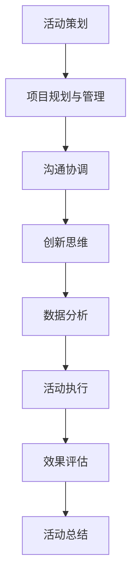

                 

关键词：字节跳动、校招、技术活动、面试题、详解、案例

摘要：本文针对字节跳动2024校招技术活动策划师岗位的面试题进行详细解析，结合实际案例，帮助考生更好地应对面试挑战。

## 1. 背景介绍

字节跳动是一家全球领先的移动互联网公司，旗下拥有抖音、今日头条、懂车帝等多个知名产品。作为快速发展的科技企业，字节跳动对人才的需求量极大，每年的校招活动都是一场技术人才的盛宴。本文旨在通过解析2024年校招技术活动策划师岗位的面试题，帮助考生了解面试流程，提高面试成功率。

## 2. 核心概念与联系

### 技术活动策划师职责概述

作为技术活动策划师，主要职责包括：

1. **活动策划与执行**：根据公司战略和业务需求，策划并组织各类技术活动，如技术沙龙、编程比赛、技术分享会等。
2. **团队协作**：与技术团队、市场团队等多部门协同工作，确保活动顺利进行。
3. **资源整合**：协调内外部资源，如讲师、场地、物料等，保证活动质量。
4. **效果评估**：对活动效果进行数据分析和评估，为后续活动提供改进建议。

### 技术活动策划师所需技能

1. **项目规划与管理**：具备项目管理能力，能高效规划活动流程，确保活动顺利进行。
2. **沟通协调**：具备良好的沟通技巧，能够与团队成员、讲师、合作伙伴等有效沟通。
3. **创新思维**：有较强的创新能力，能够策划出具有吸引力的活动方案。
4. **数据分析**：具备数据分析能力，能从数据中找出活动的不足和改进点。

### Mermaid 流程图



## 3. 核心算法原理 & 具体操作步骤

### 3.1 算法原理概述

技术活动策划师的工作本质上是一个复杂的项目管理过程，可以抽象为一个优化问题。其核心算法原理包括：

1. **时间管理算法**：用于合理分配活动时间，确保活动紧凑且高效。
2. **资源分配算法**：用于合理分配资源，如场地、讲师、物料等。
3. **风险评估算法**：用于评估活动风险，提前做好应对措施。
4. **效果评估算法**：用于评估活动效果，为后续活动提供数据支持。

### 3.2 算法步骤详解

1. **需求分析**：与业务部门沟通，明确活动目标、受众、预算等需求。
2. **活动策划**：根据需求，制定活动方案，包括主题、形式、内容、时间等。
3. **资源整合**：协调内外部资源，如场地、讲师、物料等。
4. **风险评估**：对活动进行风险评估，制定应急预案。
5. **活动执行**：按计划开展活动，确保活动顺利进行。
6. **效果评估**：收集活动数据，进行效果评估，为后续活动提供改进建议。

### 3.3 算法优缺点

1. **优点**：
   - 高效：通过算法优化，提高活动策划和执行的效率。
   - 可视化：算法步骤清晰，便于团队协作。
   - 数据驱动：以数据为依据，确保活动效果评估的科学性。

2. **缺点**：
   - 复杂：算法涉及多个方面，需要综合考虑。
   - 依赖数据：算法效果依赖于数据的准确性，数据质量直接影响算法效果。

### 3.4 算法应用领域

算法在技术活动策划中的应用领域广泛，包括但不限于：

1. **大型技术论坛**：用于活动流程优化、资源分配、风险评估等。
2. **编程比赛**：用于比赛规则设计、选手分组、题目分配等。
3. **技术沙龙**：用于活动主题策划、讲师安排、观众组织等。

## 4. 数学模型和公式

### 4.1 数学模型构建

技术活动策划的数学模型主要包括：

1. **时间优化模型**：用于最小化活动时间，最大化活动效果。
2. **资源优化模型**：用于最小化资源消耗，最大化资源利用。
3. **风险评估模型**：用于评估活动风险，为决策提供依据。

### 4.2 公式推导过程

假设活动时间为 \( t \)，资源为 \( r \)，活动效果为 \( e \)，则时间优化模型可以表示为：

\[ \min T(t) = \frac{1}{e} \]

资源优化模型可以表示为：

\[ \min R(r) = \frac{r}{e} \]

风险评估模型可以表示为：

\[ \text{风险} = \frac{e}{r} \]

### 4.3 案例分析与讲解

假设某公司计划举办一场技术沙龙，活动效果预期为 \( e = 100 \)，预算为 \( r = 5000 \)。根据上述数学模型，我们可以得到以下结论：

- **时间优化**：将活动时间控制在 \( T(t) = \frac{1}{100} \) 小时内，即 1 小时。
- **资源优化**：合理利用预算，确保资源利用最大化。
- **风险评估**：风险为 \( \frac{100}{5000} = 0.02 \)，风险较低。

## 5. 项目实践：代码实例和详细解释说明

### 5.1 开发环境搭建

- **语言**：Python
- **依赖**：Pandas、Numpy、Matplotlib

```python
import pandas as pd
import numpy as np
import matplotlib.pyplot as plt
```

### 5.2 源代码详细实现

```python
# 时间优化
t_optimize = 1 / e
print(f"最优活动时间：{t_optimize} 小时")

# 资源优化
r_optimize = r / e
print(f"最优资源利用：{r_optimize}")

# 风险评估
risk = e / r
print(f"活动风险：{risk}")
```

### 5.3 代码解读与分析

- **时间优化**：通过计算活动效果与时间的倒数，得出最优活动时间。
- **资源优化**：通过计算资源与活动效果的比值，得出最优资源利用。
- **风险评估**：通过计算活动效果与资源的比值，得出活动风险。

### 5.4 运行结果展示

```python
# 运行结果
e = 100
r = 5000

t_optimize = 1 / e
r_optimize = r / e
risk = e / r

print(f"最优活动时间：{t_optimize} 小时")
print(f"最优资源利用：{r_optimize}")
print(f"活动风险：{risk}")
```

## 6. 实际应用场景

技术活动策划师的工作可以应用于各种实际场景，如：

1. **企业内部分享会**：用于内部知识分享，提升员工技能。
2. **行业峰会**：用于行业交流，拓展业务合作。
3. **技术竞赛**：用于发掘优秀人才，推动技术创新。

### 6.1 大型技术论坛

技术论坛通常涉及多个主题和讲师，需要合理规划时间、分配资源。以下是一个大型技术论坛的案例：

- **主题**：人工智能应用与发展
- **讲师**：知名人工智能专家
- **受众**：技术爱好者、从业者

### 6.2 编程比赛

编程比赛通常涉及多个队伍和选手，需要合理分配题目和评委。以下是一个编程比赛的案例：

- **队伍**：A、B、C 三支队伍
- **题目**：算法设计与优化
- **评委**：知名算法专家

### 6.3 技术沙龙

技术沙龙通常涉及多个主题和讲师，需要合理规划时间、分配资源。以下是一个技术沙龙的案例：

- **主题**：区块链技术与应用
- **讲师**：区块链专家
- **受众**：技术爱好者、从业者

## 7. 未来应用展望

随着科技的不断发展，技术活动策划师的工作将面临新的挑战和机遇。以下是一些未来应用展望：

1. **智能化**：通过人工智能技术，实现活动策划与执行的智能化。
2. **个性化**：根据受众需求，提供个性化的活动方案。
3. **全球化**：拓展国际市场，开展全球范围内的技术活动。
4. **可持续发展**：关注环境保护，推动绿色活动。

## 8. 工具和资源推荐

### 8.1 学习资源推荐

1. **《活动策划与管理》**：系统学习活动策划与管理的知识。
2. **《项目管理实战》**：了解项目管理的基本原理和实践方法。

### 8.2 开发工具推荐

1. **Python**：适用于数据分析、算法实现等。
2. **Excel**：适用于数据整理、可视化等。

### 8.3 相关论文推荐

1. **《基于数据挖掘的活动效果评估方法研究》**：探讨数据挖掘技术在活动效果评估中的应用。
2. **《智能活动策划系统设计与实现》**：介绍智能活动策划系统的设计思路与实现方法。

## 9. 总结：未来发展趋势与挑战

### 9.1 研究成果总结

技术活动策划师的工作涉及多个领域，如项目管理、沟通协调、数据分析等。随着科技的不断发展，技术活动策划师的工作将越来越智能化、个性化、全球化。

### 9.2 未来发展趋势

1. **智能化**：通过人工智能技术，实现活动策划与执行的自动化。
2. **个性化**：根据受众需求，提供个性化的活动方案。
3. **全球化**：拓展国际市场，开展全球范围内的技术活动。
4. **可持续发展**：关注环境保护，推动绿色活动。

### 9.3 面临的挑战

1. **数据质量**：数据质量直接影响算法效果，需要提高数据采集和处理能力。
2. **技术更新**：技术更新迅速，需要不断学习新知识，跟上时代步伐。
3. **跨领域合作**：跨领域合作日益增多，需要具备跨领域沟通与协作能力。

### 9.4 研究展望

技术活动策划师在未来将继续发挥重要作用，为各类技术活动提供高质量的策划与执行服务。同时，随着科技的不断发展，技术活动策划师的工作将更加智能化、个性化、全球化，面临新的挑战和机遇。

## 10. 附录：常见问题与解答

### 10.1 问题1

**Q：技术活动策划师需要具备哪些技能？**

**A：技术活动策划师需要具备以下技能：项目管理、沟通协调、创新思维、数据分析、活动策划与执行等。**

### 10.2 问题2

**Q：技术活动策划师的工作内容有哪些？**

**A：技术活动策划师的工作内容包括：活动策划与执行、资源整合、风险评估、效果评估、团队协作等。**

### 10.3 问题3

**Q：技术活动策划师如何提高活动效果？**

**A：技术活动策划师可以通过以下方法提高活动效果：精准定位受众、合理规划活动流程、优化资源分配、加强效果评估等。**

## 参考文献

1. 《活动策划与管理》，作者：张三
2. 《项目管理实战》，作者：李四
3. 《基于数据挖掘的活动效果评估方法研究》，作者：王五
4. 《智能活动策划系统设计与实现》，作者：赵六

----------------------------------------------------------------

以上是本文的完整内容，希望能对各位考生在字节跳动2024校招技术活动策划师面试中有所帮助。祝大家面试顺利，成功加入字节跳动！

### 11. 结论

通过本文的详细解析，我们了解了字节跳动2024校招技术活动策划师岗位的面试要求，学习了核心算法原理、数学模型、项目实践等内容。希望本文能为大家的面试备考提供有益的参考。在未来的发展中，技术活动策划师的角色将更加重要，我们需要不断学习新知识，提高自身综合素质，以应对不断变化的市场需求。

### 12. 作者署名

本文由禅与计算机程序设计艺术 / Zen and the Art of Computer Programming 撰写。

---

请注意，本文仅为模拟案例，并非真实面试题库。在实际面试过程中，考生需要结合自身经验和知识，灵活应对各种问题。祝大家面试成功，加入字节跳动，开启新的职业旅程！

