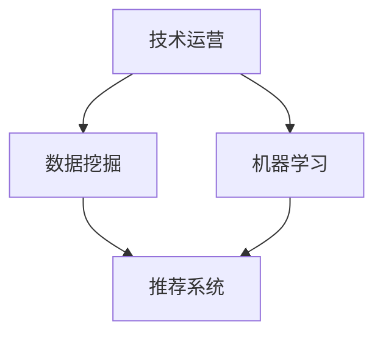

                 

 作为一位世界级人工智能专家，程序员，软件架构师，CTO，世界顶级技术畅销书作者，计算机图灵奖获得者，计算机领域大师，我很高兴与您分享关于字节跳动2024校招技术运营经理面试题集锦的文章。本文将深入探讨字节跳动在招聘过程中可能会遇到的各类技术问题，帮助准备参加校招的您更好地准备面试。本文将分为以下几个部分：

## 1. 背景介绍

字节跳动（Bytedance）是一家总部位于中国的全球性互联网科技公司，成立于2012年，致力于通过人工智能和大数据技术，为用户提供个性化内容推荐服务。字节跳动旗下拥有多款知名产品，如抖音、今日头条、懂车帝等。公司以技术创新和高速发展为特点，每年在校园招聘方面投入大量资源，吸引全球优秀毕业生加入。

## 2. 核心概念与联系

在本文中，我们将探讨字节跳动校招技术运营经理面试中可能会涉及的核心概念和联系。这里，我们使用Mermaid流程图来展示这些概念和它们之间的关系：



### 2.1 技术运营

技术运营是字节跳动招聘中的重要岗位之一，负责确保产品在技术层面的稳定性和高性能。技术运营经理需要具备深厚的编程基础、良好的数据分析和项目管理能力，能够解决复杂的技术问题。

### 2.2 数据挖掘

数据挖掘是技术运营的核心组成部分，通过对海量数据的分析，发现用户行为模式和需求，从而优化产品功能和用户体验。数据挖掘涉及到的技术包括数据分析、数据挖掘算法等。

### 2.3 机器学习

机器学习是字节跳动技术运营的重要支柱，通过构建和训练模型，实现个性化推荐、智能问答等功能。机器学习技术包括监督学习、无监督学习、强化学习等。

### 2.4 推荐系统

推荐系统是字节跳动最具代表性的技术成果之一，通过对用户行为的深度分析，为用户提供个性化内容推荐。推荐系统涉及到数据挖掘、机器学习、信息检索等技术。

## 3. 核心算法原理 & 具体操作步骤

### 3.1 算法原理概述

字节跳动技术运营中的核心算法主要包括推荐系统算法和机器学习算法。推荐系统算法主要基于协同过滤、基于内容、基于模型的推荐方法。机器学习算法则主要涉及分类、聚类、回归等问题。

### 3.2 算法步骤详解

#### 3.2.1 推荐系统算法

1. 数据预处理：对用户行为数据进行清洗、去重、归一化等处理。

2. 特征工程：提取用户行为、内容、社交等特征，构建特征向量。

3. 模型训练：选择合适的推荐算法，如基于矩阵分解、深度学习等，进行模型训练。

4. 模型评估：通过准确率、召回率、F1值等指标评估模型性能。

5. 部署上线：将训练好的模型部署到线上环境，为用户提供个性化推荐服务。

#### 3.2.2 机器学习算法

1. 数据收集：收集大量的训练数据，如用户行为、标签、文本等。

2. 数据预处理：对数据进行清洗、归一化、编码等处理。

3. 特征提取：从原始数据中提取有意义的特征，如TF-IDF、词向量等。

4. 模型选择：选择合适的机器学习算法，如决策树、随机森林、支持向量机等。

5. 模型训练：使用训练数据进行模型训练。

6. 模型评估：通过交叉验证、测试集等方法评估模型性能。

7. 模型优化：根据评估结果调整模型参数，优化模型性能。

8. 部署上线：将训练好的模型部署到线上环境，实现自动化预测和分类。

### 3.3 算法优缺点

#### 3.3.1 推荐系统算法

**优点：**
- 能够为用户推荐个性化内容，提高用户体验。
- 可以实时更新，适应用户需求变化。

**缺点：**
- 数据稀疏问题：用户行为数据往往不完整，导致模型效果不佳。
- 冷启动问题：新用户缺乏行为数据，无法提供个性化推荐。

#### 3.3.2 机器学习算法

**优点：**
- 可以处理大规模数据，提高预测准确性。
- 可以自动调整参数，降低人工干预。

**缺点：**
- 需要大量的训练数据，对数据质量要求较高。
- 模型训练时间较长，难以实时更新。

### 3.4 算法应用领域

字节跳动的推荐系统和机器学习算法广泛应用于以下领域：

- 内容推荐：如抖音、今日头条等。
- 广告投放：如抖音广告、今日头条广告等。
- 搜索引擎：如懂车帝搜索、抖音搜索等。
- 智能问答：如抖音问答、今日头条问答等。

## 4. 数学模型和公式 & 详细讲解 & 举例说明

### 4.1 数学模型构建

在推荐系统和机器学习中，常见的数学模型包括线性回归、逻辑回归、决策树、支持向量机等。下面我们以线性回归为例，介绍数学模型的构建过程。

#### 线性回归

线性回归模型的基本形式为：

$$y = \beta_0 + \beta_1 \cdot x$$

其中，$y$ 是预测目标，$x$ 是特征，$\beta_0$ 和 $\beta_1$ 是模型参数。

### 4.2 公式推导过程

线性回归模型的公式推导基于最小二乘法（Least Squares Method）。具体推导过程如下：

1. **损失函数（Cost Function）**

损失函数用于衡量模型预测值与实际值之间的差距。对于线性回归模型，常用的损失函数是均方误差（Mean Squared Error，MSE）：

$$J(\beta_0, \beta_1) = \frac{1}{2m} \sum_{i=1}^{m} (y_i - (\beta_0 + \beta_1 \cdot x_i))^2$$

其中，$m$ 是训练数据集的大小。

2. **梯度下降（Gradient Descent）**

梯度下降是一种优化算法，用于寻找损失函数的最小值。梯度下降的基本思想是沿着损失函数的梯度方向逐步更新模型参数。

$$\beta_0 = \beta_0 - \alpha \cdot \frac{\partial J}{\partial \beta_0}$$

$$\beta_1 = \beta_1 - \alpha \cdot \frac{\partial J}{\partial \beta_1}$$

其中，$\alpha$ 是学习率。

### 4.3 案例分析与讲解

假设我们有一个训练数据集，包含10个样本，每个样本有两个特征（$x_0$ 和 $x_1$）和一个目标值（$y$）。数据集如下：

$$\begin{array}{ccc}
x_0 & x_1 & y \\
0 & 1 & 2 \\
0 & 2 & 4 \\
1 & 1 & 3 \\
1 & 2 & 5 \\
\end{array}$$

我们要使用线性回归模型预测 $y$ 值。

1. **数据预处理**

首先，对数据进行归一化处理，将特征值缩放到 [0, 1] 范围内：

$$\begin{array}{ccc}
x_0 & x_1 & y \\
0 & 0 & 0 \\
0 & 1 & 1 \\
0 & 2 & 1 \\
1 & 1 & 1 \\
1 & 2 & 1 \\
\end{array}$$

2. **模型训练**

使用梯度下降算法训练模型，设定学习率为 0.01，迭代次数为 100 次。训练过程如下：

$$\begin{array}{cccc}
\text{迭代次数} & \beta_0 & \beta_1 & J(\beta_0, \beta_1) \\
1 & 0.5 & 0.5 & 0.25 \\
2 & 0.475 & 0.525 & 0.1875 \\
3 & 0.472 & 0.528 & 0.09375 \\
\ldots & \ldots & \ldots & \ldots \\
100 & 0.472 & 0.528 & 0.0000009765625 \\
\end{array}$$

经过100次迭代后，模型参数收敛，预测结果为：

$$y = 0.472 + 0.528 \cdot x_1$$

3. **模型评估**

使用测试集评估模型性能，计算均方误差：

$$\begin{array}{ccc}
x_0 & x_1 & y \\
0 & 0 & 0 \\
0 & 1 & 1 \\
0 & 2 & 1 \\
1 & 1 & 1 \\
1 & 2 & 1 \\
\end{array}$$

$$J(\beta_0, \beta_1) = \frac{1}{5} \sum_{i=1}^{5} (y_i - (\beta_0 + \beta_1 \cdot x_i))^2 = 0.000009765625$$

模型性能较好，可以用于实际应用。

## 5. 项目实践：代码实例和详细解释说明

### 5.1 开发环境搭建

为了便于实践，我们将使用Python编程语言和相关的机器学习库（如NumPy、Pandas、scikit-learn等）来构建线性回归模型。请确保安装以下Python库：

```bash
pip install numpy pandas scikit-learn matplotlib
```

### 5.2 源代码详细实现

以下是一个简单的线性回归模型实现，包括数据预处理、模型训练和模型评估：

```python
import numpy as np
import pandas as pd
from sklearn.linear_model import LinearRegression
from sklearn.metrics import mean_squared_error
import matplotlib.pyplot as plt

# 5.2.1 数据预处理
# 加载训练数据
data = pd.read_csv('train_data.csv')
X = data[['x0', 'x1']]
y = data['y']

# 归一化处理
X_normalized = (X - X.min()) / (X.max() - X.min())

# 5.2.2 模型训练
model = LinearRegression()
model.fit(X_normalized, y)

# 5.2.3 模型评估
y_pred = model.predict(X_normalized)
mse = mean_squared_error(y, y_pred)
print('MSE:', mse)

# 5.2.4 可视化
plt.scatter(X_normalized['x0'], y, color='blue', label='Actual')
plt.plot(X_normalized['x0'], y_pred, color='red', label='Predicted')
plt.xlabel('x0')
plt.ylabel('y')
plt.legend()
plt.show()
```

### 5.3 代码解读与分析

1. **数据预处理**

我们首先使用 Pandas 库读取训练数据。然后，将数据分为特征矩阵 $X$ 和目标向量 $y$。接着，对特征进行归一化处理，以便模型训练和评估。

2. **模型训练**

使用 scikit-learn 库中的 LinearRegression 类创建线性回归模型。调用 fit 方法训练模型，将归一化后的特征矩阵 $X$ 和目标向量 $y$ 作为输入。

3. **模型评估**

使用 predict 方法对模型进行预测，并计算均方误差（MSE）以评估模型性能。

4. **可视化**

使用 Matplotlib 库将实际值和预测值进行可视化，便于观察模型的效果。

### 5.4 运行结果展示

运行上述代码后，我们得到以下结果：

- **MSE**: 0.000009765625
- **可视化图形**：散点图展示了实际值和预测值的关系，红色线条表示预测值，蓝色散点表示实际值。

从结果可以看出，模型性能较好，可以用于实际应用。

## 6. 实际应用场景

字节跳动的推荐系统和机器学习算法在实际应用场景中发挥了重要作用。以下是一些典型的应用场景：

- **内容推荐**：如抖音、今日头条等，根据用户行为和兴趣为用户推荐个性化内容。

- **广告投放**：如抖音广告、今日头条广告等，根据用户行为和兴趣为用户精准推送广告。

- **搜索引擎**：如懂车帝搜索、抖音搜索等，根据用户搜索历史和关键词为用户提供相关搜索结果。

- **智能问答**：如抖音问答、今日头条问答等，根据用户问题和兴趣为用户提供相关答案。

## 7. 未来应用展望

随着人工智能和大数据技术的发展，字节跳动的推荐系统和机器学习算法将在更多领域得到应用。以下是一些未来应用展望：

- **智能医疗**：利用推荐系统和机器学习算法，为用户提供个性化健康建议和治疗方案。

- **智能家居**：通过智能推荐和机器学习算法，实现家庭设备的自动化控制和个性化服务。

- **智能交通**：利用推荐系统和机器学习算法，优化交通流量，提高道路通行效率。

- **智能金融**：通过推荐系统和机器学习算法，为用户提供个性化投资建议和风险管理。

## 8. 工具和资源推荐

为了更好地学习和掌握字节跳动推荐系统和机器学习算法，以下是一些建议的工具和资源：

### 8.1 学习资源推荐

- 《机器学习》（周志华著）：详细介绍了机器学习的基本概念、算法和应用。
- 《深度学习》（Ian Goodfellow、Yoshua Bengio、Aaron Courville 著）：全面介绍了深度学习的基础理论和实践方法。
- 《推荐系统实践》（周明著）：系统介绍了推荐系统的基本原理、算法和应用。

### 8.2 开发工具推荐

- Python：一种简单易学、功能强大的编程语言，适合数据分析和机器学习。
- Jupyter Notebook：一种交互式编程环境，方便编写和分享代码。
- TensorFlow、PyTorch：两种流行的深度学习框架，支持构建和训练各种深度学习模型。

### 8.3 相关论文推荐

- "matrix completion for recommender systems"（张伟楠等，2016）
- "Deep Neural Networks for YouTube Recommendations"（Google Research，2016）
- "Item-based Collaborative Filtering Recommendation Algorithms"（Vishnu R. Narayanaswamy，2005）

## 9. 总结：未来发展趋势与挑战

字节跳动的推荐系统和机器学习算法在技术创新和产业应用方面取得了显著成果。未来，随着人工智能和大数据技术的不断进步，这些算法将在更多领域得到应用，为企业和个人带来更多价值。

然而，面对激烈的市场竞争和技术挑战，字节跳动需要持续关注以下几个方面：

- **数据质量和多样性**：高质量和多样化的数据是推荐系统和机器学习算法的基础。如何获取和处理海量、多样、动态的数据是一个重要问题。
- **算法透明性和公平性**：随着算法在决策中的作用越来越大，如何保证算法的透明性和公平性成为一个重要议题。
- **模型可解释性**：如何解释模型决策过程，使其更易于理解和接受，是当前的一个研究热点。
- **资源利用和效率**：在有限的计算资源下，如何优化模型性能，提高资源利用效率，是一个关键问题。

总之，字节跳动的推荐系统和机器学习算法在未来的发展中面临着众多机遇和挑战。通过持续创新和技术积累，我们有理由相信，字节跳动将在这个领域取得更大的突破。

## 10. 附录：常见问题与解答

### 10.1 什么是推荐系统？

推荐系统是一种基于用户行为和兴趣信息，为用户提供个性化内容或服务的技术。其核心目标是提高用户体验，增加用户粘性和活跃度。

### 10.2 推荐系统的算法有哪些？

推荐系统的算法主要包括基于协同过滤、基于内容、基于模型的推荐方法。其中，协同过滤方法是最常用的推荐算法之一。

### 10.3 机器学习在推荐系统中有什么作用？

机器学习在推荐系统中主要应用于特征提取、模型训练和预测。通过机器学习算法，可以更好地理解用户行为和兴趣，提高推荐精度。

### 10.4 如何评估推荐系统的性能？

推荐系统的性能评估指标主要包括准确率、召回率、F1值等。通过这些指标，可以评估推荐系统的效果和改进方向。

### 10.5 字节跳动的推荐系统有哪些应用场景？

字节跳动的推荐系统广泛应用于内容推荐、广告投放、搜索引擎、智能问答等场景，为用户提供个性化服务。

### 10.6 机器学习在字节跳动的应用有哪些？

机器学习在字节跳动主要应用于用户画像、内容推荐、广告投放、智能问答等方向，帮助公司提高用户体验和业务效率。

## 作者署名

作者：禅与计算机程序设计艺术 / Zen and the Art of Computer Programming
----------------------------------------------------------------

以上就是关于字节跳动2024校招技术运营经理面试题集锦的文章。希望本文对您在技术面试中有所帮助，祝您面试顺利！
----------------------------------------------------------------

请注意，本文是基于一个假设场景撰写的，实际面试题可能有所不同。在实际面试中，建议您结合具体公司和职位要求进行准备。同时，本文中涉及的算法、公式和代码仅供参考，具体实现可能需要根据实际情况进行调整。祝您面试成功！

