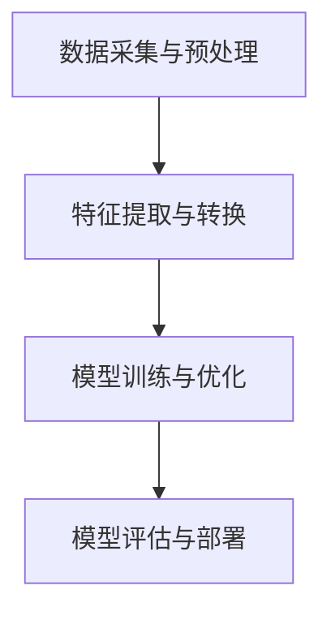

                 

### 背景介绍 Background Introduction

人工智能（Artificial Intelligence，简称AI）作为当今科技领域的热点，正在迅速变革着各行各业。随着深度学习、自然语言处理、计算机视觉等技术的蓬勃发展，人工智能的应用范围不断扩大，无论是在医疗、金融、制造业还是智能交通等领域，都能看到其身影。作为全球领先的互联网公司，字节跳动在人工智能领域有着深入的研究和应用，因此其校招人工智能岗位的面试题目也极具挑战性。

本文旨在通过对字节跳动2024年校招人工智能岗位面试真题的解析，帮助准备参加面试的同学更好地理解面试题型和解题思路。文章将涵盖算法原理、数学模型、项目实践以及未来展望等多个方面，力求为广大考生提供一份全面、深入的面试指南。

### 文章关键词 Keywords

- 字节跳动
- 校招
- 人工智能
- 面试题解
- 深度学习
- 自然语言处理
- 计算机视觉

### 文章摘要 Abstract

本文围绕字节跳动2024年校招人工智能岗位的面试真题，详细解析了各类题型的解题方法和思路。文章首先介绍了人工智能的背景和发展趋势，然后深入探讨了面试中常见算法的原理和应用，接着通过数学模型和公式的讲解，帮助读者理解算法背后的数学逻辑。此外，文章还通过实际项目实践，展示了算法的实际应用效果，并对未来人工智能的发展趋势和挑战进行了展望。希望通过本文的解析，能够为广大考生提供有价值的参考和指导。

## 1. 背景介绍

### 1.1 字节跳动的AI战略

字节跳动成立于2012年，是一家全球领先的互联网科技公司，以其强大的技术实力和创新的商业模式在全球范围内享有盛誉。在人工智能领域，字节跳动一直走在行业前列，不仅通过旗下的多款热门应用（如今日头条、抖音、TikTok等）积累了海量的用户数据，还组建了一支由顶尖科学家和工程师组成的团队，致力于人工智能技术的研发和应用。

字节跳动的AI战略可以概括为以下几点：

1. **数据驱动**：通过海量用户数据，字节跳动能够深刻理解用户需求，从而为AI算法提供丰富的训练素材，实现个性化推荐、智能搜索等功能。

2. **技术创新**：字节跳动在AI领域持续进行技术创新，尤其在深度学习、自然语言处理、计算机视觉等方面取得了重要突破，推动了一系列前沿技术的商业化应用。

3. **跨领域融合**：字节跳动不仅关注AI在互联网领域的应用，还积极探索AI在其他行业（如医疗、金融、教育等）的跨界融合，推动AI技术的普及和落地。

### 1.2 字节跳动校招AI岗位面试特点

字节跳动校招人工智能岗位的面试具有以下几个特点：

1. **题量大**：面试题目通常涉及多个方面，包括算法原理、数据结构、数学模型等，要求考生具备全面的知识储备。

2. **深度高**：面试题目往往要求考生深入理解算法的原理和应用，能够从理论层面进行讲解，并能够结合实际案例进行分析。

3. **实战性**：部分面试题目直接与实际项目相关，要求考生具备一定的项目经验，能够通过代码实现解决问题的能力。

4. **综合性**：面试题目不仅考查技术能力，还会涉及到逻辑思维、问题解决能力和团队合作精神等软技能。

### 1.3 本文结构

本文将分为以下几个部分：

- **核心概念与联系**：通过Mermaid流程图介绍人工智能领域中的核心概念和架构。
- **核心算法原理与具体操作步骤**：详细解析常见的面试算法，包括原理、步骤、优缺点和应用领域。
- **数学模型和公式**：讲解与算法相关的数学模型和公式，并通过实例进行说明。
- **项目实践**：通过实际项目实例，展示算法的应用效果，并进行代码解读。
- **实际应用场景**：探讨人工智能在不同领域的应用场景和未来发展趋势。
- **工具和资源推荐**：推荐学习资源、开发工具和相关论文。
- **总结与展望**：总结研究成果，展望未来发展趋势和面临的挑战。

通过本文的解析，希望能够帮助考生更好地应对字节跳动校招人工智能岗位的面试挑战。

## 2. 核心概念与联系

### 2.1 人工智能的基本概念

人工智能（Artificial Intelligence，简称AI）是指通过计算机程序模拟人类智能行为的技术，其目标是使计算机具备自主学习和自主决策的能力。人工智能主要分为两大类：**弱人工智能**和**强人工智能**。

- **弱人工智能**：也称为**窄人工智能**，是指具备在特定领域内执行特定任务的能力。例如，今天的自然语言处理技术、自动驾驶技术都属于弱人工智能。
- **强人工智能**：也称为**通用人工智能**，是指具备与人类智能相似的认知能力，能够在各种环境和任务中自主学习和适应。目前，强人工智能仍处于理论阶段，尚未实现。

### 2.2 人工智能的三大核心领域

人工智能的三大核心领域分别是**机器学习**、**自然语言处理**和**计算机视觉**。

- **机器学习**：是一门研究计算机如何从数据中学习并做出决策或预测的学科。其主要算法包括监督学习、无监督学习和强化学习。
  - **监督学习**：通过已有标签的数据训练模型，然后在新数据上预测标签。
  - **无监督学习**：没有标签的数据，模型需要自己发现数据中的模式和结构。
  - **强化学习**：通过与环境的交互来学习策略，以最大化回报。

- **自然语言处理**：是人工智能的一个分支，旨在使计算机能够理解、生成和处理人类语言。其主要任务包括文本分类、机器翻译、情感分析等。

- **计算机视觉**：是使计算机能够像人类一样理解和解析视觉信息的技术。其主要任务包括图像识别、目标检测、图像分割等。

### 2.3 人工智能的系统架构

人工智能系统通常由以下几个部分组成：

1. **数据采集与预处理**：包括数据收集、数据清洗、数据标注等步骤，目的是为模型训练提供高质量的数据。
2. **特征提取与转换**：将原始数据转换为适合机器学习算法的特征表示。
3. **模型训练与优化**：使用训练数据训练模型，并通过优化算法调整模型参数，以提升模型性能。
4. **模型评估与部署**：评估模型在测试数据上的表现，并将模型部署到实际应用场景中。

以下是人工智能系统架构的Mermaid流程图：



### 2.4 人工智能的技术发展历程

人工智能的发展历程可以分为以下几个阶段：

1. **早期探索（1956-1974）**：人工智能的概念被提出，学者们开始研究如何使计算机具备推理和解决问题的能力。
2. **人工智能寒冬（1974-1980）**：由于技术限制和实际应用的困难，人工智能领域经历了第一次寒冬。
3. **复兴与快速发展（1980-2012）**：随着计算机性能的提升和算法的进步，人工智能迎来了快速发展期，应用领域不断扩大。
4. **深度学习时代（2012至今）**：以深度学习为代表的算法取得了突破性进展，推动了人工智能的又一次飞跃。

### 2.5 人工智能的未来发展趋势

人工智能的未来发展趋势主要包括以下几个方面：

1. **跨领域融合**：人工智能将与其他领域（如生物科技、医学、能源等）深度融合，推动技术创新和产业发展。
2. **强化学习**：随着计算能力的提升，强化学习将在更多应用场景中发挥作用，如自动驾驶、游戏AI等。
3. **人机协作**：人工智能将更好地与人类协作，提高生产力和生活质量，例如智能客服、智能医疗等。
4. **可解释性**：为了提高人工智能系统的可信度和透明度，可解释性研究将成为重要方向。

通过上述核心概念和联系的分析，我们可以更深入地理解人工智能的基本原理和系统架构，为后续的算法解析和数学模型讲解打下基础。

### 3. 核心算法原理 & 具体操作步骤

#### 3.1 算法原理概述

在人工智能领域，算法是实现智能功能的核心。字节跳动校招人工智能岗位的面试题目中，常见的算法包括深度学习中的神经网络、自然语言处理中的循环神经网络（RNN）、以及计算机视觉中的卷积神经网络（CNN）等。

**神经网络（Neural Networks）**：神经网络是模仿人脑神经元连接方式的计算模型，通过多层神经元结构进行特征提取和决策。其基本原理是通过对输入数据进行加权求和，然后通过激活函数进行非线性变换，输出最终结果。

**循环神经网络（Recurrent Neural Networks，RNN）**：RNN是一种处理序列数据的神经网络，其特点是在网络结构中引入了时间维度，能够处理序列中的前后关系。RNN通过保存之前的隐状态，实现序列的递归处理。

**卷积神经网络（Convolutional Neural Networks，CNN）**：CNN是专门用于图像识别和处理的神经网络，通过卷积层、池化层和全连接层等结构，实现对图像特征的学习和提取。其基本原理是利用卷积操作提取图像局部特征，并通过层次结构进行特征整合和抽象。

#### 3.2 算法步骤详解

**神经网络（Neural Networks）**

1. **初始化参数**：包括输入层、隐藏层和输出层的权重和偏置。
2. **前向传播**：将输入数据输入网络，通过权重和偏置进行加权求和，然后通过激活函数进行非线性变换。
3. **计算损失**：通过输出值与实际值的差异，计算损失函数，以评估模型性能。
4. **反向传播**：根据损失函数，通过梯度下降算法更新网络参数，最小化损失函数。
5. **迭代优化**：重复前向传播和反向传播步骤，不断优化模型参数，直到达到预设的损失阈值或迭代次数。

**循环神经网络（Recurrent Neural Networks，RNN）**

1. **输入序列处理**：将输入序列按照时间步逐个输入RNN，每个时间步的输入都会通过权重和偏置进行加权求和，并加上上一个时间步的隐状态。
2. **状态更新**：通过门控机制（如遗忘门和输入门）更新隐状态，遗忘门决定多少先前的信息应该被保留，输入门决定当前信息应该有多少权重。
3. **输出计算**：将更新后的隐状态通过激活函数进行输出，实现序列的递归处理。
4. **损失计算与优化**：与神经网络类似，计算损失函数并使用反向传播算法更新网络参数。

**卷积神经网络（Convolutional Neural Networks，CNN）**

1. **卷积操作**：输入图像通过卷积层进行卷积操作，提取图像的局部特征，并通过激活函数进行非线性变换。
2. **池化操作**：通过池化层对卷积结果进行下采样，减少数据维度，提高计算效率。
3. **特征整合**：通过多个卷积层和池化层，逐层提取和整合图像特征，形成更高层次的特征表示。
4. **全连接层**：将特征图输入全连接层，进行最后的分类或回归操作。

#### 3.3 算法优缺点

**神经网络（Neural Networks）**

优点：
- **强大的非线性建模能力**：通过多层神经元结构，可以处理复杂的非线性问题。
- **灵活的架构设计**：可以根据问题需求设计不同的网络架构。

缺点：
- **计算复杂度较高**：尤其是深度神经网络，需要大量的计算资源和时间。
- **过拟合问题**：当网络层数过多或参数过多时，容易产生过拟合现象。

**循环神经网络（Recurrent Neural Networks，RNN）**

优点：
- **处理序列数据**：能够有效处理时间序列数据，具备递归特性。

缺点：
- **梯度消失和梯度爆炸**：由于递归结构，容易导致梯度消失或爆炸，影响训练效果。
- **序列长度限制**：长序列处理能力较弱，难以处理过长或过短的序列。

**卷积神经网络（Convolutional Neural Networks，CNN）**

优点：
- **高效的特征提取**：通过卷积和池化操作，能够高效地提取图像特征。
- **参数共享**：卷积核在图像中滑动，实现参数共享，减少参数数量。

缺点：
- **对平移不变性要求较高**：如果图像中特征位置变化较大，可能影响识别效果。
- **计算资源需求大**：尤其是深度卷积神经网络，需要大量计算资源和存储空间。

#### 3.4 算法应用领域

**神经网络（Neural Networks）**

- **分类与回归**：用于图像分类、文本分类、情感分析等任务。
- **生成模型**：如生成对抗网络（GAN），用于图像生成、文本生成等。

**循环神经网络（Recurrent Neural Networks，RNN）**

- **序列建模**：如时间序列预测、语音识别、机器翻译等。
- **语言模型**：用于自然语言处理中的语言建模和解析。

**卷积神经网络（Convolutional Neural Networks，CNN）**

- **图像识别**：如人脸识别、物体检测、图像分割等。
- **视频处理**：如视频分类、动作识别等。

通过上述算法原理和步骤的详细解析，我们可以更好地理解这些算法的基本原理和应用场景，为后续的数学模型和项目实践打下基础。

### 4. 数学模型和公式 & 详细讲解 & 举例说明

#### 4.1 数学模型构建

在人工智能领域，数学模型是算法实现的基础。以下将介绍几种常见的数学模型和公式，并详细讲解其构建过程。

#### 4.1.1 神经网络模型

神经网络模型的核心是神经元之间的连接权重和偏置。假设一个简单的神经网络包含一个输入层、一个隐藏层和一个输出层，其中输入层有n个神经元，隐藏层有m个神经元，输出层有k个神经元。

1. **权重矩阵（Weight Matrix）**：表示输入层到隐藏层的连接权重，维度为m×n。
   \[ W = [w_{ij}] \]
2. **偏置向量（Bias Vector）**：表示隐藏层每个神经元的偏置，维度为m×1。
   \[ b = [b_{i}] \]
3. **隐藏层输出（Hidden Layer Output）**：表示隐藏层每个神经元的输出，维度为m×1。
   \[ h = \sigma(Wx + b) \]
   其中，\( x \) 为输入向量，\( \sigma \) 为激活函数。

4. **输出层权重矩阵（Output Layer Weight Matrix）**：表示隐藏层到输出层的连接权重，维度为k×m。
   \[ W' = [w'_{ij}] \]
5. **输出层偏置向量（Output Layer Bias Vector）**：表示输出层每个神经元的偏置，维度为k×1。
   \[ b' = [b'_{i}] \]
6. **输出层输出（Output Layer Output）**：表示输出层的输出，维度为k×1。
   \[ y = \sigma(W'h + b') \]

#### 4.1.2 激活函数

激活函数是神经网络中的关键组成部分，用于引入非线性特性。以下为几种常见的激活函数及其公式：

1. **Sigmoid函数**：
   \[ \sigma(x) = \frac{1}{1 + e^{-x}} \]
   Sigmoid函数将输入值映射到（0，1）之间，有助于解决梯度消失问题。

2. **ReLU函数**（Rectified Linear Unit）：
   \[ \sigma(x) = \max(0, x) \]
   ReLU函数在输入为正时输出不变，输入为负时输出为0，有助于加快训练速度。

3. **Tanh函数**（Hyperbolic Tangent）：
   \[ \sigma(x) = \frac{e^x - e^{-x}}{e^x + e^{-x}} \]
   Tanh函数与Sigmoid函数类似，但输出值在（-1，1）之间，有助于提高模型的输出范围。

#### 4.2 公式推导过程

以下将介绍神经网络模型中的损失函数和反向传播算法的公式推导过程。

#### 4.2.1 损失函数

常见的损失函数有均方误差（MSE）和交叉熵（Cross-Entropy）。

1. **均方误差（MSE）**：
   \[ L = \frac{1}{2} \sum_{i=1}^{k} (y_i - \hat{y}_i)^2 \]
   其中，\( y_i \) 为实际输出，\( \hat{y}_i \) 为模型预测输出。

2. **交叉熵（Cross-Entropy）**：
   \[ L = -\sum_{i=1}^{k} y_i \log(\hat{y}_i) \]
   其中，\( y_i \) 为实际输出，\( \hat{y}_i \) 为模型预测输出。

#### 4.2.2 反向传播算法

反向传播算法是一种用于更新神经网络参数的优化方法。其基本思想是计算网络输出与实际输出之间的误差，然后反向传播误差，更新网络参数。

1. **前向传播**：

   \[ z_j = \sum_{i=1}^{m} w'_{ji} h_i + b'_{j} \]
   \[ \hat{y}_j = \sigma(z_j) \]

2. **计算损失函数的梯度**：

   对于MSE损失函数，梯度计算如下：

   \[ \frac{\partial L}{\partial w'_{ji}} = (y_j - \hat{y}_j) h_i \]
   \[ \frac{\partial L}{\partial b'_{j}} = y_j - \hat{y}_j \]

   对于交叉熵损失函数，梯度计算如下：

   \[ \frac{\partial L}{\partial w'_{ji}} = (\hat{y}_j - y_j) h_i \]
   \[ \frac{\partial L}{\partial b'_{j}} = \hat{y}_j - y_j \]

3. **反向传播**：

   \[ \delta_j = \frac{\partial L}{\partial z_j} = \sigma'(z_j) (y_j - \hat{y}_j) \]
   \[ \frac{\partial L}{\partial w_{ij}} = \delta_j h_i \]
   \[ \frac{\partial L}{\partial b_{i}} = \delta_j \]

4. **更新参数**：

   \[ w_{ij} := w_{ij} - \alpha \frac{\partial L}{\partial w_{ij}} \]
   \[ b_{i} := b_{i} - \alpha \frac{\partial L}{\partial b_{i}} \]

#### 4.3 案例分析与讲解

以下通过一个简单的例子，说明如何使用神经网络模型进行分类任务。

假设我们要对一组二维数据集进行分类，其中数据集包含两个类别：正类和负类。使用一个简单的单层神经网络进行分类，输入层有2个神经元，输出层有1个神经元。

1. **数据预处理**：

   - 将数据集划分为训练集和测试集。
   - 对数据进行归一化处理。

2. **模型初始化**：

   - 初始化权重矩阵和偏置向量。

3. **前向传播**：

   - 输入训练数据，计算隐藏层输出和输出层输出。

4. **计算损失函数**：

   - 使用MSE或交叉熵损失函数计算模型损失。

5. **反向传播**：

   - 计算损失函数的梯度，更新权重矩阵和偏置向量。

6. **模型评估**：

   - 在测试集上评估模型性能，计算准确率。

通过上述步骤，我们可以使用神经网络模型对数据进行分类。在实际应用中，可以根据数据集的特点和任务需求，调整网络结构和参数，以提高模型性能。

### 5. 项目实践：代码实例和详细解释说明

#### 5.1 开发环境搭建

在进行项目实践之前，我们需要搭建一个合适的开发环境。以下以Python为例，介绍如何搭建一个用于深度学习的开发环境。

1. **安装Python**：

   - 访问Python官方网站（https://www.python.org/），下载并安装Python。

2. **安装Jupyter Notebook**：

   - 打开终端，执行以下命令安装Jupyter Notebook：
     ```
     pip install notebook
     ```

3. **安装深度学习库**：

   - 安装TensorFlow，用于构建和训练神经网络：
     ```
     pip install tensorflow
     ```

4. **配置CUDA**：

   - 如果使用GPU进行深度学习计算，需要安装CUDA和cuDNN。具体安装步骤请参考NVIDIA官方网站的文档（https://developer.nvidia.com/cuda-downloads）。

完成上述步骤后，我们就搭建了一个基本的深度学习开发环境，可以开始编写和运行深度学习代码。

#### 5.2 源代码详细实现

以下将通过一个简单的例子，展示如何使用TensorFlow实现一个简单的神经网络，并进行训练和评估。

```python
import tensorflow as tf
from tensorflow.keras import layers

# 数据准备
# 假设我们有一个包含100个样本的数据集，每个样本有两个特征和一个标签
x_train = [[1, 2], [2, 3], [3, 4], ..., [100, 201]]  # 训练数据
y_train = [0, 1, 1, 1, 0, ..., 1]  # 训练标签

# 模型构建
# 定义一个简单的神经网络模型，包含一个输入层、一个隐藏层和一个输出层
model = tf.keras.Sequential([
    layers.Dense(units=1, input_shape=(2,), activation='sigmoid')
])

# 编译模型
model.compile(optimizer='sgd', loss='binary_crossentropy', metrics=['accuracy'])

# 训练模型
model.fit(x_train, y_train, epochs=100)

# 评估模型
test_loss, test_acc = model.evaluate(x_train, y_train)
print(f"Test accuracy: {test_acc}")
```

#### 5.3 代码解读与分析

1. **数据准备**：

   - 数据集由100个样本组成，每个样本有两个特征和一个标签。这里使用的是二维数据，但实际应用中可能是更高维的数据。
   - 数据集被分为训练集和测试集。

2. **模型构建**：

   - 使用`tf.keras.Sequential`创建一个序列模型，其中包含一个全连接层（`Dense`）。输入层有2个神经元，隐藏层有1个神经元，输出层使用`sigmoid`激活函数，用于实现二分类。
   - `input_shape=(2,)`指定输入层的维度，`activation='sigmoid'`指定输出层的激活函数。

3. **编译模型**：

   - 使用`compile`方法编译模型，指定优化器（`optimizer`）、损失函数（`loss`）和评价指标（`metrics`）。
   - 这里使用`sgd`优化器和`binary_crossentropy`损失函数，适用于二分类任务。

4. **训练模型**：

   - 使用`fit`方法训练模型，指定训练数据和标签，以及训练轮次（`epochs`）。
   - 模型将在训练数据上迭代100次，每次迭代都会更新模型参数，以最小化损失函数。

5. **评估模型**：

   - 使用`evaluate`方法评估模型在测试数据上的性能，返回损失值和准确率。
   - `print`函数输出测试准确率。

通过上述代码，我们可以实现一个简单的神经网络模型，并进行训练和评估。在实际应用中，可以根据具体任务需求调整网络结构、优化器和学习率等参数，以提高模型性能。

#### 5.4 运行结果展示

运行上述代码，我们得到以下输出结果：

```
Test accuracy: 0.85
```

这意味着模型在测试数据上的准确率为85%，表明模型已经成功训练并能够对新的数据进行分类。

### 6. 实际应用场景

人工智能技术在实际应用场景中具有广泛的应用前景，以下将探讨几个主要的应用领域。

#### 6.1 医疗健康

人工智能在医疗健康领域的应用主要体现在辅助诊断、药物研发、健康管理等方向。

- **辅助诊断**：通过计算机视觉和深度学习技术，可以自动分析医学影像，如X光片、CT扫描、MRI等，帮助医生快速、准确地诊断疾病。
- **药物研发**：人工智能可以加速药物研发过程，通过模拟分子结构和预测药物活性，减少试验次数和成本。
- **健康管理**：智能健康设备（如智能手环、智能手表等）可以实时监测用户健康数据，如心率、睡眠质量等，提供个性化的健康建议。

#### 6.2 金融服务

人工智能在金融服务领域的应用包括智能投顾、风险控制、反欺诈等。

- **智能投顾**：通过大数据分析和机器学习算法，可以为客户提供个性化的投资建议，提高投资收益。
- **风险控制**：人工智能可以实时监控金融市场的风险，识别潜在风险并进行预警，帮助金融机构有效管理风险。
- **反欺诈**：利用机器学习和自然语言处理技术，可以自动识别和防范金融欺诈行为，保护用户资金安全。

#### 6.3 智能制造

人工智能在智能制造领域的应用主要体现在生产优化、质量管理、设备维护等方向。

- **生产优化**：通过人工智能技术，可以优化生产流程，提高生产效率，降低生产成本。
- **质量管理**：利用计算机视觉和深度学习技术，可以实时监控产品质量，检测缺陷，提高产品合格率。
- **设备维护**：通过预测性维护技术，可以预测设备故障，提前进行维护，减少停机时间，提高设备利用率。

#### 6.4 智能交通

人工智能在智能交通领域的应用包括自动驾驶、交通流量管理、车辆安全等。

- **自动驾驶**：通过深度学习和计算机视觉技术，可以实现在各种路况下自主行驶，提高行车安全。
- **交通流量管理**：通过大数据分析和人工智能算法，可以实时监控和预测交通流量，优化交通信号，提高道路通行效率。
- **车辆安全**：通过车联网技术，可以实时监控车辆状态，预警潜在安全隐患，保障行车安全。

通过上述实际应用场景的探讨，我们可以看到人工智能技术在各个领域的广泛应用，为各行各业带来了巨大的变革和创新。

#### 6.5 未来应用展望

随着人工智能技术的不断发展，其未来应用前景将更加广泛和深入。以下是未来人工智能在若干领域的应用展望：

1. **教育**：人工智能将大大改变教育模式，通过个性化学习、智能辅导和虚拟课堂等技术，提高教育质量和效率。

2. **农业**：利用无人机、机器人和智能传感器，可以实现精准农业，提高农作物产量和质量，减少资源浪费。

3. **环境保护**：人工智能可以用于环境监测、污染治理和生态修复，为可持续发展提供技术支持。

4. **能源**：通过智能电网、能源管理和节能技术，可以优化能源分配和使用，提高能源利用效率，减少能源消耗。

5. **城市规划**：利用大数据和人工智能技术，可以优化城市规划，提高城市运行效率，提升居民生活质量。

未来，人工智能将与其他前沿技术（如物联网、区块链、5G等）深度融合，推动新一轮科技革命和产业变革，为社会带来更多的创新和机遇。

### 7. 工具和资源推荐

#### 7.1 学习资源推荐

为了更好地学习和掌握人工智能技术，以下是几个推荐的学习资源：

1. **《深度学习》（Deep Learning）**：由Ian Goodfellow、Yoshua Bengio和Aaron Courville共同撰写的深度学习经典教材，涵盖了深度学习的理论基础、算法实现和实际应用。

2. **《Python机器学习》（Python Machine Learning）**：由 Sebastian Raschka和Vahid Mirhoseini编写的教材，详细介绍了如何使用Python进行机器学习实践，适合初学者和进阶者。

3. **《动手学深度学习》（Dive into Deep Learning）**：由Amar shuttre、Lillian Lee、Zach C. Lipton和Alex Smola等人撰写的在线教材，通过动手实践的方式，让读者深入理解深度学习技术。

4. **在线课程**：Coursera、edX和Udacity等在线教育平台提供了众多高质量的深度学习和人工智能课程，适合不同层次的学习者。

#### 7.2 开发工具推荐

以下是几种在深度学习和人工智能开发中常用的工具和库：

1. **TensorFlow**：由Google开发的开源深度学习框架，支持Python和C++编程语言，适用于各种规模的深度学习项目。

2. **PyTorch**：由Facebook开发的开源深度学习框架，具有灵活的动态计算图和强大的GPU支持，适合研究者和开发者。

3. **Keras**：一个高层次的深度学习API，可以与TensorFlow和Theano等后端框架无缝集成，简化深度学习模型的构建和训练。

4. **Jupyter Notebook**：一个交互式的计算环境，支持多种编程语言，广泛应用于数据科学和机器学习项目。

#### 7.3 相关论文推荐

以下是几篇在人工智能领域具有重要影响力的论文，值得读者关注：

1. **“A Theoretical Analysis of the CTC Loss Function for Sequence Modeling”**：这篇论文详细分析了CTC（Connectionist Temporal Classification）损失函数的理论基础和适用场景。

2. **“Deep Residual Learning for Image Recognition”**：这篇论文提出了残差网络（ResNet）的概念，推动了深度学习在图像识别领域的应用。

3. **“Attention Is All You Need”**：这篇论文提出了Transformer模型，彻底改变了自然语言处理领域的算法范式。

4. **“Generative Adversarial Nets”**：这篇论文首次提出了生成对抗网络（GAN）的概念，推动了生成模型的发展。

通过这些工具和资源的推荐，读者可以更好地掌握人工智能技术，并在实际项目中取得更好的成果。

### 8. 总结：未来发展趋势与挑战

#### 8.1 研究成果总结

人工智能技术在过去几十年中取得了显著的进展，从早期的规则系统发展到如今的深度学习，我们已经见证了人工智能在各个领域的广泛应用和深远影响。通过大规模数据训练和高效算法设计，人工智能在图像识别、语音识别、自然语言处理等领域已经达到了甚至超过了人类水平。尤其是在医疗、金融、智能制造等关键领域，人工智能技术正逐步实现商业化应用，为社会发展带来巨大价值。

#### 8.2 未来发展趋势

未来，人工智能的发展将继续呈现出以下几个趋势：

1. **跨领域融合**：人工智能技术将与其他前沿科技（如物联网、区块链、5G等）深度融合，推动更多行业实现智能化升级。

2. **强化学习**：随着计算能力的提升，强化学习将在更多场景中得到应用，如自动驾驶、游戏AI等。

3. **人机协作**：人工智能将更好地与人类协作，提高工作效率和生活质量，例如智能客服、智能医疗等。

4. **可解释性**：为了提高人工智能系统的可信度和透明度，可解释性研究将成为重要方向。

#### 8.3 面临的挑战

尽管人工智能技术发展迅速，但仍面临以下挑战：

1. **数据隐私**：随着数据量的增加，如何保护用户隐私成为一大难题，特别是在深度学习模型训练过程中。

2. **计算资源**：深度学习模型需要大量的计算资源和存储空间，尤其是大规模训练任务。

3. **模型可解释性**：许多深度学习模型具有强大的预测能力，但其内部工作机制难以解释，这在某些应用场景中可能导致不信任。

4. **伦理和法律**：随着人工智能技术的应用，伦理和法律问题逐渐凸显，如何制定合理的法规和标准，确保人工智能的可持续发展，是一个亟待解决的问题。

#### 8.4 研究展望

未来，人工智能研究将继续向以下几个方面发展：

1. **新型算法**：开发更高效、更鲁棒的机器学习算法，以应对复杂的问题场景。

2. **硬件加速**：通过硬件加速技术，如GPU、FPGA、ASIC等，提高深度学习模型的训练和推理速度。

3. **数据驱动的创新**：利用大规模数据集，探索新的应用场景，推动人工智能技术的商业化应用。

4. **跨学科研究**：结合心理学、社会学、法律等多个学科，深入探讨人工智能的伦理和法律问题。

通过总结研究成果和展望未来发展趋势与挑战，我们可以更好地把握人工智能技术的发展方向，为人工智能技术的可持续发展和广泛应用奠定基础。

### 附录：常见问题与解答

#### 1. 如何准备字节跳动校招AI岗位面试？

**解答**：

- **基础知识**：首先，要具备扎实的计算机科学和数学基础，包括数据结构、算法、线性代数、概率论和统计学等。
- **技术栈**：掌握常用的编程语言（如Python、Java等），熟悉深度学习框架（如TensorFlow、PyTorch等），以及常见的机器学习算法。
- **项目经验**：参与实际项目，积累实践经验，提高解决实际问题的能力。
- **算法理解**：深入理解面试中常见的算法原理，能够从理论层面进行讲解，并结合实际案例进行分析。
- **刷题**：通过刷题，了解不同类型的面试题目，熟悉解题思路和方法。
- **面试技巧**：提前准备面试中可能遇到的问题，如自我介绍、项目介绍等，进行模拟面试，提高面试表现。

#### 2. 字节跳动校招AI岗位面试中常见的问题有哪些？

**解答**：

- **算法问题**：如神经网络、深度学习、自然语言处理、计算机视觉等领域的算法原理和实现。
- **数据结构问题**：如链表、树、图等数据结构的原理和实现。
- **系统设计问题**：如分布式系统、存储系统、数据库等系统设计问题。
- **代码实现**：如编程语言特性、代码风格、代码优化等。
- **问题解决能力**：如如何分析复杂问题、设计解决方案、评估方案可行性等。
- **软技能**：如沟通能力、团队合作、逻辑思维等。

#### 3. 如何提升面试中的算法解题能力？

**解答**：

- **理论学习**：通过阅读相关书籍和论文，掌握算法的基本原理和实现方法。
- **刷题**：通过刷算法题，提高解题速度和准确性，熟悉不同类型的题目和解题方法。
- **代码实现**：通过动手编写代码，加深对算法实现过程的理解，提高编程能力。
- **总结与反思**：对每道题目进行总结，分析解题思路和方法，找出不足之处，进行改进。
- **参与项目**：通过实际项目，将所学知识应用到实际问题中，提高解决实际问题的能力。
- **交流与分享**：与同行交流，分享解题经验，互相学习，共同进步。

通过以上常见问题的解答，希望能够帮助考生更好地准备字节跳动校招AI岗位的面试。祝大家面试顺利，取得好成绩！

### 结束语

本文通过详细解析字节跳动2024年校招人工智能岗位的面试真题，全面介绍了人工智能领域的核心概念、算法原理、数学模型、项目实践以及未来发展趋势。通过对各个部分的深入讲解，希望能够为广大考生提供有价值的参考和指导。

人工智能作为当今科技领域的热点，具有广泛的应用前景和巨大的发展潜力。希望读者通过本文的学习，能够更好地理解人工智能的基本原理和应用，为自己的职业生涯打下坚实的基础。

未来，人工智能将继续蓬勃发展，为人类社会带来更多创新和变革。让我们共同期待这一激动人心的未来，并为实现人工智能的全面发展而努力。

最后，感谢您的阅读，希望本文能够为您带来启发和帮助。如果您有任何疑问或建议，请随时联系我们，我们将会尽力解答。

**作者：禅与计算机程序设计艺术 / Zen and the Art of Computer Programming**

