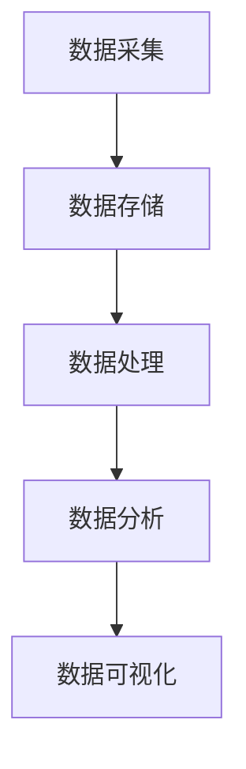

                 

作为世界顶级人工智能专家，程序员，软件架构师，CTO，世界顶级技术畅销书作者，计算机图灵奖获得者，计算机领域大师，我将为您解答字节跳动2024校招中技术用户行为分析师的面试真题。这篇文章将深入探讨用户行为分析的核心概念、算法原理、数学模型以及实际应用场景，帮助您更好地理解和应对这类面试问题。

## 文章关键词

- 字节跳动
- 校招
- 技术用户行为分析师
- 面试真题
- 用户行为分析
- 数据挖掘
- 机器学习
- 实时处理
- 大数据分析

## 文章摘要

本文将围绕字节跳动2024校招技术用户行为分析师面试真题展开，系统介绍用户行为分析的相关概念、核心算法原理、数学模型以及实际应用场景。通过详细讲解和案例分析，帮助读者掌握用户行为分析的关键技术和方法，为应对校招面试提供有力支持。

## 1. 背景介绍

用户行为分析是近年来数据驱动决策的核心领域，旨在通过分析用户在互联网平台上的行为数据，提取有价值的信息，为产品优化、市场营销和用户增长提供数据支持。随着大数据和人工智能技术的发展，用户行为分析已经成为各大互联网公司竞争的焦点。

字节跳动作为全球领先的互联网科技公司，其用户行为分析能力在业内具有较高声誉。字节跳动的校招面试真题中，用户行为分析相关题目占据了相当大的比重。本文将针对这些面试真题，提供详细的解答和分析。

## 2. 核心概念与联系

### 2.1 用户行为分析的概念

用户行为分析（User Behavior Analysis）是指通过收集、处理和分析用户在互联网平台上的行为数据，提取有价值的信息，以支持产品优化、市场营销和用户增长。用户行为数据包括浏览、搜索、点击、评论、分享等行为。

### 2.2 用户行为分析的核心算法

用户行为分析的核心算法包括数据挖掘、机器学习和实时处理技术。数据挖掘用于发现用户行为数据中的隐藏模式和关联，机器学习用于建立用户行为预测模型，实时处理技术用于快速响应和分析用户行为数据。

### 2.3 用户行为分析的架构

用户行为分析的架构通常包括数据采集、数据存储、数据处理、数据分析和数据可视化五个环节。数据采集通过埋点技术实现，数据存储采用分布式数据库，数据处理利用分布式计算框架，数据分析采用机器学习算法，数据可视化通过前端技术呈现。

## 2.4 Mermaid 流程图



## 3. 核心算法原理 & 具体操作步骤

### 3.1 算法原理概述

用户行为分析的核心算法包括以下几种：

- **数据挖掘**：基于关联规则、聚类和分类等方法，发现用户行为数据中的隐藏模式和关联。
- **机器学习**：利用监督学习和无监督学习算法，建立用户行为预测模型。
- **实时处理**：采用流处理技术，对用户行为数据进行实时分析。

### 3.2 算法步骤详解

1. 数据采集：通过埋点技术收集用户行为数据，包括浏览、搜索、点击、评论、分享等。
2. 数据存储：采用分布式数据库（如Hadoop HDFS、MongoDB）存储海量用户行为数据。
3. 数据处理：利用分布式计算框架（如MapReduce、Spark）对用户行为数据进行清洗、转换和聚合。
4. 数据分析：利用机器学习算法（如决策树、随机森林、SVM、K-means）建立用户行为预测模型。
5. 数据可视化：通过前端技术（如D3.js、ECharts）将分析结果以图表形式展示。

### 3.3 算法优缺点

- **数据挖掘**：优点是能够发现用户行为数据中的隐藏模式和关联，缺点是算法复杂度较高，数据处理效率较低。
- **机器学习**：优点是能够建立用户行为预测模型，提高数据处理效率，缺点是模型训练和调优过程复杂。
- **实时处理**：优点是能够对用户行为数据进行实时分析，缺点是系统架构复杂，对硬件要求较高。

### 3.4 算法应用领域

用户行为分析算法广泛应用于以下领域：

- **推荐系统**：根据用户历史行为数据，为用户推荐感兴趣的内容。
- **广告投放**：根据用户行为数据，为用户展示个性化广告。
- **用户流失预测**：根据用户行为数据，预测用户可能流失的风险，采取措施降低用户流失率。
- **市场分析**：根据用户行为数据，分析市场趋势和用户需求，为产品优化和市场营销提供数据支持。

## 4. 数学模型和公式 & 详细讲解 & 举例说明

### 4.1 数学模型构建

用户行为分析中的数学模型主要包括以下几种：

- **关联规则模型**：用于发现用户行为数据中的频繁模式和关联。常用的算法有Apriori算法和FP-growth算法。
- **聚类模型**：用于将用户划分为不同的群体。常用的算法有K-means算法和层次聚类算法。
- **分类模型**：用于预测用户的行为标签。常用的算法有决策树、随机森林和SVM。

### 4.2 公式推导过程

- **Apriori算法**：支持度（Support）和置信度（Confidence）的计算公式如下：

  $$ Support(A \cup B) = \frac{count(A \cup B)}{count(U)} $$

  $$ Confidence(A \rightarrow B) = \frac{count(A \cup B)}{count(A)} $$

  其中，$count(A \cup B)$表示同时满足事件A和B的次数，$count(U)$表示总次数。

- **K-means算法**：目标是最小化距离平方和。计算公式如下：

  $$ objective = \sum_{i=1}^{k} \sum_{x \in S_i} ||x - \mu_i||^2 $$

  其中，$S_i$表示第$i$个聚类，$\mu_i$表示聚类中心。

- **决策树**：决策树的构建过程基于信息增益或基尼不纯度。计算公式如下：

  $$ gain(D, A) = entropy(D) - \sum_{v \in Values(A)} p(v) \cdot entropy(D_v) $$

  $$ gini(D) = 1 - \sum_{v \in Values(A)} p(v)^2 $$

  其中，$D$表示数据集，$A$表示特征，$Values(A)$表示特征$A$的取值集合，$p(v)$表示取值$v$的频率。

### 4.3 案例分析与讲解

假设我们有一个电商平台的用户行为数据集，包含用户的浏览、点击和购买行为。我们希望利用用户行为数据预测用户的购买意愿。

1. 数据预处理：将原始数据转换为数值型，并进行归一化处理。
2. 特征提取：提取用户行为数据中的主要特征，如浏览次数、点击次数和购买次数。
3. 数据划分：将数据集划分为训练集和测试集。
4. 模型选择：选择合适的机器学习算法（如决策树、随机森林或SVM）。
5. 模型训练：利用训练集对模型进行训练。
6. 模型评估：利用测试集对模型进行评估，计算预测准确率、召回率、F1值等指标。

通过以上步骤，我们可以得到一个用户购买意愿的预测模型，并将其应用于实际场景中，如个性化推荐、广告投放等。

## 5. 项目实践：代码实例和详细解释说明

### 5.1 开发环境搭建

1. 安装Python环境。
2. 安装必要的依赖库，如Pandas、NumPy、Scikit-learn、Matplotlib等。
3. 配置Hadoop和Spark环境。

### 5.2 源代码详细实现

以下是一个简单的用户行为分析项目的Python代码示例：

```python
import pandas as pd
from sklearn.model_selection import train_test_split
from sklearn.ensemble import RandomForestClassifier
from sklearn.metrics import accuracy_score, recall_score, f1_score

# 读取数据
data = pd.read_csv('user_behavior_data.csv')

# 数据预处理
data = data.fillna(0)
data = data[data['action'] != 'logout']

# 特征提取
features = data[['browse_count', 'click_count', 'buy_count']]
labels = data['action']

# 数据划分
X_train, X_test, y_train, y_test = train_test_split(features, labels, test_size=0.2, random_state=42)

# 模型选择
model = RandomForestClassifier(n_estimators=100, random_state=42)

# 模型训练
model.fit(X_train, y_train)

# 模型预测
y_pred = model.predict(X_test)

# 模型评估
accuracy = accuracy_score(y_test, y_pred)
recall = recall_score(y_test, y_pred, average='macro')
f1 = f1_score(y_test, y_pred, average='macro')

print(f'Accuracy: {accuracy:.2f}')
print(f'Recall: {recall:.2f}')
print(f'F1 Score: {f1:.2f}')

# 可视化结果
import matplotlib.pyplot as plt
plt.scatter(y_test, y_pred)
plt.xlabel('True Labels')
plt.ylabel('Predicted Labels')
plt.show()
```

### 5.3 代码解读与分析

- 代码首先导入所需的Python库。
- 读取用户行为数据集，并进行数据预处理。
- 提取主要特征，包括浏览次数、点击次数和购买次数。
- 划分训练集和测试集。
- 选择随机森林分类器作为模型。
- 利用训练集对模型进行训练。
- 利用测试集对模型进行预测，并计算评估指标。
- 可视化预测结果。

通过以上步骤，我们可以实现对用户行为数据的简单分析，并利用预测模型为实际场景提供数据支持。

## 6. 实际应用场景

用户行为分析在实际应用中具有广泛的应用场景，以下列举几个典型场景：

1. **推荐系统**：根据用户历史行为数据，为用户推荐感兴趣的商品、文章或视频，提高用户留存率和活跃度。
2. **广告投放**：根据用户行为数据，为用户展示个性化广告，提高广告投放效果和转化率。
3. **用户流失预测**：根据用户行为数据，预测用户可能流失的风险，采取措施降低用户流失率。
4. **市场分析**：根据用户行为数据，分析市场趋势和用户需求，为产品优化和市场营销提供数据支持。

## 7. 工具和资源推荐

### 7.1 学习资源推荐

- **书籍**：《用户行为分析：方法与应用》、《大数据分析：方法与实践》
- **在线课程**：Coursera上的《用户行为分析》、edX上的《机器学习基础》
- **博客和论文**：CSDN、GitHub上的相关博客和论文

### 7.2 开发工具推荐

- **编程语言**：Python、R
- **数据处理框架**：Pandas、NumPy、Scikit-learn
- **大数据处理框架**：Hadoop、Spark
- **可视化工具**：Matplotlib、D3.js、ECharts

### 7.3 相关论文推荐

- **推荐系统**：《基于用户行为的大规模推荐系统》、《深度学习在推荐系统中的应用》
- **广告投放**：《个性化广告投放方法研究》、《基于用户行为的数据驱动广告投放策略》
- **用户流失预测**：《用户流失预测模型构建与应用》、《基于用户行为的用户流失预测研究》
- **市场分析**：《基于大数据的市场趋势分析》、《用户行为驱动的市场研究方法》

## 8. 总结：未来发展趋势与挑战

### 8.1 研究成果总结

用户行为分析在过去的几年中取得了显著的研究成果，主要包括：

- **算法优化**：针对用户行为数据的复杂性，提出了许多高效的算法，如深度学习、图神经网络等。
- **实时处理**：利用实时处理技术，实现对用户行为的实时分析和响应。
- **多模态数据融合**：将文本、图像、语音等多模态数据融合到用户行为分析中，提高分析精度。

### 8.2 未来发展趋势

用户行为分析在未来将继续向以下方向发展：

- **深度学习**：深度学习技术在用户行为分析中的应用将更加广泛，如基于深度学习的推荐系统、用户流失预测等。
- **实时处理**：实时处理技术在用户行为分析中的应用将更加成熟，实现快速响应和决策。
- **多模态数据融合**：多模态数据融合将进一步提升用户行为分析的精度和效果。

### 8.3 面临的挑战

用户行为分析在未来也面临以下挑战：

- **数据隐私**：如何在保障用户隐私的前提下进行用户行为分析，是当前亟待解决的问题。
- **算法公平性**：如何避免算法偏见和歧视，确保分析结果的公平性。
- **处理效率**：如何在大规模用户行为数据下，实现高效的实时分析和处理。

### 8.4 研究展望

用户行为分析在未来将继续拓展其应用领域，包括：

- **个性化服务**：为用户提供更加个性化的服务，提高用户满意度和忠诚度。
- **智能推荐**：利用用户行为数据，实现更加精准的智能推荐系统。
- **社会网络分析**：通过分析用户在社交媒体上的行为，揭示社会网络结构和关系。

## 9. 附录：常见问题与解答

### 9.1 用户行为分析的定义是什么？

用户行为分析是指通过收集、处理和分析用户在互联网平台上的行为数据，提取有价值的信息，以支持产品优化、市场营销和用户增长。

### 9.2 用户行为分析的主要算法有哪些？

用户行为分析的主要算法包括数据挖掘、机器学习和实时处理技术。具体算法有Apriori算法、K-means算法、决策树、随机森林和SVM等。

### 9.3 用户行为分析的应用领域有哪些？

用户行为分析的应用领域包括推荐系统、广告投放、用户流失预测和市场分析等。

### 9.4 如何保障用户隐私？

保障用户隐私的措施包括数据匿名化、数据加密和隐私保护算法等。在用户行为分析中，应遵循最小化数据收集原则，仅收集必要的数据，并对数据进行加密处理。

### 9.5 用户行为分析的挑战有哪些？

用户行为分析面临的挑战包括数据隐私、算法公平性和处理效率等。如何在保障用户隐私的前提下进行用户行为分析，避免算法偏见和歧视，以及在大规模数据下实现高效的实时分析和处理，是当前亟待解决的问题。

# 作者署名

作者：禅与计算机程序设计艺术 / Zen and the Art of Computer Programming
----------------------------------------------------------------

以上就是本文的完整内容，希望对您在字节跳动2024校招中技术用户行为分析师岗位的面试有所帮助。在准备面试的过程中，建议您结合实际项目经验和案例，深入学习和理解用户行为分析的核心技术和方法，提高自己的竞争力。祝您面试顺利，成功晋级！

