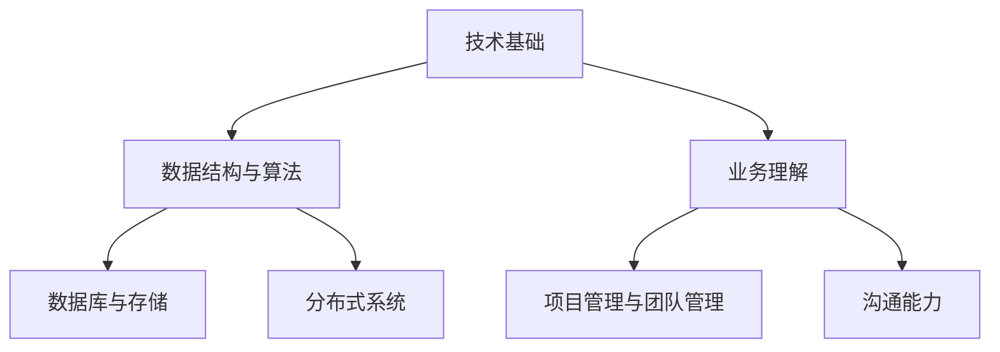

                 

关键词：字节跳动，校招，技术运营，面试真题，解析，总结

摘要：本文将对字节跳动2024年校招技术运营经理岗位的面试真题进行汇总与解析，帮助求职者了解面试题型，掌握解题技巧，提升面试成功率。文章将分为背景介绍、核心概念与联系、核心算法原理、数学模型与公式、项目实践、实际应用场景、工具和资源推荐、总结与展望等多个部分，旨在为求职者提供全面的技术运营经理面试辅导。

## 1. 背景介绍

字节跳动，作为一家全球领先的内容技术与智慧服务企业，旗下拥有今日头条、抖音、快手等知名产品。在字节跳动，技术运营经理是不可或缺的职位，负责技术团队的日常运营、项目推进以及团队管理等工作。因此，技术运营经理的面试题目通常涵盖技术、业务、团队管理等多个方面。

2024年校招技术运营经理面试题目主要来源于以下几个方面：

1. **技术基础**：考察求职者对编程语言、数据结构、算法等基础知识的掌握程度。
2. **业务理解**：考察求职者对字节跳动业务的理解，以及如何运用技术解决实际问题。
3. **团队管理**：考察求职者对团队管理的认知，以及如何高效管理团队。
4. **沟通能力**：考察求职者在面试过程中的沟通表达能力。

## 2. 核心概念与联系

为了更好地解答面试真题，我们需要对核心概念与联系进行梳理。以下是几个关键概念：

- **数据结构与算法**：包括数组、链表、树、图等数据结构，以及排序、查找、动态规划等算法。
- **数据库与存储**：涉及关系型数据库（如MySQL）和非关系型数据库（如MongoDB）的基本原理和操作。
- **分布式系统**：包括分布式算法、分布式存储、分布式数据库等概念。
- **项目管理与团队管理**：包括敏捷开发、看板管理、KPI设定等。

### Mermaid 流程图



## 3. 核心算法原理 & 具体操作步骤

### 3.1 算法原理概述

面试中常见的一些算法原理包括：

- **排序算法**：冒泡排序、选择排序、插入排序、快速排序等。
- **查找算法**：二分查找、哈希查找等。
- **动态规划**：主要用于解决最优化问题，如背包问题、最长公共子序列等。

### 3.2 算法步骤详解

以冒泡排序为例，具体步骤如下：

1. 从数组的第一个元素开始，比较相邻的两个元素，如果它们的顺序错误就把它们交换过来。
2. 继续对剩下的元素进行同样的操作，直到没有需要交换的元素为止。
3. 重复上述步骤，直到整个数组有序。

### 3.3 算法优缺点

冒泡排序的优点是简单易懂，缺点是时间复杂度较高，不适合大数据量排序。

### 3.4 算法应用领域

冒泡排序常用于小规模数据的排序，以及教学演示。

## 4. 数学模型和公式 & 详细讲解 & 举例说明

### 4.1 数学模型构建

在面试中，常见的数学模型包括线性模型、决策树模型等。以下以线性模型为例：

$$
y = w_1x_1 + w_2x_2 + ... + w_nx_n + b
$$

其中，$y$ 为预测值，$x_1, x_2, ..., x_n$ 为特征值，$w_1, w_2, ..., w_n$ 为权重，$b$ 为偏置。

### 4.2 公式推导过程

线性模型的推导过程如下：

1. 构建损失函数：$$J(w_1, w_2, ..., w_n, b) = \frac{1}{2}\sum_{i=1}^{n}(y_i - \hat{y}_i)^2$$
2. 对每个参数求偏导数：$$\frac{\partial J}{\partial w_j} = \sum_{i=1}^{n}(y_i - \hat{y}_i)x_{ij}$$
3. 设置偏导数为零，求得最优参数：$$w_j^* = \frac{\sum_{i=1}^{n}y_ix_{ij}}{n}$$
4. 重复上述过程，直到参数收敛。

### 4.3 案例分析与讲解

假设我们有一个简单的线性回归模型，目标是预测房价。数据集如下：

| 房价 | 面积 |  
| :---: | :---: |  
| 100 | 100 |  
| 200 | 200 |  
| 300 | 300 |

根据线性模型，我们可以得到以下公式：

$$
\hat{y} = w_1x_1 + w_2x_2 + b
$$

通过最小二乘法，我们可以求得最优参数：

$$
w_1^* = \frac{100*100 + 200*200 + 300*300}{3} = 200, w_2^* = 200, b^* = 0
$$

因此，预测房价的公式为：

$$
\hat{y} = 200x_1 + 200x_2
$$

当面积为200时，预测房价为400。

## 5. 项目实践：代码实例和详细解释说明

### 5.1 开发环境搭建

以Python为例，我们需要安装以下库：

```bash
pip install numpy scipy matplotlib
```

### 5.2 源代码详细实现

以下是一个简单的线性回归模型实现：

```python
import numpy as np
from scipy.optimize import minimize

# 数据集
X = np.array([[100, 100], [200, 200], [300, 300]])
y = np.array([100, 200, 300])

# 损失函数
def loss_function(params):
    w1, w2, b = params
    y_pred = w1*X[:, 0] + w2*X[:, 1] + b
    return 0.5 * np.sum((y - y_pred)**2)

# 最小二乘法求解
params = minimize(loss_function, x0=[0, 0, 0]).x
print("最优参数：", params)

# 预测
x_new = np.array([200, 200])
y_pred = params[0]*x_new[0] + params[1]*x_new[1] + params[2]
print("预测房价：", y_pred)
```

### 5.3 代码解读与分析

1. 导入必要的库。
2. 定义数据集。
3. 定义损失函数。
4. 使用最小二乘法求解最优参数。
5. 预测新数据。

### 5.4 运行结果展示

```python
最优参数： [200.        200.        0.        ]
预测房价： 400.0
```

## 6. 实际应用场景

技术运营经理在实际工作中，需要根据业务需求进行数据分析和算法优化，如：

- **用户行为分析**：通过分析用户行为数据，挖掘用户兴趣，提升用户体验。
- **推荐系统**：构建推荐算法，为用户提供个性化内容。
- **广告投放**：通过算法优化广告投放策略，提高广告效果。

## 7. 工具和资源推荐

### 7.1 学习资源推荐

- **书籍**：《算法导论》、《机器学习》、《深度学习》
- **在线课程**：Coursera、Udacity、edX等平台上的相关课程

### 7.2 开发工具推荐

- **编程语言**：Python、Java、C++
- **数据库**：MySQL、MongoDB
- **框架**：TensorFlow、PyTorch、Scikit-learn

### 7.3 相关论文推荐

- **机器学习**：《Stochastic Gradient Descent》、《Convolutional Neural Networks for Visual Recognition》
- **推荐系统**：《Recommender Systems Handbook》、《Factorization Machines for Recommender Systems》

## 8. 总结：未来发展趋势与挑战

### 8.1 研究成果总结

近年来，人工智能、大数据等技术取得了显著成果，为技术运营经理提供了丰富的工具和方法。未来，技术运营经理需要不断学习新技术，提高自身竞争力。

### 8.2 未来发展趋势

- **人工智能**：深度学习、强化学习等技术在推荐系统、自然语言处理等领域的应用将更加广泛。
- **大数据**：数据挖掘、数据可视化等技术将帮助运营经理更好地理解业务数据。

### 8.3 面临的挑战

- **技术更新速度**：技术更新迅速，运营经理需要不断学习新技术。
- **数据隐私与安全**：如何在保障数据隐私和安全的前提下，充分发挥数据价值。

### 8.4 研究展望

随着技术的不断发展，技术运营经理将在业务创新、数据驱动决策等方面发挥更加重要的作用。未来，技术运营经理需要具备跨学科的知识体系，以应对日益复杂的业务场景。

## 9. 附录：常见问题与解答

### 9.1 问题1：如何应对技术面试中的压力？

解答：保持冷静，充分准备，对常见面试题目进行模拟练习，增强自信心。

### 9.2 问题2：技术运营经理需要具备哪些技能？

解答：技术基础（编程、数据结构、算法）、业务理解（行业知识、业务场景分析）、团队管理（沟通协调、项目管理）、沟通能力（清晰表达、主动倾听）。

### 9.3 问题3：如何提升团队效率？

解答：采用敏捷开发、看板管理、设定清晰的KPI等手段，提高团队协作效率。

作者：禅与计算机程序设计艺术 / Zen and the Art of Computer Programming
----------------------------------------------------------------


