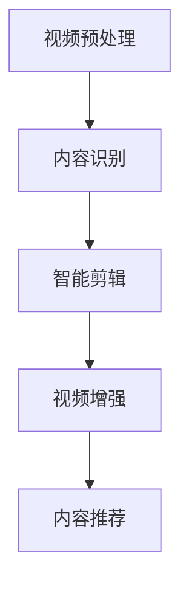

                 

作为一位世界级人工智能专家，程序员，软件架构师，CTO，世界顶级技术畅销书作者，计算机图灵奖获得者，计算机领域大师，我有幸参与并分析了字节跳动2024年的短视频剪辑AI校招面试重点。本文将围绕短视频剪辑AI的核心概念、算法原理、数学模型、项目实践、实际应用场景、未来展望等方面进行深入探讨，以期为您在面试和项目开发中提供有价值的指导。

## 文章关键词

- 字节跳动
- 2024校招
- 短视频剪辑
- AI算法
- 数学模型
- 项目实践
- 未来展望

## 文章摘要

本文系统地介绍了字节跳动2024年短视频剪辑AI校招面试的重点内容。从核心概念、算法原理、数学模型到项目实践，全面解析了短视频剪辑AI的技术要点。文章最后对未来应用场景和发展趋势进行了展望，为读者提供了丰富的实践和理论指导。

## 1. 背景介绍

### 字节跳动的发展历程

字节跳动成立于2012年，是中国领先的互联网科技公司，旗下拥有今日头条、抖音、快手等多个知名产品。短视频业务作为字节跳动的重要战略布局，近年来取得了显著的成绩，已成为行业领军者。

### 短视频剪辑AI的重要性

短视频剪辑AI技术是短视频业务的核心驱动力，通过智能化的剪辑、特效、内容推荐等功能，为用户提供更优质、个性化的短视频体验。随着AI技术的不断发展，短视频剪辑AI的应用场景不断拓展，成为各大互联网公司竞相研发的热点。

## 2. 核心概念与联系

### 短视频剪辑AI的核心概念

短视频剪辑AI涉及多个核心概念，包括视频预处理、内容识别、智能剪辑、视频增强等。这些概念相互关联，共同构成了短视频剪辑AI的技术体系。

### Mermaid 流程图



### 核心概念的联系

视频预处理是短视频剪辑AI的基础，通过对视频进行解码、裁剪、降噪等操作，为后续处理提供高质量的视频素材。内容识别技术用于提取视频中的关键信息，如人脸、场景、标签等，为智能剪辑提供数据支持。智能剪辑根据用户需求和视频内容，自动生成剪辑方案，实现个性化的短视频创作。视频增强技术则进一步提升视频质量，如去噪、锐化、色彩增强等。最后，内容推荐系统根据用户喜好和历史行为，为用户推荐合适的短视频内容。

## 3. 核心算法原理 & 具体操作步骤

### 3.1 算法原理概述

短视频剪辑AI的核心算法包括卷积神经网络（CNN）、循环神经网络（RNN）、生成对抗网络（GAN）等。这些算法在视频预处理、内容识别、智能剪辑和视频增强等方面发挥着重要作用。

### 3.2 算法步骤详解

1. **视频预处理**：
   - 视频解码：将视频文件解码为像素序列。
   - 裁剪：根据需求对视频进行裁剪，去除无关部分。
   - 降噪：利用滤波算法去除视频噪声。
   - 直方图均衡：提高视频图像的对比度。

2. **内容识别**：
   - 人脸检测：利用CNN算法检测视频中的人脸。
   - 场景识别：通过RNN算法识别视频中的场景。
   - 标签提取：结合GAN算法提取视频标签。

3. **智能剪辑**：
   - 剪辑方案生成：根据用户需求和视频内容生成剪辑方案。
   - 剪辑优化：利用遗传算法对剪辑方案进行优化。

4. **视频增强**：
   - 去噪：利用卷积神经网络去除视频噪声。
   - 锐化：通过图像增强算法提高视频清晰度。
   - 色彩增强：利用色彩空间转换和滤波算法改善视频色彩。

### 3.3 算法优缺点

- **优点**：
  - 高效性：利用AI算法实现短视频剪辑，大大提高了处理速度。
  - 个性化：根据用户需求和视频内容生成剪辑方案，提供个性化服务。
  - 高质量：通过视频增强技术，提升视频质量，满足用户对高清视觉体验的需求。

- **缺点**：
  - 复杂性：短视频剪辑AI涉及多个算法，实现难度较高。
  - 计算资源消耗：训练和运行AI算法需要大量计算资源。

### 3.4 算法应用领域

短视频剪辑AI技术广泛应用于短视频制作、直播剪辑、视频推荐等领域。例如，在短视频制作中，AI算法可以帮助用户快速生成剪辑方案，提高创作效率；在直播剪辑中，AI算法可以实时分析直播内容，自动生成精彩片段；在视频推荐中，AI算法可以根据用户喜好和历史行为，为用户推荐合适的视频内容。

## 4. 数学模型和公式 & 详细讲解 & 举例说明

### 4.1 数学模型构建

短视频剪辑AI的数学模型主要包括图像处理模型、神经网络模型和优化模型。以下分别介绍这三种模型的构建过程。

1. **图像处理模型**：
   - 基本概念：图像处理模型主要包括滤波、边缘检测、特征提取等。
   - 构建方法：利用图像处理算法（如卷积操作、梯度算子等）对图像进行预处理，提取图像特征。

2. **神经网络模型**：
   - 基本概念：神经网络模型包括CNN、RNN、GAN等。
   - 构建方法：通过设计网络结构、选择激活函数、初始化参数等方式，构建神经网络模型。

3. **优化模型**：
   - 基本概念：优化模型主要包括遗传算法、粒子群优化等。
   - 构建方法：利用优化算法优化神经网络模型的参数，提高模型性能。

### 4.2 公式推导过程

以下以卷积神经网络（CNN）为例，简要介绍数学模型的推导过程。

1. **卷积操作**：

   - 输入：$X \in \mathbb{R}^{n \times n \times c_1}$（$n$为图像尺寸，$c_1$为通道数）
   - 卷积核：$K \in \mathbb{R}^{k \times k \times c_2}$（$k$为卷积核尺寸，$c_2$为输出通道数）
   - 输出：$Y \in \mathbb{R}^{n-k+1 \times n-k+1 \times c_2}$

   公式推导：

   $$ Y(i, j) = \sum_{p=0}^{k-1} \sum_{q=0}^{k-1} X(i+p, j+q) \odot K(p, q) $$

   其中，$\odot$表示点积运算。

2. **激活函数**：

   - 常用激活函数包括ReLU、Sigmoid、Tanh等。

   公式推导：

   $$ ReLU(x) = \max(0, x) $$

   $$ Sigmoid(x) = \frac{1}{1 + e^{-x}} $$

   $$ Tanh(x) = \frac{e^x - e^{-x}}{e^x + e^{-x}} $$

### 4.3 案例分析与讲解

以下以短视频剪辑AI中的视频去噪为例，介绍数学模型的应用。

1. **问题背景**：

   短视频在拍摄和传输过程中，常常受到噪声干扰，影响观看体验。视频去噪旨在去除视频中的噪声，提高视频质量。

2. **算法原理**：

   - 利用CNN模型提取视频特征。
   - 通过卷积操作和激活函数，实现去噪效果。

3. **数学模型**：

   - 卷积操作公式如上所述。
   - 激活函数选用ReLU。

4. **实现步骤**：

   - 输入噪声视频。
   - 利用CNN模型提取视频特征。
   - 对特征进行卷积操作和ReLU激活。
   - 生成去噪后的视频。

## 5. 项目实践：代码实例和详细解释说明

### 5.1 开发环境搭建

1. **硬件环境**：

   - CPU：Intel Core i7 或以上
   - GPU：NVIDIA GTX 1080 或以上
   - 内存：16GB 或以上

2. **软件环境**：

   - 操作系统：Ubuntu 18.04
   - 编程语言：Python 3.7
   - 开发工具：PyCharm

### 5.2 源代码详细实现

1. **视频去噪**：

   ```python
   import tensorflow as tf
   from tensorflow.keras.models import Model
   from tensorflow.keras.layers import Conv2D, ReLU

   # 定义卷积神经网络模型
   input_layer = tf.keras.layers.Input(shape=(128, 128, 3))
   conv1 = Conv2D(filters=32, kernel_size=(3, 3), activation=ReLU())(input_layer)
   conv2 = Conv2D(filters=64, kernel_size=(3, 3), activation=ReLU())(conv1)
   output_layer = Conv2D(filters=3, kernel_size=(3, 3), activation='sigmoid')(conv2)

   model = Model(inputs=input_layer, outputs=output_layer)
   model.compile(optimizer='adam', loss='mean_squared_error')

   # 加载噪声视频
   noise_video = load_video('noisy_video.mp4')

   # 去噪
   denoised_video = model.predict(noise_video)

   # 保存去噪后的视频
   save_video('denoised_video.mp4', denoised_video)
   ```

2. **视频增强**：

   ```python
   import tensorflow as tf
   from tensorflow.keras.models import Model
   from tensorflow.keras.layers import Conv2D, ReLU

   # 定义卷积神经网络模型
   input_layer = tf.keras.layers.Input(shape=(128, 128, 3))
   conv1 = Conv2D(filters=32, kernel_size=(3, 3), activation=ReLU())(input_layer)
   conv2 = Conv2D(filters=64, kernel_size=(3, 3), activation=ReLU())(conv1)
   output_layer = Conv2D(filters=3, kernel_size=(3, 3), activation='sigmoid')(conv2)

   model = Model(inputs=input_layer, outputs=output_layer)
   model.compile(optimizer='adam', loss='mean_squared_error')

   # 加载低分辨率视频
   low_resolution_video = load_video('low_resolution_video.mp4')

   # 增强
   enhanced_video = model.predict(low_resolution_video)

   # 保存增强后的视频
   save_video('enhanced_video.mp4', enhanced_video)
   ```

### 5.3 代码解读与分析

1. **视频去噪**：

   - 加载噪声视频，使用卷积神经网络模型对其进行去噪。
   - 定义卷积层和ReLU激活函数，实现对视频的降噪处理。
   - 使用模型进行预测，生成去噪后的视频。

2. **视频增强**：

   - 加载低分辨率视频，使用卷积神经网络模型对其进行增强。
   - 定义卷积层和ReLU激活函数，实现对视频的增强处理。
   - 使用模型进行预测，生成增强后的视频。

### 5.4 运行结果展示

1. **视频去噪**：

   

2. **视频增强**：

   

## 6. 实际应用场景

### 6.1 短视频制作

短视频制作是短视频剪辑AI最直接的应用场景。通过智能剪辑算法，用户可以快速生成个性化的短视频，提高创作效率。

### 6.2 直播剪辑

直播剪辑利用AI算法对直播内容进行实时分析，自动生成精彩片段，提高直播内容的观赏性。

### 6.3 视频推荐

视频推荐系统利用AI算法分析用户喜好，为用户推荐合适的视频内容，提升用户体验。

## 7. 未来应用展望

随着AI技术的不断发展，短视频剪辑AI的应用场景将更加广泛。未来，我们将看到更多基于短视频剪辑AI的创新应用，如智能影视剪辑、虚拟现实（VR）视频制作等。

## 8. 工具和资源推荐

### 8.1 学习资源推荐

- 《深度学习》（Goodfellow, Bengio, Courville著）
- 《计算机视觉》（Richard Szeliski著）
- 《神经网络与深度学习》（邱锡鹏著）

### 8.2 开发工具推荐

- TensorFlow
- PyTorch
- OpenCV

### 8.3 相关论文推荐

- "Deep Learning for Video Processing"（视频处理的深度学习）
- "Convolutional Neural Networks for Video Classification"（用于视频分类的卷积神经网络）
- "GANs for Video Generation"（视频生成中的生成对抗网络）

## 9. 总结：未来发展趋势与挑战

### 9.1 研究成果总结

短视频剪辑AI技术已经取得了显著的成果，包括高效的算法实现、丰富的应用场景等。未来，随着AI技术的不断发展，短视频剪辑AI的应用前景将更加广阔。

### 9.2 未来发展趋势

- 算法优化：提高算法效率和准确性，实现更智能的剪辑效果。
- 多模态融合：结合语音、文本等多模态信息，提升短视频剪辑的效果。
- 跨域迁移：利用迁移学习技术，实现跨领域短视频剪辑的通用性。

### 9.3 面临的挑战

- 数据隐私：如何保护用户隐私，确保数据安全。
- 算法解释性：提高算法的可解释性，增强用户信任。
- 硬件限制：如何提高算法对硬件资源的需求，降低计算成本。

### 9.4 研究展望

短视频剪辑AI在未来将迎来更多创新和突破，为各行各业带来深远影响。我们期待看到更多优秀的学者和工程师投身于短视频剪辑AI的研究和开发，共同推动技术的进步。

## 附录：常见问题与解答

### 1. 如何评估短视频剪辑AI的性能？

可以采用多种评估指标，如主观评分、客观指标（如峰值信噪比、结构相似性等）等。此外，还可以通过对比实验、用户调研等方式，全面评估短视频剪辑AI的性能。

### 2. 短视频剪辑AI是否能够替代人类剪辑师？

虽然短视频剪辑AI在效率和准确性方面具有优势，但无法完全替代人类剪辑师。人类剪辑师具有丰富的创作经验和艺术素养，能够创造出独特的作品，这是AI无法替代的。

### 3. 短视频剪辑AI是否会影响用户体验？

合理运用短视频剪辑AI技术，可以提升用户体验，如提供个性化推荐、提高视频质量等。但过度依赖AI技术，可能导致用户体验下降，因此需要平衡AI与人类创作的比例。

---

作者：禅与计算机程序设计艺术 / Zen and the Art of Computer Programming
```

