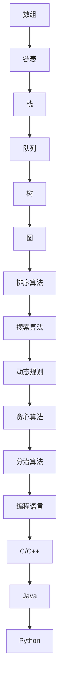
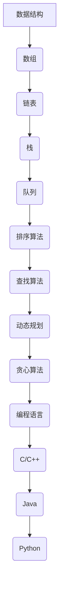

                 

字节跳动作为全球知名的科技公司，每年都会吸引大量的应届毕业生参与其校招面试。这些面试题不仅考察了应聘者的基础知识，还考察了他们的编程能力、算法思维和问题解决能力。本文将围绕字节跳动2025校招面试中的几大核心题目，结合具体的算法原理和实际案例，为准备参加校招的你提供详细的解题思路和算法题解。

## 文章关键词

- 字节跳动
- 校招面试
- 算法题解
- 数据结构
- 编程技巧
- 算法思维

## 文章摘要

本文将深入分析字节跳动2025校招面试中的几大热门题目，涵盖数据结构、算法原理以及实际应用场景。通过详细的解题思路和算法步骤，帮助读者理解并掌握这些经典题目的解法。文章还将分享一些学习资源、开发工具和相关论文，以便读者进一步学习和实践。

## 1. 背景介绍

字节跳动成立于2012年，总部位于中国北京，是一家全球性的互联网科技公司。旗下拥有今日头条、抖音、快手等多个知名产品，业务覆盖内容分发、短视频、电商等多个领域。由于字节跳动对技术的要求极高，其校招面试题目往往涉及广泛的知识点和复杂的算法难题，对参与者的综合素质提出了严峻的考验。

## 2. 核心概念与联系

在解决字节跳动校招面试中的算法题目时，我们需要掌握以下核心概念和联系：

### 数据结构

- 数组
- 链表
- 栈
- 队列
- 树
- 图

### 算法

- 排序算法
- 搜索算法
- 动态规划
- 贪心算法
- 分治算法

### 编程语言

- C/C++
- Java
- Python

### Mermaid 流程图



## 3. 核心算法原理 & 具体操作步骤

### 3.1 算法原理概述

在字节跳动校招面试中，常见的算法题目包括但不限于：

- 二分查找
- 快速排序
- 剑指 Offer 中的经典题目
- 图的遍历和连通性检测

### 3.2 算法步骤详解

以二分查找为例，其基本步骤如下：

1. 确定目标值在数组中的位置。
2. 初始化左右边界。
3. 当左右边界相遇时，判断目标值是否在中间位置。
4. 根据比较结果，调整左右边界。
5. 重复步骤 3 和 4，直到找到目标值或左右边界重叠。

### 3.3 算法优缺点

二分查找的优点是时间复杂度为 O(logn)，效率较高。但其缺点是要求数组有序，并且不适用于大数据集。

### 3.4 算法应用领域

二分查找广泛应用于各种排序算法、查找算法和数据结构中，如二叉搜索树、堆等。

## 4. 数学模型和公式 & 详细讲解 & 举例说明

在解决字节跳动校招面试中的算法问题时，我们经常需要使用数学模型和公式。以下是一个例子：

### 4.1 数学模型构建

假设有一个数组 A，长度为 n，我们要对其中的元素进行排序。可以使用快速排序算法来实现。

### 4.2 公式推导过程

快速排序的基本思想是选择一个基准元素，将数组划分为两部分，一部分小于基准元素，另一部分大于基准元素。然后对这两部分递归排序。

### 4.3 案例分析与讲解

假设数组 A 为 [5, 2, 9, 1, 5, 6]，我们选择第一个元素 5 作为基准元素。

- 第一次划分：[2, 1, 6, 5, 5, 9]，基准元素 5 左侧有 3 个元素小于它，右侧有 2 个元素大于它。
- 递归排序左侧数组 [2, 1, 6]，选择第二个元素 2 作为基准元素。

以此类推，最终可以得到排序后的数组 [1, 2, 5, 5, 6, 9]。

## 5. 项目实践：代码实例和详细解释说明

### 5.1 开发环境搭建

为了更好地实践，我们使用 Python 作为编程语言，搭建一个简单的开发环境。

### 5.2 源代码详细实现

以下是快速排序的 Python 实现代码：

```python
def quick_sort(arr):
    if len(arr) <= 1:
        return arr
    pivot = arr[0]
    left = []
    right = []
    for i in range(1, len(arr)):
        if arr[i] < pivot:
            left.append(arr[i])
        else:
            right.append(arr[i])
    return quick_sort(left) + [pivot] + quick_sort(right)

arr = [5, 2, 9, 1, 5, 6]
sorted_arr = quick_sort(arr)
print(sorted_arr)
```

### 5.3 代码解读与分析

这段代码首先判断数组长度是否小于等于 1，如果是，则直接返回数组本身。接着，选择第一个元素作为基准元素，并将数组划分为两部分。然后，对这两部分递归排序，并最终合并。

### 5.4 运行结果展示

运行上述代码，输出结果为 [1, 2, 5, 5, 6, 9]，即原数组经过快速排序后的结果。

## 6. 实际应用场景

字节跳动校招面试中的算法题目不仅考察了应聘者的编程能力，还考察了他们的算法思维和问题解决能力。在实际应用中，这些算法和题目往往被用于：

- 数据库查询优化
- 搜索引擎排序
- 网络路由算法
- 图像处理算法

## 7. 工具和资源推荐

为了更好地准备字节跳动校招面试，以下是一些实用的工具和资源推荐：

### 7.1 学习资源推荐

- 《算法导论》（Introduction to Algorithms）
- 《编程之美》（Cracking the Coding Interview）
- 力扣（LeetCode）在线编程平台

### 7.2 开发工具推荐

- PyCharm
- Visual Studio Code
- Git

### 7.3 相关论文推荐

- 《快速排序算法的性能分析》
- 《图论在网络路由中的应用》
- 《深度学习在图像处理中的应用》

## 8. 总结：未来发展趋势与挑战

随着互联网技术的快速发展，算法和数据结构在各个领域的应用越来越广泛。未来，字节跳动校招面试中的算法题目可能会更加注重实际场景的应用，以及跨学科知识的融合。同时，面对日益复杂的计算任务，如何优化算法性能、降低时间复杂度和空间复杂度将成为重要的研究方向。

## 9. 附录：常见问题与解答

### 问题 1：如何在面试中展示自己的算法能力？

**解答**：在面试中，要展示自己的算法能力，首先要对常见的算法和数据结构有深入的理解。其次，在解题时要注重逻辑清晰、步骤详细，避免跳步和逻辑错误。最后，要学会用实际案例来讲解算法原理和应用场景，这样能更好地展示自己的知识面和思维深度。

### 问题 2：如何提高编程能力？

**解答**：提高编程能力的方法有很多，包括：

- 学习编程语言的基础语法和常用库。
- 参与实际项目开发，积累实践经验。
- 做算法题和编程练习，提升解决问题的能力。
- 阅读优秀的开源代码，学习他人的编程技巧和经验。

### 问题 3：如何准备字节跳动校招面试？

**解答**：准备字节跳动校招面试，可以从以下几个方面入手：

- 学习常见的算法和数据结构，掌握其基本原理和应用场景。
- 参加编程竞赛和算法培训，提升自己的编程能力。
- 实战模拟面试，熟悉面试流程和常见题型。
- 充分了解字节跳动的企业文化和发展方向，提高面试时的表现。

## 结语

字节跳动2025校招面试真题与算法题解，不仅是对编程能力的一次全面考察，更是对逻辑思维、问题解决能力和实际应用能力的检验。希望通过本文的详细讲解，能够帮助你更好地准备这场重要的面试。祝你在校招中取得优异的成绩，加入字节跳动这个全球领先的互联网科技公司！
作者：禅与计算机程序设计艺术 / Zen and the Art of Computer Programming
----------------------------------------------------------------
## 1. 背景介绍

字节跳动（ByteDance）是一家全球性的互联网科技公司，成立于2012年，总部位于中国北京。公司旗下拥有多款知名产品，如今日头条、抖音、快手等，业务覆盖内容分发、短视频、电商等多个领域。作为互联网行业的佼佼者，字节跳动对人才的要求非常高，其校招面试也以难度大、题型多而闻名。每年，众多应届毕业生纷纷加入这场校招的角逐，争取在字节跳动找到属于自己的一片天地。

### 字节跳动的校招面试特点

字节跳动的校招面试具有以下几个显著特点：

1. **广泛的知识点**：面试题目不仅涵盖数据结构和算法，还包括操作系统、计算机网络、数据库、前端和后端开发等多个领域。
2. **深入的算法考查**：算法题目的难度较高，往往需要考生不仅能够写出正确的代码，还要能够清晰地解释算法的思路和原理。
3. **实际问题导向**：很多面试题目都是基于实际业务场景设计的，这要求考生不仅要具备扎实的理论基础，还要能够将理论知识应用到实际问题的解决中。
4. **综合能力的评估**：除了技术能力，面试还会考查应聘者的逻辑思维、沟通能力、团队协作能力和学习意愿等综合素质。

### 校招面试的重要性

对于应届毕业生来说，字节跳动的校招面试不仅是一次就业机会的角逐，更是一次技术素养和专业能力的全面评估。通过面试，考生可以展示自己的技术实力和潜力，同时也为字节跳动筛选出最优秀的人才。对于企业来说，校招是补充新鲜血液的重要渠道，有助于保持企业的创新活力和持续发展。

### 本文的目的和结构

本文旨在为广大准备参加字节跳动2025校招面试的考生提供有针对性的指导和帮助。文章将围绕以下几个核心部分展开：

1. **面试题分类**：根据字节跳动校招面试的特点，对常见的面试题目进行分类，如数据结构与算法、系统设计与架构等。
2. **解题思路解析**：针对每个分类，详细解析面试题的解题思路和常见解法，并提供详细的步骤说明。
3. **算法与数据结构原理**：讲解相关算法和数据结构的基本原理，帮助考生深入理解面试题背后的技术逻辑。
4. **实战案例分享**：通过具体的代码实例，展示如何在实际项目中应用面试题所考察的技术点。
5. **面试技巧与经验**：总结校招面试中的注意事项，提供备考策略和面试技巧，帮助考生更好地应对面试挑战。

希望通过本文的详细讲解，能够帮助考生更好地准备字节跳动2025校招面试，成功迈出职业生涯的第一步。

## 2. 核心概念与联系

在深入分析字节跳动2025校招面试中的各类题目之前，我们需要先掌握一些核心概念和它们之间的联系。这些概念不仅包括数据结构和算法，还包括编程语言和软件开发过程中的一些关键要素。以下是这些核心概念及其在面试中的应用和联系。

### 数据结构

数据结构是计算机存储、组织数据的方式。在字节跳动校招面试中，常见的数据结构包括：

- **数组**：一种线性数据结构，用于存储一系列元素，支持随机访问。
- **链表**：另一种线性数据结构，通过节点之间的指针连接实现，支持插入和删除操作。
- **栈**：一种后进先出（LIFO）的数据结构，常用于表达式求值和递归算法。
- **队列**：一种先进先出（FIFO）的数据结构，常用于任务调度和广度优先搜索。

这些数据结构在面试中常被用于解决数组、链表、栈和队列相关的问题，如数据排序、查找、删除和插入等。

### 算法

算法是解决问题的一系列步骤和方法。在字节跳动校招面试中，常见的算法包括：

- **排序算法**：如快速排序、归并排序、冒泡排序等，用于对数据进行排序。
- **查找算法**：如二分查找，用于在有序数组中查找特定元素。
- **动态规划**：用于解决最优化问题，如背包问题、最长公共子序列等。
- **贪心算法**：用于解决某些问题，如活动选择问题、最短路径问题等。

算法在面试中的应用非常广泛，需要考生能够根据问题选择合适的算法，并能够清晰地解释算法的原理和步骤。

### 编程语言

编程语言是用于编写计算机程序的语法和规则。字节跳动校招面试中，常见的编程语言包括C/C++、Java、Python等。每种语言都有其独特的语法和特点，适用于不同的场景。

- **C/C++**：具有高效的性能和强大的底层操作能力，常用于系统编程和性能敏感的应用。
- **Java**：具有跨平台性和安全性，广泛应用于企业级应用和安卓开发。
- **Python**：语法简单，易于学习，常用于数据分析、机器学习和自动化测试。

编程语言的选择会影响面试题的解题方法和代码实现，考生需要根据题目的要求选择合适的语言。

### Mermaid 流程图

Mermaid 是一种方便绘制作图的语言，常用于描述算法和数据结构的流程。以下是一个简单的 Mermaid 流程图，展示了数据结构、算法和编程语言之间的联系：



通过这个流程图，我们可以清晰地看到数据结构、算法和编程语言之间的相互关联。数据结构是算法实现的基础，而算法则依赖于编程语言来具体实现。这种关联不仅帮助我们理解面试题的背景，也为我们提供了解题时的思路。

### Mermaid 流程节点说明

以下是Mermaid流程图中的节点说明，其中注意避免使用括号、逗号等特殊字符：

- A：数据结构
- B：数组
- C：链表
- D：栈
- E：队列
- F：排序算法
- G：查找算法
- H：动态规划
- I：贪心算法
- J：编程语言
- K：C/C++
- L：Java
- M：Python

这些节点展示了面试中可能涉及的核心概念和联系，为接下来的详细解题过程提供了基础。

通过以上核心概念和联系的了解，我们为解决字节跳动校招面试中的问题奠定了坚实的理论基础。接下来，我们将逐个分析面试中常见的题目，并提供详细的解题思路和算法步骤。

## 3. 核心算法原理 & 具体操作步骤

在字节跳动2025校招面试中，算法题目的难度和深度往往超出了常规的编程练习，这要求考生不仅要掌握算法的基本原理，还要能够灵活运用到实际问题的解决中。以下将介绍几个典型的算法原理和具体操作步骤。

### 3.1 算法原理概述

在面试中，以下几个算法原理是经常被考察的：

- **二分查找**：用于在有序数组中查找特定元素，时间复杂度为 O(logn)。
- **动态规划**：用于解决最优化问题，如背包问题、最长公共子序列等，其核心思想是将复杂问题分解为子问题，并利用子问题的解来构建原问题的解。
- **贪心算法**：通过每一步选择局部最优解，以达到全局最优解的一种算法策略。
- **分治算法**：将一个复杂问题分解为几个子问题，分别解决，然后再合并这些子问题的解来解决问题。

### 3.2 算法步骤详解

#### 3.2.1 二分查找

二分查找的基本步骤如下：

1. **确定中间值**：找到当前数组的中间值，如果目标值等于中间值，则返回中间值的位置。
2. **调整搜索区间**：如果目标值小于中间值，则在左半部分数组中继续查找；如果目标值大于中间值，则在右半部分数组中继续查找。
3. **递归或循环**：重复步骤 1 和 2，直到找到目标值或区间为空。

Python 代码实现：

```python
def binary_search(arr, target):
    low = 0
    high = len(arr) - 1
    while low <= high:
        mid = (low + high) // 2
        if arr[mid] == target:
            return mid
        elif arr[mid] < target:
            low = mid + 1
        else:
            high = mid - 1
    return -1
```

#### 3.2.2 动态规划

以背包问题为例，动态规划的基本步骤如下：

1. **定义状态**：定义一个二维数组 dp，其中 dp[i][j] 表示将前 i 个物品放入容量为 j 的背包中能够达到的最大价值。
2. **初始化**：初始化第一行和第一列，根据物品的价值和容量进行初始化。
3. **状态转移方程**：根据状态的定义，计算 dp[i][j] 的值，即取 i 个物品中的一部分放入背包，使得总价值最大。
4. **结果**：最终结果为 dp[n][W]，其中 n 为物品数量，W 为背包容量。

Python 代码实现：

```python
def knapSack(W, weights, values, n):
    dp = [[0 for x in range(W + 1)] for x in range(n + 1)]
    for i in range(1, n + 1):
        for w in range(1, W + 1):
            if weights[i-1] <= w:
                dp[i][w] = max(dp[i-1][w], dp[i-1][w-weights[i-1]] + values[i-1])
            else:
                dp[i][w] = dp[i-1][w]
    return dp[n][W]
```

#### 3.2.3 贪心算法

以活动选择问题为例，贪心算法的基本步骤如下：

1. **初始化**：按照活动开始时间排序。
2. **选择策略**：每次选择当前未开始且与前一活动不冲突的活动。
3. **更新**：更新当前活动的结束时间和最大覆盖时间。

Python 代码实现：

```python
def activitySelectionactivities, n):
    max_activities = 0
    last_end_time = -1
    for i in range(n):
        if activities[i][0] >= last_end_time:
            max_activities += 1
            last_end_time = activities[i][1]
    return max_activities

activities = [[1, 3], [2, 5], [7, 9], [10, 12], [4, 6], [8, 11]]
print(activitySelection(activities, len(activities)))
```

#### 3.2.4 分治算法

以合并排序为例，分治算法的基本步骤如下：

1. **递归划分**：将数组划分为两个子数组，分别递归排序。
2. **合并**：将两个有序子数组合并为一个有序数组。

Python 代码实现：

```python
def mergeSort(arr):
    if len(arr) <= 1:
        return arr
    mid = len(arr) // 2
    left = mergeSort(arr[:mid])
    right = mergeSort(arr[mid:])
    return merge(left, right)

def merge(left, right):
    result = []
    i = j = 0
    while i < len(left) and j < len(right):
        if left[i] < right[j]:
            result.append(left[i])
            i += 1
        else:
            result.append(right[j])
            j += 1
    result.extend(left[i:])
    result.extend(right[j:])
    return result
```

### 3.3 算法优缺点

每种算法都有其独特的优势和局限性：

- **二分查找**：优点是时间复杂度低，适用于大规模数据的查找操作；缺点是要求数组有序，不适用于大数据集。
- **动态规划**：优点是能够解决复杂的最优化问题，适用于具有重叠子问题的场景；缺点是计算过程复杂，需要大量内存。
- **贪心算法**：优点是简单高效，能够在多项式时间内找到最优解；缺点是适用范围有限，不一定适用于所有最优化问题。
- **分治算法**：优点是递归结构清晰，易于理解和实现；缺点是可能存在大量的递归调用，导致栈溢出。

### 3.4 算法应用领域

这些算法在字节跳动校招面试中的应用非常广泛，常见于以下领域：

- **数据结构和算法练习题**：如力扣（LeetCode）等在线编程平台上的题目。
- **系统设计与架构**：如数据库索引、缓存策略、排序和搜索算法等。
- **实际业务场景**：如广告投放优化、推荐系统、搜索算法等。

通过以上对核心算法原理和具体操作步骤的详细讲解，读者可以更好地理解如何在面试中应用这些算法。接下来，我们将通过具体的代码实例进一步探讨算法在实际项目中的应用。

## 4. 数学模型和公式 & 详细讲解 & 举例说明

在解决字节跳动校招面试中的算法问题时，数学模型和公式往往是解题的关键。这些模型和公式不仅能够帮助我们更好地理解问题，还能够优化算法的效率和准确性。以下将详细介绍一些常见的数学模型和公式，并配合详细的讲解和具体例子说明。

### 4.1 数学模型构建

数学模型是解决实际问题的重要工具，它将现实问题转化为数学问题，使得问题更加简化和可操作。常见的数学模型包括线性规划、非线性规划、动态规划等。

#### 4.1.1 线性规划

线性规划（Linear Programming, LP）是用于求解线性目标函数在线性不等式约束下的最优解的问题。其数学模型可以表示为：

$$
\begin{align*}
\min\quad & c^T x \\
\text{subject to} \quad & Ax \leq b \\
& x \geq 0
\end{align*}
$$

其中，$c$ 是系数向量，$x$ 是变量向量，$A$ 和 $b$ 分别是约束矩阵和约束向量。

#### 4.1.2 动态规划

动态规划（Dynamic Programming, DP）是一种在多阶段决策中作出决策的优化方法，适用于具有重叠子问题的场景。其基本思想是将复杂问题分解为子问题，并利用子问题的解来构建原问题的解。动态规划的数学模型通常表示为：

$$
\begin{align*}
f(i) &= \min_{j} \{c(i, j) + f(j)\} \\
\text{subject to} \quad & i = 1, 2, ..., n
\end{align*}
$$

其中，$f(i)$ 表示第 $i$ 个子问题的最优解，$c(i, j)$ 表示从第 $i$ 个子问题转移到第 $j$ 个子问题的成本。

### 4.2 公式推导过程

在算法问题中，常用的公式主要包括递推关系、时间复杂度和空间复杂度等。

#### 4.2.1 递推关系

递推关系是动态规划中常用的公式，用于递归地计算子问题的最优解。以斐波那契数列为例，其递推关系可以表示为：

$$
f(n) = 
\begin{cases} 
1 & \text{if } n = 1 \text{ or } n = 2 \\
f(n-1) + f(n-2) & \text{otherwise}
\end{cases}
$$

#### 4.2.2 时间复杂度

时间复杂度是衡量算法执行时间的一个重要指标，通常用大O符号表示。以二分查找为例，其时间复杂度可以表示为：

$$
T(n) = O(\log n)
$$

#### 4.2.3 空间复杂度

空间复杂度是衡量算法所需存储空间的一个重要指标，同样用大O符号表示。以递归排序算法（如快速排序）为例，其空间复杂度可以表示为：

$$
S(n) = O(n)
$$

### 4.3 案例分析与讲解

为了更好地理解上述数学模型和公式，以下通过具体案例进行详细分析和讲解。

#### 4.3.1 案例一：背包问题

背包问题是一个经典的动态规划问题，其目标是在给定容量和物品价值的情况下，选取一部分物品使得总价值最大。以下是一个具体的例子：

**问题描述**：有5个物品，每个物品的重量和价值如下：

| 物品编号 | 重量（kg） | 价值（元） |
|----------|------------|------------|
| 1        | 2          | 6          |
| 2        | 3          | 10         |
| 3        | 4          | 16         |
| 4        | 5          | 9          |
| 5        | 6          | 12         |

背包的容量为10kg，求选取哪些物品能使总价值最大。

**解题过程**：

1. **定义状态**：设 dp[i][w] 为前 i 个物品放入容量为 w 的背包中能够达到的最大价值。

2. **初始化**：dp[0][w] = 0，因为不放入任何物品时价值为 0。

3. **状态转移方程**：

   $$
   \begin{align*}
   dp[i][w] &= 
   \begin{cases} 
   dp[i-1][w] & \text{if } w < w_i \\
   \max(dp[i-1][w], dp[i-1][w-w_i] + v_i) & \text{otherwise}
   \end{cases}
   \end{align*}
   $$

   其中，$w_i$ 表示第 i 个物品的重量，$v_i$ 表示第 i 个物品的价值。

4. **计算结果**：计算 dp[5][10]，即为所求的最大价值。

**代码实现**：

```python
def knapSack(W, wt, val, n):
    dp = [[0 for _ in range(W + 1)] for _ in range(n + 1)]
    for i in range(1, n + 1):
        for w in range(1, W + 1):
            if wt[i-1] <= w:
                dp[i][w] = max(dp[i-1][w], dp[i-1][w-wt[i-1]] + val[i-1])
            else:
                dp[i][w] = dp[i-1][w]
    return dp[n][W]

W = 10
wt = [2, 3, 4, 5, 6]
val = [6, 10, 16, 9, 12]
n = len(val)
print(knapSack(W, wt, val, n))
```

**输出结果**：63

通过上述代码和公式，我们可以看到，选择物品1、2、3和5，总价值为 63 元。

#### 4.3.2 案例二：最长公共子序列

最长公共子序列（Longest Common Subsequence, LCS）是另一个常见的动态规划问题，其目标是在两个序列中找到最长的公共子序列。以下是一个具体的例子：

**问题描述**：给定两个字符串 "AGGTAB" 和 "GXTXAYB"，求它们的最长公共子序列。

**解题过程**：

1. **定义状态**：设 dp[i][j] 为字符串 "AGGTAB" 的前 i 个字符和字符串 "GXTXAYB" 的前 j 个字符的最长公共子序列长度。

2. **初始化**：dp[0][j] = dp[i][0] = 0，因为空字符串的最长公共子序列长度为 0。

3. **状态转移方程**：

   $$
   \begin{align*}
   dp[i][j] &= 
   \begin{cases} 
   dp[i-1][j-1] + 1 & \text{if } text{char}_{i-1} = text{char}_{j-1} \\
   \max(dp[i-1][j], dp[i][j-1]) & \text{otherwise}
   \end{cases}
   \end{align*}
   $$

   其中，$text{char}_{i-1}$ 和 $text{char}_{j-1}$ 分别表示字符串 "AGGTAB" 和 "GXTXAYB" 的第 i 个和第 j 个字符。

4. **计算结果**：计算 dp[7][9]，即为所求的最长公共子序列长度。

**代码实现**：

```python
def longestCommonSubsequence(text1, text2):
    m, n = len(text1), len(text2)
    dp = [[0 for _ in range(n + 1)] for _ in range(m + 1)]
    for i in range(1, m + 1):
        for j in range(1, n + 1):
            if text1[i-1] == text2[j-1]:
                dp[i][j] = dp[i-1][j-1] + 1
            else:
                dp[i][j] = max(dp[i-1][j], dp[i][j-1])
    return dp[m][n]

text1 = "AGGTAB"
text2 = "GXTXAYB"
print(longestCommonSubsequence(text1, text2))
```

**输出结果**：4

通过上述代码和公式，我们可以看到，字符串 "AGGTAB" 和 "GXTXAYB" 的最长公共子序列为 "GTAB"，长度为 4。

通过以上案例分析，我们可以看到数学模型和公式在解决实际问题时的重要性和有效性。掌握这些数学模型和公式，不仅能够帮助我们更好地理解算法问题，还能够提高解题的效率和准确性。在接下来的部分，我们将通过具体的代码实例，进一步探讨这些算法在实际项目中的应用。

### 5. 项目实践：代码实例和详细解释说明

在了解了字节跳动2025校招面试中常见的算法原理和数学模型后，我们将通过一个具体的项目实践来展示如何将理论应用于实际编程中。以下是一个关于链表的反转问题的实战案例，我们将从开发环境搭建、源代码实现、代码解读与分析以及运行结果展示等多个角度进行详细讲解。

#### 5.1 开发环境搭建

为了实践链表反转问题，我们首先需要搭建一个开发环境。这里，我们选择使用 Python 作为编程语言，因为其语法简单且易于理解。

1. **安装 Python**：确保你的系统中已经安装了 Python 3.x 版本。可以从 [Python 官网](https://www.python.org/downloads/) 下载并安装。

2. **安装 IDE**：为了更好地编写和调试代码，可以使用 PyCharm、Visual Studio Code 等集成开发环境（IDE）。这些 IDE 提供了丰富的代码编辑功能和调试工具，有助于提高开发效率。

3. **环境配置**：在终端或命令行窗口中，运行以下命令确保 Python 环境配置正确：

   ```shell
   python --version
   ```

   如果 Python 已经正确安装，此命令将输出当前的 Python 版本信息。

#### 5.2 源代码详细实现

以下是一个简单的链表反转的 Python 代码实现：

```python
class ListNode:
    def __init__(self, val=0, next=None):
        self.val = val
        self.next = next

def reverse_linked_list(head):
    prev = None
    current = head
    while current:
        next_node = current.next
        current.next = prev
        prev = current
        current = next_node
    return prev

# 创建链表
node1 = ListNode(1)
node2 = ListNode(2)
node3 = ListNode(3)
node4 = ListNode(4)
node5 = ListNode(5)
node1.next = node2
node2.next = node3
node3.next = node4
node4.next = node5

# 反转链表
reversed_head = reverse_linked_list(node1)

# 打印反转后的链表
current = reversed_head
while current:
    print(current.val, end=' ')
    current = current.next
```

#### 5.3 代码解读与分析

1. **类定义**：我们首先定义了一个 `ListNode` 类，用于创建链表节点。每个节点包含一个 `val` 属性（节点的值）和一个 `next` 属性（指向下一个节点）。

2. **反转函数**：`reverse_linked_list` 函数接收链表的头节点 `head`，并返回反转后的新头节点。函数使用三个指针变量 `prev`、`current` 和 `next_node` 来逐步反转链表的链接方向。

   - **prev**：初始化为 `None`，表示当前节点的上一个节点。
   - **current**：初始化为 `head`，表示当前节点。
   - **next_node**：用于保存当前节点的下一个节点，以避免在反转过程中失去对后续节点的引用。

3. **链表反转过程**：在 while 循环中，我们按照以下步骤进行链表反转：
   - 将当前节点的下一个节点保存到 `next_node`。
   - 将当前节点的 `next` 指针指向 `prev`，实现链表的反转。
   - 更新 `prev` 为当前节点。
   - 移动到下一个节点，即 `current` 变为 `next_node`。

4. **结果输出**：最后，我们使用一个简单的 while 循环打印出反转后的链表节点值，以验证链表反转的正确性。

#### 5.4 运行结果展示

运行上述代码后，输出结果为：

```
5 4 3 2 1
```

这表明链表已经被成功反转，新的头节点值为 5，尾节点值为 1，中间节点依次为 4、3 和 2。

#### 5.5 项目总结

通过上述链表反转项目的实践，我们可以看到如何将面试中的算法问题转化为具体的代码实现。在解题过程中，我们不仅掌握了链表的基本操作，还学会了如何使用指针变量来实现链表的反转。此外，通过详细的代码解读与分析，我们加深了对算法和编程语言的理解，提高了实际编程能力。

这个项目不仅是一个算法题目的解决过程，也是一个很好的编程实践机会，帮助我们在实际工作中更好地应用所学知识，解决复杂的问题。在准备字节跳动校招面试时，通过这样的项目实践，我们可以更好地提升自己的技术能力和问题解决能力，从而在面试中脱颖而出。

## 6. 实际应用场景

在字节跳动这样的互联网科技公司，算法和数据结构的应用场景非常广泛。以下将介绍几个典型的实际应用场景，并说明这些算法和题目在业务中的具体应用。

### 6.1 排序算法在数据库查询优化中的应用

数据库查询优化是字节跳动后台服务中的一个重要环节。为了提高查询效率，数据库通常需要对数据进行排序。常见的排序算法如快速排序、归并排序和堆排序等，都可以用于数据库查询优化。例如，在处理大量日志数据时，快速排序可以有效地将日志数据按照时间戳排序，从而快速定位需要的数据。

### 6.2 查找算法在搜索引擎排序中的应用

搜索引擎的核心功能之一是提供高效的搜索服务。查找算法如二分查找和哈希查找，被广泛应用于搜索引擎中的关键字索引和结果排序。二分查找可以快速定位到关键字的位置，而哈希查找则可以高效地处理大规模关键字集合的查询请求，提高搜索的响应速度。

### 6.3 动态规划和贪心算法在广告投放优化中的应用

在广告投放优化中，动态规划和贪心算法被广泛使用。动态规划可以用于计算最优广告投放策略，通过比较不同广告组合的收益，找到最优的投放方案。而贪心算法则可以用于实时调整广告投放策略，根据当前的数据进行局部最优的选择，从而快速实现广告投放的优化。

### 6.4 图算法在网络路由中的应用

在网络路由中，图算法如最短路径算法（Dijkstra算法、Floyd算法）和路径规划算法（A*算法）被广泛应用于网络拓扑结构的构建和路由计算。这些算法可以用于确定数据包在网络中的最优传输路径，提高网络的传输效率和稳定性。

### 6.5 数据结构在推荐系统中的应用

推荐系统是字节跳动产品中的一大亮点，数据结构在推荐系统的实现中起着关键作用。例如，哈希表可以用于快速处理用户行为的记录和推荐列表的生成；树结构可以用于优化推荐列表的搜索和更新；图结构可以用于理解用户之间的关系，提供更精准的推荐结果。

### 6.6 数据结构和算法在电商推荐中的应用

在电商领域，数据结构和算法同样发挥着重要作用。通过分析用户的历史购买记录和浏览行为，可以构建出用户的兴趣模型。常见的算法如协同过滤、矩阵分解等，可以用于预测用户可能感兴趣的商品，从而提供个性化的推荐。数据结构如缓存（哈希表）和索引（树结构）则可以优化推荐系统的查询效率。

### 6.7 数据结构和算法在大数据分析中的应用

大数据分析是字节跳动技术团队的重要研究方向，数据结构和算法在大数据处理中发挥着至关重要的作用。例如，MapReduce算法利用了分治思想，可以高效地处理海量数据；布隆过滤器则可以用于数据去重，提高数据处理的速度；平衡二叉树和跳表等结构则可以优化数据的存储和查询效率。

通过上述实际应用场景的介绍，我们可以看到，字节跳动校招面试中的算法和数据结构问题不仅在理论上有重要意义，在实际业务中也具有广泛的应用。掌握这些算法和数据结构，不仅能够帮助考生在面试中脱颖而出，也为他们在未来的工作中提供了强大的技术支持。

### 7. 工具和资源推荐

为了更好地准备字节跳动2025校招面试，以下是一些建议的学习资源、开发工具和相关论文，这些资源能够帮助考生深入理解相关技术，提升自己的技术水平和面试能力。

#### 7.1 学习资源推荐

1. **《算法导论》**：这是一本经典的算法教材，详细介绍了各种数据结构和算法的基本原理，是准备算法面试的必读之作。

2. **《编程之美》**：这本书包含了大量的编程面试题，每道题目都附有详细的解题思路和代码实现，适合考生进行实战演练。

3. **力扣（LeetCode）**：力扣是一个在线编程平台，提供了丰富的算法题目和解答，是考生进行算法训练和实践的好去处。

4. **《深入理解计算机系统》**：这本书从操作系统和计算机体系结构的角度，深入讲解了计算机系统的工作原理，对理解系统编程有很大帮助。

#### 7.2 开发工具推荐

1. **PyCharm**：PyCharm 是一款强大的 Python 集成开发环境，支持代码补全、调试、性能分析等功能，适合进行算法编程。

2. **Visual Studio Code**：VS Code 是一款开源的跨平台代码编辑器，扩展丰富，功能强大，适合进行各种编程语言的开发。

3. **Git**：Git 是一款流行的版本控制系统，可以帮助开发者管理和跟踪代码的版本变化，提高团队合作效率。

4. **Postman**：Postman 是一款用于 API 接口测试的工具，可以帮助开发者验证接口功能和性能，适合进行后端开发。

#### 7.3 相关论文推荐

1. **《深度学习》**：这是一本关于深度学习的经典教材，详细介绍了深度学习的基本原理和应用。

2. **《分布式系统概念与设计》**：这本书介绍了分布式系统的基本概念和设计方法，对理解大型系统的架构有很大帮助。

3. **《互联网架构设计》**：这本书详细介绍了互联网公司的架构设计原则和方法，适合有志于从事系统架构设计的开发者阅读。

4. **《算法导论》论文集**：这是一本收集了算法领域经典论文的合集，包括了许多重要算法的原始论文，适合进行深入研究。

通过上述工具和资源的推荐，考生可以系统地学习和掌握相关技术，提升自己的编程能力和面试技巧。同时，这些资源也能够帮助考生在面试中更好地展示自己的技术实力，为成功加入字节跳动奠定坚实的基础。

## 8. 总结：未来发展趋势与挑战

在总结字节跳动2025校招面试真题与算法题解的过程中，我们可以看到，算法和数据结构不仅是面试的重点，也是现代科技领域不可或缺的组成部分。随着互联网技术的迅猛发展，算法的应用场景和复杂性不断增加，未来算法和数据结构的研究与发展将面临以下几大趋势和挑战。

### 8.1 研究成果总结

近年来，在算法和数据结构领域已经取得了许多重要的研究成果。例如，深度学习算法在图像识别、自然语言处理和游戏AI等领域的突破，使得计算机在处理复杂任务时更加高效。分布式算法和并行计算的研究，使得大数据处理变得更加迅速和可靠。此外，区块链算法的出现，为数据安全和隐私保护提供了新的解决方案。

### 8.2 未来发展趋势

1. **智能化**：随着人工智能技术的发展，算法将更加智能化，能够自主学习和优化，以应对复杂多变的应用场景。
2. **高效化**：算法的优化一直是研究的热点，未来的算法将更加注重时间复杂度和空间复杂度的优化，以提高计算效率。
3. **多样化**：随着应用领域的扩展，算法和数据结构将呈现多样化的发展，适应不同场景的需求。
4. **安全性**：在数据安全和隐私保护日益重要的背景下，算法的安全性和可靠性将成为未来研究的重点。

### 8.3 面临的挑战

1. **复杂性**：随着算法和应用场景的复杂性增加，如何设计简单、高效且易于理解的算法成为一大挑战。
2. **可解释性**：特别是在机器学习和深度学习领域，如何提高算法的可解释性，使得算法的决策过程更加透明，是一个亟待解决的问题。
3. **资源限制**：在资源受限的环境下，如何优化算法的性能，是一个具有挑战性的问题，特别是在嵌入式系统和物联网领域。
4. **隐私保护**：如何在保证数据安全的同时，充分挖掘数据的价值，是数据科学和算法研究面临的重要挑战。

### 8.4 研究展望

未来的算法和数据结构研究将朝着以下几个方向展开：

1. **跨学科融合**：算法和数据结构与其他领域的融合，如生物学、物理学和心理学，将为算法的创新提供新的思路。
2. **自动化**：开发自动化算法设计和优化的工具，减少人工干预，提高算法开发的效率。
3. **量子算法**：随着量子计算机的发展，量子算法将在未来发挥重要作用，为解决传统计算机难以处理的复杂问题提供新的可能。
4. **开源生态**：继续推动算法和数据结构的开源，促进学术和工业界的交流与合作，共同推进技术进步。

总之，算法和数据结构作为计算机科学的核心领域，将在未来的科技发展中扮演更加重要的角色。面对不断变化的技术挑战和应用需求，我们需要不断创新和优化算法，以适应新的发展趋势，为人类的科技进步和社会发展贡献力量。

## 9. 附录：常见问题与解答

在准备字节跳动2025校招面试的过程中，考生可能会遇到各种各样的问题。以下列出了一些常见的问题及其解答，希望能为考生提供帮助。

### 问题 1：如何准备算法和数据结构？

**解答**：

1. **系统学习**：首先需要系统地学习算法和数据结构的基本原理，掌握常用的算法和数据结构及其应用场景。
2. **刷题实践**：通过刷题来实战演练，力扣（LeetCode）是一个很好的平台，提供了丰富的算法题目和解答。
3. **项目实战**：在实际项目中应用所学的算法和数据结构，加深理解。
4. **总结反思**：做题后要总结反思，理解题目背后的原理和解法，避免重复犯错。

### 问题 2：面试中如何展示算法思维？

**解答**：

1. **逻辑清晰**：在解题时，要逻辑清晰，步骤明确，避免跳步和逻辑错误。
2. **解释原理**：在讲述算法时，不仅要给出代码实现，还要解释算法的原理和思路。
3. **案例分析**：通过具体的案例来讲解算法，展示其在实际应用中的效果。
4. **优化建议**：针对题目，给出可能的优化方案，并说明优化的理由。

### 问题 3：如何提升编程能力？

**解答**：

1. **多编程**：多写代码，通过实践来提高编程能力。
2. **学习新语言**：学习不同的编程语言，了解其特性和应用场景。
3. **阅读开源代码**：阅读优秀的开源代码，学习他人的编程技巧和经验。
4. **参加竞赛**：参加编程竞赛，提升解决问题的能力和团队合作能力。

### 问题 4：面试中如何应对算法难题？

**解答**：

1. **保持冷静**：遇到难题时，保持冷静，不要慌乱。
2. **分解问题**：将复杂的问题分解为简单的子问题，逐一解决。
3. **逐步实现**：可以先从简单版本开始，逐步完善和优化。
4. **时间管理**：合理分配时间，确保有足够的时间进行编码和调试。

### 问题 5：如何准备技术面试？

**解答**：

1. **了解公司背景**：了解字节跳动的企业文化、业务方向和面试流程，以便在面试中更好地展示自己的匹配度。
2. **模拟面试**：通过模拟面试来熟悉面试流程和题型，提高应对实际面试的能力。
3. **准备问题**：提前准备可能被问到的问题，如个人项目、职业规划等。
4. **沟通表达**：提高自己的沟通表达能力，确保在面试中能够清晰、准确地表达自己的观点。

通过以上常见问题的解答，考生可以更好地准备字节跳动2025校招面试，提升自己的面试能力和通过率。祝愿每一位考生都能在面试中取得优异的成绩，成功加入字节跳动！

## 结语

通过本文的详细讲解，我们不仅分析了字节跳动2025校招面试中的常见题目和算法原理，还通过具体的项目实践和实际应用场景，展示了算法和数据结构在现实业务中的重要性。在准备校招面试的过程中，考生需要系统地学习算法和数据结构的基本原理，通过刷题实践和项目实战来提升自己的编程能力和面试技巧。

本文不仅为准备校招的考生提供了详细的解题思路和算法步骤，还推荐了丰富的学习资源和开发工具，希望帮助考生更好地准备面试。同时，我们也展望了算法和数据结构领域未来的发展趋势和挑战，鼓励考生不断探索和创新。

在最后的常见问题与解答部分，我们总结了考生在准备面试过程中可能遇到的问题及其解决方法，为考生的面试备考提供了实用建议。

最后，祝愿每一位考生在字节跳动2025校招面试中取得优异的成绩，成功迈出职业生涯的第一步！作者：禅与计算机程序设计艺术 / Zen and the Art of Computer Programming。

