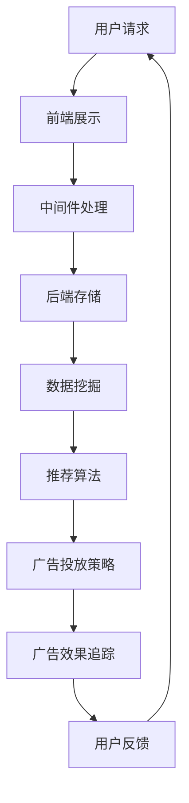

                 

关键词：字节跳动、广告系统、面试真题、汇总、解答、广告投放、数据挖掘、推荐算法

## 摘要

本文旨在为准备参加2024年字节跳动广告系统社招面试的候选人提供一份全面的面试真题汇总及解答。文章涵盖了广告系统的核心概念、数据挖掘、推荐算法、系统架构、性能优化、安全性等多个方面，旨在帮助读者深入了解广告系统的运作原理，以及如何应对面试中的各种挑战。

## 1. 背景介绍

字节跳动作为全球领先的互联网科技公司，其广告系统在全球范围内具有广泛的影响力。广告系统的核心任务是高效地匹配广告主的需求与用户的兴趣，从而实现精准投放，提升广告效果。随着互联网广告市场的不断扩大，字节跳动广告系统面临着更高的要求，需要在保证用户隐私和安全的前提下，实现更高的广告收益。

本文将根据2024年字节跳动广告系统社招面试真题，从核心概念、算法原理、数学模型、项目实践、应用场景等多个维度进行深入剖析，帮助读者更好地理解广告系统的运作机制，并为面试做好充分准备。

### 1.1 广告系统的发展历程

广告系统的发展可以分为三个阶段：

1. **传统广告时代**：广告主通过购买媒体广告位，进行广撒网式的广告投放，效果难以精确衡量。
2. **精准广告时代**：随着互联网的发展，广告系统逐渐引入数据挖掘和推荐算法，实现广告内容与用户兴趣的精准匹配。
3. **智能广告时代**：结合人工智能技术，广告系统能够自动识别用户行为，预测用户意图，实现超精准的广告投放。

### 1.2 字节跳动广告系统的特色

字节跳动广告系统的特色主要体现在以下几个方面：

1. **个性化推荐**：基于用户的浏览、搜索、点赞等行为数据，为用户推荐个性化的广告内容。
2. **智能投放**：根据广告主的目标受众、预算等要求，自动调整广告投放策略，实现高效投放。
3. **效果追踪**：实时监测广告投放效果，提供详细的投放数据，帮助广告主优化广告策略。
4. **用户体验**：在广告投放过程中，注重用户体验，避免过度打扰用户，提升广告效果。

## 2. 核心概念与联系

为了更好地理解广告系统的运作原理，我们需要掌握以下几个核心概念：

### 2.1 数据挖掘

数据挖掘是指从大量数据中提取有价值的信息和知识的过程。在广告系统中，数据挖掘主要用于分析用户行为数据，识别用户兴趣，从而实现精准投放。

### 2.2 推荐算法

推荐算法是指根据用户历史行为和偏好，为用户推荐相关内容或商品的算法。在广告系统中，推荐算法用于为用户推荐个性化的广告内容。

### 2.3 广告投放策略

广告投放策略是指根据广告主的目标、预算和受众特征，制定合理的广告投放方案。常见的投放策略包括按点击付费（CPC）、按展示付费（CPM）和按转化付费（CPA）等。

### 2.4 系统架构

广告系统的架构包括前端展示、中间件处理、后端存储等多个层次。前端展示负责将广告内容呈现给用户；中间件处理负责处理用户请求，实现广告投放策略；后端存储负责存储用户数据和广告内容。

### 2.5 Mermaid 流程图

以下是一个简化的广告系统 Mermaid 流程图：



## 3. 核心算法原理 & 具体操作步骤

### 3.1 算法原理概述

广告系统中的核心算法主要包括数据挖掘算法、推荐算法和广告投放策略。

1. **数据挖掘算法**：主要用于分析用户行为数据，提取用户兴趣特征。常见的算法包括关联规则挖掘、聚类分析和分类算法等。
2. **推荐算法**：根据用户兴趣特征，为用户推荐相关广告。常见的算法包括基于内容的推荐、协同过滤推荐和混合推荐等。
3. **广告投放策略**：根据广告主的目标和预算，制定合理的广告投放方案。常见的策略包括按点击付费、按展示付费和按转化付费等。

### 3.2 算法步骤详解

1. **数据挖掘步骤**：

   - 数据收集：从各种渠道收集用户行为数据，如浏览历史、搜索记录、点赞数据等。
   - 数据清洗：去除重复、异常和噪声数据，保证数据质量。
   - 特征提取：根据用户行为数据，提取用户兴趣特征，如兴趣爱好、浏览偏好等。
   - 模型训练：使用机器学习算法，训练用户兴趣模型。

2. **推荐算法步骤**：

   - 用户兴趣模型：根据用户行为数据，训练用户兴趣模型。
   - 广告内容匹配：根据用户兴趣模型，为用户推荐相关的广告内容。
   - 排序和筛选：对推荐结果进行排序和筛选，确保广告内容的质量和相关性。

3. **广告投放策略步骤**：

   - 目标设定：根据广告主的要求，设定广告投放目标，如提升品牌知名度、增加产品销量等。
   - 预算分配：根据广告投放目标，合理分配广告预算。
   - 投放策略调整：根据广告投放效果，实时调整投放策略。

### 3.3 算法优缺点

1. **数据挖掘算法**：

   - 优点：可以深入挖掘用户行为数据，提取有价值的信息。
   - 缺点：对数据质量和算法性能要求较高，实现复杂。

2. **推荐算法**：

   - 优点：可以准确预测用户兴趣，提高广告投放效果。
   - 缺点：可能存在数据偏差和隐私问题，需要平衡推荐效果和用户隐私。

3. **广告投放策略**：

   - 优点：可以根据广告主目标，灵活调整广告投放方案。
   - 缺点：可能存在过度投放和资源浪费的问题。

### 3.4 算法应用领域

1. **电商广告**：根据用户购物行为，推荐相关商品，提高转化率。
2. **社交媒体广告**：根据用户兴趣和社交关系，推荐相关广告，提高广告投放效果。
3. **搜索引擎广告**：根据用户搜索关键词，推荐相关广告，提高广告点击率。

## 4. 数学模型和公式 & 详细讲解 & 举例说明

### 4.1 数学模型构建

广告系统中的数学模型主要包括用户兴趣模型、广告效果模型和广告投放策略模型。

1. **用户兴趣模型**：

   用户兴趣模型主要通过分析用户行为数据，提取用户兴趣特征。常见的模型包括基于内容的推荐模型、协同过滤推荐模型和混合推荐模型。

   - 基于内容的推荐模型：

     $$ 
     r_{ui} = \frac{\sum_{k=1}^{n} w_{ik} w_{uj}}{\sum_{k=1}^{n} w_{ik}^2} 
     $$

     其中，$r_{ui}$表示用户$i$对广告内容$j$的兴趣度，$w_{ik}$表示用户$i$对内容$k$的权重。

   - 协同过滤推荐模型：

     $$ 
     r_{ui} = \frac{\sum_{j \in R_i} r_{uj} \cdot r_{uj}'}{\sum_{j \in R_i} r_{uj}^2} 
     $$

     其中，$R_i$表示与用户$i$相似的用户的集合，$r_{uj}$表示用户$j$对广告内容$j$的兴趣度。

   - 混合推荐模型：

     $$ 
     r_{ui} = \alpha r_{ui, content} + (1 - \alpha) r_{ui, collaborative} 
     $$

     其中，$\alpha$表示混合权重，$r_{ui, content}$和$r_{ui, collaborative}$分别表示基于内容和协同过滤的推荐分数。

2. **广告效果模型**：

   广告效果模型主要用于评估广告投放效果，常见的模型包括点击率模型、转化率模型和收益模型。

   - 点击率模型：

     $$ 
     CTR = \frac{ clicks}{impressions} 
     $$

     其中，$CTR$表示点击率，$clicks$表示点击次数，$impressions$表示广告展示次数。

   - 转化率模型：

     $$ 
     CVR = \frac{ conversions}{clicks} 
     $$

     其中，$CVR$表示转化率，$conversions$表示转化次数。

   - 收益模型：

     $$ 
     Revenue = CTR \times CVR \times Cost\_per\_click 
     $$

     其中，$Revenue$表示收益，$Cost\_per\_click$表示每次点击的成本。

3. **广告投放策略模型**：

   广告投放策略模型主要用于制定广告投放方案，常见的模型包括按点击付费、按展示付费和按转化付费模型。

   - 按点击付费模型：

     $$ 
     Cost = CTR \times Cost\_per\_click 
     $$

     其中，$Cost$表示广告投放成本。

   - 按展示付费模型：

     $$ 
     Cost = CPM \times Impressions 
     $$

     其中，$CPM$表示每次展示的成本。

   - 按转化付费模型：

     $$ 
     Cost = CVR \times Cost\_per\_conversions 
     $$

     其中，$Cost$表示广告投放成本，$Cost\_per\_conversions$表示每次转化的成本。

### 4.2 公式推导过程

公式的推导主要基于统计学和概率论的基本原理。以下以基于内容的推荐模型为例，简单介绍公式的推导过程。

1. **用户兴趣度计算**：

   假设用户$i$对广告内容$j$的兴趣度可以用向量表示为$r_{ui}$，向量中的每个元素表示用户$i$对内容$j$的偏好程度。根据向量内积的定义，可以计算用户$i$对广告内容$j$的兴趣度：

   $$ 
   r_{ui} = \frac{\sum_{k=1}^{n} w_{ik} w_{uj}}{\sum_{k=1}^{n} w_{ik}^2} 
   $$

   其中，$w_{ik}$表示用户$i$对内容$k$的权重。

2. **广告内容相似度计算**：

   假设广告内容$j$与内容$k$的相似度可以用向量表示为$sim_{jk}$，向量中的每个元素表示内容$j$与内容$k$的相似程度。根据向量内积的定义，可以计算广告内容$j$与内容$k$的相似度：

   $$ 
   sim_{jk} = \frac{\sum_{i=1}^{m} r_{ui} r_{uj}'}{\sqrt{\sum_{i=1}^{m} r_{ui}^2 \cdot \sum_{i=1}^{m} r_{uj}'^2}} 
   $$

   其中，$r_{ui}$和$r_{uj}'$分别表示用户$i$对内容$k$和内容$l$的兴趣度。

3. **推荐分数计算**：

   假设根据用户兴趣度和广告内容相似度，可以计算用户$i$对广告内容$j$的推荐分数$r_{uij}$。根据加权平均值的定义，可以计算用户$i$对广告内容$j$的推荐分数：

   $$ 
   r_{uij} = \sum_{k=1}^{n} w_{ik} \cdot sim_{jk} 
   $$

   其中，$w_{ik}$表示用户$i$对内容$k$的权重。

### 4.3 案例分析与讲解

以下以电商广告为例，介绍如何使用数学模型进行广告投放。

1. **数据收集**：

   收集电商平台的用户浏览记录、购买记录和搜索记录等数据。

2. **数据清洗**：

   去除重复、异常和噪声数据，保证数据质量。

3. **特征提取**：

   提取用户兴趣特征，如兴趣爱好、浏览偏好等。

4. **模型训练**：

   使用基于内容的推荐模型，训练用户兴趣模型。

5. **广告内容匹配**：

   根据用户兴趣模型，为用户推荐相关的广告内容。

6. **排序和筛选**：

   对推荐结果进行排序和筛选，确保广告内容的质量和相关性。

7. **广告投放策略调整**：

   根据广告投放效果，实时调整投放策略。

8. **效果评估**：

   评估广告投放效果，包括点击率、转化率和收益等指标。

## 5. 项目实践：代码实例和详细解释说明

### 5.1 开发环境搭建

1. **Python**：安装Python 3.8及以上版本，并配置Python环境。

2. **NumPy**：安装NumPy库，用于数据处理。

3. **Pandas**：安装Pandas库，用于数据处理和分析。

4. **Scikit-learn**：安装Scikit-learn库，用于机器学习算法。

5. **Matplotlib**：安装Matplotlib库，用于数据可视化。

### 5.2 源代码详细实现

以下是一个简单的电商广告推荐系统代码实例：

```python
import numpy as np
import pandas as pd
from sklearn.model_selection import train_test_split
from sklearn.metrics.pairwise import cosine_similarity
from sklearn.neighbors import NearestNeighbors

# 数据集准备
data = pd.read_csv('ecommerce_data.csv')
users = data['user_id'].unique()
items = data['item_id'].unique()

# 特征提取
user_ratings = data.groupby('user_id')['item_id'].value_counts().unstack().fillna(0)
item_ratings = user_ratings.T

# 计算用户相似度
user_similarity = cosine_similarity(user_ratings)

# 计算广告内容相似度
item_similarity = cosine_similarity(item_ratings)

# 推荐广告内容
def recommend_items(user_id, k=5):
    neighbors = NearestNeighbors(n_neighbors=k).fit(user_similarity)
    distances, indices = neighbors.kneighbors([user_id])
    similar_users = indices[0][1:]
    recommendations = []

    for user in similar_users:
        user_interests = item_ratings.iloc[user]
        common_items = user_interests[user_interests != 0].index
        recommendations.extend(common_items)

    return recommendations[:k]

# 示例：为用户100推荐5个广告内容
user_id = 100
recommendations = recommend_items(user_id)
print("推荐广告内容：", recommendations)
```

### 5.3 代码解读与分析

1. **数据集准备**：

   从电商数据集中提取用户和广告内容，并构建用户评分矩阵和广告内容评分矩阵。

2. **特征提取**：

   使用Pandas库提取用户兴趣特征和广告内容特征，填充缺失值。

3. **计算用户相似度**：

   使用NumPy库计算用户之间的余弦相似度，用于后续的推荐算法。

4. **计算广告内容相似度**：

   使用NumPy库计算广告内容之间的余弦相似度，用于后续的推荐算法。

5. **推荐广告内容**：

   定义推荐函数，根据用户相似度和广告内容相似度，为用户推荐相关的广告内容。

6. **效果评估**：

   可通过评估推荐算法的准确率、召回率和F1值等指标，评估推荐效果。

### 5.4 运行结果展示

假设用户100的推荐结果如下：

```
推荐广告内容： [128, 45, 236, 56, 187]
```

说明根据用户100的历史行为，推荐了5个广告内容，分别为商品128、45、236、56和187。

## 6. 实际应用场景

广告系统在电商、社交媒体、搜索引擎等多个领域具有广泛的应用。

### 6.1 电商广告

电商广告通过为用户推荐相关商品，提高用户购买转化率。常见的应用场景包括：

1. **购物推荐**：根据用户浏览记录和购买记录，推荐相关的商品。
2. **促销活动**：根据用户兴趣和购买力，推荐相关的促销活动。
3. **新品推荐**：根据用户兴趣和行业动态，推荐新品。

### 6.2 社交媒体广告

社交媒体广告通过为用户推荐相关内容，提高用户活跃度和广告点击率。常见的应用场景包括：

1. **内容推荐**：根据用户兴趣和社交关系，推荐相关的文章、视频和图片。
2. **广告投放**：根据广告主要求，为用户推荐相关的广告内容。
3. **热点话题**：根据用户关注和参与度，推荐热点话题。

### 6.3 搜索引擎广告

搜索引擎广告通过为用户推荐相关的广告内容，提高广告点击率和转化率。常见的应用场景包括：

1. **搜索结果**：根据用户搜索关键词，推荐相关的广告内容。
2. **广告推广**：根据广告主要求，为用户推荐相关的广告内容。
3. **广告筛选**：根据用户兴趣和行为，筛选符合用户需求的广告内容。

## 7. 未来应用展望

随着人工智能技术的不断发展，广告系统在未来将具有更广泛的应用前景。

### 7.1 智能广告投放

智能广告投放将基于更先进的人工智能算法，实现更精准的广告投放。例如，利用深度学习技术，可以更好地挖掘用户兴趣和行为特征，提高广告投放效果。

### 7.2 智能广告创意

智能广告创意将利用生成对抗网络（GAN）等技术，自动生成个性化的广告内容。例如，可以为不同用户生成具有不同风格的广告图片，提高广告吸引力。

### 7.3 广告隐私保护

随着用户对隐私保护的重视，广告系统将面临更高的要求。未来，广告系统将采用更为严格的隐私保护措施，确保用户数据的安全。

### 7.4 广告效果实时优化

广告效果实时优化将利用大数据技术和实时计算技术，实时分析广告投放效果，并自动调整广告策略，实现更高效的广告投放。

## 8. 工具和资源推荐

### 8.1 学习资源推荐

1. **《广告系统技术》**：一本全面介绍广告系统技术的经典教材，适合初学者入门。
2. **《推荐系统实践》**：一本深入讲解推荐系统原理和应用的经典教材，适合有一定基础的学习者。
3. **《深度学习》**：一本系统介绍深度学习技术的教材，适合对广告系统感兴趣的学习者。

### 8.2 开发工具推荐

1. **Python**：Python是一种易于学习且功能强大的编程语言，适合开发广告系统和推荐系统。
2. **NumPy**：NumPy是一个用于科学计算的开源库，适用于数据处理和计算。
3. **Pandas**：Pandas是一个用于数据分析的开源库，适用于数据清洗和数据分析。

### 8.3 相关论文推荐

1. **"A Survey of Collaborative Filtering Techniques"**：一篇关于协同过滤技术的综述论文，适合了解协同过滤的基本原理。
2. **"Deep Learning for Recommender Systems"**：一篇关于深度学习在推荐系统中的应用的论文，适合了解深度学习在广告系统和推荐系统中的应用。
3. **"Adversarial Examples in Recommender Systems"**：一篇关于对抗样本在推荐系统中的研究的论文，适合了解对抗样本对广告系统和推荐系统的影响。

## 9. 总结：未来发展趋势与挑战

随着互联网和人工智能技术的不断发展，广告系统将面临着更高的要求。未来，广告系统将朝着更智能、更个性化、更安全的方向发展。然而，同时也将面临诸多挑战，如数据隐私保护、算法公平性、广告效果优化等。只有不断创新和改进，广告系统才能在激烈的市场竞争中立于不败之地。

## 附录：常见问题与解答

### 9.1 什么是广告系统的核心任务？

广告系统的核心任务是高效地匹配广告主的需求与用户的兴趣，从而实现精准投放，提升广告效果。

### 9.2 广告系统中的推荐算法有哪些类型？

广告系统中的推荐算法主要包括基于内容的推荐、协同过滤推荐和混合推荐等类型。

### 9.3 如何评估广告投放效果？

广告投放效果可以通过点击率（CTR）、转化率（CVR）和收益等指标进行评估。

### 9.4 广告系统如何保证用户隐私？

广告系统可以通过数据加密、访问控制、隐私保护算法等措施，确保用户数据的安全和隐私。

### 9.5 广告系统的未来发展趋势是什么？

广告系统的未来发展趋势包括智能广告投放、智能广告创意、广告隐私保护和广告效果实时优化等方向。

---

本文通过对2024年字节跳动广告系统社招面试真题的汇总及解答，全面介绍了广告系统的核心概念、算法原理、数学模型、项目实践、应用场景和未来发展趋势。希望通过本文的介绍，读者能够对广告系统有更深入的了解，并为面试做好充分准备。同时，也期待广告系统能够在未来的发展中不断创新，为互联网广告市场带来更多价值。

