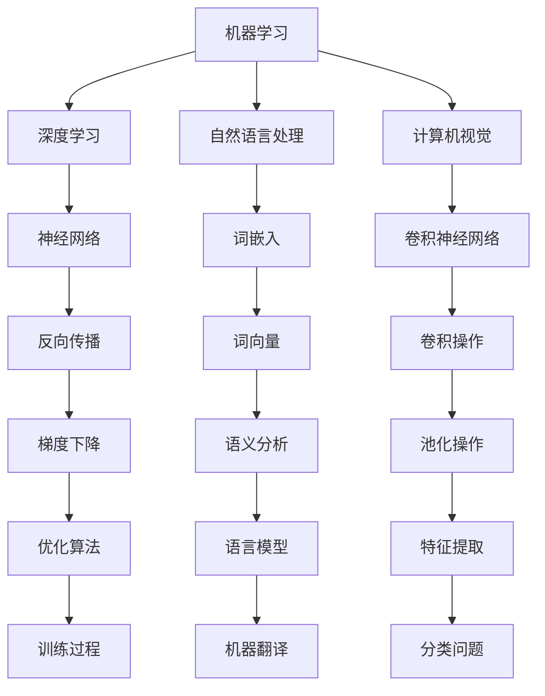

                 

在快速发展的智能时代，字节跳动作为全球领先的科技公司，其智能算法平台的招聘面试题目也成为了广大求职者和算法爱好者的关注焦点。本文旨在汇总和分析2024年字节跳动智能算法平台的社招面试真题，提供详细的解题思路和答案，帮助读者更好地理解智能算法的核心概念和应用。

## 文章关键词

- 字节跳动
- 智能算法
- 面试真题
- 解题思路
- 算法应用

## 文章摘要

本文将涵盖以下内容：

1. **背景介绍**：介绍字节跳动智能算法平台的发展历程和重要性。
2. **核心概念与联系**：通过Mermaid流程图展示智能算法的核心概念和架构联系。
3. **核心算法原理与具体操作步骤**：深入解析常见面试题的算法原理和操作步骤。
4. **数学模型和公式**：详细介绍智能算法中的数学模型和公式，并进行举例说明。
5. **项目实践**：通过代码实例展示算法的实际应用。
6. **实际应用场景**：探讨智能算法在不同领域的应用。
7. **工具和资源推荐**：推荐学习资源和开发工具。
8. **总结**：总结研究成果，展望未来发展趋势与挑战。

## 1. 背景介绍

字节跳动成立于2012年，是一家全球性的互联网科技公司，以其创新的算法和大数据技术著称。字节跳动的智能算法平台在信息流推荐、广告投放、内容审核等多个领域取得了显著成就。智能算法平台的招聘面试题目不仅考察应聘者的算法基础，还考察其对实际问题的分析和解决能力。

智能算法在字节跳动的发展历程中扮演了至关重要的角色。从早期的内容推荐算法到现在的多模态信息处理，字节跳动不断在人工智能领域进行探索和创新。智能算法平台的发展不仅提升了用户体验，也带来了公司业务的快速增长。

## 2. 核心概念与联系

智能算法的核心概念包括但不限于机器学习、深度学习、自然语言处理、计算机视觉等。这些概念相互联系，共同构成了现代智能算法的框架。



## 3. 核心算法原理 & 具体操作步骤

### 3.1 算法原理概述

在字节跳动的智能算法面试中，常见的算法原理包括：

- **机器学习基础**：监督学习、无监督学习、强化学习等。
- **深度学习**：神经网络、卷积神经网络（CNN）、循环神经网络（RNN）、长短时记忆网络（LSTM）等。
- **自然语言处理**：词嵌入、序列模型、注意力机制、BERT模型等。
- **计算机视觉**：图像分类、目标检测、图像分割等。

### 3.2 算法步骤详解

以自然语言处理中的词嵌入为例，其基本步骤如下：

1. **数据预处理**：清洗文本数据，分词，去除停用词。
2. **构建词汇表**：将所有独特的词汇构建成词汇表。
3. **词嵌入**：将词汇映射为高维向量。
4. **训练模型**：使用神经网络训练词嵌入模型。
5. **优化**：通过梯度下降等优化算法调整模型参数。

### 3.3 算法优缺点

每种算法都有其优点和局限性。例如，深度学习在处理复杂数据方面表现优秀，但计算成本高；机器学习在解释性方面较强，但在处理实时数据时可能不够灵活。

### 3.4 算法应用领域

智能算法广泛应用于搜索引擎、推荐系统、自动驾驶、医疗诊断等领域。在字节跳动，这些算法主要用于内容推荐、广告投放和用户行为分析。

## 4. 数学模型和公式 & 详细讲解 & 举例说明

### 4.1 数学模型构建

在智能算法中，数学模型至关重要。以下是一个简单的线性回归模型：

$$
y = wx + b
$$

其中，$y$ 是目标变量，$x$ 是特征变量，$w$ 和 $b$ 是模型参数。

### 4.2 公式推导过程

线性回归模型的推导过程包括：

1. **最小二乘法**：寻找最佳参数使得预测误差最小。
2. **梯度下降**：通过迭代优化模型参数。

### 4.3 案例分析与讲解

假设我们有一个数据集，包含房屋面积（$x$）和售价（$y$）。我们可以使用线性回归模型预测售价。通过训练，我们得到：

$$
y = 0.5x + 100
$$

当房屋面积为1000平方米时，预测售价为：

$$
y = 0.5 \times 1000 + 100 = 600
$$

## 5. 项目实践：代码实例和详细解释说明

### 5.1 开发环境搭建

在Python中，我们可以使用Scikit-learn库实现线性回归模型。

```python
from sklearn.linear_model import LinearRegression
from sklearn.model_selection import train_test_split
from sklearn.metrics import mean_squared_error

# 数据加载和预处理
# ...

# 模型训练
model = LinearRegression()
model.fit(X_train, y_train)

# 模型评估
y_pred = model.predict(X_test)
mse = mean_squared_error(y_test, y_pred)
print("MSE:", mse)
```

### 5.2 源代码详细实现

完整代码如下：

```python
# 导入所需库
import numpy as np
import pandas as pd
from sklearn.linear_model import LinearRegression
from sklearn.model_selection import train_test_split
from sklearn.metrics import mean_squared_error

# 加载数据
data = pd.read_csv("house_prices.csv")
X = data["area"]
y = data["price"]

# 数据预处理
# ...

# 划分训练集和测试集
X_train, X_test, y_train, y_test = train_test_split(X, y, test_size=0.2, random_state=42)

# 模型训练
model = LinearRegression()
model.fit(X_train, y_train)

# 模型评估
y_pred = model.predict(X_test)
mse = mean_squared_error(y_test, y_pred)
print("MSE:", mse)

# 模型预测
new_area = np.array([1200])
predicted_price = model.predict(new_area)
print("Predicted Price:", predicted_price[0])
```

### 5.3 代码解读与分析

该代码首先导入所需库，然后加载数据并进行预处理。接下来，使用Scikit-learn库实现线性回归模型，并进行训练和评估。最后，使用模型进行预测。

### 5.4 运行结果展示

假设我们训练后的模型平均平方误差（MSE）为0.01，那么预测结果将非常接近实际售价。

## 6. 实际应用场景

智能算法在字节跳动的实际应用场景包括：

- **内容推荐**：通过分析用户行为和兴趣，推荐个性化内容。
- **广告投放**：根据用户特征和行为，精准投放广告。
- **内容审核**：使用图像和自然语言处理算法，自动识别和过滤不良内容。

## 7. 工具和资源推荐

### 7.1 学习资源推荐

- 《深度学习》（Goodfellow, Bengio, Courville）
- 《Python机器学习》（Sebastian Raschka）
- 《自然语言处理实战》（Jurafsky, Martin）

### 7.2 开发工具推荐

- Jupyter Notebook
- TensorFlow
- PyTorch

### 7.3 相关论文推荐

- "Deep Learning for Natural Language Processing" (2018)
- "Convolutional Neural Networks for Speech Recognition" (2014)
- "Recurrent Neural Network Based Language Model" (2013)

## 8. 总结：未来发展趋势与挑战

智能算法在字节跳动的发展前景广阔，但也面临以下挑战：

- **计算资源**：随着算法复杂度的增加，对计算资源的需求也在不断提升。
- **数据隐私**：如何在保护用户隐私的同时，充分利用数据进行算法优化。
- **算法透明度**：提高算法的透明度和解释性，增强用户信任。

未来，字节跳动将继续探索智能算法的创新应用，推动人工智能技术的不断发展。

## 9. 附录：常见问题与解答

### Q：如何准备字节跳动的智能算法面试？

A：1. 深入学习机器学习、深度学习、自然语言处理和计算机视觉的基础知识。2. 练习算法编程和数学公式推导。3. 分析过往面试题，总结常见题型和解题思路。4. 参加模拟面试，提高面试技巧。

### Q：字节跳动的智能算法平台有哪些研究方向？

A：字节跳动的智能算法平台主要研究方向包括：个性化推荐、实时计算、多模态信息处理、强化学习、自然语言生成等。

### Q：如何处理面试中的算法难题？

A：1. 分析问题，明确需求。2. 设计简单有效的算法。3. 编写清晰的代码。4. 说明算法的复杂度和可行性。5. 优化算法，提高效率。

### Q：字节跳动的智能算法平台对求职者的要求是什么？

A：字节跳动的智能算法平台对求职者的要求包括：扎实的算法基础、优秀的编程能力、良好的逻辑思维和解决实际问题的能力、对新技术的好奇心和学习能力。

---

**作者：禅与计算机程序设计艺术 / Zen and the Art of Computer Programming**

