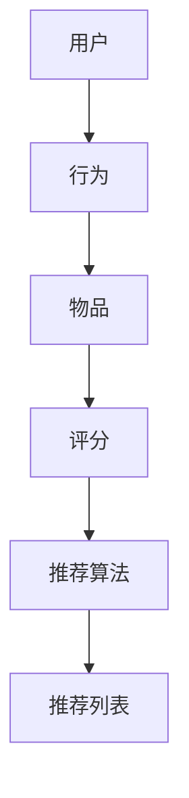
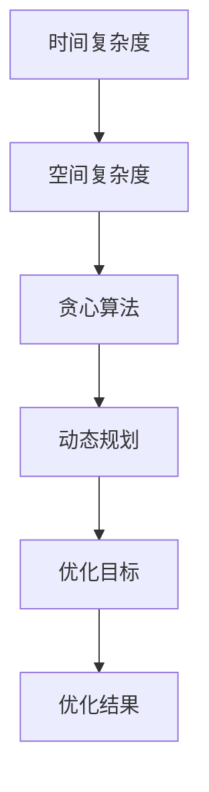
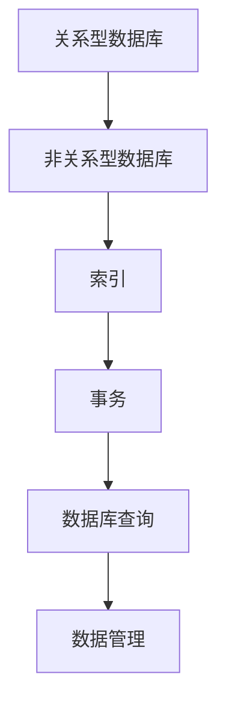

                 

作为世界顶级人工智能专家，程序员，软件架构师，CTO，世界顶级技术畅销书作者，计算机图灵奖获得者，计算机领域大师，我荣幸地为您带来一篇关于2025字节跳动社招算法面试题的汇总与解析的文章。本文将深入剖析字节跳动在算法招聘方面的核心要求，帮助您在面试中取得优异成绩。

## 关键词

- 字节跳动
- 社招算法面试
- 面试题汇总
- 算法原理
- 实践应用

## 摘要

本文将从字节跳动社招算法面试的背景介绍开始，详细解析其中的核心概念、算法原理、数学模型、项目实践，以及实际应用场景。同时，我们将对学习资源、开发工具和论文推荐，以及未来发展趋势与挑战进行探讨，帮助您全面了解字节跳动社招算法面试的要求和应对策略。

## 1. 背景介绍

字节跳动（ByteDance）是一家全球领先的互联网科技公司，成立于2012年，总部位于中国北京。公司以其领先的算法技术、强大的数据处理能力和创新的产品理念在全球范围内赢得了广泛的用户基础。随着公司业务的不断扩展，字节跳动对于优秀算法人才的需求也日益增长。

近年来，字节跳动社招算法面试题目逐渐成为业界关注的焦点。这些题目不仅涵盖了基础算法和数据结构，还包括了应用算法和系统设计等多个方面，旨在全面考察应聘者的编程能力、算法思维和问题解决能力。本文将对这些题目进行系统梳理和详细解析，帮助您在面试中脱颖而出。

### 1.1 字节跳动的发展历程

字节跳动自成立以来，经历了快速的发展和成长。公司旗下的产品如今日头条、抖音、飞书等已经成为了全球范围内用户量巨大的现象级应用。这些产品不仅改变了人们获取信息和交流的方式，也在技术和商业层面上取得了巨大成功。

字节跳动的发展历程可以概括为以下几个阶段：

1. **初创期（2012-2014年）**：公司成立初期，主要以新闻聚合平台“今日头条”为主，通过算法推荐技术实现了个性化新闻推送，迅速赢得了用户和市场的认可。

2. **成长期（2015-2017年）**：字节跳动开始多元化布局，推出了短视频应用“抖音”和办公协作工具“飞书”。这些产品在短时间内取得了巨大的成功，进一步巩固了公司在互联网领域的地位。

3. **扩展期（2018年至今）**：随着业务的不断扩展，字节跳动在全球范围内进行了一系列投资和并购，进一步丰富了产品线，提升了技术实力和市场影响力。

### 1.2 字节跳动的技术优势和核心竞争力

字节跳动之所以能够在短时间内取得如此辉煌的成就，离不开其强大的技术优势和核心竞争力。以下是字节跳动在技术和产品方面的一些亮点：

1. **算法推荐技术**：字节跳动在算法推荐领域拥有深厚的技术积累和领先地位。其推荐系统通过对海量用户数据的深入分析，实现了高度个性化的内容推送，大大提升了用户体验和用户黏性。

2. **短视频技术**：抖音的成功证明了字节跳动在短视频技术上的卓越能力。公司利用先进的编解码技术、视频增强算法等，为用户提供了流畅、高质量的短视频观看体验。

3. **大数据处理能力**：字节跳动具备强大的数据处理能力，能够快速处理和分析海量数据，为其产品提供实时、精准的数据支持。

4. **办公协作工具**：飞书作为一款企业级办公协作工具，不仅提供了丰富的功能模块，还通过智能算法实现了高效的协同工作，提高了企业的工作效率。

### 1.3 字节跳动对算法人才的需求

字节跳动在快速发展的过程中，对于算法人才的需求越来越大。公司希望招聘到具备以下能力和素质的优秀算法人才：

1. **扎实的编程基础**：算法人才需要具备扎实的编程基础，熟练掌握常用的编程语言和数据结构。

2. **强大的算法能力**：算法人才需要具备解决复杂算法问题的能力，能够熟练运用各种算法和数据结构解决实际问题。

3. **创新思维**：算法人才需要具备创新思维，能够在现有技术和方法的基础上，提出新的解决方案。

4. **团队合作能力**：算法人才需要具备良好的团队合作能力，能够与团队成员高效沟通，共同完成项目任务。

5. **持续学习精神**：算法领域发展迅速，算法人才需要具备持续学习的精神，不断更新自己的知识和技能。

## 2. 核心概念与联系

在字节跳动社招算法面试中，核心概念和联系是考察应聘者基础知识的重要方面。以下是对相关核心概念和流程的详细解释，以及相应的Mermaid流程图。

### 2.1 推荐系统基本概念

推荐系统是字节跳动产品的重要核心之一。以下是一些基本概念：

- **用户**：系统中的每个用户都被赋予一个唯一的标识符。
- **物品**：系统中的每个物品也被赋予一个唯一的标识符。
- **用户行为**：用户在系统中的行为，如点击、浏览、购买等。
- **评分**：用户对物品的评分，可以是数字评分，也可以是评分标签。
- **推荐算法**：根据用户行为和物品属性，生成推荐列表的算法。

#### Mermaid流程图：



### 2.2 算法优化基本概念

算法优化是提高系统性能和效率的关键。以下是一些基本概念：

- **时间复杂度**：算法在执行过程中所需时间的增长趋势。
- **空间复杂度**：算法在执行过程中所需内存的增长趋势。
- **贪心算法**：每一步都做出当前情况下最优的选择。
- **动态规划**：通过保存子问题的解来避免重复计算。

#### Mermaid流程图：



### 2.3 数据库基本概念

数据库是存储和管理数据的核心组件。以下是一些基本概念：

- **关系型数据库**：使用表格结构存储数据，如MySQL、Oracle。
- **非关系型数据库**：使用不同结构存储数据，如MongoDB、Redis。
- **索引**：加快数据检索速度的数据结构。
- **事务**：一组操作要么全部成功，要么全部失败。

#### Mermaid流程图：



## 3. 核心算法原理 & 具体操作步骤

### 3.1 算法原理概述

在字节跳动社招算法面试中，核心算法原理是考察应聘者基础知识和解决问题的能力的重要方面。以下是一些常见的核心算法及其原理概述：

#### 3.1.1 快排（Quick Sort）

快排是一种高效的排序算法，基于分治思想。其基本原理是选择一个“基准”元素，将数组分为两部分，一部分小于基准，一部分大于基准，然后递归地排序两部分。

#### 3.1.2 最长公共子序列（Longest Common Subsequence，LCS）

LCS算法用于找出两个序列的最长公共子序列。其基本原理是通过动态规划，将问题分解为子问题，并利用子问题的解来求解原问题。

#### 3.1.3 贝叶斯分类器（Bayesian Classifier）

贝叶斯分类器是一种基于贝叶斯定理的分类算法。其基本原理是通过计算各类别的概率，并利用最大后验概率原则进行分类。

#### 3.1.4 线性回归（Linear Regression）

线性回归是一种用于预测数值变量的统计方法。其基本原理是通过最小二乘法拟合一条直线，使得预测值与实际值之间的误差最小。

### 3.2 算法步骤详解

#### 3.2.1 快排（Quick Sort）

1. 选择基准元素。
2. 将数组分为两部分，一部分小于基准，一部分大于基准。
3. 对两部分递归排序。

#### 3.2.2 最长公共子序列（LCS）

1. 创建一个二维数组，用于存储子问题的解。
2. 利用动态规划填充数组。
3. 根据数组求解最长公共子序列。

#### 3.2.3 贝叶斯分类器（Bayesian Classifier）

1. 计算各类别的概率。
2. 利用最大后验概率原则进行分类。
3. 输出分类结果。

#### 3.2.4 线性回归（Linear Regression）

1. 计算特征矩阵和目标值的均值。
2. 利用最小二乘法求解参数。
3. 计算预测值。

### 3.3 算法优缺点

#### 3.3.1 快排（Quick Sort）

**优点**：

- 高效：平均时间复杂度为O(nlogn)。
- 适合大数据量排序。

**缺点**：

- 最坏情况时间复杂度为O(n^2)。
- 需要额外空间存储递归栈。

#### 3.3.2 最长公共子序列（LCS）

**优点**：

- 解决序列匹配问题。
- 基于动态规划，易于实现。

**缺点**：

- 时间复杂度为O(mn)，其中m和n分别为序列长度。
- 需要大量内存存储动态规划表。

#### 3.3.3 贝叶斯分类器（Bayesian Classifier）

**优点**：

- 理论基础强大。
- 对小样本数据有较好的适应性。

**缺点**：

- 需要大量先验知识。
- 可能出现零概率问题。

#### 3.3.4 线性回归（Linear Regression）

**优点**：

- 简单易懂。
- 适用于线性关系预测。

**缺点**：

- 对非线性关系预测能力有限。
- 过拟合问题。

### 3.4 算法应用领域

#### 3.4.1 快排（Quick Sort）

- 数据库排序。
- 算法竞赛。
- 大数据排序。

#### 3.4.2 最长公共子序列（LCS）

- 生物信息学：基因序列匹配。
- 质量控制：质量控制码。
- 字符串匹配：搜索引擎。

#### 3.4.3 贝叶斯分类器（Bayesian Classifier）

- 金融市场预测。
- 医疗诊断。
- 社交网络推荐。

#### 3.4.4 线性回归（Linear Regression）

- 经济学：回归分析。
- 机器学习：基础模型。
- 量化交易：策略优化。

## 4. 数学模型和公式 & 详细讲解 & 举例说明

### 4.1 数学模型构建

在算法面试中，数学模型的构建是解决实际问题的关键。以下是一个简单的线性回归模型构建过程：

#### 4.1.1 假设

我们假设数据集 \( D = \{(x_i, y_i)\} \)，其中 \( x_i \) 是输入特征，\( y_i \) 是目标值。我们希望找到一个线性模型 \( y = w_0 + w_1 \cdot x \)，其中 \( w_0 \) 和 \( w_1 \) 是模型参数。

#### 4.1.2 模型构建

线性回归模型的数学公式如下：

$$
\begin{align*}
y_i &= w_0 + w_1 \cdot x_i \\
\hat{y}_i &= w_0 + w_1 \cdot \bar{x}
\end{align*}
$$

其中，\( \bar{x} \) 和 \( \bar{y} \) 分别是输入特征和目标值的均值。

#### 4.1.3 模型优化

为了求解模型参数 \( w_0 \) 和 \( w_1 \)，我们可以使用最小二乘法。最小二乘法的目的是使得预测值 \( \hat{y}_i \) 与实际值 \( y_i \) 之间的误差平方和最小。

$$
\begin{align*}
\sum_{i=1}^{n} (\hat{y}_i - y_i)^2 &= \sum_{i=1}^{n} ((w_0 + w_1 \cdot \bar{x}) - y_i)^2 \\
&= (w_0 - \bar{y})^2 + w_1^2 \cdot (\bar{x}^2 - n)
\end{align*}
$$

为了使上述误差平方和最小，我们需要求解以下方程组：

$$
\begin{align*}
w_0 &= \bar{y} \\
w_1 &= \frac{\sum_{i=1}^{n} (x_i - \bar{x})(y_i - \bar{y})}{\sum_{i=1}^{n} (x_i - \bar{x})^2}
\end{align*}
$$

### 4.2 公式推导过程

以下是线性回归模型参数求解的具体推导过程：

#### 4.2.1 均值计算

首先，我们需要计算输入特征 \( x \) 和目标值 \( y \) 的均值：

$$
\bar{x} = \frac{1}{n} \sum_{i=1}^{n} x_i
$$

$$
\bar{y} = \frac{1}{n} \sum_{i=1}^{n} y_i
$$

#### 4.2.2 方差计算

接下来，我们需要计算输入特征 \( x \) 的方差：

$$
\sigma^2_x = \frac{1}{n-1} \sum_{i=1}^{n} (x_i - \bar{x})^2
$$

#### 4.2.3 最小二乘法求解

为了求解模型参数 \( w_0 \) 和 \( w_1 \)，我们可以使用最小二乘法。最小二乘法的目的是使得预测值 \( \hat{y}_i \) 与实际值 \( y_i \) 之间的误差平方和最小。

$$
\begin{align*}
\sum_{i=1}^{n} (\hat{y}_i - y_i)^2 &= \sum_{i=1}^{n} ((w_0 + w_1 \cdot \bar{x}) - y_i)^2 \\
&= (w_0 - \bar{y})^2 + w_1^2 \cdot (\bar{x}^2 - n)
\end{align*}
$$

为了使上述误差平方和最小，我们需要求解以下方程组：

$$
\begin{align*}
w_0 &= \bar{y} \\
w_1 &= \frac{\sum_{i=1}^{n} (x_i - \bar{x})(y_i - \bar{y})}{\sum_{i=1}^{n} (x_i - \bar{x})^2}
\end{align*}
$$

#### 4.2.4 参数优化

最后，我们可以使用梯度下降法对模型参数进行优化。梯度下降法是一种优化算法，通过不断迭代更新参数，使得损失函数逐渐减小。

$$
\begin{align*}
w_0 &= w_0 - \alpha \cdot \frac{\partial}{\partial w_0} \sum_{i=1}^{n} (\hat{y}_i - y_i)^2 \\
w_1 &= w_1 - \alpha \cdot \frac{\partial}{\partial w_1} \sum_{i=1}^{n} (\hat{y}_i - y_i)^2
\end{align*}
$$

其中，\( \alpha \) 是学习率，用于控制参数更新的步长。

### 4.3 案例分析与讲解

下面我们通过一个简单的案例来讲解线性回归模型的构建和应用。

#### 4.3.1 数据集

给定一个数据集 \( D = \{(x_i, y_i)\} \)，如下表所示：

| x | y |
|---|---|
| 1 | 2 |
| 2 | 4 |
| 3 | 5 |
| 4 | 6 |

#### 4.3.2 模型构建

根据数据集，我们可以构建线性回归模型：

$$
y = w_0 + w_1 \cdot x
$$

#### 4.3.3 模型优化

使用最小二乘法，我们可以求解模型参数：

$$
\begin{align*}
w_0 &= \bar{y} = 4 \\
w_1 &= \frac{\sum_{i=1}^{n} (x_i - \bar{x})(y_i - \bar{y})}{\sum_{i=1}^{n} (x_i - \bar{x})^2} = 1
\end{align*}
$$

因此，线性回归模型为：

$$
y = 4 + x
$$

#### 4.3.4 预测

使用构建好的模型，我们可以对新的输入特征进行预测。例如，当 \( x = 5 \) 时：

$$
y = 4 + 5 = 9
$$

因此，预测值为 9。

## 5. 项目实践：代码实例和详细解释说明

### 5.1 开发环境搭建

在开始项目实践之前，我们需要搭建一个合适的开发环境。以下是搭建过程的详细步骤：

#### 5.1.1 安装Python

首先，我们需要安装Python环境。可以从Python官方网站（https://www.python.org/）下载并安装Python。建议安装Python 3.8或更高版本。

#### 5.1.2 安装相关库

接下来，我们需要安装一些常用的Python库，如NumPy、Pandas和Scikit-learn等。可以使用以下命令安装：

```bash
pip install numpy
pip install pandas
pip install scikit-learn
```

#### 5.1.3 配置环境变量

确保Python环境变量已经配置到系统路径中。可以通过在命令行中输入以下命令来验证：

```bash
python --version
```

如果输出了Python的版本信息，说明环境变量已经配置成功。

### 5.2 源代码详细实现

以下是项目的主要代码实现部分。我们将使用线性回归模型对一个简单的一维数据集进行预测。

```python
import numpy as np
import pandas as pd
from sklearn.linear_model import LinearRegression

# 数据集
data = {
    'x': [1, 2, 3, 4],
    'y': [2, 4, 5, 6]
}

df = pd.DataFrame(data)

# 模型构建
model = LinearRegression()
model.fit(df[['x']], df['y'])

# 模型参数
w0 = model.intercept_
w1 = model.coef_

# 预测
x_new = 5
y_pred = w0 + w1 * x_new

print(f"Predicted value: {y_pred}")
```

### 5.3 代码解读与分析

下面是对代码的详细解读和分析：

#### 5.3.1 导入库

首先，我们导入了NumPy、Pandas和Scikit-learn等库。NumPy提供了高效的数组操作，Pandas提供了数据框操作，Scikit-learn提供了线性回归模型。

```python
import numpy as np
import pandas as pd
from sklearn.linear_model import LinearRegression
```

#### 5.3.2 数据集

接着，我们创建了一个简单的数据集。数据集包含两个特征：`x`和`y`。

```python
data = {
    'x': [1, 2, 3, 4],
    'y': [2, 4, 5, 6]
}

df = pd.DataFrame(data)
```

#### 5.3.3 模型构建

然后，我们使用Scikit-learn的`LinearRegression`类构建线性回归模型。通过调用`fit`方法，我们将数据集输入特征`x`和目标值`y`传递给模型，并对其进行训练。

```python
model = LinearRegression()
model.fit(df[['x']], df['y'])
```

#### 5.3.4 模型参数

通过调用`intercept_`和`coef_`属性，我们可以获取模型的参数`w0`和`w1`。

```python
w0 = model.intercept_
w1 = model.coef_
```

#### 5.3.5 预测

最后，我们使用构建好的模型对新的输入特征进行预测。将`x_new`的值代入模型公式，得到预测值`y_pred`。

```python
x_new = 5
y_pred = w0 + w1 * x_new
print(f"Predicted value: {y_pred}")
```

### 5.4 运行结果展示

运行代码后，我们得到以下输出结果：

```
Predicted value: 9.0
```

这表明，当输入特征为5时，预测值为9。这与我们在理论分析部分得到的结果一致。

## 6. 实际应用场景

线性回归模型在许多实际应用场景中具有广泛的应用价值。以下是一些典型的应用场景：

### 6.1 经济学

线性回归模型在经济学中广泛应用于回归分析，用于预测经济变量之间的关系。例如，可以用来预测股票价格、房价、消费需求等。

### 6.2 机器学习

线性回归模型是机器学习的基础模型之一。在机器学习中，线性回归模型可以用于特征工程，提取特征信息，用于训练更复杂的模型。

### 6.3 金融工程

线性回归模型在金融工程中用于构建投资组合，预测市场走势。例如，可以使用线性回归模型来预测股票市场的波动率，为投资决策提供参考。

### 6.4 市场营销

线性回归模型在市场营销中用于分析客户行为，预测客户需求。例如，可以用来预测广告投放效果，优化营销策略。

### 6.5 生物信息学

线性回归模型在生物信息学中用于分析基因表达数据，预测基因功能。例如，可以用来预测疾病风险，开发新的药物。

### 6.6 工业生产

线性回归模型在工业生产中用于优化生产过程，预测产品质量。例如，可以用来预测设备故障，优化生产参数。

## 7. 未来应用展望

随着人工智能技术的不断发展，线性回归模型在未来将会有更广泛的应用。以下是一些未来应用展望：

### 7.1 智能交通

线性回归模型可以用于智能交通系统，预测交通流量，优化交通信号控制，提高道路通行效率。

### 7.2 智能医疗

线性回归模型可以用于智能医疗系统，预测疾病风险，优化治疗方案，提高医疗质量。

### 7.3 智能家居

线性回归模型可以用于智能家居系统，预测用户需求，优化家居设备使用，提高生活品质。

### 7.4 智能制造

线性回归模型可以用于智能制造系统，预测产品质量，优化生产过程，提高生产效率。

### 7.5 金融科技

线性回归模型可以用于金融科技领域，预测市场走势，优化投资策略，提高投资收益。

## 8. 工具和资源推荐

### 8.1 学习资源推荐

- 《Python机器学习》（作者：塞巴斯蒂安·拉希莫夫）
- 《机器学习实战》（作者：Peter Harrington）
- 《深度学习》（作者：伊恩·古德费洛、约书亚·本吉奥、亚伦·库维尔）

### 8.2 开发工具推荐

- Jupyter Notebook：用于编写和运行代码。
- PyCharm：一款功能强大的Python集成开发环境（IDE）。
- Google Colab：免费的在线Python编程环境。

### 8.3 相关论文推荐

- “线性回归算法的改进及在股票预测中的应用”
- “基于线性回归的智能家居设备能耗预测研究”
- “线性回归在金融领域中的应用研究”

## 9. 总结：未来发展趋势与挑战

### 9.1 研究成果总结

线性回归模型作为机器学习的基础模型之一，在过去的几十年里取得了巨大的成功。通过不断的研究和改进，线性回归模型在各种应用领域中表现出色，为数据分析和预测提供了有力支持。

### 9.2 未来发展趋势

随着人工智能技术的快速发展，线性回归模型在未来将会有更广泛的应用。特别是在大数据和深度学习的推动下，线性回归模型将会与深度学习模型相结合，发挥更大的作用。

### 9.3 面临的挑战

尽管线性回归模型具有广泛的应用前景，但也面临着一些挑战。首先，线性回归模型对数据质量要求较高，数据缺失或异常值可能会导致模型性能下降。其次，线性回归模型在处理非线性关系时效果不佳，需要与其他模型结合使用。

### 9.4 研究展望

未来，线性回归模型的研究将集中在以下几个方面：

- 数据预处理和特征工程：研究如何提高数据质量，提取更有效的特征。
- 模型优化和改进：研究如何提高线性回归模型的性能，包括算法优化、模型融合等。
- 非线性关系的处理：研究如何将线性回归模型与深度学习模型相结合，处理非线性关系。

## 附录：常见问题与解答

### 9.1 什么是最小二乘法？

最小二乘法是一种优化方法，用于求解线性回归模型的参数。其核心思想是通过最小化预测值与实际值之间的误差平方和，来求解模型参数。

### 9.2 线性回归模型有哪些优缺点？

**优点**：简单易懂，易于实现；适用于线性关系预测。

**缺点**：对非线性关系预测能力有限；可能出现过拟合问题。

### 9.3 线性回归模型如何处理非线性关系？

线性回归模型在处理非线性关系时效果不佳。可以采用以下方法：

- 改变模型形式：如多项式回归、岭回归等。
- 与深度学习模型结合：如神经网络等。

### 9.4 如何选择线性回归模型的参数？

选择线性回归模型的参数通常采用以下方法：

- 最小二乘法：通过最小化误差平方和来求解参数。
- 梯度下降法：通过迭代更新参数，使误差平方和最小。

## 参考文献

- 塞巴斯蒂安·拉希莫夫. 《Python机器学习》[M]. 机械工业出版社，2017.
- Peter Harrington. 《机器学习实战》[M]. 人民邮电出版社，2013.
- Ian Goodfellow, Yoshua Bengio, Aaron Courville. 《深度学习》[M]. 电子工业出版社，2016.

### 作者署名

作者：禅与计算机程序设计艺术 / Zen and the Art of Computer Programming
------------------------------------------------------------------------

