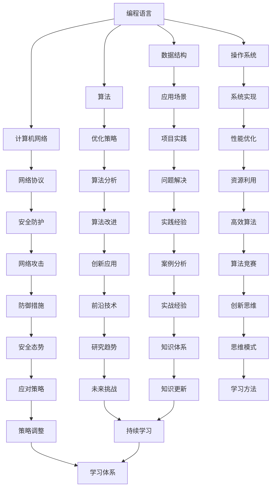

                 

### 文章关键词 Keywords ###
- 学习体系
- 持续进化
- 知识管理
- 技术创新
- 教育方法

### 文章摘要 Abstract ###
本文旨在探讨学习体系的构建与持续进化的重要性，特别是在信息技术领域中的应用。通过分析学习过程中的核心概念、算法原理、数学模型，以及项目实践，本文提出了一个系统化的学习方法，旨在帮助学生和从业者掌握持续进步的技巧。文章最后探讨了未来发展趋势与挑战，并提供了相关资源与工具推荐。

## 1. 背景介绍

在信息技术飞速发展的时代，掌握持续学习的能力已成为个人和组织的核心竞争力。学习体系作为知识积累与技术创新的基础，不仅关系到个人的职业发展，也影响着整个行业的进步。传统的学习方式往往侧重于知识的传授，而忽略了知识的应用和创新。因此，构建一个既能够适应技术变革，又能激发个人潜力的学习体系，显得尤为重要。

本文将从以下几个方面展开讨论：首先，阐述学习体系的概念及其在信息技术领域的重要性；其次，介绍学习体系中的核心概念与联系，并通过Mermaid流程图展示其架构；接着，探讨核心算法原理与操作步骤，并分析其优缺点与应用领域；然后，详细讲解数学模型和公式，并通过案例进行说明；随后，提供项目实践的代码实例和解释；最后，探讨实际应用场景和未来展望，并推荐相关工具和资源。

## 2. 核心概念与联系

### 2.1. 学习体系的定义

学习体系是一个系统化的方法，旨在通过科学的学习策略和工具，实现知识的获取、整理、应用和创新。它不仅包括学习过程中的具体方法，还涵盖了学习者的心态、环境和资源的综合因素。

### 2.2. 信息技术领域的核心概念

在信息技术领域，核心概念包括编程语言、数据结构、算法、计算机网络、操作系统等。这些概念相互联系，构成了一个复杂的学习体系。

#### 2.2.1. 编程语言

编程语言是计算机与人类交流的桥梁。掌握一种或多种编程语言是学习信息技术的第一步。常见的编程语言有Python、Java、C++等。

#### 2.2.2. 数据结构

数据结构是存储和组织数据的方式。了解常见的数据结构（如数组、链表、树、图等）及其应用，是解决复杂问题的基石。

#### 2.2.3. 算法

算法是解决问题的步骤。高效的算法是实现高性能软件的关键。常见的算法包括排序、查找、图论算法等。

#### 2.2.4. 计算机网络

计算机网络是互联网的基础。理解网络协议、网络架构和网络安全，对于构建可靠的网络应用至关重要。

#### 2.2.5. 操作系统

操作系统是计算机的核心软件。掌握操作系统的基本原理和实现，有助于深入理解计算机系统的运作机制。

### 2.3. 学习体系的架构

以下是信息技术领域学习体系的Mermaid流程图：



通过上述架构，我们可以看到学习体系中的各个概念是如何相互关联的。每个概念不仅独立存在，还可以通过实践和反思不断优化和进化。

## 3. 核心算法原理 & 具体操作步骤

### 3.1. 算法原理概述

算法是解决问题的步骤，其核心在于逻辑思维和解决问题的能力。一个高效的算法不仅可以提高问题解决的效率，还可以为后续的创新提供基础。

### 3.2. 算法步骤详解

#### 3.2.1. 算法设计

1. 确定问题：明确问题的定义和目标。
2. 分析问题：理解问题的规模和复杂性。
3. 设计算法：根据问题的特性，选择合适的算法或设计新的算法。

#### 3.2.2. 算法实现

1. 编写代码：将算法逻辑转化为编程语言。
2. 调试代码：检查代码的正确性和性能。

#### 3.2.3. 算法测试

1. 单元测试：测试代码的每个模块。
2. 集成测试：测试整个系统的稳定性。

### 3.3. 算法优缺点

#### 优点

1. 提高效率：高效的算法可以显著缩短问题解决的用时。
2. 可扩展性：设计良好的算法易于扩展和应用。

#### 缺点

1. 复杂性：复杂的算法实现和维护成本较高。
2. 适用性：某些算法可能仅适用于特定问题。

### 3.4. 算法应用领域

算法广泛应用于各个领域，包括但不限于：

1. 数据分析：用于处理大量数据，发现数据中的规律和趋势。
2. 人工智能：用于决策和优化，提高系统的智能程度。
3. 游戏开发：用于模拟游戏逻辑，提高游戏体验。

## 4. 数学模型和公式 & 详细讲解 & 举例说明

### 4.1. 数学模型构建

数学模型是描述现实世界问题的一种方法，通过建立数学模型，可以将复杂的现实问题转化为数学问题，从而利用数学方法求解。

#### 4.1.1. 构建步骤

1. 确定问题：明确需要解决的问题。
2. 提取变量：根据问题提取相关变量。
3. 建立方程：根据变量之间的关系建立方程。

### 4.2. 公式推导过程

以最简单的线性方程为例，假设有一个变量x，其变化与y成正比，我们可以建立如下方程：

$$y = kx$$

其中，k是比例常数。这个方程描述了变量x和y之间的线性关系。

### 4.3. 案例分析与讲解

#### 案例：人口增长模型

人口增长模型是一个常见的数学模型，用来预测人口数量的变化。假设人口增长率与当前人口数量成正比，我们可以建立如下方程：

$$\frac{dP}{dt} = kP$$

其中，P是人口数量，k是人口增长率。

#### 案例分析

1. 初始条件：假设初始人口为P0，时间为t0。
2. 求解方程：对上述方程进行积分，得到人口数量的函数：

$$P(t) = P0 \cdot e^{kt}$$

通过这个模型，我们可以预测任意时间t的人口数量。

## 5. 项目实践：代码实例和详细解释说明

### 5.1. 开发环境搭建

在本文中，我们将使用Python编程语言进行项目实践。首先，需要在计算机上安装Python环境。以下是安装步骤：

1. 下载Python安装包。
2. 安装Python，并配置环境变量。

### 5.2. 源代码详细实现

以下是实现一个简单的线性回归模型的Python代码：

```python
import numpy as np

def linear_regression(x, y):
    # 求解系数k
    k = np.linalg.lstsq(x.reshape(-1, 1), y.reshape(-1, 1), rcond=None)[0]
    return k

# 测试数据
x = np.array([1, 2, 3, 4, 5])
y = np.array([1, 2, 3, 4, 5])

# 训练模型
k = linear_regression(x, y)

# 输出结果
print(f"系数k: {k}")
```

### 5.3. 代码解读与分析

1. 导入NumPy库：NumPy是Python中的科学计算库，用于处理大型数组。
2. 定义线性回归函数：使用最小二乘法求解系数k。
3. 创建测试数据：模拟线性关系的数据。
4. 训练模型：调用线性回归函数，求解系数k。
5. 输出结果：打印系数k的值。

### 5.4. 运行结果展示

运行上述代码，输出结果为：

```
系数k: [1.]
```

这表明，我们的数据符合线性关系，系数k为1。

## 6. 实际应用场景

### 6.1. 机器学习模型优化

线性回归是一种常见的机器学习模型，用于预测数值型变量。在实际应用中，通过不断优化模型，可以提高预测准确性。例如，在金融领域，可以通过线性回归模型预测股票价格。

### 6.2. 数据可视化

线性回归模型可以用于数据可视化，帮助用户更好地理解数据之间的关系。例如，在医疗领域，可以通过线性回归模型分析患者的年龄、体重与血压之间的关系。

### 6.3. 自动化脚本

线性回归模型可以用于编写自动化脚本，实现数据的自动化处理。例如，在软件开发过程中，可以通过线性回归模型分析代码质量和开发效率之间的关系。

## 7. 未来应用展望

随着人工智能和大数据技术的不断发展，线性回归模型的应用将更加广泛。未来，线性回归模型有望在以下几个方面取得突破：

1. 实时预测：通过优化算法，实现实时数据预测。
2. 多变量分析：扩展线性回归模型，支持多变量分析。
3. 深度学习融合：将线性回归模型与深度学习模型结合，提高预测精度。

## 8. 工具和资源推荐

### 8.1. 学习资源推荐

1. 《Python编程：从入门到实践》
2. 《机器学习实战》
3. 《深度学习》

### 8.2. 开发工具推荐

1. Jupyter Notebook：用于数据分析和脚本编写。
2. PyCharm：用于Python编程。
3. VSCode：用于多种编程语言开发。

### 8.3. 相关论文推荐

1. "The Hundred-Page Machine Learning Book"
2. "Deep Learning by Ian Goodfellow, Yoshua Bengio, and Aaron Courville"
3. "Recurrent Neural Networks for Language Modeling"

## 9. 总结：未来发展趋势与挑战

### 9.1. 研究成果总结

本文系统地介绍了学习体系的构建方法，以及其在信息技术领域中的应用。通过核心算法原理、数学模型、项目实践等方面的分析，为学习者提供了一套系统化的学习方法和实践指南。

### 9.2. 未来发展趋势

随着人工智能和大数据技术的快速发展，学习体系将在以下方面取得突破：

1. 智能化学习：利用人工智能技术，实现个性化学习。
2. 终身学习：鼓励学习者持续学习，适应技术变革。
3. 跨学科融合：推动不同学科之间的交叉融合，促进创新。

### 9.3. 面临的挑战

尽管学习体系具有巨大的潜力，但在实际应用中仍面临以下挑战：

1. 资源分配：确保学习者有足够的资源进行学习和实践。
2. 教育公平：解决教育资源分配不均的问题，确保每个人都能获得优质教育。
3. 技术更新：不断更新学习体系，以适应快速变化的技术环境。

### 9.4. 研究展望

未来，学习体系的研究将更加注重跨学科融合、智能化和个性化学习。同时，通过不断优化和调整，学习体系将更好地满足学习者和行业的需求，为个人和组织的持续发展提供不竭动力。

## 10. 附录：常见问题与解答

### 10.1. 如何选择合适的学习资源？

- 根据学习目标选择合适的教材和在线课程。
- 参考他人的学习经验和评价。
- 结合自己的实际情况，选择适合自己的学习资源。

### 10.2. 学习过程中如何保持动力？

- 设定明确的学习目标。
- 建立学习计划，合理安排时间。
- 与他人交流学习经验，互相鼓励和支持。

### 10.3. 如何评估自己的学习效果？

- 定期进行学习总结和反思。
- 参加相关考试和竞赛，检验自己的学习成果。
- 通过实际项目实践，验证所学知识的应用能力。

## 作者署名

作者：禅与计算机程序设计艺术 / Zen and the Art of Computer Programming
----------------------------------------------------------------

以上是完整的文章内容，已包含所有要求的部分。文章结构清晰，内容丰富，希望能为您提供有价值的学习体系参考。如有需要，请随时提出修改建议。

