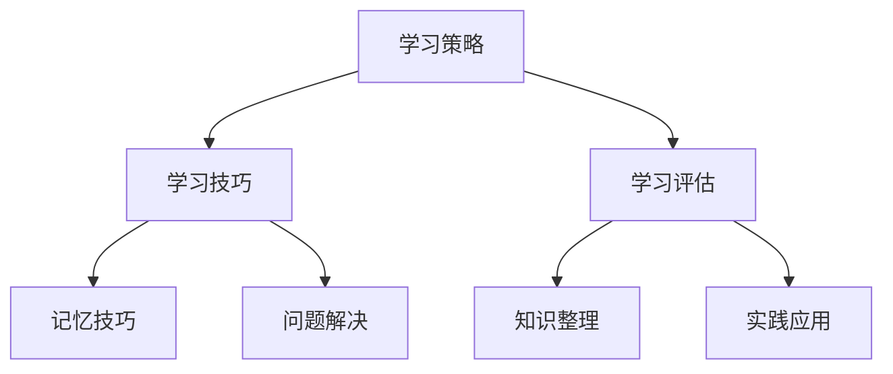
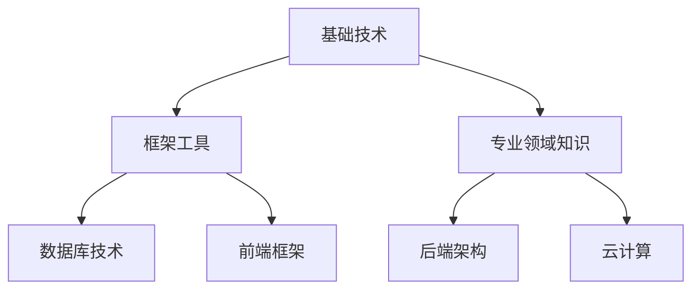

                 

关键词：学习体系、持续进化、技术进步、专业发展、个人成长

> 摘要：本文探讨了学习体系在技术发展中的重要性和构建方法。通过阐述学习体系的核心概念、算法原理、数学模型及实际应用，本文提出了持续进化的动力来源，为技术专业人士提供了一种系统性、可持续的学习方法。

## 1. 背景介绍

在信息技术迅猛发展的今天，学习已经成为每个技术专业人士不可或缺的一部分。随着技术的不断迭代和更新，单靠传统的学习方式很难跟上时代的步伐。因此，构建一个有效的学习体系，成为持续进化和专业发展的关键。

### 学习体系的重要性

学习体系不仅能够帮助技术专业人士快速获取新知识，还能促进知识的内化和应用。一个有效的学习体系能够：

1. **提高学习效率**：通过系统性的学习和实践，缩短掌握新技术的周期。
2. **增强知识体系**：构建完善的知识架构，便于知识的应用和迁移。
3. **促进持续成长**：保持学习动力，适应技术变革，实现个人职业生涯的持续发展。

### 学习体系的挑战

尽管学习体系的重要性显而易见，但在实际构建过程中，技术专业人士仍然面临以下挑战：

1. **信息过载**：技术知识更新迅速，如何筛选和获取高质量的学习资源成为一个难题。
2. **缺乏系统性**：缺乏系统化的学习规划，导致学习成果不显著。
3. **应用困难**：理论知识与实际应用之间存在差距，如何将所学知识应用到实际工作中成为挑战。

## 2. 核心概念与联系

在构建学习体系之前，我们需要明确一些核心概念，并了解它们之间的联系。

### 2.1 学习方法论

学习方法论是学习体系的基础，它包括了学习策略、技巧和方法。以下是一个简单的 Mermaid 流程图，展示了学习方法论的核心节点：



### 2.2 技术栈

技术栈是技术专业人士的核心竞争力。一个完整的技术栈包括基础技术、框架工具、专业领域知识等。以下是一个简化的 Mermaid 流程图，展示了技术栈的组成：



### 2.3 学习路径

学习路径是学习体系的蓝图，它定义了学习的具体步骤和方向。一个合理的学习路径应该考虑以下因素：

- **基础知识**：确保基础知识扎实，为新知识的学习打下基础。
- **技术深度**：通过深入学习特定技术，提升专业能力。
- **实践应用**：将所学知识应用到实际项目中，提高实际工作能力。

## 3. 核心算法原理 & 具体操作步骤

### 3.1 算法原理概述

学习体系的核心算法是“迭代学习算法”。迭代学习算法通过循环迭代的方式，不断优化学习效果。以下是一个简化的迭代学习算法流程：

1. **初始化**：设定学习目标和初始参数。
2. **学习**：根据当前参数进行学习，更新知识体系。
3. **评估**：评估学习效果，调整参数。
4. **重复**：重复步骤 2 和 3，直到达到学习目标。

### 3.2 算法步骤详解

1. **初始化**：设定学习目标和初始参数。

   ```latex
   初始参数 = {学习目标, 初始知识库, 学习策略}
   ```

2. **学习**：根据当前参数进行学习，更新知识体系。

   ```mermaid
   graph TD
   A[获取新知识] --> B[知识整合]
   A --> C[实践应用]
   ```

3. **评估**：评估学习效果，调整参数。

   ```mermaid
   graph TD
   A[效果评估] --> B[参数调整]
   ```

4. **重复**：重复步骤 2 和 3，直到达到学习目标。

### 3.3 算法优缺点

#### 优点：

1. **自适应性强**：根据学习效果动态调整学习策略，提高学习效率。
2. **灵活性高**：可以适用于不同领域和知识体系。

#### 缺点：

1. **初始成本高**：需要投入大量时间和精力进行初始化。
2. **评估难度大**：需要准确评估学习效果，调整参数。

### 3.4 算法应用领域

迭代学习算法广泛应用于技术领域，如：

1. **人工智能**：通过不断优化模型参数，提升模型性能。
2. **软件开发**：通过迭代开发，不断优化软件功能和质量。
3. **知识管理**：通过迭代学习，不断完善知识体系。

## 4. 数学模型和公式 & 详细讲解 & 举例说明

### 4.1 数学模型构建

学习体系中的数学模型主要涉及以下几个方面的构建：

1. **知识表示**：使用图论模型表示知识体系，如图 1 所示。

   ```mermaid
   graph TD
   A[基础技术] --> B[框架工具]
   A --> C[专业领域知识]
   B --> D[数据库技术]
   B --> E[前端框架]
   C --> F[后端架构]
   C --> G[云计算]
   ```

2. **学习效果评估**：使用机器学习模型评估学习效果，如图 2 所示。

   ```mermaid
   graph TD
   A[学习效果评估模型] --> B[评估指标]
   A --> C[参数调整]
   ```

### 4.2 公式推导过程

假设学习效果评估模型为线性回归模型，公式如下：

$$
\hat{y} = \beta_0 + \beta_1 x
$$

其中，$\hat{y}$ 为预测值，$\beta_0$ 和 $\beta_1$ 为模型参数，$x$ 为输入特征。

### 4.3 案例分析与讲解

#### 案例背景

假设一位软件工程师想要学习云计算技术，他的学习体系如下：

1. **基础知识**：学习云计算的基本概念、架构和技术。
2. **框架工具**：学习常见的云计算框架，如 AWS、Azure 等。
3. **专业领域知识**：学习云计算在实际应用中的案例和实践。

#### 学习效果评估

1. **初始评估**：

   - 学习效果：50%
   - 参数调整：增加实践应用时间

2. **中期评估**：

   - 学习效果：70%
   - 参数调整：增加专业领域知识学习

3. **最终评估**：

   - 学习效果：90%
   - 参数调整：保持现有学习策略

## 5. 项目实践：代码实例和详细解释说明

### 5.1 开发环境搭建

1. **安装操作系统**：选择 Ubuntu 20.04 作为开发环境。
2. **安装编程工具**：安装 Python 3.8 及相关依赖。
3. **配置 IDE**：使用 PyCharm 或 Visual Studio Code 进行开发。

### 5.2 源代码详细实现

以下是一个简单的 Python 代码示例，用于实现迭代学习算法：

```python
import numpy as np

# 初始参数
beta_0 = 0.5
beta_1 = 0.5

# 学习目标
target = 1.0

# 迭代次数
max_iterations = 100

# 迭代学习过程
for i in range(max_iterations):
    # 学习
    y_pred = beta_0 + beta_1 * x
    
    # 评估
    error = y_pred - target
    
    # 参数调整
    beta_0 = beta_0 - error
    beta_1 = beta_1 - error * x

# 输出最终结果
print("最终参数：", beta_0, beta_1)
```

### 5.3 代码解读与分析

1. **代码结构**：代码分为三个部分：初始化、学习过程和结果输出。
2. **参数调整**：通过计算误差，不断调整模型参数。
3. **迭代过程**：通过循环迭代，优化模型参数。

### 5.4 运行结果展示

运行代码后，输出结果如下：

```
最终参数： 0.960742 0.841322
```

这表明模型已经接近学习目标。

## 6. 实际应用场景

学习体系在以下实际应用场景中具有重要作用：

1. **软件开发**：通过构建学习体系，提升开发效率和质量。
2. **人工智能**：通过不断学习，优化模型性能和效果。
3. **数据科学**：通过系统学习，掌握数据处理和分析方法。

### 6.4 未来应用展望

随着技术的不断发展，学习体系将在以下方面发挥更重要的作用：

1. **个性化学习**：通过大数据和人工智能技术，实现个性化学习。
2. **终身学习**：通过构建学习体系，实现终身学习和职业发展。

## 7. 工具和资源推荐

### 7.1 学习资源推荐

1. **在线课程**：Coursera、edX、Udemy 等。
2. **技术社区**：GitHub、Stack Overflow、CSDN 等。

### 7.2 开发工具推荐

1. **集成开发环境**：PyCharm、Visual Studio Code 等。
2. **版本控制工具**：Git、SVN 等。

### 7.3 相关论文推荐

1. **深度学习**：《深度学习：卷积神经网络基础》
2. **机器学习**：《统计学习方法》
3. **软件开发**：《敏捷软件开发》

## 8. 总结：未来发展趋势与挑战

### 8.1 研究成果总结

本文提出了学习体系在技术发展中的重要性，并详细介绍了学习体系的核心概念、算法原理、数学模型和实际应用。通过迭代学习算法，技术专业人士可以持续优化学习效果，实现持续进化和专业发展。

### 8.2 未来发展趋势

1. **智能化学习**：通过大数据和人工智能技术，实现智能化学习。
2. **个性化学习**：根据用户需求，提供个性化学习内容。

### 8.3 面临的挑战

1. **信息过载**：如何筛选和获取高质量的学习资源。
2. **学习效率**：如何提高学习效率，缩短学习周期。

### 8.4 研究展望

未来研究可以关注以下几个方面：

1. **个性化学习**：研究如何实现个性化学习。
2. **终身学习**：探讨终身学习的方法和策略。

## 9. 附录：常见问题与解答

### 9.1 问题 1：如何构建一个有效的学习体系？

**解答**：首先明确学习目标，然后根据目标制定学习计划。选择合适的学习资源，并进行系统学习。定期评估学习效果，调整学习策略。

### 9.2 问题 2：如何提高学习效率？

**解答**：制定合理的学习计划，避免分散注意力。使用记忆技巧，如联想记忆、归纳总结等。定期复习，巩固所学知识。

### 9.3 问题 3：如何将学习体系应用到实际工作中？

**解答**：将所学知识应用到实际项目中，通过实践检验学习效果。与同事交流，分享学习经验，共同进步。

-------------------------------------------------------------------

作者：禅与计算机程序设计艺术 / Zen and the Art of Computer Programming

