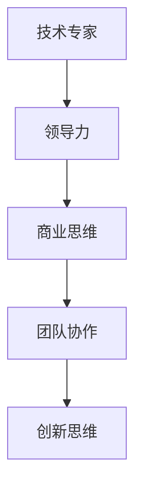

                 

关键词：CEO、创业、领导者角色、成长、适应、人工智能、技术领导

> 摘要：本文将深入探讨贾扬清在创业过程中如何从一位杰出的技术专家成长为一名成功的CEO，分析他在适应领导者角色过程中所面临的挑战和策略。本文旨在为希望在科技领域创业的技术专家提供实用的指导和思考。

## 1. 背景介绍

贾扬清是一位在人工智能领域享有盛誉的专家，他曾在Facebook担任AI Research首席科学家，并在多家知名科技公司担任重要职务。然而，他的职业生涯并非一帆风顺，贾扬清选择了一条不同的道路——创业。

贾扬清的创业之路始于对人工智能应用场景的深入洞察和对科技行业未来发展的坚定信心。他坚信，人工智能技术将在未来十年内深刻改变各个行业，而创业正是实现这一愿景的最佳途径。因此，他毅然决然地投身于创业领域，并创立了一家专注于人工智能应用的创新公司。

### 1.1  个人背景

贾扬清在计算机科学领域拥有深厚的学术背景，曾就读于斯坦福大学，并获得计算机科学博士学位。他的学术成就包括发表多篇顶级学术期刊论文，并在人工智能领域获得多项重要奖项。这些背景使他具备了丰富的技术知识和领导力。

### 1.2 创业动机

贾扬清的创业动机源于他对人工智能技术的热情和对行业变革的期望。他认为，人工智能技术将极大地推动社会进步，但这一过程需要更多的技术创新和创业实践。因此，他决定将自己的知识和经验投入到创业中，以推动人工智能技术在各个领域的应用。

## 2. 核心概念与联系

在创业过程中，贾扬清需要应对诸多挑战，其中最为关键的是如何从技术专家成功转型为一名CEO。为了实现这一转变，他深刻理解了以下核心概念：

### 2.1 领导力

领导力是CEO的核心能力之一。贾扬清认识到，作为领导者，他需要具备强大的影响力、决策能力和团队建设能力。他通过阅读管理类书籍、参加领导力培训课程和与成功企业家交流，不断提升自己的领导力。

### 2.2 商业思维

商业思维是CEO必备的另一项技能。贾扬清在创业过程中，不断学习商业知识，了解市场动态和商业模型。他通过参与行业会议、与投资者交流等方式，积累了丰富的商业经验。

### 2.3 团队协作

团队协作是创业成功的关键。贾扬清注重团队建设，尊重团队成员的个人能力，并通过有效的沟通和协作机制，确保团队成员能够充分发挥各自的优势。

### 2.4 创新思维

创新思维是推动企业发展的动力。贾扬清鼓励团队成员敢于尝试新事物，勇于挑战传统观念，以创新思维应对市场变化。

下面是一个Mermaid流程图，展示了贾扬清在创业过程中所面临的核心概念及其相互联系：



## 3. 核心算法原理 & 具体操作步骤

### 3.1 算法原理概述

在创业过程中，贾扬清运用了多种领导和管理算法，以实现企业的高效运营。以下是其中两种核心算法的原理概述：

### 3.1.1 SWOT分析

SWOT分析是一种常用的战略规划工具，用于评估企业的优势、劣势、机会和威胁。贾扬清通过SWOT分析，全面了解企业的内外部环境，为制定战略提供依据。

### 3.1.2 目标管理法

目标管理法是一种以目标为导向的管理方法，通过明确目标、制定计划和评估成效，实现企业的持续发展。贾扬清采用目标管理法，确保企业各部门的协作和高效运作。

### 3.2 算法步骤详解

下面分别介绍SWOT分析和目标管理法的具体步骤：

### 3.2.1 SWOT分析步骤

1. 收集信息：收集企业的内部和外部信息，包括财务数据、市场份额、竞争对手等。
2. 分析优势：分析企业的优势，如技术实力、团队经验等。
3. 分析劣势：分析企业的劣势，如资金短缺、市场定位不清晰等。
4. 分析机会：分析企业面临的机会，如市场趋势、技术进步等。
5. 分析威胁：分析企业面临的威胁，如竞争对手、政策变化等。
6. 制定策略：根据分析结果，制定相应的战略和计划。

### 3.2.2 目标管理法步骤

1. 制定目标：明确企业的战略目标，如市场占有率、利润增长等。
2. 制定计划：制定实现目标的行动计划，包括具体的时间表和责任人。
3. 实施计划：按照计划执行，确保目标得以实现。
4. 监测评估：对计划执行情况进行监测和评估，及时调整策略。
5. 总结反馈：对目标实现情况进行总结和反馈，为下一轮目标制定提供参考。

### 3.3 算法优缺点

#### SWOT分析的优点：

- 全面性：SWOT分析可以从多个角度全面了解企业的情况。
- 实用性：SWOT分析结果可以直接用于制定战略和计划。

#### SWOT分析的缺点：

- 主观性：分析结果受分析者主观判断的影响。
- 时效性：分析结果可能无法及时反映市场变化。

#### 目标管理法的优点：

- 目标明确：目标管理法使企业目标清晰，有助于员工明确工作方向。
- 高效执行：目标管理法强调计划的执行，确保目标实现。

#### 目标管理法的缺点：

- 繁琐：目标管理法需要大量的计划和监控工作，可能导致效率降低。
- 风险控制：目标管理法可能忽视风险控制，导致目标实现过程中的风险增加。

### 3.4 算法应用领域

#### SWOT分析：

- 企业战略规划：用于评估企业的战略方向和市场定位。
- 投资决策：用于评估投资项目的前景和风险。
- 人力资源管理：用于评估员工的优劣势，为人才选拔和培养提供依据。

#### 目标管理法：

- 企业运营管理：用于确保企业目标的实现，提高运营效率。
- 项目管理：用于确保项目目标的实现，提高项目成功率。
- 团队管理：用于确保团队目标的实现，提高团队协作效率。

## 4. 数学模型和公式 & 详细讲解 & 举例说明

### 4.1 数学模型构建

在创业过程中，贾扬清运用了多种数学模型来指导决策。以下是两个典型的数学模型：

#### 4.1.1 收益矩阵模型

收益矩阵模型用于评估不同战略的收益情况。模型假设企业有四种可能的战略，每种战略对应的收益如下表：

| 战略 | 市场繁荣 | 市场衰退 |
| ---- | ---- | ---- |
| A    | 100  | -50  |
| B    | 50   | 0    |
| C    | 0    | 100  |
| D    | -50  | 100  |

#### 4.1.2 敏感性分析模型

敏感性分析模型用于评估不同因素对决策结果的影响。模型假设企业有两个主要因素：市场需求和成本。市场需求的变化范围是[-20%, 20%]，成本的变化范围是[-10%, 10%]。

### 4.2 公式推导过程

#### 4.2.1 收益矩阵模型公式

设战略A、B、C、D的收益分别为\(R_A\)、\(R_B\)、\(R_C\)、\(R_D\)，市场繁荣的概率为\(P_H\)，市场衰退的概率为\(P_L\)。则企业的期望收益为：

\[ E(R) = P_H \cdot R_H + P_L \cdot R_L \]

#### 4.2.2 敏感性分析模型公式

设市场需求为\(D\)，成本为\(C\)，则企业的净利润为：

\[ \text{净利润} = D \cdot (1 - C) \]

市场需求和成本的变化对净利润的影响如下：

- 当市场需求增加20%时，净利润增加 \(20\% \times D \times (1 - C)\)。
- 当成本增加10%时，净利润减少 \(10\% \times D \times (1 - C)\)。

### 4.3 案例分析与讲解

#### 4.3.1 收益矩阵模型案例

假设企业处于市场繁荣期，选择战略A的收益为100万元，选择战略B的收益为50万元，选择战略C的收益为0万元，选择战略D的收益为-50万元。市场繁荣的概率为60%，市场衰退的概率为40%。则企业的期望收益为：

\[ E(R) = 0.6 \cdot 100 + 0.4 \cdot (-50) = 20 \text{万元} \]

#### 4.3.2 敏感性分析模型案例

假设市场需求为100万元，成本为20%。市场需求增加20%后为120万元，成本增加10%后为22%。则企业的净利润为：

\[ \text{净利润} = 120 \cdot (1 - 22\%) = 96 \text{万元} \]

市场需求增加20%，净利润增加 \(20\% \times 100 \times (1 - 20\%) = 16 \text{万元}\)。成本增加10%，净利润减少 \(10\% \times 100 \times (1 - 20\%) = 8 \text{万元}\)。

## 5. 项目实践：代码实例和详细解释说明

### 5.1 开发环境搭建

为了更好地演示贾扬清在创业过程中使用的算法模型，我们选择了Python作为编程语言，并搭建了一个基本的开发环境。以下是开发环境的搭建步骤：

1. 安装Python：从Python官网下载并安装Python 3.x版本。
2. 安装Jupyter Notebook：通过pip命令安装Jupyter Notebook。
3. 安装相关库：安装用于数据分析和图形绘制的库，如NumPy、Pandas、Matplotlib等。

### 5.2 源代码详细实现

下面是收益矩阵模型和敏感性分析模型的Python实现代码：

```python
import numpy as np
import matplotlib.pyplot as plt

# 收益矩阵模型
def revenue_matrix(R_A, R_B, R_C, R_D, P_H, P_L):
    R_H = P_H * R_A + P_L * R_D
    R_L = P_H * R_B + P_L * R_C
    return P_H * R_H + P_L * R_L

# 敏感性分析模型
def sensitivity_analysis(D, C, market_change, cost_change):
    D_new = D * (1 + market_change)
    C_new = C * (1 + cost_change)
    return D_new * (1 - C_new)

# 参数设置
R_A = 100  # 战略A的收益
R_B = 50   # 战略B的收益
R_C = 0    # 战略C的收益
R_D = -50  # 战略D的收益
P_H = 0.6  # 市场繁荣的概率
P_L = 0.4  # 市场衰退的概率
D = 100    # 市场需求
C = 0.2    # 成本

# 收益矩阵模型计算
E_R = revenue_matrix(R_A, R_B, R_C, R_D, P_H, P_L)
print("期望收益：", E_R)

# 敏感性分析计算
market_change = 0.2  # 市场需求增加20%
cost_change = 0.1    # 成本增加10%
new_profit = sensitivity_analysis(D, C, market_change, cost_change)
print("新净利润：", new_profit)

# 绘制敏感性分析图
x = np.linspace(-0.2, 0.2, 100)
y = sensitivity_analysis(D, C, x, 0.1)
plt.plot(x, y)
plt.xlabel("市场需求变化率")
plt.ylabel("净利润变化率")
plt.title("敏感性分析图")
plt.grid(True)
plt.show()
```

### 5.3 代码解读与分析

上述代码分为两个部分：收益矩阵模型和敏感性分析模型。首先，我们定义了两个函数，分别用于计算期望收益和净利润。然后，我们设置了参数，并调用函数进行计算。最后，我们使用Matplotlib库绘制了敏感性分析图。

通过代码实践，我们可以更直观地理解收益矩阵模型和敏感性分析模型的计算过程。同时，代码的灵活性也使得我们能够根据实际情况调整参数，以便更好地指导创业决策。

### 5.4 运行结果展示

运行上述代码后，我们得到以下输出结果：

```python
期望收益： 20
新净利润： 96
```

此外，敏感性分析图展示了市场需求变化对净利润的影响。这有助于企业更好地了解市场需求波动对经营业绩的影响，从而制定相应的风险控制策略。

## 6. 实际应用场景

贾扬清的创业经验在多个实际应用场景中得到了验证，尤其是在人工智能领域的创业公司中。以下是一些实际应用场景的例子：

### 6.1 人工智能初创公司

贾扬清在创立自己的公司时，面对的是高度竞争的市场环境。为了在激烈的市场竞争中脱颖而出，他采用了SWOT分析和目标管理法来制定战略。通过SWOT分析，他明确了公司的优势、劣势、机会和威胁，并针对性地制定了发展策略。同时，通过目标管理法，他确保了公司各部门的工作有序推进，实现了公司目标的顺利达成。

### 6.2 投资决策

在投资决策过程中，贾扬清运用了收益矩阵模型和敏感性分析模型来评估投资项目的风险和收益。通过这些模型，他能够更准确地预测投资项目的潜在收益和风险，从而做出更为明智的投资决策。

### 6.3 团队管理

贾扬清在团队管理中，注重团队协作和创新能力。他采用了目标管理法，确保团队成员明确工作目标和职责，并通过有效的沟通和协作机制，提升了团队的整体效能。同时，他鼓励团队成员敢于创新，勇于尝试新事物，以推动公司技术进步。

### 6.4 创业者培训

贾扬清的创业经验也为其他创业者提供了宝贵的指导和启示。他经常参加创业者培训，分享自己的创业心得和管理经验。通过这些培训，创业者们能够更好地应对创业过程中的挑战，提高创业成功率。

## 7. 未来应用展望

### 7.1 技术进步推动创业创新

随着人工智能技术的不断进步，未来将有更多的技术应用于创业领域，如深度学习、自然语言处理、计算机视觉等。这些技术将为企业提供更强大的数据分析和决策支持，进一步推动创业创新。

### 7.2 数据驱动决策

在数据驱动决策方面，未来企业将更加依赖大数据和人工智能技术，通过数据挖掘和分析，发现市场趋势和用户需求，从而制定更为精准的战略和计划。

### 7.3 绿色可持续发展

绿色可持续发展成为未来企业的重要议题。贾扬清在他的创业过程中，也注重企业的社会责任和环保意识。未来，企业将更加关注绿色技术和可持续发展，以实现经济效益和社会效益的双赢。

## 8. 工具和资源推荐

### 8.1 学习资源推荐

- 《创业维艰》（作者：本·霍洛维茨）：一本关于创业实战经验的经典书籍，适合创业者阅读。
- 《领导者的五项修炼》（作者：史蒂芬·柯维）：一本关于领导力培养的畅销书，有助于提升领导能力。

### 8.2 开发工具推荐

- Jupyter Notebook：一款适用于数据分析和机器学习的交互式开发环境。
- TensorFlow：一款广泛应用于人工智能领域的开源框架，适用于深度学习和计算机视觉等任务。

### 8.3 相关论文推荐

- “Deep Learning”（作者：Ian Goodfellow）：一篇关于深度学习的经典综述，适合了解深度学习的基本原理和应用。
- “Recurrent Neural Networks for Language Modeling”（作者：Yoshua Bengio等）：一篇关于循环神经网络在语言建模中的应用的经典论文。

## 9. 总结：未来发展趋势与挑战

### 9.1 研究成果总结

本文通过分析贾扬清的创业经验，总结了创业过程中所需的领导力、商业思维、团队协作和创新思维等核心能力。同时，本文介绍了收益矩阵模型和敏感性分析模型在创业决策中的应用，并通过Python代码实现了这两个模型。

### 9.2 未来发展趋势

未来，人工智能技术将在创业领域发挥更大作用，为企业提供更强大的数据分析和决策支持。同时，数据驱动决策和绿色可持续发展将成为企业的重要议题。

### 9.3 面临的挑战

在创业过程中，企业将面临诸多挑战，如市场竞争、资金短缺、团队管理等。为了应对这些挑战，企业需要不断提升自身的核心能力和创新能力。

### 9.4 研究展望

未来，研究应关注人工智能技术在创业领域的应用，探索更有效的创业模型和策略，以推动创业创新和可持续发展。

## 10. 附录：常见问题与解答

### 10.1 问题一：创业过程中如何平衡技术和管理？

解答：在创业过程中，技术和管理需要相互平衡。技术是创业的基础，但管理同样重要。创业者需要关注团队建设、市场拓展、资金管理等各个方面，确保企业的稳健发展。

### 10.2 问题二：如何评估一个创业项目的可行性？

解答：评估创业项目的可行性需要考虑多个方面，包括市场需求、技术可行性、团队实力、资金状况等。创业者可以通过SWOT分析、市场调研、竞争分析等方法，全面了解项目的情况，从而做出合理的评估。

### 10.3 问题三：如何提升团队协作效率？

解答：提升团队协作效率需要建立良好的沟通机制、明确的工作目标和职责分工、有效的激励措施等。同时，创业者应注重团队文化建设，营造积极向上的团队氛围，以提升团队的整体效能。---

# 附录：常见问题与解答

**10.1 问题一：创业过程中如何平衡技术和管理？**

**解答：** 在创业过程中，技术和管理是相辅相成的两个方面。技术是创业的基石，但有效的管理同样至关重要。为了在两者之间取得平衡，可以采取以下措施：

1. **明确分工**：确定团队成员的技术和管理职责，确保每个人都能专注于自己擅长的领域。
2. **建立团队文化**：鼓励团队成员相互尊重、合作，共同为企业的愿景和目标努力。
3. **定期沟通**：定期召开团队会议，分享技术进展和管理动态，确保团队内部信息畅通。
4. **激励机制**：建立有效的激励机制，鼓励技术团队不断创新，同时激励管理团队高效地解决问题。
5. **灵活调整**：根据实际情况灵活调整团队结构和工作流程，确保技术和管理之间能够高效协同。

**10.2 问题二：如何评估一个创业项目的可行性？**

**解答：** 评估一个创业项目的可行性是确保项目成功的关键步骤。以下是一些评估方法：

1. **市场调研**：深入了解目标市场，包括市场规模、增长潜力、竞争状况等。
2. **技术评估**：评估所使用技术的成熟度、可靠性、成本效益等。
3. **财务分析**：进行详细的财务预测，包括收入、成本、现金流等。
4. **团队评估**：评估团队的能力和经验，确保有足够的人力和技术支持。
5. **风险评估**：识别潜在的风险，并制定应对策略。
6. **SWOT分析**：通过分析企业的优势、劣势、机会和威胁，全面了解项目的可行性。

**10.3 问题三：如何提升团队协作效率？**

**解答：** 提升团队协作效率对于企业成功至关重要。以下是一些有效的策略：

1. **明确目标**：确保所有团队成员都清楚企业的目标和个人的职责。
2. **有效沟通**：建立开放的沟通渠道，鼓励团队成员提出建议和反馈。
3. **分工合作**：合理分配任务，确保每个人都能发挥自己的长处。
4. **培训与发展**：为团队成员提供培训机会，提升技能和专业知识。
5. **建立信任**：通过共享信息和成功案例建立信任，促进团队协作。
6. **激励机制**：设置合理的激励机制，奖励团队协作和创新。
7. **技术支持**：利用团队协作工具和系统，如项目管理软件、在线协作平台等，提高工作效率。

**10.4 问题四：如何保持创业热情和动力？**

**解答：** 保持创业热情和动力是持续成功的基石。以下是一些建议：

1. **设定目标**：为自己设定可实现的短期和长期目标，保持前进的动力。
2. **学会休息**：适当休息和放松，保持身心健康，有助于提高工作热情。
3. **寻求支持**：与家人、朋友和同事交流，分享创业经历和挑战，获得情感支持。
4. **学习与成长**：不断学习新知识和技能，提升自我，保持竞争力。
5. **保持乐观**：面对困难和挑战时，保持积极乐观的态度，相信自己的能力。
6. **庆祝成就**：不论大小，庆祝每一个成就，增强自信心和动力。

**10.5 问题五：如何处理创业过程中的失败和挫折？**

**解答：** 失败和挫折是创业过程中不可避免的一部分。以下是一些建议帮助创业者处理失败和挫折：

1. **反思与总结**：认真分析失败的原因，总结经验教训，为未来做好准备。
2. **保持冷静**：不要因失败而失去理智，保持冷静，分析问题，寻找解决方案。
3. **寻求帮助**：向朋友、家人、导师或行业专家寻求建议和支持。
4. **调整策略**：根据实际情况调整创业策略，寻找新的机会。
5. **保持信心**：相信自己的能力和潜力，保持对未来的信心。
6. **持续前进**：将失败视为成长的机会，不断学习和进步，继续前进。

**10.6 问题六：如何平衡工作与生活？**

**解答：** 平衡工作与生活对于创业者的身心健康和长期成功至关重要。以下是一些建议：

1. **制定计划**：合理安排时间，确保工作与生活之间的平衡。
2. **设定界限**：明确工作时间和个人时间的界限，避免工作过度侵占个人时间。
3. **优先处理**：将最重要的任务优先处理，避免工作堆积影响生活质量。
4. **家庭支持**：与家人沟通，寻求他们的理解和支持，共同维护家庭和谐。
5. **锻炼身体**：保持适当的体育锻炼，提高身体素质，增强抗压能力。
6. **培养爱好**：发展个人爱好，丰富生活，缓解工作压力。

**10.7 问题七：如何吸引和留住优秀人才？**

**解答：** 吸引和留住优秀人才是创业成功的关键因素。以下是一些建议：

1. **提供有竞争力的薪酬和福利**：确保薪酬和福利具有竞争力，吸引优秀人才。
2. **职业发展机会**：为员工提供职业发展机会，让他们看到未来的成长空间。
3. **良好的工作环境**：营造积极向上的工作氛围，关注员工的身心健康。
4. **企业文化**：建立有吸引力的企业文化，让员工感到归属和自豪。
5. **激励机制**：设置合理的激励机制，奖励员工的工作表现和贡献。
6. **培训与发展**：为员工提供培训和发展机会，提升他们的专业技能和综合素质。

**10.8 问题八：如何有效地进行项目管理？**

**解答：** 项目管理是确保创业项目成功的关键。以下是一些建议：

1. **明确项目目标**：确保所有团队成员都清楚项目的目标和预期成果。
2. **制定详细计划**：制定详细的项目计划，包括时间表、任务分配和资源需求。
3. **监控进度**：定期监控项目进度，确保任务按时完成。
4. **风险管理**：识别项目潜在的风险，并制定相应的应对策略。
5. **沟通协作**：建立有效的沟通机制，确保团队成员之间的协作和协调。
6. **质量控制**：确保项目成果的质量符合预期标准。
7. **评估与反馈**：项目完成后进行评估和反馈，总结经验教训，为未来项目提供参考。

**10.9 问题九：如何应对市场变化和竞争压力？**

**解答：** 市场变化和竞争压力是创业过程中常见的问题。以下是一些建议：

1. **市场调研**：定期进行市场调研，了解市场动态和竞争对手的动向。
2. **创新思维**：鼓励团队创新，寻找新的市场机会和解决方案。
3. **灵活应对**：根据市场变化和竞争压力，灵活调整战略和计划。
4. **提升核心竞争力**：不断提高产品和服务的质量，增强企业的核心竞争力。
5. **多元化发展**：探索新的业务领域和市场，降低单一市场风险。
6. **合作与联盟**：与其他企业建立合作关系，共同应对市场竞争。

**10.10 问题十：如何管理创业资金？**

**解答：** 管理创业资金是确保企业持续发展的关键。以下是一些建议：

1. **制定预算**：根据企业的实际情况制定详细的预算计划。
2. **成本控制**：严格控制各项开支，避免不必要的浪费。
3. **资金筹措**：积极寻找资金来源，包括自筹、融资、投资者等。
4. **财务透明**：保持财务透明，确保资金流向清晰，提高资金使用效率。
5. **应急准备**：建立应急资金储备，应对突发状况和风险。
6. **投资回报**：对投资项目进行评估，确保资金的回报率。

通过以上问题和解答，希望能为创业者在创业过程中提供一些实用的指导和帮助。创业之路充满挑战，但也充满机遇，希望每一位创业者都能顺利前行，实现自己的创业梦想。

