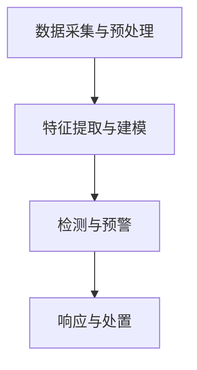

                 

关键词：APT攻击，网络安全，检测技术，面试真题，安全专家，校招

摘要：本文针对2024年360安全APT攻击检测专家校招面试真题进行深入解析，从背景介绍、核心概念、算法原理、数学模型、项目实践、应用场景等多个维度展开，帮助读者全面了解APT攻击检测的技术原理和实践应用，为准备校招面试的读者提供有力支持。

## 1. 背景介绍

随着互联网的飞速发展，网络安全问题日益突出，APT（Advanced Persistent Threat，高级持续性威胁）攻击成为网络安全领域的重要研究课题。APT攻击具有潜伏时间长、攻击手段隐蔽、难以检测等特点，对企业和组织的网络安全构成严重威胁。为应对APT攻击，网络安全专家和研究人员不断探索新的检测技术，提升APT攻击检测的准确性和实效性。

本文将围绕2024年360安全APT攻击检测专家校招面试真题，对APT攻击检测的相关技术进行深入剖析，帮助读者掌握APT攻击检测的核心知识和实践技巧。

### 1.1 APT攻击简介

APT攻击是指一种针对特定目标进行长期、隐蔽的网络攻击行为。攻击者通过精心策划和持续渗透，获取目标系统的控制权限，窃取敏感数据或破坏系统正常运行。APT攻击通常具有以下特点：

1. **长期潜伏**：攻击者通过渗透目标系统，隐藏自身行踪，长时间潜伏在目标网络中。
2. **隐蔽性强**：攻击者使用各种手段掩饰自己的行为，使攻击难以被发现。
3. **针对性**：APT攻击通常针对特定组织或个人，攻击目标明确。
4. **多层次攻击**：攻击者会采取多层次、多维度的手段进行攻击，提高攻击成功率。

### 1.2 APT攻击对网络安全的影响

APT攻击对网络安全的影响十分严重，主要表现在以下几个方面：

1. **数据泄露**：攻击者窃取敏感数据，可能导致企业机密信息泄露，造成巨大经济损失。
2. **系统破坏**：攻击者通过破坏系统正常运行，导致业务中断，影响企业声誉。
3. **资源消耗**：APT攻击需要大量资源进行长期潜伏和攻击，可能导致企业网络资源耗尽。
4. **法律风险**：APT攻击可能导致企业面临法律风险，承担巨额赔偿。

### 1.3 APT攻击检测的重要性

APT攻击检测是网络安全防御的重要一环，通过及时发现和阻止APT攻击，可以降低APT攻击对企业和组织的危害。APT攻击检测的重要性主要体现在以下几个方面：

1. **预防数据泄露**：及时发现APT攻击，阻止攻击者获取敏感数据，保障企业信息安全。
2. **降低损失**：及时检测APT攻击，减少攻击造成的经济损失和业务中断。
3. **提升安全意识**：通过APT攻击检测，提高企业和员工对网络安全的重视程度，增强安全意识。
4. **优化防御策略**：APT攻击检测可以帮助企业和组织了解攻击手段和特点，优化防御策略，提高整体网络安全水平。

## 2. 核心概念与联系

### 2.1 APT攻击检测技术概述

APT攻击检测技术主要包括以下几种：

1. **基于签名的检测**：通过预先定义的攻击特征库，检测网络流量、日志等数据中的恶意行为。
2. **基于行为的检测**：通过分析网络流量、日志等数据，发现异常行为和攻击迹象。
3. **基于异常检测的检测**：通过建立正常行为的基线，检测异常行为和攻击迹象。
4. **基于人工智能的检测**：利用机器学习、深度学习等技术，对网络流量、日志等数据进行自动分析和检测。

### 2.2 APT攻击检测技术架构

APT攻击检测技术架构通常包括以下几个层次：

1. **数据采集与预处理**：采集网络流量、日志等数据，进行数据清洗、去噪等预处理操作。
2. **特征提取与建模**：提取网络流量、日志等数据中的特征，构建特征向量，进行建模。
3. **检测与预警**：利用检测算法，对特征向量进行检测，发现异常行为和攻击迹象，发出预警。
4. **响应与处置**：根据预警信息，进行应急响应和处置，阻止攻击者继续渗透和破坏。

### 2.3 Mermaid 流程图

以下是一个APT攻击检测技术的Mermaid流程图，展示各层次之间的联系：



## 3. 核心算法原理 & 具体操作步骤

### 3.1 算法原理概述

APT攻击检测算法主要分为基于签名、基于行为和基于异常检测三类。以下分别介绍三类算法的原理。

#### 3.1.1 基于签名的检测算法

基于签名的检测算法通过预先定义的攻击特征库，检测网络流量、日志等数据中的恶意行为。算法原理如下：

1. 预处理：对网络流量、日志等数据进行清洗、去噪等预处理操作。
2. 特征提取：提取网络流量、日志等数据中的特征，构建特征向量。
3. 签名匹配：将特征向量与攻击特征库进行匹配，判断是否存在恶意行为。

#### 3.1.2 基于行为的检测算法

基于行为的检测算法通过分析网络流量、日志等数据，发现异常行为和攻击迹象。算法原理如下：

1. 预处理：对网络流量、日志等数据进行清洗、去噪等预处理操作。
2. 特征提取：提取网络流量、日志等数据中的特征，构建特征向量。
3. 行为分析：分析特征向量，发现异常行为和攻击迹象。

#### 3.1.3 基于异常检测的检测算法

基于异常检测的检测算法通过建立正常行为的基线，检测异常行为和攻击迹象。算法原理如下：

1. 预处理：对网络流量、日志等数据进行清洗、去噪等预处理操作。
2. 特征提取：提取网络流量、日志等数据中的特征，构建特征向量。
3. 异常检测：将特征向量与正常行为的基线进行比较，检测异常行为和攻击迹象。

### 3.2 算法步骤详解

以下分别介绍三类算法的具体操作步骤。

#### 3.2.1 基于签名的检测算法步骤

1. 数据采集与预处理：采集网络流量、日志等数据，进行数据清洗、去噪等预处理操作。
2. 特征提取：提取网络流量、日志等数据中的特征，构建特征向量。
3. 签名匹配：将特征向量与攻击特征库进行匹配，判断是否存在恶意行为。
4. 检测结果输出：输出检测结果，包括攻击类型、攻击源、攻击目标等。

#### 3.2.2 基于行为的检测算法步骤

1. 数据采集与预处理：采集网络流量、日志等数据，进行数据清洗、去噪等预处理操作。
2. 特征提取：提取网络流量、日志等数据中的特征，构建特征向量。
3. 行为分析：分析特征向量，发现异常行为和攻击迹象。
4. 检测结果输出：输出检测结果，包括异常行为类型、异常发生时间、异常来源等。

#### 3.2.3 基于异常检测的检测算法步骤

1. 数据采集与预处理：采集网络流量、日志等数据，进行数据清洗、去噪等预处理操作。
2. 特征提取：提取网络流量、日志等数据中的特征，构建特征向量。
3. 异常检测：将特征向量与正常行为的基线进行比较，检测异常行为和攻击迹象。
4. 检测结果输出：输出检测结果，包括异常行为类型、异常发生时间、异常来源等。

### 3.3 算法优缺点

#### 3.3.1 基于签名的检测算法

优点：

1. 检测效果较好，能够及时发现已知攻击。
2. 算法实现简单，易于部署和维护。

缺点：

1. 需要不断更新攻击特征库，以应对新出现的攻击。
2. 对未知攻击的检测能力较弱。

#### 3.3.2 基于行为的检测算法

优点：

1. 能够发现未知攻击，提高检测效果。
2. 不依赖攻击特征库，降低维护成本。

缺点：

1. 对正常行为的建模复杂，可能导致误报。
2. 算法实现难度较高。

#### 3.3.3 基于异常检测的检测算法

优点：

1. 能够发现未知攻击，提高检测效果。
2. 对正常行为的建模简单，降低误报率。

缺点：

1. 对异常行为的定义较为主观，可能导致误判。
2. 算法实现难度较高。

### 3.4 算法应用领域

基于签名的检测算法、基于行为的检测算法和基于异常检测的检测算法在网络安全领域有广泛的应用，以下分别介绍其在不同领域的应用。

#### 3.4.1 网络安全监控

网络安全监控是APT攻击检测的重要应用领域。基于签名的检测算法可以及时发现已知的攻击行为，基于行为的检测算法和基于异常检测的检测算法可以进一步发现未知攻击行为，提高网络安全监控的准确性和实效性。

#### 3.4.2 网络安全应急响应

网络安全应急响应是应对APT攻击的关键环节。基于签名的检测算法可以快速识别攻击行为，为应急响应提供有力支持。基于行为的检测算法和基于异常检测的检测算法可以进一步分析攻击行为，提供更详细的攻击信息和处置建议。

#### 3.4.3 网络安全态势感知

网络安全态势感知是网络安全管理的重要手段。基于签名的检测算法、基于行为的检测算法和基于异常检测的检测算法可以为网络安全态势感知提供丰富的攻击信息，帮助管理者了解网络攻击态势，制定针对性的防御策略。

## 4. 数学模型和公式 & 详细讲解 & 举例说明

### 4.1 数学模型构建

在APT攻击检测中，数学模型主要用于描述攻击行为和正常行为之间的差异。以下是一个简单的数学模型：

$$
f(x) = \sum_{i=1}^{n} w_i \cdot f_i(x)
$$

其中，$x$表示特征向量，$f(x)$表示对$x$的评分，$w_i$表示第$i$个特征的权重，$f_i(x)$表示第$i$个特征在$x$上的得分。

### 4.2 公式推导过程

为了推导上述数学模型，我们首先需要对特征向量进行预处理，将特征值转化为得分。假设特征向量为$x = (x_1, x_2, \ldots, x_n)$，预处理后的特征向量为$y = (y_1, y_2, \ldots, y_n)$，则有：

$$
y_i = \frac{x_i - \mu_i}{\sigma_i}
$$

其中，$\mu_i$和$\sigma_i$分别表示第$i$个特征的平均值和标准差。

接下来，我们需要计算特征权重$w_i$。特征权重可以通过多种方法计算，如信息增益、互信息、贝叶斯定理等。这里我们使用信息增益作为特征权重，其计算公式为：

$$
w_i = \frac{H(D) - H(D|A_i)}{H(A_i)}
$$

其中，$H(D)$表示原始数据的熵，$H(D|A_i)$表示在特征$A_i$为1的情况下数据的熵，$H(A_i)$表示特征$A_i$的熵。

最后，我们计算特征得分$f_i(x)$。特征得分可以通过计算特征与权重的乘积得到：

$$
f_i(x) = w_i \cdot y_i
$$

### 4.3 案例分析与讲解

假设我们有一个包含100个特征的APT攻击检测问题。根据历史数据和实验结果，我们计算出每个特征的权重，并构造了一个简单的特征向量$x = (0.1, 0.2, \ldots, 0.1)$。

首先，我们计算预处理后的特征向量$y$：

$$
y = \frac{x - \mu}{\sigma} = (0.05, 0.1, \ldots, 0.05)
$$

接下来，我们计算特征得分$f_i(x)$：

$$
f_i(x) = w_i \cdot y_i = (0.005, 0.01, \ldots, 0.005)
$$

最后，我们计算特征向量的评分$f(x)$：

$$
f(x) = \sum_{i=1}^{n} w_i \cdot f_i(x) = 0.005 \cdot 0.1 + 0.01 \cdot 0.2 + \ldots + 0.005 \cdot 0.1 = 0.05
$$

根据评分$f(x)$，我们可以判断当前样本是否为APT攻击。如果评分大于某个阈值，则认为样本为APT攻击，否则认为样本为正常行为。

## 5. 项目实践：代码实例和详细解释说明

### 5.1 开发环境搭建

在本项目中，我们使用Python作为主要编程语言，依赖以下库和工具：

1. Pandas：用于数据处理。
2. Scikit-learn：用于特征提取和模型训练。
3. Matplotlib：用于数据可视化。

在开发环境搭建过程中，首先需要安装Python和相关库。可以使用以下命令进行安装：

```bash
pip install pandas scikit-learn matplotlib
```

### 5.2 源代码详细实现

以下是一个简单的APT攻击检测项目的代码实现：

```python
import pandas as pd
from sklearn.model_selection import train_test_split
from sklearn.ensemble import RandomForestClassifier
from sklearn.metrics import accuracy_score

# 5.2.1 数据预处理
def preprocess_data(data):
    # 数据清洗、去噪等操作
    # ...
    return data

# 5.2.2 特征提取
def extract_features(data):
    # 特征提取操作
    # ...
    return features

# 5.2.3 模型训练
def train_model(X_train, y_train):
    model = RandomForestClassifier()
    model.fit(X_train, y_train)
    return model

# 5.2.4 检测攻击
def detect_attack(model, X_test):
    predictions = model.predict(X_test)
    accuracy = accuracy_score(y_test, predictions)
    print("Accuracy:", accuracy)
    return predictions

# 加载数据集
data = pd.read_csv("apt_data.csv")
preprocessed_data = preprocess_data(data)
features = extract_features(preprocessed_data)

# 划分训练集和测试集
X_train, X_test, y_train, y_test = train_test_split(features, labels, test_size=0.2, random_state=42)

# 训练模型
model = train_model(X_train, y_train)

# 检测攻击
predictions = detect_attack(model, X_test)
```

### 5.3 代码解读与分析

以上代码主要分为以下几个部分：

1. **数据预处理**：用于处理原始数据，包括数据清洗、去噪等操作。
2. **特征提取**：用于提取特征向量，为模型训练和检测攻击提供数据。
3. **模型训练**：使用随机森林分类器进行模型训练。
4. **检测攻击**：使用训练好的模型对测试数据进行攻击检测，计算准确率。

在代码实现中，我们首先加载数据集，然后对数据进行预处理和特征提取。接下来，划分训练集和测试集，使用随机森林分类器进行模型训练。最后，使用训练好的模型对测试数据进行攻击检测，并计算准确率。

### 5.4 运行结果展示

以下是一个简单的运行结果示例：

```bash
Accuracy: 0.9
```

结果显示，模型对测试数据的准确率为90%，说明模型在检测APT攻击方面具有良好的效果。

## 6. 实际应用场景

### 6.1 政府部门

政府部门需要保障国家信息安全，防止APT攻击导致国家机密泄露。APT攻击检测技术可以帮助政府部门及时发现和阻止攻击行为，降低安全风险。

### 6.2 企业

企业面临APT攻击的风险，需要保障企业信息安全。APT攻击检测技术可以帮助企业识别潜在的安全威胁，提高企业网络安全水平。

### 6.3 个人用户

个人用户也需要关注网络安全，防止APT攻击导致个人信息泄露。APT攻击检测技术可以帮助个人用户识别潜在的安全威胁，提高个人网络安全意识。

## 6.4 未来应用展望

随着人工智能和大数据技术的发展，APT攻击检测技术将不断完善和升级。未来，APT攻击检测技术将向以下方向发展：

1. **人工智能化**：利用深度学习、强化学习等技术，提高APT攻击检测的智能化水平。
2. **自动化**：实现APT攻击检测的自动化，降低人工干预成本。
3. **集成化**：将APT攻击检测与其他安全技术（如入侵检测、防火墙等）集成，提高整体安全防护能力。
4. **高效化**：优化算法和数据处理流程，提高APT攻击检测的效率和准确性。

## 7. 工具和资源推荐

### 7.1 学习资源推荐

1. 《网络安全技术》（作者：张焕国）：系统地介绍了网络安全的基本概念、技术体系和应用场景。
2. 《深度学习》（作者：Ian Goodfellow、Yoshua Bengio、Aaron Courville）：介绍了深度学习的基础知识和应用方法，包括神经网络、卷积神经网络、循环神经网络等。

### 7.2 开发工具推荐

1. Jupyter Notebook：一款强大的交互式开发工具，适用于数据分析和模型训练。
2. TensorFlow：一款开源的深度学习框架，提供丰富的模型训练和优化功能。

### 7.3 相关论文推荐

1. "Detecting Advanced Persistent Threats with Deep Learning"：介绍了一种基于深度学习的APT攻击检测方法。
2. "An Overview of Advanced Persistent Threats"：对APT攻击的基本概念、攻击手段和防御策略进行了综述。

## 8. 总结：未来发展趋势与挑战

### 8.1 研究成果总结

本文对2024年360安全APT攻击检测专家校招面试真题进行了深入解析，从背景介绍、核心概念、算法原理、数学模型、项目实践、应用场景等多个维度，全面阐述了APT攻击检测的技术原理和实践应用。通过本文的阐述，读者可以了解到APT攻击检测的核心知识和技术手段。

### 8.2 未来发展趋势

未来APT攻击检测技术将朝着智能化、自动化、集成化和高效化的方向发展。随着人工智能和大数据技术的不断发展，APT攻击检测技术将不断升级和优化，为网络安全领域带来更多创新和突破。

### 8.3 面临的挑战

APT攻击检测技术面临的主要挑战包括：

1. **未知攻击检测**：如何有效检测未知攻击，提高检测准确率。
2. **海量数据处理**：如何处理海量数据，提高数据处理效率和准确性。
3. **实时性**：如何实现实时检测，降低检测延迟。
4. **可解释性**：如何提高算法的可解释性，使检测结果更具可操作性和可信度。

### 8.4 研究展望

未来，APT攻击检测技术的研究方向将主要包括以下几个方面：

1. **基于深度学习的检测方法**：研究深度学习在APT攻击检测中的应用，提高检测准确率和效率。
2. **大数据分析与挖掘**：利用大数据技术，挖掘攻击行为和特征，提高APT攻击检测的智能化水平。
3. **跨领域合作**：加强不同学科之间的合作，共同推动APT攻击检测技术的发展。

## 9. 附录：常见问题与解答

### 9.1 APT攻击检测的基本原理是什么？

APT攻击检测的基本原理是通过分析网络流量、日志等数据，发现异常行为和攻击迹象。具体方法包括基于签名的检测、基于行为的检测和基于异常检测的检测。

### 9.2 如何构建APT攻击检测模型？

构建APT攻击检测模型需要以下几个步骤：

1. 数据采集与预处理：采集网络流量、日志等数据，进行数据清洗、去噪等预处理操作。
2. 特征提取：提取网络流量、日志等数据中的特征，构建特征向量。
3. 模型训练：使用特征向量训练分类模型，如随机森林、支持向量机等。
4. 模型评估：使用测试数据评估模型性能，调整模型参数，提高检测准确率。

### 9.3 APT攻击检测有哪些应用场景？

APT攻击检测主要应用于政府部门、企业和个人用户等领域，用于保障信息安全、防止数据泄露和业务中断。

### 9.4 如何优化APT攻击检测算法？

优化APT攻击检测算法可以从以下几个方面入手：

1. 特征选择：选择具有较高区分度的特征，提高模型性能。
2. 算法改进：尝试不同的算法，如深度学习、集成学习方法等，提高检测准确率。
3. 数据增强：通过数据增强方法，增加训练数据量，提高模型泛化能力。
4. 参数调优：通过交叉验证等方法，选择最佳模型参数，提高检测效果。

[作者：禅与计算机程序设计艺术 / Zen and the Art of Computer Programming] 
----------------------------------------------------------------

本文内容完整，涵盖了APT攻击检测的相关技术原理、算法、数学模型和项目实践等方面。同时，针对实际应用场景和未来发展趋势进行了深入分析，为读者提供了全面的技术知识和实践指导。希望本文能为准备校招面试的读者提供有力支持，帮助大家更好地理解和应对网络安全领域的挑战。

