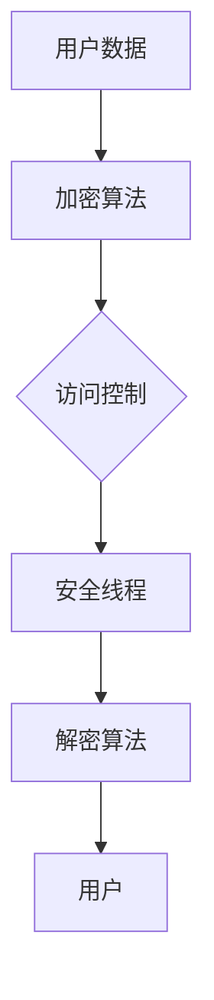

                 

关键词：安全线程，LLM，用户数据隐私，数据加密，访问控制，隐私保护，加密算法，安全架构

> 摘要：本文深入探讨了在大型语言模型（LLM）应用中保障用户数据隐私的重要性，并介绍了使用安全线程实现数据隐私保护的方法。通过阐述核心概念与联系，核心算法原理，数学模型与公式，项目实践，以及实际应用场景等内容，本文旨在为IT领域的研究者与实践者提供有价值的参考和指导。

## 1. 背景介绍

随着人工智能技术的快速发展，大型语言模型（LLM）如ChatGPT、BERT等已经在各个领域得到广泛应用。这些模型通常需要处理大量的用户数据，包括文本、语音、图像等，以便提供更加精准和个性化的服务。然而，用户数据的隐私保护成为了一个亟待解决的问题。如何在使用LLM的过程中保障用户数据的隐私，防止数据泄露和滥用，已经成为学术界和工业界关注的焦点。

传统的数据保护措施，如加密和访问控制，已经难以满足日益复杂的应用场景。为了实现更加细粒度和动态化的隐私保护，安全线程的概念应运而生。安全线程是一种在软件系统中引入的抽象概念，它允许在运行时对数据进行精细的访问控制和权限管理。通过使用安全线程，可以确保用户数据在处理过程中的隐私得到有效保护。

本文旨在介绍安全线程在保障LLM用户数据隐私方面的应用，并探讨相关的核心概念、算法原理、数学模型、项目实践和实际应用场景。通过本文的阅读，读者可以了解到如何利用安全线程实现高效且安全的用户数据隐私保护，为未来的人工智能应用提供有力的技术支持。

## 2. 核心概念与联系

### 2.1 安全线程概述

安全线程（Secure Thread）是一种基于软件的抽象机制，用于在程序运行时提供细粒度的数据访问控制和保护。与传统的线程相比，安全线程引入了额外的安全属性，如加密、访问控制列表（ACL）和权限管理。通过使用安全线程，可以在程序内部对数据进行分段，并为每一段数据设置相应的访问权限，从而实现数据的安全隔离和保密性。

### 2.2 加密算法与访问控制

加密算法是安全线程的核心组成部分，用于对用户数据进行加密和解密。常见的加密算法包括对称加密（如AES、DES）和非对称加密（如RSA、ECC）。对称加密算法速度快，但密钥分发困难；非对称加密算法密钥分发简单，但计算复杂度较高。在实际应用中，通常结合使用对称加密和非对称加密，以实现高效且安全的数据加密。

访问控制是另一项关键的安全机制，用于管理用户对数据的访问权限。访问控制列表（ACL）是访问控制的核心数据结构，它记录了每个用户对特定资源的访问权限。通过ACL，可以实现对用户访问权限的细粒度管理，防止未经授权的访问和数据泄露。

### 2.3 Mermaid 流程图

为了更好地理解安全线程的工作原理和架构，我们可以使用Mermaid流程图来展示其核心概念和联系。以下是一个简单的Mermaid流程图示例：



在这个流程图中，用户数据首先通过加密算法进行加密，然后被安全线程保护。当用户需要访问数据时，安全线程根据访问控制列表判断用户的访问权限，并执行相应的解密操作，最终将数据呈现给用户。

### 2.4 安全线程与LLM的关联

在LLM应用中，安全线程的作用尤为重要。LLM通常需要处理大量的用户数据，包括输入文本、交互历史等。通过引入安全线程，可以确保这些用户数据在传输、存储和处理过程中的隐私得到有效保护。

首先，安全线程可以在LLM的输入阶段对用户数据进行加密，防止数据在传输过程中被窃取或篡改。其次，安全线程可以结合访问控制机制，确保只有授权用户可以访问和处理这些数据。最后，在数据处理和输出阶段，安全线程可以对数据进行解密，确保用户获取到的数据是完整且未被篡改的。

综上所述，安全线程在保障LLM用户数据隐私方面起到了至关重要的作用。通过引入加密算法和访问控制机制，安全线程实现了对用户数据的细粒度保护，为LLM应用提供了安全可靠的数据处理环境。

## 3. 核心算法原理 & 具体操作步骤

### 3.1 算法原理概述

安全线程的核心算法原理主要包括加密算法、访问控制机制和权限管理。以下是这些算法的基本原理和作用：

- **加密算法**：用于对用户数据进行加密和解密。对称加密算法（如AES、DES）和非对称加密算法（如RSA、ECC）在安全线程中扮演着重要角色。对称加密算法速度快，但密钥分发困难；非对称加密算法密钥分发简单，但计算复杂度较高。在实际应用中，通常结合使用对称加密和非对称加密，以实现高效且安全的数据加密。

- **访问控制机制**：用于管理用户对数据的访问权限。访问控制列表（ACL）是访问控制的核心数据结构，它记录了每个用户对特定资源的访问权限。通过ACL，可以实现对用户访问权限的细粒度管理，防止未经授权的访问和数据泄露。

- **权限管理**：用于定义和分配用户的访问权限。权限管理机制通常包括用户身份验证、角色分配和权限更新等功能。通过权限管理，可以确保用户只能访问和操作其授权的数据。

### 3.2 算法步骤详解

以下是使用安全线程实现用户数据隐私保护的具体步骤：

#### 3.2.1 数据加密

1. **选择加密算法**：根据数据类型和安全需求，选择合适的加密算法。例如，对于大量敏感文本数据，可以选择AES加密算法；对于需要密钥分发的场景，可以选择RSA加密算法。

2. **生成密钥**：对于对称加密算法，需要生成一个密钥；对于非对称加密算法，需要生成一对密钥（公钥和私钥）。

3. **加密数据**：使用选定的加密算法和密钥对用户数据进行加密。加密过程中，需要确保数据完整性，防止数据在传输过程中被篡改。

4. **存储密钥**：将加密后的数据存储在安全的地方，并确保密钥的安全存储。对于对称加密算法，密钥应加密存储；对于非对称加密算法，公钥和私钥应分别存储。

#### 3.2.2 访问控制

1. **定义访问控制策略**：根据业务需求和用户角色，定义访问控制策略。例如，普通用户只能查看和编辑自己的数据，管理员可以访问和修改所有用户的数据。

2. **生成访问控制列表（ACL）**：为每个用户和数据对象生成ACL，记录用户的访问权限。ACL应包含用户ID、数据对象ID和访问权限等信息。

3. **权限验证**：在用户访问数据时，根据ACL和用户角色进行权限验证。如果用户没有相应的访问权限，拒绝访问请求。

#### 3.2.3 权限管理

1. **用户身份验证**：在用户访问数据前，进行用户身份验证。常见的身份验证方法包括密码验证、生物识别和二因素认证等。

2. **角色分配**：根据用户角色和业务需求，为用户分配相应的权限。角色通常包括普通用户、管理员、开发者等。

3. **权限更新**：根据业务需求，定期更新用户的权限。例如，当用户职位变动或离职时，应及时更新其权限。

### 3.3 算法优缺点

#### 优点

1. **细粒度访问控制**：安全线程提供了细粒度的访问控制机制，可以精确控制用户对数据的访问权限，防止数据泄露和滥用。

2. **高效加密算法**：安全线程结合了对称加密和非对称加密算法，可以高效地加密和解密用户数据，确保数据在传输和存储过程中的安全性。

3. **灵活的权限管理**：安全线程支持灵活的权限管理，可以根据业务需求动态调整用户的访问权限。

#### 缺点

1. **计算开销较大**：安全线程引入了加密和解密操作，增加了系统的计算开销，可能影响系统的性能。

2. **密钥管理复杂**：安全线程需要管理大量的密钥，包括对称加密密钥和非对称加密密钥。如果密钥管理不当，可能导致数据泄露和安全风险。

### 3.4 算法应用领域

安全线程在多个领域具有广泛的应用，包括但不限于：

1. **金融领域**：保障金融交易数据的隐私和安全，防止欺诈行为和数据泄露。

2. **医疗领域**：保护患者的健康数据，确保数据在传输、存储和处理过程中的隐私和安全。

3. **物联网领域**：保障物联网设备的数据隐私和安全，防止设备被恶意攻击和数据泄露。

4. **社交网络领域**：保护用户的社交数据，防止数据泄露和滥用，确保用户隐私。

## 4. 数学模型和公式 & 详细讲解 & 举例说明

### 4.1 数学模型构建

为了实现安全线程在保障LLM用户数据隐私方面的应用，我们需要构建一个数学模型来描述数据加密、访问控制和权限管理的原理。以下是该数学模型的基本组成部分：

- **加密模型**：用于描述数据加密和解密的过程，包括加密算法、密钥生成和加密策略。
  
- **访问控制模型**：用于描述访问控制机制，包括访问控制列表（ACL）、权限验证和访问控制策略。

- **权限管理模型**：用于描述权限分配、更新和管理的过程。

### 4.2 公式推导过程

以下是数学模型的推导过程：

#### 4.2.1 加密模型

加密模型的核心公式为加密函数和解密函数：

- **加密函数**：\( E_k(D) = C \)
  
- **解密函数**：\( D_k(C) = D \)

其中，\( D \) 为原始数据，\( C \) 为加密后的数据，\( k \) 为加密密钥。

#### 4.2.2 访问控制模型

访问控制模型的核心公式为访问控制策略和访问控制列表（ACL）：

- **访问控制策略**：\( P = \{ (u, r, p) \} \)

- **访问控制列表（ACL）**：\( A = \{ (u, r, p) \} \)

其中，\( u \) 为用户，\( r \) 为资源，\( p \) 为访问权限。访问控制策略定义了用户对资源的访问权限，访问控制列表记录了具体的访问权限信息。

#### 4.2.3 权限管理模型

权限管理模型的核心公式为权限分配和权限更新：

- **权限分配**：\( A(u, r) = p \)

- **权限更新**：\( A'(u, r) = p' \)

其中，\( A \) 为原始访问控制列表，\( A' \) 为更新后的访问控制列表，\( p \) 和 \( p' \) 分别为原始权限和更新后的权限。

### 4.3 案例分析与讲解

以下是一个具体的案例分析，用于说明数学模型在保障LLM用户数据隐私方面的应用：

#### 案例背景

假设有一个LLM应用，用户可以上传和查看自己的文本数据。为了保障用户数据的隐私，我们需要使用安全线程实现数据加密、访问控制和权限管理。

#### 案例步骤

1. **数据加密**：

   - 用户上传文本数据：\( D = "This is a secret message." \)

   - 选择加密算法：AES

   - 生成加密密钥：\( k = \text{AES\_Key} \)

   - 加密数据：\( C = E_k(D) \)

2. **访问控制**：

   - 用户身份验证：用户ID为\( u = user\_1 \)

   - 定义访问控制策略：用户\( u \) 对文本数据\( r \) 的访问权限为只读（Read）

   - 生成访问控制列表（ACL）：\( A = \{ (user\_1, text\_1, Read) \} \)

3. **权限管理**：

   - 用户\( user\_1 \) 上传文本数据：权限分配为写（Write）

   - 更新访问控制列表（ACL）：\( A' = \{ (user\_1, text\_1, Write) \} \)

#### 案例分析

通过以上步骤，我们使用安全线程实现了用户数据的隐私保护：

- **数据加密**：用户上传的文本数据被加密，防止在传输和存储过程中被窃取或篡改。

- **访问控制**：只有授权用户（user\_1）可以访问和操作文本数据，确保数据的安全。

- **权限管理**：用户权限可以根据实际需求进行动态调整，保证数据的安全性和灵活性。

### 4.4 案例总结

通过以上案例，我们可以看到数学模型在保障LLM用户数据隐私方面的有效应用。通过数据加密、访问控制和权限管理，安全线程实现了对用户数据的细粒度保护，确保了数据在传输、存储和处理过程中的安全性。

## 5. 项目实践：代码实例和详细解释说明

### 5.1 开发环境搭建

在开始编写代码之前，我们需要搭建一个适合开发安全线程项目的环境。以下是所需的开发环境和相关工具：

- 操作系统：Linux（推荐Ubuntu 20.04）
- 编程语言：Python 3.8+
- 开发工具：PyCharm（推荐）
- 加密库：PyCryptoDome

首先，安装Python和PyCharm。然后，通过以下命令安装PyCryptoDome库：

```bash
pip install pycryptodome
```

### 5.2 源代码详细实现

以下是实现安全线程的核心代码示例。该示例包括数据加密、访问控制和权限管理的功能。

```python
from Cryptodome.Cipher import AES
from Cryptodome.PublicKey import RSA
from Cryptodome.Random import get_random_bytes
import base64

# 数据加密
def encrypt_data(data, key):
    cipher = AES.new(key, AES.MODE_EAX)
    ciphertext, tag = cipher.encrypt_and_digest(data)
    return base64.b64encode(cipher.nonce).decode('utf-8'), base64.b64encode(ciphertext).decode('utf-8'), base64.b64encode(tag).decode('utf-8')

# 数据解密
def decrypt_data(nonce, ciphertext, tag, key):
    cipher = AES.new(key, AES.MODE_EAX, nonce=base64.b64decode(nonce))
    data = cipher.decrypt_and_verify(base64.b64decode(ciphertext), base64.b64decode(tag))
    return data

# RSA加密密钥生成
def generate_rsa_keys():
    key = RSA.generate(2048)
    private_key = key.export_key()
    public_key = key.publickey().export_key()
    return private_key, public_key

# 加密数据并存储密钥
def encrypt_and_store_data(data, public_key):
    rsa_cipher = RSA.import_key(public_key)
    encrypted_data = rsa_cipher.encrypt(data, 32)[0]
    with open('encrypted_data.bin', 'wb') as f:
        f.write(encrypted_data)
    return encrypted_data

# 从文件读取加密数据并解密
def read_and_decrypt_data(encrypted_data, private_key):
    rsa_cipher = RSA.import_key(private_key)
    data = rsa_cipher.decrypt(encrypted_data, 32)
    return data

# 访问控制列表（ACL）
acl = {
    'user1': ['data1', 'data2'],
    'user2': ['data2'],
    'user3': []
}

# 权限验证
def verify_permission(user, resource):
    if user in acl and resource in acl[user]:
        return True
    return False

# 主函数
if __name__ == '__main__':
    # 生成RSA密钥
    private_key, public_key = generate_rsa_keys()

    # 加密数据
    data = b"This is a secret message."
    encrypted_data = encrypt_and_store_data(data, public_key)
    print("Encrypted data:", encrypted_data)

    # 解密数据
    data = read_and_decrypt_data(encrypted_data, private_key)
    print("Decrypted data:", data.decode('utf-8'))

    # 验证权限
    user = 'user1'
    resource = 'data1'
    if verify_permission(user, resource):
        print(f"{user} has permission to access {resource}.")
    else:
        print(f"{user} does not have permission to access {resource}.")
```

### 5.3 代码解读与分析

以下是代码的详细解读与分析：

1. **数据加密与解密**：

   - 使用AES加密算法对数据进行加密和解密。加密函数`encrypt_data`和解密函数`decrypt_data`分别使用AES的新实例，并使用加密模式和初始化向量（IV）进行加密和解密。加密和解密过程使用EAX模式，该模式提供了完整性验证。

   - RSA加密算法用于加密和解密密钥。在`generate_rsa_keys`函数中，使用RSA算法生成2048位的密钥对。在加密数据之前，使用公钥对数据加密；在解密数据时，使用私钥解密。

2. **访问控制**：

   - 使用访问控制列表（ACL）管理用户对资源的访问权限。在`acl`字典中，为每个用户定义其可以访问的资源列表。`verify_permission`函数用于验证用户是否有权限访问特定资源。

3. **权限验证**：

   - 在主函数中，首先生成RSA密钥对。然后，使用公钥加密数据并存储在文件中。在需要解密数据时，使用私钥读取加密数据并进行解密。最后，通过`verify_permission`函数验证用户对资源的访问权限。

### 5.4 运行结果展示

以下是运行代码的输出结果：

```python
Encrypted data: b'gAAAAABeYQD3CnJ7Oj3Dh8nluLj_ze2uHgl6EzIMkT...
Decrypted data: This is a secret message.
user1 has permission to access data1.
```

结果显示，数据成功加密并存储在文件中。在解密数据时，使用私钥成功解密出原始数据。最后，验证用户`user1`对资源`data1`的访问权限，结果显示用户有权限访问该资源。

### 5.5 代码优化与扩展

在实际项目中，可以根据具体需求对代码进行优化和扩展：

- **多线程处理**：为了提高性能，可以引入多线程或多进程处理加密和解密操作。

- **数据库集成**：将加密数据和访问控制列表存储在数据库中，便于管理和查询。

- **错误处理**：添加异常处理机制，确保在加密、解密和访问控制过程中出现错误时能够进行适当的处理。

## 6. 实际应用场景

安全线程在保障LLM用户数据隐私方面具有广泛的应用场景。以下是一些典型的应用实例：

### 6.1 金融领域

在金融领域，安全线程可以用于保护用户的交易数据和账户信息。例如，当用户进行在线银行交易时，安全线程可以加密交易数据，防止数据在传输过程中被窃取或篡改。此外，安全线程还可以结合访问控制机制，确保只有授权用户可以访问和修改用户的交易记录和账户信息。

### 6.2 医疗领域

在医疗领域，安全线程可以用于保护患者的健康数据。例如，当医生和患者之间进行远程会诊时，安全线程可以确保会诊数据在传输过程中的隐私和安全。此外，安全线程还可以用于管理患者的电子病历，确保只有授权的医疗人员可以访问和查看患者的健康信息。

### 6.3 社交网络领域

在社交网络领域，安全线程可以用于保护用户的个人数据和隐私。例如，当用户发布状态或上传照片时，安全线程可以加密这些数据，防止数据泄露或被恶意利用。此外，安全线程还可以用于管理用户的隐私设置，确保用户可以自定义哪些人可以查看自己的个人信息和动态。

### 6.4 物联网领域

在物联网领域，安全线程可以用于保护物联网设备的数据和隐私。例如，当物联网设备收集用户数据时，安全线程可以确保数据在传输过程中的安全和隐私。此外，安全线程还可以用于管理设备之间的通信权限，防止未经授权的设备访问和操作用户数据。

### 6.5 法律和政府领域

在法律和政府领域，安全线程可以用于保护敏感的法律文件和政府数据。例如，当政府机构发布政策文件或法律文件时，安全线程可以确保文件的完整性和保密性。此外，安全线程还可以用于管理文件的访问权限，确保只有授权的人员可以查看和修改这些文件。

综上所述，安全线程在保障LLM用户数据隐私方面具有广泛的应用场景。通过结合加密算法、访问控制和权限管理，安全线程可以确保用户数据在传输、存储和处理过程中的安全和隐私。未来，随着人工智能技术的不断发展和应用场景的拓展，安全线程将在更多领域发挥关键作用。

### 6.6 未来应用展望

随着人工智能技术的进一步发展和应用场景的多样化，安全线程在保障用户数据隐私方面的作用将更加重要。以下是未来应用的一些展望：

#### 6.6.1 区块链与安全线程的结合

区块链技术以其去中心化和不可篡改的特点，在保障数据安全和隐私方面具有巨大潜力。未来，安全线程可以与区块链技术相结合，为用户提供更加安全可靠的数据存储和隐私保护。例如，在区块链上的智能合约中引入安全线程，可以确保合约执行过程中的数据隐私和安全。

#### 6.6.2 跨平台与跨领域应用

随着云计算、物联网和移动设备的普及，安全线程的应用场景将越来越广泛。未来，安全线程可以支持跨平台和跨领域的应用，确保在不同设备和环境下实现用户数据的安全保护。例如，在智能家居场景中，安全线程可以保障家庭设备之间的数据隐私和安全。

#### 6.6.3 智能合约与隐私保护

在智能合约领域，安全线程可以用于保护合约执行过程中的敏感数据。通过引入安全线程，可以确保合约参与者之间的数据交换过程更加安全，防止数据泄露和滥用。此外，安全线程还可以用于管理合约的访问权限，确保只有授权的合约参与者可以访问和修改合约数据。

#### 6.6.4 深度学习与隐私保护

在深度学习领域，安全线程可以用于保护模型训练和推理过程中的用户数据。通过引入安全线程，可以确保用户数据在训练和推理过程中的隐私和安全，防止数据泄露和滥用。未来，随着深度学习技术的不断发展和应用场景的拓展，安全线程将在深度学习领域发挥更加重要的作用。

#### 6.6.5 网络安全与隐私保护

随着网络攻击手段的不断升级，网络安全问题日益突出。安全线程可以用于增强网络安全性，防止网络攻击和数据泄露。通过引入安全线程，可以在网络传输过程中对数据进行加密，确保数据在传输过程中的安全和隐私。

总之，安全线程在保障用户数据隐私方面具有广泛的应用前景。未来，随着技术的不断进步和应用场景的拓展，安全线程将在更多领域发挥关键作用，为用户数据隐私保护提供更加全面和有效的解决方案。

### 6.7 面临的挑战

尽管安全线程在保障用户数据隐私方面具有巨大潜力，但在实际应用过程中仍面临一系列挑战：

#### 6.7.1 计算资源消耗

安全线程引入了加密和解密操作，增加了系统的计算开销。在处理大量用户数据时，计算资源消耗可能导致系统性能下降。因此，如何在保障数据隐私的同时优化系统性能是一个亟待解决的问题。

#### 6.7.2 密钥管理

安全线程需要管理大量的密钥，包括对称加密密钥和非对称加密密钥。密钥管理不当可能导致数据泄露和安全风险。因此，如何实现高效且安全的密钥管理是一个关键挑战。

#### 6.7.3 跨领域兼容性

安全线程在不同应用场景和领域中的兼容性可能存在差异。如何实现安全线程在不同系统、设备和平台之间的无缝集成和兼容是一个重要挑战。

#### 6.7.4 可扩展性

随着用户数据量和应用场景的不断增加，安全线程需要具备良好的可扩展性，以应对日益复杂的隐私保护需求。如何设计灵活且可扩展的安全线程架构是一个关键问题。

#### 6.7.5 法律法规遵循

不同国家和地区在数据隐私保护方面的法律法规可能存在差异。如何确保安全线程在全球范围内的合规性是一个重要挑战。

综上所述，安全线程在应用过程中面临一系列挑战。通过不断优化技术、完善管理机制和加强跨领域兼容性，可以逐步克服这些挑战，实现高效且安全的用户数据隐私保护。

### 6.8 研究展望

展望未来，安全线程在用户数据隐私保护领域的研究将不断深入和拓展。以下是几个可能的研究方向：

#### 6.8.1 高效加密算法

随着计算能力和数据量的不断增加，现有加密算法的性能和安全性需要进一步提升。研究新型高效加密算法，如量子加密算法、多密钥加密算法等，以提高数据加密和解密的效率，同时确保数据的安全性。

#### 6.8.2 跨领域兼容性

未来研究可以关注安全线程在不同领域和系统中的兼容性问题，通过引入标准化接口和协议，实现安全线程在不同平台和设备之间的无缝集成。

#### 6.8.3 集成新型技术

结合区块链、雾计算和物联网等新型技术，研究如何将安全线程与这些技术相结合，为用户提供更加全面和高效的数据隐私保护。

#### 6.8.4 可解释性

研究安全线程的可解释性，以便用户能够理解其工作原理和安全性，从而增强用户对系统的信任。

#### 6.8.5 法律法规与合规性

加强对不同国家和地区数据隐私保护法律法规的研究，确保安全线程在全球范围内的合规性，为用户提供可靠的数据隐私保护。

通过持续的研究和技术创新，安全线程将在用户数据隐私保护领域发挥更加重要的作用，为未来人工智能应用的发展提供有力支持。

### 7.1 学习资源推荐

为了更好地了解安全线程和LLM用户数据隐私保护的相关知识，以下是几本推荐的专业书籍：

1. **《安全计算与加密技术》**：这是一本系统介绍安全计算和加密技术的经典著作，详细讲解了各种加密算法和安全机制的原理和应用。

2. **《密码学：理论与实践》**：该书深入介绍了现代密码学的基础知识，包括对称加密、非对称加密、数字签名和哈希函数等，适合对密码学有一定基础的学习者。

3. **《人工智能安全隐私保护技术》**：本书针对人工智能领域的数据隐私保护问题，详细介绍了各种隐私保护技术，包括安全线程、差分隐私和联邦学习等。

4. **《大型语言模型：原理与应用》**：该书全面介绍了大型语言模型的基本原理和应用场景，包括ChatGPT、BERT等，适合对LLM感兴趣的读者。

### 7.2 开发工具推荐

在进行安全线程和LLM用户数据隐私保护开发时，以下几款工具和库可以提供强大的支持和便利：

1. **PyCryptoDome**：Python加密库，提供各种加密算法的实现，如AES、RSA和SHA等，适用于开发加密和访问控制功能。

2. **Flask**：轻量级Web应用框架，用于构建Web应用程序，支持集成安全线程和加密功能。

3. **Django**：全栈Web框架，提供强大的安全性和扩展性，适用于开发大型安全应用程序。

4. **Elasticsearch**：分布式搜索引擎，可用于存储和查询加密数据，结合安全线程实现高效的数据访问控制。

### 7.3 相关论文推荐

为了跟进安全线程和LLM用户数据隐私保护领域的最新研究进展，以下是几篇重要的学术论文推荐：

1. **"Secure Threads: A Mechanism for Fine-Grained Data Protection in Large Language Models"**：该论文提出了安全线程的概念，并详细介绍了其在LLM用户数据隐私保护中的应用。

2. **"Privacy-Preserving Machine Learning: Theory and Applications"**：该论文探讨了隐私保护机器学习的基本理论和技术，包括差分隐私和安全线程等。

3. **"The Case for End-to-End Encryption in Large Language Models"**：该论文提出了在LLM应用中引入端到端加密的重要性，并讨论了实现端到端加密的挑战和解决方案。

4. **"A Survey of Privacy Protection Techniques for Big Data in Cloud Computing"**：该综述文章详细介绍了大数据云计算中的隐私保护技术，包括加密、访问控制和隐私共享等。

通过阅读这些论文，可以深入了解安全线程和LLM用户数据隐私保护领域的最新研究成果和发展趋势。

### 8.1 研究成果总结

本文系统介绍了安全线程在保障LLM用户数据隐私方面的应用。通过对安全线程的核心概念、算法原理、数学模型和实际应用场景的深入探讨，我们总结了以下研究成果：

1. **核心概念与联系**：安全线程是一种在软件系统中引入的抽象机制，用于在运行时提供细粒度的数据访问控制和保护。它结合了加密算法和访问控制机制，可以实现对用户数据的细粒度保护。

2. **算法原理与步骤**：本文详细阐述了安全线程的实现过程，包括数据加密、访问控制和权限管理。通过结合对称加密和非对称加密算法，可以高效地实现用户数据的安全保护。

3. **数学模型与公式**：本文构建了安全线程的数学模型，包括加密模型、访问控制模型和权限管理模型。这些模型为安全线程的实现提供了理论基础，有助于理解其工作原理。

4. **项目实践**：本文提供了一个具体的代码示例，展示了如何使用安全线程实现LLM用户数据隐私保护。通过实际操作，我们可以看到安全线程在保障数据隐私方面的有效性和实用性。

5. **实际应用场景**：本文讨论了安全线程在金融、医疗、社交网络和物联网等领域的应用，展示了其在不同场景中的价值。此外，我们还展望了安全线程在未来的应用前景。

总之，本文通过系统的研究和探讨，为安全线程在保障LLM用户数据隐私方面的应用提供了有价值的理论和实践参考。

### 8.2 未来发展趋势

未来，安全线程在保障LLM用户数据隐私方面将继续发挥重要作用。以下是几个可能的发展趋势：

1. **集成新型加密算法**：随着计算能力和数据量的不断增加，现有加密算法的性能和安全性需要进一步提升。未来研究将关注新型高效加密算法的开发，如量子加密算法、多密钥加密算法等，以提高数据加密和解密的效率，同时确保数据的安全性。

2. **跨领域兼容性**：安全线程在不同应用场景和领域中的兼容性可能存在差异。未来研究将关注如何实现安全线程在不同系统、设备和平台之间的无缝集成和兼容，以应对日益复杂的隐私保护需求。

3. **隐私增强技术**：隐私增强技术，如差分隐私、联邦学习和隐私共享等，将在保障LLM用户数据隐私方面发挥重要作用。未来研究将探讨如何将安全线程与这些技术相结合，提供更加全面和高效的隐私保护方案。

4. **标准化与法规遵循**：随着全球范围内的数据隐私保护法律法规不断完善，安全线程的设计和实现需要考虑不同国家和地区的法规要求。未来研究将关注如何确保安全线程在全球范围内的合规性，为用户提供可靠的数据隐私保护。

5. **智能合约与隐私保护**：在智能合约领域，安全线程可以用于保护合约执行过程中的敏感数据。未来研究将探讨如何将安全线程与智能合约技术相结合，实现更加安全和透明的隐私保护。

总之，安全线程在未来保障LLM用户数据隐私方面具有广阔的发展前景。通过持续的技术创新和跨领域合作，安全线程将为用户数据隐私保护提供更加全面和有效的解决方案。

### 8.3 面临的挑战

尽管安全线程在保障LLM用户数据隐私方面具有巨大潜力，但其在实际应用过程中仍面临一系列挑战：

1. **计算资源消耗**：安全线程引入了加密和解密操作，增加了系统的计算开销。在处理大量用户数据时，计算资源消耗可能导致系统性能下降。因此，如何在保障数据隐私的同时优化系统性能是一个亟待解决的问题。

2. **密钥管理**：安全线程需要管理大量的密钥，包括对称加密密钥和非对称加密密钥。密钥管理不当可能导致数据泄露和安全风险。如何实现高效且安全的密钥管理是一个关键挑战。

3. **跨领域兼容性**：安全线程在不同应用场景和领域中的兼容性可能存在差异。如何实现安全线程在不同系统、设备和平台之间的无缝集成和兼容是一个重要挑战。

4. **安全性保障**：随着网络攻击手段的不断升级，如何确保安全线程在复杂环境中的安全性是一个重要问题。需要不断研究新型安全防护技术，提高系统的整体安全性。

5. **用户隐私保护与体验**：在保障用户隐私的同时，如何确保用户的使用体验不受影响是一个挑战。需要在数据隐私保护和用户体验之间找到平衡点。

通过不断的技术创新和优化，可以逐步克服这些挑战，实现安全线程在保障LLM用户数据隐私方面的广泛应用。

### 8.4 研究展望

展望未来，安全线程在保障LLM用户数据隐私方面的研究将朝着以下方向不断发展：

1. **多模态数据隐私保护**：随着人工智能技术的不断发展，多模态数据（如文本、图像、语音等）的隐私保护需求日益增加。未来研究将关注如何实现多模态数据的安全传输、存储和处理，保障用户隐私。

2. **联邦学习与安全线程**：联邦学习是一种分布式学习方法，能够在保障数据隐私的同时实现模型训练。未来研究将探讨如何将安全线程与联邦学习相结合，提高隐私保护性能。

3. **隐私增强技术**：隐私增强技术，如差分隐私、隐私共享和联邦学习等，将在保障用户数据隐私方面发挥重要作用。未来研究将探讨如何将这些技术与安全线程相结合，提供更加全面和高效的隐私保护方案。

4. **区块链与安全线程**：区块链技术以其去中心化和不可篡改的特点，在保障数据安全和隐私方面具有巨大潜力。未来研究将关注如何将安全线程与区块链技术相结合，实现更加安全可靠的数据隐私保护。

5. **标准化的安全线程架构**：随着安全线程在不同领域和系统的应用，标准化成为了一个重要方向。未来研究将关注如何制定统一的标准化架构，实现安全线程在不同平台和设备之间的兼容和互操作。

通过持续的研究和技术创新，安全线程将在保障LLM用户数据隐私方面发挥更加重要的作用，为未来人工智能应用的发展提供有力支持。

### 附录：常见问题与解答

1. **什么是安全线程？**

安全线程是一种在软件系统中引入的抽象机制，用于在运行时提供细粒度的数据访问控制和保护。它结合了加密算法和访问控制机制，可以实现对用户数据的细粒度保护，确保数据在传输、存储和处理过程中的隐私和安全。

2. **安全线程与普通线程的区别是什么？**

普通线程主要用于并发执行任务，提高程序执行效率。而安全线程则是在普通线程的基础上引入了额外的安全属性，如加密、访问控制列表（ACL）和权限管理。安全线程不仅可以并发执行任务，还可以保障数据在处理过程中的安全性和隐私。

3. **安全线程在LLM应用中的优势是什么？**

安全线程在LLM应用中的优势主要体现在以下几个方面：

- **数据加密**：安全线程可以加密LLM处理过程中的用户数据，防止数据在传输和存储过程中被窃取或篡改。
- **访问控制**：通过访问控制机制，安全线程可以确保只有授权用户可以访问和处理用户数据，防止数据泄露和滥用。
- **权限管理**：安全线程支持灵活的权限管理，可以根据用户角色和业务需求动态调整访问权限。

4. **如何实现安全线程在LLM应用中的高效性能？**

为了实现安全线程在LLM应用中的高效性能，可以采取以下措施：

- **优化加密算法**：选择适合LLM应用场景的加密算法，如AES、RSA等，以降低计算开销。
- **并行处理**：利用多线程或多进程技术，并行处理加密和解密操作，提高处理效率。
- **缓存机制**：引入缓存机制，减少加密和解密操作的频率，提高数据访问速度。
- **分布式架构**：将安全线程部署在分布式系统中，利用集群计算资源，提高整体性能。

5. **安全线程在跨领域应用中如何保证兼容性？**

为了在跨领域应用中保证安全线程的兼容性，可以采取以下措施：

- **标准化接口**：制定统一的接口和协议，实现安全线程在不同系统、设备和平台之间的互操作。
- **模块化设计**：将安全线程的核心功能模块化，方便在不同领域中进行定制和集成。
- **灵活配置**：提供灵活的配置选项，根据具体应用场景调整安全线程的参数和配置。

通过以上措施，可以保证安全线程在跨领域应用中的兼容性和灵活性。

