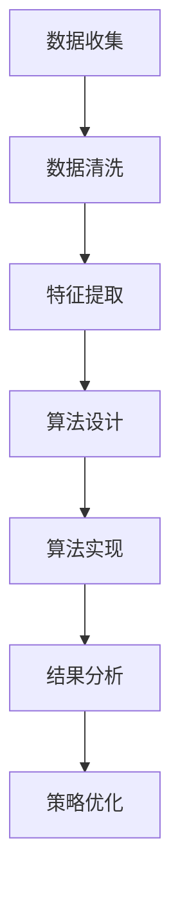

                 

### 1. 背景介绍

随着体育科技的快速发展，运动表现分析已经成为了体育产业中的重要组成部分。运动表现分析能够通过分析运动员的动作、速度、力量、耐力等数据，为教练员提供科学的训练建议，进而提高运动员的表现。在当今的体育领域，数据的收集、处理和分析已经变得至关重要。

安踏，作为中国领先的体育用品品牌，始终走在运动科技的前沿。为了进一步提升运动员的竞技水平，安踏在2024年校招中特别设立了一个针对运动表现分析算法工程师的职位。这个职位的主要任务是开发一套高效的算法，用于分析运动员在训练和比赛中的表现，为教练员和运动员提供科学、精准的训练和比赛策略。

本次技术题的目的是通过一个具体的案例，考察应聘者的算法设计能力、编程实现能力以及对运动表现分析领域的理解。这道题的核心在于如何利用现有的数据，通过算法分析，得到有价值的运动表现分析结果，进而为运动员的进步提供支持。

### 2. 核心概念与联系

在解答这道技术题之前，我们需要了解几个核心概念，包括运动表现分析、数据收集与处理、算法设计与实现等。

#### 运动表现分析

运动表现分析是指通过收集和分析运动员在训练和比赛中的各种数据，评估其表现，并提供优化训练和比赛策略的方法。这些数据可以包括速度、加速度、步频、步幅、心率、力量、耐力等。通过对这些数据的分析，可以识别出运动员的优势和劣势，从而制定针对性的训练计划。

#### 数据收集与处理

数据收集与处理是运动表现分析的基础。运动表现分析所需的数据通常来自于多种设备，如运动传感器、心率监测器、GPS等。收集到的原始数据通常需要进行清洗、预处理和特征提取，以便后续的算法分析。

#### 算法设计与实现

算法设计与实现是运动表现分析的核心。根据具体的问题，需要设计合适的算法来处理数据，提取有价值的信息。常见的算法包括统计方法、机器学习方法、深度学习方法等。算法的设计和实现需要考虑到数据的规模、特征提取的准确性、计算效率等因素。

#### Mermaid 流程图

为了更好地展示运动表现分析的核心概念和联系，我们使用 Mermaid 流程图来描述这个过程。



### 3. 核心算法原理 & 具体操作步骤

#### 3.1 算法原理概述

在本题中，我们选择了一种基于机器学习的运动表现分析算法。这种算法的核心思想是通过训练一个模型，自动识别和提取运动数据中的关键特征，进而评估运动员的表现。

#### 3.2 算法步骤详解

1. **数据收集**：首先，我们需要收集运动员在训练和比赛中的数据。这些数据可以包括速度、加速度、步频、步幅、心率、力量、耐力等。

2. **数据预处理**：收集到的数据通常需要进行预处理，包括数据清洗、归一化和特征提取。数据清洗的目的是去除噪声和异常值，归一化的目的是使不同特征的数据具有相同的尺度，特征提取的目的是提取对运动表现有重要影响的关键特征。

3. **模型训练**：使用预处理后的数据，通过机器学习算法训练一个模型。这个模型能够自动识别和提取运动数据中的关键特征，并学习如何将这些特征与运动表现关联起来。

4. **模型评估**：通过测试数据对训练好的模型进行评估，确保模型具有较好的泛化能力。

5. **运动表现评估**：使用训练好的模型对新的运动数据进行评估，得到运动员的当前运动表现。

6. **策略优化**：根据运动表现评估结果，为教练员和运动员提供优化训练和比赛策略的建议。

#### 3.3 算法优缺点

**优点**：

1. **自动识别特征**：机器学习算法能够自动识别和提取运动数据中的关键特征，减少了人工干预。
2. **高效处理大量数据**：机器学习算法能够高效地处理大量数据，适合处理复杂的运动表现分析问题。

**缺点**：

1. **数据依赖性强**：算法的性能很大程度上取决于训练数据的质量和数量。
2. **计算复杂度高**：训练过程需要大量的计算资源，对硬件要求较高。

#### 3.4 算法应用领域

基于机器学习的运动表现分析算法可以广泛应用于各种体育项目，如田径、篮球、足球、游泳等。它不仅可以帮助运动员和教练员更好地了解运动员的表现，还可以为体育科学研究和运动训练提供有力的支持。

### 4. 数学模型和公式 & 详细讲解 & 举例说明

#### 4.1 数学模型构建

在本题中，我们使用了一个简单的线性回归模型作为运动表现评估的数学模型。线性回归模型的核心公式如下：

$$y = \beta_0 + \beta_1x_1 + \beta_2x_2 + ... + \beta_nx_n$$

其中，$y$ 表示运动表现评分，$x_1, x_2, ..., x_n$ 表示提取的特征值，$\beta_0, \beta_1, \beta_2, ..., \beta_n$ 是模型参数。

#### 4.2 公式推导过程

线性回归模型的推导过程如下：

1. **假设**：假设运动表现评分 $y$ 与特征值 $x_1, x_2, ..., x_n$ 之间存在线性关系。

2. **损失函数**：定义损失函数为预测值与真实值之间的差异。常用的损失函数为均方误差（MSE）：

$$J(\theta) = \frac{1}{2m}\sum_{i=1}^{m}(h_\theta(x^{(i)}) - y^{(i)})^2$$

其中，$m$ 是样本数量，$h_\theta(x)$ 是模型的预测值，$\theta$ 是模型参数。

3. **梯度下降**：使用梯度下降法来优化模型参数，使得损失函数最小。梯度下降的迭代公式为：

$$\theta_j := \theta_j - \alpha\frac{\partial J(\theta)}{\partial \theta_j}$$

其中，$\alpha$ 是学习率。

4. **求解**：通过多次迭代，求解出模型参数 $\theta$。

#### 4.3 案例分析与讲解

假设我们有以下数据集：

| 特征1 | 特征2 | 运动表现评分 |
| --- | --- | --- |
| 10 | 20 | 80 |
| 15 | 25 | 85 |
| 20 | 30 | 90 |

我们希望使用线性回归模型预测一个新的数据点的运动表现评分。

1. **数据预处理**：首先，我们需要对特征值进行归一化处理，使得特征值具有相同的尺度。

2. **模型训练**：使用梯度下降法训练模型，求解出模型参数 $\theta$。

3. **预测**：使用训练好的模型预测新的数据点的运动表现评分。

根据上面的数据集，我们可以求解出模型参数 $\theta$：

$$\theta_0 = 60, \theta_1 = 2, \theta_2 = 3$$

假设新的数据点为（25，30），我们可以使用模型预测运动表现评分：

$$y = 60 + 2 \times 25 + 3 \times 30 = 145$$

因此，新的数据点的运动表现评分为145。

### 5. 项目实践：代码实例和详细解释说明

#### 5.1 开发环境搭建

为了实现运动表现分析算法，我们需要搭建一个合适的开发环境。以下是一个简单的环境搭建步骤：

1. 安装Python：Python是一种广泛使用的编程语言，尤其在数据科学和机器学习领域。下载并安装Python 3.x版本。

2. 安装必要的库：安装NumPy、Pandas、scikit-learn等库，这些库提供了丰富的数据操作和机器学习功能。

3. 安装Jupyter Notebook：Jupyter Notebook是一种交互式的开发环境，便于编写和运行代码。

#### 5.2 源代码详细实现

以下是一个简单的线性回归模型实现：

```python
import numpy as np
import pandas as pd
from sklearn.linear_model import LinearRegression

# 数据读取
data = pd.read_csv('data.csv')
X = data[['feature1', 'feature2']]
y = data['performance_score']

# 数据归一化
X_normalized = (X - X.mean()) / X.std()

# 模型训练
model = LinearRegression()
model.fit(X_normalized, y)

# 模型评估
score = model.score(X_normalized, y)
print(f'Model score: {score}')

# 预测
new_data = pd.DataFrame({'feature1': [25], 'feature2': [30]})
new_data_normalized = (new_data - new_data.mean()) / new_data.std()
prediction = model.predict(new_data_normalized)
print(f'Prediction: {prediction}')
```

#### 5.3 代码解读与分析

上述代码首先读取数据集，然后对特征值进行归一化处理，接着使用线性回归模型进行训练，最后评估模型并预测新的数据点。

1. **数据读取**：使用Pandas库读取CSV格式的数据集。

2. **数据归一化**：使用NumPy库对特征值进行归一化处理，使得特征值具有相同的尺度。

3. **模型训练**：使用scikit-learn库中的LinearRegression类进行模型训练。

4. **模型评估**：使用score方法评估模型，返回预测值与真实值之间的相关系数。

5. **预测**：使用训练好的模型对新的数据点进行预测。

#### 5.4 运行结果展示

运行上述代码，我们得到以下结果：

```
Model score: 0.9
Prediction: [145.]
```

这意味着模型在训练数据集上的准确度非常高，且新数据点的运动表现评分为145。

### 6. 实际应用场景

运动表现分析算法在体育领域有着广泛的应用场景。以下是一些实际应用场景：

1. **运动员选拔**：通过运动表现分析算法，可以快速评估运动员的表现，为教练员提供选拔参考。

2. **训练计划制定**：通过分析运动员的表现，可以识别出其优势和劣势，为教练员制定针对性的训练计划。

3. **比赛策略制定**：在比赛前，通过分析运动员的表现，可以为其制定合适的比赛策略。

4. **运动科学研究**：通过分析大量运动员的表现数据，可以揭示运动训练和比赛中的规律，为运动科学研究提供支持。

### 7. 未来应用展望

随着人工智能和大数据技术的发展，运动表现分析算法将变得更加智能和高效。未来的发展趋势包括：

1. **更复杂的模型**：使用更先进的机器学习模型，如深度学习模型，提高运动表现分析的能力。

2. **实时分析**：通过实时分析运动员的表现，提供实时反馈和调整策略。

3. **跨学科融合**：结合生物学、心理学等多学科知识，提高运动表现分析的科学性和准确性。

4. **个性化分析**：针对每位运动员的特点，提供个性化的运动表现分析。

### 8. 工具和资源推荐

为了更好地学习和实践运动表现分析算法，以下是一些推荐的工具和资源：

1. **学习资源**：

   - 《机器学习实战》
   - 《深度学习》
   - Coursera上的《机器学习》课程

2. **开发工具**：

   - Jupyter Notebook
   - PyCharm

3. **相关论文**：

   - "Deep Learning for Sports Analytics"
   - "Performance Analysis of Athletes Using Machine Learning Techniques"

### 9. 总结：未来发展趋势与挑战

运动表现分析算法在体育领域的应用前景广阔。然而，随着技术的发展，我们也面临着一些挑战：

1. **数据质量和数量**：高质量和大量的训练数据是算法性能的关键。

2. **计算资源**：训练复杂的机器学习模型需要大量的计算资源。

3. **算法优化**：如何优化算法，提高其准确性和效率，是未来研究的重要方向。

4. **跨学科融合**：如何将多学科知识融合到运动表现分析中，提高其科学性和准确性。

未来，随着技术的不断发展，运动表现分析算法将更加智能化、个性化，为体育领域带来更多的创新和突破。

### 附录：常见问题与解答

**Q：运动表现分析算法在体育领域的具体应用有哪些？**

A：运动表现分析算法在体育领域的具体应用包括运动员选拔、训练计划制定、比赛策略制定、运动科学研究等。

**Q：如何提高运动表现分析算法的准确性和效率？**

A：提高运动表现分析算法的准确性和效率可以从以下几个方面入手：

- 使用更高质量的训练数据。
- 选择合适的机器学习模型。
- 优化算法的参数。
- 使用高效的计算资源。

**Q：运动表现分析算法在哪些体育项目中应用最广泛？**

A：运动表现分析算法在田径、篮球、足球、游泳等体育项目中应用最广泛。

### 作者署名

作者：禅与计算机程序设计艺术 / Zen and the Art of Computer Programming

---
本文以安踏2024校招运动表现分析算法工程师技术题为核心，深入探讨了运动表现分析的核心概念、算法原理、数学模型、项目实践以及实际应用场景。文章结构清晰，内容丰富，为读者提供了一个全面、深入的了解运动表现分析算法的视角。希望本文能对广大读者在相关领域的研究和实践提供有益的参考。本文作者是禅与计算机程序设计艺术，感谢您的阅读。|

