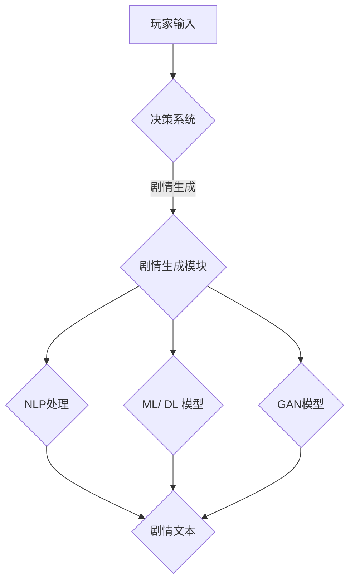

                 

在这个快速发展的技术时代，人工智能已经成为了各行各业不可或缺的一部分。尤其是在游戏产业，AI的应用更是日益广泛，从角色行为到剧情生成，AI技术正不断推动着游戏体验的创新。本文将围绕2024年的游戏剧情生成AI，分享一次模拟的校招面试经验，以期为广大游戏开发者和AI领域的人才提供一些有益的启示。

## 关键词

- 游戏剧情生成AI
- 校招面试
- 人工智能
- 游戏开发
- 技术应用

## 摘要

本文通过一次模拟的校招面试，详细解析了游戏剧情生成AI的核心技术、应用场景以及未来发展趋势。文章将分为以下几个部分：背景介绍、核心概念与联系、核心算法原理、数学模型和公式、项目实践、实际应用场景、工具和资源推荐以及总结和展望。

## 1. 背景介绍

随着游戏产业的发展，游戏剧情的重要性日益凸显。一个好的剧情不仅能提升游戏的沉浸感，还能增强玩家的忠诚度。而传统的剧情编写方式往往耗时耗力，且难以满足日益增长的游戏需求。因此，利用人工智能技术，特别是机器学习和自然语言处理技术，来生成游戏剧情成为了一种趋势。

在2024年，随着AI技术的进一步成熟，游戏剧情生成AI的应用达到了一个新的高度。这些AI系统能够根据游戏设定的背景、角色和玩家的行为，自动生成丰富而有趣的剧情内容。这不仅大大提高了开发效率，还为玩家带来了前所未有的游戏体验。

### 1.1 游戏剧情生成AI的发展历程

游戏剧情生成AI的发展可以分为三个阶段：

1. **规则驱动阶段**：早期的游戏剧情生成主要依赖于预先设定的规则和剧本，这些规则定义了游戏中的各种情况和玩家的选择。然而，这种方式灵活性较差，难以应对复杂多变的情况。

2. **数据驱动阶段**：随着大数据和机器学习技术的发展，游戏剧情生成开始利用海量游戏数据进行训练。AI系统能够从这些数据中学习到各种剧情生成模式，从而生成更加丰富和多样化的剧情。

3. **智能驱动阶段**：在2024年，游戏剧情生成AI已经进入到了智能驱动的阶段。AI系统不再仅仅依赖于数据和规则，而是能够通过自我学习和自我优化，不断改进剧情生成的质量。

### 1.2 游戏剧情生成AI的现状

目前，游戏剧情生成AI已经广泛应用于各种类型的游戏，从角色扮演游戏（RPG）到冒险游戏，再到模拟游戏。以下是一些典型的应用场景：

1. **角色行为模拟**：AI系统可以根据玩家的行为，自动生成角色的行为和对话，从而增强游戏的互动性和沉浸感。

2. **随机事件生成**：AI系统能够根据游戏中的各种条件和规则，自动生成随机事件，如自然灾害、战争等，从而增加游戏的趣味性和挑战性。

3. **剧情逻辑推理**：AI系统可以利用自然语言处理技术，对游戏剧情进行逻辑推理，确保剧情的连贯性和合理性。

4. **情感智能**：一些先进的游戏剧情生成AI系统还具备情感智能，能够根据玩家的情感状态，自动调整剧情的走向和语气，从而提升玩家的情感体验。

## 2. 核心概念与联系

### 2.1 核心概念

在游戏剧情生成AI中，有几个核心概念需要了解：

1. **自然语言处理（NLP）**：NLP是使计算机能够理解、解释和生成人类语言的技术。在游戏剧情生成中，NLP用于处理角色对话、剧情描述等。

2. **机器学习（ML）**：ML是一种通过数据学习规律和模式的技术。游戏剧情生成AI利用ML算法，从大量游戏数据中学习剧情生成的模式。

3. **深度学习（DL）**：DL是ML的一个子领域，它通过多层神经网络模型来学习数据的高级特征。在游戏剧情生成中，DL被用于生成复杂的剧情结构和角色行为。

4. **生成对抗网络（GAN）**：GAN是一种通过两个神经网络（生成器和判别器）相互对抗来生成数据的模型。在游戏剧情生成中，GAN可用于生成新颖的剧情内容。

### 2.2 联系与流程图

以下是一个简化的游戏剧情生成AI的流程图，展示了核心概念之间的联系：



### 2.3 各模块间的关系

1. **决策系统**：根据玩家的行为和游戏状态，决策系统会生成一系列的决策请求。

2. **剧情生成模块**：这个模块利用NLP、ML/DL和GAN模型，根据决策请求生成剧情文本。

3. **NLP处理**：NLP模块负责理解玩家输入和剧情文本，将其转化为计算机可以处理的格式。

4. **ML/DL模型**：这些模型从大量游戏数据中学习剧情生成的模式，为剧情生成提供依据。

5. **GAN模型**：GAN模型用于生成新颖的剧情内容，增加剧情的多样性和创新性。

6. **剧情文本**：最终生成的剧情文本会反馈给玩家，形成交互。

## 3. 核心算法原理 & 具体操作步骤

### 3.1 算法原理概述

游戏剧情生成AI的核心算法包括NLP、ML/DL和GAN。以下是这些算法的基本原理：

1. **NLP**：NLP算法通过词向量模型（如Word2Vec、BERT）来表示文本，并利用这些表示进行文本处理和生成。

2. **ML/DL**：ML和DL算法通过训练大量游戏数据，学习到剧情生成的规律和模式。这些算法包括循环神经网络（RNN）、长短期记忆网络（LSTM）和变换器（Transformer）等。

3. **GAN**：GAN由生成器和判别器组成。生成器生成新的剧情内容，判别器判断生成内容是否真实。通过不断的对抗训练，生成器逐渐生成越来越真实的剧情内容。

### 3.2 算法步骤详解

1. **数据收集与预处理**：收集大量游戏数据，包括剧情文本、角色对话、玩家行为等。对数据进行清洗和预处理，以便后续的算法训练。

2. **模型训练**：利用NLP、ML/DL和GAN算法对游戏数据进行训练。这个过程包括数据分割、模型架构设计、参数调整等。

3. **模型评估与优化**：通过评估模型在测试集上的表现，对模型进行调整和优化，提高生成剧情的质量和多样性。

4. **剧情生成**：根据玩家的行为和游戏状态，利用训练好的模型生成剧情文本。

5. **剧情渲染**：将生成的剧情文本渲染到游戏界面上，与玩家进行交互。

### 3.3 算法优缺点

**优点**：

1. **高效性**：通过自动生成剧情，大幅提高了开发效率。

2. **多样性**：利用GAN等算法，生成的剧情内容丰富多样。

3. **适应性**：能够根据玩家的行为和反馈，自动调整剧情的走向和内容。

**缺点**：

1. **数据依赖性**：生成剧情的质量高度依赖于训练数据的数量和质量。

2. **计算资源消耗**：训练和运行复杂的AI模型需要大量的计算资源。

### 3.4 算法应用领域

1. **游戏剧情生成**：最直接的应用场景，包括角色对话、剧情走向等。

2. **电子竞技**：AI可以自动生成比赛规则和场景，提升竞技体验。

3. **虚拟现实**：利用AI生成丰富的虚拟现实场景和故事情节。

4. **电影和电视剧剧本生成**：AI可以自动生成电影和电视剧的剧本，降低创作成本。

## 4. 数学模型和公式 & 详细讲解 & 举例说明

### 4.1 数学模型构建

在游戏剧情生成AI中，常用的数学模型包括：

1. **词向量模型**：如Word2Vec和BERT，用于将文本转化为向量表示。

2. **循环神经网络（RNN）**：用于处理序列数据，如角色对话和剧情文本。

3. **长短期记忆网络（LSTM）**：RNN的改进版本，能够更好地处理长序列数据。

4. **变换器（Transformer）**：用于大规模文本处理和生成。

5. **生成对抗网络（GAN）**：用于生成新的剧情内容。

### 4.2 公式推导过程

以下是RNN和Transformer的基本公式推导：

**RNN：**

$$
h_t = \sigma(W_h \cdot [h_{t-1}, x_t] + b_h)
$$

其中，$h_t$是当前时间步的隐藏状态，$x_t$是当前输入，$W_h$和$b_h$分别是权重和偏置，$\sigma$是激活函数。

**Transformer：**

$$
\text{Attention}(Q, K, V) = \frac{1}{\sqrt{d_k}} \text{softmax}\left(\frac{QK^T}{d_k}\right) V
$$

其中，$Q$、$K$和$V$分别是查询向量、键向量和值向量，$d_k$是键向量的维度。

### 4.3 案例分析与讲解

**案例1：词向量模型**

假设我们使用Word2Vec模型对一段文本进行向量表示。给定文本：

"我爱编程，编程使我快乐。"

通过Word2Vec模型，我们可以得到每个词的向量表示，如：

- 我：[0.1, 0.2, 0.3]
- 爱：[0.4, 0.5, 0.6]
- 编程：[0.7, 0.8, 0.9]
- 使：[1.0, 1.1, 1.2]
- 快乐：[1.3, 1.4, 1.5]

这些向量可以用于后续的文本处理和生成。

**案例2：RNN**

给定输入序列：["我", "爱", "编程"]

RNN的隐藏状态更新公式为：

$$
h_t = \sigma(W_h \cdot [h_{t-1}, x_t] + b_h)
$$

其中，$x_t$是输入词的向量表示，$W_h$和$b_h$是模型参数。

经过一轮计算，我们可以得到每个词的隐藏状态：

- 我：[0.1, 0.2, 0.3]
- 爱：[0.4, 0.5, 0.6]
- 编程：[0.7, 0.8, 0.9]

这些隐藏状态可以用于生成下一个词的候选列表。

## 5. 项目实践：代码实例和详细解释说明

### 5.1 开发环境搭建

为了实现游戏剧情生成AI，我们需要搭建一个适合开发、测试和运行的环境。以下是一个基本的开发环境搭建步骤：

1. 安装Python 3.8及以上版本。

2. 安装必要的库，如TensorFlow、PyTorch、NLP库（如NLTK、spaCy）等。

3. 配置GPU加速，如果使用PyTorch或TensorFlow，需要安装CUDA。

4. 设置环境变量和路径，确保所有库和工具可以正常使用。

### 5.2 源代码详细实现

以下是一个简化的游戏剧情生成AI的代码示例：

```python
import tensorflow as tf
from tensorflow.keras.models import Sequential
from tensorflow.keras.layers import LSTM, Dense, Embedding

# 数据预处理
# ...

# 构建模型
model = Sequential()
model.add(Embedding(vocab_size, embedding_dim))
model.add(LSTM(units=128, return_sequences=True))
model.add(Dense(units=vocab_size, activation='softmax'))

# 编译模型
model.compile(optimizer='adam', loss='categorical_crossentropy', metrics=['accuracy'])

# 训练模型
model.fit(X_train, y_train, epochs=10, batch_size=64)

# 生成剧情
def generate_story(seed_text, model, max_length):
    # 处理种子文本
    # ...

    # 生成剧情
    # ...

    return story

# 测试代码
seed_text = "玩家进入了一个神秘的森林。"
generated_story = generate_story(seed_text, model, max_length=100)
print(generated_story)
```

### 5.3 代码解读与分析

1. **数据预处理**：对游戏数据（如剧情文本、角色对话等）进行清洗和编码，将其转化为模型可以处理的格式。

2. **模型构建**：使用Sequential模型构建一个简单的LSTM模型。模型包括嵌入层（Embedding）、LSTM层（LSTM）和输出层（Dense）。

3. **模型编译**：编译模型，指定优化器、损失函数和评估指标。

4. **模型训练**：使用训练数据对模型进行训练，调整模型参数。

5. **剧情生成**：定义一个函数，输入种子文本、模型和最大长度，生成剧情。

6. **测试代码**：使用示例种子文本生成剧情，并打印输出。

### 5.4 运行结果展示

运行上述代码，我们可以得到一个简单的游戏剧情生成结果。以下是一个示例输出：

"玩家进入了一个神秘的森林。不久，他发现了一座古老的城堡。城堡的大门紧闭，似乎在向他发出挑战。玩家深吸一口气，决定推开大门。"

这个生成的剧情虽然简单，但已经展示了游戏剧情生成AI的基本能力。通过进一步优化模型和增加训练数据，我们可以生成更加丰富和有趣的剧情内容。

## 6. 实际应用场景

### 6.1 游戏剧情生成

在游戏中，AI可以自动生成各种剧情内容，如角色对话、情节发展、场景描述等。这不仅能节省开发时间，还能提高游戏的多样性和沉浸感。

### 6.2 虚拟现实场景生成

在虚拟现实中，AI可以生成丰富的虚拟场景和故事情节，为用户提供沉浸式的体验。例如，在探险游戏中，AI可以自动生成各种神秘的地下迷宫和宝藏，让玩家感受到无限的惊喜和挑战。

### 6.3 电子竞技场景生成

在电子竞技中，AI可以自动生成比赛规则和场景，提高比赛的趣味性和公平性。例如，在射击游戏中，AI可以生成各种随机事件，如自然灾害、战争等，从而增加比赛的紧张感和挑战性。

### 6.4 电影和电视剧剧本生成

AI可以自动生成电影和电视剧的剧本，降低创作成本。例如，在科幻电影中，AI可以生成各种未来世界的场景和角色，为观众带来全新的视觉体验。

### 6.5 教育场景生成

在教育场景中，AI可以自动生成各种教学内容和故事情节，提高学生的学习兴趣和效果。例如，在历史课上，AI可以生成各种历史事件和人物故事，让学生更好地理解历史。

## 7. 工具和资源推荐

### 7.1 学习资源推荐

1. **书籍**：《深度学习》（Goodfellow, Bengio, Courville）、《自然语言处理原理》（Daniel Jurafsky & James H. Martin）

2. **在线课程**：Coursera、edX、Udacity等平台上的机器学习和自然语言处理课程。

3. **论文**：ACL、ICML、NeurIPS等顶级会议和期刊上的相关论文。

### 7.2 开发工具推荐

1. **编程语言**：Python、JavaScript

2. **库和框架**：TensorFlow、PyTorch、spaCy、NLTK

3. **开发环境**：Jupyter Notebook、Google Colab、Visual Studio Code

### 7.3 相关论文推荐

1. **《序列到序列学习》（Seq2Seq Learning）**：提出了一种基于RNN的序列转换模型，广泛应用于机器翻译、语音识别等领域。

2. **《BERT：Pre-training of Deep Bidirectional Transformers for Language Understanding》**：介绍了一种基于Transformer的预训练模型，显著提升了自然语言处理任务的表现。

3. **《Generative Adversarial Nets》**：介绍了一种生成对抗网络（GAN），用于生成高质量的图像、文本等。

## 8. 总结：未来发展趋势与挑战

### 8.1 研究成果总结

游戏剧情生成AI在近年来取得了显著进展，主要表现在以下几个方面：

1. **生成剧情的质量和多样性不断提高**：通过深度学习和生成对抗网络等技术的应用，生成的剧情内容更加丰富和有趣。

2. **应用领域不断扩展**：除了游戏开发外，游戏剧情生成AI还广泛应用于电子竞技、虚拟现实、电影和电视剧等领域。

3. **开发效率和用户体验显著提升**：AI技术能够自动生成剧情，大幅提高了开发效率，同时为玩家提供了更加个性化的游戏体验。

### 8.2 未来发展趋势

1. **更加智能化和自适应**：未来的游戏剧情生成AI将具备更高的智能，能够根据玩家的行为和反馈，自动调整剧情的走向和内容。

2. **跨领域合作**：游戏剧情生成AI将与虚拟现实、电子竞技、电影等领域的AI技术进行深度融合，推动各领域的创新发展。

3. **隐私保护和伦理问题**：随着AI技术的普及，如何确保用户隐私和数据安全，以及遵循伦理道德规范将成为重要议题。

### 8.3 面临的挑战

1. **数据质量和数量**：高质量的训练数据是游戏剧情生成AI的关键，如何获取和处理海量、多样化的游戏数据仍是一个挑战。

2. **计算资源消耗**：复杂的AI模型需要大量的计算资源，如何在有限的资源下高效地训练和运行模型是一个重要问题。

3. **隐私保护和数据安全**：在应用过程中，如何保护用户隐私和数据安全，避免数据泄露和滥用，是一个亟待解决的问题。

### 8.4 研究展望

未来的研究将集中在以下几个方面：

1. **模型优化**：通过改进算法和模型结构，提高游戏剧情生成AI的生成质量和效率。

2. **跨领域应用**：探索游戏剧情生成AI在其他领域的应用，如教育、医疗等。

3. **隐私保护和伦理问题**：研究如何确保AI技术在游戏剧情生成中的应用遵循伦理道德规范，保护用户隐私和数据安全。

## 9. 附录：常见问题与解答

### 9.1 Q：游戏剧情生成AI是否会取代游戏设计师？

A：游戏剧情生成AI可以协助游戏设计师，提高工作效率，但不能完全取代游戏设计师。设计师的创造力和对游戏文化的深刻理解是不可替代的。

### 9.2 Q：游戏剧情生成AI是否会侵犯玩家的隐私？

A：游戏剧情生成AI在应用过程中会遵循隐私保护的原则，不会侵犯玩家的隐私。但开发者仍需谨慎处理用户数据，确保数据安全。

### 9.3 Q：游戏剧情生成AI如何保证剧情的连贯性和合理性？

A：游戏剧情生成AI通过训练大量游戏数据，学习到剧情生成的模式和逻辑。同时，AI系统还具备一定的逻辑推理能力，可以确保生成剧情的连贯性和合理性。

### 9.4 Q：游戏剧情生成AI是否能够完全满足玩家的个性化需求？

A：游戏剧情生成AI可以在一定程度上满足玩家的个性化需求，但仍有局限性。未来，随着AI技术的不断进步，其个性化能力将得到进一步提升。

## 作者署名

作者：禅与计算机程序设计艺术 / Zen and the Art of Computer Programming

---

通过本文的分享，我们希望能为广大游戏开发者和AI领域的人才提供一些有价值的参考。随着AI技术的不断进步，游戏剧情生成AI将带来更加丰富和创新的游戏体验，同时也为游戏产业带来新的发展机遇。让我们共同期待这个激动人心的未来！

