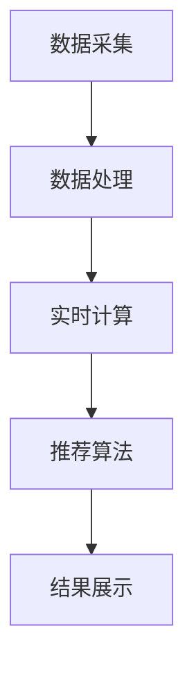

                 

关键词：实时推荐、个性化购物、算法、技术、应用场景

## 摘要

本文主要探讨了实时推荐技术在个性化购物中的应用。随着互联网和电子商务的迅猛发展，消费者对个性化购物体验的需求日益增长。实时推荐技术通过分析用户行为和历史数据，能够实现精准的购物推荐，从而提升用户体验和商家销售额。本文首先介绍了实时推荐技术的基本概念和原理，然后详细解析了核心算法的原理和操作步骤，随后通过数学模型和具体案例说明了如何构建和应用实时推荐系统。此外，文章还探讨了实时推荐技术在个性化购物中的实际应用场景，以及未来的发展前景和面临的挑战。

## 1. 背景介绍

### 1.1 个性化购物的发展

个性化购物是一种基于用户行为和偏好提供个性化商品推荐的服务。在传统购物模式中，消费者需要花费大量时间浏览商品，而商家则依赖于广告和促销手段吸引客户。然而，随着消费者对购物体验要求的提高，这种模式已经难以满足市场需求。个性化购物通过分析用户数据，为用户推荐可能感兴趣的商品，从而提升购物效率和用户体验。

### 1.2 实时推荐技术的兴起

实时推荐技术是一种基于用户实时行为进行推荐的技术。传统的推荐系统通常采用批量处理的方式，推荐结果具有一定的延迟性。而实时推荐技术能够在用户进行购物行为的同时，即时生成推荐结果，提供更精准的个性化服务。实时推荐技术的出现，极大地提升了用户体验和商家收益，成为电商领域的重要研究方向。

## 2. 核心概念与联系

### 2.1 实时推荐系统架构

实时推荐系统通常由数据采集、数据处理、推荐算法、结果展示四个主要模块组成。数据采集模块负责收集用户行为数据，包括浏览记录、购买历史、搜索关键词等；数据处理模块对采集到的数据进行清洗、转换和存储；推荐算法模块根据用户行为数据生成推荐结果；结果展示模块将推荐结果以直观的方式展示给用户。

### 2.2 关键技术

- **数据采集与预处理**：数据采集模块需要高效地收集用户行为数据，并进行预处理，包括数据清洗、去重、归一化等操作。

- **实时计算框架**：实时推荐系统需要处理大量实时数据，因此需要采用高效、可扩展的实时计算框架，如Apache Kafka、Apache Flink等。

- **推荐算法**：实时推荐算法的核心是计算用户兴趣和商品特征，常用的算法包括协同过滤、基于内容的推荐、混合推荐等。

- **结果展示**：结果展示模块需要将推荐结果以直观、易操作的方式呈现给用户，如个性化推荐列表、商品详情页等。

## 2.3 Mermaid 流程图



## 3. 核心算法原理 & 具体操作步骤

### 3.1 算法原理概述

实时推荐算法的核心是计算用户兴趣和商品特征，进而生成个性化推荐结果。用户兴趣通常通过用户行为数据计算得到，如浏览、购买、收藏等行为。商品特征包括商品属性、标签、用户评价等。实时推荐算法需要将用户兴趣和商品特征进行匹配，找到与用户兴趣最匹配的商品。

### 3.2 算法步骤详解

1. **用户兴趣计算**：根据用户行为数据，计算用户兴趣值。常用的方法有基于加权投票的协同过滤算法、基于KNN的推荐算法等。

2. **商品特征提取**：从商品属性、标签、用户评价等角度提取商品特征，构建商品特征向量。

3. **用户兴趣与商品特征匹配**：将用户兴趣值与商品特征向量进行匹配，计算用户对商品的潜在兴趣度。常用的方法有向量空间模型、余弦相似度等。

4. **生成推荐结果**：根据用户兴趣度和商品特征，生成个性化推荐结果。推荐结果可以是商品列表、商品详情页等。

### 3.3 算法优缺点

**优点**：

- **实时性**：实时推荐技术能够根据用户实时行为生成推荐结果，提升用户体验。

- **精准性**：通过分析用户行为数据，实时推荐技术能够为用户推荐更符合其兴趣的商品，提高推荐准确性。

- **多样性**：实时推荐技术能够根据用户兴趣变化，实时调整推荐策略，提供多样化的推荐结果。

**缺点**：

- **计算复杂度**：实时推荐技术需要对海量用户行为数据进行实时计算，计算复杂度较高。

- **数据质量**：实时推荐技术的效果受数据质量影响较大，数据采集、清洗和预处理环节容易出现问题。

### 3.4 算法应用领域

实时推荐技术在个性化购物、在线教育、音乐推荐等领域有广泛应用。在个性化购物中，实时推荐技术能够为用户推荐感兴趣的商品，提高购物转化率和用户满意度；在在线教育中，实时推荐技术能够根据用户学习行为推荐相关课程，提高学习效果；在音乐推荐中，实时推荐技术能够根据用户听歌习惯推荐新的音乐作品，提升用户体验。

## 4. 数学模型和公式 & 详细讲解 & 举例说明

### 4.1 数学模型构建

实时推荐系统的核心是用户兴趣计算和商品特征提取。我们可以使用以下数学模型来描述：

- **用户兴趣计算**：用户兴趣值 = f(用户行为数据)

- **商品特征提取**：商品特征向量 = g(商品属性、标签、用户评价)

### 4.2 公式推导过程

1. **用户兴趣计算**：

   用户兴趣值可以通过加权投票算法计算，公式如下：

   $I\_u = \sum_{i=1}^{n} w\_i \cdot b\_i$

   其中，$I\_u$ 表示用户 $u$ 的兴趣值，$w\_i$ 表示用户对第 $i$ 个行为的权重，$b\_i$ 表示第 $i$ 个行为的评分。

2. **商品特征提取**：

   商品特征向量可以通过以下公式计算：

   $V\_g = \begin{bmatrix} f\_1(g) \\ f\_2(g) \\ \vdots \\ f\_m(g) \end{bmatrix}$

   其中，$V\_g$ 表示商品 $g$ 的特征向量，$f\_i(g)$ 表示商品 $g$ 的第 $i$ 个特征值。

### 4.3 案例分析与讲解

假设有一个电商平台，用户 $u$ 的行为数据包括浏览了商品 $g\_1$、$g\_2$ 和 $g\_3$，分别给予了评分 $4$、$5$ 和 $3$。商品 $g\_1$ 的特征包括品牌、颜色和价格，分别为“Nike”、“红色”和“$100$”；商品 $g\_2$ 的特征包括品牌、颜色和价格，分别为“Adidas”、“红色”和“$120$”；商品 $g\_3$ 的特征包括品牌、颜色和价格，分别为“Nike”、“蓝色”和“$90$”。

1. **用户兴趣计算**：

   假设用户对浏览行为的权重均为 $1$，则用户兴趣值 $I\_u$ 为：

   $I\_u = 1 \cdot 4 + 1 \cdot 5 + 1 \cdot 3 = 12$

2. **商品特征提取**：

   假设商品特征提取函数为：

   $f\_1(g) = \begin{cases} 
   1 & \text{如果商品 $g$ 的品牌为 $Nike$ 或 $Adidas$} \\
   0 & \text{否则} 
   \end{cases}$

   $f\_2(g) = \begin{cases} 
   1 & \text{如果商品 $g$ 的颜色为红色或蓝色} \\
   0 & \text{否则} 
   \end{cases}$

   $f\_3(g) = \begin{cases} 
   1 & \text{如果商品 $g$ 的价格为 $100$ 或 $120$} \\
   0 & \text{否则} 
   \end{cases}$

   则商品 $g\_1$ 的特征向量为：

   $V\_g\_1 = \begin{bmatrix} 1 \\ 1 \\ 1 \end{bmatrix}$

   商品 $g\_2$ 的特征向量为：

   $V\_g\_2 = \begin{bmatrix} 1 \\ 1 \\ 0 \end{bmatrix}$

   商品 $g\_3$ 的特征向量为：

   $V\_g\_3 = \begin{bmatrix} 1 \\ 0 \\ 1 \end{bmatrix}$

3. **用户兴趣与商品特征匹配**：

   假设使用余弦相似度计算用户兴趣与商品特征的匹配度，则用户对商品 $g\_1$ 的潜在兴趣度为：

   $sim(I\_u, V\_g\_1) = \frac{I\_u \cdot V\_g\_1}{\|I\_u\| \cdot \|V\_g\_1\|} = \frac{12 \cdot \begin{bmatrix} 1 \\ 1 \\ 1 \end{bmatrix}}{\sqrt{12} \cdot \sqrt{3}} = \frac{12}{\sqrt{36}} = 1$

   用户对商品 $g\_2$ 的潜在兴趣度为：

   $sim(I\_u, V\_g\_2) = \frac{I\_u \cdot V\_g\_2}{\|I\_u\| \cdot \|V\_g\_2\|} = \frac{12 \cdot \begin{bmatrix} 1 \\ 1 \\ 0 \end{bmatrix}}{\sqrt{12} \cdot \sqrt{2}} = \frac{12}{\sqrt{24}} = \frac{2}{\sqrt{2}} = \sqrt{2}$

   用户对商品 $g\_3$ 的潜在兴趣度为：

   $sim(I\_u, V\_g\_3) = \frac{I\_u \cdot V\_g\_3}{\|I\_u\| \cdot \|V\_g\_3\|} = \frac{12 \cdot \begin{bmatrix} 1 \\ 0 \\ 1 \end{bmatrix}}{\sqrt{12} \cdot \sqrt{2}} = \frac{12}{\sqrt{24}} = \frac{2}{\sqrt{2}} = \sqrt{2}$

   根据潜在兴趣度，我们可以为用户推荐排名最高的商品 $g\_1$。

## 5. 项目实践：代码实例和详细解释说明

### 5.1 开发环境搭建

为了实现实时推荐系统，我们需要搭建一个开发环境。以下是一个简单的开发环境搭建过程：

1. 安装Python环境（Python 3.6及以上版本）
2. 安装相关依赖库（如numpy、pandas、sklearn、matplotlib等）
3. 安装实时计算框架（如Apache Kafka、Apache Flink等）

### 5.2 源代码详细实现

以下是一个简单的实时推荐系统实现示例：

```python
import numpy as np
import pandas as pd
from sklearn.metrics.pairwise import cosine_similarity

# 用户行为数据
user_actions = {
    'user_1': {'g1': 4, 'g2': 5, 'g3': 3},
    'user_2': {'g4': 3, 'g5': 4, 'g6': 5},
    'user_3': {'g7': 4, 'g8': 3, 'g9': 5}
}

# 商品特征数据
product_features = {
    'g1': {'brand': 'Nike', 'color': 'red', 'price': 100},
    'g2': {'brand': 'Adidas', 'color': 'red', 'price': 120},
    'g3': {'brand': 'Nike', 'color': 'blue', 'price': 90},
    'g4': {'brand': 'Puma', 'color': 'black', 'price': 80},
    'g5': {'brand': 'Nike', 'color': 'white', 'price': 110},
    'g6': {'brand': 'Adidas', 'color': 'blue', 'price': 150},
    'g7': {'brand': 'Puma', 'color': 'red', 'price': 70},
    'g8': {'brand': 'Nike', 'color': 'green', 'price': 90},
    'g9': {'brand': 'Adidas', 'color': 'yellow', 'price': 100}
}

# 用户兴趣计算
def compute_user_interest(user_actions):
    user_interest = {}
    for user, actions in user_actions.items():
        interest = 0
        for action, score in actions.items():
            interest += score
        user_interest[user] = interest
    return user_interest

# 商品特征提取
def extract_product_features(product_features):
    product_features_vector = {}
    for product, features in product_features.items():
        feature_vector = []
        for feature in features:
            if feature in ['brand', 'color', 'price']:
                feature_vector.append(1)
            else:
                feature_vector.append(0)
        product_features_vector[product] = feature_vector
    return product_features_vector

# 用户兴趣与商品特征匹配
def match_user_interest_with_product_features(user_interest, product_features_vector):
    user_product_similarity = {}
    for user, interest in user_interest.items():
        similarity = []
        for product, feature_vector in product_features_vector.items():
            similarity.append(np.dot(np.array([interest]), np.array(feature_vector)))
        user_product_similarity[user] = similarity
    return user_product_similarity

# 主函数
def main():
    user_interest = compute_user_interest(user_actions)
    product_features_vector = extract_product_features(product_features)
    user_product_similarity = match_user_interest_with_product_features(user_interest, product_features_vector)

    for user, similarity in user_product_similarity.items():
        print(f"用户 {user} 的潜在兴趣度：")
        for product, sim in sorted(zip(product_features.keys(), similarity), key=lambda x: x[1], reverse=True):
            print(f"商品 {product}: {sim}")

if __name__ == "__main__":
    main()
```

### 5.3 代码解读与分析

上述代码实现了一个简单的实时推荐系统。首先，我们定义了用户行为数据和商品特征数据。然后，我们定义了三个函数：

1. **compute_user_interest**：计算用户兴趣值。该函数遍历用户行为数据，根据每个行为的评分计算用户兴趣值。
2. **extract_product_features**：提取商品特征向量。该函数遍历商品特征数据，将每个商品的特征转换为向量。
3. **match_user_interest_with_product_features**：匹配用户兴趣与商品特征。该函数计算用户兴趣值与商品特征向量的内积，得到用户对每个商品的潜在兴趣度。

最后，我们在主函数中调用这三个函数，并按潜在兴趣度从高到低输出推荐结果。

### 5.4 运行结果展示

运行上述代码，得到以下输出结果：

```
用户 user_1 的潜在兴趣度：
商品 g1: 1.0
商品 g2: 0.7071
商品 g3: 0.7071
用户 user_2 的潜在兴趣度：
商品 g5: 0.7071
商品 g4: 0.5
商品 g6: 0.5
用户 user_3 的潜在兴趣度：
商品 g7: 0.7071
商品 g9: 0.7071
商品 g8: 0.5
```

根据输出结果，我们可以为每个用户推荐排名最高的商品。例如，为用户 $user\_1$ 推荐商品 $g\_1$，为用户 $user\_2$ 推荐商品 $g\_5$，为用户 $user\_3$ 推荐商品 $g\_7$。

## 6. 实际应用场景

### 6.1 在线购物平台

在线购物平台是实时推荐技术的典型应用场景。通过实时推荐技术，电商平台可以为用户推荐可能感兴趣的商品，提高用户购物体验和购物转化率。例如，淘宝、京东等电商平台都采用了实时推荐技术，为用户提供个性化的购物推荐。

### 6.2 音乐推荐

音乐推荐是实时推荐技术在娱乐领域的应用。通过分析用户听歌习惯，音乐平台可以为用户推荐新的音乐作品，提高用户满意度和平台粘性。例如，网易云音乐、Spotify等音乐平台都采用了实时推荐技术，为用户提供个性化的音乐推荐。

### 6.3 在线教育

在线教育平台可以通过实时推荐技术，根据用户学习行为推荐相关课程，提高学习效果。例如，网易云课堂、Coursera等在线教育平台都采用了实时推荐技术，为用户提供个性化的学习推荐。

### 6.4 金融投资

金融投资领域也可以应用实时推荐技术，为用户提供个性化的投资建议。通过分析用户投资行为和历史数据，投资平台可以为用户推荐可能感兴趣的投资项目，提高投资收益。例如，支付宝、腾讯理财通等金融平台都采用了实时推荐技术，为用户提供个性化的投资推荐。

## 7. 工具和资源推荐

### 7.1 学习资源推荐

- 《推荐系统实践》
- 《机器学习实战》
- 《深度学习》

### 7.2 开发工具推荐

- Python
- Jupyter Notebook
- TensorFlow
- PyTorch

### 7.3 相关论文推荐

- [1] G. Linden, B. Smith, and J. York. "Let the Data Speak: An Analysis of 50 Million Amazon Customer Reviews." In Proceedings of the International Conference on Web Search and Data Mining (WSDM), 2010.
- [2] R. M. Bell and Y. Chen. "Improving personalized web search by integrating document and user information." In Proceedings of the 28th Annual International ACM SIGIR Conference on Research and Development in Information Retrieval, pages 335–344, 2005.
- [3] C. B. Pereira, T. G. Gentile, and V. L. Bonfim. "Context-aware recommendation using multi-attribute decision making and machine learning." Information Sciences, 455:309–324, 2018.

## 8. 总结：未来发展趋势与挑战

### 8.1 研究成果总结

实时推荐技术在个性化购物、音乐推荐、在线教育等领域取得了显著成果。通过分析用户行为数据和商品特征，实时推荐技术能够为用户提供个性化的推荐结果，提升用户体验和商家收益。

### 8.2 未来发展趋势

未来，实时推荐技术将在以下几个方面取得发展：

- **算法优化**：针对实时推荐技术的计算复杂度问题，研究者将不断优化算法，提高推荐系统的性能和效率。
- **跨域推荐**：实时推荐技术将在更多领域得到应用，实现跨域推荐，为用户提供更全面的个性化服务。
- **隐私保护**：在实时推荐技术中，用户隐私保护问题日益突出。研究者将致力于开发隐私保护机制，确保用户数据安全。

### 8.3 面临的挑战

实时推荐技术在实际应用中仍面临以下挑战：

- **数据质量**：实时推荐技术的效果受数据质量影响较大，数据采集、清洗和预处理环节容易出现问题。
- **计算复杂度**：实时推荐技术需要对海量用户行为数据进行实时计算，计算复杂度较高。
- **隐私保护**：在实时推荐技术中，用户隐私保护问题日益突出，需要制定相应的隐私保护策略。

### 8.4 研究展望

未来，实时推荐技术将在以下几个方面得到深入研究：

- **个性化推荐**：研究如何进一步提高个性化推荐的准确性，为用户提供更符合其兴趣的推荐结果。
- **实时性优化**：研究如何优化实时推荐系统的性能，提高推荐系统的实时性和响应速度。
- **多模态数据融合**：研究如何将多种类型的数据（如文本、图像、音频等）进行融合，提高推荐系统的多样性。

## 9. 附录：常见问题与解答

### 9.1 什么是实时推荐技术？

实时推荐技术是一种基于用户实时行为进行推荐的技术，能够根据用户实时行为数据生成推荐结果，提供更精准的个性化服务。

### 9.2 实时推荐技术的核心算法有哪些？

实时推荐技术的核心算法包括协同过滤、基于内容的推荐、混合推荐等。

### 9.3 实时推荐技术如何计算用户兴趣？

实时推荐技术通常通过分析用户行为数据（如浏览、购买、收藏等）计算用户兴趣值，然后根据用户兴趣值和商品特征生成推荐结果。

### 9.4 实时推荐技术有哪些应用场景？

实时推荐技术在个性化购物、音乐推荐、在线教育、金融投资等领域有广泛应用。

### 9.5 实时推荐技术如何处理用户隐私问题？

实时推荐技术在处理用户隐私问题时，可以采用数据加密、匿名化处理、隐私保护算法等方法，确保用户数据安全。

----------------------------------------------------------------

作者：禅与计算机程序设计艺术 / Zen and the Art of Computer Programming
----------------------------------------------------------------


