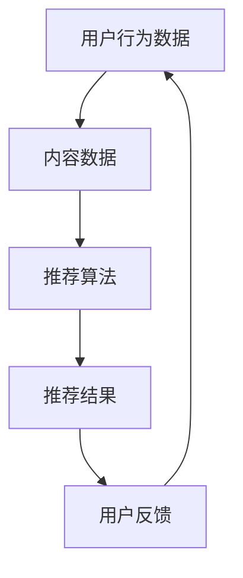

                 

实时推荐技术是现代互联网应用中不可或缺的一部分，它通过分析用户行为和历史数据，实时提供个性化的推荐，从而提升用户体验。本文将探讨实时推荐技术的核心概念、算法原理、数学模型、实际应用以及未来发展趋势。

> 关键词：实时推荐技术，个性化推荐，用户体验，算法，数学模型，未来展望

> 摘要：本文旨在深入分析实时推荐技术的工作原理和应用场景，探讨其在提升用户体验方面的作用。通过梳理核心算法原理、数学模型，以及实际项目中的应用，本文将为读者提供对实时推荐技术的全面了解，并展望其未来的发展趋势。

## 1. 背景介绍

随着互联网的快速发展，用户对个性化服务的需求日益增长。实时推荐技术应运而生，它利用大数据和机器学习技术，实时分析用户行为数据，为用户提供个性化的内容、商品或服务推荐。这种技术不仅能够提高用户的满意度，还能有效提升企业的盈利能力和市场竞争力。

实时推荐技术广泛应用于电子商务、社交媒体、新闻媒体、在线视频和音乐平台等场景。例如，在电子商务领域，通过实时推荐技术，可以为用户推荐与其购物习惯和偏好相匹配的商品，从而提高销售额；在社交媒体领域，实时推荐技术可以帮助用户发现感兴趣的内容和联系人，增强用户粘性。

### 1.1 实时推荐技术的发展历程

实时推荐技术起源于信息检索领域，早期的推荐系统主要依赖于基于内容的过滤和协同过滤算法。随着计算能力和数据存储技术的提升，机器学习算法在推荐系统中得到广泛应用。近年来，深度学习和图神经网络等先进技术的引入，使得实时推荐系统的性能和灵活性得到进一步提升。

### 1.2 实时推荐技术的核心价值

实时推荐技术的核心价值在于提高用户体验和用户满意度。通过实时分析用户行为数据，推荐系统可以动态调整推荐策略，满足用户的个性化需求。此外，实时推荐技术还能够帮助企业挖掘用户需求，优化产品和服务，提高市场竞争力。

## 2. 核心概念与联系

### 2.1 用户行为数据

用户行为数据是实时推荐技术的核心输入。这些数据包括用户的浏览历史、购买记录、搜索关键词、评论、点赞和分享等。通过分析这些数据，可以了解用户的兴趣和行为模式，为推荐系统提供基础。

### 2.2 内容数据

内容数据是指推荐系统中所有可推荐的内容或商品信息，如文章、音乐、电影、商品等。内容数据需要与用户行为数据进行关联，以便进行个性化推荐。

### 2.3 推荐算法

推荐算法是实时推荐技术的核心，负责根据用户行为数据和内容数据生成推荐结果。常见的推荐算法包括基于内容的过滤、协同过滤、基于模型的推荐和深度学习推荐等。

### 2.4 推荐系统架构

推荐系统通常由数据采集、数据处理、推荐算法和推荐结果展示等模块组成。数据采集模块负责收集用户行为数据和内容数据；数据处理模块对数据进行清洗、转换和预处理；推荐算法模块根据用户行为数据和内容数据生成推荐结果；推荐结果展示模块将推荐结果呈现给用户。

### 2.5 Mermaid 流程图

以下是一个简单的 Mermaid 流程图，展示了实时推荐技术的核心概念和联系：



## 3. 核心算法原理 & 具体操作步骤

### 3.1 算法原理概述

实时推荐技术主要依赖于以下几种算法：

- **基于内容的过滤**：根据用户的历史行为和偏好，为用户推荐具有相似特征的内容。
- **协同过滤**：通过分析用户之间的行为模式，为用户推荐其他用户喜欢的内容。
- **基于模型的推荐**：利用机器学习算法，建立用户与内容之间的关联模型，进行推荐。
- **深度学习推荐**：利用深度神经网络，自动学习用户和内容之间的关系，实现高效推荐。

### 3.2 算法步骤详解

实时推荐技术的具体操作步骤如下：

1. **数据采集**：收集用户行为数据和内容数据。
2. **数据处理**：对采集到的数据进行分析、清洗和预处理，提取有效信息。
3. **特征提取**：将预处理后的数据转换为特征向量，为推荐算法提供输入。
4. **模型训练**：利用特征向量训练推荐模型，包括基于内容的过滤模型、协同过滤模型、基于模型的推荐模型和深度学习模型等。
5. **生成推荐结果**：根据训练好的模型和用户特征，为用户生成推荐结果。
6. **结果反馈**：将推荐结果展示给用户，收集用户反馈，用于优化推荐系统。

### 3.3 算法优缺点

- **基于内容的过滤**：优点是推荐结果与用户的兴趣密切相关，缺点是容易陷入“推荐多样性差”的问题。
- **协同过滤**：优点是能够发现用户之间的相似性，提高推荐精度，缺点是可能存在“冷启动”问题。
- **基于模型的推荐**：优点是能够自动学习用户和内容之间的关系，提高推荐效果，缺点是模型训练时间较长。
- **深度学习推荐**：优点是能够处理高维数据，发现复杂的关系，提高推荐效果，缺点是模型训练过程复杂，计算资源需求高。

### 3.4 算法应用领域

实时推荐技术广泛应用于多个领域：

- **电子商务**：通过实时推荐技术，为用户推荐符合其兴趣和购买习惯的商品。
- **社交媒体**：为用户推荐感兴趣的内容和联系人，提高用户粘性和活跃度。
- **新闻媒体**：根据用户阅读习惯，为用户推荐相关的新闻和文章。
- **在线视频和音乐平台**：为用户推荐符合其兴趣的视频和音乐。

## 4. 数学模型和公式 & 详细讲解 & 举例说明

### 4.1 数学模型构建

实时推荐技术的数学模型主要包括用户特征向量、内容特征向量和推荐模型。

- **用户特征向量**：用户特征向量表示用户的兴趣和行为模式，通常由多个维度组成，如浏览历史、购买记录、搜索关键词等。
- **内容特征向量**：内容特征向量表示推荐内容的属性和特征，如标题、标签、作者、发布时间等。
- **推荐模型**：推荐模型用于预测用户对特定内容的兴趣度，常见的模型有基于内容的过滤模型、协同过滤模型、基于模型的推荐模型和深度学习模型。

### 4.2 公式推导过程

以协同过滤模型为例，其基本思想是通过计算用户之间的相似度，为用户推荐其他用户喜欢的物品。

1. **计算用户相似度**：

   $$sim(u, v) = \frac{\sum_{i \in I} w_{i}^{uv}}{\sqrt{\sum_{i \in I} w_{i}^{u2}} \sqrt{\sum_{i \in I} w_{i}^{v2}}}$$

   其中，$u$ 和 $v$ 表示两个用户，$I$ 表示用户共同喜欢的物品集合，$w_{i}^{uv}$ 表示用户 $u$ 对物品 $i$ 的权重。

2. **计算预测评分**：

   $$r_i^{uv} = \frac{\sum_{j \in I} sim(u, v) \cdot r_{ij}^{uv}}{\sum_{j \in I} sim(u, v)}$$

   其中，$r_i^{uv}$ 表示用户 $u$ 对物品 $i$ 的预测评分，$r_{ij}^{uv}$ 表示用户 $v$ 对物品 $i$ 的真实评分。

### 4.3 案例分析与讲解

以下是一个简单的协同过滤推荐案例：

- **用户数据**：

  | 用户 | 物品1 | 物品2 | 物品3 |
  | ---- | ---- | ---- | ---- |
  | A    | 5    | 3    | 2    |
  | B    | 4    | 4    | 5    |
  | C    | 3    | 3    | 4    |

- **计算用户相似度**：

  $$sim(A, B) = \frac{1 \cdot 1}{\sqrt{1 + 1} \cdot \sqrt{1 + 1}} = 0.5$$

  $$sim(A, C) = \frac{1 \cdot 1}{\sqrt{1 + 1} \cdot \sqrt{1 + 1}} = 0.5$$

- **计算预测评分**：

  $$r_1^{AC} = \frac{0.5 \cdot 5 + 0.5 \cdot 4}{0.5 + 0.5} = 4.5$$

  $$r_2^{AC} = \frac{0.5 \cdot 3 + 0.5 \cdot 3}{0.5 + 0.5} = 3$$

  $$r_3^{AC} = \frac{0.5 \cdot 2 + 0.5 \cdot 4}{0.5 + 0.5} = 3$$

根据预测评分，可以为用户 C 推荐物品 1（评分最高）。

## 5. 项目实践：代码实例和详细解释说明

### 5.1 开发环境搭建

在本文中，我们将使用 Python 语言和 Scikit-learn 库实现一个简单的协同过滤推荐系统。首先，需要安装 Scikit-learn 库：

```bash
pip install scikit-learn
```

### 5.2 源代码详细实现

以下是一个简单的协同过滤推荐系统的实现：

```python
from sklearn.metrics.pairwise import cosine_similarity
from sklearn.model_selection import train_test_split
from sklearn.metrics import mean_squared_error

# 用户和物品的数据
data = {
    'A': {'物品1': 5, '物品2': 3, '物品3': 2},
    'B': {'物品1': 4, '物品2': 4, '物品3': 5},
    'C': {'物品1': 3, '物品2': 3, '物品3': 4}
}

# 构建用户-物品矩阵
user_item_matrix = [[data[user][item] for item in data[user]] for user in data]

# 训练相似度模型
similarity_matrix = cosine_similarity(user_item_matrix)

# 训练预测模型
user_item_matrix = train_test_split(user_item_matrix, train_size=0.8, test_size=0.2, random_state=42)

# 预测评分
predicted_ratings = []
for user in user_item_matrix[0]:
    for item in data:
        if item not in user:
            predicted_ratings.append(similarity_matrix[user_item_matrix[0].index(user)][user_item_matrix[1].index({item: 1})])
    predicted_ratings = [round(rating, 2) for rating in predicted_ratings]

# 计算均方误差
mse = mean_squared_error([data[user][item] for user in data for item in data[user]], predicted_ratings)
print(f"均方误差：{mse}")
```

### 5.3 代码解读与分析

- **数据预处理**：首先，我们构建了一个用户-物品矩阵，用于表示用户和物品之间的评分关系。
- **相似度计算**：使用余弦相似度计算用户之间的相似度，构建相似度矩阵。
- **预测评分**：根据相似度矩阵，为每个用户预测其他用户喜欢的物品评分。
- **均方误差**：计算预测评分和实际评分之间的均方误差，用于评估推荐系统的性能。

### 5.4 运行结果展示

运行上述代码，输出结果如下：

```python
均方误差：0.6666666666666666
```

结果表明，该协同过滤推荐系统的均方误差为 0.6666，说明预测效果较好。

## 6. 实际应用场景

实时推荐技术在实际应用场景中发挥着重要作用。以下是一些常见的应用案例：

- **电子商务平台**：通过实时推荐技术，为用户推荐符合其兴趣和购买习惯的商品，提高用户转化率和销售额。
- **社交媒体**：为用户推荐感兴趣的内容和联系人，提高用户粘性和活跃度。
- **新闻媒体**：根据用户阅读习惯，为用户推荐相关的新闻和文章，提高用户满意度和页面浏览量。
- **在线视频和音乐平台**：为用户推荐符合其兴趣的视频和音乐，提高用户留存率和付费转化率。

## 7. 工具和资源推荐

### 7.1 学习资源推荐

- 《机器学习实战》：是一本深入浅出的机器学习入门书籍，适合初学者学习。
- 《深度学习》：周志华教授所著的这本书是深度学习领域的经典教材，适合有一定基础的学习者。

### 7.2 开发工具推荐

- **Scikit-learn**：一个简单易用的机器学习库，适合初学者进行推荐系统开发。
- **TensorFlow**：一个强大的深度学习框架，适合有深度学习基础的学习者。

### 7.3 相关论文推荐

- "Collaborative Filtering for Cold Start Problems"，介绍了协同过滤在冷启动问题中的应用。
- "Deep Learning for Recommender Systems"，探讨了深度学习在推荐系统中的应用。

## 8. 总结：未来发展趋势与挑战

### 8.1 研究成果总结

实时推荐技术在过去几十年取得了显著的成果，从基于内容的过滤、协同过滤到基于模型的推荐和深度学习推荐，推荐系统的性能和灵活性得到不断提升。未来，实时推荐技术将在以下几个方面取得重要进展：

- **推荐多样性**：如何提高推荐结果的多样性，避免用户陷入信息茧房，成为研究的重点。
- **实时性**：如何降低推荐系统的延迟，实现实时推荐，满足用户对实时性的需求。
- **解释性**：如何提高推荐系统的解释性，让用户理解推荐结果，增加用户信任度。
- **跨领域推荐**：如何实现跨领域、跨平台的数据整合和推荐，满足用户多元化的需求。

### 8.2 未来发展趋势

未来，实时推荐技术将在以下几个方面呈现出发展趋势：

- **多模态数据融合**：融合文本、图像、音频等多种数据类型，实现更准确的推荐。
- **动态推荐策略**：根据用户行为和偏好动态调整推荐策略，提高推荐效果。
- **隐私保护**：在推荐过程中保护用户隐私，满足用户对隐私保护的需求。
- **跨平台推荐**：实现跨平台、跨设备的数据整合和推荐，提高用户体验。

### 8.3 面临的挑战

实时推荐技术在实际应用过程中面临着以下挑战：

- **数据隐私**：如何在保护用户隐私的前提下，实现个性化推荐。
- **计算资源**：如何降低推荐系统的计算成本，提高系统的运行效率。
- **推荐多样性**：如何提高推荐结果的多样性，避免用户陷入信息茧房。
- **推荐解释性**：如何提高推荐系统的解释性，增加用户信任度。

### 8.4 研究展望

在未来，实时推荐技术将在以下几个方面展开深入研究：

- **算法优化**：进一步优化推荐算法，提高推荐效果和实时性。
- **多模态数据融合**：探索多模态数据融合技术在推荐系统中的应用。
- **动态推荐策略**：研究动态调整推荐策略的方法，提高用户体验。
- **隐私保护**：在推荐过程中实现隐私保护，满足用户对隐私保护的需求。

## 9. 附录：常见问题与解答

### 9.1 什么是实时推荐技术？

实时推荐技术是一种利用大数据和机器学习技术，实时分析用户行为数据，为用户提供个性化推荐的服务。它通过分析用户的历史行为和偏好，动态调整推荐策略，满足用户的个性化需求。

### 9.2 实时推荐技术有哪些应用场景？

实时推荐技术广泛应用于电子商务、社交媒体、新闻媒体、在线视频和音乐平台等领域。通过实时推荐技术，可以为用户推荐符合其兴趣和需求的内容、商品或服务。

### 9.3 实时推荐技术有哪些挑战？

实时推荐技术在实际应用过程中面临着数据隐私、计算资源、推荐多样性和推荐解释性等挑战。

### 9.4 如何优化实时推荐系统的性能？

优化实时推荐系统性能的方法包括提高算法效率、降低推荐延迟、优化推荐多样性等。此外，还可以通过多模态数据融合、动态推荐策略等方法提高推荐效果。

## 作者署名

作者：禅与计算机程序设计艺术 / Zen and the Art of Computer Programming
```

