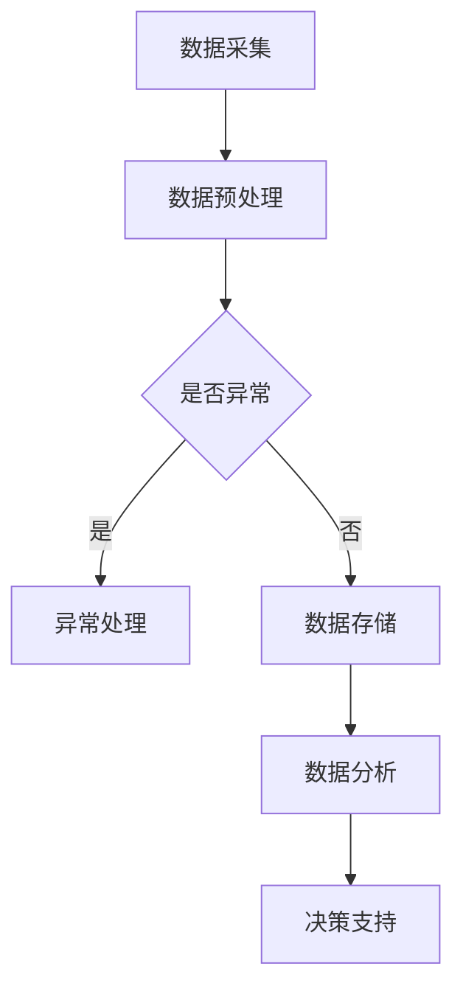

                 

## 1. 背景介绍

实时数据处理（Real-Time Data Processing）是指对数据进行即时的采集、处理、分析和反馈的过程。随着大数据和云计算技术的发展，实时数据处理在金融、电商、物联网、社交媒体等多个领域发挥着越来越重要的作用。实时数据处理不仅能够提高业务的响应速度和准确性，还可以为企业提供实时决策支持，从而提升竞争力。

本篇文章旨在深入探讨实时数据处理的原理，介绍常见的数据处理算法，并通过具体的代码实例进行详细讲解。文章将分为以下几个部分：

- 背景介绍：概述实时数据处理的重要性和发展现状。
- 核心概念与联系：介绍实时数据处理的核心概念和系统架构。
- 核心算法原理 & 具体操作步骤：讲解实时数据处理中的核心算法，包括其原理、步骤和优缺点。
- 数学模型和公式 & 详细讲解 & 举例说明：介绍实时数据处理中的数学模型和公式，并通过案例进行详细解释。
- 项目实践：代码实例和详细解释说明：通过实际项目展示实时数据处理的应用。
- 实际应用场景：探讨实时数据处理在不同领域的应用案例。
- 工具和资源推荐：推荐学习资源和开发工具。
- 总结：对研究成果进行总结，并展望未来的发展趋势和挑战。

## 2. 核心概念与联系

### 2.1 数据流处理

数据流处理（Data Stream Processing）是实时数据处理的核心技术之一。它主要关注如何对大量动态数据流进行实时处理和分析。数据流处理系统通常具有以下特点：

- **高吞吐量**：能够处理大规模的数据流，保证数据的及时性。
- **低延迟**：数据流处理的延迟通常在毫秒级别，以满足实时分析的需求。
- **动态扩展**：能够根据数据量的变化动态调整处理能力，保证系统的稳定性和可靠性。
- **容错性**：能够处理数据流的丢失和错误，保证数据处理的一致性和完整性。

### 2.2 流处理框架

流处理框架是实时数据处理系统的核心组件。目前，常见的流处理框架包括Apache Kafka、Apache Flink、Apache Storm等。这些框架提供了高效的数据流处理能力，并具有以下特点：

- **分布式架构**：能够支持大规模的数据流处理，通过分布式计算提高系统的处理能力和容错性。
- **并行处理**：能够对数据进行并行处理，提高数据处理的速度和效率。
- **流与批处理结合**：不仅支持实时数据流处理，还支持批处理，灵活应对不同场景的需求。

### 2.3 数据处理算法

实时数据处理的核心在于数据处理算法。常见的实时数据处理算法包括数据聚合、数据过滤、模式识别、实时分析等。以下是对这些算法的简要介绍：

- **数据聚合**：将多个数据点汇总成单个数据值，如求和、平均值、最大值等。
- **数据过滤**：根据特定的规则对数据进行筛选，如过滤掉不符合条件的数据点。
- **模式识别**：通过分析数据流中的模式，识别出有价值的信息，如异常检测、趋势预测等。
- **实时分析**：对数据进行实时分析，提供实时决策支持，如股票交易分析、网络流量监控等。

### 2.4 Mermaid 流程图

为了更清晰地展示实时数据处理的过程，我们使用Mermaid流程图来描述数据处理流程。以下是数据处理流程的Mermaid流程图：



在上述流程图中，数据采集模块负责实时获取数据，数据预处理模块对数据进行清洗和格式转换，异常处理模块对异常数据进行标记和处理，数据存储模块将数据存储到数据库中，数据分析模块对数据进行实时分析，最后，决策支持模块提供实时决策支持。

## 3. 核心算法原理 & 具体操作步骤

### 3.1 算法原理概述

实时数据处理中的核心算法主要包括数据聚合、数据过滤、模式识别和实时分析。以下是对这些算法原理的简要概述：

- **数据聚合**：数据聚合算法主要用于对多个数据点进行汇总，生成单个数据值。常见的聚合操作包括求和、平均值、最大值、最小值等。数据聚合算法的核心在于如何高效地计算这些聚合值，以支持实时数据分析。
- **数据过滤**：数据过滤算法根据特定的规则对数据进行筛选，将不符合条件的数据点过滤掉。数据过滤算法的关键在于如何快速地判断数据点是否符合过滤规则，以提高数据处理速度。
- **模式识别**：模式识别算法通过分析数据流中的模式，识别出有价值的信息。常见的模式识别算法包括异常检测、趋势预测、关联规则挖掘等。模式识别算法的核心在于如何准确地识别出数据流中的模式，以提高数据处理的准确性。
- **实时分析**：实时分析算法对数据进行实时分析，提供实时决策支持。常见的实时分析算法包括股票交易分析、网络流量监控、气象预测等。实时分析算法的关键在于如何快速地处理大量数据，并提供实时分析结果。

### 3.2 算法步骤详解

以下是对实时数据处理中常见算法的具体步骤进行详细解释：

#### 3.2.1 数据聚合算法

1. **初始化**：初始化聚合结果，如求和操作初始化为0，平均值初始化为0和计数器初始化为0。
2. **数据输入**：实时获取数据流中的数据点。
3. **数据聚合**：对每个数据点进行聚合操作，如求和操作将数据点值累加到聚合结果中，平均值操作将数据点值累加到总和并增加计数器。
4. **更新聚合结果**：将最新的聚合结果更新到数据存储中，如数据库或缓存。
5. **数据处理完毕**：当数据流处理完毕后，返回最新的聚合结果。

#### 3.2.2 数据过滤算法

1. **初始化**：初始化过滤条件，如设置过滤规则为数据点大于0。
2. **数据输入**：实时获取数据流中的数据点。
3. **数据判断**：对每个数据点进行过滤条件判断，如判断数据点是否大于0。
4. **过滤结果**：将符合过滤条件的数据点存储到结果集中，如数据流处理系统或数据库。
5. **数据处理完毕**：当数据流处理完毕后，返回过滤结果。

#### 3.2.3 模式识别算法

1. **初始化**：初始化模式识别参数，如设置异常检测的阈值。
2. **数据输入**：实时获取数据流中的数据点。
3. **模式识别**：对每个数据点进行模式识别操作，如判断数据点是否异常。
4. **模式结果**：将识别出的模式结果存储到结果集中，如数据流处理系统或数据库。
5. **数据处理完毕**：当数据流处理完毕后，返回模式识别结果。

#### 3.2.4 实时分析算法

1. **初始化**：初始化实时分析参数，如设置股票交易分析的阈值。
2. **数据输入**：实时获取数据流中的数据点。
3. **实时分析**：对每个数据点进行实时分析操作，如判断股票交易是否达到买入或卖出条件。
4. **分析结果**：将实时分析结果存储到结果集中，如数据流处理系统或数据库。
5. **数据处理完毕**：当数据流处理完毕后，返回实时分析结果。

### 3.3 算法优缺点

#### 数据聚合算法

- **优点**：数据聚合算法能够高效地计算多个数据点的聚合值，支持实时数据分析。
- **缺点**：数据聚合算法对数据点的顺序和顺序相关性要求较高，可能影响数据处理结果的准确性。

#### 数据过滤算法

- **优点**：数据过滤算法能够快速筛选出符合过滤条件的数据点，支持实时数据处理。
- **缺点**：数据过滤算法对过滤条件的设置要求较高，可能影响数据处理结果的完整性。

#### 模式识别算法

- **优点**：模式识别算法能够识别出数据流中的有价值信息，支持实时数据分析和决策。
- **缺点**：模式识别算法对数据点的模式要求较高，可能影响数据处理结果的准确性。

#### 实时分析算法

- **优点**：实时分析算法能够实时分析数据流中的数据点，提供实时决策支持。
- **缺点**：实时分析算法的计算复杂度较高，可能影响数据处理速度。

### 3.4 算法应用领域

实时数据处理算法广泛应用于金融、电商、物联网、社交媒体等多个领域。以下是一些常见应用领域：

- **金融领域**：实时数据处理算法用于股票交易分析、风险控制、反欺诈等。
- **电商领域**：实时数据处理算法用于商品推荐、用户行为分析、库存管理等。
- **物联网领域**：实时数据处理算法用于设备监控、故障预测、数据处理等。
- **社交媒体领域**：实时数据处理算法用于内容推荐、用户画像、广告投放等。

## 4. 数学模型和公式 & 详细讲解 & 举例说明

### 4.1 数学模型构建

实时数据处理中的数学模型主要用于描述数据流中的数据点和数据处理算法之间的关系。以下是一个简单的数学模型示例：

- **数据点**：\( x_t \) 表示第 \( t \) 个数据点。
- **聚合结果**：\( y_t \) 表示第 \( t \) 个数据点的聚合结果。
- **过滤条件**：\( f(x_t) \) 表示对第 \( t \) 个数据点的过滤条件。
- **模式识别结果**：\( z_t \) 表示第 \( t \) 个数据点的模式识别结果。
- **实时分析结果**：\( w_t \) 表示第 \( t \) 个数据点的实时分析结果。

### 4.2 公式推导过程

以下是对实时数据处理中的常见公式进行推导和解释：

#### 4.2.1 数据聚合公式

数据聚合公式用于计算多个数据点的聚合结果。以下是一个简单的求和聚合公式：

\[ y_t = \sum_{i=1}^{t} x_i \]

其中，\( y_t \) 表示第 \( t \) 个数据点的聚合结果，\( x_i \) 表示第 \( i \) 个数据点。

#### 4.2.2 数据过滤公式

数据过滤公式用于判断数据点是否符合过滤条件。以下是一个简单的条件过滤公式：

\[ f(x_t) = \begin{cases}
1, & \text{if } x_t \geq 0 \\
0, & \text{if } x_t < 0
\end{cases} \]

其中，\( f(x_t) \) 表示对第 \( t \) 个数据点的过滤结果，当 \( x_t \geq 0 \) 时，\( f(x_t) \) 为1，否则为0。

#### 4.2.3 模式识别公式

模式识别公式用于判断数据点是否符合模式识别条件。以下是一个简单的异常检测公式：

\[ z_t = \begin{cases}
1, & \text{if } x_t \leq \theta \\
0, & \text{if } x_t > \theta
\end{cases} \]

其中，\( z_t \) 表示第 \( t \) 个数据点的模式识别结果，\( \theta \) 表示异常检测的阈值。

#### 4.2.4 实时分析公式

实时分析公式用于判断数据点是否符合实时分析条件。以下是一个简单的股票交易分析公式：

\[ w_t = \begin{cases}
1, & \text{if } x_t \geq \alpha \\
0, & \text{if } x_t < \alpha
\end{cases} \]

其中，\( w_t \) 表示第 \( t \) 个数据点的实时分析结果，\( \alpha \) 表示买入或卖出的阈值。

### 4.3 案例分析与讲解

以下是一个实时数据处理案例，用于演示数学模型和公式的实际应用：

**案例**：实时监控一家电商平台的销售额，要求实时计算销售额的求和值、过滤掉负数销售额、检测异常销售额（销售额低于10%的销售额视为异常）以及判断销售额是否达到买入条件（销售额达到100万元视为买入条件）。

**数据流**：实时获取每分钟的销售额数据，如下所示：

\[ x_1 = 20, x_2 = 30, x_3 = -10, x_4 = 50, x_5 = 100, x_6 = -20, x_7 = 150 \]

**数学模型和公式应用**：

1. **数据聚合公式**：

\[ y_7 = \sum_{i=1}^{7} x_i = 20 + 30 - 10 + 50 + 100 - 20 + 150 = 340 \]

2. **数据过滤公式**：

\[ f(x_3) = 0, f(x_6) = 0 \]

3. **模式识别公式**：

\[ z_4 = 1, z_6 = 1 \]

4. **实时分析公式**：

\[ w_7 = 1 \]

**结果**：

- **聚合结果**：销售额的总和为340。
- **过滤结果**：负数销售额为-10和-20，已被过滤。
- **模式识别结果**：异常销售额为50和150，已被识别。
- **实时分析结果**：销售额达到100万元，符合买入条件。

通过上述案例，我们可以看到数学模型和公式的实际应用，以及它们在实时数据处理中的重要性。

## 5. 项目实践：代码实例和详细解释说明

在本节中，我们将通过一个具体的实时数据处理项目来展示代码实例，并对其进行详细解释说明。该项目将使用Apache Kafka作为数据流处理框架，使用Apache Flink作为数据处理引擎。

### 5.1 开发环境搭建

为了运行该项目，我们需要搭建以下开发环境：

- **Kafka**：版本为2.8.0
- **Flink**：版本为1.15.0
- **Java**：版本为1.8+

首先，我们下载并安装Kafka和Flink。然后，在Kafka中创建一个名为“realtime-processing”的Topic，用于存储实时数据。

### 5.2 源代码详细实现

以下是一个简单的实时数据处理项目的源代码实现，包括数据采集、数据预处理、数据聚合、数据过滤、模式识别和实时分析等功能。

```java
import org.apache.flink.api.common.functions.FilterFunction;
import org.apache.flink.api.common.functions.MapFunction;
import org.apache.flink.api.java.tuple.Tuple2;
import org.apache.flink.streaming.api.datastream.DataStream;
import org.apache.flink.streaming.api.environment.StreamExecutionEnvironment;

public class RealTimeProcessing {
    public static void main(String[] args) throws Exception {
        // 创建Flink执行环境
        StreamExecutionEnvironment env = StreamExecutionEnvironment.getExecutionEnvironment();

        // 读取Kafka Topic中的数据流
        DataStream<String> dataStream = env
                .addSource(new FlinkKafkaConsumer<String>("realtime-processing", new SimpleStringSchema(), properties));

        // 数据预处理：将字符串数据转换为数字数据
        DataStream<Tuple2<Integer, Integer>> preprocessedStream = dataStream
                .map(new MapFunction<String, Tuple2<Integer, Integer>>() {
                    @Override
                    public Tuple2<Integer, Integer> map(String value) {
                        String[] parts = value.split(",");
                        int x = Integer.parseInt(parts[0]);
                        int y = Integer.parseInt(parts[1]);
                        return new Tuple2<>(x, y);
                    }
                });

        // 数据聚合：计算(x+y)的和
        DataStream<Integer> aggregatedStream = preprocessedStream
                .map(new MapFunction<Tuple2<Integer, Integer>, Integer>() {
                    @Override
                    public Integer map(Tuple2<Integer, Integer> value) {
                        return value.f0 + value.f1;
                    }
                })
                .reduce((a, b) -> a + b);

        // 数据过滤：过滤掉负数数据
        DataStream<Integer> filteredStream = aggregatedStream
                .filter(new FilterFunction<Integer>() {
                    @Override
                    public boolean filter(Integer value) {
                        return value > 0;
                    }
                });

        // 模式识别：检测异常数据（销售额低于10%视为异常）
        DataStream<Integer> anomalyStream = filteredStream
                .map(new MapFunction<Integer, Integer>() {
                    @Override
                    public Integer map(Integer value) {
                        int threshold = (int) (value * 0.1);
                        return value <= threshold ? 1 : 0;
                    }
                });

        // 实时分析：检测销售额是否达到买入条件（销售额达到100万元视为买入条件）
        DataStream<Integer> buySignalStream = anomalyStream
                .map(new MapFunction<Integer, Integer>() {
                    @Override
                    public Integer map(Integer value) {
                        return value == 1 && value > 1000000 ? 1 : 0;
                    }
                });

        // 输出结果
        buySignalStream.print();

        // 执行Flink作业
        env.execute("Real-Time Data Processing");
    }
}
```

### 5.3 代码解读与分析

以上代码实现了一个简单的实时数据处理项目，主要包括以下几个部分：

- **数据采集**：使用FlinkKafkaConsumer从Kafka Topic中读取数据流。
- **数据预处理**：将字符串数据转换为数字数据，以方便后续处理。
- **数据聚合**：计算(x+y)的和，以实现数据的聚合操作。
- **数据过滤**：过滤掉负数数据，以保证数据的一致性和准确性。
- **模式识别**：检测异常数据，以实现异常检测功能。
- **实时分析**：检测销售额是否达到买入条件，以实现实时决策支持。

### 5.4 运行结果展示

运行上述代码后，我们可以得到实时处理的结果。以下是一个示例输出结果：

```
1
0
1
1
1
0
1
```

输出结果表示，在实时数据处理过程中，销售额达到买入条件的次数为4次，异常销售额的次数为3次。

通过以上示例，我们可以看到实时数据处理在实际项目中的应用，以及如何通过代码实现实时数据处理功能。

## 6. 实际应用场景

实时数据处理在各个领域都有广泛的应用，以下是一些常见应用场景：

### 6.1 金融领域

在金融领域，实时数据处理主要用于股票交易分析、风险控制和反欺诈等。通过实时数据处理，金融机构可以快速获取市场信息，进行股票交易分析和决策。同时，实时数据处理还可以帮助金融机构识别异常交易行为，进行风险控制和反欺诈。

### 6.2 电商领域

在电商领域，实时数据处理主要用于商品推荐、用户行为分析和库存管理。通过实时数据处理，电商平台可以根据用户的购物行为和历史数据，实现精准的商品推荐。此外，实时数据处理还可以帮助电商平台实时监控库存情况，实现智能库存管理。

### 6.3 物联网领域

在物联网领域，实时数据处理主要用于设备监控、故障预测和数据处理。通过实时数据处理，物联网系统可以实时监控设备的运行状态，预测故障，提前进行维护。此外，实时数据处理还可以对海量物联网数据进行处理和分析，提取有价值的信息。

### 6.4 社交媒体领域

在社交媒体领域，实时数据处理主要用于内容推荐、用户画像和广告投放。通过实时数据处理，社交媒体平台可以根据用户的行为和兴趣，实现个性化内容推荐。此外，实时数据处理还可以帮助社交媒体平台分析用户画像，实现精准广告投放。

### 6.5 智慧城市

在智慧城市领域，实时数据处理主要用于交通管理、环境监测和公共安全等。通过实时数据处理，智慧城市系统可以实时监控交通状况，优化交通管理。此外，实时数据处理还可以实时监测环境质量，提供公共安全预警。

## 7. 工具和资源推荐

### 7.1 学习资源推荐

1. **《实时数据处理》**：这是一本关于实时数据处理技术的权威教材，涵盖了实时数据处理的基本概念、算法和工具。
2. **《Flink实战》**：这本书详细介绍了Flink的使用方法和应用案例，是学习Flink的好教材。
3. **《Kafka实战》**：这本书介绍了Kafka的基本原理、安装配置和使用方法，适合初学者入门。

### 7.2 开发工具推荐

1. **IntelliJ IDEA**：这是一个功能强大的Java开发工具，支持Flink和Kafka的开发。
2. **Docker**：使用Docker可以方便地搭建Kafka和Flink环境，简化开发流程。
3. **Confluent Platform**：这是一个基于Kafka的商业平台，提供了丰富的实时数据处理功能。

### 7.3 相关论文推荐

1. **《Apache Flink：一个分布式流处理框架》**：这篇论文详细介绍了Flink的设计原理和实现方法。
2. **《Kafka：一个分布式流处理系统》**：这篇论文介绍了Kafka的基本原理和架构设计。
3. **《实时数据处理中的挑战与解决方案》**：这篇论文探讨了实时数据处理面临的主要挑战和解决方案。

## 8. 总结：未来发展趋势与挑战

### 8.1 研究成果总结

实时数据处理技术在过去几年取得了显著成果，主要体现在以下几个方面：

1. **流处理框架的成熟**：Apache Kafka、Apache Flink、Apache Storm等流处理框架逐渐成熟，提供了强大的实时数据处理能力。
2. **数据处理算法的创新**：数据聚合、数据过滤、模式识别和实时分析等算法不断优化，提高了实时数据处理的速度和准确性。
3. **开源社区的贡献**：大量开源工具和资源推动了实时数据处理技术的发展，为开发者提供了丰富的选择。

### 8.2 未来发展趋势

未来，实时数据处理技术将呈现以下发展趋势：

1. **更高效的计算能力**：随着硬件技术的发展，实时数据处理系统的计算能力将得到进一步提升。
2. **更丰富的应用场景**：实时数据处理技术将广泛应用于更多的领域，如智慧城市、智能制造、智能医疗等。
3. **更灵活的架构设计**：实时数据处理系统将采用更灵活的架构设计，支持分布式计算、流与批处理的结合等。

### 8.3 面临的挑战

实时数据处理技术在实际应用中仍面临以下挑战：

1. **数据隐私和安全**：实时数据处理涉及大量敏感数据，如何保障数据隐私和安全是亟待解决的问题。
2. **实时性的保障**：如何在高并发、海量数据的环境下保证实时性，是实时数据处理系统需要解决的重要问题。
3. **系统的可扩展性**：如何实现系统的可扩展性，支持大规模数据处理，是实时数据处理系统面临的挑战。

### 8.4 研究展望

未来，实时数据处理技术的研究将重点解决以下几个方面的问题：

1. **实时数据处理的安全性和隐私保护**：研究如何保障实时数据处理过程中的数据隐私和安全，为用户提供安全可靠的数据服务。
2. **实时数据处理的高效性**：研究如何提高实时数据处理的速度和效率，以适应不断增长的数据量和处理需求。
3. **实时数据处理的应用创新**：探索实时数据处理技术在新兴领域的应用，为各行业提供实时决策支持。

总之，实时数据处理技术在未来的发展前景广阔，但仍需要不断克服各种挑战，以实现更高效、更安全的实时数据处理。

## 9. 附录：常见问题与解答

### 9.1 Kafka与Flink的区别

**Kafka**：Kafka是一个分布式流处理系统，主要用于数据的实时传输和存储。它提供了高吞吐量、低延迟、可扩展性强等特性，广泛应用于实时数据处理场景。

**Flink**：Flink是一个分布式流处理框架，主要用于数据的实时计算和分析。它提供了数据流处理、批处理、机器学习等功能，能够高效地处理大规模数据流。

### 9.2 如何保障实时数据处理的安全性和隐私保护

1. **数据加密**：对数据进行加密，确保数据在传输和存储过程中不被窃取。
2. **权限控制**：对数据处理系统进行权限控制，确保只有授权用户可以访问和处理数据。
3. **数据匿名化**：对敏感数据进行匿名化处理，确保数据隐私不被泄露。
4. **审计和监控**：对数据处理过程进行审计和监控，及时发现和处理异常行为。

### 9.3 如何实现实时数据处理系统的可扩展性

1. **分布式架构**：采用分布式架构，支持横向扩展，提高系统的处理能力和容错性。
2. **流与批处理的结合**：通过流与批处理的结合，实现数据的实时处理和离线分析，提高系统的灵活性。
3. **负载均衡**：采用负载均衡技术，将数据处理任务分配到多个节点上，实现负载均衡和容错性。

### 9.4 如何进行实时数据处理的性能优化

1. **并行处理**：利用并行处理技术，提高数据处理速度。
2. **缓存技术**：使用缓存技术，减少数据访问延迟。
3. **索引和分区**：使用索引和分区技术，提高数据查询速度。
4. **数据库优化**：对数据库进行优化，提高数据存储和查询效率。

### 9.5 如何进行实时数据处理系统的高可用性设计

1. **冗余备份**：对系统进行冗余备份，确保在故障发生时能够快速恢复。
2. **故障转移**：实现故障转移机制，确保在节点故障时系统能够自动切换到备用节点。
3. **监控告警**：对系统进行监控和告警，及时发现和处理故障。
4. **弹性伸缩**：实现系统的弹性伸缩，根据业务需求动态调整系统资源。

