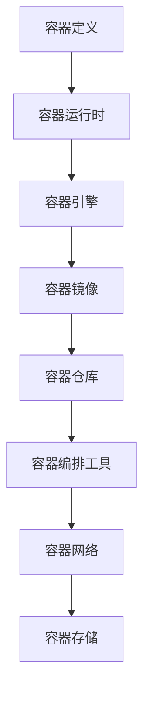
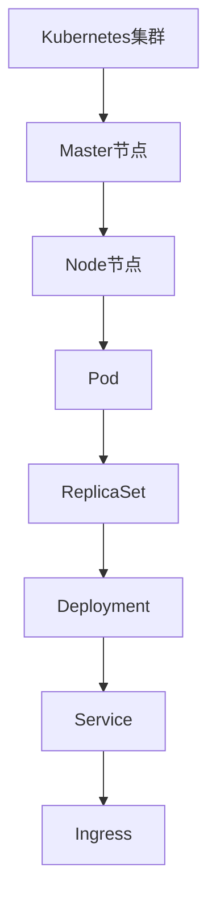
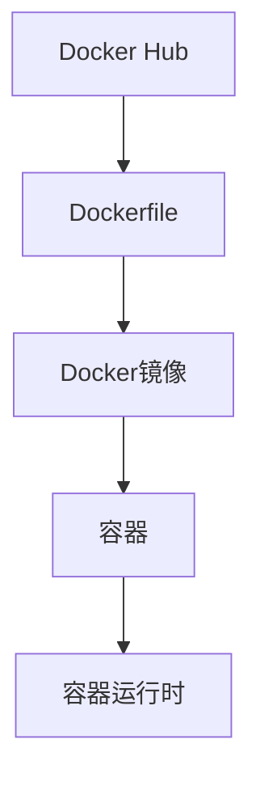
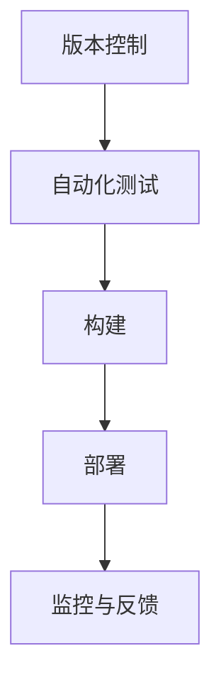

                 

关键词：容器化、部署、弹性伸缩、Kubernetes、Docker、微服务架构、持续集成与持续部署（CI/CD）、DevOps

摘要：本文将深入探讨容器化部署与弹性伸缩技术，涵盖其核心概念、原理、实施步骤以及实际应用场景。通过详细的代码实例和解释，读者将掌握如何利用Docker和Kubernetes等工具实现高效、可靠的容器化部署和自动化伸缩，为企业提供稳定的IT基础设施支持。

## 1. 背景介绍

### 容器化的兴起

随着云计算和微服务架构的普及，传统的软件部署方式逐渐暴露出诸多问题，如环境不一致、依赖复杂、部署效率低下等。容器化技术的出现，为解决这些问题提供了新的思路。容器化通过将应用程序及其运行环境打包成一个独立的、轻量级的容器镜像，实现了应用程序与基础架构的解耦。

### 弹性伸缩的需求

互联网应用的爆发式增长带来了对系统可用性、性能和可扩展性的极高要求。弹性伸缩技术允许系统根据实际负载自动调整资源，从而提高系统的稳定性和效率。在容器化环境中，弹性伸缩变得尤为重要，因为它可以有效地管理容器集群中的资源分配。

### DevOps与CI/CD

DevOps文化的兴起推动了持续集成与持续部署（CI/CD）流程的普及。CI/CD通过自动化测试和部署，大大加快了软件交付的速度，同时也提高了软件质量。容器化部署与弹性伸缩的整合，是DevOps实践中的重要环节。

## 2. 核心概念与联系

### 容器化

容器是一种轻量级、可移植的计算单位，可以独立运行在操作系统中。容器通过隔离机制，确保不同的容器之间不会相互干扰。



### Kubernetes

Kubernetes是一个开源的容器编排平台，负责管理容器化应用程序的生命周期，提供自动化部署、扩展和管理。



### Docker

Docker是一个开源的应用容器引擎，可以轻松地将应用程序及其依赖打包到一个可移植的容器镜像中。



### CI/CD

持续集成与持续部署是DevOps实践的关键部分，通过自动化测试和部署，实现快速、可靠的软件交付。



## 3. 核心算法原理 & 具体操作步骤

### 3.1 算法原理概述

容器化部署与弹性伸缩的核心算法原理包括：

- **容器镜像构建**：基于Dockerfile构建应用程序的容器镜像。
- **容器编排**：使用Kubernetes进行容器集群的自动化管理和调度。
- **弹性伸缩**：根据负载自动增加或减少集群中的节点数量。

### 3.2 算法步骤详解

#### 3.2.1 容器镜像构建

1. 编写Dockerfile，定义容器镜像的构建过程。
2. 使用Docker CLI构建容器镜像。
3. 将镜像推送到容器仓库。

#### 3.2.2 容器编排

1. 编写Kubernetes配置文件，定义应用程序的部署和伸缩策略。
2. 使用kubectl工具部署应用程序。
3. 监控集群状态，根据需要进行调整。

#### 3.2.3 弹性伸缩

1. 监控集群的负载情况。
2. 根据负载情况自动增加或减少节点数量。
3. 调整Pod的副本数量，确保服务可用性。

### 3.3 算法优缺点

#### 优缺点

- **容器化**：优点包括轻量级、可移植性、高效性；缺点可能涉及安全性问题和容器镜像的依赖管理。
- **Kubernetes**：优点包括高可用性、自动恢复、易于扩展；缺点可能涉及学习曲线和管理复杂性。
- **弹性伸缩**：优点包括自动化、高效资源利用；缺点可能涉及初始配置的复杂性。

### 3.4 算法应用领域

容器化部署与弹性伸缩技术广泛应用于互联网公司、云服务提供商和企业内部IT基础设施，为各类应用场景提供强大的支持。

## 4. 数学模型和公式 & 详细讲解 & 举例说明

### 4.1 数学模型构建

弹性伸缩的数学模型通常基于负载预测和资源利用率。

- **负载预测**：使用历史数据和时间序列分析预测未来负载。
- **资源利用率**：计算当前资源的利用率，判断是否需要调整。

### 4.2 公式推导过程

- **负载预测**：使用移动平均法进行负载预测。
  
  $$ L_t = \frac{\sum_{i=1}^{n} L_i}{n} $$

  其中，$L_t$表示第$t$时刻的预测负载，$L_i$表示第$i$个时间点的实际负载，$n$为时间窗口的大小。

- **资源利用率**：计算当前节点的CPU和内存利用率。

  $$ CPU_{util} = \frac{CPU_{used}}{CPU_{total}} $$
  
  $$ MEM_{util} = \frac{MEM_{used}}{MEM_{total}} $$

  其中，$CPU_{used}$和$MEM_{used}$分别表示已使用的CPU和内存，$CPU_{total}$和$MEM_{total}$分别表示总CPU和总内存。

### 4.3 案例分析与讲解

假设一个电子商务网站在促销期间流量激增，使用弹性伸缩策略进行资源调整。通过负载预测和资源利用率计算，系统自动增加了3个节点，并调整了Pod的副本数量。

## 5. 项目实践：代码实例和详细解释说明

### 5.1 开发环境搭建

1. 安装Docker。
2. 安装Kubernetes集群。
3. 安装并配置Kubernetes的CI/CD工具（如Helm）。

### 5.2 源代码详细实现

#### 5.2.1 Dockerfile

```Dockerfile
# 使用官方Python镜像作为基础镜像
FROM python:3.9-slim

# 设置工作目录
WORKDIR /app

# 将应用代码复制到容器内
COPY . .

# 安装依赖
RUN pip install -r requirements.txt

# 暴露应用端口
EXPOSE 8000

# 运行应用
CMD ["gunicorn", "app:app", "--bind", "0.0.0.0:8000"]
```

#### 5.2.2 Kubernetes配置文件（deployment.yaml）

```yaml
apiVersion: apps/v1
kind: Deployment
metadata:
  name: web-app
spec:
  replicas: 3
  selector:
    matchLabels:
      app: web-app
  template:
    metadata:
      labels:
        app: web-app
    spec:
      containers:
      - name: web-app
        image: myrepo/web-app:latest
        ports:
        - containerPort: 8000
```

### 5.3 代码解读与分析

- **Dockerfile**：定义了容器镜像的构建过程，从官方Python镜像开始，安装依赖，暴露应用端口，并指定应用的主进程。
- **Kubernetes配置文件**：定义了Deployment，用于管理应用程序的部署和伸缩。

### 5.4 运行结果展示

1. 构建并推送容器镜像到仓库。
2. 使用kubectl部署应用程序。
3. 观察集群状态，确认应用正常运行。

## 6. 实际应用场景

### 6.1 高并发电商网站

容器化部署与弹性伸缩在电商网站中应用广泛，尤其是在促销高峰期，系统能够自动扩展资源，保证服务的稳定性和性能。

### 6.2 大型企业级应用

容器化技术为企业级应用提供了灵活的部署方式，通过Kubernetes进行自动化管理和调度，降低了运维成本。

### 6.3 云服务提供商

云服务提供商利用容器化技术和弹性伸缩，提供弹性的计算资源，满足客户不同的需求。

## 7. 工具和资源推荐

### 7.1 学习资源推荐

- Kubernetes官方文档：[https://kubernetes.io/docs/](https://kubernetes.io/docs/)
- Docker官方文档：[https://docs.docker.com/](https://docs.docker.com/)

### 7.2 开发工具推荐

- Kubernetes命令行工具（kubectl）：[https://kubernetes.io/docs/reference/kubectl/](https://kubernetes.io/docs/reference/kubectl/)
- Helm：[https://helm.sh/](https://helm.sh/)

### 7.3 相关论文推荐

- "Docker: Lightweight Linux Containers for Developments" by Solomon, S., & Palkar, R.
- "Kubernetes: Design and Implementation" by Adkins, M., & Hindman, B.

## 8. 总结：未来发展趋势与挑战

### 8.1 研究成果总结

容器化部署与弹性伸缩技术在近年来取得了显著成果，广泛应用于各类应用场景，为IT基础设施提供了强大的支持。

### 8.2 未来发展趋势

- **自动化与智能化**：随着AI技术的发展，容器化部署与弹性伸缩将进一步智能化，提高资源利用率和运维效率。
- **多云与多平台**：容器化技术将在多云和跨平台环境中发挥更大的作用，提供更加灵活的部署方案。

### 8.3 面临的挑战

- **安全性**：容器化环境的普及带来了新的安全挑战，需要加强容器镜像的扫描和安全管理。
- **兼容性**：不同容器化平台之间的兼容性仍然是一个问题，需要进一步统一标准和接口。

### 8.4 研究展望

容器化部署与弹性伸缩技术将继续发展，推动云计算和微服务架构的演进，为企业和用户提供更加高效、可靠的IT基础设施。

## 9. 附录：常见问题与解答

### 9.1 如何选择容器编排工具？

根据应用需求和团队经验，可以选择Kubernetes、Docker Swarm、Openshift等不同的容器编排工具。Kubernetes因其开源、社区活跃、功能强大而被广泛采用。

### 9.2 容器化部署与虚拟化技术有何区别？

容器化技术相比虚拟化技术具有更轻量级、更高效的特点，容器直接运行在宿主机的操作系统上，而不需要额外的虚拟机层。虚拟化技术通过虚拟机隔离应用程序，提供更完善的隔离性和灵活性。

## 作者署名

作者：禅与计算机程序设计艺术 / Zen and the Art of Computer Programming
----------------------------------------------------------------

请注意，本文档只是一个模板和示例，实际撰写时需要根据具体的内容和要求进行调整和补充。务必遵循“约束条件 CONSTRAINTS”中的所有要求，确保文章内容完整、结构清晰、逻辑严密。文章撰写完成后，可以通过多次审阅和校对来确保质量。祝您写作顺利！

