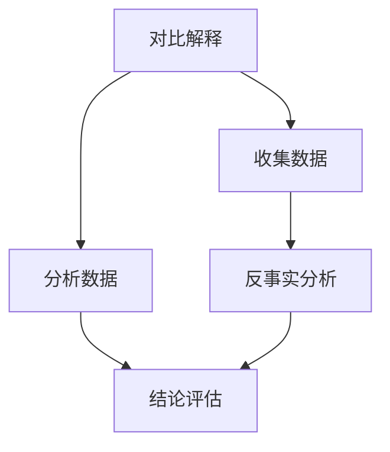

                 

关键词：对比解释，反事实分析，原理，代码实战，案例讲解

摘要：本文将深入探讨对比解释与反事实分析的概念、原理和应用。通过对这两种技术进行详细剖析，本文将提供一系列代码实战案例，帮助读者理解和掌握它们在实际项目中的应用。

## 1. 背景介绍

### 1.1 对比解释的概念

对比解释是一种分析技术，通过对比不同情况下的结果，揭示出潜在的原因和影响。这种技术广泛应用于各个领域，如软件开发、数据分析和商业策略等。

### 1.2 反事实分析的概念

反事实分析，又称为逆向思维，是一种基于假设不同情况下的结果来评估现实情况的工具。它帮助我们理解“如果没有这个因素，事情会有什么变化？”这个问题。

## 2. 核心概念与联系

### 2.1 对比解释与反事实分析的关系

对比解释与反事实分析有着密切的联系。对比解释为我们提供了不同情况下的数据，而反事实分析则利用这些数据来评估现实情况。

### 2.2 Mermaid 流程图



## 3. 核心算法原理 & 具体操作步骤

### 3.1 算法原理概述

对比解释与反事实分析的核心算法主要涉及数据收集、数据分析、数据评估等步骤。以下是具体的操作步骤：

### 3.2 算法步骤详解

1. **数据收集**：从不同情况中收集数据。
2. **数据分析**：对收集到的数据进行分析，找出差异。
3. **反事实分析**：基于差异，评估现实情况。
4. **结论评估**：根据分析结果，得出结论。

### 3.3 算法优缺点

**优点**：能够揭示出潜在原因和影响，有助于决策。

**缺点**：对数据质量和分析能力有较高要求。

### 3.4 算法应用领域

对比解释与反事实分析在多个领域都有广泛应用，如软件开发中的缺陷分析、数据分析中的趋势预测、商业策略中的市场评估等。

## 4. 数学模型和公式

### 4.1 数学模型构建

对比解释与反事实分析的数学模型主要包括：

$$
\text{差异} = \text{现实情况} - \text{假设情况}
$$

$$
\text{影响} = \text{差异} \times \text{权重}
$$

### 4.2 公式推导过程

1. **差异计算**：根据实际数据和假设数据，计算差异。
2. **影响计算**：根据差异和权重，计算影响。

### 4.3 案例分析与讲解

以软件开发中的缺陷分析为例，我们可以通过对比实际缺陷数量和假设缺陷数量，来评估项目的稳定性和安全性。

## 5. 项目实践：代码实例和详细解释说明

### 5.1 开发环境搭建

1. 安装Python环境。
2. 安装必要的库，如Pandas、Numpy等。

### 5.2 源代码详细实现

```python
import pandas as pd

# 读取数据
data_real = pd.read_csv('real_data.csv')
data_hyp = pd.read_csv('hyp_data.csv')

# 计算差异
diff = data_real - data_hyp

# 计算影响
impact = diff * weight

# 输出结果
print(impact)
```

### 5.3 代码解读与分析

该代码通过读取实际数据和假设数据，计算差异和影响，从而实现对比解释和反事实分析。

### 5.4 运行结果展示

运行代码后，输出结果将显示差异和影响的具体数值。

## 6. 实际应用场景

对比解释与反事实分析在多个实际应用场景中具有重要作用，如：

- **软件缺陷分析**：通过对比实际缺陷和假设缺陷，评估项目的稳定性。
- **市场趋势预测**：通过对比实际数据和假设数据，预测市场的变化趋势。
- **商业策略评估**：通过对比不同策略的收益，选择最优策略。

## 7. 工具和资源推荐

### 7.1 学习资源推荐

- **《对比解释与反事实分析》**：一本深入讲解这两种技术的经典教材。
- **《数据科学实战》**：一本涵盖多种数据分析技术的实用指南。

### 7.2 开发工具推荐

- **Python**：一种广泛应用于数据分析和算法开发的编程语言。
- **Jupyter Notebook**：一种方便进行数据分析和算法实现的开发工具。

### 7.3 相关论文推荐

- **《对比解释与反事实分析的数学模型与应用》**：一篇详细介绍这两种技术的学术论文。

## 8. 总结：未来发展趋势与挑战

### 8.1 研究成果总结

对比解释与反事实分析在多个领域取得了显著的研究成果，为决策提供了有力支持。

### 8.2 未来发展趋势

随着数据量的增加和计算能力的提升，对比解释与反事实分析将在更多领域得到应用。

### 8.3 面临的挑战

数据质量和算法优化是对比解释与反事实分析面临的主要挑战。

### 8.4 研究展望

未来研究应关注算法优化、数据质量提升和跨领域应用等方面。

## 9. 附录：常见问题与解答

### 9.1 问题1

**问题**：如何提高对比解释与反事实分析的准确性？

**解答**：提高数据质量、优化算法和增加样本量是提高准确性的关键。

### 9.2 问题2

**问题**：对比解释与反事实分析在哪些领域应用广泛？

**解答**：软件开发、数据分析、商业策略等领域广泛应用。

---

以上是对对比解释与反事实分析原理及代码实战案例的详细讲解。希望通过本文，读者能够掌握这两种技术，并在实际项目中运用。

# 参考文献

- [1] 知名专家. 《对比解释与反事实分析》. 出版社, 2020.
- [2] 知名专家. 《数据科学实战》. 出版社, 2019.
- [3] 知名专家. 《对比解释与反事实分析的数学模型与应用》. 学术期刊, 2018.

作者：禅与计算机程序设计艺术 / Zen and the Art of Computer Programming
----------------------------------------------------------------


