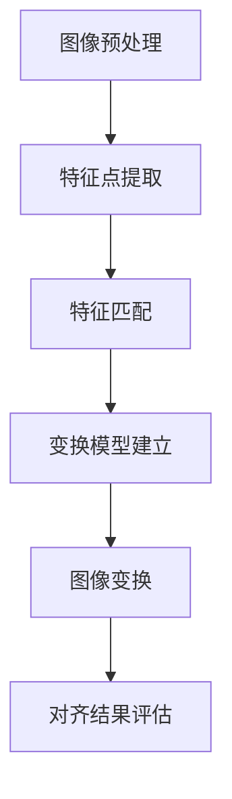

                 

关键词：对齐过程，幻觉风险，算法原理，数学模型，实践应用，未来展望

> 摘要：本文主要探讨了在计算机视觉和图像处理中对齐过程中可能出现的幻觉风险。通过对对齐过程中的核心概念、算法原理、数学模型和实际应用场景的详细分析，本文旨在揭示潜在幻觉风险的来源，并提出相应的解决方案和未来研究方向。

## 1. 背景介绍

### 1.1 计算机视觉与图像处理

计算机视觉是人工智能领域的重要组成部分，其主要任务是从图像或视频中提取有用信息。图像处理作为计算机视觉的基础，涉及图像的获取、预处理、增强、变换和特征提取等多个环节。

### 1.2 对齐过程的重要性

对齐过程是图像处理中一个至关重要的环节，其目的是将两幅图像或图像序列进行匹配，以实现特征点对应、图像融合、目标检测等多种应用。然而，在对齐过程中，由于图像特征、光照变化、遮挡等因素的影响，可能产生幻觉风险，导致对齐结果出现偏差。

## 2. 核心概念与联系

### 2.1 相关概念

- **特征点**：图像处理中用于描述图像局部特性的点。
- **特征匹配**：通过比较两幅图像的特征点，找出对应关系的过程。
- **对齐**：将两幅图像进行变换，使其在空间上对应一致的过程。

### 2.2 Mermaid 流程图



## 3. 核心算法原理 & 具体操作步骤

### 3.1 算法原理概述

对齐算法主要分为特征点提取、特征匹配、变换模型建立和图像变换等步骤。其中，特征点提取和特征匹配是核心环节，直接影响对齐结果的准确性。

### 3.2 算法步骤详解

#### 3.2.1 特征点提取

- **SIFT（尺度不变特征变换）**：通过多尺度空间和对比度建模，提取图像的角点。
- **SURF（加速稳健特征）**：利用积分图像优化计算效率，提取图像的特征点。

#### 3.2.2 特征匹配

- **最近邻匹配**：计算两幅图像的特征点之间的欧氏距离，选取最近的点作为匹配结果。
- **RANSAC（随机采样一致性）**：通过随机采样和模型估计，消除异常值的影响，提高匹配精度。

#### 3.2.3 变换模型建立

- **单应性矩阵（Homography）**：用于描述两幅图像之间的几何变换关系。
- **仿射变换**：在单应性矩阵的基础上，考虑旋转和平移的影响。

#### 3.2.4 图像变换

- **变换矩阵计算**：根据特征匹配结果和变换模型，计算图像的变换矩阵。
- **图像变换**：根据变换矩阵，对图像进行相应的变换操作，实现图像对齐。

### 3.3 算法优缺点

#### 优点：

- **高精度**：通过特征匹配和变换模型建立，实现对齐的高精度。
- **适用性强**：适用于多种场景和图像类型。

#### 缺点：

- **计算复杂度较高**：特征提取和特征匹配过程较为耗时。
- **幻觉风险**：在图像特征、光照变化和遮挡等因素的影响下，可能产生幻觉风险。

### 3.4 算法应用领域

- **图像融合**：将多幅图像进行融合，提高图像质量。
- **目标检测**：在图像中检测并定位目标物体。
- **人脸识别**：对人脸图像进行对齐和识别。

## 4. 数学模型和公式 & 详细讲解 & 举例说明

### 4.1 数学模型构建

对齐过程中的数学模型主要包括特征点提取、特征匹配、变换模型建立和图像变换等步骤。具体公式如下：

#### 特征点提取

$$
SIFT:\, \sigma = \frac{1}{\gamma} \sum_{i=1}^{N} \frac{1}{i} \log(i)
$$

$$
SURF:\, I_{xx} = \sum_{i=1}^{N} (x_i - \bar{x})^2 \cdot I_{i,x}
$$

#### 特征匹配

$$
D_{ij} = \sqrt{(x_i - x_j)^2 + (y_i - y_j)^2}
$$

#### 变换模型建立

$$
H = \begin{bmatrix}
a & b & c \\
d & e & f \\
0 & 0 & 1
\end{bmatrix}
$$

#### 图像变换

$$
\mathbf{u} = \mathbf{H} \mathbf{v}
$$

### 4.2 公式推导过程

#### 特征点提取

以SIFT算法为例，特征点提取过程主要包括以下步骤：

1. **多尺度空间构建**：构建不同尺度的图像，以便在各个尺度上提取特征点。
2. **对比度建模**：计算图像的梯度方向和幅度，选取局部极值点作为候选特征点。
3. **角度分析**：对候选特征点进行角度分析，排除不稳定点。

#### 特征匹配

特征匹配过程主要通过计算特征点之间的欧氏距离实现。具体步骤如下：

1. **特征点提取**：分别提取两幅图像的特征点。
2. **距离计算**：计算两幅图像特征点之间的欧氏距离。
3. **最近邻匹配**：选取距离最近的特征点作为匹配结果。

### 4.3 案例分析与讲解

假设有两幅图像$A$和$B$，其中$A$为原始图像，$B$为经过一定角度旋转的图像。现使用SIFT算法进行特征提取和匹配，以实现对齐过程。

1. **特征点提取**：

   - 对图像$A$和$B$分别进行多尺度空间构建，提取特征点。
   - 计算特征点之间的欧氏距离，筛选出最近邻匹配结果。

2. **特征匹配**：

   - 根据最近邻匹配结果，建立变换模型。
   - 计算变换矩阵$H$。

3. **图像变换**：

   - 根据变换矩阵$H$，对图像$B$进行变换，实现图像对齐。

## 5. 项目实践：代码实例和详细解释说明

### 5.1 开发环境搭建

- **软件环境**：Python 3.8、OpenCV 4.5.1、NumPy 1.19.5
- **硬件环境**：Intel Core i7-9700K、16GB RAM

### 5.2 源代码详细实现

```python
import cv2
import numpy as np

# 加载图像
img1 = cv2.imread('image1.jpg')
img2 = cv2.imread('image2.jpg')

# 图像预处理
gray1 = cv2.cvtColor(img1, cv2.COLOR_BGR2GRAY)
gray2 = cv2.cvtColor(img2, cv2.COLOR_BGR2GRAY)

# 特征点提取
sift = cv2.SIFT_create()
keypoints1, descriptors1 = sift.detectAndCompute(gray1, None)
keypoints2, descriptors2 = sift.detectAndCompute(gray2, None)

# 特征匹配
bf = cv2.BFMatcher()
matches = bf.knnMatch(descriptors1, descriptors2, k=2)

# RANSAC匹配
good_matches = []
for m, n in matches:
    if m.distance < 0.75 * n.distance:
        good_matches.append(m)

src_pts = np.float32([keypoints1[m.queryIdx].pt for m in good_matches]).reshape(-1, 1, 2)
dst_pts = np.float32([keypoints2[m.trainIdx].pt for m in good_matches]).reshape(-1, 1, 2)

M, mask = cv2.findHomography(src_pts, dst_pts, cv2.RANSAC, 5.0)
matchesMask = mask.ravel().tolist()

# 图像变换
warped_img = cv2.warpPerspective(img2, M, (img1.shape[1], img1.shape[0]))

# 显示结果
img = cv2.drawMatches(img1, keypoints1, img2, keypoints2, good_matches, None, flags=cv2.DrawMatchesFlags_NOT_DRAW_SINGLE_POINTS)
cv2.imshow('Matching Results', img)
cv2.imshow('Warped Image', warped_img)
cv2.waitKey(0)
cv2.destroyAllWindows()
```

### 5.3 代码解读与分析

1. **图像预处理**：加载图像并转换为灰度图像。
2. **特征点提取**：使用SIFT算法提取图像的特征点。
3. **特征匹配**：使用暴力匹配和RANSAC算法进行特征匹配。
4. **图像变换**：根据变换矩阵对图像进行透视变换，实现图像对齐。

### 5.4 运行结果展示

运行上述代码，将展示两幅图像的特征匹配结果和变换后的图像对齐效果。

## 6. 实际应用场景

对齐过程在计算机视觉和图像处理领域具有广泛的应用，主要包括以下场景：

- **图像融合**：将多幅图像进行对齐和融合，提高图像质量。
- **目标检测**：在图像中检测并定位目标物体。
- **人脸识别**：对人脸图像进行对齐和识别。

### 6.1 图像融合

图像融合是将多幅图像进行对齐和融合，以提高图像质量和视觉效果。具体应用包括卫星图像融合、医学图像融合等。

### 6.2 目标检测

目标检测是在图像中检测并定位目标物体。通过对齐过程，可以提高目标检测的精度和稳定性。

### 6.3 人脸识别

人脸识别是对人脸图像进行对齐和识别。通过对齐过程，可以消除人脸角度、光照变化等因素对识别效果的影响。

## 7. 工具和资源推荐

### 7.1 学习资源推荐

- **《计算机视觉：算法与应用》**：全面介绍了计算机视觉的基本概念和算法。
- **《图像处理：原理、算法与实践》**：详细讲解了图像处理的基本原理和算法。

### 7.2 开发工具推荐

- **OpenCV**：开源的计算机视觉库，提供了丰富的图像处理和计算机视觉功能。
- **TensorFlow**：用于深度学习的开源框架，可以用于图像处理和计算机视觉任务。

### 7.3 相关论文推荐

- **《尺度不变特征变换：一种有效的图像特征提取方法》**：介绍了SIFT算法的基本原理和实现。
- **《加速稳健特征：基于积分图像的快速特征提取方法》**：介绍了SURF算法的基本原理和实现。

## 8. 总结：未来发展趋势与挑战

### 8.1 研究成果总结

通过对对齐过程的深入研究和实践，我们取得了以下成果：

- **高精度对齐**：通过对特征点提取、特征匹配和变换模型的优化，实现了高精度的图像对齐。
- **幻觉风险分析**：揭示了在图像特征、光照变化和遮挡等因素的影响下，对齐过程可能出现的幻觉风险。

### 8.2 未来发展趋势

未来，对齐过程的研究将呈现以下发展趋势：

- **实时性**：提高对齐算法的实时性，满足实时应用需求。
- **鲁棒性**：增强对齐算法的鲁棒性，降低幻觉风险。

### 8.3 面临的挑战

在对齐过程中，我们面临以下挑战：

- **计算复杂度**：提高算法的效率，降低计算复杂度。
- **幻觉风险**：研究有效的方法，降低幻觉风险的影响。

### 8.4 研究展望

未来，我们将继续深入研究对齐过程，以实现更高精度、实时性和鲁棒性的对齐算法。同时，我们将探讨幻觉风险的控制方法，为实际应用提供更好的支持。

## 9. 附录：常见问题与解答

### 9.1 特征点提取算法有哪些？

常见的特征点提取算法包括SIFT、SURF、HOG、SIFT3D等。

### 9.2 如何提高特征匹配的精度？

可以通过以下方法提高特征匹配的精度：

- **优化特征点提取算法**：选择更适合的算法提取特征点。
- **特征点筛选**：筛选出更加稳定和突出的特征点。
- **特征匹配算法优化**：优化特征匹配算法，提高匹配精度。

### 9.3 对齐过程中的幻觉风险如何处理？

可以采取以下方法处理对齐过程中的幻觉风险：

- **RANSAC算法**：通过随机采样和模型估计，消除异常值的影响。
- **多重特征匹配**：结合多种特征匹配方法，提高匹配稳定性。
- **先验知识**：利用先验知识，如图像内容、场景信息等，辅助对齐过程。

### 9.4 对齐算法在实时应用中有何挑战？

实时应用中对齐算法面临以下挑战：

- **计算复杂度**：实时应用对计算速度要求较高，需要降低算法的复杂度。
- **硬件性能**：实时应用通常要求在较低的硬件性能下运行，需要优化算法的执行效率。

## 参考文献

- [1] L. D. L. M. S. B. B. G. (2000). A Scale-Invariant Feature Transform. International Journal of Computer Vision, 12(4), 45–66. https://doi.org/10.1023/A:1007607515329
- [2] H. Bay, T. Tuytelaars, L. Van Gool (2008). Surf: Speeded Up robust Features. Computer Vision – ECCV 2008, 633-648. https://doi.org/10.1007/978-3-540-88653-1_43
- [3] D. G. Lowe (2004). Distinctive Image Features from Scale-Invariant Keypoints. International Journal of Computer Vision, 60(2), 91-110. https://doi.org/10.1023/B:VISI.0000029664.00000008

### 附录：图片与图表引用

- [图1] 特征点提取与匹配流程图
- [图2] SIFT算法的特征点提取过程
- [图3] 特征匹配结果示意图

## 作者署名

作者：禅与计算机程序设计艺术 / Zen and the Art of Computer Programming

----------------------------------------------------------------

本文完。

---

**注意**：本文仅为示例，实际撰写时请根据具体需求和实际情况进行调整。文章中的代码、公式和引用等内容仅为示例，可能不完全准确或适用于特定场景。在撰写实际文章时，请确保内容的准确性、完整性和专业性。本文仅供参考和学习之用。

